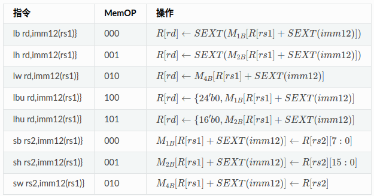

- [实验十 CPU数据通路](#实验十-cpu数据通路)
  - [寄存器堆](#寄存器堆)
    - [如何实现x0寄存器](#如何实现x0寄存器)
      - [代码的实现 RegisterFile.v](#代码的实现-registerfilev)
      - [测试 tb\_RegisterFile.v](#测试-tb_registerfilev)
      - [测试结果](#测试结果)
  - [ALU](#alu)
    - [ALU.v](#aluv)
  - [数据存储器](#数据存储器)
    - [存储访问指令与Memop对应关系解读](#存储访问指令与memop对应关系解读)
      - [加载指令](#加载指令)
      - [存储指令](#存储指令)
    - [代码的实现](#代码的实现)
    - [测试 tb\_ram\_mem.v](#测试-tb_ram_memv)
    - [测试结果](#测试结果-1)


# 实验十 CPU数据通路
## 寄存器堆
### 如何实现x0寄存器
**个人思考：** 寄存器x0需要特殊处理，不论何时都是全零。方法一：将x0寄存器的写使能信号设计为始终禁用，禁止任何写入操作到该寄存器。同时，不管外部的写入信号是否有效，x0寄存器的值始终被硬件强制为零。方法二：直接输出零，如果x0寄存器的逻辑是一个只读寄存器（RO），我们可以直接在读取时将它的输出固定为零。例如，如果设计中有一个多路选择器（MUX）来从寄存器文件中选择数据输出，我们可以为x0寄存器配置一个特殊的MUX，使得无论什么时候读取x0，它都返回零。
#### 代码的实现 RegisterFile.v
```
module RegisterFile(
    input [4:0] Ra,             //读地址，对应risc-v rs1
    input [4:0] Rb,             //读地址，对应risc-v rs2
    input [4:0] Rw,             //写地址，对应rd
    input [31:0] busW,          //写入的数据
    input RegWr,                //写入有效控制，高电平有效
    input WrClk,                //控制写入的时钟信号
    output reg [31:0] busA,     //输出A
    output reg [31:0] busB      //输出B
);

    //寄存器堆
    reg [31:0] regfile [0:31];

    //处理x0寄存器
    initial begin
        regfile[0] = 32'b0;     //x0寄存器总是为0
    end

    //读取操作（异步）
    always @(*) begin
        if(Ra == 5'b0) begin
            busA = 32'b0;       //如果是x0地址，则返回0
        end else begin
            busA = regfile[Ra];
        end

        if(Rb == 5'b0) begin
            busB = 32'b0;       //如果是x0地址，则返回0
        end  else begin
            busB = regfile[Rb];
        end
    end

    //写操作
    always @(negedge WrClk) begin
            if(RegWr && Rw != 5'b0) begin
            regfile[Rw] <= busW;    //写数据到指定寄存器
        end
    end
endmodule
```
#### 测试 tb_RegisterFile.v
```
module tb_RegisterFile;
    //接口信号
    reg [4:0] Ra;
    reg [4:0] Rb;
    reg [4:0] Rw;
    reg [31:0] busW;
    reg RegWr;
    reg WrClk;
    wire [31:0] busA;
    wire [31:0] busB;

    //实例化被测试模块
    RegisterFile uut(
        .Ra(Ra),
        .Rb(Rb),
        .Rw(Rw),
        .busW(busW),
        .RegWr(RegWr),
        .WrClk(WrClk),
        .busA(busA),
        .busB(busB)
    );

    //生成时钟信号
    always begin
        WrClk = 0;
        forever #5 WrClk = ~WrClk;
    end


    //测试逻辑
    initial begin
        //初始化
        Ra = 5'b0;
        Rb = 5'b0;
        Rw = 5'b0;
        busW = 32'b0;
        RegWr = 1'b0;

        //等待复位
        #10;

        //测试
        Rw = 5'd1;
        busW = 32'hA5A5A5A5;
        RegWr = 1'b1;
        #10;

        //验证写入数据
        RegWr = 1'b0;
        Ra = 5'd1;
        Rb = 5'd0;
        #10;
        $display("busA = %h (预期: A5A5A5A5)", busA);
        $display("busB = %h (预期: 00000000)", busB);

        //测试写入另一个寄存器
        Rw = 5'd2;
        busW = 32'h6B6B6B6B;
        RegWr = 1'b1;
        #10;

        //验证写入和多路读取
        RegWr = 1'b0;
        Ra = 5'd2;
        Rb = 5'd1;
        #10;
        $display("busA = %h (预期: 6B6B6B6B)", busA);
        $display("busB = %h (预期: A5A5A5A5)", busB);

        //测试写入 x0
        Rw = 5'd0;
        busW = 32'hFFFFFFFF;
        RegWr = 1'b1;
        #10;

        //验证x0应该仍为0
        RegWr = 1'b0;
        Ra = 5'd0;
        #10;
        $display("busA = %h (预期: 00000000)", busA);

        $finish;

    end

endmodule

```
#### 测试结果
```
$ ./RegisterFile_tb
busA = a5a5a5a5 (预期: A5A5A5A5)
busB = 00000000 (预期: 00000000)
busA = 6b6b6b6b (预期: 6B6B6B6B)
busB = a5a5a5a5 (预期: A5A5A5A5)
busA = 00000000 (预期: 00000000)

```
## ALU
根据之前的ALU模块进行了改进。
### ALU.v
```
module ALU(
    input [31:0] A,             //输入数A
    input [31:0] B,             //输入数B
    input [3:0] ALUctr,         //输入ALUctr
    output Less,            //输出符号标志
    output Zero,            //零标志
    output reg [31:0] ALUout    //输出ALUout
);

    //内部信号
    wire [2:0] actr;            //最后8选1的控制信号

    //A/L控制移位器进行算术移位还是逻辑移位，L/R控制是左移还是右移
    //U/S控制比较大小是带符号比较还是无符号比较，S/A控制是加法还是减法。
    wire a_l, l_r, u_s, Cin;
    
    //进位，溢出位
    wire carry, overflow;
    wire [31:0] result;            //加法结果

    //移位结果，逻辑运算结果，带（无）符号小于置位结果输出
    wire [31:0] shift, i_XOR, i_AND, i_OR, sit;


    //实例化
    alu_control u_a_control(
        .ALUctr(ALUctr),
        .actr(actr),
        .a_l(a_l),
        .l_r(l_r),
        .u_s(u_s),
        .Cin(Cin)
    );

    adder u_adder(
        .A1(A),
        .B1(B),
        .Cin(Cin),
        .Carry(carry),
        .Overflow(overflow),
        .Result(result),
        .Zero(Zero)
    );

    adder_less u_al(
        .Carry(carry),
        .Overflow(overflow),
        .Cin(Cin),
        .i_Result(result),
        .u_s(u_s),
        .o_Result(sit),
        .Less(Less)
    );

    barrel_shifter u_bs(
        .Din(A),
        .B1(B),
        .l_r(l_r),
        .a_l(a_l),
        .shift(shift)
    );

    log_and u_l_and(
        .i_a(A),
        .i_b(B),
        .o_result(i_AND)
    );

    log_or u_l_or(
        .i_a(A),
        .i_b(B),
        .o_result(i_OR)
    );

    log_xor u_l_xor(
        .i_a(A),
        .i_b(B),
        .o_result(i_XOR)
    );


    //8选1,输出
    always @(*) begin
        case (actr)
            3'b000: ALUout = result;        // 选择加法结果
            3'b001: ALUout = shift;         // 选择左移结果
            3'b010: ALUout = sit;           // 选择带符号/无符号小于结果
            3'b011: ALUout = B;             // 直接输出B
            3'b100: ALUout = i_XOR;         // 选择异或输出
            3'b101: ALUout = shift;         // 选择右移结果
            3'b110: ALUout = i_OR;          // 选择逻辑或输出
            3'b111: ALUout = i_AND;         // 选择逻辑与输出
            default: ALUout = 32'b0;        // 默认输出0
        endcase
    end

endmodule
```
## 数据存储器
### 存储访问指令与Memop对应关系解读
  
#### 加载指令
**指令：** lb rd,imm12(rs1)  
**MemOP：** 000  
**操作：** R[rd] ← SEXT(M1b[R[rs1] + SEXT(imm12)])。  
**解释：** 将内存地址 R[rs1] + SEXT(imm12) 处的字节（8位）加载到寄存器 rd，并进行符号扩展（SEXT）。   

**指令：** lh rd,imm12(rs1)  
**MemOP：** 001  
**操作：** R[rd] ← SEXT(M2b[R[rs1] + SEXT(imm12)])  
**解释：** 将内存地址 R[rs1] + SEXT(imm12) 处的半字（16位）加载到寄存器 rd，并进行符号扩展（SEXT）。  

**指令：** lw rd,imm12(rs1)
**MemOP：** 010  
**操作：** R[rd] ← M4b[R[rs1] + SEXT(imm12)]  
**解释：** 将内存地址 R[rs1] + SEXT(imm12) 处的字（32位）加载到寄存器 rd。  

**指令：** lbu rd,imm12(rs1)  
**MemOP：** 100  
**操作：** R[rd] ← {24'b0, M1b[R[rs1] + SEXT(imm12)]}  
**解释：** 将内存地址 R[rs1] + SEXT(imm12) 处的字节（8位）加载到寄存器 rd，并将其扩展为无符号。  

**指令：** lhu rd,imm12(rs1)  
**MemOP：** 101  
**操作：** R[rd] ← {16'b0, M2b[R[rs1] + SEXT(imm12)]}  
**解释：** 将内存地址 R[rs1] + SEXT(imm12) 处的半字（16位）加载到寄存器 rd，并将其扩展为无符号。  

#### 存储指令
**指令：** sb rs2,imm12(rs1)  
**MemOP：** 000  
**操作：** M1b[R[rs1] + SEXT(imm12)] ← R[rs2][7:0]  
**解释：** 将寄存器 rs2 中的低8位（R[rs2][7:0]）存储到内存地址 R[rs1] + SEXT(imm12)。  

**指令：** sh rs2,imm12(rs1)  
**MemOP：** 001  
**操作：** M2b[R[rs1] + SEXT(imm12)] ← R[rs2][15:0]  
**解释：** 将寄存器 rs2 中的低16位（R[rs2][15:0]）存储到内存地址 R[rs1] + SEXT(imm12)。  

**指令：** sw rs2,imm12(rs1)  
**MemOP：** 010  
**操作：** M4b[R[rs1] + SEXT(imm12)] ← R[rs2]  
**解释：** 将寄存器 rs2 中的低32位（R[rs2]）存储到内存地址 R[rs1] + SEXT(imm12)。  
### 代码的实现
```
module ram_mem(
    input [31:0] rs1,                   //rs1寄存器，用于地址计算
    input [31:0] rs2,                   //rs2寄存器，用于存储操作
    input [31:0] imm12,                 //立即数
    input [3:0] MemOP,                  //内存操作类型
    input [31:0] memory_data_in,        //存储器写入数据
    output reg [31:0] result,           //存储操作的结果或加载操作的结果
    output reg [31:0] memory_data_out,  //内存读取数据
    output reg memory_write,            //内存写使能信号
    output reg [3:0] byte_we            //内存字节写使能信号（用于存储）
    );

    wire [31:0] address;                //计算出来的内存地址
    reg [7:0] byte_data;                //用于字节操作
    reg [15:0] halfword_data;           //用于半字操作
    reg [31:0] word_data;               //用于字操作


    //计算内存地址
    assign address = rs1 + imm12;

    //根据MemOP执行不同的内存访问操作
    always @(*) begin
        memory_write = 0;
        byte_we = 4'b0000;

        case(MemOP)
            4'b0000: begin     //sb
                memory_write = 1;       //启用内存写
                byte_we = 4'b0001;      //仅写入最低8位
                result = 32'b0;         //无需输出结果
            end
            
            4'b0001: begin      //sh
                memory_write = 1;       //启用内存写
                byte_we = 4'b0011;      //仅写入低16位
                result = 32'b0;         //无需输出结果
            end

            4'b0010: begin      //sw
                memory_write = 1;       //启用内存写
                byte_we = 4'b1111;      //写入整个字
                result = 32'b0;         //无需输出结果
            end

            4'b0100: begin      //lb
                memory_write = 0;
                byte_data = memory_data_in[7:0]; // 提取最低 8 位
                result = {{24{byte_data[7]}}, byte_data}; // 符号扩展
                memory_data_out = result;
            end 

            4'b0101: begin      //lh
                memory_write = 0;              //禁用内存写
                halfword_data = memory_data_in[15:0];   //从内存中读取半字数据
                result = {{16{halfword_data[15]}}, halfword_data};  //符号扩展
                memory_data_out = result;      //输出结果
            end

            4'b0110: begin      //lw
                memory_write = 0;              //禁用内存写
                word_data = memory_data_in;    //从内存中读取字数据
                result = word_data;            //无符号扩展
                memory_data_out = result;      // 出结果
            end

            4'b0111: begin      //bu
                memory_write = 0;                   //禁用内存写
                byte_data = memory_data_in[7:0];    //从内存中读取字节数据
                result = {24'b0, byte_data};        //无符号扩展
                memory_data_out = result;           //输出结果
            end

            4'b1000: begin      //lhu
                memory_write = 0;                       //禁用内存写
                halfword_data = memory_data_in[15:0];   //从内存中读取半字数据
                result = {16'b0, halfword_data};        //无符号扩展
                memory_data_out = result;               //输出结果
            end

            default: begin
                memory_write = 0;
                byte_we = 4'b0000;
                result = 32'b0;
                memory_data_out = 32'b0;
            end

        endcase
    end

endmodule
```
### 测试 tb_ram_mem.v
```
`timescale 1ns / 1ps

module tb_ram_mem;
    //接口信号
    reg [31:0] rs1;
    reg [31:0] rs2;
    reg [31:0] imm12;
    reg [3:0] MemOP;
    reg [31:0] memory_data_in;
    wire [31:0] result;
    wire [31:0] memory_data_out;
    wire memory_write;
    wire [3:0] byte_we;

    // 被测试模块实例化
    ram_mem uut (
        .rs1(rs1),
        .rs2(rs2),
        .imm12(imm12),
        .MemOP(MemOP),
        .memory_data_in(memory_data_in),
        .result(result),
        .memory_data_out(memory_data_out),
        .memory_write(memory_write),
        .byte_we(byte_we)
    );

    // 模拟测试逻辑
    initial begin
        // 初始化信号
        rs1 = 32'h1000;
        rs2 = 32'h0;
        imm12 = 32'h0;
        MemOP = 4'b0;
        memory_data_in = 32'h0;
        #10;

        // 测试 1: 存储字节 (sb)
        imm12 = 32'h4;
        MemOP = 4'b0000; // sb
        memory_data_in = 32'hAABBCCDD;
        #10;
        $display("测试1 (sb): memory_write = %b, byte_we = %b", memory_write, byte_we);

        // 测试 2: 存储半字 (sh)
        MemOP = 4'b0001; // sh
        memory_data_in = 32'hAABBCCDD;
        #10;
        $display("测试2 (sh): memory_write = %b, byte_we = %b", memory_write, byte_we);

        // 测试 3: 存储字 (sw)
        MemOP = 4'b0010; // sw
        memory_data_in = 32'hAABBCCDD;
        #10;
        $display("测试3 (sw): memory_write = %b, byte_we = %b", memory_write, byte_we);

        // 测试 4: 加载字节 (lb)
        MemOP = 4'b0100; // lb
        memory_data_in = 32'hFF123456; // 数据从内存读取
        #10;
        $display("测试4 (lb): result = %h", result);

        // 测试 5: 加载半字 (lh)
        MemOP = 4'b0101; // lh
        memory_data_in = 32'hFFFF1234; // 数据从内存读取
        #10;
        $display("测试5 (lh): result = %h", result);

        // 测试 6: 加载字 (lw)
        MemOP = 4'b0110; // lw
        memory_data_in = 32'h12345678; // 数据从内存读取
        #10;
        $display("测试6 (lw): result = %h", result);

        // 测试 7: 加载字节无符号 (lbu)
        MemOP = 4'b0111; // lbu
        memory_data_in = 32'hFF123456; // 数据从内存读取
        #10;
        $display("测试7 (lbu): result = %h", result);

        // 测试 8: 加载半字无符号 (lhu)
        MemOP = 4'b1000; // lhu
        memory_data_in = 32'hFFFF1234; // 数据从内存读取
        #10;
        $display("测试8 (lhu): result = %h", result);

        // 结束测试
        $finish;
    end
endmodule

```
### 测试结果
```
yjx@yjx-Lenovo-Legion-R7000-2020:~/Mystudy/yjx_learn/Learn_ver/ex10/ram$ ./ram_mem_tb
测试1 (sb): memory_write = 1, byte_we = 0001
测试2 (sh): memory_write = 1, byte_we = 0011
测试3 (sw): memory_write = 1, byte_we = 1111
测试4 (lb): result = 00000056
测试5 (lh): result = 00001234
测试6 (lw): result = 12345678
测试7 (lbu): result = 00000056
测试8 (lhu): result = 00001234

```