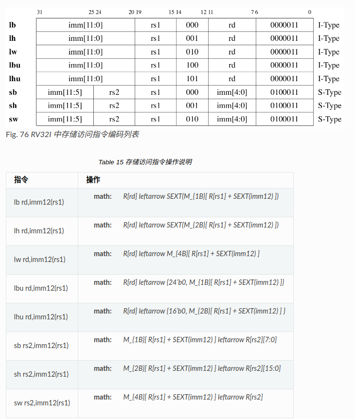

# 实验十一 RV32I单周期CPU
## RV32I指令编码
  

**思考：** 为什么会有S-Type/B-Type，U-Type/J-Type这些不同的立即数编码方案？指令相关的立即数为何在编码时采用这样“奇怪”的bit顺序？  

**1.节约指令长度并保持指令对齐**  
RISC-V 是一种固定 32 位指令长度的架构，这种设计的目的是简化硬件解码，并提高指令流水线效率。但这也限制了指令字段的大小。立即数的不同编码顺序设计目的是在有限的指令长度内，同时满足以下需求：  
（ 1 ）**保持字段长度的高效分配：** 立即数需要尽可能的长，以表达更大的范围或更多的偏移量。  
（ 2 ）**与其他字段共存：** 指令中还需要容纳操作码、寄存器地址等字段。  

**2.立即数对齐优化：**  
许多立即数代表字节地址偏移量或程序计数器PC的相对偏移量，它们的最低几位通常是固定为零（对齐限制，比如字对齐）。RISC-V 的立即数编码方式会按照使用需求重新排列，主要是：  

** S-Type 和 B-Type*
* S-Type（存储指令）：立即数被分成两段（imm[11:5] 和 imm[4:0]），分别放在指令的不同位置。这是为了让硬件能够在解码时直接拼接这些字段，生成 12 位偏移量，同时与寄存器地址等字段高效地共享位空间。  
* B-Type（分支指令）：分支目标地址是相对偏移地址，且必须是字对齐的，因此最低两位始终为 0。通过将 imm[11] 移动到高位，imm[12] 作为符号位，硬件可以快速完成符号扩展，并生成目标地址。  
  
** U-Type 和 J-Type*  
* U-Type（长立即数）：提供 20 位的立即数，适用于加载高位立即数（如 LUI 指令）。直接将高位立即数对齐到指令的高位部分。  
* J-Type（跳转指令）：跳转目标地址的编码需要处理字对齐，同时需要表达大范围的偏移量。因此，它使用 {imm[20], imm[10:1], imm[11], imm[19:12]} 的方式排列，这样可以确保符号位（imm[20]）居高位，便于硬件进行符号扩展和跳转目标地址计算。  
  
**总结：**  
这些看似“奇怪”的立即数编码方式是为了在 有限的指令长度中高效表达更多信息，同时优化 硬件解码和执行 的复杂性。通过重新排列立即数位顺序，硬件可以更快地拼接和处理不同类型的立即数，从而减少解码延迟，满足性能需求。  

## RV32I中的通用寄存器
RV32I共32个32bit的通用寄存器x0~x31(寄存器地址为5bit编码），其中寄存器x0中的内容总是0，无法改变。 其他寄存器的别名和寄存器使用约定参见表 Table 12 。需要注意的是，部分寄存器在函数调用时是由调用方（Caller）来负责保存的，部分寄存器是由被调用方（Callee）来保存的。在进行C语言和汇编混合编程时需要注意。  
  

## RV32I中的指令类型  
本实验中需要实现的RV32I指令含包含以下三类：  
* **整数运算指令 ：** 可以是对两个源寄存器操作数，或一个寄存器一个立即数操作数进行计算后，结果送入目的寄存器。运算操作包括带符号数和无符号数的算术运算、移位、逻辑操作和比较后置位等。  

* **控制转移指令 ：** 条件分支包括beq，bne等等，根据寄存器内容选择是否跳转。无条件跳转指令会将本指令下一条指令地址PC+4存入rd中供函数返回时使用。  

* **存储器访问指令 ：** 对内存操作是首先寄存器加立即数偏移量，以计算结果为地址读取/写入内存。读写时可以是按32位字，16位半字或8位字节来进行读写。读写时区分无符号数和带符号数。注意：RV32I为 Load/Store 型架构，内存中所有数据都需要先load进入寄存器才能进行操作，不能像x86一样直接对内存数据进行算术处理。  
  
### 整数运算指令
  
这些整数运算指令所需要完成的操作参见表 Table 13 。说明中R[reg]表示对地址为reg的寄存器进行操作，M[addr]表示对地址为addr的内存进行操作，SEXT(imm)表示对imm进行带符号扩展到32位， <- 表示赋值， << 及 >> 分别表示逻辑左移和右移， >>> 表示算术右移(注意verilog与java中定义的不同)，比较过程中带s和u下标分别表示带符号数和无符号数比较。  
  

### 控制转移指令
  
  

### 存储器访问指令
RV32I提供了按字节、半字和字访问存储器的8条指令。所有访存指令的寻址方式都是寄存器间接寻址方式，访存地址可以不对齐4字节边界，但是在实现中可以要求访存过程中对齐4字节边界。在读取单个字节或半字时，可以按要求对内存数据进行符号扩展或无符号扩展后再存入寄存器。 表 Fig. 76 列出了存储访问类指令的编码方式。 表 Table 15 列出了存储访问类指令的具体操作。  
  

### 常见伪指令
RISC-V中规定了一些常用的伪指令。这些伪指令一般可以在汇编程序中使用，汇编器会将其转换成对应的指令序列。表 Table 16 介绍了RISC-V的常见伪指令列表。  
  
  

## RV32I电路实现
### 单周期电路设计
在了解了RV32I指令集的指令体系结构（Instruction Set Architecture，ISA)之后，我们将着手设计CPU的微架构（micro architecture）。 同样的一套指令体系结构可以用完全不同的微架构来实现。不同的微架构在实现的时候只要保证程序员可见的状态，即PC、通用寄存器和内存等，在指令执行过程中遵守ISA中的规定即可。具体微架构的实现可以自由发挥。 在本实验中，我们首先来实现单周期CPU的微架构。所谓单周期CPU是指CPU在每一个时钟周期中需要完成一条指令的所有操作，即每个时钟周期完成一条指令。

每条指令的执行过程一般需要以下几个步骤：  
**1.取指令：** 使用本周期新的PC从指令存储器中取出指令，并将其放入指令寄存器IR中。  
**2.指令译码：** 对取出的指令进行分析，生成本周期执行指令所需要的控制信号，并计算下一条指令的地址。  
**3.读取操作数：** 从寄存器堆中读取操作数，并完成立即数的生成。  
**4.运算：** 利用ALU对操作数进行必要的运算。  
**5.寄存器返回：** 将最终结果写回到目的寄存器中。  

每条指令执行过程中的以上几个步骤需要CPU的控制通路和数据通路配合来完成。 其中控制通路主要负责控制信号的生成，通过控制信号来指示数据通路完成具体的数据操作。 数据通路是具体完成数据存取、运算的部件。 控制通路和数据通路分离的开发模式在数字系统中经常可以碰到。其设计的基本指导原则是：控制通路要足够灵活，并能够方便地修改和添加功能，控制通路的性能和时延往往不是优化重点。 反过来，数据通路需要简单且性能强大。数据通路需要以可靠的方案，快速地移动和操作大量数据。 在一个简单且性能强大的数据通路支持下，控制通路可以灵活地通过控制信号的组合来实现各种不同的应用。  

  

## 控制通路
