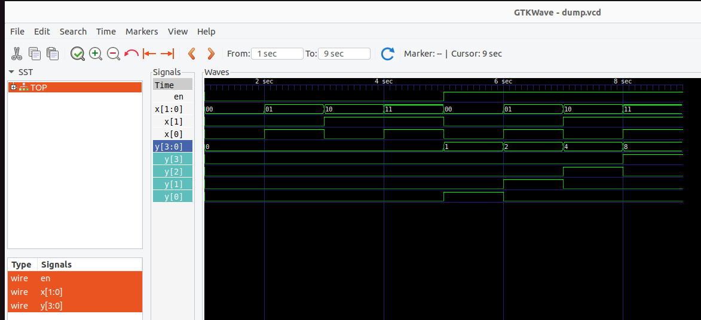
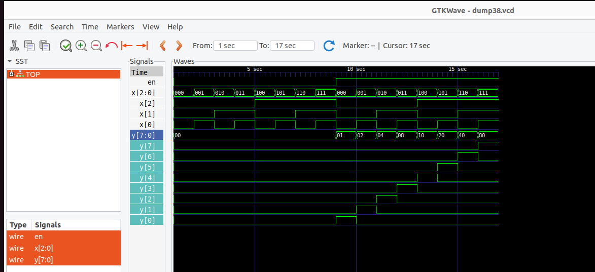
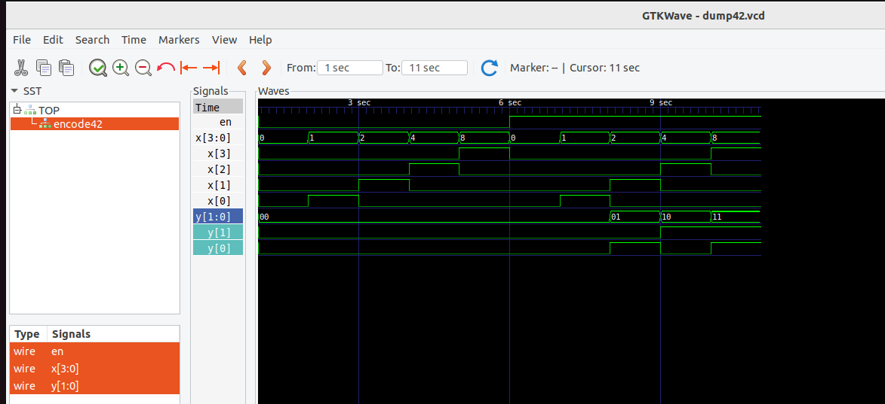
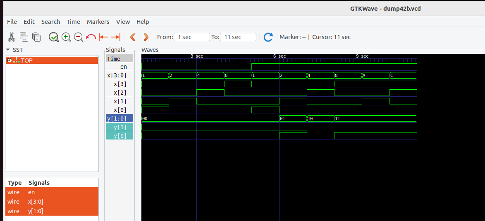
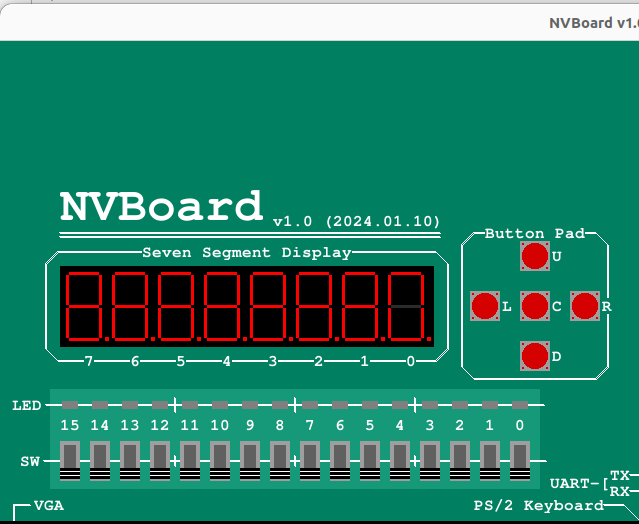
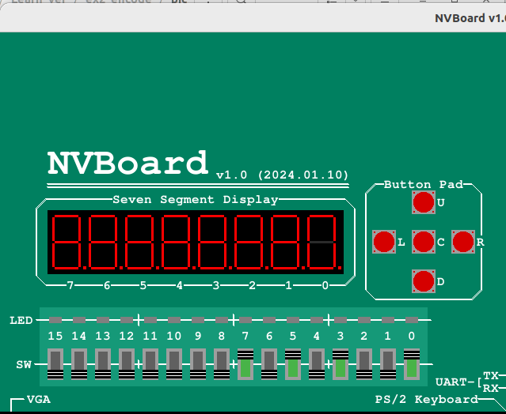
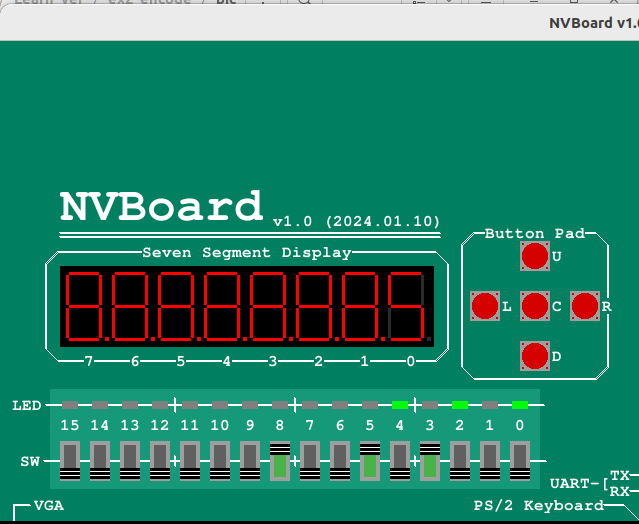
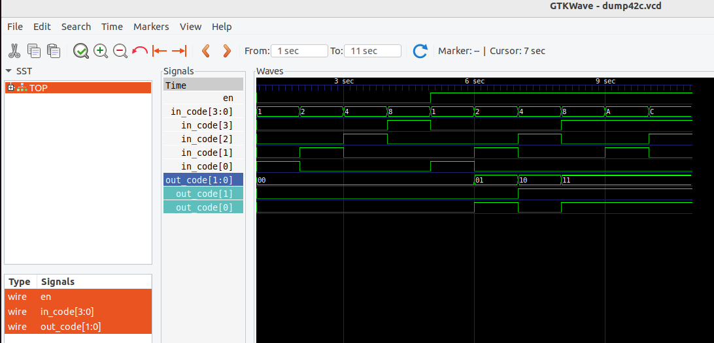

- [实验二 译码器和编码器](#实验二-译码器和编码器)
  - [示例：2-4译码器](#示例2-4译码器)
    - [decode24.v](#decode24v)
    - [测试代码 sim.cpp](#测试代码-simcpp)
    - [shell](#shell)
    - [波形结果](#波形结果)
  - [3-8译码器](#3-8译码器)
    - [decode38.v](#decode38v)
    - [测试代码 sim38.cpp](#测试代码-sim38cpp)
    - [shell](#shell-1)
    - [实验过程出现的错误](#实验过程出现的错误)
    - [波形结果](#波形结果-1)
  - [4-2编码器](#4-2编码器)
    - [encode42.v](#encode42v)
    - [测试代码 sim42.cpp](#测试代码-sim42cpp)
    - [shell](#shell-2)
    - [波形结果](#波形结果-2)
  - [4-2优先编码器](#4-2优先编码器)
    - [encode42b.v](#encode42bv)
    - [sim42b.cpp](#sim42bcpp)
    - [shell](#shell-3)
    - [波形结果](#波形结果-3)
  - [实验验收内容](#实验验收内容)
    - [七段数码管 seg7.v](#七段数码管-seg7v)
    - [8-3优先编码器 encode38.v](#8-3优先编码器-encode38v)
    - [约束文件my\_encode38.nxdc](#约束文件my_encode38nxdc)
    - [Makefile](#makefile)
    - [测试代码 encode38.cpp](#测试代码-encode38cpp)
    - [实验中遇到的错误](#实验中遇到的错误)
    - [实验结果](#实验结果)
  - [case,casez,casex的使用](#casecasezcasex的使用)
    - [使用casez语句实现4-2优先编码器](#使用casez语句实现4-2优先编码器)
    - [使用casex语句实现4-2优先编码器](#使用casex语句实现4-2优先编码器)
    - [实验结果对比](#实验结果对比)
    - [在使用casex语句时，出现警告](#在使用casex语句时出现警告)


# 实验二 译码器和编码器
## 示例：2-4译码器
### decode24.v
```
module decode24(x, en, y);
    input [1:0] x;
    input en;
    output reg [3:0] y;

    always @(x or en)
        if(en)
        begin
            case (x)
                2'd0 : y = 4'b0001;
                2'd1 : y = 4'b0010;
                2'd2 : y = 4'b0100;
                2'd3 : y = 4'b1000;
            endcase 
        end
        else y = 4'b0000;

endmodule
```
### 测试代码 sim.cpp
```
#include "verilated.h"
#include "verilated_vcd_c.h"
#include "obj_dir/Vdecode24.h"

VerilatedContext* contextp = NULL;
VerilatedVcdC* tfp = NULL;

static Vdecode24* top;

void step_and_dump_wave(){
  top->eval();
  contextp->timeInc(1);
  tfp->dump(contextp->time());
}
void sim_init(){
  contextp = new VerilatedContext;
  tfp = new VerilatedVcdC;
  top = new Vdecode24;
  contextp->traceEverOn(true);
  top->trace(tfp, 0);
  tfp->open("dump.vcd");
}

void sim_exit(){
  step_and_dump_wave();
  tfp->close();
}

int main() {
    sim_init();

    top->en = 0b0; top->x = 0b00; step_and_dump_wave();
                   top->x = 0b01; step_and_dump_wave();
                   top->x = 0b10; step_and_dump_wave();
                   top->x = 0b11; step_and_dump_wave();
    top->en = 0b1; top->x = 0b00; step_and_dump_wave();
                   top->x = 0b01; step_and_dump_wave();
                   top->x = 0b10; step_and_dump_wave();
                   top->x = 0b11; step_and_dump_wave();

    sim_exit();
}
```
### shell
```
$ verilator --cc decode24.v --exe sim.cpp --trace  

```
--cc decode24.v : 将Verilog文件decode24.v转译为c++。  
--exe sim.cpp   ：指定用于仿真的C++脚本。  
--trace         ：生成波形文件。

```
$ make -C obj_dir -f Vdecode24.mk  
```

-C obj_dir      ：进入obj_dir  
-f Vdecode24.mk ：使用Verilator生成的Makefile。  


```
$ ./obj_dir/Vdecode24  
```
运行文件  

```
$ gtkwave wave.vcd  

```
查看波形

### 波形结果


## 3-8译码器
### decode38.v
```
module decode38(x, en, y);
    input [2:0] x;
    input en;
    output reg [7:0] y;
    integer i;  //有符号整数变量，32位宽，用于描述循环变量和计算

    always @(x or en)
        if(en)
        begin
            for(i = 0; i <= 7; i = i+1)
                if({29'b0,x} == i)
                    y[i] = 1;
                else
                    y[i] = 0;
        end
        else
        y = 8'b00000000;
endmodule
```

### 测试代码 sim38.cpp
```
#include "verilated.h"
#include "verilated_vcd_c.h"
#include "obj_dir/Vdecode38.h"

//全局变量定义
VerilatedContext* contextp = NULL;  //定义仿真上下文指针，用于管理仿真时间、状态等。
VerilatedVcdC* tfp = NULL;  //定义一个只想波形文件的指针，用于记录仿真过程中产生的信号变化。
static Vdecode38* top;  //定义一个指向顶层模块Vdecode38的实例指针，用于仿真该模块

//仿真辅助函数
void step_and_dump_wave(){      //该函数作用：模拟单个时间步长，并将信号写入波形文件
  top->eval();                  //计算模块当前时刻的输出
  contextp->timeInc(1);         //仿真时间前进1单位
  tfp->dump(contextp->time());  //将当前时间点的信号写入波形文件
}
void sim_init(){                    //该函数作用：初始化仿真环境，包括上下文、波形记录和模块实例
  contextp = new VerilatedContext;  //创建仿真上下文对象
  tfp = new VerilatedVcdC;          //创建波形记录对象
  top = new Vdecode38;              //创建顶层模块实例
  contextp->traceEverOn(true);      //启用波形跟踪功能
  top->trace(tfp, 0);               //将顶层模块的信号连接到波形记录对象
  tfp->open("dump38.vcd");            //打开名为“dump38.vcd”的波形文件
}

void sim_exit(){        //该函数作用：结束仿真并关掉所有资源
  step_and_dump_wave(); //仿真最后一个步长并记录波形
  tfp->close();         //关闭波形文件
}
int main() {
    sim_init();     //初始化仿真环境

    for(int en = 0; en <= 1; en++) {
        for(int x = 0; x < 8 ; x++) {
            top->en = en;
            top->x = x;
            step_and_dump_wave();
        }
    }

    sim_exit();
    
    return 0;
}
```

### shell
```
$ verilator --cc decode38.v --exe sim38.cpp --trace  
```

```
$ make -C obj_dir -f Vdecode38.mk  
```

```
 ./obj_dir/Vdecode38
```

### 实验过程出现的错误
```
$ verilator --cc decode38.v --exe sim.cpp --trace
%Warning-WIDTHEXPAND: decode38.v:11:22: Operator EQ expects 32 bits on the LHS, but LHS's VARREF 'x' generates 3 bits.
                                      : ... In instance decode38
   11 |                 if(x == i)
      |                      ^~
                      ... For warning description see https://verilator.org/warn/WIDTHEXPAND?v=5.008
                      ... Use "/* verilator lint_off WIDTHEXPAND */" and lint_on around source to disable this message.
%Error: Exiting due to 1 warning(s)
```
**问题描述：**  
位宽引起的警告，integer i是有符号整数变量，32位宽，但x是3位。  

**该提示推荐的解决办法：**  
如果希望关闭此警告，可以在代码中使用 /* verilator lint_off WIDTHEXPAND */ 和 /* verilator lint_on WIDTHEXPAND */。  

**我使用的解决办法：**  
在比较时将x的位宽扩展为32位以匹配i的默认位宽：if({29'b0,x} == i)  

### 波形结果


## 4-2编码器
### encode42.v
```
module encode42(x, en, y);
    input [3:0] x;
    input en;
    output reg [1:0] y;

    always @(x or en) begin
        if(en) begin
            case(x)
                4'b0001 : y = 2'b00;
                4'b0010 : y = 2'b01;
                4'b0100 : y = 2'b10;
                4'b1000 : y = 2'b11;
                default y = 2'b00;
        endcase    
        end
        else y = 2'b00;
    end
endmodule
```
### 测试代码 sim42.cpp
```
#include "verilated.h"
#include "verilated_vcd_c.h"
#include "obj_dir/Vencode42.h"

//全局变量定义
VerilatedContext* contextp = NULL;  //定义仿真上下文指针，用于管理仿真时间、状态等。
VerilatedVcdC* tfp = NULL;  //定义一个只想波形文件的指针，用于记录仿真过程中产生的信号变化。
static Vencode42* top;  //定义一个指向顶层模块Vencode42的实例指针，用于仿真该模块

//仿真辅助函数
void step_and_dump_wave(){      //该函数作用：模拟单个时间步长，并将信号写入波形文件
  top->eval();                  //计算模块当前时刻的输出
  contextp->timeInc(1);         //仿真时间前进1单位
  tfp->dump(contextp->time());  //将当前时间点的信号写入波形文件
}
void sim_init(){                    //该函数作用：初始化仿真环境，包括上下文、波形记录和模块实例
  contextp = new VerilatedContext;  //创建仿真上下文对象
  tfp = new VerilatedVcdC;          //创建波形记录对象
  top = new Vencode42;              //创建顶层模块实例
  contextp->traceEverOn(true);      //启用波形跟踪功能
  top->trace(tfp, 0);               //将顶层模块的信号连接到波形记录对象
  tfp->open("dump42.vcd");            //打开名为“dump.vcd”的波形文件
}

void sim_exit(){        //该函数作用：结束仿真并关掉所有资源
  step_and_dump_wave(); //仿真最后一个步长并记录波形
  tfp->close();         //关闭波形文件
}

int main() {
    sim_init();     //初始化仿真环境

    top->en=0b0;    top->x =0b0000; step_and_dump_wave();
                    top->x =0b0001; step_and_dump_wave();
                    top->x =0b0010; step_and_dump_wave();
                    top->x =0b0100; step_and_dump_wave();
                    top->x =0b1000; step_and_dump_wave();
    top->en=0b1;    top->x =0b0000; step_and_dump_wave();
                    top->x =0b0001; step_and_dump_wave();
                    top->x =0b0010; step_and_dump_wave();
                    top->x =0b0100; step_and_dump_wave();
                    top->x =0b1000; step_and_dump_wave();
    sim_exit();
    return 0;
}
```
### shell
```
$ verilator --cc encode42.v --exe sim42.cpp --trace  

$ make -C obj_dir -f Vencode42.mk  

$ ./obj_dir/Vencode42  

$ gtkwave dump42.vcd
```
### 波形结果


## 4-2优先编码器
### encode42b.v
```
module encode42b(x, en, y);
    input [3:0] x;
    input en;
    output reg [1:0] y;
    integer i;

    always @(x or en) begin
        if(en) begin
            y = 0;
            for(i = 0; i <= 3; i = i+1)
                if(x[i] == 1) y = i[1:0];    
        end
        else y = 0;
    end
endmodule
```
### sim42b.cpp
```
#include "verilated.h"
#include "verilated_vcd_c.h"
#include "obj_dir/Vencode42b.h"

//全局变量定义
VerilatedContext* contextp = NULL;  //定义仿真上下文指针，用于管理仿真时间、状态等。
VerilatedVcdC* tfp = NULL;  //定义一个只想波形文件的指针，用于记录仿真过程中产生的信号变化。
static Vencode42b* top;  //定义一个指向顶层模块Vencode42b的实例指针，用于仿真该模块

//仿真辅助函数
void step_and_dump_wave(){      //该函数作用：模拟单个时间步长，并将信号写入波形文件
  top->eval();                  //计算模块当前时刻的输出
  contextp->timeInc(1);         //仿真时间前进1单位
  tfp->dump(contextp->time());  //将当前时间点的信号写入波形文件
}
void sim_init(){                    //该函数作用：初始化仿真环境，包括上下文、波形记录和模块实例
  contextp = new VerilatedContext;  //创建仿真上下文对象
  tfp = new VerilatedVcdC;          //创建波形记录对象
  top = new Vencode42b;              //创建顶层模块实例
  contextp->traceEverOn(true);      //启用波形跟踪功能
  top->trace(tfp, 0);               //将顶层模块的信号连接到波形记录对象
  tfp->open("dump42b.vcd");            //打开名为“dump42b.vcd”的波形文件
}

void sim_exit(){        //该函数作用：结束仿真并关掉所有资源
  step_and_dump_wave(); //仿真最后一个步长并记录波形
  tfp->close();         //关闭波形文件
}

int main() {
    sim_init();     //初始化仿真环境

    //当使能en信号为0时
    top->en = 0; top->x = 0b0001; step_and_dump_wave();
                 top->x = 0b0010; step_and_dump_wave();
                 top->x = 0b0100; step_and_dump_wave();
                 top->x = 0b1000; step_and_dump_wave();

    //当使能en信号为1时
    top->en = 1; top->x = 0b0001; step_and_dump_wave();
                 top->x = 0b0010; step_and_dump_wave();
                 top->x = 0b0100; step_and_dump_wave();
                 top->x = 0b1000; step_and_dump_wave();

    //当高位为1时，优先选择高位
                 top->x = 0b1010; step_and_dump_wave();
                 top->x = 0b1100; step_and_dump_wave();

    sim_exit();
    return 0;
}
```

### shell
```
$ verilator --cc encode42b.v --exe sim42b.cpp --trace  

$ make -C obj_dir -f Vencode42b.mk  

$ ./obj_dir/Vencode42b  

$ gtkwave dump42b.vcd
```

### 波形结果


## 实验验收内容
### 七段数码管 seg7.v
```
module seg7(seg_in, seg_out);
    input [2:0] seg_in;
    output reg [7:0] seg_out;

    parameter seg0 = 8'b11111101;
    parameter seg1 = 8'b01100000;
    parameter seg2 = 8'b11011010;
    parameter seg3 = 8'b11110010;
    parameter seg4 = 8'b01100110;
    parameter seg5 = 8'b10110110;
    parameter seg6 = 8'b10111110;
    parameter seg7 = 8'b11100000;
    parameter seg8 = 8'b11110110;

    always @(seg_in) begin
        case(seg_in)
            3'd0: seg_out = ~seg0;
            3'd1: seg_out = ~seg1;
            3'd2: seg_out = ~seg2;
            3'd3: seg_out = ~seg3;
            3'd4: seg_out = ~seg4;
            3'd5: seg_out = ~seg5;
            3'd6: seg_out = ~seg6;
            3'd7: seg_out = ~seg7;
        endcase
    end
endmodule
```
将对应数字的数码管点亮的段表示出来。同时读NVBoard的example中seg.v可知，NVBoard所使用的数码管是共阳级类型，需要低电平（逻辑0）点亮。

### 8-3优先编码器 encode38.v
```
module encode38(x, en, y, seg_out, x_mark);
    input [7:0] x;          //8位二进制输入
    input en;               //使能信号
    output reg [2:0] y;     //3位二进制输出
    output [7:0] seg_out;   //7段数码管的输出
    output reg x_mark;          //输入指示位，判断是否有输入
    integer i;

    always @(x or en) begin
        if(en) begin
            y = 0;
            x_mark = 1'b1;
            for(i = 0; i <= 7; i = i+1)
                if(x[i] == 1) y = i[2:0];    
        end
        else begin
        y = 0;
        x_mark = 1'b0;
        end
    end

    seg7 seg7_encode38(
        .seg_in(y),
        .seg_out(seg_out)
    );
endmodule
```
仿照4-2优先编码器，写出8-3优先编码器的代码，并将7端数码管模块实例化。  

### 约束文件my_encode38.nxdc
```
top = encode38

x (SW7, SW6, SW5, SW4, SW3, SW2, SW1, SW0)
y (LD2, LD1, LD0)
en (SW8)
x_mark (LD4)
seg_out (SEG0A, SEG0B, SEG0C, SEG0D, SEG0E, SEG0F, SEG0G, DEC0P)
```
根据实验验收内容，输入输出建议中：
输入可以使用拨动开关SW7-SW0。使能端可以用SW8。输出为LED2-0，输出指示可以是LED4，数码管输出为HEX0。（这里的数码管输出接了SEG0。）

### Makefile
直接照搬实验一的，对模块名手动修改。
```
# 定义工程的顶层模块名称和约束文件
TOPNAME = encode38
NXDC_FILES = constr/my_encode38.nxdc

# 头文件包含路径（可选）
INC_PATH ?=

# Verilator的路径和编译标志
VERILATOR = verilator
# Verilator编译标志，设置优化等级、跳过部分检查，提升性能
VERILATOR_CFLAGS += -MMD --build -cc  \
				-O3 --x-assign fast --x-initial fast --noassert

# 构建输出目录和二进制文件路径
BUILD_DIR = ./build
OBJ_DIR = $(BUILD_DIR)/obj_dir
BIN = $(BUILD_DIR)/$(TOPNAME)

# 默认目标：生成仿真器
default: $(BIN)

# 创建构建目录（如果不存在）
$(shell mkdir -p $(BUILD_DIR))

# 约束文件自动生成绑定代码
SRC_AUTO_BIND = $(abspath $(BUILD_DIR)/auto_bind.cpp)
$(SRC_AUTO_BIND): $(NXDC_FILES)
	python3 $(NVBOARD_HOME)/scripts/auto_pin_bind.py $^ $@

# 项目的 Verilog 源文件，查找vsrc目录下所有.v文件以及项目的C源文件（包括 .c, .cc, .cpp）
VSRCS = $(shell find $(abspath ./vsrc) -name "*.v")
CSRCS = $(shell find $(abspath ./csrc) -name "*.c" -or -name "*.cc" -or -name "*.cpp")
# 添加自动生成的绑定代码
CSRCS += $(SRC_AUTO_BIND)

# NVBoard的相关规则（用于仿真调试）
include $(NVBOARD_HOME)/scripts/nvboard.mk

# Verilator编译器的附加标志
INCFLAGS = $(addprefix -I, $(INC_PATH))
CXXFLAGS += $(INCFLAGS) -DTOP_NAME="\"V$(TOPNAME)\""

# 目标：生成仿真器的可执行文件
$(BIN): $(VSRCS) $(CSRCS) $(NVBOARD_ARCHIVE)	# 依赖Verilog,C++,NVBoard库
	@rm -rf $(OBJ_DIR)
	$(VERILATOR) $(VERILATOR_CFLAGS) \
		--top-module $(TOPNAME) $^ \
		$(addprefix -CFLAGS , $(CXXFLAGS)) $(addprefix -LDFLAGS , $(LDFLAGS)) \
		--Mdir $(OBJ_DIR) --exe -o $(abspath $(BIN))

# 'all'目标，执行默认目标
all: default

# 'run'目标，运行生成的仿真器
run: $(BIN)
	@$^

# 'clean'目标，清理构建目录
clean:
	rm -rf $(BUILD_DIR)

# .PHONY：声明伪目标，不生成对应的文件
.PHONY: default all clean run

#接入NVBoard之前的遗留规则
sim:
	$(call git_commit, "sim RTL") # DO NOT REMOVE THIS LINE!!!

include ~/ysyx-workbench/Makefile

```
### 测试代码 encode38.cpp
直接调用了nvboard提供的API。  
```
#include <nvboard.h>
#include "Vencode38.h"

static TOP_NAME dut;

void nvboard_bind_all_pins(TOP_NAME* top);

int main() {
    nvboard_bind_all_pins(&dut);
    nvboard_init();

    while(1) {
        dut.eval();
        nvboard_update();
    }
}
```

### 实验中遇到的错误
```
%Warning-WIDTHEXPAND: /home/yjx/Mystudy/yjx_learn/Learn_ver/ex2_encode/vsrc/encode38.v:14:33: Operator ASSIGN expects 3 bits on the Assign RHS, but Assign RHS's SEL generates 2 bits.
                                                                                            : ... In instance encode38
   14 |                 if(x[i] == 1) y = i[1:0];    
      |                                 ^
                      ... For warning description see https://verilator.org/warn/WIDTHEXPAND?v=5.008
                      ... Use "/* verilator lint_off WIDTHEXPAND */" and lint_on around source to disable this message.
%Error-PROCASSWIRE: /home/yjx/Mystudy/yjx_learn/Learn_ver/ex2_encode/vsrc/encode38.v:12:13: Procedural assignment to wire, perhaps intended var (IEEE 1800-2017 6.5): 'x_mark'
                                                                                          : ... In instance encode38
   12 |             x_mark = 1'b1;
      |             ^~~~~~
%Error-PROCASSWIRE: /home/yjx/Mystudy/yjx_learn/Learn_ver/ex2_encode/vsrc/encode38.v:18:9: Procedural assignment to wire, perhaps intended var (IEEE 1800-2017 6.5): 'x_mark'
                                                                                         : ... In instance encode38
   18 |         x_mark = 1'b0;
      |         ^~~~~~
%Error: Exiting due to 2 error(s), 1 warning(s)

```

错误1：我没注意到这里输出是需要3位的，当时写了2位的输出，与我前面定义的不符。因此报错。  
错误2：在定义输入指示位x_mark时，没有定义成reg类型，被Verilator 定义为wire并赋值了。

### 实验结果
**这是当使能信号为0时**  
  
  

**这是使能信号为1时，输入都为0时，0号数码管也显示0**
  

**这是使能信号为1时,此时可以看到0号数码管显示为5**
  

## case,casez,casex的使用  
**在case语句中**，敏感表达式中与各项值之间的比较是一种全等比较，每一位都相同才认为批匹配。  
**在casez语句中**，如果分支表达式某些位的值为高阻z，那么会对这些位的比较进行忽略，只关注其他位的结果。  
**在casex语句中**，则对这种处理进一步扩展到对x的处理，如果有z和x都不会对这些进行考虑。  

### 使用casez语句实现4-2优先编码器  
```
module encode42c(in_code, en, out_code);
    input [3:0] in_code;
    input en;
    output reg [1:0] out_code;

    always @(in_code or en) begin
        if(en) begin
            casez(in_code)
                4'b0001: out_code = 2'b00;
                4'b001z: out_code = 2'b01;
                4'b01zz: out_code = 2'b10;
                4'b1???: out_code = 2'b11;
                default: out_code = 2'b00;
            endcase    
        end else
            out_code = 2'b00;
    end
endmodule  

```  

### 使用casex语句实现4-2优先编码器  
```
module encode42d(in_code, en, out_code);
    input [3:0] in_code;
    input en;
    output reg [1:0] out_code;

    always @(in_code or en) begin
        if(en) begin
            casex(in_code)
                4'b0001: out_code = 2'b00;
                4'b001z: out_code = 2'b01;
                4'b01??: out_code = 2'b10;
                4'b1xxx: out_code = 2'b11;
                default: out_code = 2'b00;
            endcase    
        end else
            out_code = 2'b00;
    end
endmodule
```

### 实验结果对比 
case：  
  

casez：  
  

casex:  
  

### 在使用casex语句时，出现警告
```
verilator --cc encode42d.v --exe sim42d.cpp --trace 
%Warning-CASEX: encode42d.v:8:13: Suggest casez (with ?'s) in place of casex (with X's)
    8 |             casex(in_code)
      |             ^~~~~
                ... For warning description see https://verilator.org/warn/CASEX?v=5.008
                ... Use "/* verilator lint_off CASEX */" and lint_on around source to disable this message.
%Error: Exiting due to 1 warning(s)

```
警告建议我们使用casez，它不会禁止，将继续进行模拟。  
casex将所有的x和z都视为通配符匹配。这种行为可能会导致以外的逻辑错误，尤其是当x代表未定义的值时。  
