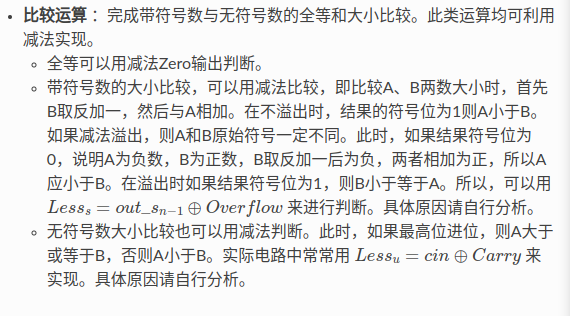

# 实验三 加法器与ALU
## 一位全加器
  
### add1.v
```
module add1(a_i, b_i, c_i, s_i, c_o);
    input a_i;      //待加位a
    input b_i;      //待加位b
    input c_i;      //待加进位ci
    output s_i;     //结果和s
    output c_o;     //下一位进位c_i+1

    //si = （a异或b）异或ci
    assign s_i = (a_i ^ b_i) ^ c_i;

    //c_i+1进位运算
    assign c_o = ((a_i ^ b_i)&c_i) | (a_i & b_i);

endmodule
```
### 测试模块
```
#include "Vadd1.h"
#include "verilated.h"
#include <stdio.h>

//测试一位加法器函数
void test_add1(int a, int b, int c) {
    //创建仿真模块对象
    Vadd1* add1 = new Vadd1;

    //设置输入
    add1->a_i = a;
    add1->b_i = b;
    add1->c_i = c;

    //计算
    add1->eval();

    //输出结果
    printf("%d,  %d,  %d ,  %d,  %d\n",
           c, b, a, add1->s_i, add1->c_o);
    delete add1;
}

int main(int argc, char** argv) {
    //初始化
    Verilated::commandArgs(argc, argv);

    printf("Ci, ai, bi, Si, C_i+1\n");

    for(int c = 0; c <= 1; c++) {
        for(int b = 0; b <= 1; b++) {
            for(int a = 0; a <= 1; a++) {
                test_add1(a, b, c);
            }
        }
    }
    return 0;
}
```
### 运行结果
  

## 四位串行全加器
### add4.v
```
module add4(a,b,ci,sum,co);
    input [3:0] a;
    input [3:0] b;
    input ci;
    output [3:0] sum;
    output co;
    wire [3:0] count;

    //实例化加法器
    add1 u0(a[0], b[0], ci, sum[0], count[0]);
    add1 u1(a[1], b[1], count[0], sum[1], count[1]);
    add1 u2(a[2], b[2], count[1], sum[2], count[2]);
    add1 u3(a[3], b[3], count[2], sum[3], count[3]);
    assign co = count[3];

endmodule

module add1(a, b, ci, sum, co);
    input a;
    input b;
    input ci;
    output sum;
    output co;

    //和
    assign sum = (a ^ b) ^ ci;

    //c_i+1进位运算
    assign co = ((a ^ b)&ci) | (a & b);

endmodule
```

### 测试 sim4.cpp
```
#include "Vadd4.h"
#include "verilated.h"
#include <bitset>
#include <iostream>

void test_add4(int a, int b, int ci ) {
    //创建仿真模块对象
    Vadd4* add4 = new Vadd4;

    //设置输入
    add4->a = a;
    add4->b = b;
    add4->ci = ci;

    //计算
    add4->eval();

    //输出结果
    std::cout << "a: " << std::bitset<4>(a)
              << ", b: " << std::bitset<4>(b)
              << ", ci: " << ci
              << " -> sum: " << std::bitset<4>(add4->sum)
              << ", co: " << std::bitset<4>(add4->co)
              << std::endl;

    delete add4;
}

int main(int argc, char** argv) {
    //初始化
    Verilated::commandArgs(argc, argv);

    for (int ci = 0; ci <= 1; ci++) {
        for (int a = 0; a <= 15; a++) {  // 4 位输入 a
            for (int b = 0; b <= 15; b++) {  // 4 位输入 b
                test_add4(a, b, ci);
            }
        }
    }
    return 0;
}
```
## 使用算术赋值语句和向量重新实验 四位加法器
### add4b.v
```

//使用算术赋值语句和向量来实现4位加法器

module add4b(a,b,sum,co);
    input [3:0] a;
    input [3:0] b;
    output [3:0] sum;
    output co;

    assign {co,sum} = a + b;

endmodule

```

### 测试 sim4b.cpp
```
#include "Vadd4b.h"
#include "verilated.h"
#include <iomanip> 
#include <iostream>
#include <bitset> 

void test_add4b(int a, int b) {
    //创建仿真模块对象
    Vadd4b* add4b = new Vadd4b;

    //设置输入
    add4b->a = a;
    add4b->b = b;

    //计算
    add4b->eval();

    //输出结果
    std::cout << "a: " << std::bitset<4>(a)
              << ", b: " << std::bitset<4>(b)
              << " -> sum: " << std::bitset<4>(add4b->sum)
              << ", co: " << static_cast<int>(add4b->co)
              << std::endl;

    delete add4b;
}

int main(int argc, char** argv) {
    //初始化
    Verilated::commandArgs(argc, argv);

    for (int a = 0; a < 16; ++a) {
        for (int b = 0; b < 16; ++b) {
            test_add4b(a, b);
        }
    }
    return 0;
}
```

## 简单加减法运算器的设计
### 对实验讲义中提出的方法进行思考
**方法一：**  
```
assign t_no_Cin = {n{ Cin }}^B;
assign {Carry,Result} = A + t_no_Cin + Cin;
assign Overflow = (A[n-1] == t_no_Cin[n-1]) && (Result [n-1] != A[n-1]);
```  

第一步是将 Cin 复制 n 位等同于 {Cin, Cin, Cin, Cin....n个},并逐位与B进行异或操作。  
第二步是算术表达式，将Cin既参与异或操作也参与加法操作。  
第三步是溢出信号判断。

***
***
**方法二：**  
```
assign t_add_Cin =( {n{Cin}}^B )+ Cin;  //  在这里请注意^运算和+运算的顺序
assign { Carry, Result } = A + t_add_Cin;
assign Overflow = (A[n-1] == t_add_Cin[n-1]) && (Result [n-1] != A[n-1]);
```  

第一步是将Cin 复制 n 位并逐位与B进行异或操作然后再加上Cin。  
第二步是算术表达式，这次的操作包含了预算计算的Cin。  
第三步是溢出信号判断。  

***
***
**二者对比**  
1.方法二使用括号明确了运算顺序，先进行异或操作然后再加上Cin。  
2.方法一中，Cin既参与异或，也参与最终的加法。方法二将Cin提前加到了t_add_Cin 中，将逻辑等价转化为结构化计算。  
总结：方法二明确了运算顺序，能减少误读风险，同时更具结构化，方便复用。  

### subadd.v
```
module subadd(a,b,cin,carry,overflow,result,zero);
    input [3:0] a;          //操作数a
    input [3:0] b;          //操作数b
    input cin;              //控制加减法，sub为1,add为0
    output carry;           //进位
    output overflow;         //溢出
    output [3:0] result;    //结果
    output zero;            //零判断位

    wire [3:0] t_add_cin;   //中间变量，用于存储经过cin控制的b的处理结果

    //功能实现，通过控制cin来实现加法和减法逻辑
    assign t_add_cin = ({4{cin}}^b) + cin;
    assign {carry, result} = a + t_add_cin;
    assign overflow = (a[3] == t_add_cin[3]) && (result[3] != a[3]);

    assign zero = ~(| result);
    
endmodule
```  
在功能的实现上，使用了讲义所提到的减法的处理。

### subadd_tb.v
```
`timescale 1ns / 1ps

module subadd_tb;

    //输入信号
    reg signed [4:0] i, j;          //测试输入，扩展为5位以检测溢出
    reg inputaluop;                 //控制信号，加法0,减法1
    reg [3:0] inputa, inputb;       //加法器的输入

    //输出信号
    wire [3:0] outputs;             //输出结果
    wire resultc, resultof, resultz;//进位，溢出，零标志位

    //预期结果
    reg [4:0] k;                    //计算结果扩展为5位
    reg of, c, z;                   //预期的溢出，进位，零位

    //实例化
    subadd uut (
        .a(inputa),
        .b(inputb),
        .cin(inputaluop),
        .carry(resultc),
        .overflow(resultof),
        .zero(resultz)
    );

    //错误计数器
    integer errors = 0;

    //测试任务
    task check;
        input [3:0] results;        //alu的结果预期正确输出
        input resultof, resultc, resultz;   //alu的预期溢出，进位，零位
        begin
            //比较预期结果和测试单元输出的outputs
            if(outputs != results)  
                begin
                    $display("Error:a = %h, b = %h, ctrl = %b,sum should be %h,get %h\n", inputa, inputb, inputaluop, results, outputs);
                    errors = errors + 1;
                end

            //比较预期溢出和测试单元溢出的resultof
            if(resultof != of)
                begin
                    $display("overflow Error:a = %h, b = %h, ctrl = %b,overflow should be %b,get %b\n", inputa, inputb, inputaluop, of, resultof);
                    errors = errors + 1; 
                end

            //比较预期进位和测试单元进位的resultc
            if(resultc != c)
                begin
                    $display("carry Error:a = %h, b = %h, ctrl = %b,carry should be %b, get %b\n",inputa, inputb, inputaluop, c, resultc);
                    errors = errors + 1; 
                end

            //比较预期零位和测试单元零位的resultz
            if(resultz != z)
                begin
                    $display("zero Error:a = %h, b = %h,ctrl = %b, zero should be %b,get %b\n",inputa, inputb, inputaluop, z, resultz);
                    errors = errors + 1; 
                end
        end
        endtask

        //测试流程
        initial begin
            $display("开始测试subadd.v ......\n");

            //遍历
            for(i = -8; i <= 7; i = i+1)
            begin
                for(j = -8; j <= 7; j = j+1)
                begin
                    inputa = i[3:0];
                    inputb = j[3:0];            //设置两个输入
                    inputaluop = 4'b0000;       //alu的操作码
                    k = i + j;                  //计算加法预期结果
                    of = ((i[3] == j[3]) && (k[4] != k[3]));    //溢出检测
                    z = (k[3:0] == 0);          //零位
                    c = (k[4] == 1);            //进位
                    #20 check(k[3:0],of,c,z);
                end
        end

        //显示测试结果
        if (errors == 0) begin
            $display("所有测试通过，没有出错！");
        end else begin
            $display("有%d个错误", errors);
        end
        $stop;
        end
    endmodule
```
### 测试结果


## ALU设计：对讲义中比较运算尝试分析
  

### 带符号
Out_s(n-1)表示减法结果的符号位（最高位）。当未溢出时，结果为负（符号位为1），表示A < B。  
Overflow是溢出信号。  

1.当Outs(n-1) = 1, Overflow = 0:符号位正确，结果为负，表示A < B，Less(s) = 1;  
2.当Outs(n-1) = 1, Overflow = 1:符号位错误，修正后 A >= B, Less(s) = 0;
3.当Outs(n-1) = 0, Overflow = 0:符号位正确，结果非负，表示A >=B, Less(s) = 0;  
4.当Outs(n-1) = 0, Overflow = 1:符号位错误,修正后 A < B,Less(s) = 1;  

### 无符号
cin是借位信号。Carry是最高位的进位信号。A < B 等价为 A -B < 0 等价为A + ~B+1 < 0.用上文讲义所提到的对减法的处理方法。

## 验收实验：实现一个带有逻辑运算的简单ALU
