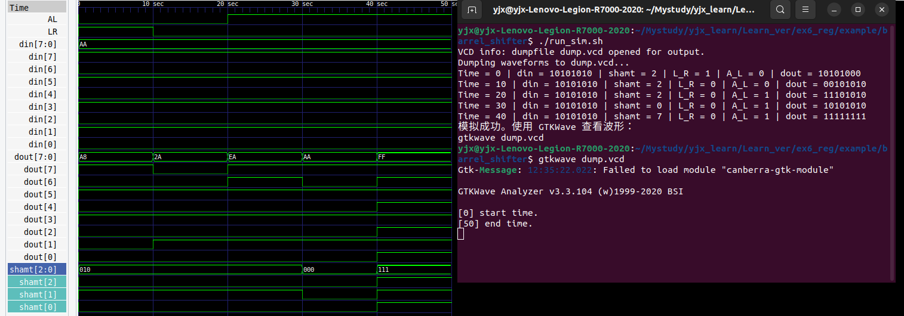

- [实验六 移位寄存器及桶型移位器](#实验六-移位寄存器及桶型移位器)
  - [移位寄存器](#移位寄存器)
    - [实现移位寄存器](#实现移位寄存器)
  - [桶形移位器](#桶形移位器)
    - [barrel\_shifter.v](#barrel_shifterv)
    - [测试文件tb\_barel\_shifter.v](#测试文件tb_barel_shifterv)
    - [实验结果](#实验结果)
  - [思考题：在RV32I指令集中需要实现32位数据的移位，应该如何用Verilog语言实现？](#思考题在rv32i指令集中需要实现32位数据的移位应该如何用verilog语言实现)
    - [shiffer32.v](#shiffer32v)
    - [测试文件tb\_shifter32.v](#测试文件tb_shifter32v)
    - [测试结果](#测试结果)
  - [验收实验：利用移位寄存器实现随机数发生器](#验收实验利用移位寄存器实现随机数发生器)
    - [lfsr部分生成伪随机数： lfsr.v](#lfsr部分生成伪随机数-lfsrv)
    - [生成伪时钟信号： button\_clk.v](#生成伪时钟信号-button_clkv)
    - [数码管:seg\_h.v](#数码管seg_hv)
    - [顶层模块reg\_top.v](#顶层模块reg_topv)


# 实验六 移位寄存器及桶型移位器
算术移位是指考虑到符号位的移位，算术移位要保证符号位不改变，算术左移同逻辑左移一样，算术右移最左面的空位补符号位。逻辑移位不管是向左移位还是向右移位都是空缺处补0。
## 移位寄存器
### 实现移位寄存器 
```
module reg_control(clk, reset, control, s_in, d_in, reg_out);
    input clk;                  //时钟信号
    input reset;                //复位信号
    input [2:0] control;        //控制信号，选择模式
    input s_in;                 //串行输入
    input [7:0] d_in;           //并行输入
    output reg [7:0] reg_out;   //并行输出

    always @(posedge clk or negedge reset) begin
        if(!reset) begin
            reg_out <= 8'b0;
        end else begin
            case(control)
                3'b000: reg_out <= 8'b0;    //清零
                3'b001: reg_out <= d_in;    //置数
                3'b010: reg_out <= reg_out >> 1;    //逻辑右移
                3'b011: reg_out <= reg_out << 1;    //逻辑左移
                3'b100: reg_out <= {reg_out[7], reg_out[7:1]};  //算术右移
                3'b101: reg_out <= {reg_out[6:0], s_in};    //左端串行输入，右移
                3'b110: reg_out <= {reg_out[0], reg_out[7:1]};//循环右移
                3'b111: reg_out <= {reg_out[6:0], reg_out[7]};//循环左移
                default: reg_out <= reg_out;    //默认保持不变
            endcase
        end
    end
endmodule
```
## 桶形移位器
### barrel_shifter.v
```
module barrel_shifter(din, shamt, LR, AL, dout);
    input [7:0] din;        //8位数据输入
    input [2:0] shamt;      //移位位数
    input LR;               //选择1左移还是0右移
    input AL;               //算术逻辑选择，1算术移位，0逻辑移位
    output reg [7:0] dout;  //8位数据输出

    always @(*) begin
        if (LR) begin    // LR 为 1 时左移
            dout = din << shamt;  // 左移
        end else begin      // LR 为 0 时右移
            if (AL) begin    // AL 为 1 时算术右移
                dout = $signed(din) >>> shamt;  // 算术右移
            end else begin   // AL 为 0 时逻辑右移
                dout = din >> shamt;  // 逻辑右移
            end
        end
    end
endmodule
```
### 测试文件tb_barel_shifter.v
```
module tb_barrel_shifter;

    reg [7:0] din;
    reg [2:0] shamt;
    reg LR;
    reg AL;
    wire [7:0] dout;

    // 实例化桶形移位器
    barrel_shifter uut (
        .din(din),
        .shamt(shamt),
        .LR(LR),
        .AL(AL),
        .dout(dout)
    );

    // 生成波形文件
    initial begin
        $dumpfile("dump.vcd");
        $dumpvars(0, tb_barrel_shifter);
        $display("Dumping waveforms to dump.vcd...");
    end

    // 测试激励
    initial begin
        // 初始化输入
        din = 8'b10101010; // 输入数据
        shamt = 3'b010;    // 移位2位
        LR = 1;            // 左移
        AL = 0;            // 逻辑移位
        #10;

        // 测试逻辑右移
        LR = 0;            // 右移
        AL = 0;            // 逻辑移位
        #10;

        // 测试算术右移
        AL = 1;            // 算术移位
        #10;

        // 测试边界条件
        shamt = 3'b000;    // 不移位
        #10;
        shamt = 3'b111;    // 最大移位
        #10;

        // 结束仿真
        $finish;
    end

    // 显示仿真日志
    initial begin
        $monitor("Time = %0t | din = %b | shamt = %d | L_R = %b | A_L = %b | dout = %b",
                 $time, din, shamt, LR, AL, dout);
    end
endmodule

```
### 实验结果


## 思考题：在RV32I指令集中需要实现32位数据的移位，应该如何用Verilog语言实现？
我是直接将上面的桶形移位器直接扩展成32位使用。
### shiffer32.v
```
module shifter32(din, shamt, LR, AL, dout);
    input [31:0] din;        //32位数据输入
    input [4:0] shamt;      //移位位数
    input LR;               //选择1左移还是0右移
    input AL;               //算术逻辑选择，1算术移位，0逻辑移位
    output reg [31:0] dout;  //8位数据输出

    always @(*) begin
        if (LR) begin    // LR 为 1 时左移
            dout = din << shamt;  // 左移
        end else begin      // LR 为 0 时右移
            if (AL) begin    // AL 为 1 时算术右移
                dout = $signed(din) >>> shamt;  // 算术右移
            end else begin   // AL 为 0 时逻辑右移
                dout = din >> shamt;  // 逻辑右移
            end
        end
    end
endmodule
```
### 测试文件tb_shifter32.v
```
module tb_shifter32;

    reg [31:0] din;
    reg [4:0] shamt;
    reg LR;
    reg AL;
    wire [31:0] dout;

    // 实例化桶形移位器
    shifter32 uut (
        .din(din),
        .shamt(shamt),
        .LR(LR),
        .AL(AL),
        .dout(dout)
    );

    // 生成波形文件
    initial begin
        $dumpfile("dump.vcd");
        $dumpvars(0, tb_shifter32);
        $display("Dumping waveforms to dump.vcd...");
    end

    //测试激励
    initial begin
    // 初始化输入
        din = 32'b10101010101010101010101010101010; // 测试数据
        shamt = 5'd2;  // 移位 2 位
        LR = 1;            // 左移
        AL = 0;            // 逻辑移位
        #10;

        // 测试逻辑左移
        din = 32'b10101010101010101010101010101010;
        shamt = 5'd2;
        LR = 1;
        AL = 0;  // 逻辑左移
        #10;

        // 测试逻辑右移
        din = 32'b10101010101010101010101010101010;
        shamt = 5'd2;
        LR = 0;
        AL = 0;  // 逻辑右移
        #10;

        // 测试算术右移
        din = 32'b11111111111111111111111111111010; // 负数
        shamt = 5'd2;
        LR = 0;
        AL = 1;  // 算术右移
        #10;

        // 结束仿真
        $finish;
    end

    // 显示仿真日志
    initial begin
        $monitor("Time = %0t | din = %b | shamt = %d | LR = %b | AL = %b | dout = %b",
                 $time, din, shamt, LR, AL, dout);
    end


endmodule
```
### 测试结果
```
$./run_sim.sh
VCD info: dumpfile dump.vcd opened for output.
Dumping waveforms to dump.vcd...
Time = 0 | din = 10101010101010101010101010101010 | shamt =  2 | LR = 1 | AL = 0 | dout = 10101010101010101010101010101000
Time = 20 | din = 10101010101010101010101010101010 | shamt =  2 | LR = 0 | AL = 0 | dout = 00101010101010101010101010101010
Time = 30 | din = 11111111111111111111111111111010 | shamt =  2 | LR = 0 | AL = 1 | dout = 11111111111111111111111111111110
模拟成功。使用 GTKWave 查看波形：
gtkwave dump.vcd
```
## 验收实验：利用移位寄存器实现随机数发生器
### lfsr部分生成伪随机数： lfsr.v
```
module lfsr(clk, reset, lfsr_out);
    input clk;      //时钟信号
    input reset;    //复位信号
    output reg [7:0] lfsr_out;  //当前伪随机输出

    wire feedback;  //存储反馈逻辑的结果

    //反馈逻辑：x8 = x4 ^ x3 ^ x2 ^ x0
    assign feedback = lfsr_out[4] ^ lfsr_out[3] ^ lfsr_out[2] ^ lfsr_out[0];

    always @(posedge clk or negedge reset) begin    //在时钟上升沿或复位信号的下降沿触发
        if(reset) begin            //复位信号
            lfsr_out <= 8'b00000001;    //将lfsr初始化为非零值，避免全零状态，lfsr会卡在全零状态
        end else if(lfsr_out == 8'b00000000) begin  //防止卡死
            lfsr_out <= 8'b00000001;
        end else begin
            lfsr_out <= {feedback, lfsr_out[7:1]};  //将feedback放在最高位，其余依次右移1位，形成新的输出
        end
    end

endmodule
```
### 生成伪时钟信号： button_clk.v
```
module button_clk(clk, reset, btn, btn_clk);
    input clk;                  //全局时钟信号，
    input reset;                //复位信号
    input btn;                  //按钮输入信号
    output reg btn_clk;         //按钮生成的伪时钟信号

    reg btn_sta1, btn_sta2; //同步寄存器
    reg btn_last;           //上一个状态

    //将按钮的输入信号btn同步到全局时钟clk的时钟域中，防止由于信号跨时钟域而引发亚稳态问题。
    always @(posedge clk or negedge reset) begin
        if(reset) begin            //复位信号
            btn_sta1 <= 0;      
            btn_sta2 <= 0;
        end else begin
            btn_sta1 <= btn;        //将按钮输入信号btn同步到寄存器btn_sta1
            btn_sta2 <= btn_sta1;   //将btn_sta1中的数据同步到btn_sta2中
        end
    end

    //检测按钮的上升沿并生成单周期脉冲信号
    always @(posedge clk or negedge reset) begin
        if(reset) begin                //复位信号
            btn_clk <= 0;
            btn_last <= 0;
        end else begin
            //如果当btn_sta2为高电平且上一个状态btn_last为低电平则表示检测到按钮按下
            if(btn_sta2 && !btn_last) begin
                btn_clk <= 1;       //生成一个脉冲信号
            end else begin
                btn_clk <= 0;       //保证脉冲信号只有一个时钟周期
            end
            btn_last <= btn_sta2;   //更新按钮的上一个状态
        end
    end
endmodule
```
### 数码管:seg_h.v
```
module seg_h(seg_in, seg_out);
    input [3:0] seg_in;
    output reg [7:0] seg_out;

    // 定义16进制字符
    parameter seg0  = 8'b11111100; // 显示 0
    parameter seg1  = 8'b01100000; // 显示 1
    parameter seg2  = 8'b11011010; // 显示 2
    parameter seg3  = 8'b11110010; // 显示 3
    parameter seg4  = 8'b01100110; // 显示 4
    parameter seg5  = 8'b10110110; // 显示 5
    parameter seg6  = 8'b10111110; // 显示 6
    parameter seg7  = 8'b11100000; // 显示 7
    parameter seg8  = 8'b11111110; // 显示 8
    parameter seg9  = 8'b11110110; // 显示 9
    parameter segA  = 8'b11101110; // 显示 A
    parameter segB  = 8'b00111110; // 显示 B
    parameter segC  = 8'b10011100; // 显示 C
    parameter segD  = 8'b01111010; // 显示 D
    parameter segE  = 8'b10011110; // 显示 E
    parameter segF  = 8'b10001110; // 显示 F

    always @(seg_in) begin
        case(seg_in)
            4'd0:  seg_out = ~seg0;
            4'd1:  seg_out = ~seg1;
            4'd2:  seg_out = ~seg2;
            4'd3:  seg_out = ~seg3;
            4'd4:  seg_out = ~seg4;
            4'd5:  seg_out = ~seg5;
            4'd6:  seg_out = ~seg6;
            4'd7:  seg_out = ~seg7;
            4'd8:  seg_out = ~seg8;
            4'd9:  seg_out = ~seg9;
            4'd10: seg_out = ~segA;  // A
            4'd11: seg_out = ~segB;  // B
            4'd12: seg_out = ~segC;  // C
            4'd13: seg_out = ~segD;  // D
            4'd14: seg_out = ~segE;  // E
            4'd15: seg_out = ~segF;  // F
            default: seg_out = 8'b11111111; // 全灭
        endcase
    end

endmodule
```

### 顶层模块reg_top.v
```
module reg_top(clk, reset, btn, seg_u, seg_t);
    input clk;          //全局时钟
    input reset;        //复位信号
    input btn;          //按钮输入
    output [7:0] seg_u; //数码管显示低位
    output [7:0] seg_t; //数码管显示高位

    //中间信号定义
    wire btn_clk;
    wire [7:0] lfsr_out;

    //实例化
    //按钮生成伪时钟信号
    button_clk u_btn_clk(
        .clk(clk),
        .reset(reset),
        .btn(btn),
        .btn_clk(btn_clk)
    );
    
    //lfsr随机数生成
    lfsr u_lfsr(
        .clk(btn_clk),
        .reset(reset),
        .lfsr_out(lfsr_out)
    );

    //数码管显示低位
    seg_h u_seg_u(
        .seg_in(lfsr_out[3:0]),
        .seg_out(seg_u)
    );

    //数码管显示高位
    seg_h u_seg_t(
        .seg_in(lfsr_out[7:4]),
        .seg_out(seg_t)
    );

    
endmodule
```