# Summary

- [第1章 引论](./第1章%20引论.md)
- [第2章 MOS晶体管原理](./第2章%20MOS晶体管原理.md)
- [第3章 CMOS工艺技术](./第3章%20CMOS工艺技术.md)
- [第4章 延时](./第4章%20延时.md)
- [第5章 功耗](./第5章%20功耗.md)
- [第6章 互连线](./第6章%20互连线.md)
- [第7章 鲁棒性](./第7章%20鲁棒性.md)
- [第8章 电路模拟](./第8章%20电路模拟.md)
- [第9章 组合电路设计](./第9章%20组合电路设计.md)
- [第10章 时序电路设计](./第10章%20时序电路设计.md)
- [第11章 数据通路子系统](./第11章%20数据通路子系统.md)
- [第12章 阵列子系统](./第12章%20阵列子系统.md)
- [第13章 专用子系统](./第13章%20专用子系统.md)
- [第14章 设计方法学与工具](./第14章%20设计方法学与工具.md)
- [第15章 调试与验证](./第15章%20调试与验证.md)

- [Summary](#summary)
  - [第一章 引论](#第一章-引论)
    - [MOS管](#mos管)
    - [时序电路](#时序电路)
  - [第二章 MOS晶体管原理](#第二章-mos晶体管原理)
    - [I-V特性](#i-v特性)
    - [沟道长度调制](#沟道长度调制)
    - [阈值电压效应](#阈值电压效应)
    - [泄漏](#泄漏)
    - [直流传输特性](#直流传输特性)
  - [第三章 CMOS工艺技术](#第三章-cmos工艺技术)
    - [晶体管的制造](#晶体管的制造)
  - [第4章 延时](#第4章-延时)
  - [第九章 组合电路设计](#第九章-组合电路设计)
    - [静态CMOS](#静态cmos)
    - [有比电路](#有比电路)
    - [动态电路](#动态电路)
  - [第十章 时序电路设计](#第十章-时序电路设计)

## 第一章 引论
### MOS管
**MOS管组成：** 栅，源，漏，衬底（体）。  
**mMOS管：** 构造在p型衬底上，有两个与栅相邻的n型半导体区域，分别为源和漏。  
**pMOS管：** 构造在n型衬底上，有两个与栅相邻的p型半导体区域。

**反相器：** 由一个pMOS管和一个nMOS管构成。   
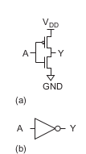   
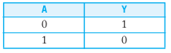  

**与非门NAND：** pMOS并联，nMOS串联  
  
    

**或非门NOR：** pMOS串联，nMOS并联
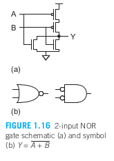  
  

**传输管，传输门：** 类似于开关，当nMOS管和pMOS管单独用来作一个非理想开关时，被称为传输管。而当一个nMOS管和一个pMOS管并联一起时，得到一种开关，这叫传输门或者传送门。  
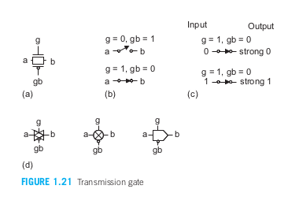  

**三态门：** 作用与传输门一样。当使能输入EN为1时，输出Y等于输入A，此时作用为一个普通的缓冲器。当使能输入为0时，Y变为浮空（高阻态，等于Z值）。  
缺点：三态门有一个前提是必须保证每次只能有一个驱动单元有效。如果多个单元同时驱动一条总线，那么就会发生竞争并浪费功耗。  
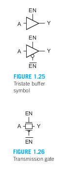
  

**多路开关：** 多路开关是CMOS存储单元和数据处理结构中的关键部件。一个多路开关根据选择信号从它的几个输入中选择出其中一个作为输出。  
  
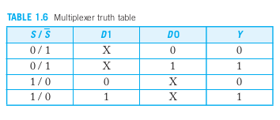  

### 时序电路
&emsp;&emsp;时序电路具有记忆：它们的输出同时取决于当前和之前的输入。  

**锁存器latch**  
  
组成：图1.31a为由一个二输入多路开关和两个反相器构成的D锁存器。由于两个反相器可复原电平，因此多路开关可以用一对传输门构成。  
作用：当CLK为1,锁存器透明；当clk为0,锁存器不透明，保持原先的值（状态）。  

**寄存器flip-flop：**  
  
组成：由2个锁存器构成。  
作用：当时钟信号 (CLK) 为低电平时，主锁存器（负电平敏感）输出 (非QM) 跟随输入 D，而从锁存器（正电平敏感）保持先前的值（图 1.32(c)）。当时钟从 0 变为 1 时，主锁存器变得不透明，锁存 D 输入在时钟变化时的值。从锁存器变得透明，将主锁存器存储的值 (非QM) 传递到从锁存器的输出端 (Q)。此时，由于主锁存器与 D 输入断开，D 输入不会影响输出（图 1.32(d)）。当时钟从 1 变为 0 时，从锁存器保持其输出值，而主锁存器重新开始采样输入。  

**高阻态**  
高阻态是电路的一种输出状态，即不是高电平也不是低电平。如果高阻态再输入下一级电路的话，对下级电路无任何影响，和没接一样。  
当门电路的输出上拉管导通而下拉管截止时,输出为高电平;反之就是低电平;如上拉管和下拉管都截止时,输出端就相当于浮空（没有电流流动）,其电平随外部电平高低而定,即该门电路放弃对输出端电路的控制 。  

## 第二章 MOS晶体管原理
### I-V特性
  
  
以上分别是截止区（相当于高阻态），线性区，饱和区三种工作状态的电流。 
&emsp;&emsp;ε是真空介电常数，通常为8.85×10 （−14次方） F/cm，SiO2的介电常数是真空的3.9倍。我们通常把ε/t称为单位面积栅氧电容Cox。  
&emsp;&emsp;μ是迁移率。  
  
图2.7 理想MOS管的I-V特性：a nMOS管；b pMOS管  

&emsp;&emsp;当场效应晶体管中栅极与源极电压差Vgs < 阈值电压Vt时，此时没有电流流过，呈现高阻态，被称为截止区；当场效应晶体管中栅极与源级电压差Vgs > Vt, 且 < 饱和电压Vdsat时，电流随Vgs增加而线性增加，此时被称为线性区，非饱和区；当栅极与源极电压差Vgs > 饱和电压Vdsat时，电流不再随Vgs影响。  
**沟道形成条件：**Vgs > Vt, 且 < 饱和电压Vdsat，还有Vds >= Vgs- Vt。  

&emsp;&emsp;实际上还需要考虑迁移率退化和速度饱和。  

### 沟道长度调制  
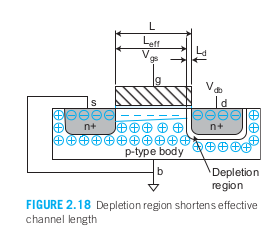  
当到达饱和区，继续增加Vds，将减少有效的沟道长度。  

### 阈值电压效应  
&emsp;&emsp;阈值电压不是一个常数，它随源极电压增加而增加，随沟道长度增加而增加，随漏极电压增加而减小，随体电压增加而减小。  
**体效应**  
**漏致势垒降低DIBL**  
**短沟效应**  

### 泄漏
&emsp;&emsp;即使当晶体管名义上关断，也会泄漏少量的电流。  
&emsp;&emsp;泄漏机理包括：源和漏之间的亚阈值导电、从栅至体的栅泄漏、从源至体的和漏至体的p-n结泄漏。  

### 直流传输特性
一个电路的直流传输特性DC，是指假设输入信号的变化足够慢因而电容有充分的时间充电和放电时，他的输出电压和输入电压的关系。  

**静态CMOS反相器的直流特性**  
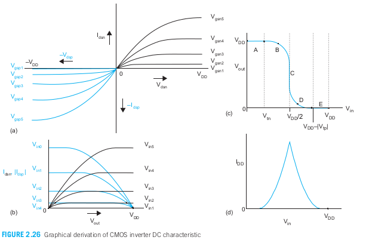  
  

**A区域：** 0 <= Vin <= Vtn ，p型器件属于线性区，n型器件属于截止区，输出为Vout = VDD。
**B区域：** Vtn <= Vin < VDD/2 ，此时p型器件属于线性区，n型器件属于饱和区，输出为Vout > VDD/2。 
**C区域：** Vin = VDD/2 此时p型器件和n型器件都是饱和区，输出Vout陡然下降。  
**D区域：** VDD/2 < Vin <= VDD - |Vtp| ，此时p型器件饱和，n型器件线性区，Vout < VDD/2。  
**E区域：**Vin > VDD - |Vtp| ，此时p型器件截止，n型器件线性，输出为Vout = 0.  

## 第三章 CMOS工艺技术
CMOS工艺步骤可分为两大部分。在生产前端（FEOL）阶段形成晶体管，而在生产线后端（BEOL）阶段形成导线。  

### 晶体管的制造
在硅圆片上制造CMOS的基本工艺流程：通过创建n阱、形成栅极、引入n+区域和p+区域，以及金属接触。  

**制备圆片**  
**CMOS生产厂所采用的最基本原材料：** 硅圆片或硅牒，直径为75～300mm，厚度小于1mm。  
**圆片来源：** 从硅锭即圆柱状单晶硅锭上切割而来。  
**单晶硅锭来源：** 从坩埚中熔化了的纯硅上拉出来的。  
**使单晶具有电学特性：** 将一定数量的杂质加入到熔融硅中，然后使籽晶浸入熔融硅中使晶体开始生长。生长得到的单晶硅锭具有与籽晶相同的晶向。  
**注意：** 在石英坩埚的周围是一个由射频感应线圈加热的石墨加热器，它加热坩埚使温度保持在比硅熔点（1425摄氏度）还高几度。一般在熔融硅的周围充以氦气或氩气防止硅被氧化。  
**后续操作：** 籽晶一边旋转一边从熔融硅中沿垂直方向慢慢拉出，如图3.2所示。此时熔融硅使自己附着在籽晶上并在被拉出时重新结晶。籽晶拉出和旋转的速率决定了单晶硅锭的直径。单晶硅锭的生长速度为30～180mm/h。  

**光刻**  
  
**掺杂区、多晶硅、金属和接触的定义由掩模完成：** 在被掩模遮蔽的地方，离子注入就不起作用或者电介质或金属层将保持原样。而没有被掩模遮蔽的地方，离子注入就能实现或者电介质或金属就能被刻蚀掉。图案的形成是由光刻这道工艺完成的。  
**光刻：** 在圆片上定义我们要处理区域（我们希望在那里保留或除去材料）的主要方法是采用光刻胶。圆片先涂以一层光刻胶并使它们通过光掩模进行有选择的光照。在最初的光刻胶掩模图案形成之后，其他屏蔽层如多晶硅、二氧化硅或氮化硅也可以用来作为芯片的实际掩模。  
**光掩模：** 由覆盖在石英玻璃上形成图案的铬构成。  
&emsp;&emsp;利用一个紫外光源通过光掩模使光刻胶曝光。图3.3显示了光刻工艺。光掩模上有铬的地方将阻挡光照。紫外光从光掩模的背面射入并通过掩模上能透光的部分照射到预先涂覆在圆片上有机光刻胶上使它曝光。图3.3显示了光刻工艺。光掩模上有铬的地方将阻挡光照。紫外光从光掩模的背面射入并通过掩模上能透光的部分照射到预先涂覆在圆片上的有机光刻胶上使它曝光。然后用显影溶解液溶解掉光刻胶上未被曝光的可溶解部分，而光刻胶上经过曝光的部分因变得不可溶解而被保留下来。这一种光刻胶称为 **负性光刻胶** 。而正性光刻胶最初是不可溶解的，当经过紫外线曝光后变得可溶解。    
**正性光刻胶和负性光刻胶区别：** 正性光刻胶比负性光刻胶能提供更高的分辨率，但光敏性较差。随着特征尺寸变得越来越小，光刻胶层也必须变得更薄。而这些又会使它们的稳定性变差而更容易失效，从而影响一个工艺的总成品率和生产芯片的成本。  

**形成阱和沟道**
**p阱工艺：** nMOS管制造在p阱中而pMOS管制造在n型衬底上，p阱工艺曾因此用来优化pMOS管的性能。  
**n阱工艺：** 但改进的n阱工艺已能在n阱中制造出性能良好的pMOS管及在p型衬底萨嘎报告制造出性能更好的nMOS管。在n阱工艺中，在同一个n阱中的各组pMOS管共享相同的体节点，但与不同阱中pMOS管的体相隔离。而芯片中所有的nMOS管都共享同一个体，即衬底。因此由数字电路注入到衬底的噪声会干扰灵敏的模拟电路或存储电路。  
**双阱工艺：** 与n阱工艺同时出现。它可以同时优化每一种类型的晶体管。  
**三阱工艺：** 在双阱的基础上再增加第三个阱。它的出现为在混合信号芯片中的模拟模块和数字模块之间提供了良好的隔离，它也用来使高密度的动态存储器与逻辑部分之间隔离。大多数生产线都提供可以升级的基本双阱工艺，只需要再增加一层掩模就可以升级为三阱工艺。  

阱和其他特殊结构需要经过掺杂的硅区。利用外延，淀积或注入可以实现施主和受主掺杂剂的不同浓度。    
**外延：** 外延是使硅圆片表面加热到高温并暴露在掺杂剂材料的气源中从而在硅表面（它已是单晶体）上生长出一层单晶薄膜。外延可以用来形成一层缺陷比原有圆片表面少的硅层并能有助于防止闩锁。代工厂可以提供两种选择，即外延圆片或无外延圆片。微处理器设计者通常希望采用外延圆片使器件性能比较一致。  
**淀积：** 将掺杂剂材料先堆积在硅表面上然后采用热扩散步骤迫使它推进到体硅内。淀积可用来构造较深的结。一个称为化学气相淀积的步骤可以用来进行淀积。即CVD过程就是被加热的掺杂剂气体在圆片表面处发生化学反应，并且所产生的生成物淀积在硅表面上。CVD也用来在以后的CMOS工艺中淀积一层薄膜材料。  
**离子注入：** 用高能量的施主或受主原子轰击硅衬底。当这些原子撞击到硅表面上时，它们就进入到硅表面以下，形成了具有不同掺杂浓度的区域。当温度升高（大于800摄氏度）时，具有不同杂质浓度的各个硅区之间会发生扩散。因此一旦掺杂区就位，就应使余下的各个工艺步骤保持在尽可能低的温度下进行。但在离子注入后常常会进行一个高温的退火步骤使掺杂剂重新分布的更均匀些。离子注入是目前应用的标准的阱和源/漏注入方法。离子就位过程是一个随机过程，因此掺杂浓度不可能控制的很理想，特别是对于掺杂剂原子数目很少的细小结构更是如此。  

**二氧化硅**  
&emsp;&emsp;通过将硅晶圆加热至氧化环境中，可以实现硅的氧化。以下是一些常见的方法：  
>-**湿氧化：**  在含有水蒸气的氧化环境中进行。通常温度在900°C到1000°C之间。当使用氢气和氧气的2:1混合物时，这种方法也称为热解氧化（pyrogenic oxidation）。湿氧化是一种快速的工艺。  
>-**干氧化：** 在纯氧环境中进行氧化。温度通常在1200°C左右，以获得可接受的生长速率。相比湿氧化，干氧化形成的氧化层质量更高。干氧化用于形成薄且高度可控的栅极氧化层，而湿氧化则可能用于形成较厚的场氧化层。  
>-**原子层沉积：** 通过将薄的化学层（材料A）附着在表面，然后引入化学物质（材料B）来生成所需的薄层（如SiO2——这种方法也可用于其他各种电介质和金属）。此过程重复进行，所需的层被逐层构建。  

**隔离**  
CMOS工艺中各个单个器件必须相互隔离。  

**栅氧**  
下一步工艺是形成晶体管的栅氧。最常用的栅绝缘层是二氧化硅。  

**形成栅和源/漏**  
&emsp;&emsp;在自对准多晶硅栅工艺中，定义栅极、源极和漏极的步骤如下：  
>-长栅氧化层在需要晶体管的区域（包括源极、漏极和栅极区域）——其他地方将会有厚氧化层或沟槽隔离（图3.9(a)）。  
>-在芯片上沉积多晶硅（图3.9(b)）。  
>-对多晶硅进行图案化（包括栅极和互连）（图3.9(c)）。  
>-蚀刻暴露的栅氧化层——即未被多晶硅覆盖的需要晶体管的栅氧化层区域；此时，芯片上在需要源极/漏极扩散的区域将有通向阱或衬底的窗口（图3.9(d)）。  
>-对pMOS和nMOS的源极/漏极区域进行离子注入（图3.9(e)）。

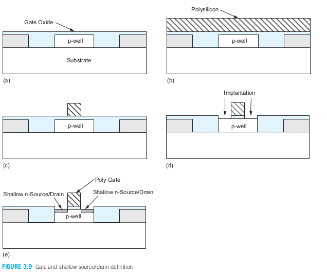  

**接触与金属化**  
**接触孔和金属化：** 接触孔在源极、漏极和栅极区域切割出来，使用材料如铝（较旧工艺）或铜（较新工艺）。钨用于填充接触孔，并且在一些工艺中用作局部互连层。  
**金属化方法：** 传统金属化使用铝，通过蒸发或溅射沉积。蒸发可以通过电流或电子束完成，而溅射通过等离子体作用完成。  
**去除金属方法：** 可以通过湿法（如Piranha溶液）或干法（如等离子蚀刻）去除不需要的金属。  
**局部互连：** 使用局部互连层可以提高电路密度，特别是在SRAM中。现代工艺使用铜互连和低k介电材料，减少导线的电阻和电容。  
**金属层设计：** 较新的工艺中，金属层的宽度和厚度根据层次增加，顶层金属主要用于电源分配和I/O接口。  
**CMP平坦化：** 化学机械抛光（CMP）用于平坦化介电材料，确保后续层的沉积不受表面不平整影响。  
**现代SRAM设计：** 现代SRAM设计使用局部互连连接nMOS和pMOS晶体管，而无需升到较高的金属层，从而优化布局密度。

## 第4章 延时
**传播延时**，tpd表示从输入越过50%至输出越过50%之间的最长时间（也称为最大延时）；  
**污染延时**，tcd表示从输入越过50%至输出越过50%之间的最短时间（也成为最小延时）；  
**上升时间**，tr表示一个波形从它稳定值的20%上升至80%所需要的时间；
**下降时间**，tf表示一个波形从它稳定值的80%下降至20%所需要的时间；
**边沿速率**，trf = （tr + tf） / 2  

**斜率（或边沿速率）**，上升/下降时间；  
**驱动器**，对一个节点充电或放电的门；  
**负载**，被驱动的门和导线；  

**瞬态响应**  
计算延时最基本的方法是建立起所关注电路的物理模型，写出描述输出电压和输入电压及时间关系的微分方程，然后解出这些方程。**这些微分方程的解称为瞬态响应**，而延时就是当输出到达VDD/2的时间。  

**栅电容和扩散电容**  
定义C为一个单位nMOS管或pMOS管的栅电容。k倍单位宽度的晶体管具有kC的电容。扩散电容取决于源/漏区的尺寸。  

**FO4（扇出为4的反相器延时）：** 在65nm工艺下的RC乘积为（10kΩ）（0.1fF） = 1ps。当h=4时，延时为（3 + 3h）（1ps） = 15ps。它通常表示一个典型电路中的门延时。

**寄生延时：** 一个门驱动它自己内部扩散电容所需要的时间。  
**努力延时：** 努力延时取决于外部负载电容与输入电容的比h，因而它随晶体管的宽度而变。也取决于门的复杂程度。这一电容比也称为扇出或电气努力。  
**逻辑努力：**  这个门的输入电容与一个能提供与这个门相同输出电流的反相器的输入电容之比。换言之，逻辑努力表示当一个门的每一个输入端只能表现出与反相器有相同输入电容时，它在产生输出电流方面比起反相器有多差。  

## 第九章 组合电路设计
&emsp;&emsp;本章主要就是介绍如何优化组合电路，使它具有低延时和/或低能耗的技术。集成电路中绝大多数逻辑门都采用具有互补nMOS下拉网络和pMOS上拉网络的静态CMOS电路，因为他们具有良好的噪声容限、足够快、功耗低、对器件扰动不敏感、易于设计。超出噪声容限时即使会因出现毛刺而增加门延时，但是门最终能稳定在正确的输出电平上。  

### 静态CMOS
**推气泡**  
**CMOS门在本质上是反相位的**，因此与和或的功能必须通过与非门和或非门来实现。  
使用摩根定理可以完成转换，这个方法被称为推气泡。  

**复合门**  
&emsp;&emsp;静态CMOS可以使用单级复合门计算与/或功能的各种反相位组合。  

**输入顺序对延时的影响**   
&emsp;&emsp;逻辑门不同输入端的逻辑努力和寄生延时常常各不相同。某些逻辑门，如一些不对称的逻辑门，她的一个输入端上的电容比另一个输入端的电容小。另一些门如与非门和或非门名以上是对称的，但实际上其不同输入端的逻辑努力和寄生延时仍稍有不同。  

**不对称门**  
&emsp;&emsp;当一个输入远不如另一个输入关键时，即使在名以上对称的门也可以使它不对称而有利于改善迟到输入信号的性能，其代价是牺牲早到输入信号的性能。  
&emsp;&emsp;在一个串联网络中，这需要把早到的输入信号连接到外层晶体管上并使该晶体管较宽，这样当关键输入信号到达时，它就能提供较小的串联电阻。但在并联网络中，早到的输入信号应连接到较窄的晶体管上以减少寄生电容。  

**偏斜门**  
&emsp;&emsp;某些情况下，某一个输入跳变可能比另一个更重要。可以通过优化上升输出跳变的高偏斜门和优化下降输出跳变的低偏斜门，这些优化可以通过减小非关键晶体管的尺寸来实现。这一优化以非关键跳变的逻辑努力为代价。  

**P/N比** pMOS管和nMOS管宽度的比。

### 有比电路  
**有比逻辑门** 是由一个nMOS的下拉网络及称为静态负载的某种上拉器件构成。当下拉网络截止时，静态负载将输出上拉至1；当下拉网络变为导通时，它将与静态负载竞争。因而静态负载应当足够弱，使输出能被下拉至一个可接受的0电平。因此，静态负载和下拉网络之间有一个比值约束。  
缺点：由于随逻辑门的数目不断增加，静态功耗已经变得大到不可接受，所以CMOS逻辑最终代替了nMOS逻辑。  

**伪nMOS**   
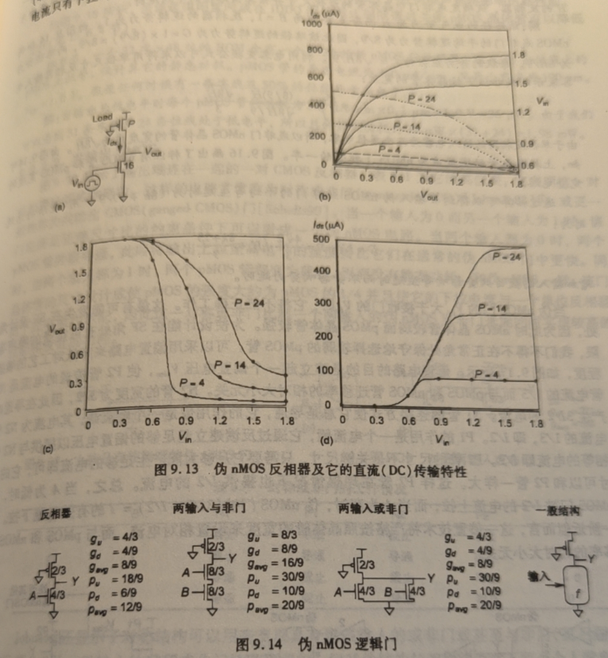  
&emsp;&emsp;在大多数CMOS工艺中，无论高阻值电阻还是耗尽型晶体管都不容易制造出来作为静态负载。代替它们作为静态负载的是栅极接地的单个pMOS管，因此这个pMOS管总是处于导通状态。  

**共输出CMOS**  
  
  
如图所示输出连在一起的一对CMOS反相器，这样的电路常常称为**对称或非门**或更一般的称为**共输出CMOS门**。  
作用：当一个输入为0而另一个输入为1时，该门满足正确尺寸比的约束条件下可以看成一个伪nMOS电路。当两个都是0时，两个pMOS管并联导通，此时将输出上拉至高电平的速度要比他们在通常的伪nMOS门中更快。同时两个输入为1时，两个pMOS管都变为截止，因而没有静态功耗。和伪nMOS一样，该门晶体管的尺寸设计成使pMOS管的强度大约为nMOS的1/4并且使它的下拉电流与一个单位反相器的下拉电流匹配，因此这一对称或非门比起一个两输入的伪nMOS或非门来能同时实现较高的性能和较低的功耗。  

**串联电压开关逻辑CVSL**  
&emsp;&emsp;CVSL试图利用有比电路的优点但又希望没有静态负载，它接受一组互补的输入信号并利用一对nMOS下拉网络同时计算两个互补的输出。  
&emsp;&emsp;优点：速度快，所有逻辑都有nMOS管实现因而减少了输入电容；输出稳定。  
&emsp;&emsp;缺点：设计复杂；同时要求有向低电平和高电平的条棉，因而增加了延时；同时翻转期间的竞争电流也将使功耗增加。  

### 动态电路
&emsp;&emsp;有比电路采用一个电阻性的上拉器件代替连在输入端上的多个pMOS管，从而减少了输入电容，但有比电路的缺点包括上升跳变较慢、下降跳变时的竞争、静态功耗及VOL不为零等。  
&emsp;&emsp;动态电路采用时钟控制的上拉晶体管而不是总是导通的pMOS管，从而克服了这些缺点。  
  
&emsp;&emsp;动态电路可以分为两种模式，预充（电）模式，时钟为0，因而钟控pMOS管导通使输出端Y初始化至高电平；在求值模式，时钟为1因而钟控pMOS管截止，此时输出端可能保持在高电平或可能通过下拉网络放电至低电平。  
&emsp;&emsp;动态电路是最快的常用电路系列。优点：具有较低的输入电容并且在翻转期间不出现任何竞争。缺点：但需要仔细设计时钟，有较大的动态功耗并且在求值期间对噪声很敏感。  
**难点** ：要求输出的单调性。动态门在求值时输入必须单调上升，输入可以在起始时为低电平并且保持在低电平，可以在起始 时为低电平并上升至高电平，或在起始时为高电平并保持在高电平，但不能从起始时为高电平下降至低电平。  

**多米诺逻辑**  
&emsp;&emsp;动态电路的单调性问题可以通过在动态门之间插入一个静态CMOS反相器来解决。这将使单调下降的输出转为单调上升的信号，因而适于作为下一门的输入。  
&emsp;&emsp;多米诺门在本质上是非反相的，但某些函数如异或门必须要有反相。有三种可以解决这个问题。一，将反相功能放到静态逻辑中实现，二采用延时时钟，三 采用双轨多米诺。  

**保持器**  
&emsp;&emsp;动态电路的另一个问题是动态节点上的电荷泄漏。  
&emsp;&emsp;如果动态节点在预充电至高电平后保持浮空，那么由于存在亚阈值泄漏、栅泄漏、结泄漏，动态节点上的电压会随时间漂移。  
&emsp;&emsp;另外动态电路的输入噪声容限很差。但是无论是泄漏还是噪声容限问题都可以通过增加一个保持器来解决。  
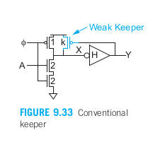  
&emsp;&emsp;图9.33为一个多米诺缓冲器中常用的保持器。该保持器是一个弱晶体管，它能使输出保持即稳定在正确的电平上，否则输出将变为浮空。当动态节点X为高电平时，输出Y为低电平使保持器导通因而X不会浮空。当X处的电压下降时，保持器最初会阻止这一下降跳变，因而它必须比下拉网络弱得多。但最终Y上升，关断保持器，因而避免了出现静态功耗。  
&emsp;&emsp;但保持器又必须足够强（即足够宽）以能在输出端浮空和下拉堆叠截止时足以补偿所存在的任何泄漏电流。较强的保持器也能改善噪声容限，因为当输入因噪声而稍高于Vt时，保持器能提供足够的电流使输出保持在高电平。 

**辅助预充电器件**  
&emsp;&emsp;动态门容易受电荷分享问题的影响。该问题可以通过采用辅助预充晶体管解决，使部分或全部内部节点预充来解决。

&emsp;&emsp;实际上，虽然多米诺电路有高速的优点，但是为了鲁棒性又在其中加了求值管、保持器和辅助预充器件。面积也增大了很多，比起静态CMOS将不再小得多，需要花很大的设计努力来保证电路的鲁棒性。  

## 第十章 时序电路设计  
**建立时间：** 就是时钟上升沿到达之前，输入信号稳定的最小时间。  
**保持时间：** 时钟上升沿到达之后，第二次数据到来之前，数据保持稳定的最小时间。保持时间是时钟沿到来之后，输入信号必须保持不变的最短时间。  

**最大延时约束**   
&emsp;&emsp;在理想情况下，整个时钟周期都可以用来在组合逻辑中进行计算。自然、锁存器或触发器的时序开销将减少这一计算时间。如果组合逻辑的延时太大，那么接收元件因没有充分的建立时间而将采样错误的数值，这称为**建立时间失效或最大延时失效**。它可以通过重新设计逻辑使逻辑速度加快或通过加长时钟周期来解决。本节将计算可用于逻辑的实际时间以及我们最常采用的每种时序元件即触发器、两相位锁存器和脉冲锁存器的时序开销。   

**最小延时约束**  
&emsp;&emsp;在理想情况下，时序元件可以前后直接连接，不需要在它们之间插入组合逻辑仍能正确工作。例如，一条流水线可以采用前后直接连接的寄存器按顺序逐级向前传送一条指令的操作码而不去修改它。但如果寄存器的保持时间很大而污染延时很小，那么数据就有可能错误地在同一时间延时连续传播通过前后两个时序元件，从而破坏系统应有的状态。这称为**竞争条件、保持时间失效或最小延时失效**。但它只能通过重新设计逻辑而不能通过减慢时钟来解决。因此，设计者在避免这类失效时应非常谨慎，因为修改设计和重新制造芯片的成本极高且费时。  

**时间借用**  
&emsp;&emsp;在采用触发器的系统中，数据在时钟上升沿时从第一个触发器出发并必须在时钟的下一个上升沿之前在第二个触发器处建立起来。如果数据推迟到达，那么电路就会产生错误结果。如果数据提前到达，那它就被触发器阻挡直到时钟上升沿到来，因而时钟沿到来之前的这段时间就被浪费了。因此我们说时钟强加了一个硬边沿，因为它清楚地划分开各个周期。   

**时钟偏斜**  
**在以触发器为基础的系统中对于最大延时约束，最坏情形发生在发送触发器接收的是迟到达的时钟（上升沿），而接收触发器接收的是早到达的下一个时钟（上升沿）。在这种情形中，时钟偏斜将作为时序开销从可用于有用计算的时间中减去。对于最小延时约束，最坏情形发生在发送触发器接收的是早到达的时钟（上升沿），而接收触发器接收到的是迟到达的时钟（上升沿），如图10.15b所示。在这种情形中，时钟偏斜实际上相当于增加了系统的保持时间：**    

**同步器**  
接收可在任意时间变化的输入并产生与同步器时钟对准的输出。  

**亚稳态**  
是指数字电路（通常是触发器或锁存器）在采样一个输入信号时，因无法及时做出明确判断，导致输出电平长时间无法稳定在逻辑高电平（“1”）或逻辑低电平（“0”）的状态，而处于一种中间的不稳定状态。亚稳态状态并非电路设计者期望的输出状态，且会在一段随机时间内恢复到一个确定的逻辑状态，但这一过程可能导致错误的逻辑输出。  
  
&emsp;&emsp;锁存器是一种双稳态器件，即它有两个稳定的状态（0和1）。在某些情况下，锁存器有可能恰好进入亚稳态，此时它的输出将处在0和1之间一个不可预知的电平上。例如，图10.42显示了由两个开关（实际中可能是两个传输门）和两个反相器构成的一个静态锁存器的简单模型。当该锁存器透明时，采样开关闭合而保持开关端开（见图10.42a）。当锁存器变为不透明时，采样开关断开而保持开关闭合（见图10.42b）。图10.42c同时显示了两个反相器的直流传输特性。由于当锁存器不透明时A=B，所以两个稳态的状态A=B=0及A=B=VDD。而亚稳态为A=B=Vm，式中Vm是一个无效的逻辑电平。这一点称为亚稳态点，因为此时电路中的电压值是自恰的并能无限长地保持在这种状态。但任何噪声或其他扰动都将使A和B反转到两个稳态状态。图10.42d将这种状态比喻成一个秋在山上弱不禁风地保持着平衡。山顶就是一个亚稳态，任何扰动都将使这个球滚下去并落在山左侧或右侧两个稳定状态中的一个状态上。  
**亚稳态的产生原因**  
**根本原因** 是信号在电路传输中有延时。  
**直接原因：** 
1 ） 输入信号和时钟信号的同步问题。  
&emsp;&emsp;数字电路中的触发器或锁存器通常需要在一个时钟的上升沿或下降沿来采样输入信号。但是，当输入信号在触发器的采样瞬间（如时钟沿）发生变化时，触发器可能无法及时决定输出的逻辑状态，从而进入亚稳态。  
&emsp;&emsp;这种情况在多时钟域或异步信号传输的场景中尤为常见，因为输入信号和时钟信号的时序并不协调，容易在时钟沿附近发生变化。  

2 ） 建立时间（Setup Time）或保持时间（Hold Time）违规  
&emsp;&emsp;每个触发器都有一个特定的建立时间和保持时间。建立时间是指在时钟到来之前，输入信号必须稳定的最短时间；保持时间是时钟沿到来之后，输入信号必须保持不变的最短时间。  
&emsp;&emsp;如果输入信号未能满足建立时间或保持时间要求，触发器可能无法正确采样输入信号，进入亚稳态。  

**亚稳态的影响**  
**逻辑错误：** 输出值可能无法达到预期的逻辑高或低电平，从而导致后续电路接收到错误的信号。  
**时序违例：** 亚稳态的恢复时间不确定，会造成时序问题，可能导致系统无法按预期运行。  
**系统崩溃或故障：** 在关键系统（如通信设备、控制系统）中，亚稳态可能导致严重的系统崩溃或逻辑故障。  

**缓解亚稳态**  
**使用同步器电路：** 在跨时钟域传输信号时，增加多级寄存器（同步器）来延长信号稳定时间，降低亚稳态发生概率。  
**增加建立时间和保持时间裕量：** 设计时确保信号的建立时间和保持时间裕量，减少时序违例。  
**优化电路布局：** 降低电路中的噪声、延迟和寄生效应，以提高采样信号的稳定性。  
**选用抗亚稳态特性的触发器：** 一些触发器经过特殊设计，可以减小亚稳态恢复时间，降低亚稳态影响。  

