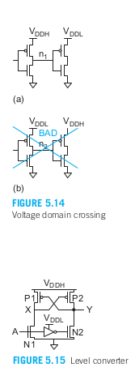

- [第5章 功耗](#第5章-功耗)
  - [5.1 引言](#51-引言)
    - [5.1.1 定义](#511-定义)
    - [5.1.2 功耗来源](#512-功耗来源)
  - [5.2 动态功耗](#52-动态功耗)
    - [5.2.1 活动因子](#521-活动因子)
      - [5.2.1.1 时钟门控](#5211-时钟门控)
      - [5.2.1.2 翻转概率](#5212-翻转概率)
      - [5.2.1.3 毛刺](#5213-毛刺)
    - [5.2.2 电容](#522-电容)
    - [5.2.3 电压](#523-电压)
      - [5.2.3.1 电压域](#5231-电压域)
      - [5.2.3.2 动态电压调整](#5232-动态电压调整)
  - [5.2.4 频率](#524-频率)
  - [5.2.5 短路电流](#525-短路电流)
  - [5.2.6 谐振电路](#526-谐振电路)
  - [5.3 静态功耗](#53-静态功耗)
    - [5.3.1 静态功耗来源](#531-静态功耗来源)
      - [5.3.1.1 亚阈值泄漏](#5311-亚阈值泄漏)
      - [5.3.1.2 栅泄漏](#5312-栅泄漏)
      - [5.3.1.3 结泄漏](#5313-结泄漏)
      - [5.3.1.4 竞争电流](#5314-竞争电流)
      - [5.3.1.5 静态功耗估算](#5315-静态功耗估算)
    - [5.3.2 电源门控](#532-电源门控)
      - [5.3.2.1 电源门控设计](#5321-电源门控设计)
    - [5.3.3 多种阈值电压和栅氧厚度](#533-多种阈值电压和栅氧厚度)
    - [5.3.4 可变阈值电压](#534-可变阈值电压)
  - [5.5 低功耗体系结构](#55-低功耗体系结构)
    - [5.5.1 微结构](#551-微结构)
    - [5.5.2 并行性和流水线](#552-并行性和流水线)
    - [5.5.3 电源管理模式](#553-电源管理模式)

# 第5章 功耗
## 5.1 引言
### 5.1.1 定义
  
  

一个电路元件消耗或提供的瞬时功率P（t）是通过该元件的电流和该元件上的电压的乘积，如式5.1.  
在某一时间间隔T内消耗或提供的能量是瞬时功率的积分，如式5.2  
在这一时间间隔上的平均功耗为 式5.3  

### 5.1.2 功耗来源
CMOS电路中的功耗来自两个部分。
>-动态功耗是由于：  
>&emsp;&emsp;当门翻转时充电和放电负载电容；
>&emsp;&emsp;当pMOS管和nMOS管的串并联结构都部分导通时的“短路”电流。
>-静态功耗是由于：  
>&emsp;&emsp;流过截止晶体管的亚阈值泄漏电流；
>&emsp;&emsp;流过栅介质的泄漏电流；
>&emsp;&emsp;源漏扩散区的p-n结泄漏电流；
>&emsp;&emsp;在有比电路中的竞争电流。

功耗也可以按工作，待机和休眠模式来划分。  
**工作功耗：** 是芯片完成有用工作时的功耗，以Pswitching为主。  
**待机功耗：** 是芯片闲置时的功耗。当时钟停止并且有比电路禁止工作时，待机功耗由泄漏电流决定。  
**休眠模式：** 关断不需要工作的电路的电源以消除泄漏电流，但却需要时间和能量去唤醒芯片，因此休眠只在芯片将闲置一段足够长的时间时才适用。  

## 5.2 动态功耗
&emsp;&emsp;动态功耗大部分是由式5.10表示的翻转功耗构成。设计者很容易知道电源电压VDD及频率f。为了估计动态功耗，我们可以考虑电路中的每一个节点。一个节点的电容是这个节点上的栅电容、扩散电容和连线电容的和。一个节点的等效电容是它实际的电容乘以活动因子。翻转功率取决于所有节点的等效电容之和。  
&emsp;&emsp;活动因子可以在很大程度上取决于所执行的具体任务。CAD工具在给出实际的工作负荷时能很精确地估计功耗。低功耗设计需要考虑和减小在翻转功耗中的每一项。  
&emsp;&emsp;由于VDD是一个平方项，所以最好选择能支持所要求工作频率的最小VDD。同样，我们也将选择能满足所希望目标性能的最低频率。活动因子主要通过使不需要工作的模块进入休眠模式来减小。最后通过优化电路减小每一部分的总负载电容。  
&emsp;&emsp;动态功耗也包括短路功耗部分，它是晶体管翻转时，因上拉和下拉网络同时部分导通造成从VDD至GND的冲击电流功耗所造成的。它通常小于整个功耗的10%，所以可以比较保守地把它估计为加上翻转功耗的10%。  
&emsp;&emsp;翻转功耗消耗在传送能量对负载电容充电然后又将这一能量泄放到地的过程中。从直觉上讲，可以期望将能量搬移到需要它的地方而不是将它泄放掉来节省功耗。谐振电路和绝热电荷回收电路就是试图达到这一目的的电路。遗憾的是，采用所有这些技术所增加的复杂度将抵消它们潜在的能量节省，因而只在某些特定应用中才采用它们。  

### 5.2.1 活动因子
&emsp;&emsp;降低活动因子是降低功耗非常有效和易于实现的途径。如果能使一个电路完全关断，那么它的活动因子和动态功耗将降为零。

**时钟门控：** 电路模块通常通过停止时钟来关断。

&emsp;&emsp;当一个模块工作时，时钟的活动因子为1,但逻辑电路中节点的活动因子要低得多。一个逻辑门的活动因子可以通过计算它的翻转概率来估算。毛刺会加大活动因子。  

#### 5.2.1.1 时钟门控
&emsp;&emsp;时钟门控将时钟信号和一个使能信号相“与”AND 用来关断闲置模块的时钟。这是一种非常有效的办法，因为时钟的活动因子非常高。它可以应用于任何启用寄存器，并且为了保证其稳定性，时钟使能信号需要在时钟有效期间保持不变。通过在时钟分配网络中早期阶段进行门控，不仅可以关闭寄存器，还能减少时钟网络的功耗。

#### 5.2.1.2 翻转概率

#### 5.2.1.3 毛刺
&emsp;&emsp;前节计算的翻转概率只在门的传播延时为零的情况下才成立。但实际上，当逻辑门的几个输入不同时到达时，它们常常会发生成为毛刺的寄生跳变。毛刺会引起额外的功耗。逻辑门链特别容易发生这个问题。毛刺有可能使门的活动因子增加到1以上，并且有可能引起某些电路如串行进位加法器和阵列乘法器中的主要功耗。通过时序模拟可以精确估计毛刺功耗。

### 5.2.2 电容
&emsp;&emsp;通过良好的布局设计和减少晶体管尺寸可以减少导线和器件的开关电容。在非关键路径上，较大级努力能够降低功耗，虽然增加了少量延迟。对于长导线，使用简单的反相器或缓冲器是最节能的方式。

### 5.2.3 电压
&emsp;&emsp;电压对动态功耗有平方关系的影响，因此选择较低的电源电压可以显著降低功耗。当许多晶体管在速度饱和区间工作时，较低的电源电压可能不会像长通道模型预测的那样显著降低性能。芯片可以划分为多个电压域，每个域根据特定电路的需求进行优化。例如，系统级芯片可能为内存使用高电压以确保单元稳定，为处理器使用中等电压，而为以较低速度运行的I/O外设使用低电压。在第5.3.2节中，我们将探讨如何在睡眠模式下完全关闭电压域以节省泄漏功耗。  
&emsp;&emsp;电压也可以根据工作模式进行调整；例如，当笔记本电脑处理器插入交流适配器时，可能以高电压和高速度运行，而在电池供电时则以较低电压和速度运行。如果频率和电压按比例降低，可以实现立方关系的功耗降低。例如，笔记本处理器在拔掉电源时，可能将频率和电压缩减至2/3，以节省70%的功耗。

#### 5.2.3.1 电压域

&emsp;&emsp;在使用电压域时面临的一些难点包括：跨域信号的电压转换、选择哪些电路属于哪个电压域以及为多个电压域分配电源。图5.14展示了两个电压域内逆变器的直接连接，分别使用高电源（VDDH）和低电源（VDDL）。VDDH域内的门电路可以直接驱动VDDL域内的门电路，但VDDL域内的门电路切换速度会比由另一个VDDL门电路驱动时快得多。时间分析器必须考虑这一点，以避免违反保持时间要求。然而，VDDL域内的门电路不能直接驱动VDDH域内的门电路。因为当n2为VDDL时，VDDH域内的pMOS晶体管会出现电压问题，导致争用电流或泄漏电流增加。这个问题可以通过使用高阈值电压的pMOS晶体管来缓解，前提是两个电压域之间的电压差足够小。  
&emsp;&emsp;标准的电压域跨越方法是使用电平转换器（如图5.15所示）。电平转换器可以像缓冲器一样工作，在跨越电压域时不会让晶体管部分导通。然而，电平转换器在每次电压域跨越时都会带来延迟和功耗代价（大约2 FO4）。通过将转换器集成到寄存器中并仅在时钟周期边界跨越电压域，可以部分减轻这一代价。  
&emsp;&emsp;使用电压域最简单的方法是将每个电压域与布局的一个大区域关联起来，这样每个域都有自己的电源网格。电平转换器需要两个电源，因此应将其放置在电压域的边缘，便于域间跨越。  
&emsp;&emsp;另一种方法是集群电压调整（CVS），即在单个模块中使用两种电源电压。图5.16展示了簇电压缩放的一个例子：路径中的早期门电路使用VDDH，而后期的非关键门电路使用VDDL。电压的分配方式确保了在组合逻辑块内路径不会从VDDL门跨越到VDDH门，因此电平转换器只需要在寄存器处使用。CVS要求在整个模块中分布两条电源轨。

#### 5.2.3.2 动态电压调整
&emsp;&emsp;许多系统都要求有时变的性能。例如，一个视频译码器对于快速移动的场景要比静止场景要求有更多的计算。一个工作站在运行SPICE时要比运行“接龙”游戏时需要有更高的性能。
**动态电压调整（或动态电压/频率调整）DVS：** 对于这样的系统，通过使时钟频率降低到足以按预定时间完成任务的最低值，然后使电压下降到在该频率下工作所必需的最小值就可以节省大量的能耗。

&emsp;&emsp;图5.17显示了一个基本的DVS系统的方块图。DVS控制器从系统中获取有关工作负荷和/或管芯温度的信息，它决定足以按预定时间完成工作负荷或使性能最高但又不引起过热的电源电压和时钟频率。一个开关电压调节器有效地使Vin从高值下降至所必需的VDD。内核逻辑包括一个锁相环或其他时钟综合器以产生所规定的时钟频率。  

&emsp;&emsp;DVS（动态电压缩放）控制器首先确定操作频率，然后选择与该频率相适应的最低供电电压。选择电压的一种方法是使用预先表征好的电压-频率表。这种方法具有保守性，因为电压应足够高，以适应最糟糕情况的芯片性能（关于变化性的详细讨论见第7章）。例如，四核Itanium处理器包含一个可通过熔丝编程的表，在生产过程中可以为每个芯片进行调整【Stackhouse09】。另一种方法是使用一个跟踪系统性能的复制电路，比如环形振荡器.  

&emsp;&emsp;定义比率为在规定数量的时间内完成工作负荷所需要的性能与最高性能之比。图5.18画出了能耗与比率的关系。如果比率小于1,那么时钟频率可以向下进行相应的调整，或者系统可以先以最高频率运行直到完成工作，然后停止时钟并进入休眠，这比建立一个连续可调的时钟要简单些。没有DVS时，能耗随比率线性变化。实现理想的DVS时，电压在较低的比率下还可以降低。假设在电压和频率之间存在线性关系，那么能耗就与比率的立方成正比，这使在较低的比率下有更大的能耗节省。当工作在最大比率的一半时，只消耗1/8的能耗。  
&emsp;&emsp;这种电压缩放假设电源电压是可连续调节的，而这比使用离散电平的电源更昂贵。在连续的电压和频率范围内表征电路也十分困难。如果供电电压限制为三个电平，例如1.0V、0.75V和0.5V，频率也限制为三个设置，那么仍可以获得大部分DVS（动态电压缩放）的好处。更好的是，系统可以在这些电压之间进行切换（抖动），以节省更多的能量。例如，如果要求0.6的速率，系统可以在40%的计算时间内以0.75的速率运行，接着在剩余的60%时间内以0.5的速率运行。通过在三个电平之间切换，系统几乎可以获得与使用任意电压相同的低能耗效果。实际上，仅在两个供电电压之间切换（针对全速和半速操作）就足以实现超过80%的DVS效果。  
&emsp;&emsp;第5.3.2节讨论了在休眠模式下通过关断电源来实现电源门控的技术。同样的机制可以用于在活动模式下为每个模块选择不同的供电电压。这允许局部电压调节，使每个模块以首选电压工作。
DVS通常在最大VDD和约其一半的范围内工作，但可以进一步扩展到亚阈值区域，这有时被称为超动态电压缩放（UDVS）。然而，在如此宽的电压范围内，设计能够跟踪芯片上最坏延迟的复制电路具有挑战性。DVS现已广泛应用于从消费电子产品到高性能微处理器的各种系统中。  
&emsp;&emsp;亚阈值和栅极泄漏对供电电压高度敏感，因此DVS在低活动期间也能有效减少泄漏。不同的VDD电压意味着需要可调节的电压调节器来将电压从更高的供电电压降下。应注意使用开关型调节器，否则电能将仅在调节器中消耗掉。

## 5.2.4 频率
&emsp;&emsp;动态功耗与频率成正比，因此芯片显然不应运行得比必要的更快。如前所述，降低频率还可以减少晶体管尺寸或使用更低的供电电压，而这对功耗的影响更大。性能可以通过并行性来弥补，尤其是在面积要求不如功耗重要时。  
&emsp;&emsp;即使没有多个电压供应，芯片仍然可以使用多个频率域，以便某些部分可以比其他部分运行得更慢。例如，微处理器的总线接口通常比核心运行得慢得多。低频率域还可以通过使用较小的晶体管来节省能量。  
&emsp;&emsp;频率域交叉最容易实现的是当各个频率是整数倍且时钟在域之间同步时。

## 5.2.5 短路电流
&emsp;&emsp;短路功耗发生在输入切换时上拉和下拉网络部分开启的情况，如图5.5所示。当输入边缘速率变慢时，短路功耗增加，因为两个网络开启的时间更长【Veendrick84】。然而，当负载电容增大时，短路功耗减少，因为在输入切换期间，输出只会切换少量，导致施加在引起短路电流的晶体管上的Vds较小。除非输入边缘速率比输出边缘速率慢很多，否则短路电流在负载电流中的占比很小（<10%），在手工计算中可以忽略。为了最小化宽晶体管门的短路电流，应该保持输入具有较快的边缘速率。这可以通过保持前一级的合理级工作负载来实现，例如工作负载保持在4或以下。一般而言，输入和输出边缘速率平衡的门电路会有较低的短路功耗。  
&emsp;&emsp;短路功耗对v = Vt / VDD的比值非常敏感。当v > 0.5时，短路电流完全消除，因为上拉和下拉网络从未同时开启。对于v = 0.3或0.2，在边缘整洁的情况下，短路功耗通常分别约为开关功耗的2%或10%。在纳米级工艺中，Vt几乎不会低于0.3 V，否则会产生过多的漏电流，而VDD通常为1 V左右，因此短路电流已变得几乎可以忽略不计。

## 5.2.6 谐振电路
谐振电路通过让能量在电容器和电感器等储能元件之间来回振荡，而不是将能量耗散到地，从而减少开关功耗。这种技术最适合应用于恒定频率运行的场合，比如时钟。  
图5.19为一个谐振时钟网络的模型，Cclock是时钟网络的电容。在通常的时钟网络中，它由一个很强的时钟缓冲器在VDD和GND之间驱动。但在谐振时钟网络中又增加了电感L1及大约10Cclock的电容C2.Rclock和Rind代表在时钟线和电感中的损耗，它们降低了谐振器的品质因子。在谐振时钟电路中，能量在L1和Cclock之间来回传送，引起了谐振频率为f的正弦振荡。驱动器仅泵入足以补偿电阻性损耗的能量。C2必须足够大以存储过量的能量而且不会影响时钟电容的谐振。

  

&emsp;&emsp;在一个机械类比中，电感器代表弹簧，而电容器代表质量。时钟本身具有高电容和低电感，类似于悬挂在一组弹簧（对应于电感L1）上的刚性质量块。质量块上下振荡，时钟驱动器给质量块一个初始的推动力，以启动并补偿弹簧的阻尼，但所需的能量很少，因为弹簧在质量块向下移动时储存能量，并在其向上移动时将能量释放回质量块。  
&emsp;&emsp;IBM已经为Cell处理器展示了一个共振全局时钟分配系统。在4–5 GHz的工作频率下，该系统可以减少芯片10%的功耗。共振时钟的一些缺点包括工作频率范围有限、时钟输出为正弦波，以及在CMOS工艺中制造高质量电感器的难度。

## 5.3 静态功耗
&emsp;&emsp;甚至在芯片不发生翻转时也存在静态功耗。CMOS最终取代了nMOS工艺是因为nMOS逻辑中固有的竞争电流限制了可以集成在单块芯片上的晶体管数目。随着技术节点的缩小，静态功耗尤其是漏电功耗在纳米工艺中变得越来越重要，占据了总功耗的较大比例。为了解决这一问题，电源门控技术以及各种漏电减少策略（如多阈值和可变阈值技术）成为降低静态功耗的重要手段。

### 5.3.1 静态功耗来源
&emsp;&emsp;静态功耗来自于亚阈值、栅和结泄漏电流以及竞争电流。

#### 5.3.1.1 亚阈值泄漏
&emsp;&emsp;亚阈值泄漏电流是在晶体管应当截止时流过的电流。提高源极电压或应用一个负的体电压可以进一步减少泄漏。同时限制管芯温度对于控制泄漏也是至关重要。

#### 5.3.1.2 栅泄漏
 
 

&emsp;&emsp;栅泄漏发生在当电压施加到栅极时，载流子通过薄的栅极介电层隧穿。例如，当栅极打开时会产生栅漏电。通常，工艺会用nA/μm来表征一个最小长度栅极的漏电流，或用A/mm²来表征栅极漏电流密度。栅漏电对介电层厚度非常敏感，通常通过选择合适的介电层厚度来将其限制在可接受的水平。在普通的二氧化硅(SiO2)栅极介质中，pMOS的栅漏电比nMOS小一个数量级，因此通常可以忽略，但在某些其他栅极介质下，pMOS的漏电也可能显著。  
&emsp;&emsp;栅漏电还取决于栅极上的电压。例如，图5.22显示了两个串联的晶体管。如果N1打开而N2关闭，则N1的Vgs=VDD，经历完整的栅漏电。另一方面，如果N1关闭而N2打开，则N2的Vgs=Vt，几乎没有栅漏电。在这两种情况下，关闭的晶体管都不会有栅漏电。因此，栅漏电可以通过堆叠晶体管来减轻，使得关闭的晶体管更接近电源轨。  
&emsp;&emsp;表5.2总结了栅漏电和亚阈值漏电对三输入NAND门的组合影响。这个表基于[Lee03]中使用15Å氧化物和60nm通道长度工艺的数据。通过对NAND3门进行栅堆叠效应分析，亚阈值漏电在000输入情况下，由于三重堆叠效应而减少了一个数量级。在001和100输入情况下，双重堆叠效应使漏电减少了5倍。对于110输入，由于仅有一个晶体管关闭，因此亚阈值漏电达到了最大值。  
&emsp;&emsp;同时，NAND3门的栅漏电表现出输入模式依赖性。在000输入情况下，所有三个nMOS晶体管都处于关闭状态，因此没有栅漏电流。在001和011输入情况下，开启的晶体管Vgs=Vt，栅漏电很小。在010输入情况下，通过N2的栅漏电使节点电压Vx和Vz升至中间电压，这减轻了N3的亚阈值漏电。在101输入情况下，N1经历完整的栅漏电，而N3的栅漏电较小，因为Vz处于高电压。在110输入时，N1和N2都经历栅漏电，而在111输入情况下，所有三个nMOS晶体管都漏电。

#### 5.3.1.3 结泄漏
&emsp;&emsp;结泄漏发生在源极或漏极扩散区与衬底处于不同电势时。尽管普通的反向偏置二极管漏电通常可以忽略不计，但**带间隧穿电流(BTBT)和栅引发漏电(GIDL)**可能会导致在高阈值电压（high-Vt）晶体管中接近亚阈值漏电水平的漏电流。  
**带间隧穿电流(BTBT)**在漏极与衬底之间施加强反向偏置时达到最大值（例如，对于nMOS晶体管，Vdb = VDD）。  
**栅引发漏电(GIDL)**在晶体管关闭且对漏极施加强偏置时达到最大值（例如，对于nMOS晶体管，Vgd = -VDD）。  
&emsp;&emsp;尽管结漏电相对于其他漏电通常较小，但当需要考虑时，可以以nA/μm的晶体管宽度来表示。

#### 5.3.1.4 竞争电流
&emsp;&emsp;静态CMOS电路没有争用电流。然而，某些替代电路在静态时本质上仍会消耗电流。例如，第9.2.2节讨论的伪nMOS门电路在输出为0时会出现nMOS下拉网络和始终开启的pMOS上拉网络之间的争用。电流模式逻辑和许多模拟电路在静态时也会消耗静态电流。对于这些电路，应通过禁用上拉电路或电流源来在休眠模式下将其关闭。

#### 5.3.1.5 静态功耗估算
&emsp;&emsp;静态电流估算是通过估算漏电晶体管的总宽度，乘以每单位宽度的漏电流，再乘以处于漏电状态的晶体管比例（通常为一半）。如果有争用电流，则需加上争用电流。静态功耗则是供电电压乘以静态电流。

### 5.3.2 电源门控
  

&emsp;&emsp;在睡眠模式下减少静态电流的最简单方法是关闭休眠模块的电源。该技术称为电源门控，如图5.24所示。逻辑模块通过虚拟VDD轨（VDDV）接收电源。当模块处于活跃状态时，头部开关晶体管开启，连接VDDV到VDD。当模块进入睡眠状态时，头部开关关闭，使VDDV浮动并逐渐降至接近0。在此过程中，模块的输出可能会处于禁区的电压水平。输出隔离门在睡眠期间将输出强制置于有效电平，以避免在下游逻辑中引发问题。  
&emsp;&emsp;电源门控引入了一些设计问题。头部开关需要精心调整尺寸，确保在活跃操作期间增加的延迟最小，并且在睡眠期间漏电最小。活跃和睡眠模式之间的切换需要一些时间和能量，因此电源门控仅在模块关闭足够长的时间时才有效。当模块关闭时，状态必须在上电时保存或重置。第10.4.3节讨论了使用第二电源保持状态的状态保持寄存器。或者，可以将重要寄存器保存到内存中，这样整个模块可以进行电源门控。恢复电源时，寄存器必须从内存重新加载。【Keating07】详细讨论了如何在标准CAD流程中使用电源门控。如果电源开关足够快，它们可以在活跃模式下通过关闭时钟门控块来节省漏电功率。如果保存或丢失状态的开销过大，将电源电压降低到保持状态所需的最低水平（约300 mV）即可使用动态电压缩放（DVS）消除门漏电，并将亚阈值漏电能量减少一个数量级以上。  
&emsp;&emsp;电源门控最初被提出为多阈值CMOS（MTCMOS），因为它使用低Vt晶体管进行逻辑运算，使用高Vt头部和尾部开关。然而，这个名称有些令人困惑，因为系统可以使用多个阈值电压而不需要电源门控。此外，同时切换VDD和GND也不是必要的。

#### 5.3.2.1 电源门控设计
&emsp;&emsp;电源门控可以通过外部方法或内部方法实现。外部方法是通过禁用输入对电压调节器进行控制，而内部方法则通过高阈值（high-Vt）头部或尾部开关来实现。外部电源门控在睡眠期间可以完全消除漏电，但由于电源网络可能有100纳法（nF）以上的去耦电容需要放电，这会耗费大量的时间和能量。  
&emsp;&emsp;片上电源门控可以使用pMOS头部开关晶体管或nMOS尾部开关晶体管。nMOS晶体管每单位宽度传输的电流更多，因此尺寸可以更小。然而，如果内部和外部电源门控同时使用，为了保持一致性，通常都是通过切断VDD来实现。此外，当使用多个电源时，pMOS电源门控更为简单。在实际应用中，确保GND始终保持恒定可以减少设计者和CAD工具的困惑，仅此原因就足以让许多项目选择pMOS电源门控。  
&emsp;&emsp;理论上，细粒度电源门控可以应用于每个逻辑门，但在每个单元中放置一个开关会导致巨大的面积开销。实际设计中通常使用粗粒度电源门控，其中开关被共享在整个模块中。开关有一个有效电阻，不可避免地会导致VDDV上的电压下跌并增加模块的延迟。通常，开关的尺寸被调整到使延迟增加保持在5-10%以内。  
&emsp;&emsp;一种方法是通过计算或仿真确定在保持可接受的延迟情况下，VDDV上可以容忍的最大电压下跌。然后，通过功率分析确定模块的平均电流，选择开关的宽度，使得在平均电流通过开关时电压下跌保持较小。如果模块足够大，开关事件在时间上分散，并且VDDV上有足够的电容来平滑电压波动，则这种平均电流方法是令人满意的。开关越宽，电压下跌越小，但在关断时漏电更多，且能量消耗也更大。例如，45纳米的Core处理器每个内核使用1.5米的低漏电pMOS电源门控晶体管来关闭空闲内核。  
&emsp;&emsp;电源开关通常由多个并联的晶体管组成。这些晶体管的长度和宽度应选择以最大化Ion / Ioff比值，这高度依赖于具体的工艺流程，并且通常需要通过SPICE仿真来扫描不同的L和W值。为了提高电源开关晶体管在睡眠模式下的Ion / Ioff比值，可以施加反向体偏压（reverse body bias）（见5.3.4节）。或者，可以通过正向或负向过驱动开关来更有效地打开或关闭它，只要不对栅氧化层造成过度应力。当电源开关被打开时，突然涌入的大电流可能会引发IR压降和电感di/dt压降噪声（见13.3节），并可能导致电源总线的电迁移。为了解决这些问题，可以通过控制并联晶体管的开启数量，逐步打开电源开关。

### 5.3.3 多种阈值电压和栅氧厚度
&emsp;&emsp;选择性应用多阈值技术可以通过在关键路径上使用低阈值（low-Vt）晶体管保持性能，同时在其他路径上使用高阈值（high-Vt）晶体管来减少漏电流。  
&emsp;&emsp;多阈值单元库应包含物理上相同、仅阈值不同的单元，以便于轻松更换阈值。良好的设计实践是从全局使用高阈值器件开始，并在需要的地方有选择地引入低阈值器件。使用多阈值技术需要额外的掺杂掩膜，这会增加CMOS工艺的成本。或者，设计者可以增加沟道长度，通过短沟道效应提高阈值电压。例如，在英特尔的65纳米工艺中，将晶体管长度增加10%会使Ion减少10%，但Ioff减少3倍。双核Xeon处理器几乎在缓存中和54%的核心门电路中都使用了更长的晶体管。  
&emsp;&emsp;大多数纳米工艺为逻辑晶体管提供了一种薄氧化物层，并为I/O晶体管提供了一种能承受更高电压的更厚氧化物层。氧化物厚度由另一个掩膜步骤控制。厚氧化物器件中的栅漏电流可以忽略不计，但它们的性能不足以满足高速逻辑应用的要求。一些工艺提供了另一种中间氧化物厚度来减少栅漏电流。

### 5.3.4 可变阈值电压

&emsp;&emsp;从公式 (2.38) 可以回忆到，源-体电压 (Vsb) 通过体效应调节了阈值电压。另一种在工作模式下获得高Ion（开启电流）并在休眠模式下获得低Ioff（漏电流）的方法是通过体偏置（Body Bias）动态调整晶体管的阈值电压。这种技术有时被称为可变阈值CMOS（VTCMOS）。  
&emsp;&emsp;例如，可以使用低阈值器件，并在休眠模式下施加反向体偏置（RBB）来减少漏电流。另一种方式是使用高阈值器件，并在工作模式下施加正向体偏置（FBB），以提高性能。体偏置也可以应用于电源开关晶体管，使其在休眠模式下更有效地关闭。  
&emsp;&emsp;然而，施加过多的反向体偏置（例如，小于 –1.2 V）会通过带间隧穿电流（BTBT）导致更大的结漏电流；而施加过多的正向体偏置（大于 0.4 V）会导致体-源二极管产生大量电流。根据公式 (2.39)，随着氧化物厚度（tox）变薄，体效应减弱，因此在90纳米及以下的工艺中，体偏置技术的效果逐渐减少。  
&emsp;&emsp;应用体偏置需要额外的电源轨来分配衬底和阱的电压。例如，在1.0V的n阱工艺中，RBB方案可以将p型衬底的偏置电压设置为VBBn = -0.4V，而将n阱的偏置电压设置为VBBp = 1.4V。图5.25显示了使用体偏置的反相器的电路图和截面图。在n阱工艺中，所有nMOS晶体管共享相同的p型衬底，必须使用相同的VBBn。在三阱工艺中，晶体管组可以使用与衬底隔离的不同p阱，因此可以使用不同的体偏置。由于阱和衬底的电流较小，偏置电压可以通过电荷泵轻松生成。

## 5.5 低功耗体系结构
&emsp;&emsp;过去，VLSI（超大规模集成电路）设计的瓶颈是芯片上能够容纳的晶体管数量。为了最大化整体性能，设计师们通常会从每个晶体管中提取出最大的速度。如今，随着纳米级规模的数十亿个晶体管可以安装在一块芯片上，许多设计开始受到功耗的限制，因此，最节能的设计往往也是性能最高的设计。这是推动业界迅速转向多核处理器的原因之一。

### 5.5.1 微结构
&emsp;&emsp;高能效架构利用了模块化和局部性设计原则 [Horowitz04, Naffziger0b]。Pollack的观察表明，处理器性能与晶体管数量的平方根成正比。为了解决问题中最后一点指令级并行性而构建复杂、庞大的处理器是非常低效的能量使用方式。因此，微架构正逐步转向使用更多简单核心，以处理任务级和数据级并行性。更小的核心具有更短的连线和更快的内存访问速度。  
&emsp;&emsp;内存的功率密度比逻辑电路低得多，因为其活动因数极小，且其规律性简化了漏电控制。因此，若某任务可以通过加速处理器或增加内存来加速，内存往往是更好的选择。现在，内存在许多芯片中的面积占比已超过一半。  
&emsp;&emsp;专用功能单元比通用处理器的能效高出一个数量级。用于图形、网络和加密等计算密集型应用的加速器能够将这些任务从处理器中卸载出来。将常规核心、专用加速器和大量内存结合起来的异构架构正变得越来越重要。  
历史上，商业软件的进步一直落后于硬件至少十年，例如虚拟内存、内存保护、32位和64位数据通道以及强大的电源管理等技术的普及。当前，程序员很难充分利用多核处理器。时间将揭示编程实践和工具能否赶上硬件进步，或是微架构是否需要为了满足程序员的需求做出调整。

### 5.5.2 并行性和流水线
&emsp;&emsp;过去，并行性和流水线都是降低功耗的有效方法。通过并行化和流水线化可以显著节省能量和提高效率。并行化能够通过降低频率和电压来减少功耗，但面积增加。而流水线化通过分阶段执行逻辑来减少每个时钟周期的工作量。当前，由于漏电的影响，流水线化更具优势。这两种技术仍是提升处理器性能的关键手段。

### 5.5.3 电源管理模式
&emsp;&emsp;就像父母教我们离开房间时要关灯一样，芯片设计师们现在学会了在不使用芯片的部分时，通过时钟门控和电源门控来关闭这些部分。许多芯片现在采用了多种电源管理模式，在功耗节省和唤醒时间之间进行权衡。
&emsp;&emsp;例如，Intel Atom处理器在峰值频率下运行时，达到2 GHz，电压为1 V，消耗2 W。其电源管理模式如图5.30所示。在低频模式下，时钟频率可以降至600 MHz，而电源电压降至0.75 V。在睡眠模式C1中，核心时钟关闭，一级缓存被刷新并通过电源门控降低漏电，但处理器可以在1微秒内恢复活跃状态。在睡眠模式C4中，相位锁定环（PLL）也被关闭。在睡眠模式C6中，核心和缓存都通过电源门控关闭，功耗降至低于80 mW，但唤醒时间延长至100微秒。对于典型工作负载，处理器可以在C6睡眠模式下运行80-90%的时间，从而将平均功耗降低到220 mW。
&emsp;&emsp;芯片的最坏情况功耗可能是正常功耗的两倍甚至更多。触发最大功耗的代码有时被称为热病毒，因为它试图通过极高功耗使芯片过热损坏。为了避免针对这种最坏情况进行设计，芯片可以采用自适应功能，当发热或指令速率过高时，通过减少活动来进行调节。13.2.5节详细讨论了温度传感器的应用。
&emsp;&emsp;电源管理使得芯片在空闲模式下的功耗远低于活动模式。在空闲和活动模式之间转换时，可能需要多个时钟周期，以避免突然的电流尖峰，这可能引发电源共振并导致过大的供电噪声。
&emsp;&emsp;现代芯片通过时钟门控和电源门控技术在不需要时关闭部分电路，借助多种电源管理模式在节能和唤醒时间之间进行权衡。Intel Atom处理器等实例表明，利用这些管理技术能够显著降低空闲状态下的功耗。