- [4.1 引言](#41-引言)
  - [4.1.1 定义](#411-定义)
  - [4.1.2 时序优化](#412-时序优化)
- [4.2 瞬态响应](#42-瞬态响应)
- [4.3 RC延时模型](#43-rc延时模型)
  - [4.3.1 等效电阻](#431-等效电阻)
  - [4.3.2 栅电容和扩散电容](#432-栅电容和扩散电容)
  - [4.3.3 等效RC电路](#433-等效rc电路)
  - [4.3.4 瞬态响应](#434-瞬态响应)
  - [4.3.5 Elmore延时](#435-elmore延时)
  - [4.3.6 版图设计对扩散电容大小的影响](#436-版图设计对扩散电容大小的影响)
  - [4.3.7 确定等效电阻](#437-确定等效电阻)
  - [4.4 线性延时模型](#44-线性延时模型)
    - [4.4.1 逻辑努力](#441-逻辑努力)
    - [4.4.2 寄生延时](#442-寄生延时)
    - [4.4.3 逻辑门的延时](#443-逻辑门的延时)
    - [4.4.4 驱动强度](#444-驱动强度)
  - [4.5 路径逻辑努力](#45-路径逻辑努力)
    - [4.5.1 多级逻辑网络的延时](#451-多级逻辑网络的延时)
    - [4.5.2 选择最优级数](#452-选择最优级数)
    - [4.5.3 逻辑努力方法的局限性](#453-逻辑努力方法的局限性)

# 4.1 引言
## 4.1.1 定义
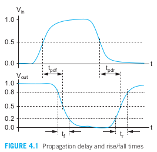
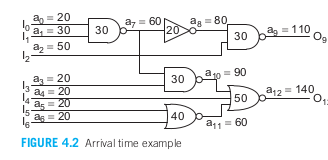

>我们从一些定义开始，这些定义在图4.1中有所展示：  
>&emsp;&emsp;**传播延迟时间（tpd）：** 输入信号经过50%时到输出信号经过50%时的最大时间。  
>&emsp;&emsp;**污染延迟时间（tcd）：** 输入信号经过50%时到输出信号经过50%时的最小时间。  
>&emsp;&emsp;**上升时间（tr）：** 波形从其稳态值的20%上升到80%所需的时间。  
>&emsp;&emsp;**下降时间（tf）：** 波形从其稳态值的80%下降到20%所需的时间。  
>&emsp;&emsp;**边沿速率（trf）：** 上升时间和下降时间的平均值，即(tr + tf )/2。 

&emsp;&emsp;当输入发生变化时，输出将至少在污染延时内保持它原来的值不变，并且将至多在传播延时之后就改变为它的新值。我们有时区分输出上升（tpdr/tcdr）和输出下降（tpdf/tcdf）的延迟。上升/下降时间也被称为斜率或边沿速率。传播延迟和污染延迟时间分别也称为最大时间和最小时间。负责给节点充放电的门电路称为驱动器，而被驱动的门电路和线称为负载。通常传播延迟是最为关注的参数，常简称为延迟。  
&emsp;&emsp;时序分析器会计算到达时间，即逻辑块中每个节点的最新转换时间。这些节点被分类为输入、输出和内部节点。用户必须指定输入信号的到达时间以及输出信号所需的数据时间。内部节点 i 的到达时间 ai 取决于驱动该节点的门电路的传播延迟以及该门电路输入的到达时间：

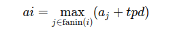

&emsp;&emsp;时序分析器计算每个节点的到达时间并检查输出信号是否在所需时间内到达。裕量是所需时间和到达时间的差异。正裕量表示电路符合时序要求，而负裕量表示电路速度不够快。图4.2显示了带有到达时间标注的节点。如果输出要求在200 ps内到达，电路则有60 ps的剩余时间。  

>传播延迟表示信号从输入改变到输出响应的最大时间，污染延迟是最小时间。  
>上升/下降时间与信号变化速率有关。  
>驱动器是负责充放电的电路，而被驱动的电路称为负载。  
>时序分析器用于计算逻辑电路各节点的信号到达时间，正裕量表示电路满足时序要求，负裕量则表明电路太慢。

&emsp;&emsp;一个实用的时序分析器扩展了到达时间模型，以考虑多种影响因素。上升和下降转换的到达时间和传播延迟是分别定义的。门电路的延迟可能因不同的输入而不同。最早的到达时间也可以基于污染延迟来计算。考虑所有这些因素可以给出门电路可能切换的时间窗口，并允许时序分析器验证每个寄存器的建立时间和保持时间是否得到满足。

## 4.1.2 时序优化
关注时序细节的关键路径，而关键路径可以在以下四个级别的层次上受到影响：  
**结构/微结构级：** 良好的微结构能产生最大的影响。这需要我们广泛了解实现该功能的算法及完成该芯片的工艺。在微结构级上的权衡考虑包括流水线的级数、执行单元的数目以及存储器的大小等。
**逻辑级：** 这是时序优化的下一层次。权衡考虑包括功能块的类型，在一个时钟周期中逻辑门的级数以及门的扇入和扇出等。从功能转变为门和寄存器可以根据经验、实验或最经常地通过逻辑综合来完成。
**电路级：** 选择逻辑之后，就可以通过选择晶体管的尺寸或采用其他类型的CMOS逻辑在电路级调整延时。
**版图级：**   最后取决于版图。版图的平面规划非常重要，因为它决定了能占延时主要部分的导线长度。良好的版图也能减少寄生电容。

# 4.2 瞬态响应
**瞬态相应的定义：** 写出描述输出电压和输入电压及时间关系的微分方程的解。  
**延时：** 输出到达VDD/2时所需要的时间。  

# 4.3 RC延时模型
RC延时模型采用在逻辑门翻转区间上的平均电阻和电容来近似非线性晶体管的I-V和C-V特性。这一近似虽然在详细预测模拟行为方面有明显的局限性，但它却能非常好的评估延时。

## 4.3.1 等效电阻
&emsp;&emsp;RC延迟模型将晶体管视为与电阻串联的开关。有效电阻是Vds与Ids的比值，在所关注的切换区间内进行平均。单位nMOS晶体管被定义为具有有效电阻R。单位晶体管的大小是任意的，但通常指最小长度和最小接触扩散宽度（即4/2 Q）的晶体管。或者，它也可能指标准单元库中最小尺寸反相器中的nMOS晶体管的宽度。宽度为k倍单位的nMOS晶体管具有电阻R/k，因为它能提供k倍的电流。单位pMOS晶体管的电阻更大，通常在2R到3R之间，因为其迁移率较低。为了简化计算，本文中将使用2R作为示例。单位晶体管的R通常约为10 kΩ。   
&emsp;&emsp;根据长通道模型，电流随通道长度线性减小，因此电阻与L成正比。此外，两个晶体管串联时，总电阻是每个晶体管电阻之和。然而，如果晶体管完全速度饱和，则电流和电阻与通道长度无关。实际晶体管的操作状态介于这两种极端之间。这也意味着串联晶体管的电阻略低于电阻之和，因为串联的晶体管看到较小的Vds，且不那么速度饱和。由于nMOS的迁移率更高，速度饱和程度更大，因此这一效应在nMOS晶体管上比在pMOS晶体管上更为明显。最简单的方法是对于手动计算忽略速度饱和，但需要认识到串联晶体管的速度将比预测的稍快。  

>&emsp;&emsp;总结： RC延迟模型将晶体管视为串联电阻的开关，单位nMOS晶体管具有有效电阻R，而单位pMOS的电阻则更高（通常为2R-3R）。电阻与通道长度成正比，然而在完全速度饱和时，电流与电阻不再依赖于通道长度。实际情况下，串联晶体管的电阻会低于简单相加的结果，nMOS的性能优于pMOS，因而具有更快的速度。  

## 4.3.2 栅电容和扩散电容
&emsp;&emsp;每个晶体管也具有栅电容和扩散电容。

&emsp;&emsp;定义C为一个单位nMOS管或pMOS管的栅电容。一个k倍单位宽度的晶体管具有kC的电容。  
&emsp;&emsp;扩散电容取决于源漏区的尺寸。采用2.3.1节的近似，我们可以假设一个单位晶体管带接触的源或漏区也具有大约为C的电容。较宽的晶体管将按比例具有较大的扩散电容。  
&emsp;&emsp;增加沟道长度将按比例加大栅电容但不会影响扩散电容。  

## 4.3.3 等效RC电路
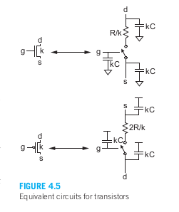
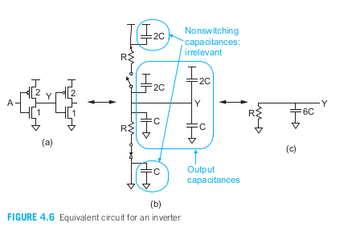  

&emsp;&emsp;图4.5为宽度为k，源漏均为带接触扩散区的nMOS管和pMOS管的等效RC电路模型。由于空穴的迁移率比电子低，因此pMOS管具有大约两倍于nMOS管的电阻。  
&emsp;&emsp;图中pMOS电容的第二个终端时VDD，这是因为n阱通常连至高电平。但从延时的角度来看，只要电容第二个终端的电压不变，那么电容的行为就与这个终端无关。因此为了方便起见，我们常常把这个第二个终端画成接地端。  
&emsp;&emsp;逻辑门的等效电路可以由各个晶体管组合而成。图4.6为扇出为1的反相器在忽略连线电容时的等效电路。图4.6a中的单位反相器由一个单位尺寸的nOS管和一个两倍单位宽度的pMOS管组成以达到相同的上升电阻和下降电阻。图4.6b显示了第一个反相器驱动第二个反相器栅极时的等效电路。当输入A上升时，nMOS管将导通而pMOS管将截止。图4.6c表示了这一情形但已将开关删去。图中也删去了在两个固定电源电压间短接的电容，因为它们不会被充电或放电。输出端Y的总电容为6C。

## 4.3.4 瞬态响应
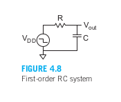
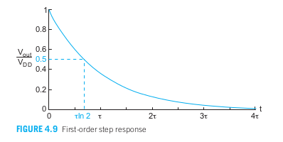

图4.8所示一阶系统的阶跃响应。这一系统是一个很好的反相器模型，它的尺寸设计成具有相同的上升和下降延时。该系统的函数为：  

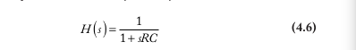  

而阶跃响应应为：  

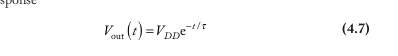  

式中， *t* = RC. 传播时间为Vout到达VDD/2的时间，如图4.9所示

 

因子ln 2 = 0.69比较麻烦。由于有效电阻R本身就是一个经验参数，所以更好的方法是将ln 2因子合并进去，从而定义一个新的有效电阻Re = R ln 2。这样传播延迟就可以简单地表示为ReC。为了方便起见，我们通常会省略符号，直接写成： tpd = RCln2

其中，选择有效电阻R以获得正确的延迟。

图4.10展示了一个二阶系统。R1和R2可以模拟NAND门中的两个串联nMOS晶体管，或者模拟一个驱动长电线且电阻不可忽略的反相器。其传递函数为：

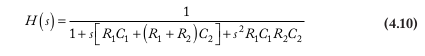 

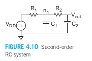

这一函数具有两个实数极点，因而它的阶跃响应为：  

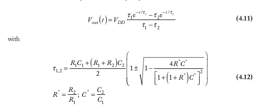

式4.12太复杂，它抵消了将CMOS电路简化成等效RC网络的初衷，但它可以进一步近似成只有一个时间常数的一阶系统：  

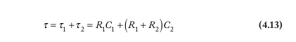

这种近似在一个时间常数明显大于另一个时间常数时效果最好【Horowitz84】。例如，如果R1 = R2 = R且C1 = C2 = C，那么Y1 = 2.6 RC，Y2 = 0.4 RC，Y = 3 RC，二阶响应及其一阶近似如图4.11所示。用一阶近似估算的传播延迟误差小于7%。即使在最糟糕的情况下，即两个时间常数相等时，误差也小于15%。单一时间常数对于描述中间节点的行为来说并不准确。例如，n1节点的响应不能用单一时间常数很好地描述。然而，CMOS设计师主要关心的是门的输出延迟，而在这种情况下，这个近似效果很好。接下来的章节将介绍如何使用Elmore延迟模型为通用RC树电路找到简单的单一时间常数近似。

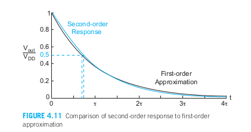

## 4.3.5 Elmore延时
&emsp;&emsp;大多数关心的电路可以表示为一个RC树形结构，即没有环路的RC电路。树的根是电压源，而树叶是分支末端的电容器。Elmore延迟模型【Elmore48】估计从源切换到某个叶节点变化的延迟，这个延迟可以表示为在每个节点i上的电容Ci乘以从源到该节点及叶节点的共享路径上的有效电阻Ris的总和。通过示例可以更好地说明Elmore延迟的应用。

同时延时也包括： 寄生延时 和 努力延时 。
**寄生延时：** 是一个门驱动它自己内部扩散电容所需要的时间。加大晶体管的宽度将减小电阻但会增大电容，因此寄生延时在理想上与门的尺寸无关。  
**努力延时：** 取决于外部负载电容与输入电容的比h，因而它随晶体管的宽度而变。它也取决于门的复杂程度。这一电容比称为扇出或电气努力，而代表门复杂度的项称为逻辑努力。  

## 4.3.6 版图设计对扩散电容大小的影响
&emsp;&emsp;在一个良好的版图设计中，凡是有可能的地方都要共享扩散节点以减少扩散电容，而在串联晶体管之间不带接触的扩散节点通常比必须带接触的扩散节点尺寸小。虽然这些不带接触的节点具有较小的电容，但在进行手工计算时将忽略这一差别。在完成版图前估计电容的一个保守方法时假设在串联晶体管之间的扩散区不带接触而所在所有其余节点上的扩散区都带接触。但一旦完成版图，就可以对电容进行较为精确的估计。  

## 4.3.7 确定等效电阻
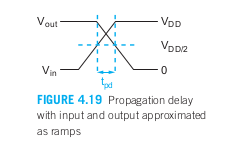
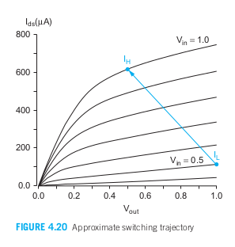

&emsp;&emsp;有效电阻是一个晶体管在开关事件期间Vds / Ids的平均值。如第4.3.4节所述，为了使传播延迟可以写成RC乘积，电阻被乘以一个ln 2的系数。对于上升输入的阶跃响应，我们感兴趣的是输出通过nMOS晶体管从VDD放电到VDD / 2的时间。如果晶体管的速度饱和程度足够高，使得Vdsat < VDD / 2，那么在整个转换过程中晶体管将保持在饱和区，电流大致恒定为Idsat。在这种情况下，等效电阻为:  

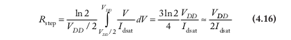  

&emsp;&emsp;沟道长度调制和漏电压诱导的势垒降低（DIBL）会使实际晶体管中的电流随着Vds的增加而有所减小，从而稍微增加了有效电阻。  

&emsp;&emsp;更重要的是，输入具有非零上升时间，我们关心的是从输入上升到VDD / 2到输出下降到VDD / 2之间的时间。假设输入和输出的斜率相等，并且当输入通过VDD / 2时输出开始下降。那么，当输入达到VDD时，输出将到达VDD / 2，如图4.19所示。  

&emsp;&emsp;定义在转换开始时晶体管的电流为IL（当Vgs = VDD / 2, Vds = VDD时），并定义在转换结束时的电流为IH（当Vgs = VDD, Vds = VDD / 2时），如图4.20所示。那么，在开关事件期间，晶体管可以近似为一个电流源Ieff，其值为这两个极端值的平均值:  

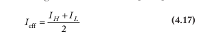 

&emsp;&emsp;因此输出放电至VDD/2所需要的时间为：

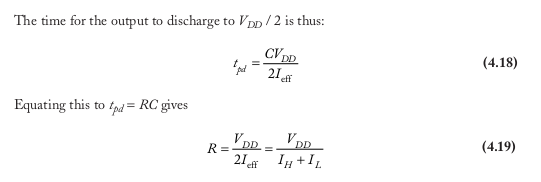  

## 4.4 线性延时模型
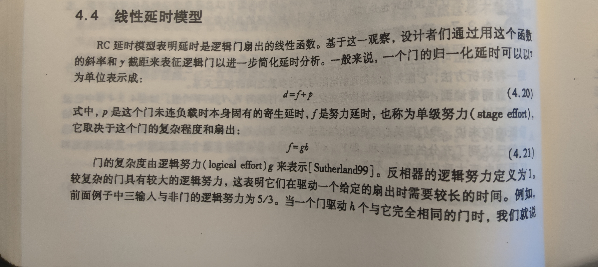
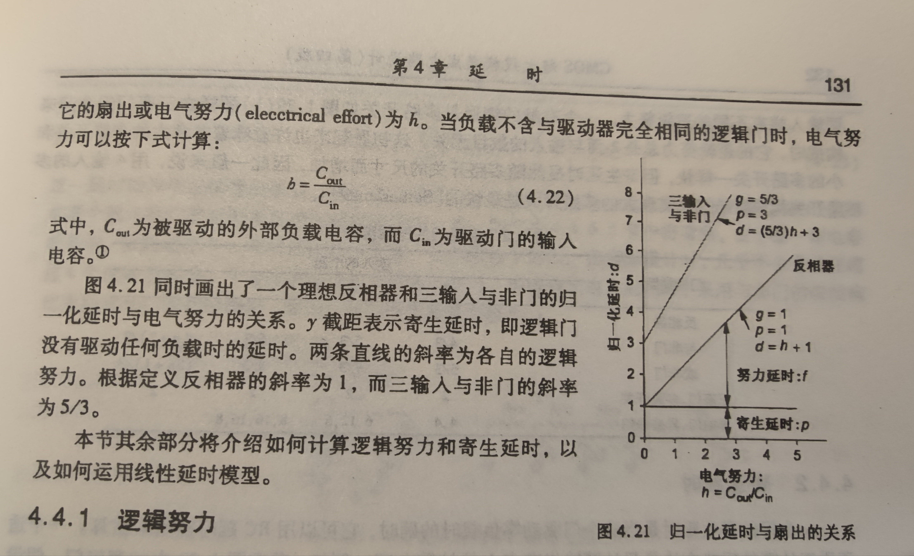

### 4.4.1 逻辑努力
**一个门的逻辑努力定义：** 这个门的输入电容与一个能提供与这个门相同输出电流的反相器的输入电容之比。换言之，逻辑努力表示当一个门的每一个输入端只能表现出与反相器有相同的输入电容时，它在产生输出电流方面比起反相器来有多差。  
逻辑努力可以通过模拟从延时与扇出的关系图中求出，它实际上就是一个门的延时的斜率与一个反相器的延时的斜率之比。另外它也可以通过画出门的草图来计算。

### 4.4.2 寄生延时
&emsp;&emsp;门的寄生延迟是指在门驱动零负载时的延迟。可以用 RC 延迟模型来估算。一个适合手工计算的粗略方法是只考虑输出节点上的扩散电容。增加晶体管的尺寸可以减少电阻，但相应地增加了电容，因此寄生延迟在一阶近似下与门的大小无关。然而，更宽的晶体管可以折叠，并且通常内部布线的寄生电容增加不到线性，因此实际上较大的门往往具有略低的寄生延迟。  

### 4.4.3 逻辑门的延时
看原书4.4.3

### 4.4.4 驱动强度
&emsp;&emsp;在一个良好的标准单元库中，每种常见的门可以有多种不同的尺寸。这些尺寸一般都以它们的驱动强度标注。通常比较直观的是用门的驱动强度即倍数x而不是用它们的输入电容来表征它们。

## 4.5 路径逻辑努力
### 4.5.1 多级逻辑网络的延时
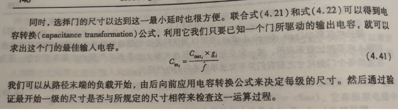
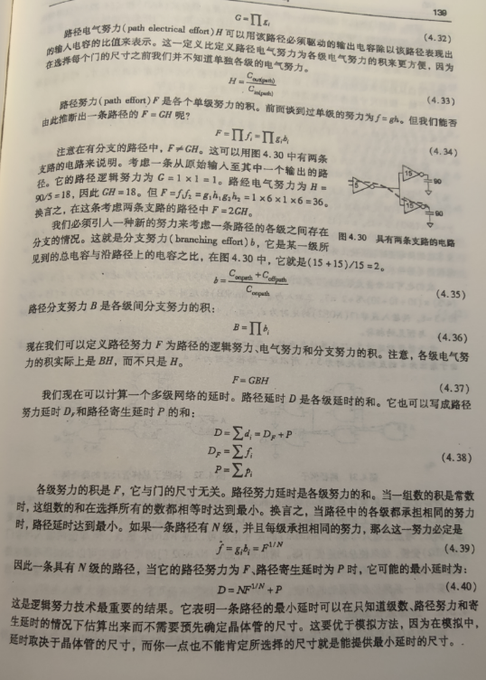
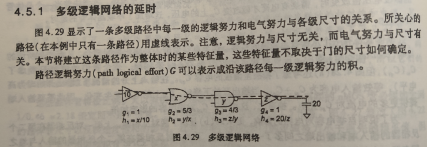

### 4.5.2 选择最优级数
&emsp;&emsp;逻辑努力方法告诉我们与非门比或非门好，具有较少输入的门比具有许多输入的门好。逻辑设计者常常假设每一级逻辑都有固定不变的“门延时”，并且通过统计逻辑的级数来估算延时。但这可能是一种误导，因为这意味着最快的电路就是那些采用最少逻辑级数的电路。很显然，门延时实际上取决于电气努力，所以采用较少的逻辑常常会导致更大的延时。

### 4.5.3 逻辑努力方法的局限性
&emsp;&emsp;逻辑努力方法基于线性延时模型，并且它的前提只是通过使每级努力延时相等来实现最小的路径延时。这一简化过程是这一方法的最大优势，但也产生了许多局限性：  
-逻辑努力没有考虑互连。逻辑努力方法最适于具有规则版图的高速电路，因为这些电路中布线延时不占主要地位。这些结构包括加法器、乘法器、存储器及其他数据通路和阵列。  
-逻辑努力方法说明了如何设计一条关键路径使它具有最高的速度，但没有说明如何设计整个电路使它在给定的速度约束下具有最小的面积或功耗。  
-当路径具有不均衡的分支或重新聚合的扇出时，很难用手工进行分析。  
-线性延时模型不能包括输入斜率的影响。幸运的是，在良好设计的电路中每级的努力延时相等，边沿速率往往大致相同。

