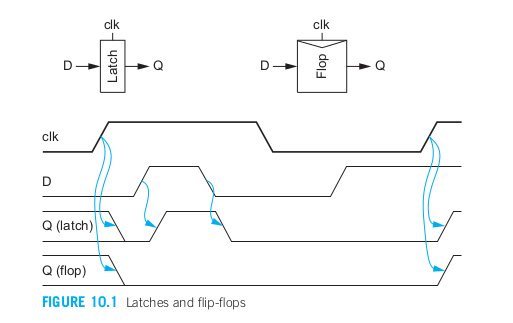

- [第10章 时序电路设计](#第10章-时序电路设计)
  - [10.1引言](#101引言)
  - [10.2 静态电路的时序控制](#102-静态电路的时序控制)
    - [10.2.1 时序控制方法](#1021-时序控制方法)
    - [10.2.2 最大延时约束](#1022-最大延时约束)
    - [10.2.3 最小延时约束](#1023-最小延时约束)
    - [10.2.4 时间借用](#1024-时间借用)
    - [时钟偏斜](#时钟偏斜)
  - [10.3 锁存器和触发器的电路设计](#103-锁存器和触发器的电路设计)
    - [10.3.1 传统CMOS锁存器](#1031-传统cmos锁存器)
    - [10.3.2 传统CMOS触发器](#1032-传统cmos触发器)
    - [10.3.3 脉冲锁存器](#1033-脉冲锁存器)
    - [10.3.4 可复位锁存器和触发器](#1034-可复位锁存器和触发器)
    - [10.3.5 具有使能端的锁存器和触发器](#1035-具有使能端的锁存器和触发器)
    - [10.3.6 将逻辑合并到锁存器中](#1036-将逻辑合并到锁存器中)
    - [10.3.7 克拉斯半动态触发器](#1037-克拉斯半动态触发器)
    - [10.3.8 差分触发器](#1038-差分触发器)
    - [10.3.9 双边沿触发的触发器](#1039-双边沿触发的触发器)
    - [10.3.10 抗辐照触发器](#10310-抗辐照触发器)

# 第10章 时序电路设计
## 10.1引言
&emsp;&emsp;在第9章讨论的组合电路中，输出是当前输入的函数。本章将讨论时序电路，在这种电路中输出不仅取决于当前的输入，还取决于以前的输入，这样的电路称为具有状态。有限状态机和流水线是两种最重要的时序电路例子。  
&emsp;&emsp;时序电路通常采用触发器或锁存器设计，它们通常称为存储元件，而它们所保持的数据称为令牌。这些元件的作用并不是真正的存储器，而是强制实施顺序，以区分当前令牌还是上一或下一令牌，因此我们将称它们为时序元件。如果没有时序元件，下一令牌就有可能赶上上一令牌，使这两个令牌相混淆。时序元件阻止过早到达的令牌，避免它们赶上上一令牌。遗憾的是，时序元件不可避免地会在本来很关键的令牌路径上增加延时，因而降低了系统的性能。这一额外的延时称为时序开销。  
&emsp;&emsp;静态电路是指没有任何时钟输入的门，如互补CMOS、伪nMOS或传输管逻辑。动态电路是指具有时钟输入的门，特别是多米诺逻辑。使电路术语更复杂的是，时序元件本身也可以是静态的或动态的。具有静态存储的时序元件采用某种反馈使它的值输出值永远保持下去，而具有动态存储的元件一般将它的值作为电荷保存在电容上，但如果长时间没有刷新，这些电荷就会因泄漏而消失。选择逻辑门使静态还是动态与选择时序元件是静态还是动态可以没有关系。  

## 10.2 静态电路的时序控制
&emsp;&emsp;1.4.9曾提到锁存器和触发器是两种最常用的时序元件，它们都有三个终端：数据输入D、时钟CLK和数据输出Q。锁存器在时钟为高电平时透明而在时钟为低电平时不透明。换言之，当时钟为高时，D流过锁存器到达它的输出端Q，此时锁存器就好像是一个缓冲器；当时钟为低时，即使D发生变化，锁存器也仍将保持当前的输出Q不变。触发器是一个边沿触发器件，它在时钟上升沿时将D复制到Q上，而在所有其他时间上都不受D变化的影响。这些情形显示在图10.1中，图中Q在第一个时钟上升沿之前的未知状态是用两条分别在低电平和高电平上的横线表示的。  
  
&emsp;&emsp;本节介绍静态电路时序控制最广泛采用的三种方法，这些方法分别利用以下元件：触发器、两相位透明锁存器，以及脉冲锁存器。理想的时序控制方法将不产生任何时序开销，允许时序元件之间没有任何逻辑而直接相连，使设计者能灵活地均衡在每个时序周期上的逻辑数量，能容忍适当大小的时钟偏斜而不降低性能，以及不花费任何面积和功耗。  

### 10.2.1 时序控制方法
&emsp;&emsp;图10.2显示了组合逻辑模块时序控制的三种方法。每种情形都显示了时钟波形、时序元件以及组合逻辑。水平轴相应于一个数据令牌到达电路中某点的时间。例如，这个令牌在第一个时针上升沿时被第一个触发器捕获，它传播通过组合逻辑并在第二个时钟上升沿到达第二个触发器。垂直虚线代表在一个时钟周期和下一个时钟周期之间的边界，时钟周期为Tc。在两相位系统中，两个相位之间可以相隔一段时间t(nonoverlap)；而在脉冲控制系统中，脉冲宽度为tpw。  
&emsp;&emsp;以触发器为基础的系统在每个时钟周期边界上采用一个触发器。数据令牌在时钟上升沿时从一个周期传送到下一个周期。如果令牌到达得太早，它就必须在触发器处等待直到下一周期到来。注意，触发器可以看成是一对前后直接连接的锁存器，它们分别用clk和它的反相位信号控制，如图10.3所示。如果将这两个锁存器分开，就可以将组合逻辑的整个周期规划分成两段，它们常常称为半周期。而这两个锁存器时钟常称为Φ1和Φ2.Φ1和Φ2可以相应于clk和它的反信号clk非，也可以是两个不重叠的时钟信号t(nonoverlap) > 0。在任何给定时刻，至少有一个时钟为低因而相应的锁存器不透明，从而阻止了一个令牌赶上另一个令牌。这两个锁存器的行为非常类似于运河船闸中两个不漏水的闸门。脉冲锁存器系统取消了每周期两个锁存器中的一个，但他用短脉冲控制余下的一个锁存器。如果脉冲比通过组合逻辑的延时还短，那么仍然可以期望令牌将只在每个脉冲到来时传送通过一个时钟周期。  
&emsp;&emsp;表10.1定义了组合逻辑的时序元件的延时及时序约束。这些延时对于上升和下降跳变可以有很大的差别，因而可以用下表r或f来区别它们。为简略起见，我们将全部用最大和最小来表示。  
&emsp;&emsp;图10.4用时序图表示了这些延时。在时序图中，水平轴代表时间而垂直轴代表逻辑电平。单条横线表示信号在那时为高电平或低电平。一对横线表示信号是稳定的但我们并不关心它的具体值。交叉线表示信号在那时可能变化。一对横线加上交叉阴影线表示信号在这段时间间隔内可能变化一次获多次。  
  
  

### 10.2.2 最大延时约束
&emsp;&emsp;在理想情况下，整个时钟周期都可以用来在组合逻辑中进行计算。自然、锁存器或触发器的时序开销将减少这一计算时间。如果组合逻辑的延时太大，那么接收元件因没有充分的建立时间而将采样错误的数值，这称为**建立时间失效或最大延时失效**。它可以通过重新设计逻辑使逻辑速度加快或通过加长时钟周期来解决。本节将计算可用于逻辑的实际时间以及我们最常采用的每种时序元件即触发器、两相位锁存器和脉冲锁存器的时序开销。  
  
&emsp;&emsp;图10.5显示了假设时钟为无任何偏斜的理想时钟时，在一条路径上从一个触发器至下一个触发器的最大延时时序约束。这条路径从触发F1的时钟上升沿开始。数据必须在下一个时钟上升沿之前传播到F1的输出端Q1并通过组合逻辑到达D2，最后稳定在F2中。这意味着时钟周期至少必须为：  
  
&emsp;&emsp;另外还可以计算出能允许的最大逻辑延时，它就是周期时间减去由触发器的传播延时及建立时间引入的时序开销：  
  
  
&emsp;&emsp;图10.7显示了一条采用两相位透明锁存器的路径类似的时序约束。假设在锁存器透明（Φ1为高）时，数据D1到达L1，然后数据传播通过L1、第一组合逻辑模块、L2及第二个组合逻辑模块。从技术上讲，D3最迟可以在Φ1下降沿的建立时间之前到达就仍然能被L3正确地捕获。但为公平起见，我们将坚持D3应按规定在D1之后不超过一个时钟周期的时间内到达，因为从长远来看，要想在设计中使每一条单周期路径的耗时都超过一个完整的时钟周期时不可能的。如果其他路径耗时短些，那么某些路径可以耗时长些，这一技术称为时间借用，它将在10.2.4节中介绍。假设这条路径的耗时不超过一个周期，我们可以看到周期时间必须满足：  
  
&emsp;&emsp;同样，可以计算出最大的逻辑延时，它等于通过两个时钟相位的路径上所有逻辑延时的和。时序开销由两个锁存器的传播延时构成。注意，两个时钟之间不重叠不会影响以锁存器为基础的系统性能，因为即使两个时钟都为低，数据仍将继续传播通过在锁存器之间的组合逻辑。我们已经知道一个触发器可以由两个锁存器构成，它们的延时决定了触发器的传播延时和建立时间，因此看到式10.4非常类似于式10.2。  
  
  
&emsp;&emsp;脉冲锁存器的最大延时约束类似于两相位锁存器，只是在关键路径上只有一个锁存器，如图10.8a所示。但如果脉冲比建立时间还短，那么数据就必须在脉冲上升之前就已经建立起来，如图10.8b所示。当同时考虑这两种情形时就可以得到：  
  
&emsp;&emsp;在求出最大的逻辑延时后可以看到，如果脉冲足够宽可以隐去建立时间，那么时序开销只是一个锁存器的延时：  
  

### 10.2.3 最小延时约束
&emsp;&emsp;在理想情况下，时序元件可以前后直接连接，不需要在它们之间插入组合逻辑仍能正确工作。例如，一条流水线可以采用前后直接连接的寄存器按顺序逐级向前传送一条指令的操作码而不去修改它。但如果寄存器的保持时间很大而污染延时很小，那么数据就有可能错误地在同一时间延时连续传播通过前后两个时序元件，从而破坏系统应有的状态。这称为**竞争条件、保持时间失效或最小延时失效**。但它只能通过重新设计逻辑而不能通过减慢时钟来解决。因此，设计者在避免这类失效时应非常谨慎，因为修改设计和重新制造芯片的成本极高且费时。  
  
&emsp;&emsp;图10.9显示了假设时钟为无偏斜的理想时钟时，在一条路径上从一个触发器到下一个触发器的最小延时时序约束。这条路径从触发F1的时钟上升沿开始。在经过F1的clk-to-Q污染延时后，Q1处的数据开始变化，再经过一段逻辑的污染延时后，数据到达D2处。但这个变化了的数据必须在时钟沿的保持时间thold之后才能到达D2，以免它破坏F2的内容，因此我们可以求出最小的逻辑污染延时：  
  
&emsp;&emsp;如果通过触发器的污染延时大于保持时间，那么你可以很放心地采用前后直接连接的触发器。但如果不是这样，就必须在触发器之间直接增加延时（例如插入缓冲器），或在需要前后直接连接触发器的路径上采用特殊的、污染延时比普通触发器更长的慢触发器。扫描链是一个常见的具有前后直接连接触发器的路径例子。  
  
&emsp;&emsp;图10.10显示了再一条路径上从一个透明锁存器至下一个透明锁存器的最小延时时序约束。这条路径从Φ1上升沿时数据通过L1开始。但数据必须在Φ2上一个下降沿的保持时间之后才能到达L2，因为L2应当在L1变透明之前就已经完全不透明了。由于这两个时钟沿之间相隔一段时间t（nonoverlap），所以每一相逻辑的最小逻辑污染延时为：  
  
**(注意，我们只推导了经过第一个半周期的最小延时，但第二个半周期具有相同的时序约束。)**  
&emsp;&emsp;这一结果表明，使t（nonoverlap）足够大就可以完全避免保持时间失效。但在高速情况下产生和分布不重叠时钟极具挑战性，因此大多数以透明锁存器为基础的商用系统都采用互补时钟信号。在这种情况下，t（nonoverlap） = 0,因而锁存器的污染延时约束和触发器的相同。  
&emsp;&emsp;但这会引起明显的自相矛盾：在以锁存器为基础的系统中，需要对两个相位的逻辑都应用污染延时约束，而在以触发器为基础的系统中，是对整个周期的逻辑应用这一约束。因此与触发器相比，锁存器似乎需要满足两倍于寄存器整个逻辑的污染延时约束。但触发器却可以由一对锁存器构成！不过，如果注意到在触发器的两个锁存器之间存在内部竞争条件，那么这一自相矛盾的情形就可以化解，因此必须仔细设计触发器使它总能可靠地工作。  
  
&emsp;&emsp;图10.11显示了再一条路径上从一个脉冲锁存器到下一个脉冲锁存器的最小延时时序约束。现在数据在脉冲的上升沿时出发但必须保持到该脉冲的下降沿之后。因此，与触发器相比，脉冲宽度实际上相当于增加了脉冲锁存器的保持时间。  
  

### 10.2.4 时间借用
&emsp;&emsp;在采用触发器的系统中，数据在时钟上升沿时从第一个触发器出发并必须在时钟的下一个上升沿之前在第二个触发器处建立起来。如果数据推迟到达，那么电路就会产生错误结果。如果数据提前到达，那它就被触发器阻挡直到时钟上升沿到来，因而时钟沿到来之前的这段时间就被浪费了。因此我们说时钟强加了一个硬边沿，因为它清楚地划分开各个周期。  
  
&emsp;&emsp;相反，当系统采用透明锁存器时，数据可以在时钟上升沿时从第一个锁存器出发，但他只需要在时钟下降沿之前在接收锁存器中建立起来。如果一条流水线的某个半周期或某一流水线级有太多的逻辑，那么它可以借用下半个周期或下一级的时间，如图10.12a所示。时间借用可以在多个周期上累积。但在具有反馈的系统中，长延时必须由短延时来均衡，使整个回路能在所允许的时间内完成。例如，图10.12b显示了一个单周期的自旁路回路，其中发生了跨半周期的时间借用，但整条路径必须在一个周期内完成。自旁路回路的一个典型例子就是流水线处理器中的执行级，其中的ALU必须完成一个操作并将结果旁路回ALU供一条相关指令使用。在数字系统中大多数关键路径都发生在自旁路回路中，因为其他等待时间都无关紧要。  
  
&emsp;&emsp;图10.13显示了一个基于锁存器的两相位系统所能借用的最长时间（即每个半周期逻辑除了名以上分配给它的时间Tc / 2 - tpdq之外还能再借用的时间）。由于数据只需要在接收锁存器时钟的下降沿之前建立起来，所以一个相位能从下一个相位借用多至半个周期的时间（减去建立时间和不重叠时间）：  
  
&emsp;&emsp;脉冲锁存器可以看成是用窄脉冲控制的透明锁存器。如果脉冲比建立时间宽，那么脉冲锁存器也允许一个周期从下一周期中借用少量的时间：  
  
&emsp;&emsp;时间借用对系统设计者带来两个好处。最明显的好处是有意时间借用，利用它设计者可以更容易地平衡在半周期之间和流水线级之间的逻辑，从而有可能缩短设计时间，因为逻辑的平衡可以在电路设计阶段进行而不需要修改微架构将一些功能明确地从一个流水级转移到另一个流水级。另一个好处就是机遇时间借用，因为即使设计者在设计师仔细均衡使每一级流水的延时相同，但由于工艺和环境的扰动以及CAD系统所使用时序模型的不精确性仍会使制造出的芯片中各流水级之间的延时不相同。在具有硬边沿的系统中，最长的延时路径决定了最小的时钟周期。但在能借用时间的系统中，较慢的延时路径可以有机会从较快的延时路径中借用时间，从而在一定程度上平衡了各条路径在延时上的差别。  
&emsp;&emsp;一些有经验的设计主管禁止在芯片接近记带前采用有意时间借用，否则一些设计者会过分相信他们设计的流水级可以从相邻的流水级中借用时间。如果过多设计者都做这样的假设，那么所有的路径都会变得过长。更糟糕的是，这一问题可能一直隐藏到开始进行全芯片的时序分析时才发现，但到那时想要重新设计这么多条路径已经为时太晚了。解决这个问题的另一个办法就是在设计过程的早期就开始进行全芯片的时序分析。  

### 时钟偏斜
  
&emsp;&emsp;我们的分析至今一直假设时钟是零偏斜的理想时钟。但实际中，时钟在它们的到达时间上有某种的不确定性，因而有可能减少可用于计算的时间，如图10.15a所示。图中加粗的clk线表示时钟可能最迟到达的时间。斜阴影线表示由于时钟偏斜，时钟可能提早到达的时间范围。在以触发器为基础的系统中对于最大延时约束，最坏情形发生在发送触发器接收的是迟到达的时钟（上升沿），而接收触发器接收的是早到达的下一个时钟（上升沿）。在这种情形中，时钟偏斜将作为时序开销从可用于有用计算的时间中减去。对于最小延时约束，最坏情形发生在发送触发器接收的是早到达的时钟（上升沿），而接收触发器接收到的是迟到达的时钟（上升沿），如图10.15b所示。在这种情形中，时钟偏斜实际上相当于增加了系统的保持时间：  
  
  
&emsp;&emsp;在采用透明锁存器的系统中，时钟偏斜不降低性能。图10.16显示了即使时钟发生偏斜仍然可以利用整个周期（减去两个锁存器延时）进行计算，因为数据仍然可以在锁存器透明时到达。因此我们说，以透明锁存器为基础的系统是容偏斜的。但偏斜在实际上仍然相当于在每半个周期上增加了保持时间，它也减小了可用于时间借用的窗口：  
  
&emsp;&emsp;脉冲锁存器所能承受的偏斜时间正比于脉冲宽度。如果脉冲足够宽，那么偏斜将不增加时序开销，因为数据能在锁存器透明时到达。但如果脉冲太窄，那么偏斜就可能使性能下降。同样，偏斜在事实上相当于增加保持时间，因而减少了能借用的时间。  
  
&emsp;&emsp;总之，具有硬边沿（例如触发器）的系统需要从可用于计算的时间中减去时钟偏斜，而具有软边沿（如锁存器）的系统可以利用它的透明窗优点承受一定数量的时钟偏斜而不增加时序开销。特别是对于最小延时检查及最大延时检查可以做出不同数量的时钟偏斜预算。同样，邻近的时序元件之间多半比在芯片对角上的元件之间有较小的时钟偏斜。当前的自动布局布线工具花费了相当大的努力对时钟延时建模并插入缓冲元件使时钟偏斜最小。但于对不断追求更短周期时间的系统来说，时钟偏斜问题正变得越来越严重。  

## 10.3 锁存器和触发器的电路设计
&emsp;&emsp;传统的CMOS锁存器由传输管或三态缓冲器构成，它在锁存器透明时传送数据而在锁存器不透明时通过反馈保持数据。我们先从分析基本锁存器的电路设计开始，然后利用它们构成触发器及脉冲锁存器。许多锁存器具有复位和/或使能输入端，也可以把逻辑功能加入到锁存器中以减少时序开销。  
### 10.3.1 传统CMOS锁存器
  
&emsp;&emsp;图10.17a为一个由单个晶体管构成的非常简单的透明锁存器。它的面积小、速度快，然而却有四个缺点：首先它的输出摆幅不是轨至轨（即从GND至VDD），因为输出不可能时所唵声道VDD-Vt以上。第二，输出是动态的，换言之，当锁存器不透明时输出将浮空。如果浮空时间太长，它就有可能因泄漏漏电而遭受扰动。第三，D直接驱动传输管的扩散区输入，这将引起潜在的噪声问题并使利用静态时序分析对延时建模变得更加困难。最后，由于状态节点暴露在外，所以输出端的噪声有可能破坏这一状态。图10.17的其余部分显示了改进设计的锁存器，它们采用了较多的晶体管来保证锁存器工作的鲁棒性较好。  
&emsp;&emsp;图10.17b采用CMOS传输门代替单个的nMOS传输管以提供轨至轨的输出摆幅。它需要有互补的时钟，Φ非，Φ非可以通过额外的输入来提供，也可以由Φ通过一个反相器在本地生成。  
&emsp;&emsp;图10.17c增加了一个输出反相器使状态节点X与输出端的噪声相隔离。自然，这就构成了一个反相位的锁存器。  
&emsp;&emsp;图10.17d的行为也与一个反相位锁存器一样，但他的输入端被缓冲而输出端未被缓冲。如在9.2.5.1中曾讨论那样，反相器后面接传输门实际上就相当于一个三态反相器，但它因输出端由传输门的两个并联晶体管同时驱动而具有稍小的逻辑努力。图10.17c和d都是快速动态锁存器。  
&emsp;&emsp;在现代工艺中，亚阈值泄漏电流非常大，因此动态节点只能使它们的值保持一段很短的时间，特别是在老化试验时的高温和高压下更是如此。因此实际的锁存器需要静态化，即增加反馈回路来防止输出浮空，如图10.17e所示。当时钟为1时。输入传输们导通，而反馈回路上的三态反相器关断，此时锁存器是透明的。当时钟为0时，输入传输门关断，但此时反馈回路上的三态反相器导通，将X保持在正确的电平上。  
&emsp;&emsp;图10.17f增加了一个输入反相器使输入端使晶体管的栅极而不是未经缓冲的扩散区。遗憾的是，无论图10.17e还是f都重新引起了输出对噪声的敏感性：在输出端上较大的尖峰噪声有可能通过反馈门从后传播至前破坏状态节点X的电平。  
&emsp;&emsp;图10.17g是一个鲁棒性好的透明锁存器，它克服了至今为止提到过的所有缺点：该锁存器是静态的，所有节点的摆幅都是轨至轨，状态节点与输出端上的噪声隔离，并且输入驱动晶体管的栅极而不是扩散区。这一锁存器广泛使用在标准单元应用中。  
&emsp;&emsp;在输入噪声能很好控制的半定制数据通路应用中，采用图10.17h的反相位锁存器比较有利，因为它的速度较快而面积较小。
&emsp;&emsp;图10.17i显示的侧栓锁存器是从图10.17g演变而来的，它采用一个弱反馈反相器代替三态反相器，因而减少了时钟负载并节省了两个晶体管。但它需要仔细设计电路以保证输入处的三态电路有足够的强度可以在所有的工艺角上超过反馈反相器。图10.17j是另一种侧栓锁存器，它常用在寄存器堆和现场可编程门阵列（FPGA）单元中。多个这样的锁存器可以将数据读出到同一条Dout线上但任何时候只有一个锁存器的RD信号有效使它读出。安腾2处理器采用图10.17k所示的锁存器。在静态反馈回路中，下拉堆叠结构是时钟控制的，而上拉是一个弱pMOS管。因此，驱动输入的门必须有足够的强度可以克服反馈回路的作用。安腾2的单元库中还包括一种类似的锁存器，它有一个额外的输入反相器可以在它前面的门太弱或离得太远时用来缓冲输入数据。因为有这个输入反相器，所以这个锁存器可以看成是图10.17g和i这两种设计的混合。此外某些锁存器再增加一个反相器以同时提供正反互补输出。  
  
&emsp;&emsp;图10.17d中的动态锁存器也可以画成一个时钟控制的三态电路，图10.18a所示。这种形式的电路常称为 **时钟控制CMOS**。但采用反相器和传输门的传统形式速度稍快，因为它的输出由并联在一起工作的nMOS管和pMOS管同时驱动。时钟控制CMOS的面积稍小，因为它取消了两个接触。图10.18b显示了另一种形式的三态电路，它互换了数据和时钟输入端的位置。虽然它在逻辑上与图10.18a的电路等效，但在电气性能上较差，因为当该锁存器不透明时，使D发生翻转有可能在输出节点上引起电荷分享噪声。  
&emsp;&emsp;至今所介绍的所有锁存器在Φ为高时透明。但只要互换Φ和Φ非的位置就可以把它们转变时钟低有效的锁存器。  

### 10.3.2 传统CMOS触发器
  
&emsp;&emsp;图10.19a显示了一个动态反相位触发器，它由一对前后直接连接的动态锁存器构成，其中第一个或最后一个反相器可以取消以减少延时，但代价是噪声对未缓冲的输入或输出的敏感性加大。图10.19b通过增加反馈回路和另一个反相器得到一个非反相的静态触发器。  
&emsp;&emsp;触发器通常接收单个时钟信号Φ并在本地生成了它的反相时钟信号Φ非。如果时钟上升/下降的太慢，那么这两个互补时钟就有可能同时处在一个中间电压上，使两个锁存器透明，因而增加了触发器的保持时间。在ASIC标准单元库中，触发器单元的时钟都是互补时钟并都经过缓冲以提高边沿速率，其代价是使反相器的数目和时钟负载增加。然而，时钟负载应当保持尽可能的小，因为时钟的活动因子为1,所以是触发器中大部分功耗的来源。  
  
&emsp;&emsp;前面曾提到，触发器在它的两个锁存器之间也存在潜在的内部竞争条件。在他生成的主时钟和互补时钟之间因反相器延时引起的时钟偏斜进一步加剧了这一竞争。图10.20a采用内置时钟反相器重画了图10.19a。当时钟Φ下降，主时钟和它的互补时钟将同时为低一段短暂的时间，如图10.20b所示，使两个传输门的钟控pMOS同时导通。如果时钟偏斜（即反相器的延时）太大，那么数据就有可能在时钟下降沿时连续穿过两个锁存器，使操作出错。图10.20c显示了一个时钟控制CMOS动态触发器，它采用时钟控制CMOS锁存器而不是反相器和传输门构成。由于每一及电路都是反相位的，数据将通过一个锁存器的nMOS下拉堆叠和另一个锁存器的pMOS上拉堆叠传送，因而使两个钟控pMOS管同时导通的时钟偏斜不会引起竞争危险。但该触发器仍然很容易因边沿速率太慢而失效，因为太慢的边沿速率会使两类晶体管同时部分导通。同样，这种容偏斜优点甚至当两个时钟控制CMOS锁存器之间插入偶数个反相位逻辑级也仍然保持着。这一技术常称为NORA（No Race）技术。但在实际中，大多数触发器的设计都会仔细控制时钟反相器的延时，因此采用传输门的设计是安全的并且也比时钟控制CMOS稍快些。  
  
&emsp;&emsp;所以这些触发器设计仍然存在触发器之间潜在的最小延时问题，特别是当触发器之间只有很少或完全没有逻辑而时钟偏斜很大或对它分析得很糟糕的时候。对于VLSI的课程设计，由于仔细分析时钟偏斜非常费时费力并且性能也不是最重要的考虑因素，因此另一种比较合理的方法是采用一对两相位不重叠时钟而不是互补时钟，如图10.21所示。触发器在Φ1上升沿时捕获它的输入数据。只要使不重叠时间足够长，该电路在时钟偏斜较大的情况下仍能正确工作。但因为逻辑不能利用重叠时间，所以它直接增加了触发器的建立时间和时序开销。  

### 10.3.3 脉冲锁存器
  
&emsp;&emsp;脉冲锁存器可以由短时钟脉冲驱动的传统CMOS透明锁存器构成。图10.22a显示了一个简单的脉冲发生器，它常称为**时钟斩波器或单脉冲发生器**。脉冲锁存器比常规的触发器快，因为它只采用一个而不是两个锁存器并且它允许时间借用。虽然它的脉冲发生器会增加能耗（但为了提高能量效率和面积效率，可以设想在多个脉冲锁存器之间共享一个脉冲发生器），这样它的能耗仍较少。它的缺点就是增加了保持时间。  
&emsp;&emsp;安腾2处理器采用的Naffziger脉冲锁存器，由图10.17k中的锁存器构成。由图10.22b中的发生器所产生的甚至更短的脉冲驱动。这一脉冲发生器采用相当慢（弱）的反相器产生一个标称宽度大约为1/6时钟周期的脉冲（对于1.2GHz的工作频率，脉冲宽度为125ps）。当被禁止工作时，该脉冲发生器的内部节点会短暂地浮空在高电平上，但并不需要保持器，因为这一时间非常短。自然，在时钟上升沿附近，使能信号应满足建立时间和保持时间的需求，如图10.22c所示。  
&emsp;&emsp;图10.22d还显示了用在NEC RISC处理器中用来产生相当宽脉冲的另一种脉冲发生器，它含有一个内置的动态传输门锁存器可防止使能信号在脉冲器件产生毛刺。  
&emsp;&emsp;许多设计者都认为短脉冲有风险，因此脉冲发生器应当在各个工艺角上及可能的RC负载下仔细模拟，以保证脉冲不会因工艺扰动和布线问题而变得太糟糕。但安腾2的设计团队发现，只要脉冲发生器有足够的驱动，就可以像时用常规时钟那样使用脉冲信号。四核安腾处理器的脉冲发生器利用一个传输门多路开关可以选择由单个反相器还是由三个反相器构成延时链。较宽的脉冲能使锁存器在各种工艺和环境扰动下工作的鲁棒性更好并允许借用更多的时间但它将增加保持时间。多路开关的选择采用软件编程的方式，以能调整和解决制造后发现的问题。  

### 10.3.4 可复位锁存器和触发器
  
&emsp;&emsp;大多数实际的时序元件都要求有一个复位信号使它能在启动时进入一个已知的初始状态保证有确定的行为。图10.24为具有复位输入端的锁存器和触发器。复位可以分为两类：同步复位和异步复位。异步复位能强制使输出Q立即变为低电平，而同步复位需要等待时钟到来之后才起作用。同步复位信号必须在时钟边沿附近的建立和保持稳定而异步复位的特点是从复位至输出有一段传播延时。同步复位只需将输入D和reset非信号进行与操作，而异步复位对数据和反馈回路同时进行门控以迫使复位与时钟信号无关。三态与非门可以采用一个与非门和一个时钟控制的传输门相串联构成。  
&emsp;&emsp;可置位锁存器和触发器强制使输出变为高电平而不是低电平。它们类似与图10.24中的复位元件，但用或非门代替与非门并用置位信号set代替复位信号reset非。图10.25为一个同时具有异步置位和复位的触发器。  

### 10.3.5 具有使能端的锁存器和触发器  
  
&emsp;&emsp;时序元件也常常接受一个使能输入。当使能信号en为低时，该时序元件保持它的状态而与时钟无关。使能信号可以用输入多路开关或时钟门控方式实现，如图10.26所示。当时序元件被禁止时，输入多路开关将反馈原来的状态。引入多路开关将增加面积和延时。时钟门控不影响数据输入路径上的延时并且多个钟控元件可以共享一个与门。同时，它还显著降低了功耗，因为在被禁元件上的时钟不发生翻转。但与门延迟了时钟信号，因而有可能引入时钟偏斜。13.4.5节将介绍如哥通过将与门放在时钟分布网络的终端缓冲器来减少时钟偏斜的技术。en信号必须在时钟为高时保持稳定，以防止时钟出现毛刺，这将在10.4.6节中进一步讨论。  

### 10.3.6 将逻辑合并到锁存器中
&emsp;&emsp;可以将逻辑合并到锁存器中来减少时序开销。例如，可以用能进行有用计算的逻辑门代替其中的一些反相器。采用各式各样的锁存器，这些锁存器都是通过将钟控传输门放在反相静态CMOS门如与非门、或非门或反相器的前面和后面构成的。这使传输门锁存器的时序开销减少而且保留了经缓冲的输入和输出。多路开关-锁存器使第二种实现方法，它包括两个并行的传输门，它们由与相应选择信号构成的门控时钟控制。这种方式在集成多路开关功能时不额外增加从D输入至Q输出的延时，只是在状态节点上增加了少量的额外扩散电容。但注意选择输入信号上的建立时间较大。同时时钟门控将引入时钟偏斜，除非对时钟控制方法进行系统规划使所有的时钟都实现门控。同样的道理也可以推官道静态锁存器和触发器中。  

### 10.3.7 克拉斯半动态触发器
  
&emsp;&emsp;图10.28所示的克拉斯半动态触发器（SDFF）是一个脉冲锁存器和一个触发器的混合。与partovi脉冲锁存器一样，它根据交叉脉冲的原理工作。但它采用动态与非门代替静态与非门。当时钟为低时，X预充电至高电平而Q保持它原来的状态。当时钟上升时，动态与非门求值。如果D为0,X将保持为高电平而最上面的nMOS管将截止。如果D为1,X将降低至低电平此时最上面的nMOS将保持导通以完成X的下降跳变。这一电路允许使用很短的脉冲和保持时间。它的动态前端起主锁存器的作用，第二起从锁存器的作用。交叉耦合的弱反相器使这一触发器称为静态，而最末端的反相器对输出节点进行缓冲。  
&emsp;&emsp;和脉冲锁存器一样，SDFF允许它的上升输入稍迟于时钟上升沿。但它和触发器一样，下降输入必须在时钟上升沿之前就建立起来。它之所以称为半动态，是因为它将动态输入级和静态操作结合在一起。SDFF比Partovi脉冲锁存器的速度稍快些，但它不具备容偏斜和时间借用的能力。由于电路中具有高活动因子的节点很多，它的能耗也较大。  

### 10.3.8 差分触发器
  
&emsp;&emsp;差分触发器接收正反互补输入并产生正反互补输出。它们由时钟控制的灵敏方法器构成，所以能迅速响应很小的差分输入电压。虽然它们的面积比通常的触发器要大——因为它们需要额外的反相器生成互补输出——但它们对于低摆幅的输入如寄存器堆的位线信号及低摆幅的总线能工作的很好。  
&emsp;&emsp;图10.29a为一个接收差分输入并产生差分输出的差分灵敏放大触发器（SA-F/F）。当时钟为低，内部节点X和X非预充电。当时钟上升时，这两个节点之一被下拉，而交叉耦合pMOS管的作用是作为另一个节点的保持器。由交叉耦合与非门构成的SR锁存器起一个从动级作用，即捕获输出并在整个预充电期间保持它。这一触发器可以放大并响应很小的差分输入电压，它也可以利用反相器产生一个与D互补的输入。它的时钟负载很小并且不需要反相时钟。但这一结构的面积相当大而且比传统的触发器消耗更多的能量。当用正反互补的nMOS逻辑网络代替两个输入晶体管时，SA-F/F也可以实现逻辑功能，但他的代价是使建立时间增加。  
&emsp;&emsp;原始的SA-F/F有可能出现一个问题，即当时钟为高而输入翻转时，它的两个内部节点之一将浮空至低电平上。StrongArm110处理器在原始的SF-F/F上增加了一个如图10.29a所示的弱nMOS管使它成为一个完全静态的触发器，但这会增加少量的内部负载和延时。  
&emsp;&emsp;虽然灵敏放大级的速度很快，但通过两个交叉耦合的与非门的传播延时却会降低性能。不过这两个与非门的作用是一个从动的SR锁存器，并且它们的目的只是为了将X处单调下降的脉冲信号转变为静态的输出Q，因此当Q驱动多米诺门时可以采用高偏斜反相器去代替它们。  
&emsp;&emsp;AMD K6处理器在从静态至自复位多米诺逻辑的接口上采用了图10.29b所示的另一种差分触发器。它的主锁存器级由一个自复位的双轨多米诺门构成。假设最初内部节点都已预充电。在时钟上升沿时，两个内部节点之一将下拉并将相应的输出节点驱动至高电平。或门检测到这种情况后生成一个完成信号，它将预充电内部节点并使两个输出复位，因此这种触发器生成的脉冲输出主要适合用在后续的自复位多米诺门中。交叉耦合的pMOS管提高了抗噪声能力而交叉耦合的反相器使内部节点变为静态节点。  

### 10.3.9 双边沿触发的触发器
  
&emsp;&emsp;许多研究人员曾提出过能在时钟上升沿和下降沿处都采样数据的触发器并使它工作在一半的时钟频率上而节省能量。它的主要缺点是对时钟负载周期即占空比的扰动很敏感，因为这一扰动会增加时钟下降沿的偏斜。（从上升沿至上升沿的偏斜往往比从上升沿至下降沿的偏斜小，这是因为前者是两个相同方向的跳变因而在存在扰动时能匹配得较好些。）虽然从一阶近似来说，双边沿（DET）触发器采用一半的时钟频率但却有两倍的活动因子，因此该触发器消耗的能量不变。但由于降低了频率，所以在全局时钟分布网络中的能耗将减少一半。不过在一个设计良好的系统中，能耗通常是由寄存器而不是由时钟分布来决定的。而且，DET触发器往往具有在面积、延时和能耗方面的开销。而由负载周期（占空比）扰动引起的额外偏斜进一步增加了时序开销。当设法修改路径以满足额外延时要求时，总的能量节省也许会很小或甚至是负的。即使确有节省，DET触发器也要求对时序分析和其他CAD流程进行修改。由于以上所有这些原因，DET触发器还没有在商用系统中获得广泛的应用。  
&emsp;&emsp;DET触发器的设计概念及电路实现显示在图10.30中。在图10.30a所示的主从设计中，两个独立的主锁存器分别工作在时钟的两个不同相位。一个多路开关代替了从锁存器，他选取不透明主锁存器的结果作为输出。图10.30b为这一设计的晶体管级实现。图10.30c的脉冲设计中，一个脉冲发生器在时钟的两个边沿处产生脉冲。这一脉冲的作用是作为一个普通触发器或脉冲锁存器的时钟。图10.30d为采用一个脉冲锁存器及一个高效脉冲发生器实现的晶体管级电路设计。  
  
&emsp;&emsp;图10.31显示了Zhao等人提出的隐式脉冲DET触发器。与图10.30c中的显式脉冲发生器不同，图10.31中底部的两对nMOS管的作用是作为一个隐式脉冲发生器，它在时钟上升和下降沿时将节点M下拉一段很短的时间。在这两段短时间期间，如D为0,X就被下拉至0。如果D为1并且X为0,那么Y就被短暂地下拉至0,使X上升至1.在该周期的余下时间，Y由弱pMOS管保持在1而X由弱反相器保持在它的当前值上。注意，这里有一个很严格的比值约束：即多至4个nMOS管的串联组合必须克服弱pMOS管的影响。  

### 10.3.10 抗辐照触发器
由α粒子或宇宙线引起的软错曾是存储器中所关心的主要问题，因为RAM单元具有非常小的节点电容和极弱的反馈，所以他们像是在7.3.4节中曾讨论过的那样，很容易被扰动。随着晶体管尺寸的按比例缩小，触发器的软错率也已上升到使它们成为高可靠性系统必须考虑的问题。抗辐照触发器就是设计来抗软错的，它们对于宇宙线流量大得多的空间应用也极其重要。  
减少软错的最简单方法是采用能保持足够电荷量的存储节点使α粒子的撞击不太可能翻转节点的状态。但这在纳米工艺下已变得非常困难，因为尺寸的缩小同时减小了电容和电压，从而大大减少了电荷。采用比普通节点大的存储节点虽然降低被扰动的概率，但这是以性能、能耗和面积为代价。  
另一种方法是采用每位有三个寄存器的三重模式冗余技术，并利用多数表决消除三位中有一位发生扰动的影响。显然，这种技术的成本甚至更大，但它却是保护关键状态元件的有效方法。  
  
图10.32为一个用在四核安腾处理器中的抗辐照锁存器。它的抗软错是基于双互锁单元（DICE）原理的。图中顶部的传输门及三个反相器构成了一个普通锁存器，这一锁存器利用在它下面的双互锁反馈电路而成为静态锁存器。在普通锁存器中，α粒子的撞击使其中一个内部节点的状态发生翻转时会破坏锁存器中存放的数值。但在DICE方法中，节点n0和n2在正常情况下具有与Q相同的数值，而n1和n3在正常情况下具有与它们互补的数值。在写这个单元时，n1被驱动至D非。为了防止竞争，驱动n1的nMOS和pMOS反馈晶体管应当在写单元期间截止。这是由写辅助电路完成的，它保证了在写期间n2=0和n0=1.如果n0至n3这四个状态节点之一被软错扰动，那么互锁反馈将纠正它的值。但该锁存器对于扰动两个节点的辐照攻击仍然十分脆弱。使单元中的这些节点在单元版图中隔开布置可以减少这一风险。在四核安腾处理器中发现，这一锁存器以34%的面积代价和25%的功耗代价使软错减少了两个数量级而不增加延时。  
