- [第1章 引论](#第1章-引论)
  - [1.1 MOS晶体管](#11-mos晶体管)
  - [1.2 CMOS逻辑](#12-cmos逻辑)
    - [1.2.1 反相器（非门）](#121-反相器非门)
    - [1.2.2 与非门NAND](#122-与非门nand)
    - [1.2.3 或非门NOR](#123-或非门nor)
    - [1.2.4 复合门](#124-复合门)
    - [1.2.5 传输管和传输门](#125-传输管和传输门)
    - [1.2.6 三态门](#126-三态门)
    - [1.2.7 多路开关](#127-多路开关)
    - [1.2.8 时序电路](#128-时序电路)
      - [1.2.8.1 锁存器 Latch](#1281-锁存器-latch)
      - [1.2.8.2 触发器 Filp-Flop](#1282-触发器-filp-flop)
  - [1.3 CMOS的制造和版图](#13-cmos的制造和版图)
    - [1.3.1 反向器的横截面图](#131-反向器的横截面图)
    - [1.3.2 制造工艺](#132-制造工艺)
    - [1.3.3 版图设计规则](#133-版图设计规则)
    - [1.3.4 门级版图](#134-门级版图)
    - [1.3.5 棒图](#135-棒图)
  - [1.4 设计划分](#14-设计划分)

# 第1章 引论
## 1.1 MOS晶体管
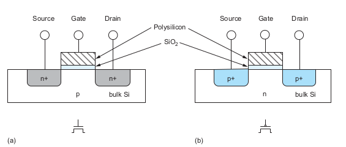

**nMOS:** N型金属-氧化物-半导体，而拥有这种结构的晶体管我们称之为NMOS晶体管。
**pMOS:** n型衬底、p沟道，靠空穴的流动运送电流的MOS管。

**MOS晶体管的构成：** 
>&emsp;&emsp;一层导电栅、一层二氧化硅、以及一层硅基底。硅基底也叫衬底、体、体硅。nMOS晶体管构造在p型衬底上，它有两个与栅相邻的n型半导体区域，分别称为源Source和漏drain。这两部分其实完全一样，因而此刻我们可以把它们看成是可互换的。衬底通常接地。pMOS管则相反，由p型的源漏区以及n型的衬底构成。  

>**栅** 
>>&emsp;&emsp;是一个控制输入：它影响电流在源和漏之间的流动。考虑一个nMOS管。它的衬底一般都是接地，因而源和漏与衬底之间的p-n结都是反响偏置的。  
>>&emsp;&emsp;如果栅也接地，那么不会有任何电流流过这两个反偏结，称此时为 **晶体管关断** 。  
>>&emsp;&emsp;如果提高栅电压，它将建立起一个电场并开始把自由电子吸引到硅-二氧化硅的界面下。当栅电压足够高时，电子的数目将超过空穴，因而栅下方称为“沟道”的一层很薄的区域将反型成为n型的半导体。于是从源至漏形成了一条电子载流子的导电通路，电流就能在源和漏之间流动。此时称为**晶体管导通** 。

>&emsp;&emsp;pMOS管则与以上相反。pMOS管的衬底保持在正电压。  
>>&emsp;&emsp;当栅也是正电压时，源和漏都反向偏置，因而没有任何电流流动，因此**晶体管关断** 。  
>>&emsp;&emsp;当降低栅电压时，正电荷被吸引到硅-二氧化硅的界面下。当栅压足够低时就会使沟道反型并在源至漏之间形成一条正电荷载流子的导电通路，于是**晶体管导通** 。  

>&emsp;&emsp;正电压通常成为**VDD**，在数字电路中代表逻辑1。  
>&emsp;&emsp;电路中低电压称为**地** 或**VSS**，它代表逻辑0,它的电压值通常为0V。

## 1.2 CMOS逻辑
### 1.2.1 反相器（非门）
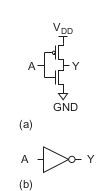  
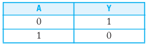
>&emsp;&emsp;这是CMOS反相器的电路图和符号图。由一个nMOS管和pMOS管构成。当输入A为1,输出Y为0,输入A为0,输出Y为1.

### 1.2.2 与非门NAND
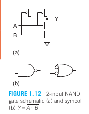
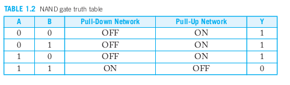  
>&emsp;&emsp;图 1.12(a)显示了一个两输入的CMOS与非门。它由Y和GND之间的两个串联的nMOS晶体管以及Y和VDD之间的两个并联的pMOS晶体管组成。如果输入A或B其中一个为0，至少有一个nMOS晶体管将处于关闭状态，切断了Y到GND的路径。但至少有一个pMOS晶体管将处于开启状态，形成了Y到VDD的路径。因此，输出Y将为1。如果两个输入都为1，两个nMOS晶体管都会处于开启状态，而两个pMOS 晶体管都会关闭。因此，输出将为0。真值表见表 1.2，符号如图 1.12(b) 所示。注意，根据德摩根定律，反相的小圆圈可以放在门的任一侧。在本书的图中，两条在 T 形连接处相交的线是连接的。两条交叉的线只有在有点时才表示连接。  

### 1.2.3 或非门NOR
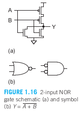
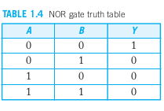
>&emsp;&emsp;图1.16为一个二输入或非门。当任何一个输入为高时，由于两个nMOS晶体管并联将使输出下拉至低电平。当两个输入均为低时，相串联的pMOS晶体管将使输出上拉至高电平，如表1.4所示，但绝对不会出现X态或处于浮空。

### 1.2.4 复合门
>&emsp;&emsp;由单级逻辑完成较复杂逻辑功能的复合门时通过串联和并联开关结构的组合来实现的。

### 1.2.5 传输管和传输门
>&emsp;&emsp;一个信号的强度是以它与理想电压源的接近程度来度量的。一般来说，信号越强，它所能提供或吸收的电流就越多。电源电压VDD和GND各为最强1和0信号源，它们又称为**轨线电压**。

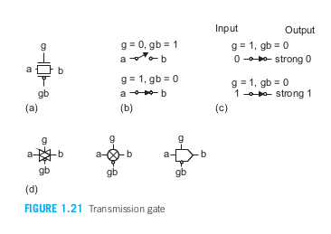
>&emsp;&emsp;当nMOS管和pMOS管单独用来作一个非理想开关时，被称为传输管。而当一个nMOS管和一个pMOS管并联一起时，得到一种开关，这叫传输门或者传送门。  

>n&emsp;&emsp;MOS管只需要传送0而pMOS管只需传送1,使输出总是被强驱动，因而输出电平永远不会变弱。这样的门称为 **“全复原”逻辑门** ，它能大大简化电路设计。

### 1.2.6 三态门
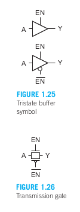
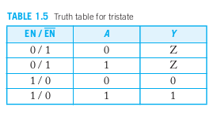
>&emsp;&emsp;图1.25为一个三态缓冲器的符号图。当使能输入EN为1时，输出Y等于输入A，此时作用就像一个普通的缓冲器。当使能输入为0时，Y变为浮空（即等于”Z“值）。如表1.5所示。

>&emsp;&emsp;图1.26所示传输门的真值表与三态缓冲器相同。它只需要两个晶体管，但它却是一个 **“非复原”电路**。如果输入中噪声很大或者是一个减弱的信号，那么输出将接收到同一噪声。

>&emsp;&emsp;图 1.27(a) 显示了一个三态反相器。输出被主动驱动到 VDD 或 GND，因此它是一个恢复型逻辑门。与之前讨论的任何门不同，三态反相器不遵守导通互补规则，因为在某些输入组合下它允许输出浮空。当 EN 为 0 时（图 1.27(b)），两个使能晶体管都处于关闭状态，使输出浮空。当 EN 为 1 时（图 1.27(c)），两个使能晶体管都处于开启状态，它们在概念上被从电路中移除，留下一个简单的反相器。图 1.27(d) 显示了三态反相器的符号。互补的使能信号可以在内部生成，也可以明确地引导到该单元。一个三态缓冲器可以通过一个普通的反相器后接一个三态反相器来构建。

>&emsp;&emsp;缺点：三态门有一个前提是必须保证每次只能有一个驱动单元有效。如果多个单元同时驱动一条总线，那么就会发生竞争并浪费功耗。但如果没有任何单元驱动这条总线，它就可能浮空而处在一个无效的逻辑电平上使接收器浪费功耗。同时，当几个使能信号翻转之间存在的延时就可能引起竞争。所以设计者现在都优先采用多路开关而不是三态总线。

### 1.2.7 多路开关
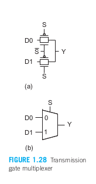
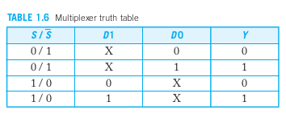

>&emsp;&emsp;多路开关是CMOS存储单元和数据处理结构中的关键部件。一个多路开关根据选择信号从它的几个输入中选择出其中一个作为输出。可以将两个传输门连在一起构成一个简单的二输入多路开关，如图1.28a所示。在任何时刻，选择信号和它的反信号只“使能”两个传输门中的一个。反相选择信号非S常常不画在符号中如图1.28b所示。

>&emsp;&emsp;传输门构成的是一个非复原的多路开关，但有几种方式可以用逻辑门构成复原的反相多路开关。
>>&emsp;&emsp;第一种：是将复合门连成图1.29a所示。
>>&emsp;&emsp;第二种：是将两个三态反相器连接起来，如图1.29b所示。

>&emsp;&emsp;较大的多路开关可以用多个二输入多路开关构成或直接把几个三态反相器组合在一起构成。采用后一种方式时，每个三态反相器需要有一个译码使能信号，这些使能信号应当同时翻转以防止竞争。图1.30显示了用这种两种方式构成的4输入（4：1）多路开关。在实际中，反相和非反相多路开关都简称为**多路开关或MUX**。
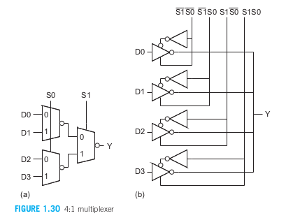
### 1.2.8 时序电路
时序电路具有记忆：它们的输出同时取决于当前和之前的输入。

#### 1.2.8.1 锁存器 Latch
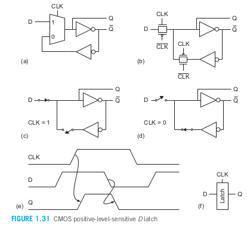
>&emsp;&emsp;图1.31a为由一个二输入多路开关和两个反相器构成的D锁存器。由于两个反相器可复原电平，因此多路开关可以用一对传输门构成，如图1.31b。这一锁存器也同时产生一个反相的输出非Q。当CLK=1时锁存器透明，因而D通过它到达Q（图1.31c）。当CLK下降至0时，锁存器将变为不透明。此时沿这对反相器建立起一条反馈路径（图1.31d），使当前的Q状态能无限期地保持下去。

>&emsp;&emsp;D锁存器也称为电平灵敏锁存器，这是因为它的输出状态取决于时钟信号的电平，如图1.31e。图中所示的这个锁存器时正电平灵敏锁存器，它用图1.31f的符号表示。当使它的多路开关的控制连线反向位时，这个锁存器就变为负电平灵敏锁存器。

#### 1.2.8.2 触发器 Filp-Flop
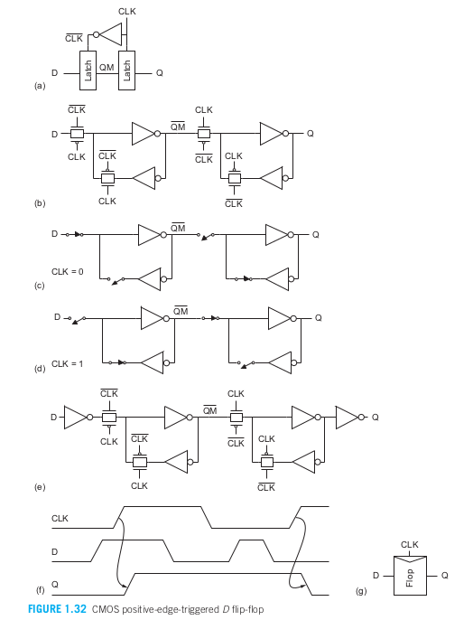  
>&emsp;&emsp;通过结合一个负电平敏感锁存器和一个正电平敏感锁存器，我们可以构建如图 1.32(a-b) 所示的边沿触发触发器。第一级锁存器称为主锁存器，第二级称为从锁存器。

>&emsp;&emsp;当时钟信号 (CLK) 为低电平时，主锁存器（负电平敏感）输出 (非QM) 跟随输入 D，而从锁存器（正电平敏感）保持先前的值（图 1.32(c)）。当时钟从 0 变为 1 时，主锁存器变得不透明，锁存 D 输入在时钟变化时的值。从锁存器变得透明，将主锁存器存储的值 (非QM) 传递到从锁存器的输出端 (Q)。此时，由于主锁存器与 D 输入断开，D 输入不会影响输出（图 1.32(d)）。当时钟从 1 变为 0 时，从锁存器保持其输出值，而主锁存器重新开始采样输入。

>&emsp;&emsp;这一触发器在时钟的上升沿将D复制到Q，如图1.32f。因此这一器件称为正沿触发的触发器，也称为**D触发器、D寄存器、主从触发器**。图1.32g为这一触发器的电路符号图。当使它的两个锁存器的极性都相反时就可以构成一个负沿触发的触发器。共享公共时钟输入的多个D触发器的集合称为**寄存器**。寄存器常常画成具有多位D和Q总线的触发器。
## 1.3 CMOS的制造和版图
>晶体管制造在很薄的硅圆片上，硅圆片既用来作为机械支撑又用来作为电气上的公共节点，即所谓的衬底。我们可以从两个角度去考察晶体管的物理版图。一个时顶视图，它是通过向下看圆片得到的。另一个是横截面图，它是沿晶体管的中部切开圆片然后从侧面看它而得到的。我们先看一个完整CMMOS反相器的横截面图，然后看它的顶视图并定义一个组用来制造该反相器不同部分的掩模。

### 1.3.1 反向器的横截面图
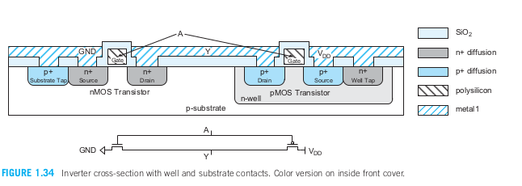

>&emsp;&emsp;图 1.34 显示了一个反相器的剖面图及相应的电路图。（彩色剖面图见封面内页。）在该图中，反相器构建在 p 型衬底上。由于 pMOS 晶体管需要一个 n 型体区，因此在其附近扩散了一个 n 沟道。正如第 1.3 节所描述的，nMOS 晶体管具有重掺杂的 n 型源极和漏极区，以及覆盖在一层薄硅氧化物 (SiO2，也称为栅氧化物) 上的多晶硅栅极。n+ 和 p+ 扩散区域表示重掺杂的 n 型和 p 型硅。pMOS 晶体管具有类似的结构，其源极和漏极为 p 型区域。两个晶体管的多晶硅栅极在图外某处连接在一起，形成输入 A。nMOS 晶体管的源极连接到金属地线，pMOS 晶体管的源极连接到金属 VDD 线。两个晶体管的漏极通过金属连接，形成输出 Y。称为场氧化物的厚 SiO2 层防止金属与其他层短路，除非在特定位置刻蚀出接触点。  

>&emsp;&emsp;金属与轻掺杂半导体之间的结形成了一个肖特基二极管，它只能在一个方向上导电。当半导体掺杂更重时，它与金属形成了良好的欧姆接触，提供低电阻的双向电流流动。为了避免 p 型衬底与 n+ nMOS 源极或漏极之间的 p-n 结被正向偏置，衬底必须连接到低电位。同样，n 沟道必须连接到高电位。为此，添加了重掺杂的衬底和沟道接触点（或触点），分别将 GND 和 VDD 连接到衬底和 n 沟道。

### 1.3.2 制造工艺
看原书1.5.2

### 1.3.3 版图设计规则
看原书1.5.3

### 1.3.4 门级版图
看原书1.5.4

### 1.3.5 棒图
看原书1.5.5
## 1.4 设计划分
看原书1.6