- [第2章 MOS晶体管原理](#第2章-mos晶体管原理)
  - [2.1 引言](#21-引言)
  - [2.2 长沟道晶体管的I-V特性](#22-长沟道晶体管的i-v特性)
  - [2.3 C-V特性](#23-c-v特性)
    - [2.3.1 简化的MOS电容模型](#231-简化的mos电容模型)
    - [2.3.2 精确的MOS栅电容模型](#232-精确的mos栅电容模型)
    - [2.3.3 精确的MOS扩散电容模型](#233-精确的mos扩散电容模型)
  - [2.4 非理想的I-V效应](#24-非理想的i-v效应)
    - [2.4.1 迁移率退化和速度饱和](#241-迁移率退化和速度饱和)
    - [2.4.2 沟道长度调制](#242-沟道长度调制)
    - [2.4.3 阈值电压效应](#243-阈值电压效应)
      - [2.4.3.1 体效应](#2431-体效应)
      - [2.4.3.2 漏致势垒降低](#2432-漏致势垒降低)
      - [2.4.3.3 短沟效应](#2433-短沟效应)
    - [2.4.4 泄漏](#244-泄漏)
      - [2.4.4.1 亚阈值泄漏](#2441-亚阈值泄漏)
      - [2.4.4.2 栅泄漏](#2442-栅泄漏)
      - [2.4.4.3 结泄漏](#2443-结泄漏)
    - [2.4.5 温度相关性](#245-温度相关性)
    - [2.4.6 几何形状相关性](#246-几何形状相关性)
    - [2.4.7 小结](#247-小结)
  - [2.5 直流传输特性](#25-直流传输特性)
    - [2.5.1 静态CMOS反相器的直流特性](#251-静态cmos反相器的直流特性)
    - [2.5.2 β比例效应](#252-β比例效应)
    - [2.5.3 噪声容限](#253-噪声容限)
    - [2.5.4 传输管的直流特性](#254-传输管的直流特性)
  - [小结](#小结)

# 第2章 MOS晶体管原理
## 2.1 引言
&emsp;&emsp;一块芯片的性能和功耗取决于晶体管和导线的电流和电容。
**MOS晶体管的定义** ：是一个多数载流子器件，它在源漏之间导电沟道中的电流受施加在栅上的电压控制。在nMOS管中，多数载流子为电子，在pMOS管中，多数载流子为空穴。  

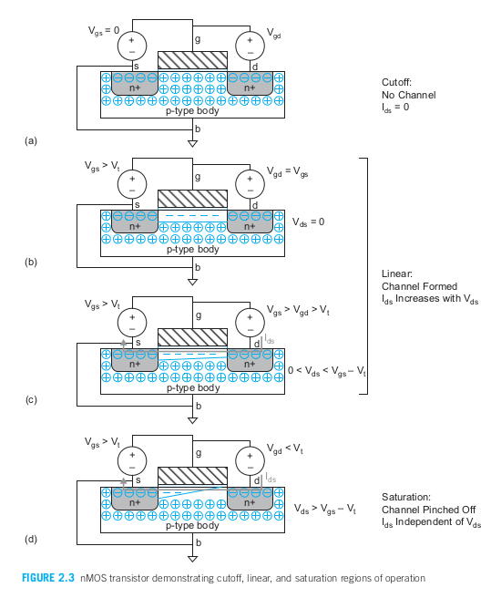  

>**沟道**：一条处于反型区将源漏连接起来的使形成导电通路的通道叫沟道。
>**沟道形成的条件**：栅电压大于阈值电压（图2.3b）。
>**性质：** 载流子的数目和导电性随栅电压的增加而增加。在漏源之间的电势差为Vds=Vgs-Vgd。如果Vds=0（即Vgs=Vgd），那么就不存在任何电场可以帮助驱使电流从漏极流向源极。  

>**nMOS三种工作状态：** 
>>**1.截止区：** 晶体管中几乎没有或完全没有电流流过。图2.3a  
>>**2.线性（也叫电阻性、非饱和或不饱和）状态** ：当一个小的正电压Vds加在漏极上时（图2.3c），电流Ids将通过沟道从漏极流向源极，此时电流同时随漏极电压和栅极电压的增加而增加。  
>>**3.饱和状态：** 当Vds变得足够大，使Vgd < Vt，那么在漏极附近的沟道就不能再反型而是被夹断。图2.3d。但由于电子在漏极正电压的影响下的漂移作用使晶体管仍然导通。当电子到达沟道末端时，它们射入到漏极附近的耗尽区中并加速流向漏极。当漏极电压进一步提高时，电流Ids将只受栅电压的控制而不受漏极电压的影响。
>>总之，nMOS有三种工作状态。如果Vgs < Vt， 晶体管截止（关断）。如果Vgs > Vt， 晶体管导通。当Vds较小时，晶体管的作用像是一个线性电阻，它的电流正比于Vds。当Vgs > Vt且Vds较大时，晶体管的作用像是一个电流源，它的电流将与Vds无关。

## 2.2 长沟道晶体管的I-V特性
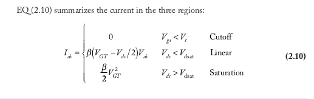  
以上是三种工作状态的电流。  

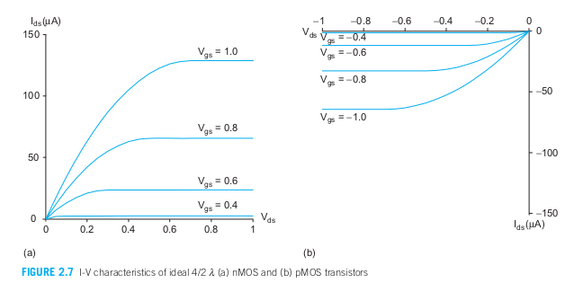  
图2.7 理想MOS管的I-V特性：a nMOS管；b pMOS管  

>&emsp;&emsp;图2.7a为这个晶体管的I-V特性。根据这一价模型，电流在栅电压低于Vt时为零。栅电压较高时，对于较小的Vds，电流随Vds而线性增大。当Vds接近饱和点Vdast = VGT时，电流增大逐渐变缓，最后当晶体管饱和时电流将与Vds的增大无关。(该模型高估了在高电压时的电流，因为它没有考虑高电场引起的迁移率退化和速度饱和。)  

>&emsp;&emsp;pMOS管的行为特性与此类似，但需将所有电压和电流符号反过来。

## 2.3 C-V特性
&emsp;&emsp;MOS 晶体管的每个端子与其他端口之间都有电容。通常，这些电容是非线性的，并且依赖于电压 (即 C-V 特性)；然而，当其行为在逻辑门的开关电压范围内进行平均时，它们可以被近似为简单电容器。（原书：本节首先介绍每种电容的简单模型，这些模型适用于估算晶体管的延迟和功耗。随后，探讨了用于电路仿真的更详细模型。第一次阅读时可以跳过这些更复杂的模型。）  

### 2.3.1 简化的MOS电容模型
看原书2.3.1  

### 2.3.2 精确的MOS栅电容模型
看原书2.3.2  

### 2.3.3 精确的MOS扩散电容模型
看原书2.3.3  

## 2.4 非理想的I-V效应
>&emsp;&emsp;式(2.10) 中的长沟道 I-V 模型忽略了许多对沟道长度低于 1 微米的器件重要的效应。本节总结了对设计人员影响最大的效应，并深入讨论了每个效应的建模。  

>&emsp;&emsp;图 2.14 比较了 65 nm 工艺中宽度为 1 微米的 nMOS 晶体管的模拟 I-V 特性与第 2.2 节中计算的理想特性。饱和电流随 Vgs 增加的增长速度低于二次方。这主要是由两个效应引起的：速度饱和和迁移率退化。在高横向电场强度 (Vds/L) 下，载流子的速度不再随电场强度线性增加，这称为速度饱和，导致在高 Vds 时 Ids 低于预期。在高垂直电场强度 (Vgs/tox) 下，载流子更多地与氧化物界面发生散射，减缓了它们的进程。这种迁移率退化效应也导致在高 Vgs 时电流低于预期。非理想晶体管的饱和电流随 Vds 的增加有所增加，这是由沟道长度调制引起的，即更高的 Vds 增加了漏极周围耗尽区的大小，从而有效地缩短了沟道。  

>&emsp;&emsp;阈值电压表示反转沟道所需的栅极电压，主要由氧化物厚度和沟道掺杂水平决定。然而，晶体管中的其他电场也会对沟道产生一定影响，进而改变有效阈值电压。源极和体之间的电势增加会通过体效应提高阈值电压。漏极电压增加会通过漏致势垒降低效应降低阈值电压。增加沟道长度会通过短沟道效应提高阈值电压。  

>在名义上关闭的晶体管中存在几种漏电源。当 Vgs < Vt 时，电流呈指数下降，而不是突然变为零，这称为亚阈值导电。理想情况下，栅极电流 Ig 为 0。然而，随着栅极氧化物厚度减少到仅几个原子层，电子会通过栅极隧穿，导致栅极漏电流。源极和漏极扩散区域通常是反向偏置的二极管，也会出现向衬底或阱的结泄漏电流。  

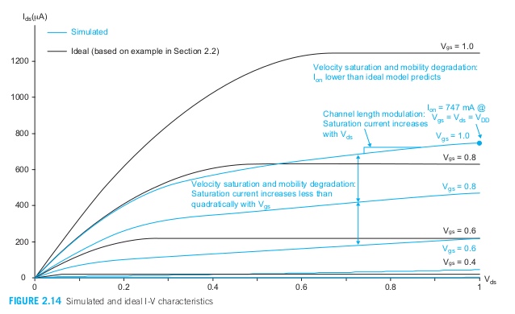  
图2.14 模拟和理想的I-V特性

> &emsp;&emsp;随着温度升高，迁移率和阈值电压都会降低。对强导通的晶体管而言，迁移率效应占主导地位，导致在高温下 Ids 降低。对关闭的晶体管而言，阈值效应则更为重要，导致高温下漏电流增加。总的来说，MOS 特性会随着温度的升高而退化。

>&emsp;&emsp;理解这些非理想效应的定性影响有助于预测它们对电路行为的影响，并预见器件在未来工艺代中的变化。然而，这些效应导致复杂的 I-V 特性，难以直接用于手工计算。因此，这些效应通常被集成到完善的晶体管模型中，并通过 SPICE 或类似软件进行仿真。

>总体：
>>**1.速度饱和:** 在高横向电场下，载流子的速度不再线性增加，导致饱和电流增长低于预期。
>>**2.迁移率退化：** 高垂直电场下，载流子与氧化物界面的散射增多，导致高 Vgs 时电流降低。
>>**3.沟道长度调制：** 更高的 Vds 通过缩短有效沟道长度导致饱和电流随 Vds 增加。
>>**4.阈值电压的影响：** 包括体效应、漏致势垒降低效应和短沟道效应等。
>>**5.漏电流：** 亚阈值导电、栅极隧穿电流和结漏电是主要的漏电源。
>>**6.温度效应：** 迁移率和阈值电压随温度升高而降低，分别导致导通时电流减小和关闭时漏电流增大。

### 2.4.1 迁移率退化和速度饱和
看原书2.4.1  

### 2.4.2 沟道长度调制
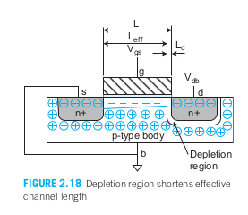  
>&emsp;&emsp;理想上饱和区晶体管的Ids与Vds无关，这使晶体管成为一个理想的电流源。在漏和体之间的p-n结形成了一个耗尽区，它的宽度Ld随Vdb而增大。图2.18.  这一耗尽区实际上将沟道长度缩短为：Leff = L - Ld。  
>&emsp;&emsp;随着沟道长度变短，沟道长度调制的影响变得更加突出。因此，VA与沟道长度成正比。这一沟道调制模型是对晶体管非线性行为在总体上的高度简化，因此它比较适用于概念上的理解而不是对器件精心精确的建模。

### 2.4.3 阈值电压效应
&emsp;&emsp;到现在为止，阈值电压现在还当作一个常数。但实际上Vt随源极电压增加而增加，随体电压增加而减小，随漏极电压增加而减小，以及沟道长度增加而增加。  

#### 2.4.3.1 体效应
&emsp;&emsp;晶体管不止具有三个端口（栅、源、漏），体实际上是隐含的第四个端口。当在源和体之间加上电压Vsb时它将使沟道反型所需要的电荷量增加，因而使阈值电压提高。

#### 2.4.3.2 漏致势垒降低
&emsp;&emsp;由漏极电压Vds引起的电场将影响阈值电压。这一漏致势垒降低效应在短沟晶体管中更为明显。可以建模为：
  
&emsp;&emsp;在这里，M 是漏致势垒降低效应（DIBL，Drain-Induced Barrier Lowering）的系数，通常在 0.1 的量级（通常表示为 100 mV/V）。  
&emsp;&emsp;漏致势垒降低将引起饱和区的Ids随Vds而增加，这与沟长调制对Ids的影响非常类似。

#### 2.4.3.3 短沟效应
&emsp;&emsp;阈值电压一般随沟道长度而增大。对于短沟道L，由于源和漏耗尽区延伸到沟道中的部分更为显著，所以这一现象特别突出，为此称为 **短沟效应或滚降**。但某些工艺中，一个所谓的反短沟效应将使Vt随沟长增加而减小。还存在所谓的窄沟效应，即Vt随沟道宽度变化，这一效应似乎影响较小，因为最小沟宽一般都大于最小沟长。  

### 2.4.4 泄漏
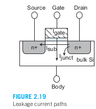

&emsp;&emsp;晶体管没有真正意义上的关断，不工作的时候也会泄漏出少量电流。这包括源漏之间的亚阈值导电，从栅至体的栅泄漏，以及从源至体和从漏至体的p-n结泄漏，图2.19.

**亚阈值导电：** 因载流子热致发射越过了阈值决定的势垒而引起的。  
**栅泄漏：** 因隧穿通过极薄栅介质而引起的一种量子力学效应。  
**结泄漏：** 因电流通过在源/漏扩散与体之间的p-n结引起。

#### 2.4.4.1 亚阈值泄漏
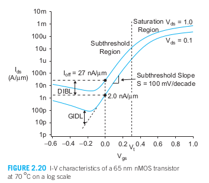  

&emsp;&emsp;长沟道晶体管I-V模型的缺陷：假设了只有当Vgs > Vt时才会在源至漏之间有电流流动。
&emsp;&emsp;实际上：电流并不会在阈值以下立刻截止，而是同图2.20.的规律按指数规律下降。

 >图中规律：  
 >>当栅电压较高时，晶体管充分导电。
 >>当栅电压下降到Vt以下时，电流的指数式减小在对数坐标中表现为一条直线。此时Vgs < Vt的情况被称为弱反型。  
 >>由于漏致势垒降低，亚阈值电流将随Vds而显著增加。漏极的结泄漏决定了Ids的下限值，这一结泄漏在负栅亚的情况下将更严重。

 #### 2.4.4.2 栅泄漏
 **隧穿效应：**（概述）是一种载流子穿过薄势垒的现象，该现象引起栅泄漏电流。（详细）根据量子力学，围绕原子的电子云具有概率性的空间分布。当栅极氧化物薄于 15–20 Å 时，栅极中的电子有非零的概率会穿过氧化层，到达另一侧并通过通道被带走。  
 **Fowler-Nordheim (FN) 隧穿：**  FN 隧穿在高电压和中等栅氧厚度时最为显著，常用于编程 EEPROM 存储器编程。  
 **直接隧穿：** 在低电压薄栅氧下更为明显，是栅泄漏的主要组成成分。
 **直接栅隧穿电流可以用以下方程式估算：**  

 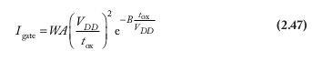  
 &emsp;&emsp;A,B为工艺常数。

#### 2.4.4.3 结泄漏
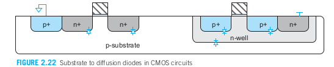  
&emsp;&emsp;图2.22所示。扩散与衬底或阱之间形成了二极管，而阱至衬底之间的结形成了另一个二极管，在正常操作时为了保证这些二极管不变成正向偏直，衬底和阱应连至GND或VDD。但反向偏置的二极管仍让会导通少量的电流ID。

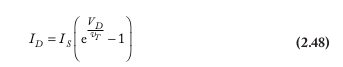  

&emsp;&emsp;式中Is取决于掺杂浓度及扩散区的面积与周长，而VD是二极管电压（例如-Vsb或-Vdb）。当一个结的反向偏置明显大于热电压时，结泄漏即为-Is，它一般在漏电流在 0.1–0.01 fA/μm² 范围内，因而与其他泄漏电流相比时可以忽略不计。

&emsp;&emsp;重掺杂的漏极会受到 **带间隧穿（BTBT）和栅诱导漏极漏电（GIDL）** 的影响。

**带间隧穿（BTBT）：** 发生在源极或漏极与体之间的结，当该结反向偏置时产生。这种现象与反向偏置电压和掺杂水平有关。为了提高阈值电压（Vt）而使用的高光环掺杂虽然减轻了亚阈值漏电，但却导致了 BTBT 的增加。当硅晶格中的缺陷（称为陷阱）缩短了载流子隧穿的距离时，陷阱辅助隧穿（TAT）会加剧这种漏电。大多数漏电发生在靠近沟道的侧壁，因为那里的掺杂浓度最高。这种漏电可以通过以下模型进行描述：

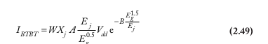  
&emsp;&emsp;式中Xj 是扩散区的结深，Eg 是带隙电压，A 和 B 是工艺常数。在反向偏置为 VDD 时，沿结的电场为:

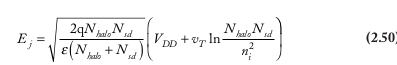  
**栅诱导漏极漏电（GIDL）** 发生在栅极部分重叠漏极的区域。此效应在漏极电压较高且栅极电压较低时最为明显。GIDL 电流与栅极-漏极的重叠面积成正比，因此与晶体管宽度有关。它对电场非常敏感，因此随着漏极-栅极电压的增加迅速增长。然而，通常在 |Vgd| ≈ VDD 时 GIDL 电流并不显著，只有当栅极电压超过电源轨电压范围以试图切断亚阈值漏电时，GIDL 才会显现出来。

### 2.4.5 温度相关性
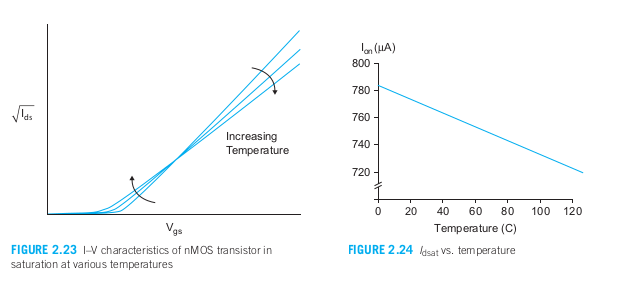  

&emsp;&emsp;晶体管的特性受温度的影响。例如，载流子迁移率随温度升高而降低。  
&emsp;&emsp;在高 VDD 下，Ion 随温度升高而减小。亚阈值漏电流随着温度呈指数增加。带间隧穿（BTBT）电流随温度缓慢增加，而栅极漏电几乎与温度无关。

&emsp;&emsp;图 2.23 显示了这些温度效应的综合影响。在高 Vgs 下，电流具有负温度系数，即电流随着温度升高而减小。在低 Vgs 下，电流具有正温度系数。因此，关断电流（OFF 电流）随着温度升高而增加。饱和导通电流 Idsat 通常随着温度升高而减小，如图 2.24 所示，因此电路性能在高温下最差。然而，对于在低 VDD（通常 < 0.7 – 1.1 V）下工作的系统，Idsat 随温度升高而增加。

&emsp;&emsp;反之，通过冷却可以改善电路性能。大多数系统使用自然对流或风扇与散热器结合，但如果费用合理，水冷、薄膜制冷器甚至液氮都可以提高性能。在低温下运行有许多优点。亚阈值漏电流与温度呈指数关系，因此可以使用更低的阈值电压。速度饱和发生在更高的电场下，从而提供更多的电流。由于迁移率也更高，这些电场可以在更低的电源电压下达到，从而节省功耗。耗尽区变宽，导致结电容减小。

&emsp;&emsp;两种常用的实验室工具用于确定电路的温度依赖性是冷冻喷雾罐和热风枪。前者可以用来瞬时“冻结”芯片，以观察性能是否发生变化，后者当然可以用来加热芯片。通常，这些测试用于快速确定芯片是否易受温度影响。必须小心——有时，突然的温度变化可能会导致芯片或其封装破裂。

### 2.4.6 几何形状相关性
&emsp;&emsp;该部分讨论了晶体管实际尺寸与设计尺寸之间的差异，强调了多种制造因素如何影响晶体管的有效长度和宽度。这些因素包括源极和漏极的横向扩散、制造过程中的蚀刻速率以及多晶硅的排列方向。有效的晶体管尺寸直接影响电流和阈值电压，因此在需要精确匹配的电路中（如感应放大器和模数转换器），最好使用相同的晶体管尺寸。此外，利用多个相同的晶体管并联可以有效调整电流比。对于较小工艺节点（如0.25微米以下），晶体管的方向和邻近多晶硅的配置在制造过程中显得尤为重要，以确保器件性能的一致性和可靠性。

### 2.4.7 小结
&emsp;&emsp;尽管纳米级器件的物理机制复杂，但从设计师的角度理解非理想I-V行为的影响相对简单。

&emsp;&emsp;**阈值下降** 传输晶体管在传输不正确的值时会出现阈值下降：nMOS晶体管只能拉升到VDD - Vtn，而pMOS晶体管只能拉低到|Vtp|。体效应会进一步加大这种阈值下降的幅度。因此，在纳米级工艺中，由于阈值电压占电源电压的比例较大，传输晶体管的表现并不理想。为了同时传输0和1，应该使用全互补的传输门。

&emsp;&emsp;**漏电流** 理想情况下，静态CMOS门在空闲时不会产生电流和功耗。然而，实际电路会有一些漏电流。当前最主要的漏电源是应当关闭的晶体管在源极和漏极之间的亚阈值漏电流。关闭状态的晶体管的亚阈值电流在Vgs低于Vt时，每下降60–100 mV，其漏电流降低一个数量级。由于阈值电压逐渐降低，亚阈值漏电流显著增加。一些工艺提供了多种Vt选择：低Vt器件用于关键电路中的高性能需求，而高Vt器件则用于其他需要低漏电的地方。

&emsp;&emsp;晶体管的栅极是很好的绝缘体，但在非常薄的栅极下会出现明显的隧穿电流，这限制了栅氧化物的缩小，并引发了新型高k栅介质的应用。漏电流会使CMOS门在空闲时消耗功率，也会限制动态逻辑、锁存器和存储单元保持数据的时间。在纳米级工艺中，动态逻辑和锁存器需要某种反馈机制，以防止因漏电流而导致的数据丢失。高温会加剧漏电流。

&emsp;&emsp;**VDD** 速度饱和和迁移率退化会导致高电压下的电流低于预期。这意味着提高VDD来加速晶体管的效果有限。因此，随着工艺的发展，VDD逐渐降低，以减少功耗。此外，极短的沟道和薄栅氧化物也会因为高VDD而受损。

&emsp;&emsp;**延迟** 串联的晶体管会在每个晶体管上分压，因此所受的电场较小，速度饱和效应也较弱。因此，串联的晶体管比简单模型预测的要快一些。例如，两个串联的nMOS晶体管传输的电流超过一个相同宽度的nMOS晶体管的一半。这一效应在nMOS晶体管上尤为显著，因为nMOS晶体管的迁移率本来就较高，更容易受到速度饱和的影响。

&emsp;&emsp;**匹配** 如果需要两个晶体管具有相同的性能，它们应具有相同的尺寸和方向，最好采用交错布局。

## 2.5 直流传输特性
&emsp;&emsp;数字电路只不过时模拟电路应用在它们工作范围的特殊部分上。一个电路的直流传输特性是指假设输入信号的变化足够慢，因而电容有充分时间充电和放电时，它的输出电压和输入电压的关系。输入和输出电压的具体范围定义为有效的逻辑电平0和1.

### 2.5.1 静态CMOS反相器的直流特性
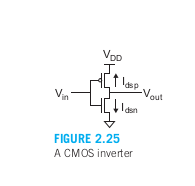
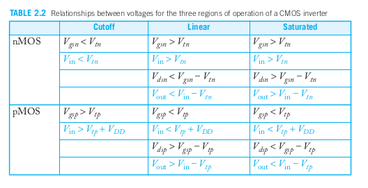  
从左到右依次是：截止，线性，饱和.该表是CMOS反相器三个工作区域上各个电压间的关系。

>&emsp;&emsp;Vtn是n沟道器件的阈值电压。
>&emsp;&emsp;Vtp是p沟道器件的阈值电压。（Vtp是负值）
>&emsp;&emsp;这些方程既以Vgs / Vds的形式表示，以及Vin / Vout的形式表示.
>&emsp;&emsp;由于nMOS晶体管的源极接地，Vgsn = Vin，Vdsn = Vout。
>&emsp;&emsp;由于pMOS晶体管的源极连接到VDD，Vgsp = Vin – VDD，Vdsp = Vout – VDD。

&emsp;&emsp;我们从图形表示开始，该表示描述了图2.26(a)中两个晶体管的简单代数方程EQ (2.10)。该图显示了在不同Vgsn和Vgsp值下，Idsn和Idsp与Vdsn和Vdsp的关系。图2.26(b)显示了相同的Idsn和|Idsp|图，但这次是以Vout为自变量、Vin为参数的形式。反相器的可能工作点用点标记，表示在给定Vin下，Idsn = |Idsp|时的Vout值。这些工作点在Vout与Vin的坐标轴上绘制，得到反相器的直流传输特性，如图2.26(c)所示。供电电流IDD = Idsn = |Idsp|也与Vin一起绘制在图2.26(d)中，表明当Vin经过GND和VDD之间的电压时，两个晶体管短暂地同时导通，导致电源上产生一个电流脉冲。

&emsp;&emsp;CMOS反相器的工作可分为图2.26(c)中显示的五个区域。每个区域中晶体管的状态在表2.3中给出。在区域A，nMOS晶体管关闭，pMOS晶体管将输出拉至VDD。在区域B，nMOS晶体管开始导通，拉低输出。在区域C，两个晶体管都处于饱和状态。请注意，理想晶体管只有在Vin = VDD /2时处于区域C，并且该例中传输曲线的斜率在该区域为–∞，对应于无限增益。由于沟道长度调制的缘故，实际晶体管的输出电阻是有限的，因此区域C的斜率在更宽的范围内是有限的。在区域D中，pMOS晶体管部分导通，而在区域E中，pMOS晶体管关闭，nMOS晶体管将输出拉低至GND。还需要注意的是，当输入电压在VDD或GND轨的阈值电压范围内时，忽略泄漏电流，反相器的电流消耗理想情况下为零。这一特性对于低功耗操作非常重要。

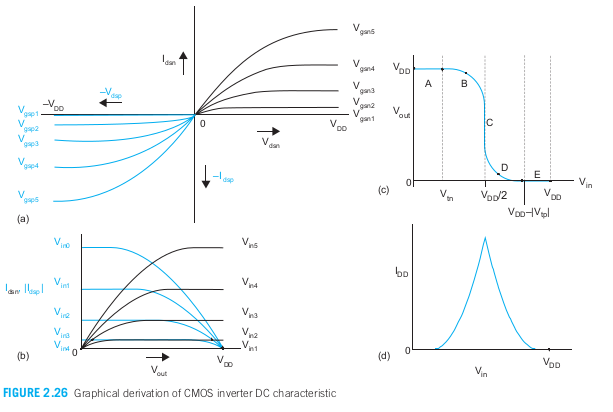
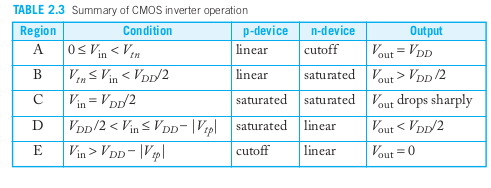
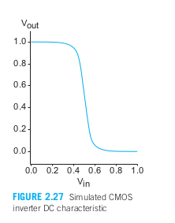

&emsp;&emsp;图2.27显示了来自65纳米工艺的反相器的仿真结果。为了实现大约相等的增益，pMOS晶体管的宽度是nMOS晶体管的两倍。尽管在饱和区，晶体管不是理想的电流源，导致过渡并不十分陡峭，但仿真结果与简单模型的吻合相当不错。输入阈值被称为交叉点，在该点上，Vinv = Vin = Vout。由于nMOS和pMOS晶体管的迁移率和阈值电压的幅度随温度的变化而降低，门的输入阈值对温度的敏感性相对较弱。

### 2.5.2 β比例效应
&emsp;&emsp;是在CMOS电路中，nMOS和pMOS晶体管的相对宽度和电流增益之间的关系。具体来说，这一效应关注的是如何通过调整nMOS和pMOS晶体管的宽度比例（即它们的物理宽度W）来实现电流增益的匹配，从而优化电路性能。

### 2.5.3 噪声容限
&emsp;&emsp;噪声容限与直流电压特性密切相关。这一参数使我们能确定一个逻辑门的输入端上允许有多大的噪声电压才能保证输出仍不出错。

### 2.5.4 传输管的直流特性
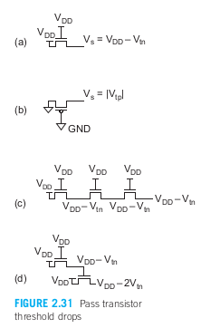
&emsp;&emsp;nMOS管传输0很好但传输1很差的原因：图2.31(a)展示了一个nMOS晶体管，其栅极和漏极都连接到VDD。假设源极最初在Vs = 0的情况下，Vgs > Vtn，所以晶体管导通并有电流流动。如果源极电压升高至Vs = VDD – Vtn，Vgs降低至Vtn，晶体管随之关断。因此，nMOS晶体管在试图传递“1”时，源极电压从未高于VDD – Vtn。这种损失通常被称为阈值电压下降。

&emsp;&emsp;此外，当nMOS晶体管的源极电压上升时，Vsb变为非零值。正如2.4.3.1节中所述，非零的源极与体极电势差会引发体效应，导致阈值电压升高。根据该节中的数据示例，当VDD = 1 V时，一个传输晶体管输出的电压仅为0.65 V，可能会影响下一级电路的噪声容限。

&emsp;&emsp;同样，pMOS晶体管能够很好地传递“1”，但传递“0”的效果较差。如果pMOS晶体管的源极电压低于|Vtp|，晶体管将关断。因此，pMOS晶体管只能将电压拉低至比GND高一个阈值电压，如图2.31(b)所示。

&emsp;&emsp;当多个晶体管串联时，由于每个源极电压都可上升到接近栅极电压的阈值电压，串联的输出电压退化并不会比单个晶体管更严重（图2.31(c)）。然而，如果退化的输出驱动另一个晶体管的栅极，第二个晶体管的输出会进一步退化（图2.31(d)）。

&emsp;&emsp;当我们尝试将晶体管作为开关使用时，阈值电压下降会使输出电压退化。在早期的工艺中，电源电压较高，Vt仅占VDD的很小一部分，因此这种下降是可以接受的。而在现代工艺中，Vt接近VDD的1/3，这种下降可能会导致输出无效或边缘逻辑电平。为了解决这个问题，通常使用传输门来构建CMOS开关。

&emsp;&emsp;传输门由并联的nMOS和pMOS晶体管组成，其栅极由互补信号控制。当传输门导通时，至少有一个晶体管在任何输出电压下导通，因此传输门可以很好地传递“0”和“1”。传输门是MOS逻辑中基础且广泛使用的组件。它可以用作多路复用器、逻辑结构、锁存器元件以及模拟开关。传输门的作用是作为一个由电压控制的开关，连接输入和输出。

## 小结
&emsp;&emsp;MOS晶体管是四端器件，具有栅极、源极、漏极和体极。在正常操作中，体极通常连接到GND或VDD，这样晶体管就可以被看作三端器件。晶体管表现为一个电压控制开关。当栅极电压低于某个阈值电压Vt时，nMOS开关关闭（源极到漏极没有通路）。当栅极电压超过Vt时，开关打开，形成连接源极和漏极的通道。本章还介绍了更复杂的模型，以预测晶体管在开启状态下的电流。

>&emsp;&emsp;根据端电压的不同，晶体管有三种工作模式：
>&emsp;&emsp;当Vgs < Vt时，处于截止区，Ids ≈ 0。
>&emsp;&emsp;当Vgs > Vt，且Vds < Vdsat时，处于线性区，Ids随着Vds增加（类似电阻）。
>&emsp;&emsp;当Vgs > Vt，且Vds > Vdsat时，处于饱和区，Ids趋于恒定（类似电流源）。
>&emsp;&emsp;对于长沟道晶体管，饱和电流取决于VGT。pMOS晶体管与nMOS类似，但极性相反，由于较低的迁移率，其输出电流大约为nMOS的一半。

&emsp;&emsp;在实际晶体管中，I-V特性更为复杂。现代晶体管尺寸极小，即使在低电压下也会经历极高的电场。高电场导致的速度饱和和迁移率退化会使电流比预期的更低。这可以用一个依赖于VGT的饱和电流来建模，其中速度饱和指数F小于2。此外，由于沟道长度调制，饱和电流会随着Vds略有增加。虽然简单的手算已经不再精确，但特性的总体形状变化不大，依然可以通过图形法或仿真推导传输特性。

&emsp;&emsp;即使在栅极电压较低时，晶体管也不会完全关闭。对于Vgs < Vt，亚阈值电流以指数方式下降，但对于低阈值的晶体管来说，该电流并非可以忽略。此外，反偏p-n结会产生结泄漏电流，当氧化层足够薄时，隧穿电流也会穿过绝缘栅极。

&emsp;&emsp;我们可以通过解析表达式、图形负载线分析或仿真来推导逻辑门的直流传输特性和噪声裕度。静态CMOS门具有优异的噪声裕度。

&emsp;&emsp;与理想开关不同，MOS晶体管对某些电压等级的传递效果较好。nMOS晶体管能够很好地传递“0”，但传递“1”时只能上拉到VDD – Vtn。pMOS晶体管则能够很好地传递“1”，但传递“0”时只能下拉到|Vtp|。这种阈值下降由于体效应而加剧，当源极电压与体极电压不同步时，体效应会增加阈值电压。

>&emsp;&emsp;在现代BSIM模型中，参数过多，设计者难以直观处理。通常，CMOS晶体管的主要参数包括：
>&emsp;&emsp;VDD：目标电源电压
>&emsp;&emsp;Lgate / Lpoly：有效沟道长度（小于特征尺寸）
>&emsp;&emsp;tox：有效氧化层厚度（也称为EOT）
>&emsp;&emsp;Idsat：在Vgs = Vds = VDD时的饱和电流
>&emsp;&emsp;Ioff：在Vgs = 0，Vds = VDD时的关断电流
>&emsp;&emsp;Ig：在Vgs = VDD时的栅极漏电流
