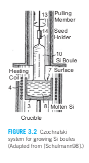
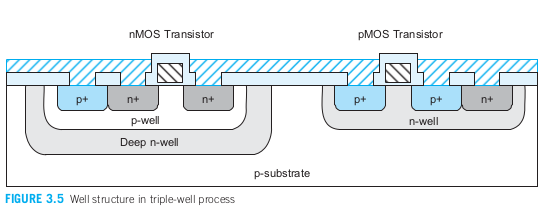
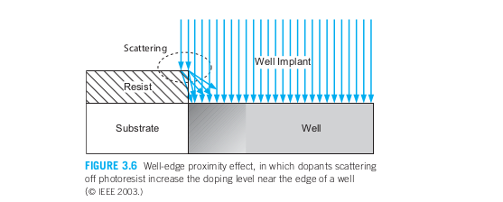
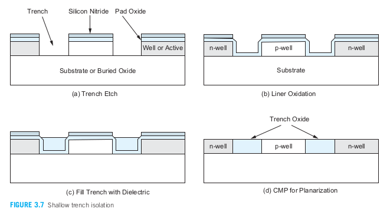
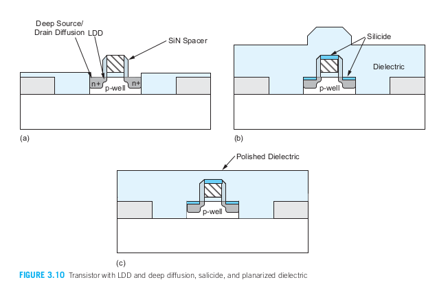
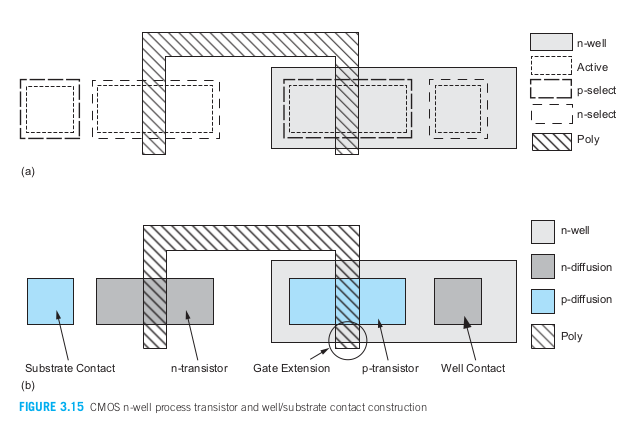

- [3.1 CMOS工艺](#31-cmos工艺)
  - [3.1.1 制备圆片](#311-制备圆片)
  - [3.1.2 光刻](#312-光刻)
  - [3.1.3 形成阱和沟道](#313-形成阱和沟道)
  - [3.1.4 二氧化硅](#314-二氧化硅)
  - [3.1.5 隔离](#315-隔离)
  - [3.1.6 栅氧](#316-栅氧)
  - [3.1.7 形成栅和源/漏](#317-形成栅和源漏)
  - [3.1.8 接触与金属化](#318-接触与金属化)
  - [3.1.9 钝化](#319-钝化)
- [3.2 版图设计规则](#32-版图设计规则)
  - [3.2.1 设计规则基础知识](#321-设计规则基础知识)
    - [3.2.1.1 阱规则](#3211-阱规则)
    - [3.2.1.2 晶体管规则](#3212-晶体管规则)
    - [3.2.1.3 接触的规则](#3213-接触的规则)
    - [3.2.1.4 金属规则](#3214-金属规则)
    - [3.2.1.5 通孔规则](#3215-通孔规则)
    - [3.2.1.6 其他规则](#3216-其他规则)
  - [3.2.2 划片槽及其他结构](#322-划片槽及其他结构)

# 3.1 CMOS工艺
&emsp;&emsp;CMOS工艺步骤主要可以分为两大部分。生产线前端阶段形成晶体管，而在生产线后端阶段形成导线。

## 3.1.1 制备圆片
**CMOS生产厂所采用的最基本原材料：** 硅圆片或硅牒，直径为75～300mm，厚度小于1mm。  
**圆片来源：** 从硅锭即圆柱状单晶硅锭上切割而来。  
**单晶硅锭来源：** 从坩埚中熔化了的纯硅上拉出来的。  
**使单晶具有电学特性：** 将一定数量的杂质加入到熔融硅中，然后使籽晶浸入熔融硅中使晶体开始生长。生长得到的单晶硅锭具有与籽晶相同的晶向。  
**注意：** 在石英坩埚的周围是一个由射频感应线圈加热的石墨加热器，它加热坩埚使温度保持在比硅熔点（1425摄氏度）还高几度。一般在熔融硅的周围充以氦气或氩气防止硅被氧化。  
**后续操作：** 籽晶一边旋转一边从熔融硅中沿垂直方向慢慢拉出，如图3.2所示。此时熔融硅使自己附着在籽晶上并在被拉出时重新结晶。籽晶拉出和旋转的速率决定了单晶硅锭的直径。单晶硅锭的生长速度为30～180mm/h。  

## 3.1.2 光刻

**掺杂区、多晶硅、金属和接触的定义由掩模完成：** 在被掩模遮蔽的地方，离子注入就不起作用或者电介质或金属层将保持原样。而没有被掩模遮蔽的地方，离子注入就能实现或者电介质或金属就能被刻蚀掉。图案的形成是由光刻这道工艺完成的。  
**光刻：** 在圆片上定义我们要处理区域（我们希望在那里保留或除去材料）的主要方法是采用光刻胶。圆片先涂以一层光刻胶并使它们通过光掩模进行有选择的光照。在最初的光刻胶掩模图案形成之后，其他屏蔽层如多晶硅、二氧化硅或氮化硅也可以用来作为芯片的实际掩模。  
**光掩模：** 由覆盖在石英玻璃上形成图案的铬构成。  

&emsp;&emsp;利用一个紫外光源通过光掩模使光刻胶曝光。图3.3显示了光刻工艺。光掩模上有铬的地方将阻挡光照。紫外光从光掩模的背面射入并通过掩模上能透光的部分照射到预先涂覆在圆片上有机光刻胶上使它曝光。图3.3显示了光刻工艺。光掩模上有铬的地方将阻挡光照。紫外光从光掩模的背面射入并通过掩模上能透光的部分照射到预先涂覆在圆片上的有机光刻胶上使它曝光。然后用显影溶解液溶解掉光刻胶上未被曝光的可溶解部分，而光刻胶上经过曝光的部分因变得不可溶解而被保留下来。这一种光刻胶称为 **负性光刻胶** 。而正性光刻胶最初是不可溶解的，当经过紫外线曝光后变得可溶解。    

**正性光刻胶和负性光刻胶区别：** 正性光刻胶比负性光刻胶能提供更高的分辨率，但光敏性较差。随着特征尺寸变得越来越小，光刻胶层也必须变得更薄。而这些又会使它们的稳定性变差而更容易失效，从而影响一个工艺的总成品率和生产芯片的成本。

## 3.1.3 形成阱和沟道
以下为主要的CMOS工艺：
>n阱工艺；
>p阱工艺；
>双阱工艺；
>三阱工艺。

**p阱工艺：** nMOS管制造在p阱中而pMOS管制造在n型衬底上，p阱工艺曾因此用来优化pMOS管的性能。  
**n阱工艺：** 但改进的n阱工艺已能在n阱中制造出性能良好的pMOS管及在p型衬底萨嘎报告制造出性能更好的nMOS管。在n阱工艺中，在同一个n阱中的各组pMOS管共享相同的体节点，但与不同阱中pMOS管的体相隔离。而芯片中所有的nMOS管都共享同一个体，即衬底。因此由数字电路注入到衬底的噪声会干扰灵敏的模拟电路或存储电路。  
**双阱工艺：** 与n阱工艺同时出现。它可以同时优化每一种类型的晶体管。  
**三阱工艺：** 在双阱的基础上再增加第三个阱。它的出现为在混合信号芯片中的模拟模块和数字模块之间提供了良好的隔离，它也用来使高密度的动态存储器与逻辑部分之间隔离。大多数生产线都提供可以升级的基本双阱工艺，只需要再增加一层掩模就可以升级为三阱工艺。  

阱和其他特殊结构需要经过掺杂的硅区。利用外延，淀积或注入可以实现施主和受主掺杂剂的不同浓度。    
**外延：** 外延是使硅圆片表面加热到高温并暴露在掺杂剂材料的气源中从而在硅表面（它已是单晶体）上生长出一层单晶薄膜。外延可以用来形成一层缺陷比原有圆片表面少的硅层并能有助于防止闩锁。代工厂可以提供两种选择，即外延圆片或无外延圆片。微处理器设计者通常希望采用外延圆片使器件性能比较一致。  
**淀积：** 将掺杂剂材料先堆积在硅表面上然后采用热扩散步骤迫使它推进到体硅内。淀积可用来构造较深的结。一个称为化学气相淀积的步骤可以用来进行淀积。即CVD过程就是被加热的掺杂剂气体在圆片表面处发生化学反应，并且所产生的生成物淀积在硅表面上。CVD也用来在以后的CMOS工艺中淀积一层薄膜材料。  
**离子注入：** 用高能量的施主或受主原子轰击硅衬底。当这些原子撞击到硅表面上时，它们就进入到硅表面以下，形成了具有不同掺杂浓度的区域。当温度升高（大于800摄氏度）时，具有不同杂质浓度的各个硅区之间会发生扩散。因此一旦掺杂区就位，就应使余下的各个工艺步骤保持在尽可能低的温度下进行。但在离子注入后常常会进行一个高温的退火步骤使掺杂剂重新分布的更均匀些。离子注入使目前应用的标准的阱和源/漏注入方法。离子就位过程是一个随机过程，因此掺杂浓度不可能控制的很理想，特别是对于掺杂剂原子数目很少的细小结构更是如此。  

&emsp;&emsp;在大多数CMOS工艺中，第一步是定义阱区域。在三重阱工艺中，首先通过高能量（兆电子伏MeV）离子注入将深n阱引入p型衬底中，而不是通过热扩散工艺。这种方法避免了热循环（即晶圆不需要显著升温），从而提高了生产效率和可靠性。2–3 MeV的注入能形成2.5–3.5微米深的n阱。由于这种阱的掺杂浓度峰值位于表面下方，因此称为“反向阱”。这可以通过改善防闩锁特性和减少垂直穿透的敏感性来增强器件性能。厚（3.5–5.5微米）光阻用于阻挡不应形成阱的区域中的高能量注入。厚光阻和深度注入不可避免地导致阱的特征尺寸相对于最小特征尺寸较粗。  

&emsp;&emsp;随后，较浅的n阱和p阱区域被注入。阱形成后，通过阈值注入可以调整掺杂水平，以设置nMOS和pMOS晶体管的目标阈值电压（Vt）。通过多个阈值注入掩模，可以在同一芯片上提供多个Vt选项。对于给定的栅极和衬底材料，阈值电压取决于衬底的掺杂浓度（NA）、氧化层厚度（tox）和表面态电荷（Qfc）。注入过程可以影响NA和Qfc，因此也会影响Vt。图3.5展示了一个典型的三重阱结构。如图所示，nMOS晶体管位于深n阱中的p阱内。其他nMOS晶体管可以构建在不同的p阱中，以避免共享相同的体节点。由于掺杂浓度的差异，三重阱工艺中的p阱晶体管与直接位于衬底中的晶体管具有不同的特性。pMOS晶体管则位于浅（常规）的n阱中。图中显示了一个逆变器的横截面。  

&emsp;&emsp;阱是通过单独的掩模来定义的。在双阱工艺中，只需要定义一个掩模，因为另一阱是其互补的。而三重阱工艺至少需要定义两个掩模，一个用于深阱，另一个用于n阱或p阱。  

&emsp;&emsp;靠近反向阱边缘的晶体管（例如距离边缘约1微米内）可能比远离边缘的晶体管具有不同的阈值电压，因为离子从光阻掩模散射到阱的边缘，图3.6.这种现象称为“阱边缘邻近效应”。  

## 3.1.4 二氧化硅
&emsp;&emsp;许多用于制造硅集成电路的结构和制造技术依赖于SiO₂的特性。因此，可靠地制造SiO₂极为重要。实际上，与其他竞争材料相比，硅主导了这个行业，因为它具有易于加工的氧化物（即可以生长和蚀刻）。根据具体工艺的需求，可能需要不同厚度的SiO₂。晶体管栅极要求薄氧化层，电压较高的器件可能要求较厚的氧化层，而为了保证不会在多晶硅导线下方的硅中无意地形成晶体管，也许要求甚至更后的氧化层。  
&emsp;&emsp;通过将硅晶圆加热至氧化环境中，可以实现硅的氧化。以下是一些常见的方法：  
>-**湿氧化：**  在含有水蒸气的氧化环境中进行。通常温度在900°C到1000°C之间。当使用氢气和氧气的2:1混合物时，这种方法也称为热解氧化（pyrogenic oxidation）。湿氧化是一种快速的工艺。  
>-**干氧化：** 在纯氧环境中进行氧化。温度通常在1200°C左右，以获得可接受的生长速率。相比湿氧化，干氧化形成的氧化层质量更高。干氧化用于形成薄且高度可控的栅极氧化层，而湿氧化则可能用于形成较厚的场氧化层。  
>-**原子层沉积：** 通过将薄的化学层（材料A）附着在表面，然后引入化学物质（材料B）来生成所需的薄层（如SiO2——这种方法也可用于其他各种电介质和金属）。此过程重复进行，所需的层被逐层构建。  

&emsp;&emsp;氧化过程通常会消耗部分硅片（而沉积和原子层沉积不会）。由于SiO₂的体积约为硅的两倍，因此SiO₂层会在垂直方向上几乎均匀地向上和向下生长。因此，在加工后，SiO₂会突出于原始未氧化的硅表面之上和之下。

## 3.1.5 隔离

&emsp;&emsp;CMOS工艺中的各个单个器件必须互相隔离，这样它们之间就不会出现不希望有的互相作用。尤其是沟道只应当在有源区上晶体管栅极以下被反型，在其他地方布置的导线不应当引起寄生的MOS沟道，而且不相关晶体管的源/漏扩散区不应当互相干扰。  
&emsp;&emsp;晶体管栅极由一层薄薄的栅氧化层组成。在其他地方，较厚的场氧化层将多晶硅和金属线与基板分离。由导线、厚氧化物和基板形成的MOS夹层实际上构成了一个不需要的寄生晶体管。然而，厚氧化物有效地设定了一个比VDD更高的阈值电压，防止晶体管在正常操作期间开启。实际上，这些场效应器件可以用于输入/输出保护，讨论详见第13.6.2节。晶体管的源极和漏极与基板或阱形成反向偏置的p-n结，从而将它们与邻近的器件隔离开来。  
&emsp;&emsp;厚氧化物以前通过称为局部氧化硅（LOCOS）的工艺形成。基于LOCOS工艺的一个问题是厚氧化物和薄氧化物之间的过渡区域，会在横向上延伸一段距离，形成所谓的“鸟嘴”效应。横向距离与氧化物的厚度成正比，限制了晶体管的集成密度。  
&emsp;&emsp;从0.35微米节点开始，引入了浅沟槽隔离（STI）技术，以避免LOCOS工艺的问题。STI在晶体管周围形成SiO2的绝缘沟槽（除活性区域外的所有区域）。沟槽的宽度与深度无关，因此晶体管可以根据光刻工艺的限制尽量靠近放置。沟槽将导线与基板隔离，防止了不必要的通道形成。它们还减少了源极和漏极的侧壁电容和结漏电流。  
&emsp;&emsp;STI工艺从垫氧化物和氮化硅层开始，它们充当掩模层，如图3.7所示。垫氧化物中的开口用于蚀刻到阱或基板区域（此过程也可用于源极/漏极的扩散）。然后生长一层氧化物衬里，以覆盖暴露的硅表面（图3.7(b)）。使用化学气相沉积（CVD）填充沟槽，以SiO2或其他填充物填充，不会消耗底层硅（图3.7(c)）。垫氧化物和氮化物被去除，随后通过化学机械抛光（CMP）步骤对结构进行平面化处理（图3.7(d)）。顾名思义，CMP结合了机械研磨作用，旋转的晶圆与静止的抛光头接触，同时施加研磨混合物。该混合物还与表面发生化学反应，辅助抛光过程。CMP用于实现平坦的表面，这在拥有多层的现代工艺中至关重要。  
&emsp;&emsp;从设计师的角度来看，深n阱和/或沟槽隔离的存在使得将噪声敏感的芯片部分（如模拟电路或存储器）与数字部分隔离变得更加容易。沟槽隔离还允许nMOS和pMOS晶体管放置得更近，因为隔离提供了更高的源/漏击穿电压——这是源或漏极二极管在反向偏置条件下开始导通的电压。击穿电压必须高于电源电压（以免结在正常运行时发生击穿），击穿电压由结的尺寸和形成结的掺杂水平决定。更深的沟槽可提高击穿电压。  

## 3.1.6 栅氧
&emsp;&emsp;该工艺的下一步是为晶体管形成栅氧化层。如前所述，栅氧化层最常见的形式是二氧化硅 (SiO2)。  
&emsp;&emsp;在通过浅沟槽隔离 (STI) 定义的源/漏区域中，栅氧化层生长在图3.7(d)阶段显示的平面化结构顶部，如图3.8所示。这种氧化物结构称为栅堆栈。之所以称为堆栈，是因为当前工艺很少使用纯SiO2栅氧化层，而是倾向于生成一个由几层SiO2原子层组成的堆栈（每层厚度为3–4Å），以提高可靠性，并在其上覆盖几层含氮的氧氮化物层。氮的存在提高了介电常数，从而降低了有效氧化物厚度 (EOT)，这意味着在相同厚度的氧化层下，它的表现如同更薄的氧化物。使用较厚的氧化层可以提高工艺的可靠性。  
&emsp;&emsp;在180纳米及之后的许多工艺中，通常提供至少两种不同厚度的氧化层（用于逻辑晶体管的薄氧化层和用于承受更高电压的I/O晶体管的厚氧化层）。在65纳米节点上，薄栅氧化层的有效厚度仅为10.5–15Å。  

## 3.1.7 形成栅和源/漏
&emsp;&emsp;当硅沉积在二氧化硅 (SiO2) 或其他无晶体取向的表面上时，会形成多晶硅，通常称为多晶硅或简单称为“多晶”。退火工艺用于控制单晶域的大小，并改善多晶硅的质量。未掺杂的多晶硅具有高电阻率，可以通过掺杂物质或与难熔金属结合来降低电阻。多晶硅栅极作为一个掩膜，可以精确地对准栅极两侧的源极和漏极，这个工艺称为“自对准多晶硅栅工艺”。铝不能用于这种工艺，因为在形成源极和漏极时会熔化。  
&emsp;&emsp;作为历史背景，早期的金属栅工艺首先扩散源极和漏极区域，然后形成金属栅。如果栅极未对准，可能无法覆盖整个通道，导致晶体管无法开启。为避免这种情况，金属栅必须超过工艺的对准容差，从而悬挂在源极和漏极上。这会产生较大的寄生栅-源和栅-漏重叠电容，降低开关速度。  
&emsp;&emsp;在自对准多晶硅栅工艺中，定义栅极、源极和漏极的步骤如下：  
>-长栅氧化层在需要晶体管的区域（包括源极、漏极和栅极区域）——其他地方将会有厚氧化层或沟槽隔离（图3.9(a)）。  
>-在芯片上沉积多晶硅（图3.9(b)）。  
>-对多晶硅进行图案化（包括栅极和互连）（图3.9(c)）。  
>-蚀刻暴露的栅氧化层——即未被多晶硅覆盖的需要晶体管的栅氧化层区域；此时，芯片上在需要源极/漏极扩散的区域将有通向阱或衬底的窗口（图3.9(d)）。  
>-对pMOS和nMOS的源极/漏极区域进行离子注入（图3.9(e)）。

&emsp;&emsp;源极/漏极的离子注入密度相对较低，通常在10¹⁸–10²⁰ cm⁻³的杂质原子范围内。这样的轻掺杂漏极（LDD）结构可以降低漏极结的电场（该结具有最高电压），从而提高器件对热电子损伤的免疫力（见第7.3.6节）并抑制短沟道效应。LDD注入是浅层且轻掺杂的，因此表现出低电容但高电阻。这在一定程度上降低了器件性能，因为晶体管串联的电阻较大。因此，除了LDD注入外，还需要较深且重掺杂的源极/漏极注入，以实现同时具有热电子抑制和低源极/漏极电阻的器件。在栅极边缘的硅氮化物（Si₃N₄）间隔层用作掩模，以定义更深的扩散区域，如图3.10(a)所示。  
&emsp;&emsp;如前所述，多晶硅栅极和源/漏极扩散区由于硅的电阻率及其极小的尺寸而具有高电阻。现代工艺通过在硅表面形成一层耐火金属来降低电阻。耐火金属是指具有高熔点且在随后的加工过程中不会受损的金属。常用的金属有钽、镍、钼、钛或钴。这些金属沉积在硅上（具体来说是栅极多晶硅和/或源极/漏极区域）。当两种物质在高温下反应时，会形成一层硅化物。在多晶硅化工艺中，只有栅极多晶硅被硅化；而在硅化工艺中（通常以自对准硅化方式实施——因此也称为自对准硅化工艺，即salicide），栅极多晶硅和源极/漏极区域都会被硅化。该工艺降低了多晶硅互连和源极/漏极扩散区的电阻。图3.10(b)展示了硅化后的栅极和源极/漏极区域结构。此外，在后续加工步骤之前，所有区域都已被SiO₂或其他介电材料覆盖。该图展示了具有一些垂直拓扑结构的结果，这是较老工艺中的典型现象。表面高度的快速过渡可能会导致后续层断裂，无法保持形态一致，或者可能引发一系列与金属边缘相关的设计规则。为了避免这些问题，使用化学机械抛光（CMP）步骤来平坦化介电层，留下一个平坦的表面用于金属化，如图3.10(c)所示。  
&emsp;&emsp;纳米工艺还涉及另一个称为光晕掺杂的注入步骤，它增加了通道末端附近基底或阱的掺杂浓度。光晕掺杂缓解了漏致势垒降低（DIBL）、短沟道效应和穿透效应，但会增加扩散区与通道之间结处的GIDL（栅引起漏电流）和BTBT（带间隧穿）漏电流。  

## 3.1.8 接触与金属化
**接触孔和金属化：** 接触孔在源极、漏极和栅极区域切割出来，使用材料如铝（较旧工艺）或铜（较新工艺）。钨用于填充接触孔，并且在一些工艺中用作局部互连层。  
**金属化方法：** 传统金属化使用铝，通过蒸发或溅射沉积。蒸发可以通过电流或电子束完成，而溅射通过等离子体作用完成。  
**去除金属方法：** 可以通过湿法（如Piranha溶液）或干法（如等离子蚀刻）去除不需要的金属。  
**局部互连：** 使用局部互连层可以提高电路密度，特别是在SRAM中。现代工艺使用铜互连和低k介电材料，减少导线的电阻和电容。  
**金属层设计：** 较新的工艺中，金属层的宽度和厚度根据层次增加，顶层金属主要用于电源分配和I/O接口。  
**CMP平坦化：** 化学机械抛光（CMP）用于平坦化介电材料，确保后续层的沉积不受表面不平整影响。  
**现代SRAM设计：** 现代SRAM设计使用局部互连连接nMOS和pMOS晶体管，而无需升到较高的金属层，从而优化布局密度。

## 3.1.9 钝化
&emsp;&emsp;最后一步工艺使增加一层称为钝化或覆盖玻璃的保护玻璃层以防止污染物入侵。钝化层上的开口也称为覆盖玻璃开孔，通过它可以连接至I/O焊盘以及所需的探针测试点。在完成钝化之后就可以进行后续步骤。如形成焊凸，利用这一焊盘开口中的镀金焊料凸块可以将芯片直接连接到电路板上。

# 3.2 版图设计规则
**布局规则的定义：** 以特征尺寸（宽度）、间距和重叠为基础，目的是在最小面积内构建可靠的电路。  
**性能与良率的平衡：** 设计规则在性能与制造成功率之间进行权衡。保守的规则确保电路功能正常，但激进的规则可以提高性能和减少尺寸。  
**规则容忍度：** 设计规则并不是绝对的正确与错误的界限，而是确保正确制造的容差。偶尔违反规则的设计可能仍能正常工作，但频繁违反会影响设计成功率。  
**可缩放规则：** MOSIS规则允许在工艺间进行缩放，但实际工艺通常不会均匀缩小，因此工业界更倾向使用微米级的设计规则。  
**定制布局的使用场景：** 通常只有在高产量芯片中，全定制布局的高设计成本才会被更小尺寸所节省的成本所抵消。

## 3.2.1 设计规则基础知识
### 3.2.1.1 阱规则
>&emsp;&emsp;n阱（尤其是深n阱）通常有比晶体管的源漏注入更深的注入，因此n阱的边界与相邻的n+扩散区之间必须有足够的外间距。而阱边界和它所包围的扩散区之间的内间距是由跨越阱边界的场氧过渡区决定的。
>&emsp;&emsp;由于n阱的薄层电阻可以达到每方块几千欧姆，因此必须提供足够多数目的阱接头使阱能够充分接地。这样就能够防止阱电流引起过多电压降。
>&emsp;&emsp;有关阱掩模的小结：我们在说明阱时可能遇到的掩模包括n阱、p阱以及深n阱。这些掩模用来说明各种不同的阱将放在什么地方。在双阱工艺中常常只说明一种阱（n阱）的位置，而p阱默认为位于不存在n阱的区域上（即p阱时n阱的“逻辑非”）。

### 3.2.1.2 晶体管规则

>&emsp;&emsp;CMOS 晶体管通常至少通过四个物理掩膜定义。这些掩膜是：有源掩膜（也称为扩散掩膜、diff、thinox、OD 或 RX）、n 选择掩膜（也称为 n 注入、nimp 或 nplus）、p 选择掩膜（也称为 p 注入、pimp 或 pplus）和多晶硅掩膜（也称为 poly、polyg、PO 或 PC）。有源掩膜定义了放置 n 型或 p 型扩散区域的位置或晶体管栅极的位置。晶体管的栅极由多晶硅掩膜和有源掩膜的逻辑与（AND）操作定义，即多晶硅与扩散区域相交的位置。选择层定义了所需的扩散类型。n 选择掩膜包围需要 n 型扩散的有源区域，p 选择掩膜包围需要 p 型扩散的区域。p 型扩散区域位于 n 沟槽中，定义了 pMOS 晶体管（或 p 扩散导线）。p 扩散区域位于 p 沟槽中，定义了衬底接触（或 p 沟槽接触）。为了简化流程，设计系统通常只定义 n 扩散（ndiff）和 p 扩散（pdiff）。适当的选择层会自动生成，即 ndiff 会自动转换为与 n 选择层重叠的有源区域。  
>&emsp;&emsp;多晶硅必须完全跨越有源区域，否则创建的晶体管会因为扩散路径短路在源极和漏极之间。因此，要求多晶硅延伸超出有源区域边缘，称为“栅极延伸”。有源区域也必须超出多晶硅栅极的边缘，以确保有源区域足够大，能够提供用于载流子进出通道的扩散源极和漏极区域。不需要形成晶体管的多晶硅和有源区域必须保持分离，这就产生了多晶硅与有源区域之间的间距规则。图3.15(a)展示了掩膜构建的过程，最终结构如图3.15(b)所示。  
>&emsp;&emsp;晶体管掩膜的小结：除了井掩膜外，用于定义晶体管、扩散互连（可能是电阻器）和栅极互连的基本掩膜包括有源掩膜、n 选择掩膜、p 选择掩膜和多晶硅掩膜。在某些工艺中，它们可能有不同的名称。有时会使用 n 扩散（ndiff）和 p 扩散（pdiff）掩膜来替代有源掩膜，以减少设计者的混淆。  

### 3.2.1.3 接触的规则
一般有以下几种接触：  
>-金属至p有源区（p扩散）
>-金属至n有源区（n扩散）
>-金属至多晶硅
>-金属至阱或衬底

>&emsp;&emsp;根据不同的工艺，还可能允许其他类型的接触，例如埋入的多晶硅-有源接触，用于局部互连。由于衬底被划分为不同的井区域，每个独立的井必须连接到相应的电源电压。例如，n 沟槽必须连接到 VDD，而衬底或 p 沟槽必须通过井或衬底接触连接到 GND。如在1.5.1节中提到的，金属与轻掺杂的衬底或井的连接性能较差。因此，在接触点的下方，通常在nMOS晶体管的源极位置，放置一个重掺杂的有源区域，以提高接触的有效性（如图3.16所示）。  
>&emsp;&emsp;在设计中，尽可能在每个连接点使用多个接触点。这可以显著提高工艺的良率，即使某个接触点制造不良，仍能确保连接成功。  
>&emsp;&emsp;接触掩膜的小结：唯一与有源区或多晶硅接触相关的掩膜是接触掩膜，通常称为 CONT 或 CA。接触点的尺寸通常是统一的，以确保对非常小的特征进行一致的蚀刻。

### 3.2.1.4 金属规则
>&emsp;&emsp;金属线的间距可能会随着金属线的宽度而变化（称为“粗金属规则”）。也就是说，当金属线的宽度超过某个值时，最小间距可能会增加。这是由于小金属线和大金属线的蚀刻特性不同。此外，还可能有金属线宽度的最大限制。如果需要更宽的线，则通过将多根较小的线并联并添加“棋盘格”状的连接点来构建更宽的线。此外，还可能有适用于长、紧密平行金属线的间距规则。  
>&emsp;&emsp;早期的非平面化工艺要求在上层金属线（如metal3）上使用更大的宽度和间距，以防止因下层垂直结构导致相邻金属线之间的断裂或短路。在现代平面化工艺中，这不再是一个考虑因素。然而，对于较厚的金属层，宽度和间距仍然较大。  
>&emsp;&emsp;金属掩膜的小结：金属规则可能会因宽度变化而导致间距不同：随着宽度增加，间距增加。接触点上的金属重叠可能为零或非零。此外，还会有针对电迁移的设计准则。

### 3.2.1.5 通孔规则
>&emsp;&emsp;不同的工艺在是否允许在多晶硅和扩散区域上放置堆叠通孔方面可能有所不同。有些工艺允许在这些区域内放置通孔，但不允许通孔跨越多晶硅或扩散的边界。这是由于在子层边界处发生的突然的垂直拓扑变化造成的。现代平面化工艺允许堆叠通孔，这减少了从较低层金属到较高层金属所需的面积。  
>&emsp;&emsp;通孔掩膜摘要：通孔通常在同一层内尺寸一致。它们的尺寸可能会随着金属堆叠的高度而增大。例如，在电源总线上的大型通孔是由均匀尺寸的通孔阵列构建而成。

### 3.2.1.6 其他规则
&emsp;&emsp;钝化或覆盖玻璃层是覆盖在最终芯片上的保护层，由SiO2（玻璃）制成。对于焊盘和任何内部测试点，需要适当大小的开口。  
>一些其他可能在某些工艺中存在的规则包括：  
>&emsp;&emsp;-多晶硅或金属在接触或通孔外延伸  
>&emsp;&emsp;-根据器件长度的不同，栅极多晶硅的延伸  
>&emsp;&emsp;-特征的最大宽度  
>&emsp;&emsp;-特征的最小面积（小的光刻胶片可能会剥落并漂浮）  
>&emsp;&emsp;-最小缺口尺寸（小缺口通常不具备益处，可能会干扰分辨率增强技术）

## 3.2.2 划片槽及其他结构
&emsp;&emsp;划线槽围绕着完成的芯片，其使用钻石锯进行切割。划线的构造因制造商而异，其设计旨在防止污染物从芯片侧面进入（与由覆盖玻璃保护的芯片顶部相对）。  
&emsp;&emsp;掩膜上还包括其他几种结构，包括对准标记、关键尺寸结构、游标结构和工艺检查结构掩膜对准标记通常由代工厂放置，以便将一个掩膜与下一个掩膜对齐。关键尺寸测试结构可以在加工后进行测量，以检查狭窄多晶硅或金属线的正确刻蚀。游标结构用于判断层之间的对齐情况。游标是指两个层上密集排列的平行线。可以通过两个游标的对齐来判断两个层之间的错位。测试结构如接触链、通孔、测试晶体管和环振荡器等被用于评估接触电阻和晶体管参数。这些结构通常可以放置在划线旁边，以避免占用有用的晶圆面积。

