- [第6章 互连线](#第6章-互连线)

# 第6章 互连线
## 6.1 引言
互连线：将晶体管连接在一起的导线。  
串扰：由于导线非常近地布置在一起，因而它们的电容中有很大一部分是与它们相邻导线间的电容。当一条导线翻转时，它往往会通过电容耦合去影响它相邻的导线。

### 6.1.1 导线的几何尺寸
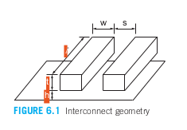

&emsp;&emsp;图6.1展示了一对相邻的导线。导线具有宽度𝑤、长度l、厚度 𝑡，并与其邻近导线间具有间距𝑠。导线与下面的导电层之间由高度为 ℎ的电介质隔开。宽度和间距之和称为导线间距，而厚度与宽度的比值𝑡/𝑤被称为高宽比。

## 6.2 互连线建模
### 6.2.1 电阻

### 6.2.2 电容
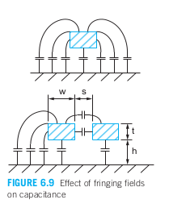

&emsp;&emsp;衬底上方的一条孤立导线可以模拟成地平面上方的一个导体。这一导体的电容有两个主要的组成部分：导线底面对地的平板电容和沿有一定厚度的导体的边沿由边缘电场所产生的边缘电容。此外，当一条导线与同一层上的第二条导线相邻时，它还会表现出对它相邻导线的电容。这些效应都显示在图6.9中，经典的平板电容公式为：  

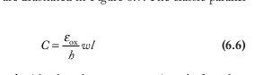

&emsp;&emsp;注意，氧化物通常掺入磷以捕获离子，防止其损害晶体管；这种氧化物的Jox值约为kJ0，其中k = 4.1，而理想氧化物为3.9，低介电常数（low-k）介质的值更低。  
&emsp;&emsp;边缘电容的计算更为复杂，准确结果需要数值场求解器。许多作者提出了这种计算的近似方法。一种直观的近似方法是将孤立导体视为位于接地平面上的一个矩形中间部分，并具有两个半球形的端盖，如图6.10所示【Yuan82】。总电容被认为是宽度为w - t/2的平行板电容和半径为t/2的圆柱电容之和。这导致的电容表达式在宽高比小于2且t ~ h时的精度在10%以内。

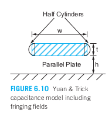

&emsp;&emsp;这些公式没有考虑同一层或更高层的邻近导体。在现代多层CMOS工艺中，层间的电容相互作用可能变得非常复杂。可以通过假设同一层的最小间距的平行邻居以及上下层为实心接地平面，得到电容的保守上界。类似地，可以通过假设除了衬底之外没有其他导体来获得电容的下界。在布局信息尚未提供时，上界可以用于传播延迟和功耗估算，而下界可以用于污染延迟计算。  
&emsp;&emsp;图6.11展示了用于电容上界计算的模型的横截面。目标导体的总电容是其与上下层及两个相邻导体的电容之和。如果上下层没有切换，它们可以被视为接地平面，这部分电容称为Cgnd。导线与更远邻居的电容通常可以忽略，因为大多数电场终止于最近的导体。相邻导线之间使用具有最低可能介电常数的介质khoriz来最小化电容。层间介质必须提供更大的机械稳定性，可能具有较大的kvert。公式(6.9)提供了一个简单且直观的电容估计公式。Cfringe项用于考虑边缘电容，并能更好地适用于宽度和间距大于最小值的情况。

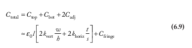

&emsp;&emsp;电容可以通过使用场求解器（如FastCap【Nabors92】或HSPICE）生成宽度和间距数据的查找表来计算。该表可能包含不同金属层的宽度和间距数据，假设上下层分别有导体或没有导体。表中应列出邻近线电容Cadj和接地电容Cgnd，因为与相邻线的耦合非常重要。图6.12展示了180 nm工艺中金属2导线的典型数据，导线和氧化物厚度为0.7 µm。宽度和间距以0.32 µm的最小值为倍数表示。  
&emsp;&emsp;对于基板上方的孤立导线，电容受导体之间的间距影响较大。对于夹在金属1和金属3平面之间的导线，电容更高，且对宽度更敏感（决定平行板电容），而一旦间距显著大于导线厚度，电容对间距的敏感性下降。无论哪种情况，y轴截距都大于零，因此导线宽度加倍时，总电容的增加小于两倍。数据符合公式(6.9)，Cfringe为0.05 fF/µm。紧密间距的金属线电容大约为0.2 fF/µm。

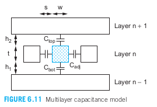  
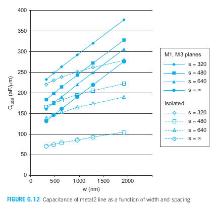

### 6.2.3 电感
&emsp;&emsp;大多数设计工具只考虑互连电阻和电容。电感难以提取和建模，因此工程师更倾向于以一种方式设计，使得电感效应可以忽略不计。尽管如此，在高频设计中，对于像时钟和电源总线这样的宽导线，仍需考虑电感。  
&emsp;&emsp;虽然我们通常讨论从门输出流动到充电或放电负载电容的电流，但电流实际上是以环路的形式流动的。电流环的回路通常是电源或接地网络；在相关频率下，电源充当“交流接地”，因为旁路电容在 VDD 和 GND 之间形成了低阻抗路径。沿环路流动的电流会产生与环路面积和电流量成正比的磁场。改变电流需要提供能量以改变磁场。这意味着变化的电流会感应出与变化率成正比的电压。这个比例常数被称为电感 L。  

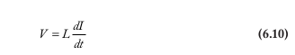

**电感性串扰：** 改变磁场会在其他环路中产生电流。因此一条导线上的信号可以感应耦合到另一条导线上去。

### 6.2.4 趋肤效应
&emsp;&emsp;电流沿着阻抗最低的路径流动，阻抗 Z = R + jωL。在高频情况下，阻抗主要由电感主导。如果电流仅在靠近回路路径的导体表面流动，电感将最小化。这种趋肤效应会降低厚导体的有效横截面积，并在高频时提高有效电阻。

### 6.2.5 温度相关性
&emsp;&emsp;互连线的电容与温度无关，但是电阻随温度变化很大。在电路的正常工作范围内铜和铝的温度系数约为0.4%/℃，即温度上高100℃将使电阻提高40%。在液氮温度下铜的电阻率下降至0.22µΩ· cm，几乎改善了一个数量级。这意味着使RC为主的路径处在冷却的系统中有很大的优点。

## 6.3 互连线的影响
### 6.3.1延时
&emsp;&emsp;互连线增加电路的延时有两个原因。首先，连线电容增加了对每个门的负载。其次，长连线具有很大的电阻，它们影响了分布RC延时或飞行时间。  
&emsp;&emsp;由于连线电阻和连线电容都随连线长度而增长，所以连线延时随长度呈平方关系曾长。采用较厚和较宽的导线以及像铜这样电阻率较低的金属和介电常数较小的绝缘层虽然能帮助减小延时，但长连线仍然常常具有不可接受的长延时。  
&emsp;&emsp;多晶硅和扩散导线（常称跑线）即使经过硅化也仍然有很高的电阻。扩散导线还具有非常高的电容，因此不要用扩散布线，通常只在锁存器和触发器中采用。

### 6.3.2 能耗
&emsp;&emsp;一条连线的翻转能耗由它的电容确定。长连线有较大的电容，因而翻转时需要很大数量的能量。

### 6.3.3 串扰
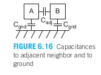  
&emsp;&emsp;如图 6.16 所示，导线不仅与其邻近导线之间存在电容，还与接地之间存在电容。当导线 A 切换时，由于电容耦合（也称为串扰），它往往会使邻近的导线 B 一起切换。如果 B 也应该同时切换，这可能会增加或减少切换延迟。如果 B 不应切换，串扰则会在 B 上产生噪声。我们会看到，串扰的影响取决于邻接电容 Cadj 与总电容的比率。需要注意的是，负载电容包含在总电容中，因此对于短导线和较大负载，负载电容占主导地位，串扰并不重要。相反，对于长导线，串扰则非常重要。

#### 6.3.3.1 串扰对延时的影响
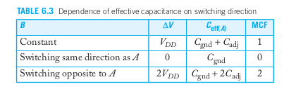
&emsp;&emsp;如果导线 A 和其邻近导线 B 都在切换，切换的方向会影响所需传递的电荷量和切换延迟。表 6.3 总结了这一效应。耦合电容器传递的电荷为 Q = CadjΔV，其中 ΔV 是 A 和 B 之间电压的变化。如果 A 切换而 B 不切换，则 ΔV = VDD。A 实际上看到的总电容仅是对接地和 B 的电容。如果 A 和 B 同时朝同一方向切换，则 ΔV = 0，因此不需要电荷，在延迟计算中 Cadj 实际上是缺失的。如果 A 和 B 朝相反方向切换，则 ΔV = 2VDD，需要双倍的电荷。等效地，可以将电容视为在 VDD 处有效增大了一倍。这类似于在第 4.4.6.6 节中讨论的米勒效应。米勒耦合因子 (MCF) 描述了如何将对邻近导线的电容乘以以找到有效电容。一些设计师在布局信息可用之前估算传播延迟时使用 MCF = 1.5 作为统计折中。  
&emsp;&emsp;一种保守的设计方法在计算传播延迟和污染延迟时假设邻近信号正在切换（MCF 分别为 2 和 0）。这会导致导线延迟的变化范围很大。更激进的方法则跟踪每个信号可以切换的时间窗口。因此，只有当潜在的切换窗口重叠时，才需要考虑切换的邻近信号。切换的方向也可以被考虑。例如，动态门在第 9.2.4 节中描述的预充电为高电平，然后在评估期间下降为低电平。因此，动态总线永远不会出现相反方向的切换。

#### 6.3.3.2 串扰对噪声的影响
&emsp;&emsp;假设导线A翻转而B保持不变，这将会在B引起噪声使它发生部分翻转。我们称A为入侵方或干扰方而B为受扰方。如果受扰方浮空，我们可以把该电路模拟成一个电容分压电路来计算受扰方的噪声。  
&emsp;&emsp;如果受扰方被有源驱动，那么该驱动器将提供电流阻止和减少受扰方上的噪声。我们将该驱动器模拟成电阻。  

### 6.3.4 电感影响
&emsp;&emsp;对于物理尺寸较大的集成电路封装，电感的影响总是很重要的。当光速飞行时间大于电路的上升时间或导线的RC延时，片上电感的影响也将变得非常重要。由于光速飞行时间随导线长度呈线性关系增长而RC延时随导线长度呈平方关系增长，所以我们可以估算出需要考虑电感时的导线长度范围：  

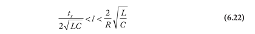

&emsp;&emsp;总而言之，片上电感很难提取。互感耦合可能会在长距离上发生，因此即使提取到准确的电感值，电感耦合的仿真也非常困难。相反，设计规则通常被构建成可以忽略大多数结构中的电感效应。最简单的做法是提供一个有规律的电源网络，在其中系统地分配电源和接地线，保持低的信号上升速率 (SR) 比率。对于高频设计中具有较大 SR 比率的总线，电感应纳入电源和时钟网络的仿真，以及噪声和延迟的计算。

## 6.4 互连线设计
&emsp;&emsp;随着门延迟的不断改善，而长导线的延迟保持不变甚至变得更慢，导线设计已成为集成电路设计中的重要组成部分。需要在设计周期的早期阶段制定布局计划，识别长导线并提前规划。尽管通过布局规划使关键的通信单元彼此靠近对性能有最大的影响，但长导线的存在是不可避免的。在旧工艺中，纵横比小于 1，但在纳米工艺中接近 2，以减小这些狭窄导线的电阻。这是以大幅增加耦合电容为代价的。设计师可以通过多种技术来优化导线的延迟和耦合噪声，包括控制导线的宽度、间距和层的使用。屏蔽可以用于进一步减少关键信号线上的耦合噪声。沿长导线插入重复器可将延迟从随长度平方增加变为随长度线性增加。导线的电容和电阻使得使用逻辑努力法选择门尺寸变得复杂。

### 6.4.1 宽度、间距和层次
&emsp;&emsp;设计师选择导线的宽度、间距和层的使用，以权衡延迟、带宽、能量和噪声。默认情况下，对于非关键互连，优先选择最小间距的导线，以获得最佳的密度和带宽。当负载主要由导线电容主导时，减少延迟的最佳方法是增加间距，从而降低与邻近导线的电容。这也会降低能量消耗和耦合噪声。当延迟主要受门电容和导线电阻影响时，增宽导线可以减少电阻和延迟。然而，这会增加顶部和底部电极的电容。增宽导线还会增加顶部和底部电极电容的比例，从而在一定程度上降低邻近导线的耦合噪声。不过，较宽的导线会消耗更多的能量。  
&emsp;&emsp;导线的厚度取决于所选金属层。较低的金属层较薄，并为紧凑的布线间距进行了优化。中间层通常稍厚，以降低电阻并提高电流承载能力。上层可能更厚，以提供低电阻的电源网和快速的全局互连。布线轨道是珍贵的资源，通常在布局中分配；明智的设计师会在设计过程后期保留一些布线轨道以应对未预料到的变化。  
&emsp;&emsp;电源网通常分布在多个层上。大部分电流承载能力集中在电阻最低的上两层。然而，电网必须延伸到金属 1 或金属 2，以便为单元提供便捷的连接。

### 6.4.2 中继器
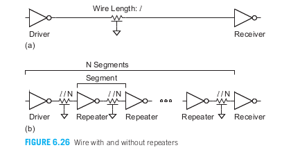  
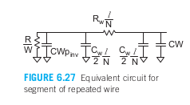  
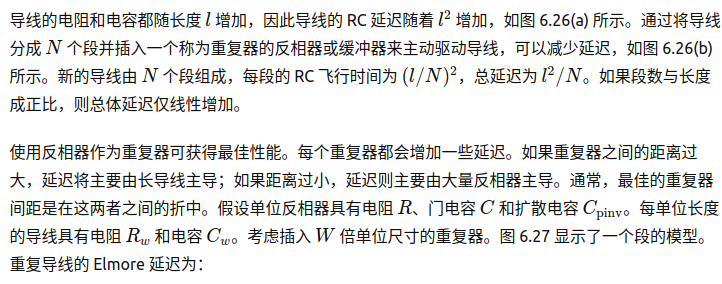 
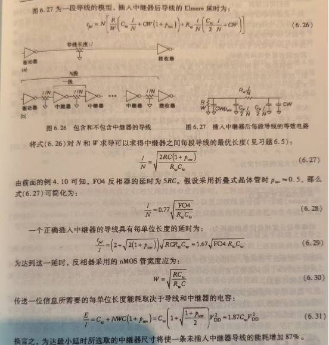 

### 6.4.3 串扰控制
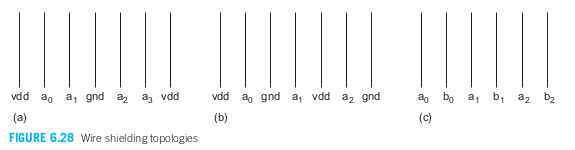
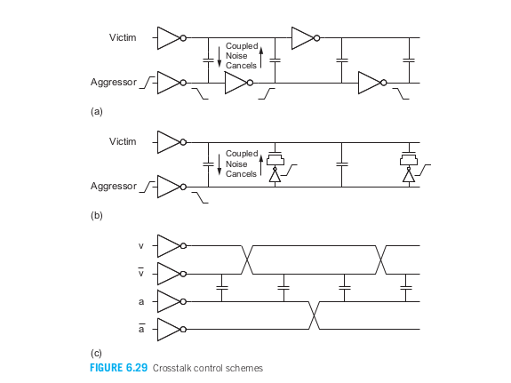

电容串扰正比于耦合电容与总电容的比。对于高宽比为2或更大的现在芯片中的导线。耦合电容可以占到总电容的2/3～3/4,因此串扰可能产生很大数量的噪声以及很大的于数据相关的延时偏差。已有几种控制这一串扰的方法：  
>**增大与相邻导线的间距：**  这是最简单的办法。如果串扰很严重，那么必须使间距增大一条全导线通道还宽的距离。  
>**使导线屏蔽：**  在关键信号线的一边或两边用电源线或地线对它进行屏蔽以消除耦合。  
>**确保相邻导线在不同的时间上偏转：**  如果总线 A 在时钟的上升沿切换，而总线 B 在时钟的下降沿切换，通过交错这两个总线的位，可以确保在切换事件期间两个邻近的总线都是稳定的。这可以避免耦合造成的延迟影响；然而，仍然需要确保耦合噪声不超过噪声预算。图 6.28 显示了导线的不同屏蔽方式：（a）一侧屏蔽，（b）双侧屏蔽，以及（c）交错排列。关键信号，如时钟或模拟电压，也可以在上下方进行屏蔽。  
>**抵消串扰：**三种方法为交错排列中继器，电荷补偿以及双绞线差分信号传输。图 6.29(a) 显示了具有错位重复器的两根导线。每个受害者段看到一半的上升干扰段和一半的下降干扰段。尽管由于段间延迟，取消并不完美，但错位是一种非常有效的方法。图 6.29(b) 展示了电荷补偿，其中在干扰者和受害者之间添加了一个反相器和一个晶体管。该晶体管被连接为电容。当干扰者上升并将受害者耦合向上时，反相器下降并将受害者耦合向下。通过选择适当大小的补偿晶体管，可以在增加额外电路的情况下取消大部分噪声。图 6.29(c) 展示了扭曲的差分信号传输，其中每个信号以差分方式布线。信号被交换或扭曲，使得受害者及其补充信号从干扰者及其补充信号中看到相等的耦合。这种方法在布线资源上成本较高，但有效消除了串扰。  

### 6.4.4 低摆幅信号传输
&emsp;&emsp;驱动长导线时由于有RC延时使速度较慢，由于有较大的翻转电容使功耗很大。低摆幅信号传输可以改善性能，因为它在导线信号翻转通过某个较小的Vswing时就能检测出结果而无需等待出现全摆幅。如果在输出已有足够的翻转后就关断驱动器还可以降低功耗。但这些改善的代价是需要有比较复杂的驱动器和接收器电路。低摆幅信号传输还可能需要用双绞差分对导线，以消除可能破坏小信号的共模噪声。
&emsp;&emsp;但低摆幅信号传输仍有一些挑战：  
>&emsp;&emsp;1.必须为芯片提供一个低电压Vdrive并把它分布到许多低摆幅驱动器中。信号应当沿差分对导线传输，它们形成双绞线以消除来自相邻导线的耦合作用，并需要进行均压以避免前一次数据传输所造成的干扰。  
>&emsp;&emsp;2.驱动器必须导通足够长的时间以在导线远端产生Vswing之后又应当关断以避免不必要的功耗。但这通常会导致在导线近端的摆幅稍大些。
>&emsp;&emsp;3.接收器必须在合适的时间由时钟启动以放大差分信号。但分布一个从驱动器至接收器的自定时时钟非常困难，由于距离很长，所以传输一个全摆幅时钟信号的时间超过了数据完成它较小摆幅的时间。  

### 6.4.5 再生器
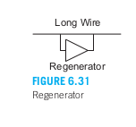  
&emsp;&emsp;中继器与导线相串联因而局限于在单向总线中应用。另一种方法时采用再生器，也成为提速器。它们在周期的间隔距离上与导线并联，如图6.31所示。当导线最初为0时，再生器检测到上升跳变并使它加速。相反，当导线最初为1时，再生器将加速下降跳变。再生器以牺牲噪声容限来换取多至20%的延时或能耗的改善。  
