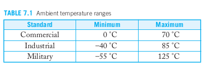
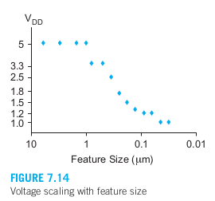

- [第7章 鲁棒性](#第7章-鲁棒性)
  - [7.1 引言](#71-引言)
  - [7.2 扰动](#72-扰动)
    - [7.2.1 电源电压](#721-电源电压)
    - [7.2.2 温度](#722-温度)
    - [7.2.3 工艺扰动](#723-工艺扰动)
  - [7.3 可靠性](#73-可靠性)
    - [7.3.1 可靠性术语](#731-可靠性术语)
    - [7.3.2 栅氧耗损](#732-栅氧耗损)
      - [7.3.2.1 热载流子](#7321-热载流子)
      - [7.3.2.2 负偏置温度不稳定性](#7322-负偏置温度不稳定性)
      - [7.3.2.3 时间相关电介质击穿](#7323-时间相关电介质击穿)
    - [7.3.3 互连线耗损](#733-互连线耗损)
      - [7.3.3.1 电迁移](#7331-电迁移)
      - [7.3.3.2 自热](#7332-自热)
    - [7.3.4 软错](#734-软错)
    - [7.3.5 过电压失效](#735-过电压失效)
    - [7.3.6 闩锁](#736-闩锁)
  - [7.4 按比例缩小](#74-按比例缩小)
    - [7.4.1 晶体管的按比例缩小](#741-晶体管的按比例缩小)
    - [7.4.2 互连线的按比例缩小](#742-互连线的按比例缩小)
    - [7.4.3 半导体国际技术线路图](#743-半导体国际技术线路图)
    - [7.4.4 对设计的影响](#744-对设计的影响)
      - [7.4.4.1 改善性能和成本](#7441-改善性能和成本)
      - [7.4.4.2 互连线](#7442-互连线)
      - [7.4.4.3 功耗](#7443-功耗)
      - [7.4.4.4 扰动](#7444-扰动)
      - [7.4.4.5 设计效率](#7445-设计效率)
      - [7.4.4.6 物理极限](#7446-物理极限)

# 第7章 鲁棒性
## 7.1 引言
&emsp;&emsp;第7.2节首先分析了制造和环境变化的来源及其对芯片的影响。接着，第7.3节讨论了可靠性，包括磨损、软错误和灾难性故障。一个好的设计不仅应该在当前的制造工艺中表现良好，还应该在移植到更先进的工艺时也能正常工作。第7.4节讨论了用于预测未来工艺如何演进的缩放定律。第7.5节则以更数学的方式重新审视了变化性问题。第7.6节探讨了自适应和容错设计技术，以补偿变化和瞬态错误。  

## 7.2 扰动
&emsp;&emsp;当考虑决定电路行为的各种情况时，我们只是提到了在不同工作条件下这一行为可能发生的扰动。一般来说扰动有三种不同的来源——两个是环境方面的原因，一个是制造方面的原因：工艺扰动、电源电压、工作温度。

### 7.2.1 电源电压
  
&emsp;&emsp;虽然系统设计在额定的电源电压下工作，但这一电压会因许多原因而发生变化，包括电压调节器的容差、沿电源轨线的IR压降以及di/dt噪声等。系统设计者可以用进行电源电压调节和分布的资源来换取电源噪声的改善，一般电源都规定为在每个逻辑门处额定值附近的+-10%以内。电源电压除随时间变化外还在整个芯片上变化。如图7.2为一个说明最坏情形下电压降与芯片上位置关系的电压降图。由于速度大致与VDD成正比，所以作为一阶效应，这将引起+-10%的延时扰动。电源扰动也反映在噪声预算中。

### 7.2.2 温度
&emsp;&emsp;前面曾谈到，随温度上升漏极电流下降。晶体管的结温是环境温度和因封装中功耗引起的温升的和，这一温升由功耗及封装的热阻决定。  

  

&emsp;&emsp;表7.1列出了部件的商用标准，工业标准，军用标准的环境温度范围。部件必须在环境温度范围的下限时仍能工作，除非它们在使用前允许有时间预热。结温（即在形成晶体管的半导体结处的温度）可以明显超过最高的环境温度，通常商用部件都经验证可工作在高至125°C的结温下。管芯上温度的变化取决于哪些部分消耗最多的功耗。由于这一变化是逐渐的，所以在给定1mm直径范围内的所有电路都几乎处于相同的温度下。温度以毫秒这样的尺度随温度变化。  

### 7.2.3 工艺扰动
&emsp;&emsp;部件和互连线在薄膜厚度、横向尺寸及掺杂浓度方面都会有扰动。这些扰动可以分为两类：  
**管芯间扰动：** 例如，一个管芯上的所有晶体管会由于被刻蚀而比额定的更短。
**管芯内扰动：** 例如，一个晶体管会由于注入的掺杂原子数为随机数与相邻的晶体管具有不同的阈值电压。  
&emsp;&emsp;对于器件，最主要的扰动是沟道长度L和阈值电压Vt。沟道长度扰动是由于光刻邻近效应、光学偏差及等离子刻蚀影响引起的。阈值电压的变化是由于掺杂浓度的不同和退火效应、栅氧中的可动电荷，以及由微小晶体管中少量掺杂原子引起的离散掺杂扰动造成的。阈值电压随晶体管的耗损逐渐改变。  
&emsp;&emsp;对于互连线，最主要的扰动是线宽和间距、金属和电介质的厚度及接触的电阻。线宽和间距就像沟道长度一样，与光刻和刻蚀的邻近效应有关。厚度可能受抛光的影响。接触的电阻取决于接触的尺寸及刻蚀和清洗步骤。
&emsp;&emsp;工艺扰动可以分为以下几类：  
>&emsp;&emsp;1.批次与批次间（L2L），  
>&emsp;&emsp;2.圆片与圆片间（W2W），  
>&emsp;&emsp;3.管芯与管芯间（D2D）即管芯间或圆片内（WIW），  
>&emsp;&emsp;4.管芯内部（WID），也称管芯内。  

&emsp;&emsp;圆片是按批次量加工的，称为批次。在反应炉关断和清洗后，加工的批次的性能会稍不同于之前的批次。一个圆片暴露在离子注入机下的时间可能与另一个圆片稍有不同，这将引起W2W的阈值电压扰动。一个靠近圆片边缘的管芯被刻蚀的程度可能稍不同于圆片中央的管芯，这将引起D2D的沟道长度扰动。  
&emsp;&emsp;WID扰动在过去都比D2D扰动小，并且多半被数字设计者忽略不计，但现在在纳米工艺下WID扰动已变得非常重要。一些WID扰动在空间上相关，它们被称为工艺倾斜。例如，在离子注入机可能向圆片中心附近比周边附近发送更大的剂量，这将引起阈值电压在整个圆片上沿径向波动。总之，在同一管芯上的晶体管比在不同管芯上的晶体管匹配更好，而相邻的晶体管比相隔较远的晶体管匹配得更好。WID扰动较难控制，因为这一块芯片上的几百万个乃至几十亿个晶体管往往总会有一些偏离典型参数很源。    
&emsp;&emsp;从设计者的角度来看，工艺和环境变化的综合影响可以归结为它们对晶体管的影响：典型（也称为额定）、快速或慢速。在CMOS中，有两种具有相对独立特性的晶体管，因此每种晶体管的速度可以独立表征。此外，互连速度可能独立于器件速度而变化。当这些工艺变化与环境变化结合时，我们定义了设计或工艺拐角。术语‘拐角’指的是包围电路保证性能的一个假想框，正如图7.5所示。这个框不是正方形的，因为某些特性（如氧化物厚度）会在器件之间跟踪，因此不可能同时找到具有厚氧化物的慢nMOS晶体管和具有薄氧化物的快pMOS晶体管。  
&emsp;&emsp;表7.2列出了一些有趣的设计拐角。这些拐角通过五个字母来指定，分别描述了nMOS、pMOS、互连、电源和温度。字母为F、T和S，分别表示快、典型和慢。表7.3展示了1.8 V商用工艺的环境拐角，表明电路在高电压和低温下最快。电路最有可能在设计空间的拐角处失效，因此非标准电路应该在所有拐角处进行仿真，以确保它们在所有情况下都能正常工作。通常，集成电路的设计是为了满足典型工艺的时序规范。这些器件可能会被分级；较快的器件被额定为更高的频率并以更高价格出售，而较慢的器件则被额定为较低的频率。无论如何，这些器件仍然必须在最慢的SSSSS环境中正常工作。其他集成电路的设计目标是在较低频率下获得高产率；这些器件在慢速工艺拐角下进行时序仿真。最快的拐角是FFFFF，它具有最大速度。其他拐角用于检查竞争条件和比例问题，其中不同晶体管或互连的相对强度和速度很重要。FFFS拐角对于噪声至关重要，因为边沿速度快，导致更多的耦合；阈值电压较低；且漏电较高。  

  
  

## 7.3 可靠性
&emsp;&emsp;设计可靠的CMOS芯片需要理解和提出可能的失效模型，本节将介绍引起集成电路永久失效的可靠性问题（硬错），它包括以下几种情形：  
>&emsp;&emsp;**栅氧耗损；**  
>&emsp;&emsp;**互连线耗损；**  
>&emsp;&emsp;**过电压失效；**  
>&emsp;&emsp;**闩锁**  

&emsp;&emsp;本节也将介绍由辐射触发的暂态失效，它会引起系统崩溃或数据丢失。

### 7.3.1 可靠性术语
**失效：**指偏离了系统的规格一段给定的时间。失效是由故障引起的，而故障定义为子系统的失效。  
&emsp;&emsp;故障有许多原因，从设计瑕疵到制造缺陷，耗损，外部干扰，以及认为地不合理使用产品。并不是所有的故障都会导致出错，有些故障会被屏蔽掉。例如，多处理器接口逻辑中的故障不会引起单处理器系统出错。一个有缺陷的通孔如果与一个好的通孔并联就可能被忽略。  
&emsp;&emsp;通常有许多缩略语可用来描述可靠性。MTBF为平均失效间隔，即（器件数 X 工作小时） / 失效数。FIT（称为“非特”）为一定时间内的失效数，即每百万个器件在每一千个小时内可能发生的失效数，或相当于10的9次方 × （失效率/小时）。1000FIT就是10的6次方小时内即114年失效一次，这对于单芯片来说是一个很好的失效率。但如果一个系统包含100块芯片，每块芯片的失效率为1000FIT，而一个用户买了10个这样的系统，那么总的失效率就是100 × 1000 × 10 = 10的6次方FIT即每1000小时（42天）就失效一次，因此人们希望达到可靠性目标是小于100FIT。  

  

&emsp;&emsp;大多数系统的可靠性都显示出图7.6所示的浴盆曲线。系统刚生产出来时，那些具有脆弱或勉强合格的部件的系统比较容易失效。这一时期称为早期失效。而可靠的系统就在之后进入它们的有效工作寿命期，这一时期的失效率较低。最后当系统被耗损因而寿命期快结束时失效率又开始增加。因此对系统进行老化试验，使它通过早期失效期后才能将产品发货。使部件在比正常更高的电压和温度下进行老化试验可以加速老化过程。  

### 7.3.2 栅氧耗损
&emsp;&emsp;由于栅氧承受电压，它们会逐渐耗损，引起阈值电压漂移和栅泄漏增加，最终电路会由于晶体管变得太忙、失配变得太严重或泄漏电流变得太大而失效。工艺通常规定了一个最大的工作电压以保证在芯片寿命期内栅氧的耗损影响很少。栅氧耗损的主要机理包括以下几个方面：  
>热载流子；
>负偏置温度不稳定性（NBTI）；
>时间相关电介质击穿（TDDB）  

#### 7.3.2.1 热载流子
&emsp;&emsp;晶体管翻转时，高能量（热）载流子有时会注入到栅氧中并在那里被捕获。由于电子具有较高的迁移率因而构成了热载流子的大部分。被破坏了的栅氧将改变器件的I-V特性，使nMOS管的电流减小而pMOS管的电流增加。当衬底电流Isub很大时栅氧破坏最大，这通常发生在nMOS管导通而Vds较大的情况下，因此对于具有快速上升输入和重负载输出的反相器及或非门，以及对于较高的电源电压，这一问题最严重。  
&emsp;&emsp;当nMOS管变得太慢时，热载流子将使电路耗损。它们也会因为匹配部件性能下降的程度不同而使灵敏放大器或其他匹配电路失效。热电子使性能下降的情况可以用模拟器分析。对输入上升时间和单级电气，努力设置一个最大值可以限制耗损，但这些最大值取决于工艺及工作电压。  

#### 7.3.2.2 负偏置温度不稳定性
&emsp;&emsp;当电场加在栅氧上时，就在Si-SiO2界面形成了称为陷阱的自由键。当形成更多的陷阱时就会使阈值电压增加，从而减小驱动电流直至电路失效。强负偏置（即栅极电压为0而源极电压为VDD）的pMOS管在高温时的这一过程最为突出，它已成为了许多纳米工艺栅氧耗损的最主要原因。当在一段时间t内施加一个Eox = VDD / tox的电场时，阈值电压的漂移可以模拟为：  

  

&emsp;&emsp;老化试验期间所施加的高强度测试条件能跟踪到大部分由NBTI所预期的阈值电压漂移，这一点非常有利，因为这样即能全面测试由NBTI引起的性能下降。设计时，芯片应当对它整个寿命期中可能遇到的最坏情形的NBTI漂移进行模拟。

#### 7.3.2.3 时间相关电介质击穿
&emsp;&emsp;当在栅氧上施加电场时，栅电流会逐渐增加。这一现象称为时间相关性电介质击穿，而这个增加的栅电流称为应力诱生泄漏电流（SILC），虽然它确切的物理机制还没有被充分理解，单TDDB很可能来自电荷注入、体陷阱状态生成及陷阱辅助导电的共同作用。当达到足够的应力（场强）后，它可能导致极其严重的电介质击穿，使栅极短路。  
&emsp;&emsp;这一失效率与温度及栅氧厚度间呈指数关系。为了保证在125°C下有十年的寿命，加在栅上的电场Eox = VDD / tox应当保持在约0.7V/nm以下。纳米工艺工作在接近这个限度。这个问题在发生电压过冲时最为严重，这可能是由含噪声的电源或在I/O焊盘处的反射所引起的。通过降低电源电压、减小电源噪声及在I/O焊盘处采用较后的栅氧，可以改善可靠性。  

### 7.3.3 互连线耗损
&emsp;&emsp;大电流流过导线时最终可能损坏导线。对于流过单方向（直流）电流的导线，电迁移是主要的失效方式。而对于流过双向（交流）电流的导线，自热是失效的主要原因。  

#### 7.3.3.1 电迁移
  

&emsp;&emsp;大电流密度会导致“电子风”，它使金属原子随时间迁移。这一电迁移使金属互连线形成空洞而耗损。图7.8为金属2（M2）层和金属3（M3）层之间一个通孔发生电迁移失效的扫描电子显微照片。在扫描电子显微镜下拍摄的出色视频显示了空洞的形成和迁移，以及导线失效的过程。这个问题对于铝线尤为严重，通常采用铝-铜或铝-硅合金来减轻它。但对于纯铜导线来说，由于铜具有不同的颗粒输送特性，因而这个问题要轻的多。电迁移特性也与金属膜的颗粒结构有关。  
&emsp;&emsp;电迁移与电流密度J = I/wt 有关。流过直流电流的导线更容易发生电迁移，因为此时电子风总是沿着同一方向冲击而不像在双向电流时的情形那样。发生电迁移时的电流极限值通常表示为最大的直流电流密度Jdc。平均失效时间（MTTF）对工作温度也非常敏感，它可以用Black方程式表示如下：  

  

Ea是通过在高温下进行应力测试实验确定的激活能量，n通常为2。电迁移直流电流的限制因材料、工艺和预期的平均故障间隔时间（MTTF）而异，应该从制造供应商那里获取相关数据。如果没有更好的信息，对于110°C下的铝线，保守的最大直流电流密度限制为1–2 mA/μm²。铜对电迁移的敏感性较低，可能承受10 mA/μm²或更高的电流密度。电流密度在接触切割处可能会受到更多限制。  
考虑到动态开关功耗，我们可以估算导线能够驱动的最大开关电容。电流为Idc = P/V = FCVf。因此，对于电流限制为Idc–max的导线，开关电容应小于：  

  

#### 7.3.3.2 自热
&emsp;&emsp;虽然双向电流导线较不容易受电迁移的影响，但它们的电流密度仍然受自热的限制。大电流将在导线中引起功耗。由于导线周围的氧化物或低k电介质都是热的绝缘体，所以导线温度可以变得明显高于它下面的的衬底温度。热导线具有较大的电阻和延时。电迁移对温度也非常敏感，所以自热可能在双向电流导线中引起与温度相关的电迁移问题。峰值电流很大的短脉冲甚至可能使互连线熔化。自热取决于均方根（RMS）电流密度。它可以用电路模拟器测量得到或用下式计算：  

  

### 7.3.4 软错
  

&emsp;&emsp;软错误是由辐射击中芯片引发的随机、非重复性错误。过去，软错误的主要来源是由包装材料中微量铀和钍杂质衰变释放的α粒子，但通过使用高度纯化的材料，α粒子已大大减少。如今，许多系统中的大部分软错误是由宇宙辐射中的高能（> 1 MeV）中子引起的。当中子撞击硅原子时，会诱发裂变，使原子碎裂成带电的碎片，这些碎片继续穿过基板。在它们穿过晶格时，这些离子会在其路径上留下电子-空穴对的痕迹。图7.11展示了离子撞击反向偏置的p-n结时的效果 。离子在其轨迹上留下一个半径小于一微米的电子和空穴的圆柱形痕迹。在几十皮秒内，结上的电场将这些载流子收集到一个漏斗形的耗尽区。在接下来的纳秒时间内，电子扩散到耗尽区。根据离子的类型、能量、轨迹和p-n结的几何结构，可能会在结上收集到几百飞库仑的电荷。  
&emsp;&emsp;这一电流脉冲称为单次事件瞬变（SET）。如果收集到的电荷超过一个临界值（Qcrit），它可能会翻转节点的状态，导致一个称为单次事件翻转（SEU）的故障。由此类故障引发的失效称为软错误。Qcrit取决于节点的电容和电压，以及任何可能抵抗扰动的反馈器件。这是一个严重的挑战，因为随着晶体管的缩小，电容和电压都在减少，从而降低了Qcrit。幸运的是，在较小的结上收集到的电荷量也减少了，但总体趋势仍是软错误率的增加。  
&emsp;&emsp;粒子撞击产生的空穴流向附近的基板接触点并被收集。通过电阻性基板的电流会升高基板的电位。这可能会打开一个寄生双极晶体管（参见7.3.6节）位于一个邻近的nMOS晶体管的源极和漏极之间，扰乱该晶体管的操作。通过使用充足的基板和良好的接触可以控制这种多节点干扰。  
&emsp;&emsp;在海平面高度，SRAM的软错误率（SER）通常为100-2000 FIT/Mb。宇宙射线中的中子通量在飞机飞行高度下增加了两个数量级，并且在这些高度下可能导致高达10⁶ FIT/Mb的错误率。根据工艺和布局，大约1%的软错误会影响多个节点。  
&emsp;&emsp;软错误会影响存储器、寄存器和组合逻辑。存储器使用错误检测和纠正码来容忍软错误，因此在设计良好的系统中，这些错误很少会转化为失效。这些编码将在11.7.2节和12.8.2节进一步讨论。随着寄存器的电荷存储减少，寄存器中的软错误变得越来越常见。用于寄存器和存储器的抗辐射硬化方案将在10.3.10节和12.8.3节讨论。  
&emsp;&emsp;在组合逻辑中，收集到的电荷会在门电路的输出端引发一个瞬时故障脉冲。这个脉冲可以传播到后续逻辑，直到到达寄存器。该故障不一定会导致失效。掩蔽机制包括以下几种：  
>逻辑掩蔽：SEU可能不会触发通过逻辑的敏化路径。例如，如果NAND门的两个输入都为0，则其中一个输入的SEU不会影响输出。  
>时间掩蔽：SEU可能不会在寄存器采样时到达寄存器。  
>电气掩蔽：如果SEU比门电路的带宽快，它可能会被衰减。  
在旧技术中，较大的门电路具有更多的电荷，因此它们不太可能发生翻转。即使发生翻转，也很可能被电气掩蔽所衰减。然而，软错误在65nm及以下的组合逻辑中成为了日益严重的问题，因为门电路的电容较小，速度较高。  

### 7.3.5 过电压失效
&emsp;&emsp;微小的晶体管可以很容易地被破坏。过电压可以因过大的电源电压过渡而产生，也可以因静电进入I/O焊盘造成静电放电（ESD）而产生，因为后者可能引起非常大的电压和电流过渡。  
&emsp;&emsp;栅节点上的过电压会加速栅氧耗损。在极端情形下，它可能引起击穿和通过薄介质放电，从而破坏器件。直流栅氧击穿电压与栅氧厚度及绝对温度有一定的比例关系，并能模拟成下式：  

  

&emsp;&emsp;在典型情况下，参数a为1.5 V/nm，b为533 V·K，且V0接近于0。在65 nm工艺中，最坏情况（过热）下击穿大约发生在3 V左右。当源极和漏极之间施加高于正常的电压时，源/漏耗尽区会接触，导致穿通现象。这会导致异常高的电流流动，并最终引发自毁性的过热。  
&emsp;&emsp;这两个问题都限制了施加到晶体管上的最大安全电压。即使避免了灾难性故障，高电压也会加速磨损机制。因此，工艺规范为长期可靠运行规定了一个最大电压（Vmax）。对于纳米级工艺，这个电压通常远低于I/O标准电压，这就需要一种具有更厚氧化层和更长沟道的第二类晶体管来承受较高的I/O电压。  

### 7.3.6 闩锁
&emsp;&emsp;早期CMOS工艺的采用曾因CMOS芯片的一种奇怪现象而受阻，即CMOS芯片在使用时往往会在VDD和GND之间形成低阻通路而使芯片严重熔毁。这一称为闩锁的现象发生在当由衬底、阱和扩散区形成的寄生双极型晶体管导通时。随工艺进步及采用正确的版图设计步骤可以很容易地避免闩锁问题。  

&emsp;&emsp;闩锁效应的原因可以通过分析CMOS反相器的工艺横截面图来理解。如图7.12a所示，在这一工艺横截面图上还画出了一个等效电路。除了料想到的nMOS和pMOS管外，该图还显示了由一个npn晶体管、一个pnp晶体管及两个连接在电源和接地轨线之间的电阻的电路，如图7.12b所示。npn管在nMOS管接地的n扩散源极、p型衬底及n阱之间形成。两个电阻是通过衬底或阱至最近的衬底和阱接头的电阻。这一对交叉耦合的晶体管形成了一个双稳态的可控硅整流器（SCR）。最初两个寄生双极型晶体管截止。在芯片正常上电期间，当过渡电流流过衬底时，或当应用一个超过正常工作范围的外部电压时，就有可能触发闩锁。当有很大的电流流过衬底时，Vsub将升高，使npn管导通。这将拉出电流流过阱电阻，使Vwell下降并使pnp管导通。pnp管的电流又使Vsub升高，这就形成了一个正反馈环，使在VDD和GND之间持续保持有一个很大的电流流过，直到关断电源或使电源线熔断为止。  
&emsp;&emsp;幸运的是，通过减小Rsub和Rwell能很容易的防止闩锁。例如，一些工艺在具有低衬底电阻的重掺杂衬底上采用一层轻掺杂硅的薄外延层。最重要的是，设计者应当在靠近每一个晶体管处放置衬底接头和阱接头。一个保守的准则是，在邻近每个连至VDD或GND的源极处放置一个接头。如果无法实现这点，你可以从制造厂商中获取更详细的信息（他们通常会规定扩散区至衬底/阱接头所允许的最大距离）或试用以下准则：  

>每个阱应当至少有一个接头。  
>所有的衬底和接头应当用金属直接连至合适的电源。  
>每5～10个晶体管应当放置一个接头，在稀疏区域可以放置得更多些。  
>nMOS晶体管应当集结在一起靠近GND而pMOS晶体管应当集结在一起靠近VDD，以避免nMOS管和pMOS管像>棋盘图案那样互相交织在一起形成复杂结构。  

  

&emsp;&emsp;I/O引脚特别容易发生闩锁效应，因为外部电压可能会出现低于GND或高于VDD的振荡，导致漏极与基板或阱之间的结正向偏置，并将电流注入基板。在这种情况下，应使用护环来收集电流，如图7.13所示。护环是围绕目标晶体管的与适当电源相连的基板或阱接触。例如，如果图7.13(b)中的n+扩散层的电压比0伏下降一个二极管压降时，它可能会将电子注入基板。连接到地的p+护环提供了一条低电阻路径，以在这些电子干扰护环外的其他电路之前将其收集起来。所有与外部世界连接的电路中的扩散结构必须带有护环，即n+扩散由连接到GND的p+护环包围，或p+扩散由连接到VDD的n+护环包围。对于极其谨慎的情况，可以使用双护环；即n+由连接到GND的p+护环包围，然后n+连接到VDD，或p+由连接到VDD的n+护环包围，然后p+连接到GND。  
&emsp;&emsp;SOI（绝缘体上硅）工艺完全避免了闩锁效应，因为它们没有寄生双极结构。此外，VDD低于1.4–2 V的工艺对闩锁效应免疫，因为两个寄生晶体管的电压永远不会足够大以维持正反馈。因此，闩锁效应在纳米级工艺中已成为一个较小的关注点。  

## 7.4 按比例缩小
&emsp;&emsp;VLSI设计中的唯一不变就是变化。图1.6展示了技术的不断进步，其中特征尺寸每两到三年减少30%。随着晶体管变得越来越小，它们的切换速度更快，功耗更低，制造成本也更便宜！自1995年以来，尽管技术挑战变得更加复杂，但由于行业内激烈的竞争，创新的步伐实际上加快了。这种缩放在技术史上是前所未有的。然而，缩放也加剧了可靠性问题，增加了复杂性，并引入了新的问题。设计人员需要能够预测这种特征尺寸缩放对芯片性能的影响，以规划未来的产品，确保现有产品能够顺利过渡到未来的工艺以降低成本，并预见即将出现的设计挑战。本节探讨了晶体管和互连如何缩放，以及缩放对设计的影响。半导体行业协会编制并维护了一份《国际半导体技术路线图》，预测未来的缩放情况。第7.8节提供了一个案例研究，展示了缩放如何在三十多年间影响英特尔微处理器。  

### 7.4.1 晶体管的按比例缩小
&emsp;&emsp;登纳德的按比例缩小定律预见到MOS晶体管的基本工作特性可以保持下去，并且当器件的关键参数按一个无量纲因子S缩小时性能将得到改善。这些参数包括：  
>所有的尺寸（沿x，y和z方向）  
>器件电压  
>掺杂浓度  
&emsp;&emsp;这一缩小步骤也称为恒电场缩小，因为当电压和距离都减小时电场仍保持不变。与此不同，恒电压缩小步骤缩小器件的尺寸但不降低电压。另一个步骤是横向缩小，它只缩小栅长，通常称它为栅缩小步骤，因为它能针对一个已有设计的掩模数据库很容易地实现。  

  

  

&emsp;&emsp;图7.14展示了电压如何随着特征尺寸的缩放而变化。历史上，特征尺寸从6微米缩小到1微米，同时保持5V的供电电压。这种恒定电压缩放带来了二次方的延迟改进以及成本的降低。同时，它也保持了I/O电压标准的连续性。然而，恒定电压缩放增加了器件中的电场。在1微米节点时，速度饱和现象已经严重到减少特征尺寸不再提升器件电流。高电场引发的器件击穿是另一个风险，且功耗变得不可接受。因此，自0.5微米节点以来，Dennard缩放成为了主流。通过Dennard缩放，30%的缩减可以使时钟频率提高40%，并将每个门的功耗减少一半。保持恒定电场还有一个额外的好处，就是许多非线性因素和老化机制基本不受影响。不幸的是，由于漏电，自90 nm节点以来电压缩放显著放缓，这可能最终限制CMOS的缩放。  
&emsp;&emsp;假设理想的恒定电场缩放，FO4反相器延迟将按照1/S的比例缩放。如7.2.4节所述，对于典型的加工和最差环境，这种延迟通常是每纳米有效沟道长度0.5皮秒。  

### 7.4.2 互连线的按比例缩小
  
  

### 7.4.3 半导体国际技术线路图
  
&emsp;&emsp;惊人的缩放速度需要众多公司和研究人员之间的合作，既要开发兼容的工艺步骤，也要在生产遇到瓶颈之前预测并解决未来的挑战。半导体行业协会（SIA）制定并更新了《国际半导体技术路线图》（ITRS），以达成共识，避免研发力量浪费在不兼容的技术上，并预测未来需求，指导研究工作。这种预测未来的努力不可避免地容易出错，实际上，行业的发展速度比1990年代末路线图的预测还要快，特征尺寸和时钟频率的缩放都超出了预期。尽管如此，路线图仍然提供了比单纯通过历史缩放数据进行线性外推更为连贯的愿景。  
&emsp;&emsp;ITRS预测每大约三年会有一个新的技术代代出现，也称为技术节点。表7.6总结了一些预测，特别是针对高性能微处理器。然而，前方存在严峻的挑战，在许多领域需要重大突破才能保持路线图中的缩放趋势。  

### 7.4.4 对设计的影响
&emsp;&emsp;一级缩放的一个局限是，它给人一种错误的印象，认为可以按比例缩放到零维度和零电压。实际上，随着缩放的进行，许多因素会发生显著变化。本节尝试展望未来，并预测缩放对设计的一些影响。这些预测充满风险，因为芯片设计师们在过去已经经历过类似的情况。  

#### 7.4.4.1 改善性能和成本
&emsp;&emsp;缩放带来的最积极影响是性能和成本的稳步提升。系统架构师需要理解CMOS技术的缩放，并预测未来几年工艺的能力，因为芯片的完成通常要耗时几年。随着每年晶体管变得更便宜，架构师尤其需要有创造性的想法，如何利用越来越多的晶体管来提供更多或更好的功能。当晶体管刚发明时，那个时代最好的预测表明其制造成本最终可能接近五十美分。图7.15展示了过去三十年半导体行业出货的晶体管数量和每个晶体管的平均价格。到2008年，你可以用一分钱买到超过10万个晶体管，预计到2015年晶体管的价格将达到一个微美分。  

  

#### 7.4.4.2 互连线
&emsp;&emsp;缩放后的晶体管延迟在不断改善，但缩放后的全局导线情况则变得更糟。图7.16来自1997年半导体行业协会路线图，预测了门和导线延迟的总和在250 nm或180 nm节点处触底，之后变得更差。导线问题促使了许多预测传统导线将消亡的论文的出现。然而，这个图表在两个方面具有误导性。首先，‘门’延迟显示的是单个未加载晶体管的延迟（延迟=RC），而不是更现实的负载门延迟（例如，FO4逆变器延迟=15RC）。其次，显示的导线延迟是针对固定长度的，但随着技术缩放，大多数连接单元内门的本地导线也变得更短。  
&emsp;&emsp;实际上，对于短导线，如逻辑门内的导线，其RC延迟可以忽略不计，并将在可预见的未来保持这种情况。然而，长导线则带来了巨大的挑战。要在一个大规模高性能芯片的两侧之间在一个时钟周期内传递信号已经不再可能。而且，信号在一个周期内能够传输的‘可到达半径’正在逐渐变小。  
&emsp;&emsp;重驱动器在某种程度上有所帮助，但即便如此，互连依然跟不上。更何况，‘重驱动器区’还必须在平面设计中分配空间。随着缩放后的门速度变得更快，重驱动器的延迟也随之减少，因此可以预计将使用更多的重驱动器。这意味着需要更多的重驱动器区。  
&emsp;&emsp;一种缓解互连问题的技术是使用更多层次的互连。表7.7显示了台积电工艺中每一代互连层数的增加。较低层的互连通常缩放得更密，以提供高密度的短连接。较高层则缩放较少，甚至可能反向缩放，使其更厚更宽，以提供低电阻的高速互连、良好的时钟分配网络和坚固的电源网。铜和低k介质也被引入以减少电阻和电容。  
&emsp;&emsp;由5万至10万个逻辑门块组成的模块（1个逻辑门块 = 1000个3输入NAND门或6000个晶体管）内部将继续拥有相对较短的导线和可接受的低RC延迟。因此，可以将大型系统划分为大致这个规模的模块，并在模块之间插入重驱动器以进行通信。  

#### 7.4.4.3 功耗
&emsp;&emsp;在经典的恒定电场缩放中，动态功率密度保持不变，芯片的总功率仅随着芯片尺寸的增大而缓慢增加。然而，实际情况是，微处理器的功率密度在20世纪90年代急剧上升，因为大规模流水线设计使时钟频率的提升远远超过了经典缩放理论的预测，同时VDD（电源电压）也高于恒定电场缩放所要求的水平。高性能微处理器的功耗达到了低成本风扇和散热片能够处理的极限——大约150瓦。由于这一趋势已经结束，设计师现在更多地关注在给定的功率限制下实现最大性能，而不是单纯追求最高时钟频率。  
静态功耗 是一个更严重的限制。随着阈值电压的降低，亚阈值漏电功耗呈指数增长，从几乎可以忽略不计迅速变成总功耗中的重要组成部分。第5.4.2节表明，静态功耗应占总功耗的三分之一，以最小化能量-延迟乘积（EDP）。更高的漏电功耗迫使人们采用电源门控技术来控制睡眠模式下的功耗，特别是对于电池供电的系统。为了将漏电限制在-100 nA/μm，阈值电压（Vt）基本保持在300 mV左右。VDD/Vt比率已经从早期工艺中的大约5下降到3，公式（5.27）显示，最佳EDP的比率可能低至2。随着比率的降低，带有阈值电压下降的电路不再可行。由于栅极超驱逐渐降低，VDD缩放在90 nm节点以下变得缓慢。这增加了电场，加剧了速度饱和和可靠性问题，同时也提升了动态功耗。  
&emsp;&emsp;对于氧化层厚度小于15–20 Å的情况，栅极漏电流变得重要，这基本上阻止了氧化层厚度低于10 Å的缩放。如果氧化层厚度不能与其他尺寸一起缩小，开态与关态电流的比率将恶化。高k金属栅极通过提供较高物理厚度下的较低有效厚度来解决这一问题。  
&emsp;&emsp;即使功耗保持不变，较低的供电电压会导致更高的电流密度，进而导致供电网络中的IR压降和di/dt噪声增加（详见第9.3.5节和第13.3节）。这些因素要求芯片中有更多的引脚和金属资源用于电源分配网络。
&emsp;&emsp;总体来看，缩放受到了功耗限制的多方面挤压。一些制造商发现传统缩放可以带来性能或功耗的改善，但无法同时实现两者【Muller08】。英特尔正在积极引入新材料，如高k金属栅极和应变硅，以在45 nm节点继续实现性能和功耗的双重提升。即便如此，摩尔定律的疯狂发展速度可能终于开始放缓。  

#### 7.4.4.4 扰动
&emsp;&emsp;随着晶体管尺寸的缩小，诸如沟道长度和阈值电压等参数的波动增大。变异性从过去的模拟电路烦恼，逐渐成为主流数字电路中的关键因素。设计人员被迫采用更宽的安全边界，以确保足够多的芯片能符合规范。本章后续部分将详细讨论变异性及容错设计技术。

#### 7.4.4.5 设计效率
&emsp;&emsp;芯片上可容纳的晶体管数量增长速度超过了设计师的生产效率（即每周设计的逻辑门数量）。这导致设计团队规模不断扩大，经济景气时招募经验丰富的工程师变得更加困难，促使外包工作流向像印度这样拥有更多工程毕业生的国家。（班加罗尔曾被认为是一个低成本劳动力市场，但由于需求增加，工资呈指数增长，可能在十年内接近全球水平。）这推动了设计方法学的改革，目标是在牺牲一些性能和面积的情况下，最大化生产率。如今，大多数芯片都通过综合和布局布线工具进行设计，能负担得起定制电路设计的情况越来越少。换句话说，创新正在从电路级别转向系统级别设计。  
&emsp;&emsp;另一方面，在微处理器领域，性能仍然是最重要的。该领域的设计团队规模接近于汽车和航空航天团队的规模，因为市场的巨大潜力使得开发成本得以分摊。这推动了对具有领导大型组织能力的工程经理的需求。  
&emsp;&emsp;50-100 K逻辑门的模块数量正在增加，即使在相对低端的系统中也是如此。这需要在模块的平面设计和布局上投入更多的注意力。  
&emsp;&emsp;解决生产力差距的关键工具之一是设计重用。知识产权（IP）模块可以像电路板设计中购买芯片一样，作为黑盒模块购买并用于系统级芯片（SOC）中。尽管IP模块验证的早期问题已部分解决，但IP市场仍缺乏透明度。  

#### 7.4.4.6 物理极限
&emsp;&emsp;CMOS工艺的缩放到底能持续多久？在32纳米工艺中，最小尺寸的晶体管的有效沟道长度已经小于100个硅原子，栅极氧化层仅有4个原子厚，沟道内大约包含50个掺杂原子。显而易见，当尺寸缩小到原子级别时，缩放不可能无限制地继续下去。许多论文已经预测了硅缩放的终结。例如，1972年时，隧道效应和掺杂物分布波动等因素将缩放的极限设定在0.25微米代，这一代芯片的运行频率被预测为10–30 MHz；而在1999年，IBM预测100纳米节点之后的缩放将在2004年几乎停止。  
&emsp;&emsp;作者的经验表明，看似无法逾越的技术障碍往往出现在大约十年后的未来。阻碍缩放的原因通常包括以下几个方面：  
>亚阈值漏电：在低电压（VDD）和低阈值电压（Vt）下的漏电流；  
>隧道电流：通过超薄氧化物层的隧道电流；  
>差劣的电流-电压（I-V）特性：由漏致势垒降低（DIBL）等短沟道效应引起；  
>动态功耗：随着时钟频率的提升，动态功耗显著增加；  
>光刻技术的限制：光刻技术难以跟随尺寸的缩小；  
>制造成本的指数增长：工厂设施和掩模组的成本迅速攀升；  
>电迁移现象：由于高电流密度导致的金属导线损耗；  
>互连线延迟：长距离互连的信号传输时间增加；  
>扰动：器件参数随尺寸缩小而波动增大。  
&emsp;&emsp;随着32纳米节点的到来，Dennard缩放逐渐感受到了自身成功带来的压力。几何缩放带来的性能和功耗提升开始逐渐减弱，而工程成本却在不断攀升。尽管如此，缩放仍然在竞争激烈的行业中提供了显著的优势。改进的结构（例如铜导线、低k介质、应变硅、高k金属栅极以及3D集成技术）在不缩小特征尺寸的情况下，依然带来了诸多益处。目前，许多创新结构正在被深入研究。大量极具才华的研究人员不断推动技术极限，而数千亿美元的利益也在推动这场进展，因此我们不轻易赌定缩放的未来会停滞。
