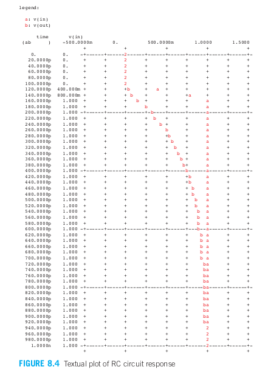

- [第8章 电路模拟](#第8章-电路模拟)
  - [8.1 引言](#81-引言)
  - [8.2 SPICE模拟器简介](#82-spice模拟器简介)
    - [8.2.1 有源和无源元件](#821-有源和无源元件)
    - [8.2.2 晶体管直流分析](#822-晶体管直流分析)
    - [8.2.3 反相器瞬态分析](#823-反相器瞬态分析)
    - [8.2.4 子电路及其度量](#824-子电路及其度量)
    - [8.2.5 优化](#825-优化)
    - [8.2.6 其他HSPICE命令](#826-其他hspice命令)
  - [8.3 器件模型](#83-器件模型)
    - [8.3.1 Level1模型](#831-level1模型)
    - [8.3.2 Level2和Level3模型](#832-level2和level3模型)
    - [8.3.3 BSMI模型](#833-bsmi模型)
    - [8.3.4 扩散电容模型](#834-扩散电容模型)
    - [8.3.5 设计角](#835-设计角)
  - [8.4 器件表征](#84-器件表征)
    - [8.4.1 I-V特性](#841-i-v特性)
    - [8.4.2 阈值电压](#842-阈值电压)
    - [8.4.3 栅电容](#843-栅电容)
    - [8.4.4 寄生电容](#844-寄生电容)
    - [8.4.5 等效电阻](#845-等效电阻)
    - [8.4.6 各种工艺水平的比较](#846-各种工艺水平的比较)
    - [8.4.7 工艺和环境敏感性](#847-工艺和环境敏感性)
  - [8.5 电路表征](#85-电路表征)
    - [8.5.1 路径模拟](#851-路径模拟)
    - [8.5.2 直流传输特性](#852-直流传输特性)
    - [8.5.3 逻辑努力](#853-逻辑努力)
    - [8.5.4 功率和能量](#854-功率和能量)
    - [8.5.5 模拟失配情况](#855-模拟失配情况)
    - [8.5.6 蒙特卡模拟](#856-蒙特卡模拟)
  - [8.6 互连线模拟](#86-互连线模拟)

# 第8章 电路模拟
## 8.1 引言
&emsp;&emsp;制造芯片既昂贵又耗时，因此设计师需要仿真工具来探索设计空间并在制造前验证设计。仿真器在多个抽象层次上运行，从工艺到架构。工艺仿真器（如SUPREME）预测工艺配方中时间和温度等因素如何影响设备的物理和电气特性。电路仿真器（如SPICE和Spectre）使用设备模型和电路网表预测电路电压和电流，以指示性能和功耗。逻辑仿真器（如VCS和ModelSim）广泛用于验证用硬件描述语言（HDL）指定的设计的逻辑操作是否正确。架构仿真器通常与处理器开发工具包一起提供，在指令和寄存器层面上工作，以预测吞吐量和内存访问模式，这会影响诸如流水线和缓存组织等设计决策。各种抽象层次在细节程度和可仿真系统的规模之间提供了权衡。VLSI设计师主要关注电路和逻辑仿真。本章重点讨论使用SPICE进行电路仿真。  
&emsp;&emsp;预测电路行为是使用纸笔分析（如前几章所做）更好，还是使用仿真？VLSI电路复杂，现代晶体管具有非线性和非理想行为，因此仿真是准确预测详细电路行为所必需的。即使存在闭式解用于延迟或传输特性，但将其手动应用于大量电路也过于耗时。另一方面，电路仿真易出错：“垃圾进，垃圾出”（GIGO）。仿真器接受设计师提供的现实模型，但很容易创建不准确或不完整的模型。此外，仿真器仅应用设计师提供的刺激，常常会忽视最坏情况的刺激。就像一位经验丰富的程序员在调试前不会期望程序正常运行一样，经验丰富的VLSI设计师也不会期望仿真的第一次运行就能反映现实。因此，电路设计师需要对电路操作有良好的直观理解，并能够在仿真前预测预期结果。只有当预期与仿真匹配时，结果才值得信赖。在实践中，电路设计师依赖手动分析和仿真，正如所言，“仿真通过分析获得的洞察力引导。”  
&emsp;&emsp;本章通过举例对SPICE做一个简短的辅导，然后讨论晶体管和扩散电容的模型，本章其余部分将专门介绍表征工艺和检查电路及互连线的性能、功耗及正确性的模拟技术。  

## 8.2 SPICE模拟器简介
&emsp;&emsp;SPICE（集成电路仿真程序）最初是在1970年代于伯克利开发的[Nagel75]。它解决描述晶体管、电阻器、电容器和电压源等组件的非线性微分方程。SPICE提供多种电路分析方法，但数字VLSI设计师主要关注直流（DC）和瞬态分析，这些分析预测在固定或任意变化的输入下的节点电压。SPICE最初是用FORTRAN开发的，并且在文件格式上有一些特性，反映了其历史。虽然大多数平台上都有免费的SPICE版本，但商业版本通常提供更强大的数值收敛性。尤其是HSPICE在行业中被广泛使用，因为它收敛良好，支持最新的设备和互连模型，并有大量增强功能用于电路测量和优化。PSPICE是另一个商业版本，提供有限的免费学生版。LTSpice是一个强大的免费版本。本节中的示例使用HSPICE，并通常无法在普通的SPICE中运行。  
&emsp;&emsp;虽然使用SPICE的细节因版本和平台而异，但所有SPICE版本都读取输入文件，并生成包含结果、警告和错误消息的列表文件。输入文件通常被称为SPICE卡片（deck），每行称为一张卡片，因为它曾作为一组穿孔卡片提供给大型机。输入文件包含一个包含组件和节点的网表，此外还有仿真选项、分析命令和设备模型。网表可以手动输入，也可以从CAD程序中的电路原理图或布局中提取。  
&emsp;&emsp;一个好的SPICE卡片就像一段好的软件代码，应该易读、易维护和可重用。注释和空白有助于提高可读性。通常，编写SPICE卡片的最佳方法是从一个几乎正确的卡片开始，然后进行修改。  
&emsp;&emsp;本节的其余部分提供了一系列示例，展示SPICE在数字VLSI电路中的关键语法和功能。有关更多细节，可以参考伯克利SPICE手册[Johnson91]、冗长的HSPICE手册或任何关于SPICE的教科书（如[Kielkowski95，Foty96]）。  

### 8.2.1 有源和无源元件
  
  
  

&emsp;&emsp;假设我们希望知道图8.1a中的RC电路中输入在50ps的时间内从0上升到1.0V时的响应。该电路的RC时间常数为100fF × 2 kΩ =200 ps，由于它比输入上升时间大得多，所以我们可以直观地认为输出将像一条指数曲线以200ps的时间常数逐渐逼近最终值1.0V。图8.2为模拟这一电路的SPICE输入文件而图8.1b为它的输入和输出响应。  
&emsp;&emsp;输入文件中以星号（*）开始的各行为注释行。SPICE输入文件的第一行必须是注释行，它通常指出这一模拟名称。一个较好的习惯是把SPICE输入文件看成像一个计算机程序并遵照类似的过程开始这个文件。特别是在文件的开头要给出作者、日起和模拟目的，这在将来需要重新访问这个输入文件时非常有益。  
&emsp;&emsp;控制语句以点号 (.) 开始。.option post 语句指示 HSPICE 将结果写入文件，以便与波形查看器一起使用。SPICE 卡片的最后一条语句必须是 .end。
&emsp;&emsp;网表中的每一行以一个字母开头，表示电路元件的类型。常见的元件列在表8.1中。在这个例子中，电路包含一个名为 Vin 的电压源、一个名为 R1 的电阻和一个名为 C1 的电容。电路中的节点命名为 in、out 和 gnd。gnd 是一个特殊的节点名称，定义为 0 V 参考点。单位由一或两个字母组成。第一个字符表示数量级，如表8.2所示。需要注意的是，兆 (mega) 表示为 x，而不是 m。第二个字母是为了便于阅读（如 F 表示法拉，s 表示秒），但 SPICE 会忽略它。例如，100 飞法的电容可以表示为 100fF、100f 或简单的 100e–15。注意，SPICE 对大小写不敏感，但保持一致的大小写习惯依然是个好做法，因为网表可能会被其他工具解析。  
&emsp;&emsp;电压源定义为一个逐段线性的电源，其波形可用随意数量的（时间、电压）对来说明。其他常用的电源包括直流电源和脉冲电源。一个名为Vdd的直流电压源设置节点Vdd为2.5V时可表示成：  
>&emsp;&emsp;Vdd&emsp;&emsp;vdd&emsp;&emsp;gnd&emsp;&emsp;2.5  
&emsp;&emsp;脉冲电源在表示像时钟这样的重复信号时非常方便。图8.3为脉冲电源的一般形式。例如，一个摆幅为0.1V、周期为800ps、上升和下降时间为100ps、占空比为50%（即保持高电平和保持低电平的时间相等）的时钟可表示成：  
>&emsp;&emsp;Vck&emsp;&emsp;clk&emsp;&emsp;gnd&emsp;&emsp;PULSE 0 1 0ps&emsp;&emsp;100ps&emsp;&emsp;300ps&emsp;&emsp;800ps  
&emsp;&emsp;本例SPICE程序中的激励部分表示模拟器应采用最大步长为20ps的瞬态分析，持续时间为1ns。在打印节点电压时，步长决定了打印点之间的间隔。  
&emsp;&emsp;plot命令为所指定的节点变量（在本例中为节点in和out的电压）生成相应的文本图，如图8.4所示。类似地，.print语句将模拟结果打印在一个含多列的表格中。这两条命令反映了原先FORTRAN语言和行输出打印机的特点。但对于现代具有用户图形界面的计算机来说，通常优先采用.option post命令。它生成包含所指定（瞬态）分析结果的文件（在本例中为rc.tro），然后可以用一个单独的图形波形查看器和操作这些波形。SPICE Explorer就是Synopsys公司的一个与HSPICE兼容的波形查看器。  

  

### 8.2.2 晶体管直流分析
  
  
&emsp;&emsp;熟悉新的CMOS工艺的第一步之一是查看晶体管的I-V特性。图8.5(a)显示了在VDD = 1.0 V下，65 nm工艺中一个单位nMOS晶体管（4/2 Q）的测试电路。I-V特性如图8.5(b)所示，使用图8.6中的SPICE卡片绘制。
&emsp;&emsp;.include 语句从磁盘读取另一个SPICE文件。在这个例子中，它加载了将在第8.3节进一步讨论的设备模型。电路使用了两个默认值为0 V的独立电压源；这些电压将通过 .dc 命令进行变化。nMOS晶体管使用MOSFET元件 M 定义，语法如下：
>Mname（M元件名字）drain（漏）gate（栅）source（源）body（体）model（模型）W=<宽度>L=<长度>  
&emsp;&emsp;需要注意的是，尽管这个工艺被称为65 nm工艺，但其Q值为25 nm，最小绘制的沟道长度为50 nm。  
&emsp;&emsp;.dc 命令将Vgs直流电压从0 V变化到1.0 V，步长为0.05 V。这一过程将多次重复，同时将Vgs从0 V到1.0 V以0.2 V为步长变化，计算在不同Vgs值下的多个Ids-Vds曲线。

### 8.2.3 反相器瞬态分析
  
  
&emsp;&emsp;图8.7为一个不带负载的单位反相器对阶跃输入的响应，图中标注了传播延时和20%～80%的上升和下降时间。可以看到在最初由于自举效应而出现了尖峰电压，这是因为反相器没有带负载的缘故。图8.8为这一模拟的SPICE输入文件。  
&emsp;&emsp;这一输入文件介绍了参数和比例因子（scale）的使用方法。.param语句定义名为SUPPLY的参数具有0.1的值，然后就可以用这个值设置Vdd和输入脉冲的幅值。如果希望得到在不同电源电压下的响应，我们就只需要修改.param这一条语句。.scale语句为所有的尺寸设置一个比例因子，这些尺寸在缺省的情况下都是以米为单位度量的。在本例中比例因子设置为λ=25nm，因此此时反相器中晶体管的宽度和长度都是以λ而不是以米来说明。这对于使用按比例缩放规则设计的芯片来说非常方便，但在使用以微米为基础的设计规则的商用工艺中通常都不采用这种方式。  
&emsp;&emsp;如前所述，寄生延时很大程度上取决于扩散电容，而扩散电容又取决于源极和漏极的面积和周长。由于反相器中的每个扩散区域必须接触，其几何结构类似于图2.8(a)所示。扩散宽度等于晶体管的宽度，扩散长度为5λ。因此，源极和漏极的面积为AS = AD = 5W λ²，周长为PS = PD = (2W + 10) λ。注意，行首的 "+" 号表示该行是上一行的延续。这些尺寸也会受到比例因子的影响。  

### 8.2.4 子电路及其度量
  
&emsp;&emsp;衡量一个工艺本身速度的最简单指标之一是“4倍扇出反相器延迟”（fanout-of-4 inverter delay）。图8.9(a)展示了用于测量该延迟的电路。nMOS和pMOS晶体管的尺寸（以单位4/2 λ晶体管的倍数）分别列于每个门的下方和上方。X3是待测的反相器，X4是其负载，大小是X3的四倍。根据一阶近似，这两个反相器就足够了。然而，X3的延迟还取决于输入斜率，如第4.4.6.1节所讨论的。获得真实输入斜率的一种方法是使用一对FO4反相器X1和X2来驱动节点c。此外，如第4.4.6.6节所述，X4的输入电容不仅取决于其Cgs，还取决于Cgd。当节点e切换时，Cgd通过Miller效应被放大。如果e瞬时切换，Cgd的有效值将翻倍。当e连接到X5作为负载时，它以较慢、更接近实际的速率切换，从而略微降低了X4在节点d呈现的有效电容。图8.9(b)中的波形标注了上升和下降的延迟。  
&emsp;&emsp;当将常见的电路元件作为子电路捕获时，SPICE卡片更易于阅读和维护。例如，图8.10中的SPICE卡片使用反相器子电路来计算FO4反相器的延迟。  
&emsp;&emsp;.global 语句定义vdd和gnd为可以从子电路中引用的全局节点。反相器被声明为具有两个端口的子电路：a和y。它还接受两个参数，分别指定nMOS和pMOS晶体管的宽度；这些参数的默认值分别为4和8。源极和漏极的面积和周长是晶体管宽度的函数。HSPICE可以计算用单引号括起来的函数，函数可以包含参数、常量、括号、加减乘除（+、−、*、/）以及幂运算符**。  
&emsp;&emsp;仿真网表包含电源、输入源和五个反相器。每个反相器是一个子电路（X）元件。由于未指定N和P参数，因此每个反相器都使用默认的尺寸。M参数将子电路中的所有电流按给定倍数放大，等效于M个元件并联。在这种情况下，扇出以参数H表示。因此，X2具有相当于4个单位反相器的电容和输出电流，而X3相当于16个单位反相器。另一种模拟反相器的方法是使用N和P参数：  
  
&emsp;&emsp;但4倍单位宽度的晶体管并不具备与四个单位反相器并联时完全相同的输入电容或输出电流，因此更倾向于使用M参数。在这个例子中，子电路声明和仿真网表是SPICE卡片的一部分。在使用标准单元库时，通常将子电路声明保存在自己的文件中，并使用.include语句引用它们。当从原理图或布局CAD系统提取仿真网表时，通常会将网表放在单独的文件中，并进行.include。  
&emsp;&emsp;.measure语句用于测量仿真结果并在列出文件中打印结果。该卡片测量上升传播延迟tpdr，计算输入c首次下降通过VDD/2和输出d首次上升通过VDD/2之间的时间差。TRIG和TARG表示延迟测量的触发和目标事件。.measure语句也可以用于计算其他测量的函数。例如，FO4反相器的平均传播延迟tpd是tpdr和tpdf的均值，值为17 ps。20–80%的上升时间tr为20 ps，下降时间tf为17 ps。 

### 8.2.5 优化
  
&emsp;&emsp;在许多示例中，我们假设P/N晶体管的宽度比为2:1可以实现大致相等的上升和下降延时。然而，FO4反相器仿真显示，2:1的比例导致上升延时比下降延时慢，因为pMOS的迁移率不到nMOS的一半。你可以通过多次运行仿真，使用不同的P值来找到使延时相等的比例。HSPICE具有内置的优化功能，可以自动调整参数以实现某个目标，并报告最佳参数值。图8.11展示了使用优化器的FO4反相器仿真修改版本。  
&emsp;&emsp;子电路X1～X5覆盖默认的pMOS宽度，使用P1的宽度。在优化设置中，测量tpdr和tpdf的差值，优化的目标是将这个差值驱动到0。为此，P1的值可以在4到16之间变化，初始值为8。优化器最多可以使用30次迭代来找到P1的最佳值。由于nMOS的宽度固定为4，最佳的P/N比例被计算为P1/4。瞬态分析包括一个SWEEP语句，该语句包含要变化的参数、期望的结果和迭代次数。  
HSPICE确定了使上升和下降延时相等的P/N比例为2.87:1，上升和下降延时均为17.9 ps。这个延时比2:1比例提供的更慢，并且需要更大的、功耗更高的pMOS晶体管，因此这种高比例很少使用。  
&emsp;&emsp;类似的情况是寻找能提供最低平均延迟的P/N比例。通过将.tran语句更改为使用RESULTS=tpd，我们发现最佳比例为1.79:1，上升、下降和平均传播延迟分别为18.8ps、15.2ps和17.0 ps。进行优化时，不仅要考虑最优点，还要考虑偏离该点的敏感性。进一步的仿真发现，P/N比例在1.5:1到2.2:1之间时，平均传播延迟均能优于17.2 ps。因此，没有必要严格遵循1.79:1的“最优值”。实际中最佳的P/N比例是一个折中，既要使用较小的pMOS器件以节省面积和功耗，又要使用较大的器件来实现更接近相等的上升/下降时间，并避免由于pMOS晶体管太弱而导致的非常慢的上升边缘引发的热电子可靠性问题。  
### 8.2.6 其他HSPICE命令
&emsp;&emsp;整个HSPICE手册总共超过4000多页，它包括许多我们在这里无法一一描述的功能。本节介绍另外几个最有用的命令。8.3节将介绍晶体管模型和单元库调用，而8.6节将讨论采用有损传输线模拟互连线。  
&emsp;&emsp;.option accurate  
&emsp;&emsp;减少积分容差可以得到更精确的结果，这在模拟振荡器和高增益模拟电路时或当结果看似有疑问时非常有用。  
&emsp;&emsp;.option autostop  
&emsp;&emsp;当得到.measure语句所要求的所有结果时结束模拟而不再按.tran语句所要求的全部时间继续模拟辖区，这可以大大减少模拟时间。  
&emsp;&emsp;.temp 0 70 125  
&emsp;&emsp;分别在温度0℃、70℃和125℃时重新模拟同一电路，总共模拟三次。器件模型可以包含有关温度改变时器件性能如何改变信息。  
&emsp;&emsp;.op  
&emsp;&emsp;输出在直流工作点处的电压、电流及晶体管偏置信息。  

## 8.3 器件模型
&emsp;&emsp;第8.2节中的大多数示例都包含了一个包含晶体管模型的文件。SPICE提供了多种MOS晶体管模型，这些模型在复杂性和准确性之间有不同的权衡。Level 1和Level 3模型在历史上曾经重要，但它们不再足够准确地模拟现代非常小的晶体管。BSIM模型更为准确，目前是最广泛使用的模型。一些公司使用自己的专有模型。本节简要描述了这些模型的主要特性，并说明了如何建模扩散电容以及如何在不同工艺角下运行仿真。模型描述仅作为模型能力和局限性的概述；如需更详细的描述，请参阅SPICE手册。

### 8.3.1 Level1模型
&emsp;&emsp;SPICE Level1模型，与式2.10所描述的肖克利模型非常接近，但增加了沟道长度调制和体效应的影响。它基本的电流模型为：  
  
SPICE模型中的参数全部采用大写字母。注意式8.1中β写成另一种形式KP（Weff/Leff）而KP是代表是2.7中k'的模型参数。与式2.48中的描述相同，Weff和Leff是等效的沟道宽度和长度。LAMBDA这一项（LAMBDA=1/VA）模拟了沟道长度调制效应。  
&emsp;&emsp;阈值电压是通过体效应由源-体电压Vsb调制，对于非负的Vsb，阈值电压为：  
  
&emsp;&emsp;Level1模型对于教学很有用，因为它们易于与手工分析关联，但对于现代设计来说过于简化。图8.12展示了一个一级模型的示例，说明了其语法。该模型还包括计算扩散电容的相关项。  

### 8.3.2 Level2和Level3模型
&emsp;&emsp;SPICE Level和Level3模型增加了速度饱和、迁移率退化、亚阈值导电以及漏致势垒降低等效应。Level2模型基于 Grove-Frohman 方程 [Frohman69]，而Level3模型基于经验方程，提供了类似的准确性、更快的仿真速度和更好的收敛性。然而，这些模型仍然无法很好地拟合现代晶体管的测量 I-V 特性。

### 8.3.3 BSMI模型
&emsp;&emsp;伯克利短沟道绝缘栅场效应管模型，BSIM。是一个非常精细的模型，现广泛用于电路模拟。该模型的推导基于基本的器件物理学但采用了大量的参数来拟合现在晶体管的行为。BSIM的版本1、2、3v3及4分别由SPICE Level 13、39、49和54实现。  
&emsp;&emsp;BSIM版本3和4需要整本书来描述模型。它们包括100多个参数，而器件公式就占了27页。BSIM在模拟数字电路时非常出色，该模型有以下几个特点：  

>在亚阈值导电区、线性区和饱和区的交界处I-V特性连续并且可导，因而收敛性好。  
>考虑了器件参数如Vt等对晶体管长度和宽度的敏感性。  
>精细的阈值电压模型，包括体效应和漏至势垒降低。  
>考虑了速度饱和、迁移率退化及其他短沟效应。  
>多种栅电容模型。  
>包括了扩散电容和电阻模型。  
>包括了泄漏电流模型。  

### 8.3.4 扩散电容模型
&emsp;&emsp;漏极或源极扩散区与体之间的p-n结形成了一个二极管。我们已经看到扩散电容决定了一个门的寄生延时，而扩散电容的大小取决于扩散区的面积和周长。HSPICE提供了许多种方法用来说明这一几何结构，这是由ACM（面积计算方法）参数控制的，它也是晶体管模型的一部分。这一模型还必须提供结电容和侧壁扩散电容的数值。

### 8.3.5 设计角
&emsp;&emsp;为了在器件特性和环境条件出现各种扰动的情况下验证电路的工作，工程师们常常在多个设计角处对电路进行模拟。HSPICE 包括了一条.lib语句，可用来很容易地转换不同的设计库。

## 8.4 器件表征
&emsp;&emsp;现代SPICE模型具有非常多的参数，因此设计者不能很容易地从模型文件中读取关键的性能特征。一个比较方便的方法是通过运行一组模拟来提取等效电阻和电容、扇出为4的反相器延时、I-V特性及其他所关心的数据。

### 8.4.1 I-V特性
  
  
&emsp;&emsp;当你希望熟悉一种新工艺时，起始点就是先画出电流-电压特性曲线图。虽然数字设计者很少直接利用这些图进行计算，但从中了解nMOS管和pMOS管的导通电流、该工艺速度饱和的严重程度、低于阈值电压时的电流滚降情况，以及器件如何受DIBL和体效应的影响等是非常有益的。正如8.2.2节中已经讨论的那样，这些特性曲线通过DC扫描生成。在温度为70°C、VDD=1.0V的典型65nm工艺中，每个晶体管的宽度为1um。图8.16显示了nMOS的特性和图8.17显示了pMOS的特性。  
&emsp;&emsp;图8.16(a)绘制了不同 Vgs 值下的 Ids 与 Vds 的关系，类似于图8.5中的做法。理想情况下，饱和电流应随着 Vgs - Vt 的增大而平方增加，但在该图中，它显示出更接近线性的依赖，表明 nMOS 晶体管严重速度饱和（在 F-power 模型中 F 值更接近 1 而非 2）。饱和电流随着 Vds 显著增加是由于通道长度调制的影响。图8.16(b)展示了一个绘制的通道长度为最小值两倍的器件的类似图。由于经历的速度饱和较少，电流下降不到一半。饱和状态下的电流略显平坦，因为在较长的通道长度下，通道长度调制的影响较小。  
&emsp;&emsp;图8.16(c)在半对数坐标系中绘制了 Vds 为 0.1 V 和 1.0 V 时的 Ids 与 Vgs 的关系。低 Vgs 下的直线表明电流在阈值以下呈指数下降。不同的漏电流反映了漏致势垒降低（DIBL）的影响，在高 Vds 下有效减少了 Vt。饱和电流 Idsat 在 Vgs = Vds = VDD 时测量，而关断电流 Ioff 在 Vgs = 0 和 Vds = VDD 时测量。亚阈值斜率为 105 mV/十倍，而 DIBL 在 Vds 范围内有效减少了约 110 mV 的阈值电压。开启电流与关断电流的比率为 4–5 个数量级。  
&emsp;&emsp;图8.16(d)在 Vbs = –0.2、0 和 0.2 V 的线性坐标系上绘制了类似的图。Vds 固定在 0.1 V。曲线水平移动，表明体效应使阈值电压随着 Vbs 变得更加负而增加了 125 mV/V。  
&emsp;&emsp;比较图8.17中的 pMOS 特性。pMOS 晶体管的饱和电流低于 nMOS（注意不同的垂直刻度），但该器件并没有像 nMOS 那样严重速度饱和。  
&emsp;&emsp;同时比较图8.18中的 180 nm nMOS 特性。较旧技术下的饱和电流较低，导致性能较差。然而，器件特性更接近理想状态。通道长度调制效应不如 nMOS 明显，尽管速度饱和仍然严重。亚阈值斜率为 90 nV/十倍，DIBL 减少了 40 mV 的有效阈值电压。开启电流与关断电流的比率为 6–7 个数量级。  
### 8.4.2 阈值电压
&emsp;&emsp;在肖克利模型中，阈值电压Vt定义为Ids变为0时的Vgs值，但图8.16c所示的实际晶体管特性中，当Vgs < Vt时仍有亚阈值电流流过，因而测量或甚至定义阈值电压都会变得很成问题。同时阈值电压还随L、W、Vds和Vbs而变化。  
  
  

### 8.4.3 栅电容

### 8.4.4 寄生电容

### 8.4.5 等效电阻

### 8.4.6 各种工艺水平的比较

### 8.4.7 工艺和环境敏感性

## 8.5 电路表征
&emsp;&emsp;前节的器件表征技术对于熟悉新工艺的工程师来说一般只进行一次，而整个电路的表征常用SPICE来完成。本节将给出有关对电路路径进行模拟的一些指导，并描述如何得到逻辑门的直流传输特性、逻辑努力及功耗。

### 8.5.1 路径模拟
&emsp;&emsp;如今，大多数静态CMOS电路路径的延迟都是通过静态时序分析器计算的（参见第4.6节和14.4.1.4节）。只要噪声源（尤其是耦合噪声和电源噪声）得到控制，电路将正常工作，并与静态时序预测有合理的相关性。然而，对于一些敏感电路，例如时钟生成和分配网络、自定义存储阵列以及新型电路技术，SPICE级的仿真仍然十分重要。  
&emsp;&emsp;大多数有经验的设计人员会先基于简单模型进行设计，以便了解哪些方面最重要，评估设计折中，并对结果进行定性预测。理想的Shockley晶体管模型、RC延迟模型以及逻辑努力模型在这方面非常有帮助，因为它们足够简单，能提供洞察力。当一个较好的初步设计完成时，设计师会对电路进行仿真，以验证其是否正常工作并满足延迟和功耗要求。正如很少有新的软件程序在调试前能正确运行一样，仿真往往在最初会出错。如果设计师不知道应该期待什么结果，容易被那些打印出来、看似精确的错误结果误导。一旦电路看起来是正确的，就应该在各种设计角点下进行检查，以确保其在所有情况下都能正常运行。第7.2.4节给出了对各种角点敏感的电路示例。  
&emsp;&emsp;仿真成本低廉，但硅片修订代价高昂。因此，构建一个能捕捉所有相关条件的电路模型至关重要，其中包括真实的输入波形、适当的输出负载以及足够的互连模型。当匹配很重要时，必须考虑角点文件中未给出的失配效应（参见第8.5.5节）。然而，随着SPICE仿真电路越来越复杂，运行速度变慢，错误累积更多，调试也变得更加困难。一个好的折衷方案是从简单开始，逐步增加复杂性，并在每一步后确保结果仍然合理。  

### 8.5.2 直流传输特性
  
  
&emsp;&emsp;.dc语句在获得逻辑门的传输特性及噪声容限方面非常有用。图8.29显示了一个表征静态和动态反相器的例子。图8.28a和b为每个门的电路图，图8.28c显示了模拟结果。静态反相器的特性曲线几乎以VDD/2处为中心对称。动态反相器具有较低的翻转阈值并且在这个阈值之外它的输出将急剧下降，这是由于正反馈作用使保持器关断的原因。  
&emsp;&emsp;注意，当输入a为0而动态反相器处于求值阶段时输出会稳定在0或1.为了获取传输特性，需要利用.ic命令使该门的输出初始化为1.

### 8.5.3 逻辑努力
  
&emsp;&emsp;为了测量一个门每个输入的逻辑努力和寄生延时，可以用一条直线拟合模拟得到的延时与扇出关系。与在FO4反相器的例子中一样，我们应当用一个合适的输入波形驱动这个门并为它提供两级负载.图8.30a显示了一个用来表征两输入与非门X3延时的电路例子，它利用M参数同时模拟多个门。图8.30b画出了65nm工艺下一个反相器和这个两输入与非门的延时与扇出关系。虽然晶体管存在所有各种非线性和非理想的效应，但这些数据能用一条只线拟合的很好。这表明只要输入和输出斜率比较一致，那么线性延时模拟就相当精确。  
&emsp;&emsp;利用SWEEP命令可以很方便的改变扇出并使瞬态模拟重复进行多次。例如以下语句可以使H以1为步长从1变化至8,总共进行8次模拟：  
>&emsp;&emsp;.tran 1ps 1000ps SWEEP H 1 8 1  
&emsp;&emsp;为表征整个库，你可以用像Perl或Python这样的语言写一个脚本，它能生成合适的SPICE输入文件，然后调用模拟器并对列表文件进行后处理以提取数据和完成曲线拟合。  
&emsp;&emsp;表8.7比较了IBM 65 nm工艺中多输入NAND门不同输入的逻辑努力和寄生延迟，涵盖了上升、下降和平均输出过渡。对于上升和下降过渡，我们仍然以从反相器的平均延迟中获得的Y值进行归一化。输入A是最外层的输入（最靠近电源或接地）。如第9.2.1.3节所讨论，最外层输入具有较高的寄生延迟，但逻辑努力稍低。在该工艺中，上升和下降延迟差异显著，因为pMOS晶体管的迁移率不到nMOS晶体管的一半，且nMOS晶体管处于较严重的速度饱和状态，因此串联晶体管的电阻低于预期。

### 8.5.4 功率和能量
&emsp;&emsp;回顾第5.1节，能量和功率与供电电流成正比。它们可以根据从电源电压源输出的电流进行测量。例如，以下代码使用INTEGRAL命令测量电路在前10纳秒内传输的电荷和能量：  
>&emsp;&emsp;.measure charge INTEGRAL I(vdd) FROM=0ns TO=10ns  
>&emsp;&emsp;.measure energy param='charge*SUPPLY'  
&emsp;&emsp;另外，HSPICE允许您直接测量电压源提供的瞬时功率和平均功率：  
>&emsp;&emsp;.print P(vdd)  
>&emsp;&emsp;.measure pwr AVG P(vdd) FROM=0ns TO=10ns  
&emsp;&emsp;有时，在更大电路中只测量单个门的功率是有帮助的。在这种情况下，您可以为该门使用单独的电压源，仅从该源测量功率。不幸的是，这意味着vdd不能声明为.global。  
&emsp;&emsp;当门的输入发生切换时，它通过栅极到源极的电容向供电提供功率。请注意区分这种输入功率与门为放电其内部和负载电容所消耗的功率。

### 8.5.5 模拟失配情况
&emsp;&emsp;许多电路对名义上相同的晶体管之间的失配非常敏感。例如，敏感放大器应对输入之间的小差分电压作出反应。名义上相同的晶体管之间的失配会增加偏移，显著提高所需电压。仅在不同设计角中进行仿真是不够的，因为晶体管仍会彼此匹配。如第7.5.2节所述，两个名义上相同的晶体管之间电流的失配主要归因于阈值电压和沟道长度的偏移。图8.31展示了模拟这种失配的一个例子。每个晶体管都被等效电路替代，具有不同的沟道长度和一个电压源以模拟阈值电压的差异。值得注意的是，许多分级BSIM模型不允许将晶体管长度设置得短于工艺支持的最小值。获得参数变化的数据以前很困难，但在纳米级工艺中，现在已成为供应商模型指南的一部分。  
&emsp;&emsp;在许多情况下，晶体管并不相邻，可能会经历显著的电压和温度差异。例如，芯片不同角落的两个时钟缓冲器在不同环境下工作，会导致两个时钟之间的时差。电压差可以用两个不同的电压源进行建模，而温度差则最容易通过在不同温度下进行两个独立仿真来处理。  
### 8.5.6 蒙特卡模拟
&emsp;&emsp;蒙特卡罗仿真可用于研究随机变化对电路的影响。它通过反复运行仿真，使用不同随机选择的参数偏移。要使用蒙特卡罗仿真，参数的统计分布必须是模型的一部分。制造商通常为纳米级工艺提供这样的模型。  
&emsp;&emsp;例如，可以考虑修改图8.10中的FO4反相器延迟仿真，以获得统计延迟分布。瞬态命令必须更改为：  
>&emsp;&emsp;.tran 1ps 1000ps SWEEP MONTE=30  
&emsp;&emsp;.measure语句报告从30次重复仿真中计算得出的平均值、最小值、最大值和标准偏差。均值为17.1 ps，标准偏差为X = 0.56 ps。  
&emsp;&emsp;好的模型将包括用户可以设置的参数，以控制是否考虑芯片间变化、芯片内变化或两者都考虑。它们还可能接受从布局中提取的信息，如晶体管方向和井边缘接近度。  

## 8.6 互连线模拟
  
  
  
&emsp;&emsp;振荡现象可以被视为二阶RLC电路的响应，也可以视为传输线反射。之所以可见，是因为导线远离其回路（因此具有高电感），并且足够宽厚以具有低电阻（会阻尼振荡），且被驱动的边沿速度远快于导线的传播时间。如果通过将接地线移近导体来降低电感，振荡现象将会减弱。
