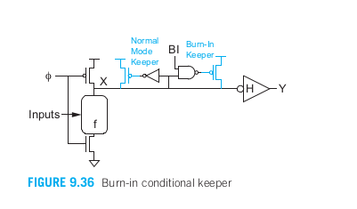
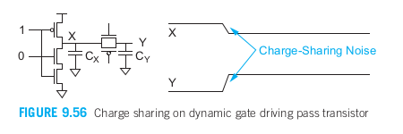

- [第9章 组合电路设计](#第9章-组合电路设计)
  - [9.1 引言](#91-引言)
  - [9.2 电路系列](#92-电路系列)
    - [9.2.1 静态CMOS](#921-静态cmos)
      - [9.2.1.1 推气泡](#9211-推气泡)
      - [9.2.1.2 复合门](#9212-复合门)
      - [9.2.1.3 输入顺序对延时的影响](#9213-输入顺序对延时的影响)
      - [9.2.1.4 不对称门](#9214-不对称门)
      - [9.2.1.5 偏斜门](#9215-偏斜门)
      - [9.2.1.6 P/N比](#9216-pn比)
      - [9.2.1.7 多阈值电压](#9217-多阈值电压)
    - [9.2.2 有比电路](#922-有比电路)
      - [9.2.2.1 伪nMOS](#9221-伪nmos)
      - [9.2.2.2 共输出CMOS](#9222-共输出cmos)
    - [9.2.3 串联电压开关逻辑](#923-串联电压开关逻辑)
    - [9.2.4 动态电路](#924-动态电路)
      - [9.2.4.1 多米诺逻辑](#9241-多米诺逻辑)
      - [9.2.4.2 双轨多米诺逻辑](#9242-双轨多米诺逻辑)
      - [9.2.4.3 保持器](#9243-保持器)
      - [9.2.4.4 辅助预充电器件](#9244-辅助预充电器件)
    - [9.2.5 传输管电路](#925-传输管电路)
      - [9.2.5.1 含传输门的CMOS电路](#9251-含传输门的cmos电路)
      - [9.2.5.2 互补传输管逻辑（CPL）](#9252-互补传输管逻辑cpl)
  - [9.3 电路隐患](#93-电路隐患)
    - [9.3.1 阈值损失](#931-阈值损失)
    - [9.3.2 比值失效](#932-比值失效)
    - [9.3.3 泄漏电流](#933-泄漏电流)
    - [9.3.4 电荷分享](#934-电荷分享)
    - [9.3.5 电源噪声](#935-电源噪声)
    - [9.3.6 热斑](#936-热斑)
    - [9.3.7 少数载流子注入](#937-少数载流子注入)
    - [9.3.8 背栅耦合](#938-背栅耦合)
    - [9.3.9 扩散区输入的噪声敏感性](#939-扩散区输入的噪声敏感性)
    - [9.3.10 工艺敏感性](#9310-工艺敏感性)
    - [9.3.11 举例：多米诺的噪声预算](#9311-举例多米诺的噪声预算)

# 第9章 组合电路设计
## 9.1 引言
&emsp;&emsp;数字逻辑可以分为组合电路和时序电路。组合电路的输出仅取决于当前的输入，而时序电路的输出具有存储单元。第1章曾介绍过CMOS逻辑，并曾假设MOS晶体管的行为如一个简单的开关，其中静态CMOS门利用互补的nMOS和pMOS网络分别将输出驱动至0和1.而第4章中我们曾利用RC延时模型和逻辑努力来理解静态CMOS逻辑中的延时来源。  
&emsp;&emsp;本章中，将研究用来优化组合电路使它具有低延时和/或低能耗的技术。绝大多数电路都采用静态CMOS，因为它鲁棒性好、速度快、能量效率高并易于设计。但某些电路由于对速度、功耗或电路密度有特别严格的限制而不得不采用其他实现方式。这些其他可选用的CMOS逻辑形式常称为电路系列。9.2节介绍最常用的可选电路系列：有比电路、动态电路及传输管电路。  
&emsp;&emsp;在4.3.7节中曾谈到一个逻辑门的延时取决于它的输出电流I，负载电容C，以及输出摆幅ΔV：  
  
快速的电路系统都试图减小这三项中的一项。对于同样的尺寸和电容，由于nMOS管能比pMOS管提供更大的电流，因此往往优先考虑采用nMOS网络。注意，逻辑努力正比于C/I项,因为它是由能传输规定输出电流的一个门的输入电容决定的。  
&emsp;&emsp;静态CMOS电路的一个缺点是它的每个输入端上同时要求由nMOS管和pMOS管。在输出下降跳变期间，pMOS管不但无助于下拉电流反而增添了相当大的电容，因此静态CMOS具有较大的逻辑努力。许多快速电路系列都力图在输入端只驱动nMOS管，从而减小电容和逻辑努力。但此时需要另一种机理将输出上拉至高电平。而决定何时将输出拉高涉及包括检测输入、输出或某些时钟信号的功能。检测输入和输出不可避免地会增加节点的负载，因此时钟控制的电路如果能在理想时间提供时钟信号就往往能使它的速度最快。静态cmos的另一个缺点是所有节点电压必须在0至VDD之间翻转。为此某些电路系列采用减小电压摆幅的方法来改善传播延时（及功耗）。在评价这一优点的同时要注意此后必须将输出放大回全摆幅所带来的延时和功耗，以及必须容忍摆幅减小所产生的代价。  
&emsp;&emsp;静态CMOS逻辑因它的鲁棒性好而尤其受到欢迎。只要逻辑设计和制造过错不出错，那么对于给定的正确输入，它最终总能产生正确的输出。其他电路系列易受许多机理的影响，这些机理将在9.3节中讨论，其中包括电荷分享、泄漏漏电、阈值损失及比值约束。当采用其他电路系列时，必须充分理解这些失效机理并应检查这些电路是否能在所有的设计角处正确工作。  
&emsp;&emsp;绝缘体上硅（SOI）的芯片消除了导电衬底。它们可以达到较小的寄生电容和较大的亚阈值斜率，这使它们具有较低的功耗和/或较快的速度，但它们也有自己特有的特点。9.5节将专门分析有关SOI电路的设计考虑。  
&emsp;&emsp;CMOS正在不断地应用到超低功耗的系统中，如采用微小电池就能工作数年的可植入医疗器件，以及能从周围环境中提取它们所需能量的远程传感器。工作在亚阈值区域的静态CMOS门能使每操作的能力减少一个数量级，但其代价使将损失几个数量及的性能。9.6节将研究有关亚阈值电路的设计问题。  

## 9.2 电路系列
&emsp;&emsp;CMOS静态电路，采用互补的nMOS下拉网络和pMOS上拉网络，被广泛用于集成电路中的大多数逻辑门。它们具有良好的噪声容限、速度快、功耗低、不易受器件变化影响、设计简便、被计算机辅助设计（CAD）工具广泛支持，并且在标准单元库中容易获取。当噪声超过容限时，门的延迟会增加，因为出现了毛刺现象，但门最终仍会稳定到正确的结果。如今，大多数设计团队在组合逻辑中几乎专门使用静态CMOS电路。本节首先介绍了一些优化静态CMOS电路的技术。  
&emsp;&emsp;然而，在某些情况下，性能或面积约束可能需要采用其他电路系列。最重要的替代方案是动态电路。不过，我们首先讨论的是比率化电路，它们更简单，并且在概念上提供了从静态到动态的有益过渡。我们还将讨论通过晶体管，这种技术在1990年代用于通用逻辑的顶峰时期非常流行，至今仍在一些特殊应用中出现。  

### 9.2.1 静态CMOS
&emsp;&emsp;习惯于使用“与“和“或“逻辑功能的设计人员必须学会从“与非”和“或非”的角度进行思考，才能充分利用静态CMOS电路。在手动电路设计中，这通常通过“推气泡”（bubble pushing）来实现。复合门对于执行复杂功能特别有用，且逻辑代价相对较低。当某一特定输入被认为是最新的输入时，可以优化门电路以优先考虑该输入。同样，当已知上升沿或下降沿更为关键时，可以优化门电路以优先考虑这一边沿。尽管我们专注于构建上升和下降延时相等的门电路，但使用更小的pMOS晶体管可以减少功耗、面积和延迟。在具有多阈值电压的工艺中，可以构建具有不同速度/泄漏功耗权衡的多种门电路。  

#### 9.2.1.1 推气泡
&emsp;&emsp;CMOS门在本质上是反相位的，因此与和或的功能必须通过非门和或非门来实现。德摩根定理可以帮助实现这一变换：  
  

  
这些关系图表示在图9.1中。一个与非门等效于反相位输入的或，一个或非门等效于反相位输入的与。同样的关系也适于具有多个输入的门。这些表示方式之间的互换很容易在书写板上完成，这种方法常称为推气泡。  

#### 9.2.1.2 复合门
  

&emsp;&emsp;在1.4.5节曾介绍过，静态CMOS也能非常有效地运用单级复合门计算与/或功能的各种反相位组合。一般来说，复合门不同输入端的逻辑努力可能不同。图9.4显示了如何估算AOI21、AOI22及更复杂的AOI复合门的逻辑努力。这些复合门的晶体管宽度都选择成使它们具有与一个单位反相器相同的驱动能力。每个输入端的逻辑努力是那个输入端的输入电容与反相器输入电容的比。对于AOI21门来说，这意味着它的OR终端（C）的逻辑努力比它的两个AND终端（A、B）的逻辑努力略小。寄生延时是通过计算在输出节点上的总扩散电容而粗略估算出来的，即通过把连接到输出端的晶体管的尺寸相加来进行估算。  

#### 9.2.1.3 输入顺序对延时的影响
&emsp;&emsp;逻辑门不同输入端的逻辑努力和寄生延时常常各不相同。某些逻辑门，如前一节中的AOI21门，在本质上是不对称的，即它的一个输入端上的电容比另一个输入端上的电容小。另外一些门如与非门和或非门，他们在名义上是对称的，但实际上其不同输入端的逻辑努力和寄生延时仍稍有不同。  
&emsp;&emsp;一般来说，我们定义外层输入为靠近电源轨线的输入而内层输入为靠近输出端的输入。当内层输入最后翻转时寄生延时最小，因为中间节点早已放电。因此，如果已知一个信号比其他信号迟到达，那么当这个信号连接到内层输入端时逻辑门的速度最快。  

#### 9.2.1.4 不对称门
&emsp;&emsp;当一个输入远不如另一个输入关键时，即使在名义上对称的门也可以使它不对称而有利于改善迟到输入信号的性能，其代价是牺牲早到输入信号的性能。在一个串联网络中，这需要把早到的输入信号连接到外层晶体管上并使该晶体管较宽，这样当关键输入信号到达时，它就能提供较小的串联电阻。但在并联网络中，早到的输入信号应连接到较窄的晶体管上以减少寄生电容。  
&emsp;&emsp;例如，考虑图9.7a所示的路径。在通常情况下该路径的作用是作为在A和Y之间的缓冲器。当复位信号（reset）有效时，该路径驱使输出为低电平。如果复位只发生在非常例外的情况下并且可以进行得很慢，那么该电路就应当优化以牺牲复位性能为代价来改善输入至输出的延时，这可以采用图9.7b所示的不对称与非门来实现。由于下拉电阻为R/4 + R/（4/3） = R,所以该门仍能提供与单位反相器相同的驱动能力。但此时输入端A上的电容只有10/3,所以逻辑努力为10/9.这个值比通常与非门所具有的值4/3要好。在复位晶体管无限大和输入A处为单位尺寸nMOS管的极限情况下，逻辑努力趋近1.这恰似一个反相器。改善输入A的逻辑努力的代价是复位输入端的逻辑努力将变得很大。注意，在复位输入端上pMOS晶体管的尺寸也减小了。这将减小它的扩散电容和寄生延时，其代价是使复位响应变慢。  
  

&emsp;&emsp;CMOS晶体管通常都出现速度饱和现象，因此串联晶体管中的电流比长沟道模型所预测的电流大。这一电流可以通过将串联堆叠简化成一个等效的晶体管来预测，如在4.4.6.3节中讨论的那样。对于不对称门，等效宽度就是内层（较窄）晶体管的宽度，而等效长度正比于串联晶体管相对宽度的倒数之和。

#### 9.2.1.5 偏斜门

&emsp;&emsp;在其他一些情形中，某一个输入跳变可能比另一个更重要。在2.5.2节中曾定义过优化上升输出跳变的高偏斜门，这些优化可通过减小非关键晶体管的尺寸来实现。上升（上拉）和下降（下拉）跳变的逻辑努力分别为gu和gd，并且它们就是偏斜门的输入电容与一个对相应跳变具有相同驱动能力的不偏斜反相器的输入电容之比。图9.9a显示了通过减小nMOS管的尺寸来构造一个高偏斜反相器。它对关键跳变来说仍将保持相同的等效电阻，但相对于图9.9b的不偏斜反相器来说它的输入电容减少了，因而使那个关键跳变的逻辑努力减小到gu = 2.5/3 = 5/6 。自然，这一优化是以非关键跳变的逻辑努力为代价的。在估算下降跳变的逻辑努力时，将该反相器与具有相同下拉电流的较小的不偏斜反相器进行比较，如图9.9c所示，于是就得到了下拉努力为gd = 2.5/1.5 = 5/3.偏斜的程度（如快速跳变时的等效电阻相对于慢速跳变时的等效电阻的比）将影响逻辑努力和噪声容限，这一比值通常为2。图9.10分类列出了偏斜因子均为2的高偏斜门和低偏斜门。在原理图中我们常常在偏斜门的符号上标记一个H或L。  
  
&emsp;&emsp;当一个跳变很重要时，可以采用另一类高偏斜和低偏斜门。正如我们将在9.2.4节中看到的那样，偏斜门应用在动态电路中有明显的优点。  

#### 9.2.1.6 P/N比
&emsp;&emsp;从图9.10中我们注意到低偏斜两输入或非门的平均逻辑努力实际上比不偏斜的逻辑努力要好。在不偏斜门中的pMOS管尺寸很大，目的是为了使上升延时与下降延时相同。它们虽然只为改善上升延时，却同时对两个方向的跳变都增加了输入电容。如果我们可以接受较慢的上升延时，那么就可以减小pMOS管的尺寸，这样就能显著减小输入电容和平均延时。  
&emsp;&emsp;使反相器pMOS管的尺寸从2减小到√2 约等于1.4 将达到理论上最短的平均延时，但这一延时也只是改善了3%，然而这将显著减少pMOS管的面积。它也减少了输入电容，因而也减少了功耗。不足的是它使上升和下降输出的延时不再相等。如果某些路径触发的是每个门最慢的边沿，那么它就可能比平均延时更慢。上升输出太慢还可能引起热电子退化。另外减小pMOS管的尺寸也会使反相器的翻转电移向低（电平）端，从而减少了它的噪声容限。  
&emsp;&emsp;总之，一个单元库的P/N比应当根据米阿尼、功耗和可靠性而不是根据平均延时来选择。对于或非门，减小pMOS管的尺寸可以同时显著改善延时和面积。在大多数标准单元库中，单元间的节距决定了在任何具体门中所能实现的P/N比，其中反相器常用的比值为1.5～2 。  

#### 9.2.1.7 多阈值电压
&emsp;&emsp;某些CMOS工艺能提供两种或更多的阈值电压。具有较低阈值电压的晶体管能提供较大的导通电流，但在关断时也具有按指数关系增长的较大的泄漏电流。这些单元库能同时提供高阈值和低阈值类型的逻辑门。低阈值门可以适度用来减少关键路径的延时。偏斜门只在关键的晶体管网络上才采用低阈值器件。  

### 9.2.2 有比电路
**有比电路：** 由一个nMOS的下拉网络及称为静态负载的某种上拉器件构成。当下拉网络截止时，静态负载将输出上拉至1；当下拉网络变为导通时，它将与静态负载竞争。因而静态负载应当足够弱，使输出能被下拉至一个可接受的0电平。  
**有比电路的正确工作** 取决于器件是否选择了合适的尺寸或电阻。  
&emsp;&emsp;在静态负载和下拉网络之间有一个比值约束。较强的静态负载将使上升输出较快，但却增大了VOL，减少了噪声容限，并在输出应当为0时产生较大的静态功耗。不同于互补CMOS电路，有比电路的这一比值必须正确选择，这样即使在制造期间可能发生任何偏离元件额定值的情况它仍能正确工作。由于随逻辑门数目的不断增加，静态功耗已经变得大得不可接受，因此CMOS逻辑最终代替了nMOS逻辑，但有比电路有时在一些特殊应用中仍然非常有用。  
&emsp;&emsp;电阻是一种简单的静态负载，但在典型的MOS工艺中，大的电阻将占据很大的版图面积。另一种方法是采用一个栅极连至VGG的nMOS管，但如果VGG = VDD，那么这个nMOS管将只能上拉至VDD-Vt。更糟糕的是，阈值电压会因体效应而加大。因此采用VGG > VDD的方法曾经很有吸引力。为了取消这一额外的电源电压，一些nMOS工艺曾提供过耗尽型晶体管。  

#### 9.2.2.1 伪nMOS
  
&emsp;&emsp;图9.13a为一个伪nMOS反相器。在大多数CMOS工艺中，无论高阻值电阻还是耗尽型晶体管都不易制造出来作为静态负载。代替它们作为静态负载的是栅极接地的单个pMOS管，因此这个pMOS管总是处于导通状态。对于给定的Vin，通过求出Idsn = |Idsp|时的Vout就可以得到伪nMOS反相器的直流传输特性，图9.13b和c就是180nm工艺下的这一特性。β比值将影响传输特性的形状和反相器的VOL。pMOS晶体管尺寸相对较大时将使上升时间较快但会使传输特性较不陡峭。图9.13d显示了当nMOS晶体管导通时，将有一个静态直流电流流过该电路。  
&emsp;&emsp;图9.14显示了几种伪nMOS逻辑门。下拉网络类似于通常的静态门，但上拉网络已经被栅极接地因而总是导通的单个pMOS管代替。为了噪声容限和速度之间进行折中选择，pMOS管的宽度选择成使它的驱动强度为nMOS下拉网络的1/4左右（即等效宽度为下拉网络的1/2），这一最优尺寸取决于工艺，但通常在1/3～1/6的范围内。  
&emsp;&emsp;为了户三亚把伪nMOS门的逻辑努力，可以假设一个互补CMOS单位反相器在上升和下降跳变中都传送大小为I的电流。对于图中所示的晶体管宽度，pMOS将产生I/3的电流而nMOS网络将产生4I /3的电流。每种跳变的逻辑努力可以计算为它的输入电容与在相应跳变时具有相同电流的互补CMOS反相器的输入电容之比。对于下降跳变，pMOS管实际上将与nMOS下拉网络竞争。此时输出电流可以估算为下拉电流减去上拉电流，即（4I /3 - I/3） = I，因此可以将每个门与单位反相器进行比较来计算gd。例如，伪nMOS反相器下降跳变时的逻辑努力就是它的输入电容（4/3）与一个单位互补CMOS反相器的输入电容（3）之比，即4/9.而gu时gd的三倍大，因此上拉电流只有下拉时输出电流的1/3 。  
&emsp;&emsp;寄生延时也可以通过计算输出电容并将它与具有相同电流的一个反相器比较而求得。例如，伪nMOS或非门具有10/3个单位扩散电容而单位尺寸互补CMOS反相器具有3个单位扩散电容，因此它下拉时的寄生延时为10/9.由于上拉电流只有1/3大，所以上拉时的寄生延时为10/3.  
&emsp;&emsp;可以看到，对于与非门结构，平均来说伪nMOS比静态CMOS慢，但伪nMOS用来构成或非结构时性能较好。由于在伪nMOS宽或非门（即输入数目很多的或非门）中逻辑努力与输入数目无关，所以只要功耗允许，伪nMOS在构造快速的宽或非门或基于或非门的结构如ROM和PLA时是非常有用的。  

  

&emsp;&emsp;当伪nMOS门的VOL大于接收门的VIL时，它将不能正确工作。这最有可能发生在SF设计角处，因为此时nMOS晶体管较弱而pMOS晶体管较强。为使设计能在SF角处有可接受的噪声容限，我们不得不在正常角处保守的选择较弱的pMOS管。可以采用偏置电路来降低对工艺的敏感程度，如图9.17所示。 **偏置电路的目的是** 建立起一个偏置电压Vbias，使P2管传送的电流使N2管电流的1/3而与pMOS管和nMOS管迁移率的相对大小无关。N2管的宽度为3/2,因此在导通时产生3I /2的电流。N1管的连接方式使它总是导通，它的作用像是一个电流源，其电流为N2管电流的1/3,即I/2。P1管尺寸不是关键尺寸，只需要它足够大能产生足够的电流即可，它的尺寸可以和P2管一样大。这样P2管在理想情况下也提供I/2的电流。总之，当A为低时，伪nMOS门被I/2的电流上拉，而当A为高时，伪nMOS门被（3I/2 - I/2） = I的有效电流下拉。就一阶近似而言，这一偏置技术将严格按照晶体管的宽度来设置相对电流，而与pMOS和nMOS迁移率的相对大小无关。  
&emsp;&emsp;这一复制偏置技术允许电流比为1/3而不是在前述电路中比较保守的电流比1/4,从而减小了逻辑努力。偏置电压Vbias可以分布到多个伪nMOS门中。在理想情况下，Vbias会自我调整以保持VOL在整个工艺角上都保持不变。遗憾的是，通过两个pMOS管的电流并不完全匹配，这是因为它们的漏极电压并不相等，因而这一技术仍然具有一定的工艺敏感性。同时注意到这一偏置是相对于VDD的，所以无论在偏置电压线上或在VDD电源轨线上的任何噪声都将影响电路性能。  

#### 9.2.2.2 共输出CMOS
  
  
&emsp;&emsp;图9.19显示了输出端连在一起的一对CMOS反相器。表9.1为它的真值表，它表明这一对反相器计算或非函数。这样的电路被称为是对称或非门，或称为共输出CMOS门。当一个输入为0另一个输入为1时，该门在满足正确尺寸比的约束条线下可以看成是一个伪nMOS电路。当两个输入都是0时，两个pMOS管并联导通，此时输出上拉至高电平的速度要比它们在通常的伪nMOS门中更快。同时，当两个输入都为1时，两个pMOS管都截止，因而没有静态功耗。和伪nMOS一样，该门晶体管的尺寸设计成使pMOS的强度大约为nMOS的1/4并且使它的下拉电流与一个单位反相器的下拉电流相匹配，因此这一对称或非门比起一个两输入的伪nMOS或非门来能同时实现较高的性能和较低的功耗。  

### 9.2.3 串联电压开关逻辑

&emsp;&emsp;串联电压开关逻辑，即CVSL试图利用有比电路的优点但又希望没有静态功耗，它接收一组互补的输入信号并利用一对nMOS下拉网络同时计算出两个互补的输出,如图9.20a所示。下拉网络f实现像在静态CMOS门中那样的逻辑函数。而 非f 将反相位的输入送至按“互补导通”规则布置的晶体管上。对于任何给定的输入图案，其中一个下拉网络将导通而另一个将关断。导通的下拉网络将使它的输出拉低。这一低电平输出使另一侧的pMOS管导通，从而将另一侧的输出拉高。当另一侧的输出上升时，又使这一侧的pMOS管截止，所以不会发生任何静态功耗。图9.20b显示了一个CVSL的与/与非门。注意到电路中两个下拉网络的互补情形，即在一个网络中并联的晶体管在另一个网络中有它们相应的串联组合。图9.20c为一个4输入的异或门，图中两个下拉网络共享晶体管A和 A非，使晶体管的数目减少了两个。在复杂函数中常常有可能共享晶体管，并且已有系统化的方法可用来设计共享晶体管的网络。  
&emsp;&emsp;CVSL具有潜在的速度优势，因为所有的逻辑都由nMOS管实现因而减少了输入电容。与在伪nMOS中一样，CVSL中pMOS管的尺寸非常重要。由于它与下拉网络竞争，所以尺寸大的pMOS管将减慢下降跳变。但不同于伪nMOS，CVSL中的反馈作用将会关断pMOS管，所以输出最终将稳定到一个正确的逻辑电平上。自然尺寸小的pMOS管会使互补输出在被拉高时变慢。此外，CVSL门同时要求有向低电平和高电平的跳变，因而更增加了延时。同时，在翻转期间的竞争电流也将使功耗增加。  
&emsp;&emsp;伪nMOS在实现宽或非结构时性能好。遗憾的是由于CVSL还需要有一个与之互补的、晶体管堆叠很高因而速度很慢的与非结构，因此CVSL不适于用来实现通常的与非和或非逻辑。即使对于像异或门这样的对称结构，它往往也比静态CMOS门慢，并且功耗也较大。但在构造CVSL时的设想将有助于我们理解后续各节降妖讨论的双轨多米诺和互补传输管逻辑。  

### 9.2.4 动态电路
  
&emsp;&emsp;有比电路采用一个电阻性的上拉器件代替在输入端上的多个pMOS管，从而减少了输入电容，但有比电路的缺点包括上升跳变较慢、下降跳变时竞争、静态功耗及VOL不为零等。动态电路采用时钟控制的上拉晶体管而不是总是导通的pMOS管，从而克服了这些缺点。图9.21比较了a静态CMOS反相器、b伪nMOS反相器和c动态反相器。动态电路的工作可以划分成两种模式，如图9.22所示。  
  
&emsp;&emsp;在预充（电）prechrge模式，时钟Φ为0，因而钟控pMOS管导通使输出端Y初始化至高电平。在求值模式，时钟Φ为1，因而钟控pMOS管截止，此时输出端可能保持在高电平或可能通过下拉网络放电至低电平。动态电路使最快的常用电路系列，因为它们具有较低的输入电容并且在翻转期间不出现任何竞争。它们的静态功耗也为零。但它们需要仔细设计时钟，有较大的动态功耗并且在求值期间对噪声很敏感。  
&emsp;&emsp;在图9.21c中，如果在预充期间输入A为1,那么就将发生竞争，因为此时pMOS管和俄nMOS管将同时导通。为此当输入不能保证在预充期间为0时，可以将一个额外的钟控求值晶体管增加到nMOS堆叠组合的底部以避免竞争，如图9.23所示。这一额外的晶体管常称为足管。图9.24显示了一个一般化的有足和无足动态门。  
  
&emsp;&emsp;图9.25计算了有足和无足动态们输出下降时的逻辑努力。与以往一样，下拉晶体管的宽度选择成使它具有单位电阻。由于预充发生在动态门闲置（等待输入）期间并且常常进行的很慢，所与预充管的宽度可以选择为具有两倍的单位电阻。这将减少时钟的电容负载和寄生电容，其代价是使上升延时加大。可以看到，动态门的逻辑努力很小。有足动态门的逻辑努力比它们相应的无足动态门大，但仍然比静态逻辑好。事实上，有足的逻辑努力比预测的要好，因为速度饱和效率使串联nMOS晶体管的电阻比我们估算的电阻值小。同时，逻辑努力比预测值还稍好的另一个原因是，在输入跳变期间不存在nMOS管和pMOS管之间的任何竞争。足管的尺寸可以比其他nMOS管大些，以减少其他输入端的逻辑努力，其代价是加大了时钟的负载。与伪nMOS门一样，动态门特别适于实现宽或非功能或多路开关，因为它们的逻辑努力不取决于输入的数目。自然寄生延时将随输入数目的增多而增加，因为此时在输出节点上有较多的扩散电容。表征动态门的逻辑努力和寄生延时是一件复杂的事情，因为输出的下降往往比输入的上升快的多，从而有可能错误理解传播延时与扇出之间的依赖关系。  
  
&emsp;&emsp;动态电路一个最基本的难点是它要求输入的单调性，即动态门在求值时输入必须单调上升，即输入可以在起始时为低电平并保持在低电平，可以在起始时为低电平并上升至高电平，或在起始时为高电平并保持在高电平但不能从起始时的高电平下降至低电平。  
  
&emsp;&emsp;图9.26显示了一个有足动态反相器在输入违反了单调性要求时的波形。在预充期间，输出上拉至高电平。当时钟上升时，由于输入为高电平，所以输出将通过下拉网络放电至低电平，这和你希望在反相器中发生的情形一样。之后输入下降至低电平，使下拉网络关断。但此时预充电管也关断，所以输出端将浮空而保持在低电平，它并不像通常的反相器那样上升到高电平。输出将保持在低电平直到下一个预充阶段到来。总之，动态门的输入必须单调上升才能正确计算逻辑函数。  
&emsp;&emsp;遗憾的是，动态门的输出在起始时为高电平而在求值期间单调下降至低电平。这一单调下降的输出X不适合作为第二个动态门的输入，因为后者希望的是单调上升的输入信号，如图9.27所示，因此共享同一时钟的动态门不能直接连接。这一问题常常采用多米诺逻辑来解决。  
  
#### 9.2.4.1 多米诺逻辑
  
&emsp;&emsp;上述单调性问题可以通过在动态门之间插入一个静态CMOS反相器来解决，如图9.28a所示这将使单调下降的输出转变为单调上升的信号，因而适于作为下一个门的输入，如图9.28b所示。动态电路和静态反相器在一起的这对组合称为多米诺门，这是因为预充就好像是堆好的一条多米诺骨牌链，而求值时使各个门翻转就好像是多米诺骨牌被推倒，每一个触发下一个。采用单个时钟就可以预充和求值这一条链中的所有逻辑门。由于求值期间动态门的输出单调下降，所以静态反相器的输出将单调上升，因此静态反相器通常是一个高偏斜门以利提高这一上升输出的性能。注意到预充电是同时发生的，但求值却是串行进行的，这也解释了为什么预充电通常较不关键。图9.28c显示了动态与非门、高偏斜反相器及多米诺与门的符号图。  
&emsp;&emsp;一般来说，较为复杂的反相静态CMOS门如与非门或者或非门都可以用来代替多米诺门中的反相器，这一动态和静态逻辑相混合的电路称为复合多米诺。  
  
&emsp;&emsp;例如图9.29所示就是一个由两个4输入动态多路开关和一个高偏斜与非门构成的8输入多米诺多路开关，它往往比一个8输入动态多路开关与一个高偏斜反相器的组合更快，因为多米诺门中的动态电路具有较少的扩散电容和寄生延时。  
&emsp;&emsp;多米诺门在本质上是非反相的，但某些函数如异或门必须要有反相。有三种方法可以解决这个问题，即将反相功能放到静态逻辑中实现，采用延迟时钟或采用双轨多米诺逻辑。在许多包括算术逻辑单元（ALU）的电路中，路径末端所需的异或门的输出不再是单调上升的信号，因而不能直接驱动其他多米诺逻辑。第二种解决方法是不通过静态CMOS反相器而是直接将动态门级联起来，但必须延迟下一级门的时钟，以保证下一级门的输入在它求值期间是单调的。这种方法常用在按内容寻址存储器（CAM）及或非-或非PLA中。第三种解决方法就是双轨多米诺逻辑。  
#### 9.2.4.2 双轨多米诺逻辑
  
  
&emsp;&emsp;双轨多米诺门采用一对信号线对每个信号编码。它的一对输入信号和一对输出信号分别用_h和_l来表示。表9.2总结了它的编码方式。标注为_h的信号线在有效时表明该门的输出为“高”或1,而标注为_l的信号有效时表明该门的输出为“低”或0.当该门预充时，无论_h还是_l信号都无效。正确工作时，这对信号线应当绝不会同时变为有效。  
&emsp;&emsp;双轨多米诺门同时接受正反两个互补输入并同时产生两个正反互补输出，如图9.30a所示。注意，这与图9.20中的静态CVSL电路完全一样，但CVSL中交叉耦合的两个pMOS管现在练到了预充电时钟上，因此双轨多米诺可以看成动态形式的CVSL，因而有时也称为DCVS。图9.30b为一个双轨与/与非门而图9.30c为一个双轨异或/异或非门，图中这些门都具有钟控求值管，但它们也可以是无足的。双轨多米诺是一个完全逻辑系列，因为它能计算所有反相和非反相的逻辑函数。但它需要较多的面积、连线和功耗。双轨结构也失去了动态宽或非门所具有的高效率，因为它们需要有互补的、晶体管堆叠很高的动态与非下拉网络。  
&emsp;&emsp;双轨多米诺的输出信号不仅是它计算的结果而且也能用来表明计算是否已经完成。在计算完成之前，两条轨线都处于预充电状态。当计算完成时，其中一条轨线将有效。因此可以采用一个与非门来检测计算是否完成。如图9.31所示。这一特点在异步电路中特别有用。  
&emsp;&emsp;在双轨信号总线中，可以通过使总线的各位信号线交错布置来减少它们间的耦合。由于每一周期两条轨线中只有一条发生翻转，因此任何时候每条信号线最多只能见到一个干扰方的翻转。  

#### 9.2.4.3 保持器
&emsp;&emsp;动态电路的另一个问题就是动态节点上的电荷泄漏。如果动态节点在预充电至高电平后保持浮空，那么由于存在亚阈值泄漏、栅泄漏和结泄漏，动态节点上的电压会随时间而漂移。泄漏的时间常数往往在毫秒至纳秒的范围内，这取决于工艺和温度。这一问题非常类似于动态RAM中的电荷泄漏。另外，动态电路的输入噪声容限很差，如果动态门在求值时输入因噪声而上升到Vt以上，那么输入晶体管将弱导通而可能使输出不正确地放电。无论是泄漏还是噪声容限问题都可以通过增加一个保持器电路来解决。  
  
&emsp;&emsp;图9.33为一个多米诺缓冲器中常用的保持器。该保持器是一个弱晶体管，它能使输出保持即稳定在正确的电平上，否则输出将变为浮空。当动态节点X为高电平时，输出Y为低电平使保持器导通因而X不会浮空。当X处的电压下降时，保持器最初会阻止这一下降跳变，因而它必须比下拉网络弱得多。但最终Y上升，关断保持器，因而避免了出现静态功耗。  
&emsp;&emsp;但保持器又必须足够强（即足够宽）以能在输出端浮空和下拉堆叠截止时足以补偿所存在的任何泄漏电流。较强的保持器也能改善噪声容限，因为当输入因噪声而稍高于Vt时，保持器能提供足够的电流使输出保持在高电平。  
  
&emsp;&emsp;对于较小的动态门，保持器必须比最小尺寸的晶体管更弱。这是通过加大保持器晶体管的沟道长度来实现的，如图9.34a所示.沟道较长的保持器晶体管将增加输出端Y上的电容负载。为了避免这一点可以将保持器分成两部分，如图9.34b所示。  
  
&emsp;&emsp;图9.35为用于双轨多米诺缓冲器的差分保持器。当该门预充电后，两个保持器晶体管都截止而动态输出浮空。但一旦其中一条轨线求值为低电平，另一侧的保持器就将导通。差分保持器的速度很快，因为它不受阻碍下降一侧的轨线。只要保证其中一侧的轨线能迅速下拉，那么另一侧轨线上的保持器就会在出现过多的泄漏或噪声，使电路失效前就已导通。自然双轨多米诺也可以采用一对通常的保持器。  
  
&emsp;&emsp;在老化试验期间，芯片工作在较低的频率但处在很高的温度下和电压下。这在动态宽或非门中将引起严重的泄漏电流，使保持器的功耗过大，这是因为此时许多pMOS管并联在一起同时泄漏。图9.36显示了一个具有老化条件保持器的多米诺门。在老化试验期间BI信号有效，使与左侧的主保持器相并联的第二个保持器也导通。第二个保持器会使门在老化试验期间速度变慢，但它能提供额外的电流来补偿强化条件下较大的泄漏电流。  
&emsp;&emsp;反相器输出端上的噪声有可能降低保持器的效果。在纳米工艺的低电压下泄漏将很大，噪声的这一影响有可能使所要求的保持器宽度大大增加。注意，图9.36中的多米诺门采用了单独的反馈反相器，这个反相器不会受串扰噪声的影响，因为它保持在该单元之外。  
&emsp;&emsp;和有比电路一样，多米诺保持器也受工艺扰动的严重影响，因此保持器必须足够宽使输出保持在FS角上。它对SF角上的延时影响最大，而且当芯片上有许许多多多米诺门时，保持器的尺寸必须设计成能承受大约5δ的管芯内扰动，以使它对成品率的影响可以忽略不计。另外还可以采用更复杂的保持器来补偿系统性的扰动。  
  

&emsp;&emsp;图9.37的自适应保持器可以用数字方式设置保持器的强度。图9.38的泄漏电流复制（LCR）保持器采用了一个电流镜使保持器的电流能跟踪泄漏电流，这种方式非常类似于伪nMOS门中的复制偏置技术。电流镜中nMOS管的宽度选择成与泄漏器件的宽度相匹配，此外还必须有额外的余量用以补偿噪声和随机扰动。  

#### 9.2.4.4 辅助预充电器件
  

&emsp;&emsp;动态门容易受电荷分享问题的影响。例如，图9.39a中的两输入动态与非门。假设输出Y预充电至VDD而输入A和B为低电平。同时假设中间节点x自上一周期来具有低电平值。在求值器件，输入A上升但输入B保持在低电平，因此输出Y应当保持在高电平。但如9.39b中所示，在电容Cx和CY之间发生了电荷分享。这一作用相当于一个电容分压器，因而这两个节点上的电压相等并等于：  
  
&emsp;&emsp;**当输出端的负载很轻（CY很小）而内部电容很大时，电荷分享现象最为严重。** 例如，4输入的动态与非门和复合的AOI门可以在多个节点之间分享电荷。如果电荷分享的噪声很小，那么保持器最终能使动态输出恢复至VDD。但如果电荷分享的噪声很大，那么输出就可能发生翻转而关断保持器，从而导致不正确的输出结果。  
&emsp;&emsp;**解决电荷分享问题：** 可以通过采用辅助预充晶体管使部分或全部内部节点预充电来解决。如图9.40所示。这些晶体管的尺寸应当较小，因为它们只需要对较小的内部电容充电，而它们本身的扩散电容会使求值过程减慢。对堆叠得很高的晶体管组合结构，常常每隔一个节点进行预充就已足够。采用SOI工艺的动态门不易受电荷分享的影响，因为它们内部节点的扩散电容很小。如果可以承受一定程度的电荷分享，那么就可以只预充动态门的某些内部节点而使它的速度更快些。  
  
&emsp;&emsp;总之，多米诺逻辑最初是作为一种快速和紧凑的电路技术提出来的。实际上多米诺电路是由于它的高速度而受到人们的重视。但随后为了提高电路的鲁棒性又在其中增加了求值管（足管）、保持器及辅助预充器件，因而多米诺电路的面积比起静态CMOS来已不再小很多，而它却需要花费很大的设计努力来保证电路的鲁棒性。事实上当需要采用双轨多米诺时，它的面积已经超过了静态CMOS。  

### 9.2.5 传输管电路
&emsp;&emsp;至今我们已经介绍了的电路系列中，输入只应用到晶体管的栅端口上。而在传输管电路中，输入还应用到晶体管的源/漏扩散端。这些电路可以采用nMOS传输管或采用称为传输门的一对nMOS管和pMOS管的并联组合来构成开关。许多作者都声称传输管逻辑比静态CMOS逻辑在面积、速度和、或功耗方面有很大的改善。这在一些特殊情况可能是正确的，例如，传输管在设计目前大多数现代系统中采用的高效率6管静态RAM单元时是必不可少的。全加器和其他富含异或门的电路也可以非常高效率地采用传输管实现。但在其他一些情况下我们将看到，传输管电路在设计我们前面介绍过的基本逻辑结构时情况基本上与静态CMOS相同。一个独立的评估还表明对大多数通用逻辑，静态CMOS在速度、功耗和面积方面仍然占优势。  
  
&emsp;&emsp;本节首先研究CMOS和传输门混合的电路，因为它在多路开关和锁存器中常见。接着讨论互补传输管逻辑（CPL），它非常适于用来实现富含异或门的电路，如全加器和传输管筒式集成（LEAP），这部分用来说明了单端传输管电路设计。最后将对许多其他不同的传输管逻辑系列进行分类和比较。  
#### 9.2.5.1 含传输门的CMOS电路
&emsp;&emsp;如三态电路、锁存器及多路开关这样的结构常常设计成传输门和简单静态CMOS逻辑的组合。例如，图1.28曾介绍过两个传输门构成的传输门多路开关。这一电路是非复原的，即它的输出端逻辑电平不会比输入端好，因此将这样的电路级联起来有可能使噪声累加。为了缓冲输出并恢复电平，可以像图9.47中的CMOSTG那样增加一个静态CMOS输出反相器。  
&emsp;&emsp;单个nMOS或pMOS传输管会有阈值损失问题。如果单独使用它们，有可能需要附加的电路把输出拉至轨线电平。采用传输门可以解决这个问题。但需要有两个并联在一起的晶体管。在估计延时时单位尺寸传输门的电阻可以估算为R。电流流过nMOS管和pMOS管的并联组合。当其中一个晶体管能很好地传送某一逻辑值时，另一个晶体管在传送这个值时却很差。例如，逻辑1传送通过pMOS时很好，但传送nMOS很差。可以把一个单位晶体管在很差情况下通过一个逻辑值时的等效电阻估算为它通常电阻值的两倍，即nMOS为2R 而pMOS为4R 。图9.48显示了传输门两个晶体管电阻的并联组合。当它传送0时，等效电阻为R || 4R = （4/5）R。而传送1时等效电阻为2R || 2R = R。因此，由单位晶体管构成的传送门在传送这两个逻辑值时的等效电阻都近似为R。注意，传输门通常都由尺寸相同的nMOS和pMOS构成，加大pMOS管的尺寸只能稍微减小一些等效电阻但却显著的增加了电容。  
  
&emsp;&emsp;初看起来，采用传输门的CMOS似乎可以构成一系列全新的电路结构，但仔细研究发现它们的拓扑结构实际上级和和静态CMOS完全一样。当有多个逻辑级联起来时，它们可以被看成传输门和反相器的交替使用。图9.49a重画了多路开关，它包括了来自前一级的反相器用来驱动扩散区输入但没有包括输出反相器。图9.49b画出了这个多路开关的晶体管级电路图。可以看到它与图9.47中的静态CMOS多路开关完全一样，只是在上拉和下拉网络中的中间节点现在短接在一起成为了N1和N2。  
  
&emsp;&emsp;短接中间节点对延时有两方面的影响。一方面等效电阻有所减少（尤其是对于上升输出），因为输出现在通过两个传输管的并联组合而不只是通过单个晶体管上拉或下拉。但另一方面，由于短接中间节点需要额外的扩散区和连线电容，所以等效电容略有增加。这从多路开关的班图中可以明显看出。图9.50a中传输门的设计需要在N1和N2上有带接触的扩散区而图9.50b中的静态CMOS门却不需要。在大多数工艺下对于扇出适度的门，门的等效电阻的改善将起主要作用，因此短接中间节点一般都能以较小的功耗代价使门的速度加快。  
  
&emsp;&emsp;图9.51显示了通过类似的变换把一个三态反相器从它的传输门形式转变为传统的静态CMOS电路，这是使这个门的中间节点断开并重画这个门来完成的。注意，图9.51d的电路互换了A和使能端的位置。这在逻辑上虽然是等效的，但在电气性能上却会变差，因为当输出处于高阻态而输入A发生翻转时，来自内部节点的电荷有可能干扰浮空的输出节点。  
&emsp;&emsp;有几个理由使人们优先选择静态CMOS形式而不是含传输门的CMOS电路。在含传输门的CMOS中，如果反相器放在门的输出端而不是在输入端，那么门延时不仅取决于由输出端所驱动的电容大小，也取决于驱动输入端的驱动器。输入驱动器的这一敏感性使表征这类门非常困难并且也与大多数的时序分析工具不兼容，设计新手常常错误地将一个电压源直接应用到扩散区输入端来表征传输门电路，这使传输门多路开关显得非常快，因为它们只包括一个而不是两个晶体管串联。但为了精确表征，驱动器必须包括在内。含传输门CMOS的第二个缺点是三态反相器的扩散区输入很容易受到噪声的影响，噪声有可能使反相器错误地导通。最后接触本身会稍微增加一些面积，而它们的电容将会增大功耗。  

&emsp;&emsp;计算含传输门电路的逻辑努力时，要像图9.52中的传输门多路开关那样，从栅输入而不是从扩散区输入开始画出各级电路。此时短接中间节点的影响可以忽略不计，所以在A端或B端的逻辑努力恰好和一个静态CMOS多路开关的逻辑努力一样，为6/3.注意，具有多个串联传输门的传输门电路由于存在内部扩散电容而使它的寄生延时迅速增加，因此当采用两个以上的传输门相当于串联而不进行缓冲时就很少会带来什么好处。  

#### 9.2.5.2 互补传输管逻辑（CPL）

&emsp;&emsp;CPL可以理解为对CVSL的一种改进。CVSL之所以速度慢是因为只有当该门的一侧下拉后，交叉耦合的pMOS管才能将另一侧上拉。交叉耦合器件的尺寸在本质上是一种折中选择的结果，因为晶体管尺寸太大将过度地抵消下拉电流，而晶体管尺寸太小又会减慢上拉速度。CPL通过使该逻辑门的一半负责上拉而另一半负责下拉来解决这个问题。  
&emsp;&emsp;图9.53a是将图9.47的CPL多路开关逆时针旋转90度。如果一条路径由级联起来的CPL门构成，那么其中的反相器即可以看成是在某一级的输出端上，也可以看成是在下一级的输入端上。图9.53b重画了这个多路开关，它包括了驱动扩散区输入的前一级中的反相器，但没有包括输出反相器。图9.53c画出了这个多路开关的晶体管级电路图。注意这个电路和图9.47中的CVSL门完全一样，只是其晶体管堆叠结构中的内部节点可以通过反相器中的弱pMOS管上拉。  
&emsp;&emsp;当该门翻转时，门的一侧可以通过它的nMOS管充分下拉，而另一侧被上拉。在构造CPL时可以不采用交叉耦合的pMOS管，但此时输出将只上升至VDD-Vt（或稍微低一些，因为nMOS管存在体效应）。这将引起静态功耗，因为输出反相器将微弱导通。增加弱的交叉耦合器件可以帮助使上升输出恢复至电源轨线电平，而只稍微减慢一些下降输出的速度。输出反相器可以设计成低偏斜的，以减少对缓慢上升输出的敏感性。  

## 9.3 电路隐患
&emsp;&emsp;电路设计者优先选用简单的电路，因为它们的鲁棒性好。复杂的电路，特别是那些具有较多晶体管的电路往往会增加更多的面积、更大的电容，也增加了更多可能导致出错的因素。静态CMOS是鲁棒性最好的电路系列，因而应当尽可能的采用它。本节将对各种可能引起芯片失效的电路隐患进行归类，它们包括以下几种：  
>阈值损失  
比值失效  
泄漏电流  
电荷分享  
电源噪声  
耦合  
少数载流子注入  
背栅耦合  
扩散区输入的噪声敏感性  
竞争条件  
延时匹配  
亚稳态  
热斑  
软错  
工艺敏感性  

### 9.3.1 阈值损失

&emsp;&emsp;每类传输管都有一种逻辑电平它能传送得很好，而在传送另一类逻辑电平时，它输出的幅度最好情况下也与轨线电平相差一个Vt。这称为阈值损失。例如，图9.54为一个传输管将逻辑1电平驱动至反相器上。传输管的输出只能上升到VDD - Vt。更糟糕的是由于该传输管的Vsb > 0，所以体效应应还会使它的阈值电压增大。这一降低了的电平不足以完全关断反相器的pMOS管从而引起静态功耗。事实上在VDD较低时，这一降低了的输出电平可能会糟糕到使反相器不再能看到有效的输入逻辑电平VIH。最后当这个输出接近VDD - Vt时，它将使反相器的翻转速度变得非常慢，阈值损失在VDD大约为5Vt的早期工艺中常常可以接受，但在现代工艺中，由于电源电压按比例减小的速度比阈值电压减小的速度还要快，使VDD大约为3Vt，因而它已经很少能被接受。因此必须采用全传输门代替传输管，或像在几种传输管系列中那样采用弱pMOS反馈晶体管将输出上拉至VDD。  

### 9.3.2 比值失效
  
&emsp;&emsp;伪nMOS电路存在比值约束问题，它发生在一个节点同时被上拉和下拉的时候，一般都是由强nMOS管下拉而由弱pMOS管上拉。弱管必须足够小，使输出电平能下降至下一级的VIL以下并由一定的噪声容限。理想情况下输出应当下降至Vt以下使下一级不会出现静态功耗，因此有比电路应当在SF和FS角处进行检查验证。  
&emsp;&emsp;比值失效的另一个例子发生在具有反馈的电路中。例如，动态保持器、SRPL和LEAP中的电平恢复器件及静态锁存器中的反馈反相器都具有弱反馈晶体管，它们的尺寸比必须正确。  
&emsp;&emsp;比值问题在有扩散区输入的情形下尤其敏感。例如，如图9.55a为一个具有弱反馈反相器的静态锁存器。如图9.55b所示，这一反馈反相器必须足够弱才能使传输管与驱动S输入的逻辑门的串联组合足以克服它的影响。但这不能仅通过检查锁存器来验证，它必须整体地检查锁存器和驱动器。在更坏的情况下，如果驱动器离得很远，那么连线的串联电阻也必须予以考虑，如图9.55c所示。  

### 9.3.3 泄漏电流
&emsp;&emsp;随工艺尺寸的缩小，泄露电流问题日益严重，特别是对于动态节点和宽或非结构。前面曾提到，泄漏电流来自亚阈值导电、栅极隧穿及反偏二极管漏电。由于Vt很低并且越来越低，因此亚阈值导电使目前最主要的漏电组成部分，但随着氧化物厚度越来越薄，栅极隧穿也将变得非常突出。除了引起静态功耗外，泄漏电流还会导致在动态节点或弱驱动节点上出现不正确的电压值，泄漏电流使一个动态节点的电压扰动某个值ΔV所需要的时间为：  
  
&emsp;&emsp;亚阈值泄漏通过本应完全截止的晶体管使动态节点逐渐放电。在大多数现代工艺中，不能采用没有保持器的全动态逻辑门和锁存器。DRAM的刷新时间也必须根据泄漏情况确定，因此DRAM工艺必须使泄漏电流最小以具有令人满意的数据保持时间。  
&emsp;&emsp;即使在采用保持器时，它也必须足够宽。这看似不重要，因为当泄漏电流流过假定应当截止的晶体管时，保持器是充分导通的，但在动态宽或非结构中，许多并联的nMOS晶体管可能同时泄漏。类似的问题也出现在伪nMOS的宽或非门及PLA中。由于泄漏电流随温度上升呈指数规律增长，因此这一问题在老化试验时特别严重。
&emsp;&emsp;通过两个串联截止晶体管的亚阈值泄漏电流比通过单个晶体管时要小得多，这是因为在两个串联晶体管中外层晶体管的漏极电压较低，因而它受DIBL的影响很小。为了在关键路径上实现高性能，同时又使其他路径上的泄漏电流较小，常常还可以采用多种阈值电压。  

### 9.3.4 电荷分享
  
&emsp;&emsp;电荷分享曾在9.2.4.4节讨论动态门时介绍过，它也可以发生在当动态门驱动传输管的时候。例如，图9.56显示了一个动态反相器驱动一个传输门的情形。假设动态门已经预充并且它的输出浮空在高电平上，同时假设传输门截止并且Y=0，如果此时传输门导通，那么电荷就将在X和Y之间分享，从而破坏动态输出。  

### 9.3.5 电源噪声
  
&emsp;&emsp;在一个面积很大的芯片上VDD和GND并不在芯片各处恒定不变，它们都会受IR压降和di/dt引起的电源噪声的影响。当一个模块吸收电流I时，在电源引脚和该模块之间的电源网格电阻R就会产生IR压降，如图9.57所示。而当电源引线电感L中的电流迅速变化时，就会在该电感产生di/dt噪声。对于处于闲置状态已经有好几个周期的模块当他们开始翻转时，di/dt噪声的影响会特别严重。电源噪声将降低性能并可能减少噪声容限。通常的设计目标是使电源噪声在VDD的5%～10%以内。电源噪声同时引起噪声容限问题和延时扰动。为了解决噪声容限问题，可以将敏感电路互相靠近放在一起并使它们共享一条公共的低阻电源线。  

### 9.3.6 热斑
&emsp;&emsp;晶体管性能随温度升高而下降，所以必须小心避免出现过热的热斑。即使总功耗再预算的范围内，也会由于功耗分布的不均匀而出现热斑。温度的不均匀分布将整个芯片上的逻辑门之间产生延时扰动。全芯片的温度分布图可以通过电热模拟生成，这在平面规划和每个单元的功耗初步估计完成之后就可以开始。  

### 9.3.7 少数载流子注入
  
&emsp;&emsp;常常由于电容耦合或I/O驱动器的电感振荡将一个信号短暂地驱动至轨线电平之外。在这种情形下，漏极和体之间的p-n结可能暂时变为正向偏置而使电流流入衬底，这一效应称为**少数载流子注入** 。例如，图9.58中，nMOS管的漏极被驱动至GND电平以下，使电子注入到p衬底中，这些电子可能被附近晶体管的扩散节点手机，如图9.58a所示，从而破坏了该节点上的高电平。这一效应对动态节点和灵敏模拟电路的影响尤为严重。  
&emsp;&emsp;为了避免少数载流子注入的问题，可以使注入源远离敏感节点，尤其是I/O焊盘不应布置在敏感节点附近。噪声分析工具可以识别出潜在的耦合问题，因而可以通过修改版图来减少耦合。另外，敏感节点还可以通过一个中间的衬底接触或阱接触来保护。例如，图9.58b中，大多数的注入电子到达动态节点之前将被收集到这个衬底接触上。在I/O焊盘中，常常在输出晶体管的周围构造衬底/阱接触的保护环。

### 9.3.8 背栅耦合
  
&emsp;&emsp;驱动多输入静态CMOS门的动态门很容易受图9.59所示背栅耦合效应的影响。在这一例子中，动态与非门驱动一个静态与非门。图中明确画出了N1管的栅极至源及电容Cgsl。假设动态门处在求值阶段并且它的输出X浮空在高电平上，而静态与非门的另一个输入B最初处在低电平上，因此静态与非门的输出Y为高电平而内部节点W被充电至VDD - Vt。在某一时刻B上升，Y和W将通过N2管放电，于是N1管的源极电压下降。由于存在电容Cgsl，这将使栅极电压也随之下降，从而引起动态节点X上的电压降落。与电荷分享的情形一样，这一电压降落的幅度取决于Cgsl与节点X上总电容的比值。  
&emsp;&emsp;使动态门驱动静态门中靠近电源轨线的输入可以消除背栅耦合效应。例如，如果X驱动N2而不是N1就可以避免这个问题，否则背栅耦合噪声的影响必须考虑在动态噪声预算中。  

### 9.3.9 扩散区输入的噪声敏感性  
  
&emsp;&emsp;图9.55a所示的静态锁存器有一个对外的扩散区输入端，这样的输入端同样对噪声特别敏感。例如，假设如图9.60所示，电源噪声和/或耦合噪声将输入电压驱动至比传输门GND电平以下Vt的电平还低。由于此时Vgs超过了传输门中nMOS管的Vt，所以传输门将导通。如果锁存器中的数据为1,它就可能被错误地放电至0.类似的影响也可能发生在当输入电压上升至VDD以上的情况下。  
&emsp;&emsp;由于这个原因，除了在9.3.2节中讨论的比值问题之外，标准单元锁存器的输入端通常都带有缓冲器而不是暴露在外的扩散节点。这是一个很好的例子，可以说明模块化结构设计的原理。但扩散区输入暴露在外可以使锁存器的速度较快，它可以用在输入被仔细控制和检查验证过的数据通路中。  

### 9.3.10 工艺敏感性
&emsp;&emsp;余量设计得不充分的电路可以工作在额定的工艺条件下，但却会在工艺角处或当电路移植到另一种工艺时失效。新型设计的电路应当在所有的工艺角处模拟并仔细检查所有的工艺敏感性，他们也应当被验证是否能在所有的电压和温度下工作，其中包括在老化试验器件采用的高电压和高温以及可能在低功耗设计的部件中采用低电压。  
&emsp;&emsp;当一个设计有可能被移植到另一种工艺以降低成本时，电路应设计成易于进行这一移殖。你可以想到，此时泄露电流将会增加，阈值损失将占电源电压更大的比例，连线延时将占周期时间更大的一部分，并且耦合可能因连线高宽比的增加而变得更加严重。  

### 9.3.11 举例：多米诺的噪声预算
&emsp;&emsp;多米诺逻辑需要仔细验证，因为它对噪声非常敏感。静态CMOS门中的噪声通常只是使延时加大，但多米诺逻辑中的噪声有可能使结果不正确。本节将概括可能影响多米诺门的各种噪声来源并提供一个噪声预算的范例。  
&emsp;&emsp;当动态输出浮空在高电平上仅依靠一个弱保持器保持时，它们特别容易受噪声的影响。动态输入的噪声容限很小（接近Vt左右）。在动态电路中应当考虑的噪声问题包括：  

>**电荷泄漏** 动态节点上的亚阈值泄漏目前是最主要的漏电，但栅极泄漏也将变得很重要。亚阈值泄漏对于高温下（特别是在老化试验期间）的宽或非结构最为严重。必须正确设计保持器的尺寸以补偿这一泄漏。  
**电荷分享** 电和分享可以发生在动态输出节点与动态门内部的节点之间。当电荷分享可能很严重时，应当增加辅助预充电晶体管。不要使动态节点直接驱动传输门，因为当传输门导通时有可能发生电荷分享现象。  
**电容耦合** 电容耦合可以发生在输入端和输出端上。动态门输入端的噪声容限很小，但它们接受静态门的强驱动，因而能克服耦合噪声。动态输出虽然能承受较大的噪声，但它们被弱驱动。为了减少耦合可以使连线尽可能短并加大与相邻连线的间距或将这些连线屏蔽起来。在250nm以下的工艺中，由于连线的高宽比很大，所以耦合可能会非禅严重。  
**背栅耦合** 连至多输入静态CMOS门的动态门应当尽可能驱动静态门的外层输入，当动态门驱动反相器时不存在这个问题。  
**少数载流子注入** 动态节点应当被保护以免受有可能注入少数载流子的节点的干扰。这些动态节点包括I/O电路以及远离电源轨线而又可能被耦合的节点。可以增加衬底/阱接触和保护环来保护动态节点，使它们不受潜在注入源的影响。  
**电源噪声** 静态门应当布置在它们所驱动的动态门附近，以减少动态门所能见到的电源噪声。  
**软错** α粒子和宇宙射线有可能干扰动态节点。加大节点电容和采用强保持器可以降低失效概率。  
**噪声馈通** 当噪声使前一级提供的输入接近它的噪声容限时，就会使输出信号稍微变差。  
**工艺角影响** 噪声容限在某些工艺角处将变差。动态门在FS角处的噪声容限最小，因为此时nMOS管的阈值电压较低而pMOS保持器又很弱。高偏斜静态门在SF角处的噪声容限最小，因为此时这些门的偏斜程度最大。  

&emsp;&emsp;在多米诺门中，易受噪声影响的动态输出驱动具有较大噪声容限的静态门，而对噪声十分敏感的动态门接受抗噪声较好的静态门的强驱动。但在NP多米诺门或时钟延迟多米诺门中，易受噪声影响的动态输出直接驱动对噪声十分敏感的动态输入，这使这类电路在时用时的风险特别大。  
