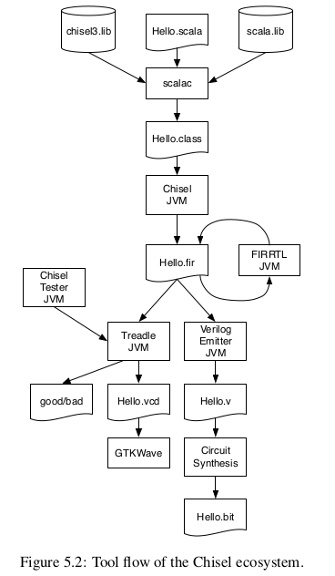

- [chisel工具流](#chisel工具流)
- [简单的LED闪烁控制](#简单的led闪烁控制)
  - [chisel部分](#chisel部分)
  - [生成的verilog文件](#生成的verilog文件)
- [七段显示器驱动实验](#七段显示器驱动实验)
  - [Chisel](#chisel)
  - [生成的Verilog代码](#生成的verilog代码)
- [4位计时器控制七段数码管显示实验](#4位计时器控制七段数码管显示实验)
  - [chisel代码](#chisel代码)
  - [生成的verilog文件](#生成的verilog文件-1)
- [基于FPGA的按钮防抖实验](#基于fpga的按钮防抖实验)
  - [chisel代码](#chisel代码-1)
  - [生成的Verilog文件](#生成的verilog文件-2)
- [交通信号灯控制实验](#交通信号灯控制实验)
  - [chisel代码](#chisel代码-2)
  - [生成的Verilog文件](#生成的verilog文件-3)

# chisel工具流
 

首先，有了Chisel源码后，Scala的编译器基于Chisel、Scala的库将我们的代码生成Java类文件*.class，也就是字节码文件。这类文件可以在标准的JVM（java虚拟机）上直接执行。  

其次，用Chisel驱动执行这个字节码文件会生成FIRRTL文件*.fir。这个FIRRTL全称：Flexible Intermediate Representation for RTL，即RTL的可变中间表示，是数字电路的中间表示。FIRRTL编译器可以在点路上执行一些转换，是Chisel到其他硬件描述语言的关键桥梁，如果想理解更高阶的Chisel的内容甚至为Chisel开源代码做贡献，那就需要深入学习FIRRTL了。

接着，readle是一个FIRRTL的解释器，用于电路的仿真。配合Chisel测试器，它可以用于调试和测试Chisel电路。根据输出的断言信息我们可以得到测试的结果。Treadle还可以生成波形文件，即*.vcd。

最后，回到FIRRTL编译器部分，Verilog Emitter也是FIRRTL变换之一，可以用*.fir生成可综合的Verilog代码*.v。

# 简单的LED闪烁控制
目的是实现一个简单的LED闪烁控制模块。
## chisel部分
该实验首先是导入chisel的基本库，其次就是模块的定义，Bundle是一个chisel用来组织多个信号的容器，相当于一个信号的集合。在设计好电路逻辑后，想要实现将chisel代码转换成verilog代码则需要通过chisel.stage.ChiselStage包中的emitVerilog.
```
import chisel3._                      //导入chisel的基本库

class Hello extends Module {          //模块定义
  val io = IO(new Bundle {   //Bundle是Chisel用来组织多个信号的容器，相当于一个信号的集合。
    val sw = Input(UInt(2.W))         //2位输入
    val led = Output(UInt(1.W))       //1位输出
  })
  //计数器的最大值
  val CNT_MAX = (50000000 / 2 - 1).U

  val cntReg = RegInit(0.U(32.W))     //计数器寄存器
  val blkReg = RegInit(0.U(1.W))      //LED状态寄存器

  //计数器和状态翻转逻辑
  cntReg := cntReg + 1.U
  when(cntReg === CNT_MAX) {
    cntReg := 0.U
    blkReg := ~blkReg
  }
  //使用sw控制LED输出
  io.led := Mux(io.sw === 0.U, 0.U,    //sw = 0,LED关闭
                Mux(io.sw === 1.U, 1.U,//sw =1,LED常量
                    blkReg
                ))    //sw = 其他值，LED闪烁
}

object Hello extends App {
  //使用ChiselStage类将Hello模块转换成Verilog代码。
  //emitVerilog会将该模块得Chisel描述生成对应得Verilog代码。
  (new chisel3.stage.ChiselStage).emitVerilog(new Hello())
}

```  
## 生成的verilog文件
下面是chisel生成的verilog代码，主要有这些部分：1.模块定义部分；2.条件编译部分；3.寄存器定义和信号声明；4.组合逻辑部分；5.时序逻辑部分；6.随机化相关宏定义；7.随机初始化部分；8.条件宏和编译指令
```
//模块定义部分
module Hello(
  input        clock,
  input        reset,
  input  [1:0] io_sw,
  output       io_led
);

//条件编译部分
`ifdef RANDOMIZE_REG_INIT   //条件编译宏，用于在硬件仿真中初始化寄存器的随机值。
  reg [31:0] _RAND_0;       //这两个是用来存储随机数的寄存器
  reg [31:0] _RAND_1;
`endif // RANDOMIZE_REG_INIT

  //寄存器定义和信号声明
  reg [31:0] cntReg; // @[Hello.scala 21:23]
  reg  blkReg; // @[Hello.scala 22:23]
  wire [31:0] _cntReg_T_1 = cntReg + 32'h1; // @[Hello.scala 25:20]
  wire  _io_led_T_2 = io_sw == 2'h1 | blkReg; // @[Hello.scala 32:20]

  //组合逻辑部分
  //assign io_led 语句定义了 io_led 输出的逻辑。它的值取决于 io_sw 和 blkReg 的状态。
  assign io_led = io_sw == 2'h0 ? 1'h0 : _io_led_T_2; // @[Hello.scala 31:16]

  //时序逻辑部分
  always @(posedge clock) begin   //描述同步逻辑，时钟上升沿触发。
    if (reset) begin // @[Hello.scala 21:23]
      cntReg <= 32'h0; // @[Hello.scala 21:23]
    end else if (cntReg == 32'h17d783f) begin // @[Hello.scala 26:28]
      cntReg <= 32'h0; // @[Hello.scala 27:12]
    end else begin
      cntReg <= _cntReg_T_1; // @[Hello.scala 25:10]
    end
    if (reset) begin // @[Hello.scala 22:23]
      blkReg <= 1'h0; // @[Hello.scala 22:23]
    end else if (cntReg == 32'h17d783f) begin // @[Hello.scala 26:28]
      blkReg <= ~blkReg; // @[Hello.scala 28:12]
    end
  end

//随机化相关宏定义
//这部分是关于随机化寄存器和存储器初始化 以及 仿真期间的一些设置。
// Register and memory initialization
`ifdef RANDOMIZE_GARBAGE_ASSIGN     //启用时，会随机化无效的赋值。
`define RANDOMIZE
`endif
`ifdef RANDOMIZE_INVALID_ASSIGN     //启用时，会随机化无效的赋值操作。
`define RANDOMIZE
`endif
`ifdef RANDOMIZE_REG_INIT           //启用时，会随机初始化寄存器。
`define RANDOMIZE
`endif
`ifdef RANDOMIZE_MEM_INIT           //启用时，会随机初始化内存。
`define RANDOMIZE
`endif
`ifndef RANDOM     //如果未定义 RANDOM，则将其定义为 $random。$random 是一个系统函数。
`define RANDOM $random
`endif
`ifdef RANDOMIZE_MEM_INIT           //内存初始化相关的整数声明。
  integer initvar;
`endif
`ifndef SYNTHESIS                   //与合成相关的条件。
`ifdef FIRRTL_BEFORE_INITIAL
`FIRRTL_BEFORE_INITIAL
`endif

//随机初始化部分（initial 块）
//如果启用了 RANDOMIZE_REG_INIT，则 cntReg 和 blkReg 会在仿真开始时被赋予随机值。
initial begin
  `ifdef RANDOMIZE
    `ifdef INIT_RANDOM
      `INIT_RANDOM
    `endif
    `ifndef VERILATOR
      `ifdef RANDOMIZE_DELAY
        #`RANDOMIZE_DELAY begin end
      `else
        #0.002 begin end
      `endif
    `endif
`ifdef RANDOMIZE_REG_INIT
  _RAND_0 = {1{`RANDOM}};
  cntReg = _RAND_0[31:0];
  _RAND_1 = {1{`RANDOM}};
  blkReg = _RAND_1[0:0];
`endif // RANDOMIZE_REG_INIT
  `endif // RANDOMIZE
end // initial

//条件宏和编译指令
`ifdef FIRRTL_AFTER_INITIAL
`FIRRTL_AFTER_INITIAL
`endif
`endif // SYNTHESIS
endmodule

```  
# 七段显示器驱动实验
## Chisel
```
import chisel3._                      //导入chisel基础库

class Combinational extends Module {  //定义模块
  val io = IO(new Bundle {            //信号集合
    val in = Input(UInt(4.W))         //输入，4位
    val seg = Output(UInt(8.W))       //输出，8位
  })

  //默认值
  io.seg := "b1111_1111".U

  
  when(io.in === "b0000".U) { io.seg := "b0000_0011".U } // 0
    .elsewhen(io.in === "b0001".U) { io.seg := "b1001_1111".U } // 1
    .elsewhen(io.in === "b0010".U) { io.seg := "b0010_0101".U } // 2
    .elsewhen(io.in === "b0011".U) { io.seg := "b0000_1101".U } // 3
    .elsewhen(io.in === "b0100".U) { io.seg := "b1001_1001".U } // 4
    .elsewhen(io.in === "b0101".U) { io.seg := "b0100_1001".U } // 5
    .elsewhen(io.in === "b0110".U) { io.seg := "b0100_0001".U } // 6
    .elsewhen(io.in === "b0111".U) { io.seg := "b0001_1111".U } // 7
    .elsewhen(io.in === "b1000".U) { io.seg := "b0000_0001".U } // 8
    .elsewhen(io.in === "b1001".U) { io.seg := "b0000_1001".U } // 9
    .otherwise { io.seg := "b1111_1111".U } // 全灭
}


object Combinational extends App {
  //使用ChiselStage类将Hello模块转换成Verilog代码。
  //emitVerilog会将该模块得Chisel描述生成对应得Verilog代码。
  (new chisel3.stage.ChiselStage).emitVerilog(new Combinational())
}

```  
## 生成的Verilog代码
下面是根据上面的chisel源码生成的Verilog代码，在chisel源码中，使用的是 when和.elsewhen 这种条件赋值的构造，chisel编译器生成了以下的串连的三元运算符,如同真值表一样。在后面使用switch/is语句时，也是生成这种和真值表一样的串连的三元运算符的形式。  
```
module Combinational(
  input        clock,
  input        reset,
  input  [3:0] io_in,
  output [7:0] io_seg
);
  wire [7:0] _GEN_0 = io_in == 4'h9 ? 8'h9 : 8'hff; // @[Combinational.scala 22:{36,45} 23:25]
  wire [7:0] _GEN_1 = io_in == 4'h8 ? 8'h1 : _GEN_0; // @[Combinational.scala 21:{36,45}]
  wire [7:0] _GEN_2 = io_in == 4'h7 ? 8'h1f : _GEN_1; // @[Combinational.scala 20:{36,45}]
  wire [7:0] _GEN_3 = io_in == 4'h6 ? 8'h41 : _GEN_2; // @[Combinational.scala 19:{36,45}]
  wire [7:0] _GEN_4 = io_in == 4'h5 ? 8'h49 : _GEN_3; // @[Combinational.scala 18:{36,45}]
  wire [7:0] _GEN_5 = io_in == 4'h4 ? 8'h99 : _GEN_4; // @[Combinational.scala 17:{36,45}]
  wire [7:0] _GEN_6 = io_in == 4'h3 ? 8'hd : _GEN_5; // @[Combinational.scala 16:{36,45}]
  wire [7:0] _GEN_7 = io_in == 4'h2 ? 8'h25 : _GEN_6; // @[Combinational.scala 15:{36,45}]
  wire [7:0] _GEN_8 = io_in == 4'h1 ? 8'h9f : _GEN_7; // @[Combinational.scala 14:{36,45}]
  assign io_seg = io_in == 4'h0 ? 8'h3 : _GEN_8; // @[Combinational.scala 13:{29,38}]
endmodule

```  
# 4位计时器控制七段数码管显示实验
这个实验综合了前两个实验。Timing模块是七段数码管显示，并在Top模块中被实例化，输入则是有Top模块中的计数器，每500毫秒生成一个tick信号。
## chisel代码
```
import chisel3._
import chisel3.util._

class Timing extends Module {
  val io = IO(new Bundle {
    val in = Input(UInt(4.W))
    val seg = Output(UInt(8.W))
  })

  //默认值
  io.seg := "b1111_1111".U

  when(io.in === "b0000".U) { io.seg := "b0000_0011".U } // 0
    .elsewhen(io.in === "b0001".U) { io.seg := "b1001_1111".U } // 1
    .elsewhen(io.in === "b0010".U) { io.seg := "b0010_0101".U } // 2
    .elsewhen(io.in === "b0011".U) { io.seg := "b0000_1101".U } // 3
    .elsewhen(io.in === "b0100".U) { io.seg := "b1001_1001".U } // 4
    .elsewhen(io.in === "b0101".U) { io.seg := "b0100_1001".U } // 5
    .elsewhen(io.in === "b0110".U) { io.seg := "b0100_0001".U } // 6
    .elsewhen(io.in === "b0111".U) { io.seg := "b0001_1111".U } // 7
    .elsewhen(io.in === "b1000".U) { io.seg := "b0000_0001".U } // 8
    .elsewhen(io.in === "b1001".U) { io.seg := "b0000_1001".U } // 9
    .elsewhen(io.in === "b1010".U) { io.seg := "b0001_0001".U } // A
    .elsewhen(io.in === "b1011".U) { io.seg := "b1100_0001".U } // B
    .elsewhen(io.in === "b1100".U) { io.seg := "b0110_0011".U } // C
    .elsewhen(io.in === "b1101".U) { io.seg := "b1000_0101".U } // D
    .elsewhen(io.in === "b1110".U) { io.seg := "b0110_0001".U } // E
    .elsewhen(io.in === "b1111".U) { io.seg := "b0111_0001".U } // F
    .otherwise { io.seg := "b1111_1111".U } // 全灭
}

//顶层模块
class Top extends Module {
  val io = IO(new Bundle {
    val seg = Output(UInt(8.W))
  })

  //4位计数器
  val counter4 = RegInit(0.U(4.W))  //初始化为0

  //秒计数器
  val freq = 100000000                //FPGA时钟频率（100MHZ）
  val halfSecond = (freq / 2).U       //500毫秒计数周期
  val secCounter = RegInit(0.U(27.W)) //秒计数器宽度足够存储100M

  val tick = Wire(Bool())             //用于生成计数脉冲
  tick := false.B

  when(secCounter === halfSecond - 1.U) {
    secCounter := 0.U                 //重置计数器
    tick := true.B                    //产生tick信号
  } .otherwise {                      //否则计数器自增
    secCounter := secCounter + 1.U
  }

  //使能计数器
  when(tick) {
    counter4 := counter4 + 1.U // 每次 tick 更新计数器
  }

  //实例化
  val timing = Module(new Timing)
  timing.io.in := counter4
  io.seg := timing.io.seg
}


object Top extends App {
  (new chisel3.stage.ChiselStage).emitVerilog(new Top())
}

```  
## 生成的verilog文件
```
//Timing模块
module Timing(
  input  [3:0] io_in,
  output [7:0] io_seg
);
  wire [7:0] _GEN_0 = io_in == 4'hf ? 8'h71 : 8'hff; // @[Timing.scala 28:{36,45} 29:25]
  wire [7:0] _GEN_1 = io_in == 4'he ? 8'h61 : _GEN_0; // @[Timing.scala 27:{36,45}]
  wire [7:0] _GEN_2 = io_in == 4'hd ? 8'h85 : _GEN_1; // @[Timing.scala 26:{36,45}]
  wire [7:0] _GEN_3 = io_in == 4'hc ? 8'h63 : _GEN_2; // @[Timing.scala 25:{36,45}]
  wire [7:0] _GEN_4 = io_in == 4'hb ? 8'hc1 : _GEN_3; // @[Timing.scala 24:{36,45}]
  wire [7:0] _GEN_5 = io_in == 4'ha ? 8'h11 : _GEN_4; // @[Timing.scala 23:{36,45}]
  wire [7:0] _GEN_6 = io_in == 4'h9 ? 8'h9 : _GEN_5; // @[Timing.scala 22:{36,45}]
  wire [7:0] _GEN_7 = io_in == 4'h8 ? 8'h1 : _GEN_6; // @[Timing.scala 21:{36,45}]
  wire [7:0] _GEN_8 = io_in == 4'h7 ? 8'h1f : _GEN_7; // @[Timing.scala 20:{36,45}]
  wire [7:0] _GEN_9 = io_in == 4'h6 ? 8'h41 : _GEN_8; // @[Timing.scala 19:{36,45}]
  wire [7:0] _GEN_10 = io_in == 4'h5 ? 8'h49 : _GEN_9; // @[Timing.scala 18:{36,45}]
  wire [7:0] _GEN_11 = io_in == 4'h4 ? 8'h99 : _GEN_10; // @[Timing.scala 17:{36,45}]
  wire [7:0] _GEN_12 = io_in == 4'h3 ? 8'hd : _GEN_11; // @[Timing.scala 16:{36,45}]
  wire [7:0] _GEN_13 = io_in == 4'h2 ? 8'h25 : _GEN_12; // @[Timing.scala 15:{36,45}]
  wire [7:0] _GEN_14 = io_in == 4'h1 ? 8'h9f : _GEN_13; // @[Timing.scala 14:{36,45}]
  assign io_seg = io_in == 4'h0 ? 8'h3 : _GEN_14; // @[Timing.scala 13:{29,38}]
endmodule
module Top(
  input        clock,
  input        reset,
  output [7:0] io_seg
);

//初始化寄存器声明
`ifdef RANDOMIZE_REG_INIT
  reg [31:0] _RAND_0;
  reg [31:0] _RAND_1;
`endif // RANDOMIZE_REG_INIT

  //信号定义
  wire [3:0] timing_io_in; // @[Timing.scala 62:22]
  wire [7:0] timing_io_seg; // @[Timing.scala 62:22]

  //计数器寄存器声明
  //counter4用于计数1到15的数值，每半秒自增一次，作为Timing模块的输入
  //secCounter计数时钟周期，每26'h2faf080 - 1（即50000000个时钟周期，半秒）。生成tick信号。
  reg [3:0] counter4; // @[Timing.scala 39:25]
  reg [26:0] secCounter; // @[Timing.scala 44:27]

  //组合逻辑信号
  //_T_1，26 位的 wire 信号，表示 26'h2faf080 - 1，即 50000000 - 1。
  //_GEN_3，27位的wire信号，通过将_T_1扩展为27位得到（高位补 0）。它将于secCounter比较。
  wire [25:0] _T_1 = 26'h2faf080 - 26'h1; // @[Timing.scala 49:34]
  wire [26:0] _GEN_3 = {{1'd0}, _T_1}; // @[Timing.scala 49:19]
  //当 secCounter 等于 _GEN_3 时，tick 为 1，表示已经过了半秒钟；否则为 0。
  wire  tick = secCounter == _GEN_3; // @[Timing.scala 49:19]

  //计数其自增信号
  wire [26:0] _secCounter_T_1 = secCounter + 27'h1; // @[Timing.scala 53:30]
  wire [3:0] _counter4_T_1 = counter4 + 4'h1; // @[Timing.scala 58:26]

  //Timing模块实例化
  Timing timing ( // @[Timing.scala 62:22]
    .io_in(timing_io_in),
    .io_seg(timing_io_seg)
  );

  //信号链接
  //将 Timing 模块的输出 timing_io_seg 直接连接到 Top 模块的输出 io_seg。
  assign io_seg = timing_io_seg; // @[Timing.scala 64:10]
  //将 counter4 的值连接到 Timing 模块的输入 timing_io_in。
  assign timing_io_in = counter4; // @[Timing.scala 63:16]

  //时序逻辑
  always @(posedge clock) begin //上升沿触发
    if (reset) begin // @[Timing.scala 39:25]
      counter4 <= 4'h0; // @[Timing.scala 39:25]
    end else if (tick) begin // @[Timing.scala 57:14]
      counter4 <= _counter4_T_1; // @[Timing.scala 58:14]
    end
    if (reset) begin // @[Timing.scala 44:27]
      secCounter <= 27'h0; // @[Timing.scala 44:27]
    end else if (tick) begin // @[Timing.scala 49:41]
      secCounter <= 27'h0; // @[Timing.scala 50:16]
    end else begin
      secCounter <= _secCounter_T_1; // @[Timing.scala 53:16]
    end
  end
// Register and memory initialization
`ifdef RANDOMIZE_GARBAGE_ASSIGN
`define RANDOMIZE
`endif
`ifdef RANDOMIZE_INVALID_ASSIGN
`define RANDOMIZE
`endif
`ifdef RANDOMIZE_REG_INIT
`define RANDOMIZE
`endif
`ifdef RANDOMIZE_MEM_INIT
`define RANDOMIZE
`endif
`ifndef RANDOM
`define RANDOM $random
`endif
`ifdef RANDOMIZE_MEM_INIT
  integer initvar;
`endif
`ifndef SYNTHESIS
`ifdef FIRRTL_BEFORE_INITIAL
`FIRRTL_BEFORE_INITIAL
`endif
initial begin
  `ifdef RANDOMIZE
    `ifdef INIT_RANDOM
      `INIT_RANDOM
    `endif
    `ifndef VERILATOR
      `ifdef RANDOMIZE_DELAY
        #`RANDOMIZE_DELAY begin end
      `else
        #0.002 begin end
      `endif
    `endif
`ifdef RANDOMIZE_REG_INIT
  _RAND_0 = {1{`RANDOM}};
  counter4 = _RAND_0[3:0];
  _RAND_1 = {1{`RANDOM}};
  secCounter = _RAND_1[26:0];
`endif // RANDOMIZE_REG_INIT
  `endif // RANDOMIZE
end // initial
`ifdef FIRRTL_AFTER_INITIAL
`FIRRTL_AFTER_INITIAL
`endif
`endif // SYNTHESIS
endmodule

```  
# 基于FPGA的按钮防抖实验
这个实验主要是测试输入同步器，防抖电路以及大多数投票的使用。
## chisel代码
```
import chisel3._
import chisel3.util._


//顶层模块
class Top(fac : Int = 10000) extends Module {
  val io = IO(new Bundle {
    val btn = Input(Bool())
    val led = Output(UInt(8.W))
  })

  //输入同步器
  def sync(v: Bool) = RegNext(RegNext(v)) //两次寄存，确保信号稳定
  val btnsync = sync(io.btn)              //将按钮信号通过输入同步器

  //防抖动电路（生成分频信号）
  def tickGen(fac: Int) = {
    val reg = RegInit(0.U(log2Up(fac).W)) //log2Up 是Chisel中的一个函数，用于计算 fac 的以2为底的对数，并向上取整。
    val tick = reg === (fac - 1).U
    reg := Mux(tick, 0.U, reg + 1.U)
    tick
  }
  val tick = tickGen(fac) //生成一个分频信号

  val btnDeb = Reg(Bool())  //定义布尔函数寄存器，存储同步后按钮信号
  when(tick) {              //当tick有效，根系布尔函数寄存器
    btnDeb := btnsync
  }

  //大多数投票
  def filter(v: Bool, t: Bool) = {
    val reg = RegInit(0.U(3.W))
    when(t) {
      reg := Cat(reg(1, 0), v)
    }
    (reg(2) & reg(0)) | (reg(2) & reg(1)) | (reg(1) & reg(0))
  }
  val btnClean = filter(btnDeb, tick) //滤波处理信号

  //边沿检测
  def rising(v: Bool): Bool = v & !RegNext(v) // 检测上升沿
  val risingEdge = rising(btnClean)           //检测清理后的按钮信号的上升沿

  //计数器逻辑
  val counter = RegInit(0.U(8.W))
  when(risingEdge) {
    counter := counter + 1.U
  }

  //输出到LED显示
  io.led := counter

}


object Top extends App {
  (new chisel3.stage.ChiselStage).emitVerilog(new Top())
}

```  
## 生成的Verilog文件
```
//模块定义
module Top(
  input        clock,
  input        reset,
  input        io_btn,
  output [7:0] io_led
);

//随机化初始化支持，仿真时初始化寄存器的随机值
`ifdef RANDOMIZE_REG_INIT
  reg [31:0] _RAND_0;
  reg [31:0] _RAND_1;
  reg [31:0] _RAND_2;
  reg [31:0] _RAND_3;
  reg [31:0] _RAND_4;
  reg [31:0] _RAND_5;
  reg [31:0] _RAND_6;
`endif // RANDOMIZE_REG_INIT

  //寄存器定义
  reg  btnsync_REG; // @[Top.scala 13:38] 按钮信号同步
  reg  btnsync; // @[Top.scala 13:30]
  reg [13:0] tick_reg; // @[Top.scala 18:22]  生成定时信号tick
  //组合逻辑信号
  wire  tick = tick_reg == 14'h270f; // @[Top.scala 19:20]
  wire [13:0] _tick_reg_T_1 = tick_reg + 14'h1; // @[Top.scala 20:31] 自增信号

  //寄存器定义
  reg  btnDeb; // @[Top.scala 25:19]  存储同步后的按钮信号
  reg [2:0] btnClean_reg; // @[Top.scala 32:22] 用于滤波按钮信号
  //组合逻辑信号
  wire [2:0] _btnClean_reg_T_1 = {btnClean_reg[1:0],btnDeb}; // @[Cat.scala 31:58]
  wire  btnClean = btnClean_reg[2] & btnClean_reg[0] | btnClean_reg[2] & btnClean_reg[1] | btnClean_reg[1] &
    btnClean_reg[0]; // @[Top.scala 36:43]

  //寄存器定义，检测按钮信号上升沿
  reg  risingEdge_REG; // @[Top.scala 41:43]
  //组合逻辑信号，检测btnClean的上升沿
  wire  risingEdge = btnClean & ~risingEdge_REG; // @[Top.scala 41:33]

  reg [7:0] counter; // @[Top.scala 45:24]
  wire [7:0] _counter_T_1 = counter + 8'h1; // @[Top.scala 47:24]

  //输出信号
  assign io_led = counter; // @[Top.scala 51:10]

  //时序逻辑
  always @(posedge clock) begin
    btnsync_REG <= io_btn; // @[Top.scala 13:38]
    btnsync <= btnsync_REG; // @[Top.scala 13:30]
    if (reset) begin // @[Top.scala 18:22]
      tick_reg <= 14'h0; // @[Top.scala 18:22]
    end else if (tick) begin // @[Top.scala 20:15]
      tick_reg <= 14'h0;
    end else begin
      tick_reg <= _tick_reg_T_1;
    end
    if (tick) begin // @[Top.scala 26:14]
      btnDeb <= btnsync; // @[Top.scala 27:12]
    end
    if (reset) begin // @[Top.scala 32:22]
      btnClean_reg <= 3'h0; // @[Top.scala 32:22]
    end else if (tick) begin // @[Top.scala 33:13]
      btnClean_reg <= _btnClean_reg_T_1; // @[Top.scala 34:11]
    end
    risingEdge_REG <= btnClean_reg[2] & btnClean_reg[0] | btnClean_reg[2] & btnClean_reg[1] | btnClean_reg[1] &
      btnClean_reg[0]; // @[Top.scala 36:43]
    if (reset) begin // @[Top.scala 45:24]
      counter <= 8'h0; // @[Top.scala 45:24]
    end else if (risingEdge) begin // @[Top.scala 46:20]
      counter <= _counter_T_1; // @[Top.scala 47:13]
    end
  end

//随机化初始化
// Register and memory initialization
`ifdef RANDOMIZE_GARBAGE_ASSIGN
`define RANDOMIZE
`endif
`ifdef RANDOMIZE_INVALID_ASSIGN
`define RANDOMIZE
`endif
`ifdef RANDOMIZE_REG_INIT
`define RANDOMIZE
`endif
`ifdef RANDOMIZE_MEM_INIT
`define RANDOMIZE
`endif
`ifndef RANDOM
`define RANDOM $random
`endif
`ifdef RANDOMIZE_MEM_INIT
  integer initvar;
`endif
`ifndef SYNTHESIS
`ifdef FIRRTL_BEFORE_INITIAL
`FIRRTL_BEFORE_INITIAL
`endif
initial begin
  `ifdef RANDOMIZE
    `ifdef INIT_RANDOM
      `INIT_RANDOM
    `endif
    `ifndef VERILATOR
      `ifdef RANDOMIZE_DELAY
        #`RANDOMIZE_DELAY begin end
      `else
        #0.002 begin end
      `endif
    `endif
`ifdef RANDOMIZE_REG_INIT
  _RAND_0 = {1{`RANDOM}};
  btnsync_REG = _RAND_0[0:0];
  _RAND_1 = {1{`RANDOM}};
  btnsync = _RAND_1[0:0];
  _RAND_2 = {1{`RANDOM}};
  tick_reg = _RAND_2[13:0];
  _RAND_3 = {1{`RANDOM}};
  btnDeb = _RAND_3[0:0];
  _RAND_4 = {1{`RANDOM}};
  btnClean_reg = _RAND_4[2:0];
  _RAND_5 = {1{`RANDOM}};
  risingEdge_REG = _RAND_5[0:0];
  _RAND_6 = {1{`RANDOM}};
  counter = _RAND_6[7:0];
`endif // RANDOMIZE_REG_INIT
  `endif // RANDOMIZE
end // initial
`ifdef FIRRTL_AFTER_INITIAL
`FIRRTL_AFTER_INITIAL
`endif
`endif // SYNTHESIS
endmodule

```  
# 交通信号灯控制实验
## chisel代码
这是一个主副干道的交通信号灯实验，模拟了主干道和副干道交通信号灯的状态切换逻辑。用来学习状态机的操作流程。

```
import chisel3._
import chisel3.util._


class Top extends Module {
  val io = IO(new Bundle {
    val minorcar = Input(Bool())        //副干道车辆检测
    val timestate = Input(Bool())       //信号灯时间状态
    val minorLight = Output(UInt(2.W))  //副干道信号灯状态
    val mainLight = Output(UInt(2.W))   //主干道信号灯状态
  })

  //状态
  object State extends ChiselEnum {
    val MainGreen, MainOrange, AllRed, MinorGreen, MinorOrange = Value
  }
  import State._
  val stateReg = RegInit(MainGreen) //状态寄存器，初始为主干道绿灯

  //主干道和副干道信号灯状态默认输出
  io.mainLight := 0.U //默认红灯
  io.minorLight := 0.U

  //状态转移逻辑
  switch (stateReg) {
    is (MainGreen) {
      io.mainLight := 2.U   //主干道绿灯
      io.minorLight := 0.U  //副干道红灯
      when(io.minorcar === true.B) {   //检测到副干道有车辆
        stateReg := MainOrange
      }
    }
    is (MainOrange) {
      io.mainLight := 1.U
      io.minorLight := 0.U
      when(io.timestate) {
        stateReg := AllRed
      }
    }
    is (AllRed) {
      io.mainLight := 0.U
      io.minorLight := 0.U
      when(io.timestate) {
        stateReg := MinorGreen
      }
    }
    is (MinorGreen) {
      io.mainLight := 0.U
      io.minorLight := 2.U
      when(io.timestate & (io.minorcar === false.B)) {  //检测到小车离开
        stateReg := MinorOrange
      }
    }
    is (MinorOrange) {
      io.mainLight := 0.U
      io.minorLight := 1.U
      when(io.timestate) {
        stateReg := MainGreen
      }
    }
  }
}


object Top extends App {
  (new chisel3.stage.ChiselStage).emitVerilog(new Top())
}


```  

## 生成的Verilog文件
根据chisel生成的Verilog代码中的状态机，状态寄存器和状态转移逻辑分离，结构清晰。输出逻辑使用组合逻辑实现，与状态寄存器分离。
```
//模块定义
module Top(
  input        clock,
  input        reset,
  input        io_minorcar, // @[src/main/scala/Top.scala 6:14]
  input        io_timestate, // @[src/main/scala/Top.scala 6:14]
  output [1:0] io_minorLight, // @[src/main/scala/Top.scala 6:14]
  output [1:0] io_mainLight // @[src/main/scala/Top.scala 6:14]
);

//随机化寄存器初始化
`ifdef RANDOMIZE_REG_INIT
  reg [31:0] _RAND_0; //随机数寄存器
`endif // RANDOMIZE_REG_INIT

  //状态寄存器定义（存储当前状态）
  reg [2:0] stateReg; // @[src/main/scala/Top.scala 18:25]

  //状态转移逻辑的中间信号
  //时间状态触发，转移到状态3（AllRed）），否则保持当前状态
  wire [2:0] _GEN_2 = io_timestate ? 3'h3 : stateReg; // @[src/main/scala/Top.scala 43:26 44:18 18:25]
  //时间状态触发且车辆未离开，转移到状态4（MinorGreen），否则保持当前状态
  wire [2:0] _GEN_3 = io_timestate & ~io_minorcar ? 3'h4 : stateReg; // @[src/main/scala/Top.scala 50:54 51:18 18:25]
  //时间状态触发，则转移到状态0（MainGreen），否则保持当前状态
  wire [2:0] _GEN_4 = io_timestate ? 3'h0 : stateReg; // @[src/main/scala/Top.scala 57:26 58:18 18:25]
  
  //如果当前状态是4（MinorOrange），则根据时间状态转移到状态0或保持
  wire [2:0] _GEN_7 = 3'h4 == stateReg ? _GEN_4 : stateReg; // @[src/main/scala/Top.scala 25:21 18:25]
  //当前状态是3（AllRed），则副干道信号灯为2（绿灯），否则根据状态4判断
  wire [1:0] _GEN_9 = 3'h3 == stateReg ? 2'h2 : {{1'd0}, 3'h4 == stateReg}; // @[src/main/scala/Top.scala 25:21 49:21]
  //当前状态是3（AllRed），则根据时间状态转移到状态4或保持
  wire [2:0] _GEN_10 = 3'h3 == stateReg ? _GEN_3 : _GEN_7; // @[src/main/scala/Top.scala 25:21]
  //当前状态是2（MainOrange），则副干道信号灯为0（红灯），否则根据状态3判断
  wire [1:0] _GEN_12 = 3'h2 == stateReg ? 2'h0 : _GEN_9; // @[src/main/scala/Top.scala 25:21 42:21]
  //当前状态是1（MainGreen），则副干道信号灯为0（红灯），否则根据状态2判断
  wire [1:0] _GEN_15 = 3'h1 == stateReg ? 2'h0 : _GEN_12; // @[src/main/scala/Top.scala 25:21 35:21]
  
  //副干道输出逻辑，状态是0（MainGreen），则副干道信号灯为0（红灯），否则根据状态1判断
  assign io_minorLight = 3'h0 == stateReg ? 2'h0 : _GEN_15; // @[src/main/scala/Top.scala 25:21 28:21]
  //主干道信号灯输出逻辑，当前状态是0（MainGreen），则主干道信号灯为2（绿灯），否则根据状态1判断
  assign io_mainLight = 3'h0 == stateReg ? 2'h2 : {{1'd0}, 3'h1 == stateReg}; // @[src/main/scala/Top.scala 25:21 27:20]
  
  //时序逻辑
  always @(posedge clock) begin
    if (reset) begin // @[src/main/scala/Top.scala 18:25]
      stateReg <= 3'h0; // @[src/main/scala/Top.scala 18:25]

        //如果是状态0（默认MainGreen）
    end else if (3'h0 == stateReg) begin // @[src/main/scala/Top.scala 25:21]
      //检测到副干道来车
      if (io_minorcar) begin // @[src/main/scala/Top.scala 29:36]
        //状态寄存器存储状态1（MainOrange）
        stateReg <= 3'h1; // @[src/main/scala/Top.scala 30:18]
      end
        //如果是状态1（MainOrange）
    end else if (3'h1 == stateReg) begin // @[src/main/scala/Top.scala 25:21]
      //时间触发
      if (io_timestate) begin // @[src/main/scala/Top.scala 36:26]
        //进入状态2（AllRed）
        stateReg <= 3'h2; // @[src/main/scala/Top.scala 37:18]
      end
        //如果是状态2
    end else if (3'h2 == stateReg) begin // @[src/main/scala/Top.scala 25:21]
      //进入条件判断（根据时间触发）
      stateReg <= _GEN_2;
    end else begin
      //否则
      stateReg <= _GEN_10;
    end
  end

//寄存器和存储器初始化（用于仿真时随机初始化）
// Register and memory initialization
`ifdef RANDOMIZE_GARBAGE_ASSIGN
`define RANDOMIZE
`endif
`ifdef RANDOMIZE_INVALID_ASSIGN
`define RANDOMIZE
`endif
`ifdef RANDOMIZE_REG_INIT
`define RANDOMIZE
`endif
`ifdef RANDOMIZE_MEM_INIT
`define RANDOMIZE
`endif
`ifndef RANDOM
`define RANDOM $random
`endif
`ifdef RANDOMIZE_MEM_INIT
  integer initvar;
`endif
`ifndef SYNTHESIS
`ifdef FIRRTL_BEFORE_INITIAL
`FIRRTL_BEFORE_INITIAL
`endif
initial begin
  `ifdef RANDOMIZE
    `ifdef INIT_RANDOM
      `INIT_RANDOM
    `endif
    `ifndef VERILATOR
      `ifdef RANDOMIZE_DELAY
        #`RANDOMIZE_DELAY begin end
      `else
        #0.002 begin end
      `endif
    `endif
`ifdef RANDOMIZE_REG_INIT
  _RAND_0 = {1{`RANDOM}};
  stateReg = _RAND_0[2:0];  //随机初始化状态寄存器
`endif // RANDOMIZE_REG_INIT
  `endif // RANDOMIZE
end // initial
`ifdef FIRRTL_AFTER_INITIAL
`FIRRTL_AFTER_INITIAL
`endif
`endif // SYNTHESIS
endmodule

```  

