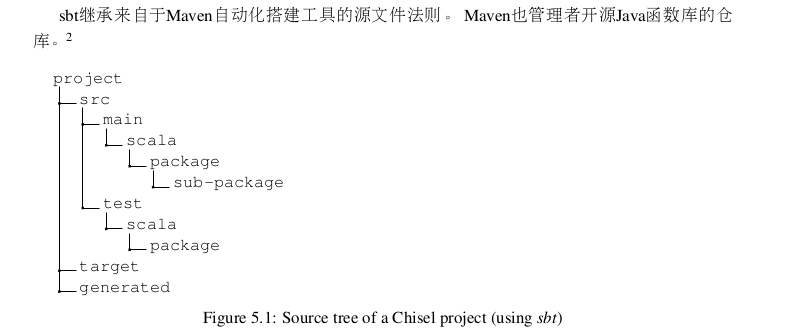
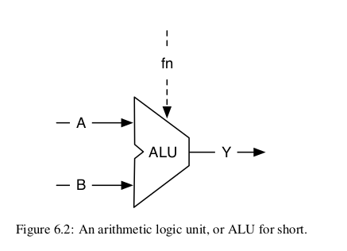
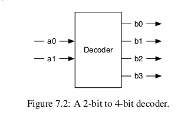
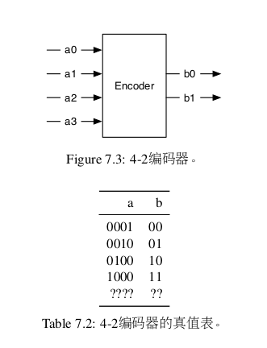
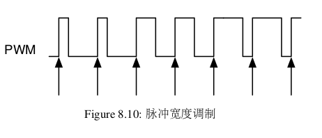
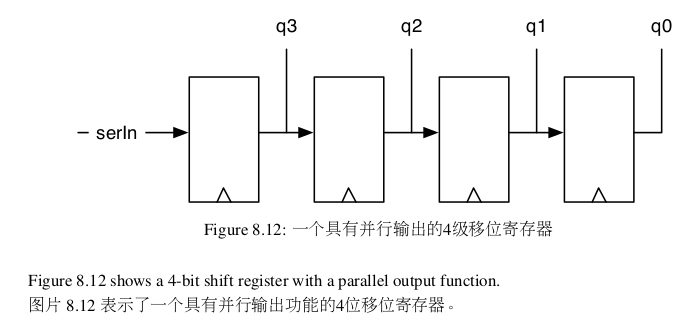
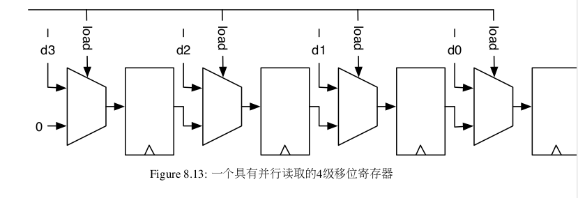
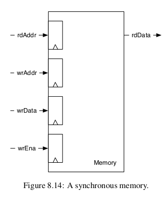

- [1.读chisel-book 跟着做第一个项目Hello](#1读chisel-book-跟着做第一个项目hello)
  - [Hello-world代码的解读](#hello-world代码的解读)
  - [Hello-world的测试代码](#hello-world的测试代码)
- [2.基本组成部分](#2基本组成部分)
  - [2.1信号类型和常量](#21信号类型和常量)
  - [2.2组合电路](#22组合电路)
    - [2.2.1复用器](#221复用器)
  - [2.3状态寄存器](#23状态寄存器)
    - [2.3.1计数](#231计数)
  - [2.4使用Bundle和Vec进行结构](#24使用bundle和vec进行结构)
  - [2.5Chisel生成的硬件](#25chisel生成的硬件)
- [3.搭建过程和测试](#3搭建过程和测试)
  - [3.1使用sbt搭建你的项目](#31使用sbt搭建你的项目)
    - [3.1.1源文件结构](#311源文件结构)
    - [3.1.2运行sbt](#312运行sbt)
    - [3.1.3工具流程](#313工具流程)
  - [3.2 使用chisel测试](#32-使用chisel测试)
    - [3.2.1PeekPokeTester](#321peekpoketester)
    - [3.2.2使用ScalaTest](#322使用scalatest)
    - [3.2.3波形](#323波形)
    - [3.2.4printf Debugging](#324printf-debugging)
- [4.组成部分](#4组成部分)
  - [4.1chisel的组成部分是模块](#41chisel的组成部分是模块)
  - [4.2一个运算逻辑单元](#42一个运算逻辑单元)
  - [4.3整体连接](#43整体连接)
  - [4.4使用函数的轻量级组成部分](#44使用函数的轻量级组成部分)
- [5.组合搭建模块](#5组合搭建模块)
  - [5.1组合电路](#51组合电路)
  - [5.2译码器](#52译码器)
  - [5.3编码器](#53编码器)
  - [5.4练习](#54练习)
    - [Combinational.scala](#combinationalscala)
    - [CombinationalTest.scala](#combinationaltestscala)
- [6.时序建造模块](#6时序建造模块)
  - [6.1寄存器](#61寄存器)
  - [6.2计数器](#62计数器)
    - [6.2.1向上和向下计数](#621向上和向下计数)
    - [6.2.2使用计数器产生时序](#622使用计数器产生时序)
    - [6.2.3 nerd计数器](#623-nerd计数器)
    - [6.2.4一个计时器](#624一个计时器)
    - [6.2.5脉冲宽度调制](#625脉冲宽度调制)
  - [6.3移位寄存器](#63移位寄存器)
    - [6.3.1使用并行输出的移位寄存器](#631使用并行输出的移位寄存器)
    - [6.3.2并行读取的移位寄存器](#632并行读取的移位寄存器)
  - [6.4存储器](#64存储器)
  - [6.5练习](#65练习)
    - [第一小题](#第一小题)


# 1.读chisel-book 跟着做第一个项目Hello
## Hello-world代码的解读
```
//导入Chisel库
import chisel3._

//定义一个名为Hello的硬件模块
class Hello extends Module {
  val io = IO(new Bundle {              //定义模块输入输出接口。led为输出端口
    val led = Output(UInt(1.W))         //led端口是1位的无符号整数，表示LED开关状态
  })
  val CNT_MAX = (50000000 / 2 - 1).U    //定义一个常量，表示计数器最大值

  val cntReg = RegInit(0.U(32.W))       //定义32位宽的寄存器cntReg，初始值为0
  val blkReg = RegInit(0.U(1.W))        //定义1位宽的寄存器blkReg，初始值为0

  cntReg := cntReg + 1.U                //每个时钟周期自增1
  when(cntReg === CNT_MAX) {
    cntReg := 0.U                       //重置计数器为0
    blkReg := ~blkReg                   //反转状态
  }
  io.led := blkReg                      //输出到LED控制端口io.led，从而控制LED状态
}

/**
 * 一个继承自 App 的对象，用于生成 Verilog 代码。
 */
object Hello extends App {
  // 创建一个 Chisel 编译器的实例 ChiselStage，然后调用 emitVerilog 方法
  // emitVerilog 会将硬件模块转换为 Verilog 代码并输出
  // 这里，我们将 Hello 模块的 Verilog 代码生成并输出
  (new chisel3.stage.ChiselStage).emitVerilog(new Hello())
}

```  
**val:** 表示定义了一个变量或者常量。  
## Hello-world的测试代码
```
//导入chiseltest库，提供了用于Chisel模块单元测试的API
import chiseltest._
//导入scalatest中的AnyFlatSpec类，提供了一种简单的测试样式
import org.scalatest.flatspec.AnyFlatSpec

//定义HelloTest类，继承了AnyFlatSpec和ChiselScalatestTester
class HelloTest extends AnyFlatSpec with ChiselScalatestTester {

  behavior of "Hello"   //设置测试行为，意思是要对名为"Hello"的模块进行测试

  //定义一个测试用例，测试目标是 "Hello" 模块的 LED 状态变化
  it should "pass" in {

    //使用 ChiselTest 提供的 test 函数来测试 Hello 模块
    test(new Hello) { c =>
      c.clock.setTimeout(0)                   //设置时钟超时时间为0,时钟不会自动推进
      var ledStatus = BigInt(-1)              //定义变量ledStatus跟踪上一次LED状态
      println("Start the blinking LED")       //输出信息表明测试开始
      for (_ <- 0 until 100) {                //for循环100次，表示100个时钟周期
        c.clock.step(10000)                   //每次让时钟前进10000个周期

        //获取当前时刻LED状态，通过c.io.led.peek().litValue访问LED输出端口的值
        val ledNow = c.io.led.peek().litValue

        //根据LED状态来选择输出字符"o" else "*"表示LED关闭或者开启
        val s = if (ledNow == 0) "o" else "*"

        //如果有变化打赢状态并更新ledStatus
        if (ledStatus != ledNow) {
          System.out.println(s)
          ledStatus = ledNow
        }
      }
      //表示测试结束
      println("\nEnd the blinking LED")
    }
  }
}

```

# 2.基本组成部分
## 2.1信号类型和常量
chisel提供了三种数据类型来描述型号，组合逻辑和寄存器：Bits,UInt和SInt。UInt表示这个bits的矢量是一个无符号的整型，SINt表示一个有符号的整型。  
8位Bits、8位无符号整型，和一个10位有符号整型：  
```
Bits(8.W)
UInt(8.W)
SInt(10.W)
```  
Bits的矢量位宽被chisel的width类型定义。以下表示把scala的整型n转换成chisel的width用于Bits矢量的定义：  
```
n.W
Bits(n.W)
```  

常量可以通过scala整型定义并把它转换成chisel类型。定义一个为0的UInt常量，和定义一个为03的SInt常量。  
```
0.U
-3.S
```  
常量也可以随着位宽被定义，使用chisel的width类型。定义一个4位宽的常量8：```8.U(4.W)```  


**常见问题:** 一个可能的错误是，当我们定义一个常量 .W ，定义一个宽度。 例如, 1.U(32) 不
会定义一个32位宽的代表1的常量。 相反，表达式 (32)被翻译为从32位的按位抓取，结果是一个
单位元的常量0。可能不是编程者的原意。  

chisel受益于scala的类型推断，并且很多地方类型信息可以被省略。类似的也适用于位宽。很多时候，chisel会自动推断正确的宽度。与是chisel描述的硬件语言比VHDL或Verilog更加简洁和可读。  

对于以其它作为基底的十进制以外的常量，常量被定义为字符串，开头h是16进制，o是8进制，b是2进制。以下的例子表明了常量255的定义，在不同的基底。这个例子中省略了位宽，chisel推断了最小宽度用来表示常量这个例子是8位。（16进制表示255， 8进制表示255， 二进制表示255）：  
```
"hff".U
"o377".U
"b1111_1111".U
```  
以上代码也表示了如何使用下划线去群组数字来标识常量。下划线是被忽略的。为了表示逻辑值，chisel定义了Bool类型。Bool可以表示true或false值。以下代码表示了Bool类型的定义以及Bool常量的定义，通过转换Scala Boolean常量true和false，到chisel的Bool类型。  
```
Bool()
true.B
false.B
```  

## 2.2组合电路
chisel使用Boolean algebra操作符，和c， java， scala和可能很多其他编程语言中定义的一样，去描述组合电路。以下代码定义了一个对a和b进行and逻辑，然后把它的结果和c进行or逻辑的电路：  
```
val logic = a & b | c
```  

在这个例子中，我们不定义类型或是信号logic的宽度。两个都是从类型和表达式位宽推演过来的，标准chisel的逻辑操作是：  
```
val and = a & b
val or = a | b
val xor = a ^ b
val not = ~a

val add = a + b
val sub = a - b
val neg = -a
val mul = a * b
val div = a / b
val mod = a % b
```  
算术操作使用标准操作符，即1.加法 2.减法 3.相反数 4.乘法 5.除法 6.余数。加法和减法操作结果的宽度是操作数的最大宽度，乘法操作结果的宽度是两个操作数的位宽加和，除法和余数操作结果是被除数的位宽。  

一个信号也可以先被定义为某种类型的Wire。随后，我们可以给这个wire赋值，使用 :=  
```
val w = Wire(UInt())

w := a & b
```  

一个简单的bit可以被如下提取：```val sign = x(31)```  

一个分割可以从终点到起点提取：```val lowByte = largeWord(7, 0)```  

bit域可以通过Cat合并：```val word = Cat(highByte, lowByte)```  

### 2.2.1复用器
复用器是一个选择选项的电路。在最基本的形式，它在二者选其一。一个复用器可以通过逻辑简单搭建。但是，复用是一个常用操作，chisel提供了一个复用器。  
```
val result = Mux(sel, a, b)
```  
在这个，如果sel是0（false）选择b， 如果是1（true）选择a。sel类型是ChiselBool，a和b作为输入可以是任何chisel基本类型或是集合，只要它们的类型相同。  

## 2.3状态寄存器
chisel提供了一个寄存器，这是一个D flip-flops的集合。这个寄存器隐含连接到一个总时钟，并且上升触发。当一个初始值随着在寄存器声明的时候被提供，它使用的是一个同步复位，连接到总复位信号。  

一个寄存器可以是任何bits集合的chisel类型。下边的代码定义了一个八位寄存器，在复位初始化位0：  
```
val reg = RegInit(0.U(8.W))
```  

一个输入连接到寄存器，通过 := 更新操作数，输出的寄存器可以使用表达式通过名字调用。  
```
reg := d
val q = reg
```  

寄存器也可以连接到它的输入使用如下定义：  
```
val regNxt = RegNext(d)
```  

也可以连接到它的输入并使用一个常量作为初始值作为定义：  
```
val bothReg = RegNext(d, 0.U)
```  

为了区分表示组合逻辑和寄存器的信号，一个常见的方式是在寄存器前边加上前缀Reg。另一个常见的方式，来自java和scala，是去使用camelCase，由几个单词组成的标识。这个方式是函数和变量用首字幕小写，类用首字母大写。  
  
### 2.3.1计数
一个简单的方式是计数到一个值。但是，在计算机科学和数字设计，计数从0开始：  
```
val cntReg = RegInit(0.U(8.W))
cntReg := Mux(cntReg === 100.U, 0.U, cntReg + 1.U)
```  
这个代码使用RegInit定义了一个名位cntReg的初始值为0的8位寄存器。随后经过Mux选择器，当条件cntReg ===100.U为真则输出0.U（计数器清零），否则输出cntReg + 1.U（计数器递增）。

## 2.4使用Bundle和Vec进行结构
chisel提供两个集成小组相关的信号：一个是BUndle，组织不同类型信号 和 ，一个是Vec代表一个可索引的相同类型的信号。Bundles和Vecs可以任意交织。  

chisel捆束多个信号。整个bundle可以被整体引用，或是通过它们的名字分别访问。我们可以定义一个捆束（信号的集合），通过定义一个类型，拓展了Bundle，并在域内通过val列出。  
```
val ch = wire(new Channel())  //定义新的wire，类型为channel
ch.data := 123.U              //给ch的data字段赋值为123
ch.valid := true.B            //给ch的alid赋值为true

val b = ch.valid              //将chalid的值赋值给b，b是Bool类型
```  
为了使用捆束，我们使用new，并把它包裹进wire。域通过点标识访问。点标识是面向对象语言的常见做法，x.y意味着x是一个对象的引用，y是那个对象的域。因为chisel是面向对象的，我们使用点标识去访问捆束的域。一个捆束类似于C语言的struct， VHDL的record，或是SystemVerilog的struct。捆束可以整体被引用。  
```
val channel = ch
```  
chisel的Vec代表一系列相同类型的信号。每个元素可以通过索引访问。chisel的Vec类似于一串数据结构在其他编程语言。Vec通过使用两个参数传入构造函数：元素的数量和元素的类型。组合逻辑Vec需要被打包进wire。  
单一元素通过index被访问到.  
```
v(0) := 1.U
v(1) := 3.U
v(2) := 5.U

val idx = 1.U(2.W)
val a = v(idx)
```  
被包裹进wire的向量是一个复用器，我们也可以把向量传入寄存器去定义一系列寄存器。以下例子定义了用于处理器的寄存器文件；32位寄存器，每个寄存器有32位宽，例如经典的32位RISC处理器，或是32-bits版本的RISC-V。  
```
val registerFile = Reg(Vec(32, UInt(32.W)))
```  
寄存器的一个元索通过索引访问，并用作正常寄存器。  
```
registerFile(idx) := dIn
val dOut = registerFile(idx)
```  
我们可以随意混搭捆束和向量。当创造一个有着捆束类型的向量，我们需要把这个类型传入向量域。使用我们的Channel，像我们以上定义的，我们可以创造一个向量的通道通过：  
```
val vexBundle = Wire(Vec(8, new Channel()))
```  
一个为捆束可能包含一个向量：  
```
class BundleVec extends Bundle {
  val field = UInt(8.W)
  val vector = Vec(4, UInt(8.W))
}
```  

当我们想要一个需要reset值的寄存器类型，我们首先创建一个具有那个捆束的wire，设置单独的域，然后把捆束传给RegInit。  
```
val initVal = Wire(new Channel())

initVal.data := 0.U
initVal.valid := false.B

val channelReg = RegInit(initVal)
```  
通过BUndle和Vec的组合，我们可以定义我们自己的数据结构，这个是有力的抽象。  

## 2.5Chisel生成的硬件
在看到一些chisel代码，可能看起来和经典编程语言像是java或cc比较想死。但是，chisel描述了硬件部分。而在软件项目中，一行代码在前一行过后执行而硬件执行全部。  

必须记住，chisel代码确实会生成硬件。尝试想像或画在纸上的单个模块，通过您的chisel电路描述生成。每次创建组件都会添加硬件。每个赋值声明产生门和/或触发器。  

从技术上讲，chisel执行代码时，它将作为scala程序运行，并且通过执行chisel语句，它收集硬件组件并连接这些节点。硬件节点网络就是硬件，可能会产生用于ASIC或FPGA综合的Verilog代码，或者用chisel测试仪测试。硬件节点网络时完全并行执行的。  

# 3.搭建过程和测试
## 3.1使用sbt搭建你的项目
### 3.1.1源文件结构
  
为了使用chisel命名空间的工具，需要声明类或模块再软件包被定义，在这个例子里，再mypacket：  
```
package mypack
import chisel3._
class Abc extends Module {
  val io = IO(new Bundle {})
}
```  
注意在这个例子我们看到了引入chisel3软件包和使用chisel类型。为了使用Abc模块在不同的地方（软件包命名空间），软件包的mypacket需要被引用。下划线“_”充当万用字元，意味着所有mypacket的类都要被引用。  
```
import mypack._
class AbcUser extends Module {
  val io = IO(new Bundle {})
  val abc = Abc()
}
```  
也可以不去引用来自mypack的所有类别，而是使用全名mypack.Abc代表mypack中的模块Abc。  
```
class AbcUser2 extends Module {
  val io = IO(new Bundle())
  val abc = new mypack.Abc()
}
```  
引用只是一个单个的类，并创造它也是可以的。  
```
import mypack.Abc
class AbcUser3 extends Module {
  val io = IO(new Bundle{})
  val abc = new Abc()
}
```  
### 3.1.2运行sbt
一个chisel项目可以被编译并执行通过一个简单的sbt命令：```sbt run```  

这个命令会编译所有的源文件树下的chisel代码并搜索含有object和含有main方法的类别，或是简化的App。如果由多余一个类似的对象，所有的对象都会被列出以及可选，你也可以直接执行被传入sbt作为参数的对象：```sbt "runMain mypacket.MyObject"```  

根据默认sbt只是搜索main部分的源文件树而不是测试部分。但是chisel测试器在这里描述的，含有一个main，但是应该放在源文件树的test部分，为了执行测试树的main，使用如下sbt命令：```sbt "test:runMain mypacket.MyTester"```  

现在我们知道了chisel项目的基本构成和如何使用sbt编译运行，我们可以继续开始一个简单的测试框架了。  

### 3.1.3工具流程
  
该图标识了chisel的工具流程。这个数字电路中，在chisel类被标识位Hello.scala 。scala编译器编译了这个类，和chisel和scala库，并生成了能被一个标准java虚拟机（JVM）执行的java类。通过chisel驱动器，执行这个类，生成了所谓RTL的灵活中间表达（RIRRTL），一个数字电路的中间表达。在我们的例子里，这个文件是Hello.fir。这个FIRRTL编译器完成了电路的转换。  

Treadle是一个FIRRTL表示器，去模拟一个电路。联合chisel测试器，它可以用来debug和测试chisel电路。通过assertion，我们可以提供测试结果。Treadle也可以生成波形文件Hello.vcd，可以通过波形观察器进行观察。  

一个FIRRTL变换，Verilog发射器，生成用于综合的Verilog代码Hello.v。电路综合工具（例如，intel的Quartus，Xilinx Vivado，或是ASIC工具）综合电路。在一个FPGA设计流程里，工具产生了FPGA的bitstream，用于设置FPGA，例如，Hello.bit。  

## 3.2 使用chisel测试
在测试硬件设计一般成为testbench。这些testbench初始化被测试的设计DUT，驱动输入端口，观察输出端口，与它们和期待值比较。  

### 3.2.1PeekPokeTester
chisel提供的testbench叫PeekPokeTester。其中chisel的一个优势是它能够全力使用scala写入这些testbench。比方说可以在软件模拟器编写期望的硬件功能，并把硬件仿真和软件仿真进行比较，这个方法是非常有效的，当测试写好的处理器的时候。使用PeekPokeTester，以下软件包需要引入：  
```
import chisel3._
import chisel3.iotesters._
```  

测试电路需要至少三个部分：1.接受测试的器件（经常称为DUT）；2.测试逻辑，也称为testbench；3.包含main函数的测试对象用来开始测试。  

以下代码表明了我们简单的接受测试的设计。它包含输入端口和一个输出端口，全市2位宽的。这个电路执行按位AND并返回给输出：  
```
class DeciceUnderTest extends Module {
  val io = IO(new Bundle {
    val a = Input(UInt(2.W))
    val b = Input(UInt(2.W))
    val out = Output(UInt(2.W))
  })
  io.out := io.a & io.b
}
```  

该DUT的testbench拓展了PeekPokeTester，并把DUT作为建造器的参数：  
```
class TesterSimple(dut: DeviceUNderTest) extends
PeekPokeTester(dut) {
  poke(dut.io.a, 0.U)
  poke(dut.io.b, 1.U)
  step(1)
}
println("Result is: " + peek(dut.io.out).toString)
poke(dut.io.a, 3.U)
poke(dut.io.b, 2.U)
step(1)
println("Result is: " + peek(dut.io.out).toString)
```  
PeekPokeTester可以使用poke()设置初始值，并通过peek()读出数值。测试器通过进一步的step(1)声明，增加一个周期过后的数值。我们可以使用println()打印输出。  

测试建立，并通过以下运行：  
```
object TesterSimple extends App {
  chisel3.iotesters.Driver(() => new DeviceUnderTesst()) { c =>
    new TesterSimple(c)
  }
}
```  
当你运行测试，你会看见除了其他信息以外，打印到端口的结果。  
```
[info] [0.004] SEED 1544207645120
[info] [0.008] Result is: 0
[info] [0.009] Result is: 2
test DeviceUnderTest Success: 0 tests passed in 7 cycles
taking 0.021820 seconds
[info] [0.010] RAN 2 CYCLES PASSED
```  
我们看到0和1的与是0；3和2的与是2.除此之外手动查看结果，这个是一个很好的开始点，我们也可以在测试平台上使用expect()，用来表示我们的期待值，放在输出端口，并传入期待值。以下的例子是使用expect()作为测试的例子。  
```
class Tester(dut: DeviceUnderTest) extends PeekPokeTester(dut) {

  poke(dut.io.a, 3.U)
  poke(dut.io.b, 1.U)
  step(1)
  expect(dut.io.out, 1)
  poke(dut.io.a, 2.U)
  poke(dut.io.b, 0.U)
  step(1)
  expect(dut.io.out, 0)
}
```  
执行测试不打印出任何硬件的值，但是所有通过期待值的测试代表正确。  
```
[info] [0.001] SEED 1544208437832
test DeviceUnderTest Success: 2 tests passed in 7 cycles
taking 0.018000 seconds
[info] [0.009] RAN 2 CYCLES PASSED
```  
一个失败的测试，当DUT或是测试台包含了一个错误，产生了一个错误信息，描述了期待值和实际值的差异。在以下，我们把测试台的期待值为4,产生了一个错误：  
```
[info] [0.002] SEED 1544208642263
[info] [0.011] EXPECT AT 2
io_out got 0 expected 4 FAIL
test DeviceUnderTest Success: 1 tests passed in 7 cycles
taking 0.022101 seconds
[info] [0.012] RAN 2 CYCLES FAILED FIRST AT CYCLE 2
```  
在本节描述了chisel用于简单的基本测试工具。但是在chisel中，scala的全部功能可用于编写测试人员。  

### 3.2.2使用ScalaTest
ScalaTest是一个scala（和java）的测试工具，我们可以用来运行chisel测试。为了使用它，把下边这段放在build.sbt里面：  
```
libraryDependencies += "org.scalatest" %% "scalatest" % "3.0.5" % "test"
```  

测试通常在src/test/scala被找到，使用以下：```sbt test```  

一个最小测试（测试hello world）来测试scala整型：  
```
import org.scalatest._

class ExampleSpec extends FlatSpec with Matchers {

  "Integers" should "add" in {
    val i = 2
    val j = 3
    i + j should be (5)
  }
}
```  
尽管chisel测试比scala程序的单元测试更重要，我们可以将chisel测试包装到ScalaTest类中。对于显示的Tester在此之前：  
```
class SimpleSpec extends FlatSpec with Matchers {

  "Tester" should "pass" in {
    chisel3.iotesters.Driver(() => new DeviceUnderTest()) { c =>
      new Tester(c)} should be (true)
  }
}
```  
这个练习的主要好处是可以通过sbt test运行所有测试（而不是main）。你可以只是使用一个简单的sbt进行测试，像是如下：```sbt "testOnly SimpleSpec"```  

### 3.2.3波形
chisel测试器可以生成包括所有寄存器和io信号的波形图。以下例子，我们表示了被测试器件的波形图，来自前边地例子（2位的AND函数）。下面的例子，我们引入下边的类：  
```
import chisel3.iotesters.PeekPokeTester
import chisel3.iotesters.Driver
import org.scalatest._
```  
我们开始使用一个简单的测试器，把数值置入输入，并使用step增加时钟，我们不会读取任何输出并使用expect进行比较。  
```
class WaveformTester(dut: DeviceUnderTest) extends PeekPokeTester(dut) {
  poke(dut.io.a, 0)
  poke(dut.io.b, 0)
  step(1)
  poke(dut.io.a, 1)
  poke(dut.io.b, 0)
  step(1)
  poke(dut.io.a, 0)
  poke(dut.io.b, 1)
  step(1)
  poke(dut.io.a, 1)
  poke(dut.io.b, 1)
  step(1)
}
```  
相反，我们使用参数呼叫Driver.execute，生成波形文件：  
```
class WaveformSpec extends FlatSpec with Matchers {
  "Waveform" should "pass" in {
    Driver.execute(Array("--generate-vcd-output","on"),() => new DeviceUnderTest() { c => 
      new WaveformTester(c)} should be (true))
  }
}
```  
很明显地列举所有可能的值到输入端不能变少。于是，我们会使用一些scala代码驱动DUT，以下测试器列举了所有可能值，到两个2bit的输入信号。  
```
class WaveformCounterTester(dut: DeviceUnderTest) extends PeekPokeTester(dut) {
  for (a <- 0 until 4) {
    for (b <- 0 until 4) {
      poke(dut.io.a, a)
      poke(dut.io.b, b)
      step(1)
    }
  }
}
```  
我们给这个测试增加了ScalaTest的spec。  
```
class WaveformCounterSpec extends FlatSpec with Matchers {

  "WaveformCounter" should "pass" in {
    Driver.execute(Array("--generate-vcd-output", "on"), () => new DeviceUnderTest()) {c => new WaveformCounterTester(c)} should be (true)
  }
}
```  
并且使用如下执行：```sbt "testOnly WaveformCounterSpec"```  

### 3.2.4printf Debugging
另一种形式的debug是所谓的“printf Debugging”。这种方式是来自把c语言的printf声明用来执行程序的过程中，打印感兴趣的变量。printf Debugging也可以在测试chisel电路的时候有效。打印过程在时钟上升沿。printf可以在模拟定义中被插入到任何位置。  

# 4.组成部分
一个大的数字设计是一系列组件部分构建而成的，经常是以层级的方式。每个组件部分都有一个输入输出的接口，经常被称作端口。这些和IC中的输入输出引脚类似。组成的部分被输入和输出连接，组件可能含有下属组件用来构建层级。最外层的组件，连接到芯片的物理引脚，称作上层组件。  

## 4.1chisel的组成部分是模块
硬件组件在chisel里称为module。每个module拓展了Module类，并包含了一个界面的io域。界面通过Bundle进行定义，被包裹进IO()Bundle包含了域去表示模块的输入和输出端口。方向通过呼叫Input()或是Output()来决定方向。方向是从组成部分本身来说的。  
```
class CompA extends Module {
  val io = IO(new Bundle {
    val a = Input(UInt(8.W))
    val b = Input(UInt(8.W))
    val x = Output(UInt(8.W))
    val y = Output(UInt(8.W))
  })
}
```  

组成部分有两个输入命名为a和b，和两个输出命名为x和y。对于组成部分B，我们选取名字in1, in2,和out。所有的端口使用位宽为8的UInt非符号整型，作为这个例子的代码，是关于连接组成部分和搭建层级，我们不编写这个部分的内部。这个部分的编写作为常见形式“X的函数”。因为我们对于这些例子部分没有函数，我们使用原本端口名称。对于一个真正的设计，我们使用描述性的端口名称，例如data,valid或是ready。  

组成部分C有三个输入和两个输出端口。它来自组成部分A和B。我们表明A和B如何连接到C的端口，以及A作为输出和B作为输入如何连接。  
```
class CompC extends Module {
  val io = IO(new Bundle {
    val in_a = Input(UInt(8.W))
    val in_b = Input(UInt(8.W))
    val in_c = Input(UInt(8.W))
    val out_x = Output(UInt(8.W))
    val out_y = Output(UInt(8.W))
  })

  //创建组件A和B
  val compA = Module(new CompA())
  val compB = Module(new CompB())

  //连接A
  compA.io.a := io.in_a
  compA.io.b := io.in_b
  io.out.x := compA.io.x

  //连接B
  compB.io.in1 := compA.io.y
  compB.io.in2 := io.in_c
  io.out_y := compB.io.out
}
```  
组成部分使用new进行创建，例如，new CompA(),需要被包裹进Module()。引用那个模块作为本地变量存入，在这个例子val compA = Module(new CompA())。有了这个引用，我们可以通过IO，访问模块的io域和单独IO域下的Bundle。我们设计中最简单的部分只是一个输入端口，命名为in和输出端口out。  
```
class CompD extends Module {
  val io = IO(new Bundle {
    val in = Input(UInt(8.W))
    val out = Output(UInt(8.W))
  }) 
}
```  

最后我们的例子缺少的一部分是顶层部分，它本身是C和D组成。  
```
class TopLevel extends Module {
  val io = IO(new Bundle {
    val in_a = Input(UInt(8.W))
    val in_b = Input(UInt(8.W))
    val in_c = Input(UInt(8.W))
    val out_m = Output(UInt(8.W))
    val out_n = Output(UInt(8.W))
  })

  //创建C和D
  val c = Module(new CompC())
  val d = Module(new compD())

  //连接C
  c.io.in_a := io.in_a
  c.io.in_b := io.in_b
  c.io.in_c := io.in_c
  io.out_m := c.io.out_x

  //连接D
  d.io.in := c.io.out_y
  io.out_n := d.io.out
}
```  
良好的组件设计类似于以下功能或方法的良好设计：软件设计。主要问题之一使我们应该投入多少功能组件以及组件应多大。这两个极端很小组件，例如加法器，以及庞大的组件，例如完整的微处理器。硬件设计的初学者通常从微型组件开始。问题在于数字设计书使用微小的组件来显示原理。但是示例的打小（在这些书以及本书中）都很小，以适合页面并且不会分散太多细节。组件的界面有点冗长（包括类型，名称，方向，IO建设）。根据经验，我建议组件的核心是功能，应该少与组件的接口一样长。对于细微的部件（例如计数器），chisel提供了更轻巧的功能，将它们描述为返回硬件的函数的方式。  

## 4.2一个运算逻辑单元
我们的一个核心计算的电路部分，例如微处理器，是arithmetic-logic unit，或是简单来说是ALU。  
  
ALU有两个数据输入，图中标明为A和B，一个函数的输入fn，一个的输出labeled Y。ALU操作在A和B，并且提供结果给输出。fn选取了A和B进行操作。这个操作经常是一些算法，例如加法和减法，并且一些逻辑性函数，例如：和，或，异或。那是为什么称为ALU。函数输入fn选取操作。ALU经常是一个组合逻辑电路，没有任何的状态元素。一个ALU可能有一些额外的输出对于信号结果的属性，例如0或是正负符号。  

以下代码表明了一个具有16位输入和输出的ALU，支持加法，减法，或，和，与操作，通过而为的fn信号。  
```
class Alu extends Module {
  val io = IO(new Bundle {
    val a = Input(UInt(16.W))
    val b = Input(UInt(16.W))
    val fn = Input(UInt(2.W))
    val y = Output(UInt(16.W))
  })

  //需要一些默认值
  io.y := 0.U

  //ALU的选择
  switch(io.fn) {
    is (0.U) { io.y := io.a + io.b}
    is (1.U) { io.y := io.a - io.b}
    is (2.U) { io.y := io.a | io.b}
    is (3.U) { io.y := io.a & io.b}
  }
}
```  
用这个例子，我们使用new Chisel的结构，switch/is用于表示选取我们的ALU的输出表。为了使用这个函数，我们需要引入其他chisel包：```import chisel3.util._```  

疑惑：为什么上面代码使用switch/is，而不是match/case。  
解答：在 Chisel 中，switch 和 is 是专门设计用于硬件描述的构造，直接生成硬件中的多路选择器逻辑。虽然 Scala 的 match/case 语法看起来类似，但它不能直接用于硬件生成。  

## 4.3整体连接
为了连接具有多个IO端口的组件，chisel提供了皮料连接运算符<>。该运算符在双方连接束。chisel使用离开字段的名称进行连接如果缺少名称，则表示未连接。作为一个例子，让我们假定，我们搭建一个流水线处理器，抓取阶段有一个如下的接口：  
```
class Fetch extends Module {
  val io = IO(new Bundle {
    val instr = Output(UInt(32.W))
    val pc = Output(UInt(32.W))
  })
}
```  
下一阶段是译码阶段：  
```
class Decode extends Module {
  val io = IO(new Bundle {
    val instr = Input(UInt(32.W))
    val pc = Input(UInt(32.W))
    val aluOp = Output(UInt(5.W))
    val regA = Output(UInt(32.W))
    val regB = Output(UInt(32.W))
  })
}
```  
我们的简单处理器的最后阶段是执行：  
```
class Execute extends Module {
  val io = IO(new Bundle {
    val aluOp = Input(UInt(5.W))
    val regA = Input(UInt(32.W))
    val regB = Input(UInt(32.W))
    val result = Output(UInt(32.W))
  })
}
```  
## 4.4使用函数的轻量级组成部分
模块是构造硬件描述的通用方法。但是，有一些样板代码在声明模块以及实例化连接的时候可以去使用。构造硬件的轻型方法是使用功能。scala函数可以采用chisel参数并返回生成的硬件。作为一个简单的示例，我们生成一个加法器：  
```
def adder(x: UInt, y:UInt) = {
  x + y
}
```  
我们可以接下来创造两个加法器，通过呼叫函数adder。  
```
val x = adder(a, b)
val y = adder(c, d)
```  
注意到这个是hardware generator，你不只是在生成过程中执行任何相加操作，而是建造两个加法器（硬件模块）。加法器是一个人工的例子，使他变得简单。chisel本身就有加法器生成函数，像是+(that:UInt)。  

函数作为轻量级硬件生成器，也可以包含状态，包含几个寄存器。以下例子返回了一个时钟周期的元素（一个寄存器）。如果一个函数只是一个单一的声明。我们可以把它用一行写入，并忽略括号（）。  
```
def delay(x: UInt) = RegNext(x)
```  
通过呼叫这个函数，传入这个函数本身，这产生两个周期的延迟。  
```
val delOut = delay(delay(delIn))
```  
再次，这个例子太短了，以至于不够有用，像RegNext（）已经是那个函数创造一个延时。可以将函数声明位Module的一部分。但是，函数应该最好将用于不同模块放置一个收集实用程序的scala对象中。  

# 5.组合搭建模块
## 5.1组合电路
**chisel的条件语句：** when，否则是使用“.otherwise”。在某些条件下通过一个值分配，可以忽略默认值：  
```
val w = Wire(UInt())

when(cond) {
  w := 1.U
} .otherwise {
  w := 2.U
}
```  

**chisel也支持一系列条件(if/elseif/else系列)，使用.elsewhen:**  
```
val w = Wire(UInt())

when(cond) {
  w := 1.U
} .elsewhen(cond2) {
  w := 2.U
} .otherwise {
  w := 3.U
}
```  
**小方法：** 再给Wire赋值一个默认值的时候，可以直接使用WireDefault作为线声明,用于简化对wire类型信号的初始化操作：  
```
val w = WireDefault(0.U)

when(cond) {
  w := 3.U
}
```  
有一个疑问，既然scala有if， else if和else，为什么用when，.elsewhen和.otherwise?那些声明是用来条件执行scala代码的，而不是生成chisel硬件的。那些scala条件在我们写电路生成器的时候在chisel中有具体作用，是在抓取参数条件生成不同硬件实例中被使用。  

## 5.2译码器
  
在描述上图24译码器，可以使用真值表。一个Chiselwitch的声明描述了这个逻辑，作为一个真值表，switch声明不是chisel语言的核心部分，于是我们需要引用chisel.util软件包的元素。  
```
import chisel3.util._
```

以下代码引入了chisel的switch的声明，描述了一个译码器。  
```
resule := 0.U

switch(sel) {
  is (1.U) { result := 1.U }
  is (2.U) { result := 2.U }
  is (3.U) { result := 3.U }
  is (4.U) { result := 4.U }
}
```  
上面代码列举了所有可能，并把所有译码值赋给result信号，同时chisel仍然需要一个默认值，这个赋值不会被激活，直到有后端工具去优化，这是故意的，避免组合电路的非完全赋值，(chisel里，Wire)会导致一个不理想的锁存器，在硬件描述语言，像是VHDL或是Verilog。chisel不会允许非完全赋值。  

译码器作为一个由复用器组成的部分，输出结果和使能，选用一个与门选择信号作为输入。但是在chisel我们不需要搭建复用器，尽管库的Mux是可用的。译码器可以用来翻译低值，然后输出是被选择的信号，例如，不同的IO器件连接到一个处理器。  


## 5.3编码器
  
以下chisel代码定义默认输入00,并且使用switch声明用作合法输入值：  
```
b := "b00".U
switch(a) {
  is ("b0001".U) { b := "b00".U}
  is ("b0010".U) { b := "b01".U}
  is ("b0100".U) { b := "b10".U}
  is ("b1000".U) { b := "b11".U}
}
```  
## 5.4练习  
要求是：描述一个组合电路，转换一个4位输入显示到7段显示。可以定义十进制数字的显示码。  
### Combinational.scala
```
import chisel3._

class Combinational extends Module {
  val io = IO(new Bundle {
    val in = Input(UInt(4.W))
    val seg = Output(UInt(8.W))
  })

  //默认值
  io.seg := "b1111_1111".U

  
  when(io.in === "b0000".U) { io.seg := "b0000_0011".U } // 0
    .elsewhen(io.in === "b0001".U) { io.seg := "b1001_1111".U } // 1
    .elsewhen(io.in === "b0010".U) { io.seg := "b0010_0101".U } // 2
    .elsewhen(io.in === "b0011".U) { io.seg := "b0000_1101".U } // 3
    .elsewhen(io.in === "b0100".U) { io.seg := "b1001_1001".U } // 4
    .elsewhen(io.in === "b0101".U) { io.seg := "b0100_1001".U } // 5
    .elsewhen(io.in === "b0110".U) { io.seg := "b0100_0001".U } // 6
    .elsewhen(io.in === "b0111".U) { io.seg := "b0001_1111".U } // 7
    .elsewhen(io.in === "b1000".U) { io.seg := "b0000_0001".U } // 8
    .elsewhen(io.in === "b1001".U) { io.seg := "b0000_1001".U } // 9
    .otherwise { io.seg := "b1111_1111".U } // 全灭
}


object Combinational extends App {
  (new chisel3.stage.ChiselStage).emitVerilog(new Combinational())
}
```  
### CombinationalTest.scala
```
import chiseltest._
import org.scalatest.flatspec.AnyFlatSpec
import chisel3._

class CombinationalTestTest extends AnyFlatSpec with ChiselScalatestTester {
  behavior of "Combinational"
  it should "pass" in {
    test(new Combinational) { dut =>
      //定义输入到七段码的期望输出映射
      val expectedResult = Map(
        0 -> "b0000_0011".U,
        1 -> "b1001_1111".U,
        2 -> "b0010_0101".U,
        3 -> "b0000_1101".U,
        4 -> "b1001_1001".U,
        5 -> "b0100_1001".U,
        6 -> "b0100_0001".U,
        7 -> "b0001_1111".U,
        8 -> "b0000_0001".U,
        9 -> "b0000_1001".U
      )

      //测试输入0到9
      for ((input, expected) <- expectedResult) {
        dut.io.in.poke(input.U)     //输入值
        dut.clock.step(1)            //运行一个时钟周期
        dut.io.seg.expect(expected) //验证输出是否正确
      }

      //测试输入10,期望输出全灭
      dut.io.in.poke(10.U)
      dut.clock.step(1)
      dut.io.seg.expect("b1111_1111".U)
    }
  }
}

```  
***  
测试结果：  
```
yjx@yjx-Lenovo-Legion-R7000-2020:~/Mystudy/yjx_learn/Learn_Chisel/ex7.4$ sbt test
[info] welcome to sbt 1.10.6 (Ubuntu Java 11.0.25)
[info] loading project definition from /home/yjx/Mystudy/yjx_learn/Learn_Chisel/ex7.4/project
[info] loading settings for project ex7-4 from build.sbt...
[info] set current project to ex7-4 (in build file:/home/yjx/Mystudy/yjx_learn/Learn_Chisel/ex7.4/)
[info] CombinationalTestTest:
[info] Combinational
[info] - should pass
[info] Run completed in 2 seconds, 978 milliseconds.
[info] Total number of tests run: 1
[info] Suites: completed 1, aborted 0
[info] Tests: succeeded 1, failed 0, canceled 0, ignored 0, pending 0
[info] All tests passed.
[success] Total time: 4 s, completed Jan 1, 2025, 12:57:20 PM
```  
同时也按照要求将生成的verilog代码连接至nvboard。  

# 6.时序建造模块
## 6.1寄存器
**在chisel，一个寄存器输入d和输出q被定义为：**  
```
val q = RegNext(d)
```  
这里注明一下，我们不需要给寄存器连接时钟，这个在chisel内部间接完成。寄存器的输入和输出可以是任何来自于vector和bundle组合的复杂类型。  

一个寄存器也可以被复位初始化。reset信号是像clock信号一样，在chisel是隐型的。我们提供了复位值，例如零，作为一个参数出汗给寄存器构造器RegInit。寄存器的输入是通过chisel赋值声明连入的。  
```
val valReg = RegInit(0.U(4.W))
valReg := inVal
```  
chisel的默认重置是同步复位。对于一个同步复位，不需要在D触发器改变，只是一个复用器需要被添加到输入，用于选取复位数值和数据数值。  

**一个具有使能的寄存器** 可以通过数行chisel代码和一个条件更新来描述：  
```
val enableReg = Reg(UInt(4.W))

when(enable) {
  enableReg := inVal
}
```  
具有使能的寄存器也可以被重置：  
```
val resetEnableReg = RegInit(0.U(4.W))

when(enable) {
  resetEnableReg := inVal
}
```  

**一个寄存器也可以是表达式的一部分。**一下电路检测了信号的上升沿，通过比较其当前值和上周期的值。  
```
val risingEdge = din & !RegNext(din)
```  

## 6.2计数器
计数器是最基本的时序电路之一。以最简单的形式，计数器就是寄存器输出连接到加法器，而加法器的输出连接到寄存器。  

具有4位寄存器的自由运行计数器从0到15计数，然后回绕再次设为0.基础器也应重置为已知值。  
```
val cntReg = RegInit(0.U(4.W))

cntReg := cntReg + 1.U
```  

当我们想要计数事件的时候，我们使用条件去增加计数器度数：  
```
val cntEventsReg = RegInit(0.U(4.W))
when(event) {
  cntEventsReg := cntEventsReg + 1.U
}
```  

### 6.2.1向上和向下计数
要计算一个值，然后使用0重新启动，我们需要比较具有最大长数的计数器值，例如带有when有条件的声明。  
```
val cntReg = RegInit(0.U(8.W))

cntReg := cntReg + 1.U
when(cntReg === N) {
  cntReg := 0.U
}
```  
我们也可以使用复用器作为一个计数器的增加读数：  
```
val cntReg = RegInit(0.U(8.W))

cntReg := Mux(cntReg === N, 0.U, cntReg + 1.U)
```  

如果我们有倒数的想法，我们开始（重置计数器寄存器）设置为最大值，并在到大0时将计数器重置为该数：  
```
val cntReg = RegInit(N.U(8.W))

cntReg := Mux(cnt -=== 0.U, N.U, cntReg - 1.U)
```  

当我们写入和使用更多计数器的时候，我们可以定义一个具有参数的函数去为我们生成计数器：  
```
//定义一个函数，用于生成计数器
def genCounter(n: Int) = {
  val cntReg = RegInit(0.U(8.W))
  cntReg := Mux(cntReg === n.U , 0.U, cntReg + 1.U)
  cntReg  //返回计数器函数
}

//创建两个计数器
val count10 = genCounter(10)
val count99 = genCounter(99)

//为测试创建一个额外的计数器
val testCounter = genCounter(n - 1)
io.tick := testCounter === (n - 1).U  //当达到n - 1 时，设置io.tick为true
io.cnt := testCounter

//定义一个类，集成Counter类
class NerdCounter(n: Int) extends Counter(n) {
  val N = n //定义常量N保存参数n的值

  val MAX = (N -2).S(8.W)
  val cntReg = RegInit(MAX) //定义一个计数去，设置为MAX
  io.tick := false.B        //将io.tick初始化为flase.B

  cntReg := cntReg - 1.S    //计数器寄存器减1
  when(cntReg(7)) {         //当最高位为1时，重置为MAX
    cntReg := MAX
    io.tick := true.B
  }
}
```  

### 6.2.2使用计数器产生时序
除了计数事件，计数器经常被用来生成延迟，一个同步电路使用一个时钟和特定的频率。电路在这些时钟变化中生成结果。在数字电路中没有时间的概念，除了计算时钟周期。如果我们直到时钟频率，我们可以生成电路用于生成时间性事件，类似于一些特定频率闪烁LED。  

在下边的例子，将会介绍一个计数去，从0数到最大值N - 1。当达到最大值的时候，tick在一个单周期内变为true，计数器被重置为0,当我们从0数到N - 1,我们每N时钟周期生成一个逻辑tick：  
```
val tickCounterReg = RegInit(0.U(4.W))
val tick = tickCounterReg === (N - 1).U

tickCounterReg := tickCounterReg + 1.U
when(tick) {
  tickCounterReg := 0.U
}
```  
### 6.2.3 nerd计数器
我们很多人有时感觉自己像一个nerd。例如，我们想要设计一个超级优化的计数器（触发信号的生成）。一个标准计数器需要以下资源：一个寄存器，一个加法器（或是减法器），一个比较器。我们不能再寄存器或是加法器做很多。如果我们向上数，我们需要比较一个目标数，这是一个字符。比较器可以从0开始反向生成一个字符，然后一个大的与门。当我们向下数零的时候，比较器时一个大的或非门，这个从ASIC的角度是更加便宜的。在FPGA，逻辑来源于查找表，所有在比较1或是0的时候就没什么区别了，此时向上数和向下数对于资源的要求是一样的。  

但是，这里仍有一个小窍门，硬件设计者可以节间。目前向上数或向下数需要与所有的计数位比较。当你向下数太多会发生什么？那种情况，计数会变为负数。探测一个负数只是简单比较最高位“a”就好：  
```
val MAX = (N - 2).S(8.W)
val cntReg = RegInit(Max)
io.tick := false.B

cntReg := cntReg - 1.S
when(cntReg(7)) {
  cntReg := MAX
  io.tick := true.B
}
```  
### 6.2.4一个计时器
用一个8位寄存器reg，被重置为0.布尔值done是reg和零比较的结果。对于输入复用器，我们引入先next，默认值为0.when/elsewhen随着选择函数，引入了其他两个输入。信号load比向下数更有优先性，最后连接了复用器，被next表示，到寄存器reg的输入：  
```
val cntReg = RegInit(0.U(8.W))
val done = cntReg === 0.U

val next = WireInit(0.U)
when(load) {
  next := din
} .elsewhen(!done) {
  next := cntReg - 1.U
}
cntReg := next
```  
### 6.2.5脉冲宽度调制
脉冲宽度调制PWM是一个常量周期的信号，调制的时间是周期high的时间。  
  
该图表明了一个PWM信号。箭头指向周期开始的地方。高电平信号的占比被称为占空比。在前两个周期，占空比是25%，在后边两个周期是50%，并且在最后两个周期是75%。脉冲在25%和75%之间。  

增加低通滤波器到一个PWM称为一个简单的数字模拟转换器。低通滤波器可以简单地像是一个电阻和一个电容。  

以下代码例子会生成一个每10个时钟周期出现3个时钟周期高电平的波形：  
```
def pwm(nrCycles: Int, din: UInt) = {

  //创建一个计数器，位宽根据nrCycles - 1的最大值决定，初始值为0
  val cntReg = RegInit(0.U(unsignedBitLength(nrCycles - 1).W))

  //更新计数器，达到nrCycles - 1，则重置0否则递增1
  cntReg := Mux(cntReg === (nrCycles - 1).U, 0.U, cntReg + 1.U)

  //返回比较结果：
  din > cntReg
}
val din = 3.U
val dout = pwm(10, din)
```  
我们使用一个函数，用作PWM的生成器，提供一个可重复使用，轻量级的部分。这个函数有两个参数：一个scala整型，通过调节时钟周期数量（nrCycles）和一个chisel线（din）提供占空比（脉冲宽度）用作PWM的输出。我们使用一个复用器，在这个例子里来表示计数器。最后一行的函数，比较计数器的值，和输入值din用来返回PWM信号。最后chisel函数的表示，是返回值，在我们的例子里，是连接到比较函数的线。我们使用函数unsignedBitLength(n)去规定计数器用来表示计数cntReg的上限（并包括）n。chisel也有一个函数signedBitLength提供位数的数量，提供用来表示一个符号位的数的位宽。  

另一个使用PWM的应用是亮起一个LED，在那种情况下，我们的眼睛像是一个低通滤波器，我们拓展以上例子去驱动PWM，通过一个三角函数，这个例子是LED可以连续改变强度。  
```
val FREQ = 100000000  //定义一个基础频率
val MAX = FREQ/1000   //用于PWM的周期控制

val modulationReg = RegInit(0.U(32.W))  //定义一个调制器

val upReg = RegInit(true.B)             //定义方向寄存器，用于只是调制增减方向

when(modulationReg < FREQ.U && upReg) { //当比较结果与upReg都为true，调制递增
  modulationReg := modulationReg + 1.U
} .elsewhen(modulationReg === FREQ.U && upReg) {  //相等，切换方向为减小
  upReg := false.B
} .elsewhen(modulationReg > 0.U && !upReg) {  //大于且与upReg为false，切换方向增加
  modulationReg := modulationReg - 1.U
} .otherwise {  //否则modulationReg 等于 0 且 upReg 为 false），切换方向为增加
  upReg := true.B
}

// 调用 PWM 函数生成输出信号 sig
// 将 modulationReg 右移 10 位（取高位作为调制值），并设置 PWM 周期为 MAX
val sig = pwm(MAX, modulationReg >> 10)
```  
## 6.3移位寄存器
移位寄存器是一个顺序连接的触发器的集合。每个寄存器的输出接到下一个寄存器的输入。用这个原理做了：（1）创造一个4位寄存器shiftReg，（2）合并移位寄存器的低3位到输入din用于下一个寄存器的输入，（3）使用了最高位的寄存器用于输出dout。  
```
val shiftReg = Reg(UInt(4.W))
shiftReg := Cat(shiftReg(2, 0), din)
val dout = shiftReg(3)
```  
移位寄存器经常被用来转换串口数据到平行数据，或是从平行数据转换到串口数据。

### 6.3.1使用并行输出的移位寄存器
  
一个串口并行设置的移位寄存器把一个串口输入变成并行输出的字，这个可以在串口UART用来接收功能。 上图表示了一个4位的移位寄存器，这里每个触发器输出接入一个输出位，经过4个周期，这个电路把一个4位串口字转换为一个4位平行数据字，在q有效，在这个例子，我们假定，0位（最低位）先被发送，当我们要读取整个字的时候，最低位到达最后一级。以下是chisel代码，我们使用0初始化移位寄存器outReg，我们从最高位开始移位，也就是右移。并行结果q是寄存器outReg的读出值。  
```
val outReg = RegInit(0.U(4.W))
outReg := Cat(serIn, outReg(3, 1))
val q = outReg
```  
### 6.3.2并行读取的移位寄存器
  
一个并行输入串行输出设置的移位寄存器，把一个并行输入的字转换为串行输出流。这个可以用来传输功能的串口UART。上图表示了一个4位移位寄存器，具有并行读取的功能。  
```
when(load) {
  loadReg := d
} .otherwise {
  loadReg := Cat(0.U, loadReg(3, 1)) 
}
val serOut = loadReg(0)
```  
## 6.4存储器
存储器可以通过一系列的寄存器搭建，在chisel，一个Vec的Reg。但是这个在硬件上是昂贵的，更大的存储器是通过SREAM搭建的。对于一个ASIC存储器编译器构建出存储器。FPGA自带片上存储单元也成为模块化RAM。这些片上存储单元可以组合成为更大的存储器。FPGA上的存储器一般有一个读端和一个写端，或者可以切换方向的两个端口。  

FPGA（或是ASIC）经常支持同步存储器，同步存储器在输入上具有寄存器（读和写地址，写数据，写使能）。那意味着读数据在设置地址后的一个周期是可用的。  

  
该图表明了这样一个同步存储器的草图。这个存储器是双端口的，具有一个读出和写入端口。这个读出端口有一个单一输入，读出地址rdAddr和一个输出数据rdData。写入端口有三个输入：地址wrAddr，写入数据wrData和写入使能wrEna。注意到对于所有的输入，存储器的寄存器表明了同步的行为。  

为了支持片上存储，chisel提供了存储器构建器SyncReadMem.  
```
class Memory() extends Module {
  val io = IO(new Bundle {
    val rdAddr = Input(UInt(10.W))
    val rdData = Output(UInt(8.W))
    val wrEna = Input(Bool())
    val wrData = Input(UInt(8.W))
    val wrAddr = Input(UInt(10.W))
  })

  val mem = SyncReadMem(1024, UInt(8.W))

  io.rdData := mem.read(io.rdAddr)

  when(io.wrEna) {
    mem.write(io.wrAddr, io.wrData)
  }
}
```  
## 6.5练习
### 第一小题  
用上一章的代码添加一个4位计数器作为输入，切换显示，从0到F。同时需要调慢计数，这需要创建一个秒计数器，每个周期生成一个tick，每过500毫秒，使用那个信号作为使能信号，用作4位计数器。  
```
import chisel3._
import chisel3.util._

class Timing extends Module {
  val io = IO(new Bundle {
    val in = Input(UInt(4.W))
    val seg = Output(UInt(8.W))
  })

  //默认值
  io.seg := "b1111_1111".U

  when(io.in === "b0000".U) { io.seg := "b0000_0011".U } // 0
    .elsewhen(io.in === "b0001".U) { io.seg := "b1001_1111".U } // 1
    .elsewhen(io.in === "b0010".U) { io.seg := "b0010_0101".U } // 2
    .elsewhen(io.in === "b0011".U) { io.seg := "b0000_1101".U } // 3
    .elsewhen(io.in === "b0100".U) { io.seg := "b1001_1001".U } // 4
    .elsewhen(io.in === "b0101".U) { io.seg := "b0100_1001".U } // 5
    .elsewhen(io.in === "b0110".U) { io.seg := "b0100_0001".U } // 6
    .elsewhen(io.in === "b0111".U) { io.seg := "b0001_1111".U } // 7
    .elsewhen(io.in === "b1000".U) { io.seg := "b0000_0001".U } // 8
    .elsewhen(io.in === "b1001".U) { io.seg := "b0000_1001".U } // 9
    .elsewhen(io.in === "b1010".U) { io.seg := "b0001_0001".U } // A
    .elsewhen(io.in === "b1011".U) { io.seg := "b1100_0001".U } // B
    .elsewhen(io.in === "b1100".U) { io.seg := "b0110_0011".U } // C
    .elsewhen(io.in === "b1101".U) { io.seg := "b1000_0101".U } // D
    .elsewhen(io.in === "b1110".U) { io.seg := "b0110_0001".U } // E
    .elsewhen(io.in === "b1111".U) { io.seg := "b0111_0001".U } // F
    .otherwise { io.seg := "b1111_1111".U } // 全灭
}

//顶层模块
class Top extends Module {
  val io = IO(new Bundle {
    val seg = Output(UInt(8.W))
  })

  //4位计数器
  val counter4 = RegInit(0.U(4.W))  //初始化为0

  //秒计数器
  val freq = 100000000                //FPGA时钟频率（100MHZ）
  val halfSecond = (freq / 2).U       //500毫秒计数周期
  val secCounter = RegInit(0.U(27.W)) //秒计数器宽度足够存储100M

  val tick = Wire(Bool())             //用于生成计数脉冲
  tick := false.B

  when(secCounter === halfSecond - 1.U) {
    secCounter := 0.U                 //重置计数器
    tick := true.B                    //产生tick信号
  } .otherwise {                      //否则计数器自增
    secCounter := secCounter + 1.U
  }

  //使能计数器
  when(tick) {
    counter4 := counter4 + 1.U // 每次 tick 更新计数器
  }

  //实例化
  val timing = Module(new Timing)
  timing.io.in := counter4
  io.seg := timing.io.seg
}


object Top extends App {
  (new chisel3.stage.ChiselStage).emitVerilog(new Top())
}
```  
