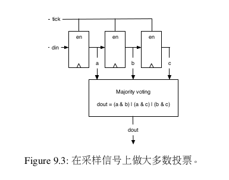
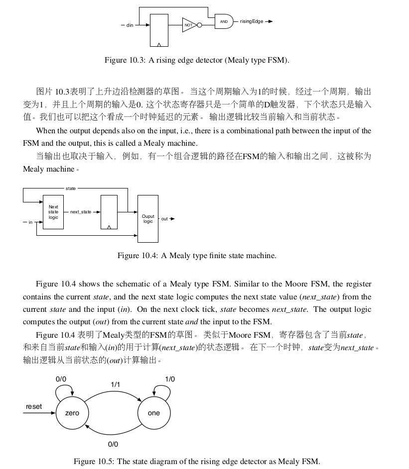
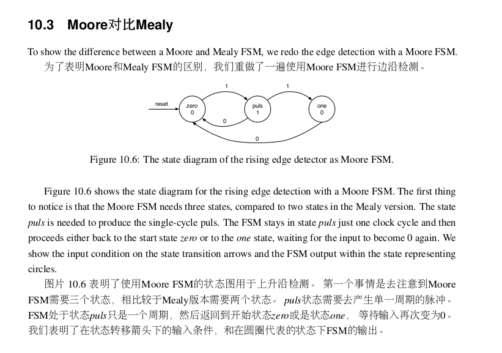
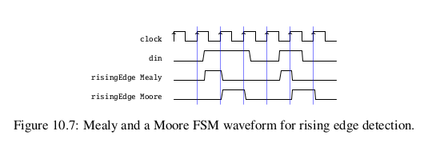
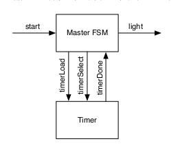
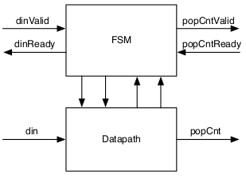
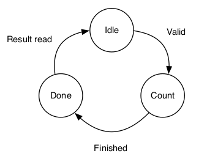
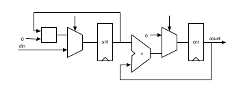
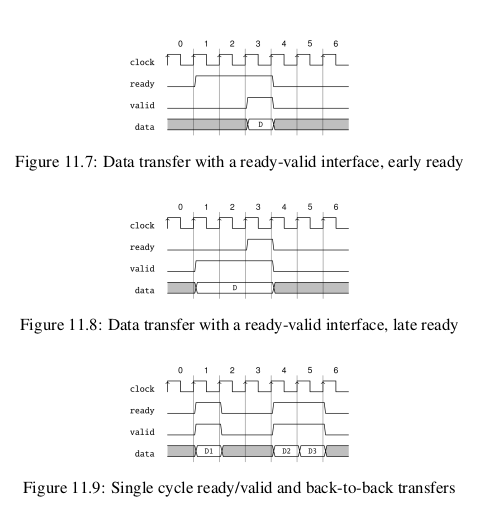

- [7.输入处理](#7输入处理)
  - [7.1异步输入](#71异步输入)
  - [7.2防抖动](#72防抖动)
  - [7.3输入信号滤波](#73输入信号滤波)
  - [7.4使用函数合并输入处理](#74使用函数合并输入处理)
  - [7.5练习](#75练习)
    - [源代码部分](#源代码部分)
    - [测试代码](#测试代码)
    - [将生成的verilog与nvboard连接](#将生成的verilog与nvboard连接)
- [8.有限状态机](#8有限状态机)
  - [8.1基本有限状态机](#81基本有限状态机)
  - [8.2使用Mealy FSM产生快速输出](#82使用mealy-fsm产生快速输出)
  - [8.3Moore对比Mealy](#83moore对比mealy)
  - [8.4练习](#84练习)
- [9.状态机通信](#9状态机通信)
  - [9.1 一个灯光闪烁器的例子](#91-一个灯光闪烁器的例子)
  - [9.2 具有数据通路的状态机](#92-具有数据通路的状态机)
    - [9.2.1 位一计数的例子](#921-位一计数的例子)
  - [9.3 Ready-Valid界面](#93-ready-valid界面)
- [10.硬件生成器](#10硬件生成器)
  - [10.2 使用参数配置](#102-使用参数配置)
    - [10.2.1 简单参数](#1021-简单参数)
    - [10.2.2 使用类型参数的函数](#1022-使用类型参数的函数)
    - [10.2.3 具有类型参数的模块](#1023-具有类型参数的模块)
    - [10.2.4 参数化Bundle](#1024-参数化bundle)
  - [10.3 生成组合逻辑](#103-生成组合逻辑)
  - [10.4 使用继承](#104-使用继承)
  - [10.5 使用函数式编程做硬件生成](#105-使用函数式编程做硬件生成)


# 7.输入处理
## 7.1异步输入
我们不能防止多稳态，但是我们可以容纳这个问题，一个经典的解法是在输入使用两个触发器。这个的假设是：当这个触发器在多稳态的时候，他会在一个周期后收敛到稳定，所以第二个触发器的建议和保持时间都不会被违反。  

**用于输入的同步器的chisel代码是一行代码实现的两个寄存器：**  
```
val btnSync = RegNext(RegNext(btn))
```  
所有的同步外部信号需要一个输入同步。我们也需要同步一个外部的重置信号。这个重置信号应该先通过两个触发器，再被其他触发器使用，作为重置信号。具体的重置信号零，需要同步到时钟。  

## 7.2防抖动
防抖动的chisel代码是同步器改进的。我们使用计数器生成一个采样，表达一个周期的tick信号。  
```
val FAC = 100000000/100
val btnDebReg = Reg(Bool())
val cntReg = RegInit(0.U(32.W))
val tick = cntReg === (FAC - 1).U

cntReg := cntReg + 1.U
when(tick) {
    cntReg := 0.U
    btnDebReg := btnSync
}
```  
首先，我们需要决定采样频率。以上的例子是加设一个100MHZ的时钟，和导致的采样频率位100HZ（假设震荡时间小与10ms）。最大计数器值是FAC，除法的隐子。我们定义一个寄存器btnDebReg用于防抖动的信号，只是没有重置的值。寄存器cntReg作为计数器，tick信号为真，当计数器到达了最大值，在那种情况下，when的条件是true，（1）计数器的重置是0,（2）防抖动寄存器存储输入采样，在我们的例子里，输入信号被称为btnSync。  

## 7.3输入信号滤波
滤掉一些毛刺的方法是使用大多数投票电路。在最简单的情况，我们做三次采样，并执行大多数投票。大多数函数是和中值函数相关的，也就是大多数的数值。在我们的例子里，我们使用防抖动采样，我们采用了大多数投票，在采样信号。大多数投票确保了信号可以比采样周期的稳定时间更长。  
  
例子中的大多数投票电路，包括3位移位寄存器，使能端被用于防抖动的tick信号触发，输出的三个寄存器反馈到大多数投票电路。大多数投票函数滤掉任何比采样信号变化短的信号。(这个大多数投票是很少需要的)以下chisel代码：  
```
val shiftReg = RegInit(0.U(3.W))
when(tick) {
    //左移并输入LSB
    shiftReg := Cat(shiftReg(1, 0), btnDebReg)
}

    //大多数投票
    val btnClean = (shiftReg(2) & shiftReg(1) | (shiftReg(2) & shiftReg(0)) | shiftReg(1) & shiftReg(0))
```  
为了使用我们精心处理的输入信号的输出，我们首先使用RegNext延迟元素检测上升沿，然后把这个信号和当前值btnClean比较，使能计数器自增。  
```
val risingEdge = btnClean & !RegNext(btnClean)

// 使用反弹的上升边缘和
// 过滤按钮进行计数
val reg = RegInit(0.U(8.W))
when(risingEdge) {
    reg := reg + 1.U
}
```  

## 7.4使用函数合并输入处理
为了总结输入处理，我们显示了更多的chisel代码，我们呈现的电路可能很小，但是这些是可复用搭建模块，我们把这些包裹成函数。同时也展示如何使用轻量级chisel函数把小的搭建模块抽象化，而不是整个模块。那些chisel函数创造了硬件实例，例如sync函数创造了两个触发器相互连接到输入。函数返回了第二个触发器的输出，如果有用的话，这些函数可以用来当作工具类的对象。  
```

def sync(v: Bool) = RegNext(RegNext(v)) //两级同步寄存器处理，消除亚稳态问题

def rising(v: Bool) = v & !RegNext(v)   //检测上升沿，当前值为高且前一个时钟周期值为低

//防抖动电路
def tickGen(fac: Int) = {                   //生成分频时钟信号
    val reg = RegInit(0.U(log2Up(fac).W))   //定义计数器，宽度取决于 fac 的对数向上取整
    val tick = reg === (fac - 1).U          //生成tick信号
    reg := Mux(tick, 0.U, reg + 1.U)        
    tick
}

//对输入信号进行三级滤波，当触发信号t为高时更新寄存器reg
//滤波结果是寄存器中最近三个信号值的“大多数投票”结果
def filter(v: Bool, t: Bool) = {
    val reg = RegInit(0.U(3.W))     //定义一个3位寄存器，初始化为0
    when(t) {                       //当触发信号t为高，更新寄存器内容，按位移方式添加新值v
        reg := Cat(reg(1, 0), v)
    }
    //返回寄存器中最近三次信号的“多数投票”结果
    (reg(2) & reg(1)) | (reg(2) & reg(0)) | (reg(1) & reg(0))
}

val btnSync = sync(btn)     //将按钮输入信号btn通过两级同步寄存器处理

val tick = tickGen(fac)     //生成一个分频时钟信号tick，频率为系统时钟的1/fac
val btnDeb = Reg(Bool())    //定义布尔寄存器，用于存储同步后的按钮信号
when(tick) {                //每当tick有效，对布尔寄存器btnDeb进行更新
    btnDeb := btnSync
}

val btnClean = filter(btnDeb, tick) //使用三级滤波器对去抖信号btnDeb进行一步清理
val risingEdge = rising(btnClean)   //检测清理后的按钮信号的上升沿

// 使用去抖后的按钮信号的上升沿触发计数器的加一操作
// 并对计数结果存储在 8 位寄存器 reg 中
val reg = RegInit(0.U(8.W))
when(risingEdge) {      //当检测到按钮清理信号的上升沿时，计数器加一
    reg := reg + 1.U
}
```  

该代码整体实现了如下功能：  
**1.按钮去抖：** 通过sync和filter对按钮输入信号进行同步和三级滤波，清除可能的抖动。  
**2.上升沿检测：** 使用rising检测清理后的按钮信号的上升沿。  
**3.分频生成信号：** tickGen根据输入参数fac生成分频信号，用作计数器和滤波触发信号。  
**4.计数功能：** 通过按钮上升沿触发计数器reg的加一操作，结果存储在寄存器中。  
实现了一个稳定的按钮输入信号处理和计数器逻辑。  

## 7.5练习
### 源代码部分
```
import chisel3._
import chisel3.util._


//顶层模块
class Top(fac : Int = 10000) extends Module {
  val io = IO(new Bundle {
    val btn = Input(Bool())
    val led = Output(UInt(8.W))
  })

  //输入同步器
  def sync(v: Bool) = RegNext(RegNext(v))
  val btnsync = sync(io.btn)              //将按钮信号通过输入同步器

  //防抖动电路（生成分频信号）
  def tickGen(fac: Int) = {
    val reg = RegInit(0.U(log2Up(fac).W))
    val tick = reg === (fac - 1).U
    reg := Mux(tick, 0.U, reg + 1.U)
    tick
  }
  val tick = tickGen(fac) //生成一个分频信号

  val btnDeb = Reg(Bool())  //定义布尔函数寄存器，存储同步后按钮信号
  when(tick) {              //当tick有效，根系布尔函数寄存器
    btnDeb := btnsync
  }

  //大多数投票
  def filter(v: Bool, t: Bool) = {
    val reg = RegInit(0.U(3.W))
    when(t) {
      reg := Cat(reg(1, 0), v)
    }
    (reg(2) & reg(0)) | (reg(2) & reg(1)) | (reg(1) & reg(0))
  }
  val btnClean = filter(btnDeb, tick) //滤波处理信号

  //边沿检测
  def rising(v: Bool): Bool = v & !RegNext(v) // 检测上升沿
  val risingEdge = rising(btnClean)           //检测清理后的按钮信号的上升沿

  //计数器逻辑
  val counter = RegInit(0.U(8.W))
  when(risingEdge) {
    counter := counter + 1.U
  }

  //输出到LED显示
  io.led := counter

}


object Top extends App {
  (new chisel3.stage.ChiselStage).emitVerilog(new Top())
}

```  
### 测试代码
```
import chisel3._
import chiseltest._
import org.scalatest.flatspec.AnyFlatSpec

class TopTest extends AnyFlatSpec with ChiselScalatestTester {
    behavior of "Top"
    it should "LED灯正确的进行闪烁" in {
        test(new Top(fac = 10)) { dut =>
            dut.clock.setTimeout(100000)

           //初始化输入和检查初始状态
           dut.io.btn.poke(false.B) //初始按钮状态为低
           dut.clock.step(10)       //运行几个周期稳定状态
           dut.io.led.expect(0.U)   //初始计数器为0

           //模拟按钮按下并保持一段时间
           dut.io.btn.poke(true.B)
           dut.clock.step(20000)
           dut.io.led.expect(1.U)

           //按钮送开后，再次按下
           dut.io.btn.poke(false.B)
           dut.clock.step(20000)
           dut.io.btn.poke(true.B)
           dut.clock.step(20000)
           dut.io.led.expect(2.U)

           //快速切换按钮状态（测试抖动情况）
           for (_ <- 0 until 5) {
            dut.io.btn.poke(true.B)
            dut.clock.step(5)
            dut.io.btn.poke(false.B)
            dut.clock.step(5)
           } 
           dut.clock.step(20000)    //等待防抖电路处理
           dut.io.led.expect(2.U)

           //再次按下按钮
           dut.io.btn.poke(true.B)
           dut.clock.step(20000)
           dut.io.led.expect(3.U)
        
        }
    }
}
```  
**测试结果：**  
```
yjx@yjx-Lenovo-Legion-R7000-2020:~/Mystudy/yjx_learn/Learn_Chisel/Myexercise/ex9.5$ sbt test
[info] welcome to sbt 1.10.6 (Ubuntu Java 11.0.25)
[info] loading project definition from /home/yjx/Mystudy/yjx_learn/Learn_Chisel/Myexercise/ex9.5/project
[info] loading settings for project ex9-5 from build.sbt...
[info] set current project to ex9-5 (in build file:/home/yjx/Mystudy/yjx_learn/Learn_Chisel/Myexercise/ex9.5/)
[info] compiling 1 Scala source to /home/yjx/Mystudy/yjx_learn/Learn_Chisel/Myexercise/ex9.5/target/scala-2.12/test-classes ...
[info] TopTest:
[info] Top
[info] - should LED灯正确的进行闪烁
[info] Run completed in 5 seconds, 873 milliseconds.
[info] Total number of tests run: 1
[info] Suites: completed 1, aborted 0
[info] Tests: succeeded 1, failed 0, canceled 0, ignored 0, pending 0
[info] All tests passed.
[success] Total time: 10 s, completed Jan 2, 2025, 2:32:36 PM

```  
### 将生成的verilog与nvboard连接

# 8.有限状态机
有限状态机FSM是一个数字电路中的基本搭建模块。一个FSM可以被描述为一个states和（有限制的）状态条件state transitions。一个FSM有一个初始状态，这是在reset中被确定的。FSM也被称为同步时序电路。FSM的实现包括三个部分：（1）一个具有现在状态的寄存器。（2）组合逻辑根据目前状态和输入计算下一个状态。（3）组合逻辑能够计算FSM的输出。  

原则上，每个数字电路包含一个寄存器或是其他存储器元件用来储存状态，可以被称为一个FSM。但是这可能不实用。例如吧你的电脑描述为一个FSM。  
## 8.1基本有限状态机
使用chisel描述一个FSM：  
```
import chisel3._
import chisel3.util._

class SimpleFsm extends Module {
    val io = IO(new Bundle {
        val badEvent = Input(Bool())
        val clear = Input(Bool())
        val ringBell = Output(Bool())
    })

    //3个状态
    val green :: orange :: red :: Nil = Enum(3)

    //使用寄存器来存储当前状态，初始状态为green
    val stateReg = RegInit(green)

    //定义状态转移逻辑
    switch(stateReg) {              //根据stateReg选择当前状态
        is (green) {
            when(io.badEvent) {
                stateReg := orange
            }
        }
        is (orange) {
            when(io.badEvent) {
                stateReg := red
            } .elsewhen(io.clear) {
                stateReg := green
            }
        }
        is (red) {
            when (io.clear) {
                stateReg := green
            }
        }
    }
    
    io.ringBell := stateReg === red
}
```  
记住我们没有引入next_state作为寄存器输入，尽管这个在verilog或是VHDL是常见的。vrilog和VHDL的寄存器被表述为一个特定的形式，在一个组合框架并且不能赋值或是重复赋值。于是额外的信号，在组合框架被计算出来并连接给寄存器的输入。在chisel，寄存器是一个基础类型，可以通过组合框架免费使用。  

## 8.2使用Mealy FSM产生快速输出
在一个Moore FSM，输出值只取决于当前状态，那意味着输入改变可以被看成导致最早的下一个周期的输出改变。如果我们想要观察一个间接的改变，我们需要一个组合路径，从输入到输出。让我们像一个最小的例子，在边沿检测电路。我们可能以前看过这一行chisel代码：  
```
val risingEdge = din & !RegNext(din)
```  
  
图10.5表明Mealy FSM的状态图，用于边沿检测，作为状态寄存器，包含了只是一个D触发器，只有两个状态是可能的，在这个例子中是zero和one。  

作为Mealy FSM的输出，并不只是依赖于状态，也依赖于输入，我们不能描述输出作为状态圆的一部分。相反，状态间的转移函数和输入值和输出值是一起被标出的。注意到我们画本身的状态转移，例如，在状态0当输入是0,FSM停留在0,输出是0,FSM的上升沿产生1作为输出，只有当从状态0转移到1。在状态1,输出是0.我们想要一个对于每个输入的上升沿，产生单一周期的跳变。  
```
import chisel3._
import chisel3.util._

class RisingFsm extends Module {
    val io = IO(new Bundle {
        val din = Input(Bool())
        val risingEdge = Output(Bool())
    })

    //有两个状态
    val zero :: one :: Nil = Enum(2)

    //状态存储
    val stateReg = RegInit(zero)

    //输出默认值
    io.risingEdge := false.B

    //状态转移逻辑
    switch(stateReg) {
        is (zero) {
            when(io.din) {
                stateReg := one
                io.risingEdge := true.B
            }
        }
        is (one) {
            when(!io.din) {
                stateReg := zero
            }
        }
    }
}
```  
## 8.3Moore对比Mealy
  
```
import chisel3._
import chisel3.util._

class RisingMooreFsm extends Module {
    val io = IO(new Bundle {
        val din = Input(Bool())
        val risingEdge = Output(Bool())
    })

    //有3种状态
    val zero :: puls :: one :: Nil = Enum(3)

    //状态存储
    val stateReg = RegNext(zero)

    //状态转移逻辑
    switch(stateReg) {
        is (zero) {
            when(io.din) {
                stateReg := puls
            }
        }
        is (puls) {
            when(io.din) {
                stateReg := one
            } .otherwise {
                stateReg := zero
            }
        }
        is(one) {
            when(!io.din) {
                stateReg := zero
            }
        }
    }
    io.rinsingEdge := stateReg === puls
}
```  
上面代码表明了Moore版本的上升沿检测电路。该版本使用了是 Mealy 或直接编码版本两倍数量的 D 触发器。因此，生成的下一状态逻辑也比 Mealy 或直接编码版本更复杂。  

  
该图表明了Mealy和Moore版本的上升沿检测FSM。你可以看到Mealy输出紧紧跟随上升边沿，当Moore输出在时钟tick后上升。我们也可以看到Moore输出是一个时钟周期的宽度，而Mealy输出一般小于一个时钟周期。  

从以上的例子，可以发现Mealy FSM是更好的，因为它需要更少的状态（和逻辑），并比Moore反应更快。但是，在一个Mealy机器中，组合电路可能在更大规模的制造上存在麻烦。首先，具有一串通信FSM，这个组合通路可以很长。其次，如果FSM的通信形成一个圆圈，会造成组合回馈，在同步设计造成错误。由于具有状态寄存器的组合通路的一个切割形成的Moore FSM，上述问题在Moore FSM通信不存在。  

总结来说，Moore FSM在状态机间通信的组合是更好的，他们比Mealy FSM更加稳定。使用Mealy FSM只是当关注在相同周期的反应下更为重要。  

## 8.4练习

# 9.状态机通信
一个问题是，使用单一FSM描述一个电路是复杂的。在那种情况下，这个问题可以被分为两个或更小更简单的FSM。这些FSM使用信号通信。一个FSM的输出是另一个FSM的输入，并且这个FSM观察另一个FSM的输出。当我们把一个大型FSM分解为简单的FSM，这个被称为分解FSM。然而，通常通信的FSM会直接从规范中设计，因为单个FSM往往会变得过于庞大而不可行。

## 9.1 一个灯光闪烁器的例子
为了讨论通信的FSM，我们使用一个例子，灯光闪烁器。灯光闪烁器有一个输入start和一个输出light。一个灯光闪烁器的规范如下：  
    1.当start在一个时钟周期为高电平时，闪烁序列开始。  
    2.一个序列闪烁三次。  
    3.当light变on为六个时钟周期，在两次闪烁中间变off为4个时钟周期。  
    4.在序列之后，FSM改变light off并且等待下一次开始。  

用于直接实现的FSM有27种状态：一个初始状态用于等待输入，3 × 6个状态用于表示三次点亮阶段，以及2 × 4个状态用于表示两次熄灭阶段。我们在此不展示这种简单实现的灯光闪烁器的代码。这个问题可以通过更优雅地分解大型FSM为两个更小的FSM：主FSM实现了闪烁逻辑，并且计数器FSM实现了等待。  
  
计数器FSM通过倒数6个或4个时钟周期来生成所需的时序。定时器的规范如下：  
    1.当timerLoad信号为高电平，计数器会将一个值加载到递减计数器中，这一操作与当前状态无关。  
    2.timerSelect 在5或3之间选择加载到计数器的值。  
    3.timerDone信号为高电平，当计数器完成倒计时并保持激活状态时。  
    4.否则，计数器继续倒数。  

以下代码表示灯光闪烁器的计数器FSM：  
```
val timerReg = RegInit(0.U)
timerDone := timerReg === 0.U

//计数器FSM（倒数计时）
when(!timerDone) {
    timerReg := timerReg - 1.U
}
when(timerLoad) {
    when(timerSelect) {
        timerReg := 5.U
    } .otherwise {
        timerReg := 3.U
    }
}
```  

以下表示了主FSM：  
```
//定义状态枚举
val off :: flash1 :: space1 :: flash2 :: space2 :: flash3 :: Nil = Enum(6)
    val stateReg = RegInit(off)         //初始状态为off

    //定义一个输出信号light，初始值为false.B，表示灯光的开关状态
    val light = WireDefault(false.B)    //FSM输出

//计时器连接
val timerLoad = WireDefault(false.B)    //启动带加载的计时器
val timerSelect = WireDefault(true.B)   //选择6或4周期
val timerDone = Wire(Bool())            //计时器完成信号

//当timerDone为真时，timerLoad被设置为真，表示计时器需要重新加载
timerLoad := timerDone

//主FSM
switch(stateReg) {
    is(off) {   //off状态，初始化计时器并等待start信号
        timerLoad := true.B                     //启动计时器加载
        timerSelect := true.B                   //选择6周期
        when(start) { stateReg := flash1 }      //切换状态
    }
    is(flash1) {    //flash1状态，点亮灯并等待计时器完成
        timerLoad := false.B                    //停止计时器加载
        light := true.B                         //点亮灯
        when(timerDone) { stateReg := space1 }  //切换状态
    }
    is(space1) {    //space1状态，等待计时器完成并切换状态
        when(timerDone) { stateReg := flash2 }
    }
    is(flash2) {    //flash2状态，点亮灯并等待计时器完成
        timerSelect := false.B                  //选择4周期
        light := true.B                         //点亮灯
        when(timerDone) { stateReg := space2 }  //切换状态
    }
    is(space2) {    //space2状态，等待计时器完成并切换状态
        when(timerDone) { stateReg := flash3 }
    }
    is(flash3) {    //flash3状态，点亮灯并等待计时器完成，回到off状态
        timerSelect := false.B                  //选择4周期
        light := true.B                         //点亮灯
        when(timerDone) { stateReg := off }     //切换状态
    }
}

```  
这种采用主FSM和计时器的解决方案在主FSM的代码中仍然存在冗余。状态flash1,flash2,flash3执行相同的函数，状态space1和space2也是如此。我们可以将剩余的闪烁次数提取到一个单独的计数器种。这样，主FSM就可以简化为三个状态：off，flash和space。  
代码如下：  
```
val cntReg = RegInit(0.U)   //定义一个计数器寄存器，初始值为0,用于记录剩下的闪烁次数
cntDone := cntReg === 0.U   //当cntReg为0时，cntDone为真，表示计数器已完成

//计数器FSM，递减计数
when(cntLoad) { cntReg := 2.U }             //初始值为2
when(cntDecr) { cntReg := cntReg - 1.U }    //递减1

val timerReg = RegInit(0.U)                 //定义寄存器，初始值为0
timerDone := timerReg === 0.U               //此时表示计数已完成

//计时器FSM
when(!timerDone) {
    timerReg := timerReg - 1.U              //当计时器未完成时，递减计时器
}
when(timerLoad) {
    when(timerSelect) {
        timerReg := 5.U
    }   .otherwise {
        timerReg := 3.U
    }
}
    io.light := light
```  
注意到，计数器读到2时闪烁3次，因为它计数剩下的闪烁，当计数器结束的时候减少状态量.  
```
//定义状态枚举
val off :: flash :: space :: Nil = Enum(3)
    val stateReg = RegInit(off)             //初始状态为off

    val light = WireDefault(false.B)        //输出信号，初始值为false.B

    //计数器FSM
    val timerLoad = WireDefalut(false.B)    //启动带加载的计数器
    val timerSelect = WireDefalut(true.B)   //选择6或4周期
    val timerDone = Wire(Bool())            //计数器完成信号

    //计数器连接逻辑
    val cntLoad = WireDefault(false.B)      //加载计数器初始值信号
    val cntDecr = WireDefault(false.B)      //计数器递减信号
    val cntDone = Wire(Bool())              //计数器完成信号

    //当timerDone为真，timerLoad被设置为真，表示计时器需要重新加载
    timerLoad := timerDone

    //主FSM逻辑
    switch(stateReg) {
        is(off) {
            timerLoad := true.B                 //启动计时器加载
            timerSelect := true.B               //选择6周期
            cntLoad := true.B                   //加载计数器初始值
            when(start) ( stateReg := flash )   //切换状态
        }
        is(flash) {
            timerSelect := false.B              //选择4周期
            light := true.B                     //点亮
            when(timerDone & !cntDone) { stateReg := space }    //计数器未完成
            when(timerDone & cntDone) { stateReg := off }       //计数器完成
        }
        is(space) {
            cntDect := timerDone                    //当计时器完成时，递减计数器
            when(timerDone) { stateReg := flash}    //切换状态
        }
    }
```  
除了有一个缩减到三个状态的主FSM，我们当前解决方案也是一个更好的可配置的。没有FSM需要被改变如果我们想要改变开关间隔的长度或闪烁次数。在这个部分，我们已经探索了电路间的通信，特别是FSM，那只是交换控制信号。然而，电路也可以交换数据。为了协调数据的交换，我们用握手信号。下一个部分描述了用于单向数据交换流控制的ready-valid。  

## 9.2 具有数据通路的状态机
一个通信状态机的典型例子是具有数据通路的状态机。这个组合被称为具有数据通路的有限状态机FSMD。这个状态机控制着数据通路，并且数据通路执行计算。这个FSM的输入是环境的输入和数据通路的输入。来自环境的数据输入到数据通路，数据输出则来自数据通路。  
下图是一个具有数据通路的FSM组合的例子：  

  

### 9.2.1 位一计数的例子
FSMD在上面图片作为一个例子去计算popcount（也称为汉明重量）。汉明重量是不同于零符号的符号数量。对于二进制字符串，这就是“1”的数量。  
这个popcount单元包含数据输入din和结果输出popCount，都连接到数据通路。对于输入和输出，我们使用ready-alid握手信号。当数据是可用的，vaild会出现。当一个接收器可以接收数据则出现ready。当信号都出现，开始传输信号。握手信号传给FSM。FSM与数据通路相连，通过控制信号向数据通路发送指令，并通过状态信号从数据通路接收反馈。  

作为下一步，我们可以设计FSM，从状态图开始，如图上面第二个图片那样。我们从Idle状态开始，这里FSM等待输入。当数据到达，并通过有效信号进行指示，FSM会进入load状态，以加载移位寄存器。FSM进行到下一个状态Count，这里的“1”是按顺序读取。我们使用一个移位寄存器，一个加法器，一个累加寄存器和一个向下计数器来完成计算。当向下计数器到达0,我们完成并且FSM移动到状态Done。这里具有valid信号的FSM，它的位1计数开始被读取，接收到接受器的ready信号以后，FSM返回到Idle状态，开始计算下一个位1计算。顶层部分，像是如下代码初始画了FSM和数据通路的部分，并且使用整体连线的方式进行连线。  
```
//定义名为PopCount的模块
class PopCount extends Module {
    val io = IO(new Bundle {                //模块的输入输出接口
        val dinValid = Input(Bool())        //输入数据有效信号
        val dinReady = Output(Bool())       //输入数据准备好信号
        val din = Input(UInt(8.W))          //输入数据，8位宽
        val popCntValid = Output(Bool())    //计算结果有效信号
        val popCntReady = Input(Bool())     //计算结果准备好信号
        val popCnt = Output(UInt(4.W))      //计算结果（1的个数），4位宽
    })

    val fsm = Module(new PopCountFSM)       //实例化有限状态机模块
    val data = Module(new PopCountDataPath) //实例化数据通路模块

    //将输入信号连接到FSM
    fsm.io.dinValid := io.dinValid          //输入数据有效信号传递给FSM   
    io.dinReady := fsm.io.dinReady          //FSM的输入数据准备好信号传递给外部
    io.popCntValid := fsm.io.popCntValid    //FSM的计算结果有效信号传递给外部
    fsm.io.popCntReady := io.popCntReady    //外部计算结果准备好信号传递给FSM

    //将输入信号连接到数据通路
    data.io.din := io.din                   //输入数据传递给数据通路模块
    io.popCnt := data.io.popCnt             //数据通路模块的计算结果传递给外部
    data.io.load := fsm.io.load             //FSM的加载信号传递给数据通路模块
    fsm.io.done := data.io.done             //数据通路模块的完成信号传递给FSM
}
```  
  
该图表明了位1计数电路的数据通路。数据被读取到shf寄存器。在读取端，cnt寄存器被重置为0.为了计数1的数量，shf寄存器是向右移动，并且每个时钟周期最低有效位是添加到cnt。一个计数器没有在图中展示，向下计数，直到所有二进制位移动到最低位。当计数器到达零时，位1计算完成。FSM变换到状态Done并且通过置位popCntReady信号来指示结果已经就绪。当结果被读取时，FSM切换状态Idle。对于load信号，regData寄存器作为输入被读取，regPopCount寄存器重置为0,计数器寄存器regCount设为需要移位的数量。  
```
class PopCountDataPath extends Module {
    val io = IO(new Bundle {
        val din = Input(UInt(8.W))          //输入数据，8位宽
        val load = Input(Bool())            //加载信号，用于加载输入数据
        val popCnt = Output(UInt(4.w))      //计算结果（1的个数），4位宽
        val done = Output(Bool())           //完成信号，指示计算是否完成
    })

    //定义寄存器
    val dataReg = RegInit(0.U(8.W))         //用于存储输入数据的寄存器
    val popCntReg = RegInit(0.U(8.W))       //用于存储1的个数的寄存器
    val counterReg = RegInit(0.U(4.W))      //计数器寄存器，用于控制计算过程

    //数据移位和1的个数计算逻辑
    dataReg := 0.U ## dataReg(7, 1)         //将dataReg右移一位，最低位补0
    popCntReg := popCntReg + dataReg(0)     //累加dataReg的最低位到popCntReg

    //完成信号逻辑
    val done = counterReg === 0.U           //当计数器为0时，计算完成
    when(!done) {                           
        counterReg := counterReg - 1.U      //计数器递减1
    }

    //加载逻辑
    when(io.load) {
        dataReg := io.din                   //加载输入数据到dataReg
        popCntReg := 0.U                    //重置1的个数计数器
        counterReg := 8.U                   //初始化计数器为8
    }

    //打印调试信息
    printf("%x %d\n", dataReg, popCntReg)

    //输出结果
    io.popCnt := popCntReg                  //输出1的个数
    io.done := done                         //输出完成信号
}

//定义计数器和完成信号逻辑
val cntReg = RegInit(0.U(8.W))              //计数器寄存器，8位宽
val done = cntReg === 0.U                   //完成信号，当计数器为0时完成

//定义下一个状态逻辑
val next = WireInit(0.U)                    //下一个状态的值
when(load) {
    next := din                             //如果加载信号有效，加载输入数据
} .elsewhen(!done) {                        
    next := cntReg - 1.U                    //否则计数器递减1
}
cntReg := next                              //更新计数器寄存器的值
```  
另一方面，regData寄存器向右移动，regData寄存器的最低有效位被加到regPopCount寄存器中，并且计数器递减直到为0.当计数器为0时，输出包含popcount（位1计数）。FSM是从状态idle开始。一旦输入（dinValid）有效，它切换到状态count并且等待数据通路完成计算。当位1计算结果是有效的，FSM切换到状态done并且等待位1计算结果读取（通过popCntReady）。  

## 9.3 Ready-Valid界面
子系统通信可以概括为数据的流动和用于流控制的握手协议。在位一计算的例子中，我们已经看到了使用valid和ready信号的输入输出数据的握手接口。这是一个简单的控制流界面，包含了data和valid在发送端，ready信号在接收端。发送端声明valid当data是有效的时候，并且接收端开始接收一个子长的数据，它声明了ready。当两边信号valid和ready全部被声明的时候，数据传输开始。如果两边信号有一边没有被声明，则没有传输发生。  
  
图11.7展示了一个ready-valid事务的时间图，这里接收信号ready（从时钟周期1开始）在发送数据之前。数据在时钟周期3开始传输。从时钟周期4开始，发送者没有数据，或是接收器没有准备好下一个传输。当接收者在每个时钟周期能够接收数据，这被称为“随时就绪”的界面，ready可以被硬件设置为true。  

图11.8展示了一个ready-valid事务的时间图，其中发送方在接收方准备好之前（从时钟周期1开始）发出valid信号。数据传输发生在时钟周期3。从时钟周期4开始，发送方既没有数据，接收方也没有准备好进行下一次传输。类似于“始终就绪”接口，我们可以设想一个“始终有效”的接口。然而，在这种情况下，数据可能不会在发出ready信号时改变，因此我们可以简单地省略握手信号。  

图11.9展示更多ready-valid接口。在时钟周期1两个信号（ready和valid）仅在一个时钟周期内同时有效，此时数据D1的传输发生。数据可以连续传输（每个时钟周期），如时钟周期4和5所示，其中串述了数据D2和D3。为了让这个界面可以组成，ready或valid都不允许互相组合性依赖。因为这个接口比较常用。chisel定义了DecoupledIO线束，类似于：  
```
class DecoupledIO[T <: Data](gen: T) extends Bundle {
    val ready = Input(Bool())
    val valid = Output(Bool())
    val bits = Output(gen)
}
```  
DecoupledIO线束是可参数化的，通过配置data的类型。chisel定义的接口，使用数据的bits域。  

剩下一个问题是，ready或valid信号在激活后但未发生数据传输时是否可以被取消。例如，一个接收者可能准备好了一段时间并且没有接收到数据，但是由于其他数据变得不再就绪了。同样，发送方也可能仅在部分时钟周期保持数据有效，而在未发生数据传输时变为无效。这种行为是否被允许并不是ready-valid接口的一部分，而是需要由接口的具体使用场景来定义。

chisel没有要求ready和valid的信号设置前置条件，当使用DecoupledIO类时。然而，DecoupledIO类在接收方放置了以下条件：
    一个具体的ReadyValidIO子类，承诺在valid为高且ready为低的周期后不会改变数据位的值。此外，一旦valid被拉高，它将永远不会被拉低，直到ready也被拉高之后。

注意这是一个习惯，并不能被rrevocableIO类强制规范。  

AXI为总线的以下每个部分使用ready-valid接口：读地址，读数据，写地址，写数据。AXI限制该接口，一旦ready或valid被置位，在数据传输完成之前不允许取消置位。  

# 10.硬件生成器
chisel的强处是它允许我们去写所谓的硬件生成器。有了旧的硬件描述语言，类似于VHDL和Verilog，我们通常使用另一个语言，像是java或python来生成硬件。作者经常编写小型java程序去生成VHDL网表。而在Chisel中，Scala（以及Java库）的全部功能都可以在硬件构建过程中使用。因此，我们可以用同一种语言编写硬件生成器，并将其作为Chisel电路生成的一部分来执行。  

scala有两类变量：val和var。val为表达式赋予一个名称，并且不能重新赋值。以下代码片段展示了一个名为zero的整数值的定义。如果我们尝试为zero重新赋值，将会导致编译错误。  
```
val zero = 0
zero = 3    // 错误
```  
在chisel我们使用val只是命名硬件部分。注意:=是chisel的操作符，而不是scala操作符。  

我们使用循环用作电路生成器。以下的循环连接移位寄存器的每一位。  
```
val shiftReg = RegInit(0.U(8.W))

shiftReg(0) := inVal

//使用循环将寄存器的每一位依次向后移动
for (i <- 1 until 8) {
    shiftReg(i) := shiftReg(i - 1)  //将前一位的值赋给当前位，实现移位操作
}
```   
条件通过if和else来表达。注意到这个条件是在电路生成期间由scala运行时评估的。这种结构并不会创建一个多路复用器。  
```
for(i <- 0 until 10) {
    if(i % 2 == 0) {
        println(i + "is even")
    } else {
        println(i + "is odd")
    }
}
```  
## 10.2 使用参数配置
chisel组成部分和函数可以通过参数来配置。参数可以像整数常量一样简单，但是也可以称为chisel硬件类型。  

### 10.2.1 简单参数
参数化电路的基本方法是将位宽定义为一个参数。参数可以作为参数传递给chisel模块的构造函数。以下例子是一个简单的例子，该模块实现了一个可配置位宽的加法器。位宽n是传递给构造函数的组件参数（scala类型为Int），可以在IO bundle中使用。  
```
class ParamAdder(n: Int) extends Module {
    val io = IO(new Bundle {
        val a = Input(UInt(n.W))
        val b = Input(UInt(n.W))
        val c = Output(UInt(n.W))
    })

    io.c := io.a + io.b
}
```  
加法器的参数化版本可以像如下被创造：  
```
val add8 = Module(new ParamAdder(8))
val add16 = Module(new ParamAdder(16))
```  
### 10.2.2 使用类型参数的函数
有了位宽作为配置参数只是硬件生成器的起点。一个非常灵活的配置方式是使用类型。这个特征允许用chisel来提供一个多路复用器（Mux），它能接受任何类型进行多路复用。为了展示如何使用类型进行配置，为了展示如何使用类型来进行配置，我们建造一个多路复用器来接受任意的类型。以下函数定义一个多路复用器：  
``` 
//定义一个泛型函数，实现多路复用器功能
//T是泛型类型参数，限制为Data的子类
//sel是选择信号，tPath 和 fPath 是两个输入路径，类型为 T
def myMux[T <: Data](sel: Bool, tPath: T, fPath: T): T = {

    //创建一个wire，默认值为fPath
    val ret = WireDefault(fPath)

    //当sel为真，将ret的值设置为tPath
    when(sel) {
        ret := tPath
    }
    ret     //返回输出
}
```  
chisel允许使用类型对函数进行参数化，在我们的例子中使用chisel类型。方括号中的表达式[T <: Data]定义了一个类型参数T，它是Data或是Data的一个子类。Data是chisel类型系统的根类型。  

我们的复用器函数有三个参数：布尔条件，一个参数用于true通路，和一个参数用于false通路。两个参数都是类型T，在函数调用时提供信息。这个函数本身非常直接：我们定义一个wire的默认值是fPath并且在条件为真时改变这个值为tPath。这个条件是常见的多路复用器函数。在函数结束时我们返回多路复用器的硬件。我们可以使用我们的多路复用器函数用于简单类型，如UInt：  
```
val resA = myMux(selA, 5.U, 10.U)
```  
两个多路复用器线路的类型需要一致。以下多路复用器的错误使用会导致一个运行时间错误：  
```
val resErr = myMux(selA, 5.U, 10.S)
```  

我们将我们的类型定义为一个包含两个子端的Bundle：  
```
class ComplexIO extends Bundle {
    val d = UInt(10.W)
    val b = Bool()
}
```  

我们可以通过首先创建一个wire，然后设置其子字段来定义Bundle常量。接着，我们可以将我们的参数化多路复用器用于这种复杂类型。  
```
val tVal = Wire(new ComplexIO)
tVal.b := true.B
tVal.d := 42.U
val fVal = Wire(new ComplexIO)
fVal.b := false.B
tVal.d := 13.U

//这个多路复用器用于复杂类型
val resB = myMux(selB, tVal, fVal)
```  

在我们函数的最初设计，我们使用WireInit来创造一个具有T类型默认值的Wire。如果我们需要创建一个wire只有chisel类型没有使用默认值，我们可以用fPath.cloneType去访问chisel的类型。以下函数表明了另一种方法来编写复用器。  
```
def myMuxAlt[T <: Data](sel: Bool, tPath: T, fPath: T): T = {
    val ret = Wire(fPath.cloneType)
    ret := fPath
    when(sel) {
        ret := tPath
    }
    ret
}
```  

### 10.2.3 具有类型参数的模块
我们也可以用chisel类型来参数化模块。假设我们想要设计一个片上网络，用于在不同处理核心之间传输数据。然而，我们不想要在路由器接口中硬编码数据格式，而是希望对他们进行参数化。与函数的类型参数化类似，我们添加一个类型参数T到模块的构造函数。此外，我们需要有一个该类型的构造函数参数。  
```
class NocRouter[T <: Data](dt: T, n: Int) extends Module {
    val io = IO(new Bundle {
        val inPort = Input(Vec(n, dt))
        val address = Input(Vec(n, UInt(8.W)))
        val outPort = Output(Vec(n, dt))
    })
}
```  
为了使用我们的路由器，我们首先需要去定义我们想要的路由器的数据类型，例如chisel的Bundle。  
```
class Payload extends Bundle {
    val data = UInt(16.W)
    val flag = Bool()
}
```  
我们创造了一个路由器，通过传入一个自定义的Bundle的实例，并且给路由器的构建函数传入端口数量。  
```
val router = Module(new NocRouter(new Payload, 2))
```  
### 10.2.4 参数化Bundle
在路由器的例子中，我们为路由器的输入使用了两个不同的字段向量：一个用于地址并且一个用于数据（数据是参数化的）。更优雅的解决方案是使用一个本身也是参数化的Bundle。如：  
```
class Port[T <: Data](dt: T) extends Bundle {
    val address = UInt(8.W)
    val data = dt.cloneType
}
```  
Bundle有一个类型为T的参数，是chisel的Data的子类型。在Bundle，我们通过调用参数的cloneType来定义一个字段data。然而，当我们使用构造函数参数时，这些参数会变成类的公共字段。当chisel需要科隆Bundle的类型时，这些公共字段会带来问题。解决这个问题的方法是可以将参数字段设置为私有：  
```
class Port[T <: Data](private val dt: T) extends Bundle {
    val address = UInt(8.W)
    val data = dt.cloneType
}
```  

通过 new Bundle，我们可以定义我们的路由器端口。  
```
class NocRouter2[T <: Data](dt: T, n: Int) extends Module {
    val io = IO(new Bundle {
        val inPort = Input(Vec(n, dt))
        val outPort = Output(vec(n, dt))
    })
}
```  
使用Port来实例化我们的路有器，采用Payload作为一个参数：  
```
val router = Module(new NocRouter2(new Port(new Payload), 2))
```  

## 10.3 生成组合逻辑
在Chisel中，我们可以通过从Scala数组创建Chisel的Vec来轻松生成逻辑表。我们可能有一个文件中的数据，可以在硬件生成时读取该文件以生成逻辑表。下面的文件读取示例展示了如何使用Scala标准库中的Source类来读取文件“data.txt”，该文件包含文本格式的整数常量。  
```
val table = VecInit(array.map(_.U(8.W)))
```  

scala的Array可以隐式转换为序列seq，它支持映射函数map。map对序列中的每个元素调用一个函数，并返回该函数返回值的序列。我们的函数_.U(8.W)将Scala数组中的每个Int值表示为_，并将其从Scala的Int值转换为Chisel的UInt字面量，大小为8位。Chisel的VecInit对象从Chisel类型的序列Seq创建一个Chisel的Vec。  
读取文本生成逻辑表：  
```
import chisel3._
import scala.io.Source

class FileReader extends Module {
    val io = IO(new Bundle {
        val address = Input(UInt(8.W))
        val data = Output(UInt(8.W))
    })
    val array = new Array[Int](256)
    val idx = 0

    //读取数据到scala array
    val source = Source.fromFile("data.txt")
    for (line <- source.getLines()) {
        array(idx) = line.toInt
        idx += 1
    }
    //转换scala为整型array到chisel类型Vec
    val table = VecInit(array.map(_.U(8.W)))

    //使用table
    io.data := table(io.address)
}
```  
我们可以充分利用Scala的能力来生成我们的逻辑（表格）。例如，生成定点常量表来表示三角函数，计算数字滤波器的常量，或者在Scala中编写一个小型汇编器来为用Chisel编写的微处理器生成代码。所有这些功能都在同一个代码库中（使用同一种语言），并且可以在硬件生成期间执行。  

一个经典的例子是将二进制数转换为二进制编码的十进制（BCD）表示。BCD用于以十进制格式表示数字，每个十进制数字使用4位。例如，十进制数13在二进制中为1101，而在BCD编码中表示为1和3的二进制形式：00010011。BCD允许以十进制显示数字，这是一种比十六进制更用户友好的数字表示方式。  

我们可以编写一个Java程序来计算将二进制转换为BCD的表格。该Java程序会输出可以包含在项目中的VHDL代码。这个Java程序大约有100行代码，其中大部分代码用于生成VHDL字符串。而转换的关键部分只有两行代码。  

在Chisel中，我们可以直接在硬件生成过程中计算这个表格。展示了二进制到BCD转换的表格生成代码。  
```
import chisel3._

//用于实现二进制到BCD的转换表
class BcdTable extends Module {
    val io = IO(new Bundle {
        val address = Input(UInt(8.W))          //输入地址
        val data = Output(UInt(8.W))            //输出数据
    })

    //创建一个大小为256的数组，用于存储BCD转换表
    val array = new Array[Int](256)

    //转换为BCD
    for(i <- 0 to 99) {
        array(i) = ((i/10)<<4) + i%10
    }

    //将数组转换为chisel的Vec类型，每个元素为8位无符号整数
    val table = VecInit(array.map(_.U(8.W)))

    //根据输入地址从表中读取对应的BCD值并输出
    io.data := table(io.address)
}
```  

## 10.4 使用继承

## 10.5 使用函数式编程做硬件生成
scala支持函数式编程，所以chisel也支持。我们可以使用函数去表示硬件，并结合这些硬件部分使用函数式编程（“高阶函数”）。  
```
def add(a: UInt, b: UInt) = a + b
val sum = vec.reduce(add)
```  
