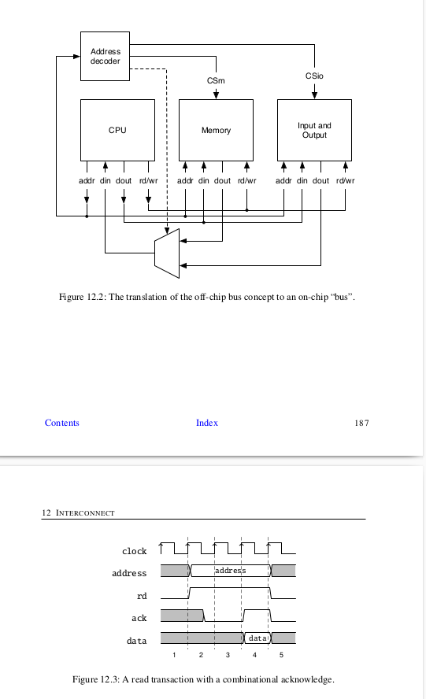
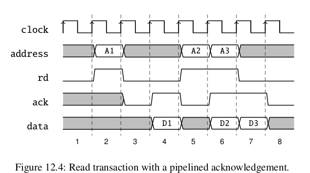
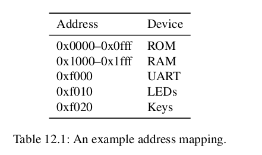
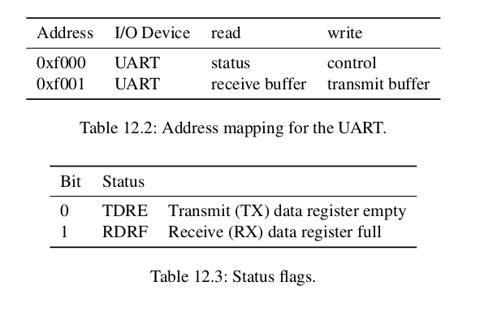

- [11.示例设计](#11示例设计)
  - [11.1 FIFO缓冲器](#111-fifo缓冲器)
  - [11.2 一个串口端口](#112-一个串口端口)
  - [11.3 FIFO设计变体](#113-fifo设计变体)
    - [11.3.1 参数化FIFO](#1131-参数化fifo)
    - [11.3.2 重新设计气泡FIFO](#1132-重新设计气泡fifo)
    - [11.3.3 双缓冲FIFO](#1133-双缓冲fifo)
    - [11.3.4 使用寄存器内存的FIFO](#1134-使用寄存器内存的fifo)
    - [11.3.5 使用片上内存的FIFO](#1135-使用片上内存的fifo)
  - [11.4 多时钟存储器](#114-多时钟存储器)
  - [11.5 练习](#115-练习)
    - [11.5.1 探索气泡FIFO(Bubble FIFO)](#1151-探索气泡fifobubble-fifo)
    - [11.5.2 UART](#1152-uart)
    - [11.5.3 FIFO探索](#1153-fifo探索)
- [12.互连](#12互连)
  - [12.1 经典微处理器总线](#121-经典微处理器总线)
  - [12.2 芯片内总线](#122-芯片内总线)
    - [12.2.1 组合式握手](#1221-组合式握手)
    - [12.2.2 流水线握手](#1222-流水线握手)
    - [12.2.3 示例 I/O 设备](#1223-示例-io-设备)
    - [12.2.4 内存映射设备](#1224-内存映射设备)
  - [12.3 总线与接口标准](#123-总线与接口标准)
    - [12.3.1 Wishbone](#1231-wishbone)
    - [12.3.2 AXI](#1232-axi)
    - [12.3.3 Open Core协议](#1233-open-core协议)
    - [其他总线规范](#其他总线规范)
- [13.调试、测试和验证](#13调试测试和验证)
  - [13.1 调试](#131-调试)
  - [13.2 在chisel上进行测试](#132-在chisel上进行测试)
  - [13.3 多线程测试](#133-多线程测试)
  - [13.4 仿真后端](#134-仿真后端)
  - [13.5 练习](#135-练习)
- [14.处理器的设计](#14处理器的设计)
  - [14.1 指令集架构](#141-指令集架构)
  - [14.2 数据通路](#142-数据通路)
  - [14.3 从ALU开始](#143-从alu开始)
  - [14.4 指令解码](#144-指令解码)
  - [14.5 汇编指令](#145-汇编指令)
  - [14.6 指令存储器](#146-指令存储器)
  - [14.7 具有数据通路的状态机实现](#147-具有数据通路的状态机实现)
  - [14.8 实现变体](#148-实现变体)
  - [14.9 练习](#149-练习)


# 11.示例设计
在这个部分，我们探索一些小型数字设计，例如FIFO缓冲，这是用于大型设计的部分。作为另一个例子，我们设计一个串行接口（也叫UART），它本身会使用FIFO缓冲器。  
## 11.1 FIFO缓冲器
我们可以分离一个写入（发送者）和一个读取（接收者），在写和读之间插入一个缓冲器。一个常见的缓冲器是一个先进先出（FIFO）缓冲器。图13.1展示了一个写入者、FIFO和读取者。写入者通过din信号将数据放入FIFO，同时激活写信号。读取者通过dout信号从FIFO中读取数据，同时激活读信号。  
FIFO最初是空的，通过empty信号表示。从空的FIFO中读取通常是未定义的行为。当数据被写入但从未被读取时，FIFO将变满。向满的FIFO写入通常会被忽略，数据也会丢失。换句话说，empty和full信号用作握手信号。  
  
FIFO有几种不同的实现方式：例如，使用片上内存和读写指针，或者简单地使用寄存器链和一个小型状态机。对于小型缓冲区（最多几十个元素），使用单独寄存器连接成缓冲链的FIFO是一种简单且资源需求较低的实现方式。Bubble FIFO的代码可以在chisel-examples仓库中找到。  

我们开始定义IO信号用于写入和读出端。数据的大小是通过size设置的。写入数据是din，写入信号时write。信号full作为flow control在写入端。  
```
class WriterIO(size: Int) extends Bundle {
    val write = Input(Bool())
    val full = Output(Bool())
    val din = Input(UInt(size.W))
}
```  

读出端提供dout作为数据，并且读出端是使用read初始化的。empty信号是负责读出端的流控制。下面代码展示了单个缓存区。该缓冲区有一个类型为WriterIO的入队端口enq和一个类型为ReaderIO的出队端口deq。缓冲区的状态元素包括一个用于存储数据的寄存器（dataReg）和一个用于简单有限状态机（FSM）的状态寄存器（stateReg）。FSM只有两种状态：缓冲区为空或满。如果缓冲区为空，写入操作将注册输入数据并切换到满状态。如果缓冲区为满，读取操作将消耗数据并切换到空状态。IO端口full和empty分别表示缓冲区的状态，供写入者和读取者使用。  
```
class FifoRegister(size: Int) extends Module {
    val io = IO(new Bundle {
        val enq = new WriterIO(size)
        val deq = new ReaderIO(size)
    })
    buffers(i).io.deq.read := ~buffers(i + 1).io.enq.full

}
```  
这个展示的想法是连接独立的缓冲, 去补充一个FIFO队列, 称为冒泡FIFO, 因为数据从队列冒泡。 这个简单的解法，在数据率比时钟慢的情况下是好的，例如，用于序列端口的去耦缓冲，在下一部分展示。  

但是，当数据绿达到时钟频率，冒泡FIFO有两个限制： (1)因为每个缓存需要在empty和full摆动， 这意味着最大吞吐量是每个字长两个时钟周期。 (2)数据需要通过整个FIFO进行冒泡，于是， 从输入到输出的延迟至少是buffer的数量。 我会展示另外的FIFO的可能做法Section 13.3。  

## 11.2 一个串口端口
一个串口（UART）是最简单的方法之一是在你的电脑和FPGA板连接。像名字那样暗示，数据是连续传输的。一个8位子节按照以下传输：从0位开始，8位的数据，从最低有效位开始，然后每次1到两个bits。当没有数据传输时，输出1.  

我们以模块化的方式设计我们的UART，每个模块实现最小功能。我们介绍了一个发送器TX，一个接收器RX，一个缓冲区和这些基础组件的使用。首先，我们需要一个接口，即端口定义。对于UART设计，我们使用一个ready/valid握手接口(拓展自DecoupledIO)，数据大小为8位。  
```
class UartIO extends DecoupledIO(UInt(8.W)) {

}
```  
ready/valid握手接口的协议是当ready和valid都被断言时数据才会传输。以下代码展示了一个基础的串行发射器TX。这个IO接口是txd端口，用于发送串行数据，以及一个用于发射器能够接受字符串来进行串行化和发送的通道。为了生成时序，我们计算一个常量，表示一个串行bits所需要的时间周期数。我们使用三个寄存器：（1）用于移位数据（将其串行化）的寄存器（shiftReg），（2）一个用于生成正确波特率的计数器（cntReg），和（3）一个用于记录所需移出bit数量的计数器（bitsReg）。不需要额外的状态寄存器或者FSM，全部状态都编码在这三个寄存器当中。  

计数器cntReg是不断运行的（计数倒数至0并且当到达0时重置为初始值）。所有操作只在cntReg为0时进行。由于我们构建的是一个最小化的发射器，我们只用移位寄存器来存储数据。因此，只有当cntReg为0且没有剩余的比特需要移出时，通道才处于就绪状态。IO接口txd是直接连接到移位寄存器的最低有效位。  

当仍有bits需要移出时（bitsReg =/= 0.U），我们将bits向右移动并用1（发射器的空闲电平）填充。如果没有更多的bits需要移出，则检查通道是否包含数据（通过io.channel.valid输入信号指示）。如果有数据，则构建要移出的bit字符串，包括一个起始位（0）、8位数据以及两个停止位（1）。因此，bits计数要被设置位11.  

这个非常简化的发射器没有额外的缓冲区，只有在移位寄存器为空且chtReg为0的时钟周期时才能接收新字符。只在cntReg为0时接受新数据意味着，即使移位寄存器中有空闲，ready标志也会被取消断言。然而，我们不希望添加这种“复杂性”到发射器中，而是将其委托到一个缓冲区中。  

下面代码展示单字节缓冲区，类似于气泡FIFO的FIFO寄存器。输入和输出均为UartIO。缓冲区包含一个最小状态机，用于指示空或者满状态。缓冲区驱动的握手信号（io.in.ready和io.out.valid）取决于状态寄存器。当状态是空并且输入数据有效时，我们寄存数据并切换到满状态。当状态是满并且下游接收器就绪时，下游数据发生转移并且我们观察状态返回到空。  
具有ready/valid接口的单字节缓冲区：  
```
class Buffer extends Module {
    val io = IO(new Bundle {
        val in = Flopped(new UartIO())      //输入端口，使用Flopped包装的UartIO
        val out = new UartIO()              //输出端口，标准的UartIO
    })

    //定义状态枚举
    object State extends ChiselEnum {
        val empty, full = Value
    }
    import State._                          //导入枚举值

    val stateReg = RegInit(empty)           //状态寄存器，初始值为empty
    val dataReg = RegInit(0.U(8.W))         //数据寄存器，用于存储输入的8位数据

    io.in.ready := stateReg === empty       //输入就绪信号：状态为空时，可以接受新数据
    io.out.valid := stateReg === full       //输出有效信号：状态为满时，输出数据有效

    //状态转移逻辑
    when(stateReg === empty) {              //状态为空
        when(io.in.valid) {                 //输入数据有效
            dataReg := io.in.bits           //数据寄存器寄存数据
            stateReg := full                //切换状态为满
        }
    } .otherwise {
        when(io.out.ready) {                //寄存器为满，下游接受器就绪，切换状态为空
            stateReg := empty
        }
    }
    io.out.bits := dataReg                  //输出数据直接连接到数据寄存器
}
```  

通过这个缓冲区，我们可以继承我们单个发射器。以下代码展示了发射器TX于前置单个缓冲区的组合。这个缓冲区现在缓解了TX仅在单个时钟周期内就绪的问题。我们将问题的解决方案委托给了缓冲区模块。可以轻松实现将单个字节缓冲区扩展为真正的FIFO，并且无需对发送器或单字节缓冲区进行任何更改。  
```
class BufferedTx(frequency: Int, bundRate: Int) extends Module {
    val io = IO(new Bundle {
        val txd = Output(UInt(1.W))         //串行数据输出端口
        val channel = Flipped(new UartIO)   //输入通道，使用Flipped表示方向反转
    })

    //实例化模块
    val tx = Module(new Tx(frequency, baudRate))    //传入频率，波特率参数
    val buf = Module(new Buffer())                  //单字节缓冲区模块

    buf.io.in <> io.channel         //将输入通道连接到缓冲区的输入端口
    tx.io.channel <> buf.io.out     //将缓冲区的输出端口连接到发送器的输入通道
    io.txd <> tx.io.txd             //将发送器的串行数据输出端口连接到模块输出端口
}
```  

下面展示了接收器Rx的代码。接受器稍为复杂一些，因为它需要重建串行数据的时序。接收器等待串行数据的下降沿。从这个事件开始，接收器等待1.5bit时间来将自己定位到第0位的中间。然后隔一段时间进行采样并移入数据。你可以将这两个等待时间观察为 BIT CNT 和 START CNT。对于两个采样时间，相同的计数器 (cntReg) 被使用。在移入 8 位后，validReg 信号指示有可用字节。  
```
class Rx(frequency: Int, baudRate: Int) extends Module {
    val io = IO(new Bundle {
        val rxd = Input(UInt(1.W))  //接收到的串行数据输入
        val channel = new UartIO()  //UART通信接口
    })

    //计算每个数据位的时钟周期数
    val BIT_CNT = ((frequency + baudRate / 2) / baudRate - 1).U
    //计算起始位的1.5倍时钟周期数
    val STAR_CNT = ((3 * frequency / 2 + baudRate / 2) / baudRate - 1).U

    //同步异步 RX 数据，复位为 1 以避免在复位后立即开始读取。
    val rxReg = RegNext(RegNext(io.rxd, 1.U), 1.U)

    //定义寄存器
    val shiftReg = RegInit(0.U(8.W))    //用于存储接收到的数据位
    val cntReg = RegInit(0.U(20.W))     //计数器，用于计时
    val bitsReg = RegInit(0.U(4.W))     //记录已接收的位数
    val validReg = RegInit(false.B)     //标志位，表示数据是否有效

    //计数器逻辑
    when(cntReg =/= 0.U) {                  // =/= 等价于 !=
        cntReg := cntReg - 1.U              //计数器减1
    } .elsewhen(bitsReg =/= 0.U) {
        cntReg := BIT_CNT                   //重置计数器为BIT_CNT
        shiftReg := rxReg ## (shifted >> 1) //将接收到的数据位移入shiftReg
        bitsReg := bitsReg - 1.U            //已接收位数减1

        //当接收到最后一位时，设置validReg为true
        when(bitsReg === 1.U) {
            validReg := true.B
        }
    }   .elsewhen(rxReg === 0.U) {
        //检测到起始位的下降沿，初始化计数器并设置接收位数为8
        cntReg := START_CNT
        bitsReg := 8.U
    }

    //当数据有效且UART通道准备好时，清除validReg标志
    when(validReg && io.channel.ready) {
        validReg := false.B
    }

    //将接收到的数据输出到UART通道
    io.channel.bits := shiftReg
    io.channel.valid := validReg
}
```  

以下展示了串行接口发射器的使用，通过发送我们一个友好的消息。我们将信息定义为scala字符串（msg），并将其转换为chisel的vec类型，其中元素为UInt。scala的字符串是支持map方法的序列。map方法接收一个函数文本作为参数，将该函数应用于序列的每个元素，并构建一个由函数返回值组成的序列。如果函数文本只有一个参数（本例中就是如此），该参数可以用 _ 表示。我们的函数文本调用chisel的.U方法，，将 Scala 的 Char 类型转换为 Chisel 的 UInt。然后，我们将该序列传递给 VecInit，从而构造一个 Chisel Vec。我们使用计数器 cntReg 对 text 向量进行索引，以逐个字符地提供数据给带缓冲的发送器。每当 ready 信号有效时，计数器增加，直到整个字符串被发送完毕。发送器会保持 valid 信号为高，直到最后一个字符被发送出去。  
```
class Sender(frequency: Int, baudRate: Int) extends Module {
    val io = IO(new Bundle {
        val txd = Output(UInt(1.W)) //串行数据输出端口
    })

    //实例化带缓冲的UART发送器
    val tx = Module(new BufferedTx(frequency, baudRate))

    //连接发送器的串行数据输出到io.txd
    io.txd := tx.io.txd

    val msg = "Hello World!"            //定义要发送的字符串消息
    val text = VecInit(msg.map(_.U))    //将字符串转换为Chisel Vec，每个字符转换为 UInt
    val len = msg.length.U              //计算消息长度（转换为 Chisel 的 UInt 类型）

    val cntReg = RegInit(0.U(8.W))      //定义字符发送索引计数器，初始值为0

    tx.io.channel.bits := text(cntReg)      //将当前索引对应字符送入发射器的数据通道
    tx.io.channel.valid := cntReg =/= len   //当未发送完所有字符时，valid 置高，表示数据有效
    // 当发送器准备好接收下一个字符，并且未发送完所有字符时，计数器递增
    when(tx.io. channel .ready && cntReg =/= len) {
        cntReg := cntReg + 1.U
    }
}
```  

下面展示了接收器和发送器连接在一起的使用方式。这个连接生成一个回显(Echo)电路，每个接收到字符都会被发送回去。  
```
class Echo(frequency: Int, baudRate: Int) extends Module {
    val io = IO(new Bundle {
        val txd = Output(UInt(1.W))     //串行发送数据输出端口
        val rxd = Input(UInt(1.W))      //串行接收数据输入端口
    })

    //实例化
    val tx = Module(new BufferedTx(frequency, baudRate))    //实例化带缓冲的UART发送器
    val rx = Module(new Rx(frequency, baudRate))            //实例化UART接收器

    io.txd := tx.io.txd             //连接发送器的输出到顶层IO
    rx.io.rxd := io.rxd             //连接接收器的输入到顶层IO

    //该语句使用 Chisel 的 双向连接运算符 <>
    tx.io.channel <> rx.io.channel  //直接连接接收器的输出到发送器的输入，实现回显功能
}
```  

## 11.3 FIFO设计变体
在文章的开头，我们介绍了一个简单的气泡FIFO的涉及。在这个部分，我们将泛化FIFO和实现queue队列的不同变化。为了让这些实现可以互换，我们将用继承。 

### 11.3.1 参数化FIFO
我们定义一个抽象FIFO类作为一个泛型类，并使用chisel类型T作为参数，使其能缓冲任何chisel数据类型。在抽象类中，我们还测试参数depth是否具有有效值。  
```
abstract class Fifo[T <: Data](gen: T, val depth: Int) extends Module {
    val io = IO(new FifoIO(gen))

    assert(depth > 0 ,"缓冲区元素的数量需要大于0")

}

```  
在章节11.1中，我们为接口定义了我们的类型，并使用了常见信号的名称，例如：write,full,din,read,empty和dout .这些缓冲区的输入和输出由数据和两个用于握手的信号组成（例如：当FIFO不满时，我们可以写入数据）。在这里，我们可以将这种握手信号推广到所谓的ready/valid接口。当FIFO ready时，我们可以将元素入队（写入FIFO）。我们在写入端通过valid信号来指示这一点。由于ready/valid接口非常常见。chisel在DecoupledIO中提供了如下定义：  
```
chisel DecoupledIO[T <: Data](gen: T) extends Bundle {
    val ready = Input(Bool())
    val valid = Output(Bool())
    val bits = Output(gen)
}
```  

通过DecoupledIO接口，我们为FIFO定义了接口：一个FifoIO包含如对enq和出队deq端口，这些端口由read/valid接口组成。DecoupledIO接口是从写入端（生产者）的视角定义的。因此，FIFO的入队端口需要翻转信号方向。  
```
class FifoIO[T <: Data](private val gen: T) extends Bundle {
    val enq = Flipped(new DecoupledIO(gen))
    val deq = new DecoupledIO(gen)
}
```  
借助抽象基类和接口，我们可以针对不同的FIFO实现进行专门化优化，这些实现可能针对不同的参数（如速度、面积、功耗或仅仅是简洁性）进行了优化。  

### 11.3.2 重新设计气泡FIFO
我们可以使用标准的ready/valid接口重新设计我们章节11.1的气泡FIFO，并通过chisel数据类型使其可参数化。  
```
class BubbleFifo[T <: Data](gen: T, depth: Int) extends Fifo(gen: T, depth: Int) {

}
```  

以下展示使用ready/valid接口重新设计气泡FIFO。注意到我们将Buffer组件作为私有类放在BubbleFifo内部。这个辅助类只在此组件中需要，因此我们将其隐藏，避免污染命名空间。buffer类也得到了类似的简化。不再使用FSM，仅仅使用一位（fullReg）来表示缓冲区的状态full或empty。气泡FIFO是简单的容易理解的，并且使用极少的资源。然而，由于每一个缓冲区阶段需要在full和empty之间切换，这种FIFO的最大宽度为每两个时钟周期传输一个字。有人会考虑在缓冲区中同时观察接口的两段，以便在生产者有效且消费者就绪时能够接收新数据。然而，这种做法会引入从消费者握手信号到生产者握手信号的组合逻辑路径，这违反了就绪/有效协议的语义。  
```
private class Buffer() extends Module {
    val io = IO(new FifoIO(gen))    //输入输出接口，使用FifoIO 类型，泛型为 gen

    //定义寄存器
    val fullReg = RegInit(false.B)  //FIFO 是否满
    val dataReg = Reg(gen)          //用来存储数据

    //如果FIFO已满，检查是否可以出队
    when(fullReg) {
        when(io.deq.ready) {        //如果出队端准备好了，标记FIFO为不满
            fullReg := false.B
        }
    }   .otherwise {
        when(io.enq.valid) {        //FIFO 不满，检查是否可以入队
            fullReg := true.B
            dataReg := io.enq.bits
        }
    }
    io.enq.ready := !fullReg    // 入队端的 ready 信号，当 FIFO 满时无法入队
    io.deq.valid := fullReg     // 出队端的 valid 信号，当 FIFO 满时有效
    io.deq.bits := dataReg      // 出队端的数据位设置为数据寄存器的值
}
//创建一个缓冲区数组，深度为 depth
private val buffers = Array.fill(depth) {
    Module(new Buffer())
}

//将每个缓冲区的出队端连接到下一个缓冲区的入队端
for(i <- 0 until depth - 1) {
    buffers(i + 1).io.enq <> buffers(i).io.deq
}
io.enq <> buffers (0).io.enq            // 将外部接口的入队端连接到第一个缓冲区的入队端
io.deq <> buffers (depth - 1).io.deq    // 将外部接口的出队端连接到最后一个缓冲区的出队端
```  

### 11.3.3 双缓冲FIFO
一种解决方案是即使缓冲区寄存器是满的也保持ready状态。当消费者是no ready状态时，为了也能接收来自生产者的数据字，我们需要第二个缓冲区，我们称之为影子寄存器。当这个缓冲区是full状态，新数据是存储在影子寄存器并且ready状态被取消。当消费者再次变成ready状态，数据从数据寄存器传输到消费者，并从影子寄存器传输到数据寄存器。  

以下代码展示了双缓冲FIFO。由于每个缓冲区单元能存储两个条目，我们只需要缓冲区单元的一半（depth/2）。DoubleBuffer包含两个寄存器，dataReg和shadowReg.消费者始终从dataReg读取数据。双缓冲区有三种状态分别是：empty，one和two，用于指示双缓冲区的填充级别。缓冲区是ready状态且当前状态时emptu或one，则接收新数据。当缓冲区处于 one 或 two 状态时，表示其包含有效数据。如果我们让FIFO全速运行，并且消费者始终准备就绪，则双缓冲区的稳态为 one。只有当消费者撤销 ready 信号时，队列才会填充，缓冲区进入 two 状态。然而，与单气泡 FIFO 相比，相同的缓冲容量下，队列的重新启动仅需一半的时钟周期。同样，其穿透延迟也仅为单气泡 FIFO 的一半。
```
private class DoubleBuffer[T <:](gen: T) extends Module {
    val io = IO(new FifoIO(gen))

    //定义枚举，三种状态
    object State extends ChiselEnum {
        val empty, one, two = Value
    }
    import State._

    val stateReg = RegInit(empty)       //状态寄存器
    val dataReg = Reg(gen)              //数据寄存器，存储当前可消费的数据
    val shadowReg = Reg(gen)            //影子寄存器，FIFO满时暂存新数据

    switch(stateReg) {
        is(empty) {                     //当状态为空
            when(io.enq.valid) {        //生产者数据有效
                stateReg := one         //状态转移到one
                dataReg := io.enq.bits  //数据村入状态寄存器
            }
        }

        is(one) {
            when(io.deq.ready && !io.enq.valid) {   //消费者就绪且没有新数据
                stateReg := empty   //状态转移到empty
            }
            when(io.deq.ready && io.enq.valid) {    //消费者就绪且有新数据
                stateReg := one         //状态保持one
                dataReg := io.enq.bits  //数据寄存器更新为新数据
            }
            when(!io.deq.ready && io.enq.valid) {   //消费者未就绪且有新数据
                stateReg := two             //状态切换到two
                shadowReg := io.enq.bits    //新数据存入影子寄存器
            }
        }
        is(two) {
            when(io.deq.ready) {        //消费者就绪
                dataReg := shadowReg    //影子寄存器的数据传输到状态寄存器
                stateReg := one         //状态切换到one
            }
        }
    }

    //生产者就绪信号
    io.enq. ready := ( stateReg === empty || stateReg === one)
    //消费者就绪信号
    io.deq. valid := ( stateReg === one || stateReg === two)
    //输出当前可消费的数据
    io.deq.bits := dataReg
}

//创建多个双缓冲FIFO示例，数量为(depth + 1) / 2
private val buffers = Array.fill((depth + 1) / 2) {
    Module(new DoubleBuffer(gen))
}
//将多个双缓冲FIFO连接起来形成链式结构
for(i <- 0 until (depth + 1) / 2 - 1) {
    buffers(i + 1).io.enq <> buffers(i).io.deq
}
//将第一个双缓冲FIFO的输入连接到模块的输入
io.enq <> buffers (0).io.enq
//将最后一个双缓冲FIFO的输出连接到模块的输出
io.deq <> buffers (( depth + 1) / 2 - 1).io.deq
```  

### 11.3.4 使用寄存器内存的FIFO
当你有软件工程的背景时，你可能会好奇我们是如何用许多小型独立的缓冲单元构建硬件队列的，这些单元并行执行并与上下游单元进行握手。对于小型缓冲区，这可能是最高效的实现方式。  
软件中的队列通常由两个线程中的顺序代码使用。我们使用队列来解耦生产者和消费者线程。在这种情况下，固定大小的FIFO队列通常实现为循环缓冲区。两个指针指向为队列预留的内存中的读取和写入位置。当指针到达内存的末尾时，它们会被重置到内存的起始位置。两个指针之间的差异是队列中的元素数量。当两个指针指向相同的地址时，队列要么为空，要么为满。为了区分空和满，我们需要另一个标志。  
我们也可以在硬件中实现这种基于内存的FIFO队列。对于小型队列，我们可以使用寄存器文件（即Reg(Vec())）。下面代码展示了一个使用内存以及读写指针实现的FIFO队列。  
```
class RegFifo[T <: Data](gen: T, depth: Int) extends Fifo(gen: T, depth: Int) {

    // 计数器函数，用于生成当前值和下一个值
    def counter(depth: Int, incr: Bool): (UInt, UInt) = {
        val cntReg = RegInit(0.U(log2Ceil(depth).W)) // 初始化计数器寄存器
        val nextVal = Mux(cntReg === (depth - 1).U, 0.U, cntReg + 1.U) // 计算下一个值

        when(incr) {
            cntReg := nextVal // 当incr为真时，更新计数器
        }
        (cntReg, nextVal) // 返回当前值和下一个值
    }

    // 基于寄存器的存储器
    val memReg = Reg(Vec(depth, gen))

    // 读写指针的控制信号
    val incrRead = WireDefault(false.B)
    val incrWrite = WireDefault(false.B)
    val (readPtr, nextRead) = counter(depth, incrRead) // 读指针
    val (writePtr, nextWrite) = counter(depth, incrWrite) // 写指针

    // 操作码，由enq.valid和deq.ready拼接而成
    val op = io.enq.valid ## io.deq.ready
    val doWrite = WireDefault(false.B) // 写使能信号

    // 根据操作码执行不同的操作
    switch(op) {
        is("b00".U) {} // 无操作
        is("b01".U) { // 读操作
            when(!emptyReg) {
                fullReg := false.B
                emptyReg := nextRead === writePtr
                incrRead := true.B
            }
        }
        is("b10".U) { // 写操作
            when(!fullReg) {
                doWrite := true.B
                emptyReg := false.B
                fullReg := nextWrite === readPtr
                incrWrite := true.B
            }
        }
        is("b11".U) { // 同时读写操作
            when(!fullReg) {
                doWrite := true.B
                emptyReg := false.B
                when(emptyReg) {
                    fullReg := false.B
                }.otherwise {
                    fullReg := nextWrite === nextRead
                }
                incrWrite := true.B
            }
            when(!emptyReg) {
                fullReg := false.B
                when(fullReg) {
                    emptyReg := false.B
                }.otherwise {
                    emptyReg := nextRead === nextWrite
                }
                incrRead := true.B
            }
        }
    }

    // 执行写操作
    when(doWrite) {
        memReg(writePtr) := io.enq.bits
    }

    // 输出数据和状态信号
    io.deq.bits := memReg(readPtr)
    io.enq.ready := !fullReg
    io.deq.valid := !emptyReg
}
```  

由于两个指针在操作时递增并在缓冲区末尾回绕，我们定义了一个函数counter()来实现这些回绕计数器。通过log2Ceil(depth).W，我们计算计数器的位宽。下一个值要么是加1，要么是在回绕时变为0。计数器仅在输入incr为true.B时递增。  

此外，由于我们还需要可能的下一个值（递增或在回绕时为0），我们也从counter函数中返回这个值。在Scala中，我们可以返回一个所谓的元组（tuple），它只是一个可以容纳多个值的容器。创建这样的元组的语法很简单，只需将逗号分隔的值用括号括起来：  
```
val t = (v1,v2)
```  

我们可以通过在赋值左侧使用括号符号来解构这样的元组：  
```
val (x1, x2) = t
```  
对于存储器，我们使用一个由Chisel数据类型gen组成的向量寄存器（Reg(Vec(depth, gen))）。我们定义了两个信号来递增读指针和写指针，并使用counter函数创建读指针和写指针。当两个指针相等时，缓冲区要么为空，要么为满。我们定义了两个标志来表示空和满的状态。  

当生产者断言valid且FIFO未满时，我们执行以下操作：(1) 写入缓冲区，(2) 确保emptyReg被取消断言，(3) 如果写指针在下一个时钟周期赶上读指针（比较当前读指针和下一个写指针），则将缓冲区标记为满，(4) 发出信号使写计数器递增。  

当消费者准备好且FIFO不为空时，我们执行以下操作：(1) 确保fullReg被取消断言，(2) 如果读指针在下一个时钟周期赶上写指针，则将缓冲区标记为空，(3) 发出信号使读计数器递增。  

同时进行读写操作也是可能的。这种情况综合了上述两种操作。  

FIFO的输出是读指针地址处的存储器元素。ready和valid标志直接从full和empty标志派生而来.  

### 11.3.5 使用片上内存的FIFO
最后一个版本的FIFO使用寄存器文件来代表内存，这对于小型FIFO来说是一个很好的解决方案。对于大型FIFO更好的选择是使用片上内存。下面代码展示了FIFO使用同步内存进行存储。  
```
class MemFifo[T <: Data](gen: T, depth: Int) extends Fifo(gen: T, depth: Int) {
  // 计数器函数，用于生成当前指针和下一个指针
  def counter(depth: Int, incr: Bool): (UInt, UInt) = {
    val cntReg = RegInit(0.U(log2Ceil(depth).W)) // 当前指针寄存器
    val nextVal = Mux(cntReg === (depth - 1).U, 0.U, cntReg + 1.U) // 下一个指针值
    when(incr) {
      cntReg := nextVal // 当incr为真时，更新指针
    }
    (cntReg, nextVal) // 返回当前指针和下一个指针
  }

  // 使用同步存储器作为FIFO的存储
  val mem = SyncReadMem(depth, gen, SyncReadMem.WriteFirst)

  // 读写指针的增量信号
  val incrRead = WireInit(false.B)
  val incrWrite = WireInit(false.B)

  // 生成读写指针
  val (readPtr, nextRead) = counter(depth, incrRead)
  val (writePtr, nextWrite) = counter(depth, incrWrite)

  // 空和满状态寄存器
  val emptyReg = RegInit(true.B)
  val fullReg = RegInit(false.B)

  // 输出寄存器和有效标志
  val outputReg = Reg(gen)
  val outputValidReg = RegInit(false.B)

  // 读信号
  val read = WireDefault(false.B)

  // 设置输出端口的有效信号
  io.deq.valid := outputValidReg
  // 设置输入端口的就绪信号（当FIFO未满时）
  io.enq.ready := !fullReg

  // 写信号
  val doWrite = WireDefault(false.B)
  val data = Wire(gen)
  data := mem.read(readPtr) // 从存储器读取数据
  io.deq.bits := data // 将读取的数据连接到输出端口

  // 执行写操作
  when(doWrite) {
    mem.write(writePtr, io.enq.bits) // 将输入数据写入存储器
  }

  // 读条件：当输出无效且（读指针不等于写指针或FIFO为满时）
  val readCond = !outputValidReg && ((readPtr =/= writePtr) || fullReg)

  // 当读条件满足时，执行读操作
  when(readCond) {
    read := true.B
    incrRead := true.B // 增加读指针
    outputReg := data // 更新输出寄存器
    outputValidReg := true.B // 设置输出有效标志
    emptyReg := nextRead === writePtr // 更新空状态
    fullReg := false.B // 清除满状态（当前不支持并发读写）
  }

  // 当输出被消费时，清除输出有效标志
  when(io.deq.fire) {
    outputValidReg := false.B
  }

  // 将输出寄存器连接到输出端口
  io.deq.bits := outputReg

  // 当输入被写入时，更新状态
  when(io.enq.fire) {
    emptyReg := false.B // 清除空状态
    fullReg := (nextWrite === readPtr) & !read // 更新满状态
    incrWrite := true.B // 增加写指针
    doWrite := true.B // 执行写操作
  }
}
```  
读写指针的处理方式与寄存器存储器 FIFO 相同。然而，同步片上存储器会在下一个时钟周期提供读取结果，而寄存器文件的读取结果在同一时钟周期内即可获得。因此，我们需要一个额外的寄存器来处理这一延迟。  
```
class CombFifo[T <: Data](gen: T, depth: Int) extends Fifo(gen: T, depth: Int) {
    
    //创建一个基于存储器的FIFO
    val memFifo = Module(new MemFifo(gen, depth))

    //创建一个双缓冲FIFO，深度为2
    val bufferFIFO = Module(new DoubleBufferFifo(gen, 2))

    io.enq <> memFifo.io.enq                //入口数据直接进入存储器FIFO
    memFifo.io.deq <> bufferFIFO.io.enq     //存储器FIFO的输出连接到双缓冲FIFO的输入
    bufferFIFO.io.deq <> io.deq             //双缓冲FIFO的输出连接到最终的出口
}
```  
## 11.4 多时钟存储器
在具有多个时钟域的大型设计中，你需要一种安全的传输数据的方法。我们之前看到的同步处理是一种解决方案。另一种方法是使用多时钟存储器作为缓冲，在两个（或多个）时钟域之间传输数据。Chisel 通过 withClock 和 withClockAndReset 结构支持多时钟设计。在 withClock(clk) 代码块中定义的所有存储单元都会由 clk 时钟驱动。对于多时钟存储器，存储器模块应在所有 withClock 代码块之外定义，而每个端口应在各自的 withClock 代码块内。下面代码展示了一个可参数化的多时钟存储器。  
```
//定义存储器的输入/输出接口
class MemoryIO(val n: Int, val w: Int) extends Bundle {
    val clk = Input(Bool())             //端口时钟信号
    val addr = Input(UInt(log2Up(n).W)) //访问地址
    val datail = Input(UInt(w.W))       //输入数据
    val datao = Output(UInt(w.W))       //输出数据
    val en = Input(Bool())              //使能信号
    val we = Input(Bool())              //写使能信号
}

//定义一个多时钟存储器
class MultiClockMemory(ports: Int, n: Int = 1024, w: Int = 32) extends Module {
    val io = IO(new Bundle {
        val ps = Vec(ports, new MemoryIO(n, w)) //多端口存储器接口
    })

    //定义同步读写存储器
    val ram = SyncReadMem(n, UInt(w.W))

    //遍历每个端口，分别在对应时钟域中进行存取操作
    for(i <- 0 until ports) {
        val p = io.ps(i)
        withClock(p.clk.asClock) {              //在每个端口的时钟域内操作
            val datao = WireDefault(0.U(w.W))   //默认输出值为0
            when(p.en) {                        //使能时才进行读写操作
                datao := ram(p.addr)            //读取存储器数据
                when(p.we) {                    //写使能有效时写入
                    ram(p.addr) := p.datai
                }
            }
            p.datao := datao                    //连接输出数据
        }
    }
}
```  
自然，使用这些多时钟域存储器会带来一些限制，影响可同时执行的操作。两个（或多个）端口不能同时写入同一地址，否则可能会导致亚稳态。类似的，一个必须确保定义写入时读取的行为。存储器应配置为写优先，即将输入数据直接传输到读端口，或读优先，即在读端口上呈现存储器中的旧值。需要注意的是，ChiselTest 对多时钟的支持仍处于非常早期的阶段，因此必须手动切换时钟信号以强制发生时钟转换。

## 11.5 练习
这个练习部分相对较长：（1）探索气泡FIFO(bubble FIFO)，并实现不同FIFO设计。（2）探索UART并对其进行扩展。这两个练习的源代码都包含在 chisel-examples 仓库中。  

### 11.5.1 探索气泡FIFO(Bubble FIFO)
FIFO源代码还包括一个测试器（tester），它会触发不同的读写行为，并生成值变化转储（VCD）格式的波形文件。VCD 文件可以使用GTKWave等波形查看工具进行分析。  

请在仓库中查找 FifoSpec 进行探索。该仓库包含一个 Makefile，可以用来运行示例。对于 FIFO 示例，只需输入：  
```
$ make fifo
```  
此make命令将编译FIFO，运行测试，并启动GTKWave以查看波形。探索测试程序和生成的波形。  

在最初的几个周期中，测试程序写入一个单字。我们可以在波形中观察到该字如何通过FIFO“冒泡”，因此得名“冒泡FIFO”。这种冒泡现象也意味着数据字通过FIFO的延迟等于FIFO的深度。  

接下来的测试将FIFO填满。随后进行一次读取。注意空字如何从FIFO的读取端“冒泡”到写入端。当冒泡FIFO满时，读取操作需要缓冲区深度的延迟才能影响到写入端。  

测试的最后部分包含一个循环，尝试以最大速度进行写入和读取。我们可以看到冒泡FIFO以最大带宽运行，即每个字需要两个时钟周期。单个字传输时，缓冲区阶段必须在空和满之间切换。  

冒泡FIFO结构简单，对于小缓冲区资源需求较低。n级冒泡FIFO的主要缺点是：(1) 最大吞吐量为每两个时钟周期一个字，(2) 数据字需要n个时钟周期从写入端传输到读取端，(3) 满的FIFO需要n个时钟周期才能重新启动。  

这些缺点可以通过使用循环缓冲区的FIFO实现来解决。循环缓冲区可以通过内存和读写指针来实现。使用另一种FIFO实现重新运行/重写测试，并比较带宽和延迟。综合不同的FIFO版本并比较资源需求。  

### 11.5.2 UART
对于UART示例，您需要一个带有串行端口的FPGA开发板以及笔记本电脑的串行端口（通常通过USB连接）。将串行电缆连接在FPGA开发板和笔记本电脑的串行端口之间。启动一个终端程序，例如Windows上的Hyperterm或Linux上的gtkterm：  
```
$ gtkterm &
```  
配置您的端口以使用正确的设备，对于USB UART，通常是类似/dev/ttyUSB0的设备。将波特率设置为115200，无奇偶校验或流控制（握手）。通过以下命令可以生成UART的Verilog代码：  
```
$ make uart
```  
然后使用您的综合工具综合设计。代码库中包含一个适用于DE2-115 FPGA开发板的Quartus项目。在Quartus中使用播放按钮综合设计并配置FPGA。配置完成后，您应该在终端中看到一条问候消息。  

将闪烁LED示例扩展为包含UART，并在LED关闭和打开时分别向串行线写入0和1。使用BufferedTx，如Sender示例中所示。由于字符输出速度较慢（每秒两个字符），您可以将数据直接写入UART发送寄存器，并忽略就绪/有效握手。进一步扩展示例，以波特率允许的最快速度重复写入数字0-9。在这种情况下，您需要扩展状态机以轮询UART状态，检查发送缓冲区是否空闲。  

示例代码中仅包含一个Tx缓冲区。您可以自由添加您实现的FIFO，以增加发送器和接收器的缓冲能力。  

### 11.5.3 FIFO探索
编写一个简单的 FIFO，使用 4 个专用寄存器 作为缓冲单元。  
使用 2 位的读/写计数器，允许其自然溢出。  

为了简化设计，假设读指针和写指针相等时表示 FIFO 为空。  

这意味着最多只能存储 3 个元素（而非 4 个）。这一简化避免了示例 11.11 中的计数器功能，也无需特殊处理读写指针相等时的“空”或“满”状态。由于指针值本身就可以推导 FIFO 是否为空或已满，因此无需额外的 empty/full 标志。这种设计相比其他 FIFO 设计有多大简化？

不同的 FIFO 设计在以下特性上有所取舍：
最大吞吐率（Maximum Throughput）  
数据通过延迟（Fall-through Latency）  
资源需求（Resource Requirement）  
最大时钟频率（Maximum Clock Frequency）  
请探索不同大小的 FIFO 设计，并在 FPGA 上综合（synthesis），源码可在 ip-contributions 找到。对于 4 字、16 字、256 字 深度的 FIFO，哪个设计是最优解？  

# 12.互连
我们结合不同组件来构建大型系统。为了简化组件的组合，如像 Wishbone 或 AXI 这样的互连标准。互连可以用于芯片之间（外部互联）或芯片内部，后者通常被称为 系统级芯片（SoC）。  

## 12.1 经典微处理器总线

图12.1展示了一个简单的经典计算机的原理图。中央处理单元（CPU）通过系统总线连接到外部内存和输入/输出（I/O）设备。这种类型的总线互联在早期微处理器（如 Z80 或 6502）中很常见。  

总线分为 地址总线、数据总线 和控制信号（如读写信号）。CPU 驱动地址和控制信号。数据总线是双向的。  CPU 是系统的主控单元，发出读或写命令。每个命令都包括一个地址（原理图中的 addr），用于从内存中选择一个数据字或从 I/O 设备中选择一个寄存器。并不是所有的地址线都会连接到外设设备上。为了在不同设备之间进行选择，地址总线的高位部分是解码器的输入，解码器的输出连接到外设设备的 片选（CS） 输入。  

在读命令下，选定的设备将在一定的访问时间后通过数据总线提供数据。外设设备驱动数据总线。在写命令下，处理器提供数据，外设必须接收该数据（通常在信号的上升沿）。CPU 驱动数据总线。由于数据总线是双向的且数据线被所有设备共享，输出必须包含 三态驱动器。在三态配置中，两个输出晶体管都被禁用，输出引脚实际上与逻辑断开连接。  

请注意，在最简单的形式下，总线不包含时钟。时序由外设设备的读写访问时间定义。

现代计算机为不同的外设设备提供了不同的总线，例如，专用的内存总线用于外部内存，I/O 总线用于外设设备。此外，现代的 I/O 总线，如 PCI Express，是串行总线，并使用点对点连接。  

尽管如此，经典处理器总线的概念——包括地址总线、数据总线和片选信号——仍然是核心互联的主流思想。我们将在下一节中推导这一概念在芯片内互联的适配方案。  

## 12.2 芯片内总线
我们可以将这种外部总线的概念转化为芯片内总线。然而，我们需要对一些方面进行适配。共享总线需要三态驱动器，这在芯片内并不实用。此外，芯片内的连线比 PCB 或连接器上的连线成本更低。因此，我们将数据总线分为两组线：一组用于读取信号，另一组用于写入信号。此外，芯片内的连接使用时钟来定义时序。  


图 12.2 显示了芯片内总线概念的实现。地址、数据输出和控制信号从 CPU 连接到所有外设。对于数据输入，我们使用了多路复用器（而不是三态总线）。地址解码器除了生成片选信号外，还驱动数据输入多路复用器的选择。  

通过这种简单的设置，我们假设每个操作（读或写）都可以在一个时钟周期内执行。这仅适用于非常小的系统。我们可以通过定义期望在下一个时钟周期获得读结果来扩展这一点，这个结果紧跟在读请求之后。这对于通常具有一个时钟周期延迟的同步读取的片上存储器（on-chip memories）非常合适。对于 I/O 设备，这额外的时钟周期延迟也放宽了时序约束。我们仍然假设写操作在一个时钟周期内完成。  

如果我们希望与具有不同或甚至变化延迟的设备通信，我们需要引入握手（handshaking）。处理器通过读写请求信号启动事务，而存储器或外设通过确认信号（acknowledgment signal）表示事务的结束。  

### 12.2.1 组合式握手
图 12.3 显示了带有确认信号的读请求。处理器在时钟周期 2 驱动地址总线（address）和读信号（rd）。确认信号（ack）需要在第一个时钟周期内作出反应。在我们的示例中，读数据并没有在一个时钟周期内可用，而是在两个时钟周期后（即时钟周期 4）才可见。数据和确认信号在一个时钟周期内有效。  

这种协议规范的好处是它允许进行单周期事务。然而，代价是握手过程，包括解码，是一个组合电路，这可能会导致最大频率的问题。标准的 Wishbone 协议使用相同周期的确认信号。Wishbone 的新版本增加了一个流水线协议。  

同周期确认（或就绪信号，ready signal）在文献 [13] 中受到了批评。在较大的系统中，单周期事务通常是不现实的。因此，我们可以定义一种规范，在这种规范下，确认（或忙碌、就绪）信号不需要在请求周期内有效。文中提出了 SimpCon 协议，它支持流水线事务并避免了处理器、地址解码和外设设备之间的组合路径。  

### 12.2.2 流水线握手
  
在这里，我们定义了一种简单的流水线握手总线协议，它避免了单周期组合循环，并更适合现代 SoC 设计。读或写命令通过 rd 或 wr 的断言在一个时钟周期内被发出。地址和写入数据（如果是写操作）需要在命令期间有效。每个命令仅在一个时钟周期内有效。每个命令需要通过一个活跃的 ack 信号进行确认，最早需要在命令后的一个时钟周期进行确认。通过延迟 ack 信号，可以插入等待状态。读数据在 ack 信号下可用，并且持续一个时钟周期。  

图 12.4 显示了这种总线协议，它不需要外设设备的组合反应。处理器的请求只持续一个时钟周期。地址总线和读信号在确认信号到达之前不需要被驱动。与前面的协议相比，ack 信号需要在 rd 命令之后的一个时钟周期（即时钟周期 3）内变为有效（无论是低电平还是高电平）。在此示例中，第一次读取序列有两个时钟周期的延迟。它与前一个示例中的延迟相同。然而，由于请求仅需要在一个时钟周期内有效，我们可以将请求流水线化。地址 A2 和 A3 的读取可以连续请求，从而实现每个时钟周期 1 个数据字的吞吐量。  

Patmos 处理器 [20] 使用具有完全相同协议的 OCP 版本来访问 I/O 设备。内存通过突发接口连接。Patmos 手册 [16] 对所使用的 OCP 接口提供了详细描述。此外，我们已经开始了一个包含多核设备（如网络芯片）的 Chisel 仓库，这些设备实现了上述流水线接口。  

芯片内互联定义的版本可以推广为点对点连接。处理器和外设通过这样的点对点接口连接到交换结构。如果系统包含多个处理器（或主设备），我们需要在交换结构中进行仲裁，以决定哪个主设备被允许发出读写命令。  

### 12.2.3 示例 I/O 设备
以下代码显示了一个实现流水线互联规范的 I/O 设备。该 I/O 设备包含四个可加载的计数器。为了寻址这四个计数器，我们需要两个地址位。我们通过一个读事务（rd 被断言）从计数器中读取值，并在下一个时钟周期获得结果（在 dout 中）。我们通过断言 wr 并设置 din 中的值来写入计数器。  

为了实现延迟确认，我们使用一个单比特寄存器（ackReg）来延迟任何断言的 rd 或 wr 信号。由于我们在读命令后的时钟周期提供读结果，并且地址仅在该命令周期内有效，我们需要将地址存储在 addrReg 中。  

计数器本身由一个包含 4 个元素的小寄存器文件（一个 Vec 类型的 Reg）组成。通过使用一个包含重置值的 Scala Seq（由 fill 创建，重置值作为 Chisel 常量）来初始化计数器为零。这个 Seq 是 VecInit 的输入。  

这些计数器自由运行，并且每个时钟周期增加 1，除非被写入一个新值。  
```
class CounterDevice extends Module {
    val io = IO(new Bundle() {
        val addr = Input(UInt(2.W))     //地址输入，2位宽
        val wr = Input(Bool())          //写信号输入
        val rd = Input(Bool())          //读信号输入
        val wrData = Input(UInt(32.W))  //写数据输入，32位宽
        val rdData = Output(UInt(32.W)) //读数据输出，32位宽
        val ack = Output(Bool())        //确认信号输出
    })

    //初始化确认信号寄存器为false，地址寄存器为0,计数器寄存器为4个32为零值
    val ackReg = RegInit(false.B)
    val addrReg = RegInit(0.U(2.W))
    val cntReg = RegInit( VecInit (Seq.fill (4) (0.U(32.W))))

    //当读或写操作发生时
    ackReg := io.rd || io.wr
    when(io.rd) {                       //读操作发生时
        addrReg := io.addr              //更新地址寄存器
    }
    io.rdData := cntRegs(addrReg)       //将地址对应的计数器值作为读数据输出

    //计数器寄存器每个周期递增1
    for(i <- 0 until 4) {
        cntRegs(i) := cntRegs(i) + 1.U
    }
    when(io.wr) {                       //写操作发生时
        cntRegs(io.addr) := io.wrData   //将写入数据更新到指定的寄存器
    }
    io.ack := ackReg                    //输出确认信号
}
```  
### 12.2.4 内存映射设备
  
  
在我们的示例系统中，所有设备，无论是内存设备还是 I/O 设备，都连接到共享的地址线。因此，它们出现在共享的地址空间中。为了选择个别设备，我们使用一些高位地址的解码。这个过程称为内存映射设备，作为系统设计的一部分，我们需要决定地址映射。  

表 12.1 显示了一个（16 位）微控制器的示例地址映射。我们假设使用 16 位地址，因此地址范围是从 0x0000 到 0xffff。在最低的地址（程序开始执行的位置），我们映射了一个只读存储器（ROM），它包含程序。在下一个内存区域中，我们映射了一个可写存储器（RAM）用于数据。我们决定将所有的 I/O 设备映射到地址空间的上方（大于 0xf000），这样它们就不会与内存重叠，万一我们需要扩展内存。在这个示例中，我们为每个 I/O 设备预留了 16 字节的地址。请注意，这是一个虚构的示例，实际中我们可以灵活决定地址映射。  

一些 I/O 设备没有内存映射寄存器，如计数器示例设备，而是有一个准备/有效接口，如第 9.3 节所解释的那样。例如，第 11.2 节介绍的 UART 就有两个准备/有效接口：一个用于写入，一个用于读取值。一种常见的解决方案是将写入和读取通道映射到一个地址，并根据写入或读取命令驱动相应的信号。为了表明写入通道是否准备好接收新数据字，或者读取通道是否有有效数据，我们将这两个信号映射到一个状态寄存器的不同地址。  

表 12.2 显示了 UART 的地址映射。在基地址（0xf000）处，我们通过读取访问状态寄存器，通过写入访问可选的控制寄存器。在下一个地址（0xf001），我们从读取缓冲区读取数据，并向发送缓冲区写入数据。  

表 12.3 显示了将两个标志映射到状态寄存器的映射。这两个比特信号表明我们可以执行写入或读取操作。当发送数据寄存器为空（TDRE）时，我们可以向发射器（TX）写入（发送）新数据。当接收数据寄存器已满时，我们可以从接收器（RX）读取数据。这些术语听起来可能有点像使用旧的术语。事实上，这是 IBM PC 第一代串口的映射，使用的是 8250 芯片，直到今天仍然有效。  

需要注意的是，为了在状态寄存器中使用准备和有效信号进行轮询，发射器的准备信号和接收器的有效信号在被断言之后不得被取消。如果无法保证这一点，可以在 I/O 接口和具有读取/有效接口的设备之间插入两个单字缓冲区，如第 9.7 节所示。  

对于我们的内存映射设备，我们定义了一个 Bundle：  
```
class MemoryMappedIO extends Bundle {
    val address = Input(UInt(4.W))
    val rd = Input(Bool())
    val wr = Input(Bool())
    val rdData = Output(UInt(32.W))
    val wrData = Input(UInt(32.W))
    val ack = Output(Bool())
}
```  

```
class MemMappedRV[T <: Data](gen: T, block: Boolean = false) extends Module {
    // 定义模块的I/O接口
    val io = IO(new Bundle() {
        val mem = new MemoryMappedIO() // 内存映射I/O接口
        val tx = Decoupled(gen)        // 传输通道
        val rx = Flipped(Decoupled(gen)) // 接收通道（Flipped表示这是输入信号）
    })
    
    // 存储状态、确认信号和地址的寄存器
    val statusReg = RegInit(0.U(2.W))    // 2位宽的状态寄存器
    val ackReg = RegInit(false.B)        // 确认寄存器
    val addrReg = RegInit(0.U(1.W))      // 地址寄存器
    val rdDlyReg = RegInit(false.B)      // 读信号延迟寄存器
    
    // 更新状态寄存器，依据rx的valid信号和tx的ready信号
    statusReg := io.rx.valid ## io.tx.ready

    // 确认读写操作
    ackReg := io.mem.rd || io.mem.wr
    io.mem.ack := ackReg

    // 处理读操作（当rd信号被置为高时）
    when(io.mem.rd) {
        addrReg := io.mem.address // 存储读取时的内存地址
    }
    
    // 延迟读信号
    rdDlyReg := io.mem.rd
    
    // 当地址是1且读延迟信号有效时，设置接收通道的ready信号
    io.rx.ready := false.B
    when(addrReg === 1.U && rdDlyReg) {
        io.rx.ready := true.B // 在地址为1且读延迟有效时启用接收通道的ready信号
    }

    // 定义读数据：如果地址为0则读取状态寄存器，否则读取接收到的数据
    io.mem.rdData := Mux(addrReg === 0.U, statusReg, io.rx.bits)
    
    // 处理写操作：将数据传递给传输通道
    io.tx.bits := io.mem.wrData   // 将写数据传递给tx通道
    io.tx.valid := io.mem.wr      // 当进行写操作时，设置tx为有效信号
}

```  

## 12.3 总线与接口标准
多年来，已经提出了几种点对点和总线标准。以下各节简要概述了常见的 SoC 互连标准。  

### 12.3.1 Wishbone
Wishbone [12] 规范定义了一种点对点通信，而不是传统意义上的总线。Wishbone 是一个公共领域的标准，许多开源 IP 核都使用它。Wishbone 接口规范仍然沿用了微型计算机或背板总线的传统。然而，对于通常是点对点的 SoC 互连，这并不是最佳方法。主设备被要求在整个读取或写入周期内保持地址和数据有效。这使得与数据仅在一个周期内有效的主设备的连接变得复杂。在这种情况下，地址和数据必须在连接 Wishbone 之前进行寄存，或者必须使用昂贵的（在时间和资源上）多路复用器。使用寄存器会导致额外的一个周期延迟。一种更好的方法是将地址和数据寄存在从设备中。这样，地址解码可以在寄存地址的同一周期内执行。对于主设备来说，输出数据从从设备传输时也存在类似问题：由于数据只在一个周期内有效，主设备在不立即读取数据时必须寄存数据。因此，从设备应当在即使 Wishbone 闪烁信号（wb.stb）不再分配的情况下，仍然保留最后一个有效数据。将数据保留在从设备中通常在硬件复杂度上是免费的——这只是一个规范问题。在经典的 Wishbone 规范中，无法执行管道化的读取或写入。然而，最新的 Wishbone 规范（B4）也包含了管道化的定义。请注意，规范现在包含了两个不同的、未必兼容的规范。  

### 12.3.2 AXI
先进微控制器总线架构（AMBA）[2] 是 ARM 提出的一个互连定义。该规范定义了三种不同的总线：先进高性能总线（AHB）、先进系统总线（ASB）和先进外设总线（APB）。AHB 用于将片上存储器、缓存和外部存储器连接到处理器。外设设备则连接到 APB。一个桥接器将 AHB 与带宽较低的 APB 连接。AHB 总线传输可以是一个周期并支持突发操作。对于 APB，总线传输需要两个周期，并且不支持突发模式。在 APB 规范的版本 3 中，外设总线周期添加了等待状态。ASB 是 AHB 的前身，不建议在新设计中使用（ASB 使用了总线信号的两个时钟相位——这是今天的同步设计中非常不常见的做法）。  

AMBA AXI（高级可扩展接口）和 ACE 版本 4 [3] 是 AMBA 的最新扩展。AXI 引入了通过 4 位事务 ID 标签来实现的乱序事务完成。准备信号用于确认事务的开始。主设备必须保持事务信息（例如地址），直到互连信号准备好。这个增强功能破坏了原始 AHB 规范中的优雅单周期地址阶段。  

AXI 总线使用准备/有效握手机制处理所有信号（读取地址、读取数据、写入地址、写入数据和写入响应）。写入地址和写入数据的解耦需要更复杂的从设备，能够接受地址和数据到达顺序的任意组合。  

### 12.3.3 Open Core协议
Sonics公司定义了Open Core协议（OCP）[11]，作为一种开放的、自由可用的标准。该标准现在由OCP国际合作伙伴（www.ocpip.org）管理。Patmos处理器[20]和T-CREST[15]多核平台使用了OCP标准。Patmos的代码库2包含了多个内存控制器、许多外设设备以及一个具有OCP接口的片上网络。  

### 其他总线规范
Avalon [1] 接口规范由英特尔提供，适用于系统级可编程芯片的互联。Avalon定义了多种互联设备，从简单的异步接口（用于直接连接静态RAM）到复杂的带有可变延迟的流水线传输。如此大的灵活性为外设设备连接到Avalon提供了便捷的途径。如何实现这种灵活性？Avalon交换结构在各种不同的互联类型之间进行转换。交换结构是通过英特尔的SOPC Builder工具生成的。然而，似乎该交换结构是英特尔专有的，因此将该规范与英特尔的FPGA绑定在一起。  

片上外设总线（OPB）[10]是IBM提供的开放标准，几年前被Xilinx使用。OPB指定了一个用于多个主设备和从设备的总线。总线的实现并未在规范中直接定义。建议采用分布式环形、集中式多路复用器或集中式与/或网络的方法。Xilinx使用了与/或方法，所有主设备和从设备在不活跃时必须将数据总线驱动为零。Xilinx现在已将其所有互联切换到AXI。  

# 13.调试、测试和验证
在第3章中，我们简要介绍了如何测试Chisel设计。在本章中，我们将深入探讨测试和验证的主题。
在软件开发中，测试和验证的含义与数字设计中的略有不同。在软件开发中，测试意味着对组件运行测试，而验证通常是形式验证的简称（数学证明或使用模型检查进行穷举测试）。在数字设计中，我们使用术语“测试”类似于软件中的测试，即编写测试平台来激励和检查被测设备（DUT）。然而，术语“测试”也用于实际物理芯片的测试（在使用内置自测试的测试仪上）。因此，数字设计社区逐渐倾向于使用术语“验证”来测试硬件描述。如果我们想应用形式方法来验证硬件组件，我们称之为形式验证。在本书中，当我们为硬件描述编写测试时，我们将坚持使用术语“测试”。

## 13.1 调试
在设计和编码阶段，您经常需要调试您的设计。调试是发现代码中缺陷的过程。这些缺陷被称为“bug”。调试通常与编写新代码并行进行。  

可以通过使用调试器来调试程序，或者简单地将感兴趣的值打印到终端，这被称为“printf调试”。在硬件中，元素是并行执行的。因此，硬件调试的一种常见形式是生成波形并观察感兴趣的信号随时间的变化。我们称之为“波形调试”。  

Chisel测试器可以生成波形，例如可以使用GTKWave查看。然而，为了快速检查，也可以在电路仿真期间打印信号值。值在时钟的上升沿打印。  

## 13.2 在chisel上进行测试
ChiselTest是基于ScalaTest的。因此，我们可以通过简单运行sbt test 来执行所有测试。ScalaTest也支持多线程测试，所以如果你在项目中有多个测试类，也可以并行运行它们。此外，你可以使用FlatSpec 语法来编写清晰的测试描述，从而更轻松地进行调试。  

在 Chisel 中，我们通过定义继承 AnyFlatSpec 并混入 ChiselScalatestTester 特性的类来编写测试。ChiselTest 提供了 peek、poke、expect 和 step 方法，这些方法用于操作被测单元（DUT）的 IO 端口。  

ChiselTest 方法操作的是 Chisel 类型（即 UInt、SInt 和 Bool）。然而，在 Scala 编写的测试代码中，我们通常希望以 Scala 类型的形式获取值。因此，ChiselTest 提供了两个额外的方法：  
peekInt() 返回一个 Scala Int；  
peekBoolean() 返回一个 Scala Boolean。  

要让仿真推进一个时钟周期，我们需要在 DUT 的隐式时钟端口上调用 step() 方法。  

可以在 test() 函数中定义测试，该函数接受待测试的模块作为参数。例如，以下测试器对 BCD 表进行了一些输入测试：  
```
class BcdTableTest extends AnyFlatSpec with ChiselScalatestTester {
    "BCD table " should " output BCD encoded numbers " in {
        test(new BcdTable) { dut =>
            dut.io.address.poke(0.U)
            dut.io.data. expect ("h00".U)
            dut.io. address .poke (1.U)
            dut.io.data. expect ("h01".U)
            dut.io. address .poke (13.U)
            dut.io.data. expect ("h13".U)
            dut.io. address .poke (99.U)
            dut.io.data. expect ("h99".U)
        }
    }
}
```  
另外，你可以使用“module名称”语法来引用该模块的行为。这在对单个模块编写多个测试时非常有用。  
```
class BcdTableTest extends FlatSpec with ChiselScalatestTester {
    behavior of "BCD table"

    it should " output BCD encoded numbers " in {
        test(new BcdTable ) { dut =>
        ...
        }
    }
}
```  
简单的测试从编写测试向量开始，通过poke将数据输入到被测设备（DUT），推进时钟，并使用expect测试输出。为了调试目的，我们还可以使用peek读取值并打印出来进行手动检查。清单13.1中的代码测试了我们在第12章中作为示例IO设备介绍的计数器设备。正如你所看到的，测试只覆盖了少数几种情况，但已经非常冗长。所有的poke和expect操作都很繁琐。作为第一步，我们将引入函数来表示读和写请求。这些函数抽象了测试代码中手动操作接口引脚的过程。清单13.2展示了使用这些函数的测试。为了方便起见，我们还定义了step函数来推进时钟。  
清单13.1:  
```
" CounterDevice " should "work" in {
    test(new CounterDevice ()) { dut =>
        dut.io.ack. expect (false.B)
        dut. clock.step ()
        dut.io.addr.poke (0.U)
        dut.io.rd.poke(true.B)
        dut.io.ack. expect (false.B)
        dut. clock.step ()
        dut.io.rd.poke(false.B)
        dut.io.ack. expect (true.B)
        dut. clock.step (100)
        dut.io.rd.poke(true.B)
        dut.io.addr.poke (1.U)
        dut. clock.step ()
        assert (dut.io. rdData . peekInt () > 100)
        dut.io.wr.poke(true.B)
        dut.io. wrData .poke (0.U)
        dut. clock.step ()
        dut.io.wr.poke(false.B)
        dut.io.rd.poke(true.B)
        dut. clock.step ()
        dut.io. rdData . expect (1.U)
        dut.io.addr.poke (0.U)
        dut. clock.step ()
        assert (dut.io. rdData . peekInt () > 100)
    }
}
```  

清单13.2:  
```
"CounterDevice" should "work with functions" in {
  test(new CounterDevice()) { dut =>
    
    // 定义 step 函数，用于推进时钟 n 个周期（默认为 1）
    def step(n: Int = 1) = {
      dut.clock.step(n)
    }

    // 定义 read 函数，用于从指定地址读取数据
    def read(addr: Int) = {
      dut.io.addr.poke(addr.U)  // 设置地址
      dut.io.rd.poke(true.B)    // 发送读请求
      step()                    // 推进一个时钟周期
      dut.io.rd.poke(false.B)   // 取消读请求

      // 等待 ack 变为 true，表示数据有效
      while (!dut.io.ack.peekBoolean()) {
        step()
      }
      
      dut.io.rdData.peekInt()   // 读取数据
    }

    // 定义 write 函数，用于向指定地址写入数据
    def write(addr: Int, data: Int) = {
      dut.io.addr.poke(addr.U)   // 设置地址
      dut.io.wrData.poke(data.U) // 设置写入数据
      dut.io.wr.poke(true.B)     // 发送写请求
      step()                     // 推进一个时钟周期
      dut.io.wr.poke(false.B)    // 取消写请求

      // 等待 ack 变为 true，表示写入成功
      while (!dut.io.ack.peekBoolean()) {
        step()
      }
    }

    // 读取 4 个计数器的初始值，确保初始值小于 10
    for (i <- 0 until 4) {
      assert(read(i) < 10, s"Counter $i should have just started")
    }

    step(100) // 计数器运行 100 个时钟周期

    // 读取 4 个计数器的值，确保它们已经递增
    for (i <- 0 until 4) {
      assert(read(i) > 100, s"Counter $i should advance")
    }

    write(2, 0)      // 复位计数器 2
    write(3, 1000)   // 设定计数器 3 的值为 1000

    assert(read(2) < 5, "Counter should reset")     // 复位后值应小于 5
    assert(read(3) > 1000, "Counter should load")   // 设定值后应大于 1000
  }
}

```  


read函数以地址作为参数并返回读取的值。在poke地址和读取信号后，函数将时钟推进一个周期并取消读取信号。在我们的示例设备中，读取值应该在一个时钟周期后可用。然而，为了通用性，read函数也适用于具有更长延迟的设备，并且该函数会在一个无限循环中等待ack信号变为真。请注意，我们使用peekBoolean来读取Scala的布尔值。然而，如果设备存在请求后永远不会断言ack的故障，测试将陷入无限循环。更健壮的read函数应包含ack轮询的超时机制。最后，我们使用peekInt()从rdData中读取数据，以获取Scala的整数值（具体来说是BigInt，用于表示任意大小的整数）。

write函数以地址和数据作为Scala的Int类型参数。与read函数类似，值被poke到设备中，时钟推进一个周期，然后写信号被取消。在这里，我们同样在无限循环中等待ack信号变为真。

有了这三个函数，我们可以编写更易读的测试代码，并且代码行数更少。这种测试代码已经比原始的手动操作测试覆盖了更多的用例。

如果你有一个大型测试套件，你可能希望在持续集成运行中只运行一部分测试。实现这一目标的最简单方法是为测试添加标签，同时仍然只需运行单个SBT命令。  
```
object Unnecessary extends Tag(" Unnecessary ")
class TagTest extends AnyFlatSpec with Matchers {
    " Integers " should "add" taggedAs ( Unnecessary ) in {
        17 + 25 should be (42)
    }
}
```  
默认情况下，所有测试都可以使用 sbt test 或 sbt testOnly * 运行。要排除带有特定标签（例如 Unnecessary）的测试，可以运行：  
```
$ sbt "testOnly * -- -l Unnecessary"
```  

当你运行该命令时，被排除的测试将在终端中显示为已忽略（ignored）：  
```
[info] TagTest:
[info] Integers
...
[info] No tests were executed.
```  
如果你的测试（以及标签）属于某个包，记得提供它们的完整引用路径。  
以下小节介绍了一些高级测试技术，你现在可能还用不到。你可以先跳过，等需要时再回来查看。  

## 13.3 多线程测试
ChiselTest 通过 fork 和 join 调用支持多线程测试。fork 会生成一个新的测试线程，并将一段测试代码作为其参数，而 join 可以在 fork 返回的测试线程变量上调用，以等待该线程与主线程合并。  

运行多个线程会对 peek 和 poke 施加一些新的限制，即两个线程不能同时对同一信号执行 peek（或 poke）操作。同样，为了保证正确运行，线程在调用 step 时会进行同步。  

以下代码片段是对 FIFO 进行的一个小型测试，在一个线程中入队（enqueue）一个元素，并在主线程中出队（dequeue）：  
```
it should "work with multiple threads " in {
  test(new BubbleFifo(8, 4)) { dut =>
    
    // 创建一个线程用于入队操作
    val enq = fork {
      // 等待 FIFO 有空位
      while (dut.io.enq.full.peekBoolean())
        dut.clock.step()
      
      // 写入数据 42
      dut.io.enq.din.poke(42.U)
      dut.io.enq.write.poke(true.B)
      dut.clock.step()
      dut.io.enq.write.poke(false.B)
    }

    // 主线程执行出队操作
    while (dut.io.deq.empty.peekBoolean()) 
      dut.clock.step()

    // 读取数据并检查是否为 42
    dut.io.deq.dout.expect(42.U)
    dut.io.deq.read.poke(true.B)
    dut.clock.step()

    // 确保 FIFO 为空
    dut.io.deq.empty.expect(true.B)

    // 等待入队线程结束
    enq.join()
  }
}

```   
多个线程通过堆叠调用 fork 来生成。生成的线程表示一个层次结构，其中第一个线程在所有后续线程完成之前不应结束。  

## 13.4 仿真后端
默认情况下，使用 ChiselTest 编写的测试通过 Treadle 仿真后端运行。Treadle 的优点在于其快速的启动时间，并且不需要安装任何额外的工具。  

然而，更大的系统测试可能需要其他后端来支持，例如触发器，或者在仿真时间上获得更好的性能。为了实现这一点，ChiselTest 支持另外两个后端：Verilator 和 Synopsys VCS。由于 Verilator 是开源的，我们将在本节中使用它作为示例。请注意，在所有情况下，VCS 都可以作为 Verilator 的替代方案。  

切换到不同的后端非常简单，只需在 withAnnotations 调用中添加另一个注解，如波形部分所示。要使用 Verilator，只需添加以下注解：  
```
test(new
    Dut ()). withAnnotations (Seq( VerilatorBackendAnnotation ))
    {}
```  

通过能够向启动后端的仿真命令提供自定义开关，增加了额外的灵活性。这是通过使用 VerilatorFlags 来向 Verilator 仿真命令添加开关，或者使用 VerilatorCFlags 来向 GCC 添加开关实现的。它们应该与后端注解一起出现在注解列表中。您需要参考工具的用户手册，查找详细的命令行参数列表。请注意，VerilatorFlags 和 VerilatorCFlags 注解是高级功能，通常不需要使用。此外，这些标志不保证保持稳定。  

请注意，ChiselTest 0.3.4 及以后版本直接支持在仿真中进行代码覆盖度度量。为了支持此功能，请确保安装 Verilator 版本 4.028 或更高版本。同时，请注意，不同的仿真器以不同的方式工作。Verilator 是一种所谓的同步仿真器，这意味着它只在时钟的上升沿进行更新，因此不支持触发器（latches）。它也不正式支持多个时钟。另一方面，VCS 是一种基于事件的仿真器，其仿真更为详细，并支持所有可综合的 Verilog 构造。通常，对于单时钟电路，Verilator 是最快且最广泛使用的工具。  


## 13.5 练习
极限编程（Extreme Programming，XP）是一种敏捷软件开发风格，侧重于快速的交付周期，并且强烈依赖单元测试。在其纯粹形式中，开发人员首先编写测试，然后再实现功能。尽管这种风格在实际工作中并不常见，但通过探索它，可以帮助你将测试作为开发工作中的重要组成部分来对待。  

因此，提出的练习是编写测试平台，针对尚未实现的设计进行测试。可以选择第七章中的一个小项目，例如去抖动电路或基于多数原则的滤波设计，先为它编写测试，然后再实现硬件设计。  

探索这个小实验的经验。你编写的测试是否发现了设计中的错误？如果所有的测试都通过，你确定这些测试覆盖了合理的设计空间吗？你如何测试你的测试？可以在 DUT 中添加故障，看看你的测试是否能捕获到它。  

在进行这个练习时，你可能会感受到测试非常困难，并且几乎不可能捕捉到所有的错误。然而，最近在形式化验证方面的进展给测试带来了希望。关于 Chisel 的形式化验证将在本书的未来版本中进行讲解。  

# 14.处理器的设计
作为本书的最后一章，我们现在介绍一个中型项目：微处理器的设计，仿真和测试。为了保持项目的可管理性，我们设计了一个简单的累加器机器。该处理器称为 Leros [18]，并且在开源平台上可用，网址为 https://github.com/leros-dev/leros。我们想提到的是，这是一个高级示例，需要一些计算机体系结构的知识来理解所展示的代码示例。  

## 14.1 指令集架构
一个指令集的定义也被称为指令集架构（ISA）。ISA在计算机架构中是最重要的抽象。ISA是编译器与具体处理器实现之间的契约。ISA独立于实际的实现，不同的微架构可以实现想通的ISA。  

Leros 旨在简单，但仍然是 C 编译器的一个良好目标。指令的描述可以用一页纸呈现，见表 14.1。  
  

| 操作码       | 功能                           | 描述 |
|-------------|--------------------------------|------|
| add         | A = A + Rn                    | 将寄存器 Rn 加到 A |
| addi        | A = A + i                     | 将立即数 i 加到 A |
| sub         | A = A - Rn                    | 从 A 中减去寄存器 Rn |
| subi        | A = A - i                      | 从 A 中减去立即数 i |
| shr         | A = A >>> 1                    | 将 A 逻辑右移 |
| load        | A = Rn                         | 将寄存器 Rn 加载到 A |
| loadi       | A = i                          | 将立即数 i 加载到 A |
| and         | A = A and Rn                   | 将寄存器 Rn 与 A 进行与操作 |
| andi        | A = A and i                    | 将立即数 i 与 A 进行与操作 |
| or          | A = A or Rn                    | 将寄存器 Rn 与 A 进行或操作 |
| ori         | A = A or i                     | 将立即数 i 与 A 进行或操作 |
| xor         | A = A xor Rn                   | 将寄存器 Rn 与 A 进行异或操作 |
| xori        | A = A xor i                    | 将立即数 i 与 A 进行异或操作 |
| loadhi      | A15−8 = i                      | 将立即数加载到 A 的第二个字节 |
| loadh2i     | A23−16 = i                     | 将立即数加载到 A 的第三个字节 |
| loadh3i     | A31−24 = i                     | 将立即数加载到 A 的第四个字节 |
| store       | Rn = A                         | 将 A 存储到寄存器 Rn |
| jal         | PC = A, Rn = PC + 2            | 跳转到 A 并将返回地址存储到 Rn |
| ldaddr      | AR = A                         | 将 A 加载到地址寄存器 AR |
| loadind     | A = mem[AR+(i << 2)]           | 从内存加载一个字到 A |
| loadindb    | A = mem[AR+i]7−0               | 从内存加载一个字节到 A |
| loadindh    | A = mem[AR+(i << 1)]15−0       | 从内存加载半个字到 A |
| storeind    | mem[AR+(i << 2)] = A           | 将 A 存储到内存 |
| storeindb   | mem[AR+i] = A7−0               | 将 A 的一个字节存储到内存 |
| storeindh   | mem[AR+(i << 1)] = A15−0       | 将 A 的半个字存储到内存 |
| br          | PC = PC + o                    | 分支 |
| brz         | if A == 0 PC = PC + o          | 如果 A 为 0 则分支 |
| brnz        | if A != 0 PC = PC + o          | 如果 A 不为 0 则分支 |
| brp         | if A >= 0 PC = PC + o          | 如果 A 为正则分支 |
| brn         | if A < 0 PC = PC + o           | 如果 A 为负则分支 |
| scall       |                                 | 系统调用（模拟钩子） |


Leros也被叫作累加器机器。这意味着所有的操作都将累加器作为源输入之一，并且结果通常被写进累加器。算术或逻辑操作的第二个操作数可以是立即数（常量）或来自 256 个片上寄存器之一。内存访问（加载或存储）也通过累加器执行：加载时，内存中的值存储在累加器中；存储时，值从累加器中取出。内存访问的地址存储在地址寄存器（AR）中。  

程序计数器PC指向指令存储器中的当前指令。PC通常递增到下一条指令。为了实现控制流，PC可以通过分支指令或跳转指令进行操作。Leros有无条件的和条件分支指令。条件分支依赖于累加器的内容。例如，brz仅在累加器内容为 0 时分支。Leros 的分支是相对于当前指令的，可以向前或向后分支大约 2000 条指令。对于更大的控制流变化以及函数调用和返回，Leros 有一个跳转并链接（jal）指令。该指令跳转到累加器中的地址，并将下一条指令的地址存储到寄存器中。该值可用于通过 jal 从函数返回。

累加器和寄存器文件是在我们当前的指令是32bit位宽的。在表14.1中展示了Leros 的指令集A 代表累加器，PC 是程序计数器，i 是一个立即数值（0 到 255），Rn 是寄存器 n（0 到 255），o 是相对于 PC 的分支偏移量，AR 是用于内存访问的地址寄存器。以下代码片段展示了 Leros 指令的汇编示例：  
```
loadi 1
addi 2
ori 0x50
andi 0x1f
subi 0x13
loadi 0xab
addi 0x01
subi 0xac
scall 0
```  

我们可以看到，每条指令由指令名称（也称为操作码助记符）和常量组成。常量可以用十进制或十六进制表示。代码展示了加载、算术和逻辑指令的立即数版本。最后一条指令（scall 0）是一个系统调用，用于结束执行（或仿真）。这个简短的程序是 Leros 测试套件的一部分。测试的约定是，在程序结束时，累加器应包含 0。  

指令宽度为 16 位。高字节用于编码指令，低字节包含立即数、寄存器编号或分支偏移量（部分分支偏移量也使用高字节中的位）。例如，00001001.00000010 是一条立即加法指令，它将 2 加到累加器中，而 00001000.00000011 是将 R3 的内容加到累加器中。对于分支指令，我们使用指令的 3 个位来表示更大的偏移量。  
Listing 14.1 展示了每条指令中高 8 位的编码。并非所有指令位当前都有使用（未使用的位用“-”表示）。  
| 编码       | 指令   |
|------------|--------|
| 00000 - - -| nop    |
| 000010 -0  | add    |
| 000010 -1  | addi   |
| 000011 -0  | sub    |
| 000011 -1  | subi   |
| 00010 - - -| sra    |
| 00011 - - -| -      |
| 00100000   | load   |
| 00100001   | loadi  |
| 00100010   | and    |
| 00100011   | andi   |
| 00100100   | or     |
| 00100101   | ori    |
| 00100110   | xor    |
| 00100111   | xori   |
| 00101001   | loadhi |
| 00101010   | loadh2i|
| 00101011   | loadh3i|
| 00110 - - -| store  |
| 001110 -?  | out    |
| 000001 -?  | in     |
| 01000 - - -| jal    |
| 01001 - - -| -      |
| 01010 - - -| ldaddr |
| 01100 00   | ldind  |
| 01100 01   | ldindb |
| 01100 10   | ldindh |
| 01110 00   | stind  |
| 01110 01   | stindb |
| 01110 10   | stindh |
| 1000 nnnn  | br     |
| 1001 nnnn  | brz    |
| 1010 nnnn  | brnz   |
| 1011 nnnn  | brp    |
| 1100 nnnn  | brn    |
| 11111111   | scall  |

## 14.2 数据通路
章节9.2描述了如何使用状态机和数据通路将算法实现为硬件。我们将使用相同的方法来实现Leros的初始版本。  

  
我们需要一个数据通路，允许所有指令的数据流，在多个时钟周期内完成。我们计划使每条指令的执行时间为两个时钟周期。  

因此，基本的状态机只有两个状态：取指（fetch）和执行（execute）。  

图14.1展示了我们实现Leros的数据显示通路。该图稍作简化，数据从左到右流动。程序计数器（PC）指向要获取的指令。片上存储器通常有输入寄存器，不能被读取。因此，我们将相同的下一个PC值同时送入PC和指令存储器的输入寄存器。对于非分支指令，下一个PC是当前PC加1。对于相对跳转，解码组件对立即数进行符号扩展并加到PC上。对于jal指令，PC也可以从寄存器A加载。  

在第一个状态中，从指令存储器取出指令并进行解码。解码组件决定下一状态——执行状态中会发生什么。解码还包括为立即操作数的指令（例如addi或loadhi）生成操作数。由于该操作数在执行状态中被消耗，因此我们需要将其存储在一个寄存器中。  

第二个存储器用作通用数据存储器，同时也存储255个寄存器的值。对于寄存器的读或写，地址是指令的一部分。对于内存加载或存储指令，我们使用地址寄存器AR。AR本身从寄存器A加载。加载的结果被放入寄存器A。对于存储操作，寄存器A提供要写入内存的数据。  

最后，算术和逻辑运算通过ALU执行。一个操作数来自寄存器A，另一个操作数要么是立即数（来自指令），要么是寄存器值（来自存储器）。  

## 14.3 从ALU开始
处理器的核心组件之一是算术逻辑单元（ALU）。因此，我们从ALU的编码和测试平台开始。首先，我们定义常量来表示ALU的不同操作：  
```
// Alu ops
val nop = 0
val add = 1
val sub = 2
val and = 3
val or = 4
val xor = 5
val ld = 6
val shr = 7
```  

一个ALU通常有两个操作数输入（称它们为a和b），一个操作符op（或称opcode）输入用于选择功能和一个输出y。下面代码展示了ALU。  
带有累加器寄存器的Leros ALU。  
```
class AluAccu(size: Int) extends Module {
    val io = IO(new Bundle {
        val op = Input(UInt(3.W))       //操作符输入
        val din = Input(UInt(size.W))   //输入数据
        val enaMask = Input(UInt(4.W))  //掩码使能
        val enaByte = Input(Bool())     //字节使能
        val enaHalf = Input(Bool())     //半字使能
        val off = Input(UInt(2.W))      //偏移量输入
        val accu = Output(UInt(size.W)) //累加器输出
    })

    val accuReg = RegInit(0.U(size.W))  //累加器初始化为0

    val op = io.op                      //操作符
    val a = accuReg                     //累加器值
    val b = io.din                      //输入数据
    val res = WireDefault(a)            //计算结果默认是累加器值

    //根据操作符选择执行不同的运算
    switch(op) {
        is(nop.U) {         //nop操作：不做任何操作
            res := a
        }
        is(add.U) {         //加法
            res := a + b
        }
        is(sub.U) {         //减法
            res := a - b
        }
        is(and.U) {         //与
            res := a & b
        }
        is(or.U) {          //或
            res := a | b
        }
        is(xor.U) {         //异或
            res := a ˆ b
        }
        is(shr.U) {         //右移
            res := a >> 1
        }
        is(ld.U) {          //加载操作：将b值加载到累加器
            res := b
        }
    }

    //提取字节和半字的值
    val byte = WireDefault (res (7, 0))     //默认字节
    val half = WireDefault (res (15, 0))    //默认半字

    //根据偏移量选择不同的字节/半字
    when(io.off === 1.U) {
        byte := res(15, 8)
    } .elsewhen(io.off === 2.U) {
        byte := res(23, 16)
        half := res(31, 16)
    } .elsewhen(io.off === 3.U) {
        byte := res(31, 24)
    }

    //符号扩展
    val signExt = Wire(SInt (32.W))

    when(io.enaByte) {
        singExt := byte.asSInt  //如果启用字节模式，进行符号扩展
    } .otherwise {
        signExt := half.asSInt  //否则进行半字符号扩展
    }

    //针对缺失的子字节赋值进行的工作区
    val split = Wire(Vec(4, UInt(8.W))) //将结果拆分为4个8位的子字节
    for(i <- 0 until 4) {
        split(i) := Mux(io.enaMask(i), res(8 * i + 7, 8 * i),
            accuReg(8 * i + 7, 8 * i))
    }

    //根据字节、半字使能和掩码进行累加器的值的更新
    when((io.enaByte || io.enaHalf) & io.enaMask.andR) {
        accuReg := signExt.asUInt   //更新为符号扩展后的值
    } .otherwise {
        accuReg := split.asUInt     //否则更新为新拆分后的值
    }
    io.accu := accuReg              //输出累加器值
}
```  

为了测试，我们用普通的Scala编写了ALU功能，如Listing 14.3所示。  
14.3使用Scala编写的Leros ALU函数。
```
def alu(a: Int , b: Int , op: Int): Int = {
    op match {
        case 0 => a
        case 1 => a + b
        case 2 => a - b
        case 3 => a & b
        case 4 => a | b
        case 5 => a ˆ b
        case 6 => b
        case 7 => a >>> 1
        case _ => -123 // This shall not happen
    }
}
```  

虽然这种将硬件用Chisel编写和用Scala实现的重复方式并不能检测规范中的错误；但至少可以作为一些基本的合理性检查。我们使用了一些极端情况值作为测试向量：  
```
// 一些有趣的极端情况
val interesting = Seq(1, 2, 4, 123, 0, -1, -2, 0x80000000, 0x7fffffff)

```  

我们定义一个函数(testOne())来测试一对输入。  
```
def testOne(a: Int, b: Int, fun: Int): Unit = {
    dut.io.op.poke(ld.U)  // 设置操作码为加载
    dut.io.enaMask.poke("b1111".U)  // 设置启用掩码
    dut.io.din.poke((a.toLong & 0x00ffffffffL).U)  // 设置输入a，并确保只取低32位
    dut.clock.step(1)  // 时钟前进一步

    dut.io.op.poke(fun.U)  // 设置操作码为fun
    dut.io.din.poke((b.toLong & 0x00ffffffffL).U)  // 设置输入b，并确保只取低32位
    dut.clock.step(1)  // 时钟前进一步

    dut.io.accu.expect((alu(a, b, fun.toInt).toLong & 0x00ffffffffL).U)  // 检查输出是否正确
}

```  

然后我们在两个输入上用这些值测试所有函数：  
```
// 定义一个测试函数，接受一组值
def test(values: Seq[Int]): Unit = {
    // 遍历所有可能的操作码（0到7）
    for (fun <- 0 to 7) {
        // 对每个输入值a进行测试
        for (a <- values) {
            // 对每个输入值b进行测试
            for (b <- values) {
                testOne(a, b, fun)  // 调用testOne函数进行单次测试
            }
        }
    }
}
```  
对于32位参数的完全、详尽测试是不可能的，这也是我们选择一些极限值作为输入值的原因。除了针对极限值进行测试之外，使用随机输入进行测试也是很有用的：  
```
val randArgs =
    Seq.fill (10)(scala.util. Random . nextInt ())
test( randArgs )
```  
您可以使用以下命令在 Leros 项目中运行测试：  
```
$ sbt "testOnly leros.AluAccuTest"
```  
运行成功的消息:  
```
[info] AluAccuTest:
[info] AluAccu
[info] - should pass
[info] Run completed in 1 second, 794 milliseconds.
[info] Total number of tests run: 1
[info] Suites: completed 1, aborted 0
[info] Tests: succeeded 1, failed 0, canceled 0, ignored 0, pending 0
[info] All tests passed.
```  

## 14.4 指令解码
从ALU开始，我们向后推导并且实现指令译码器。指令译码器大体上生成用于驱动多路复用器的信号和ALU的下一个阶段或状态。然而，首先我们需要在一个独立的 Scala 类和一个共享包中定义指令编码。我们希望在 Leros 的硬件实现、汇编器以及指令集模拟器之间共享这些编码常量。  
```
object Constans {
    val NOP = 0x00
    val ADD = 0x08
    val ADDI = 0x09
    val SUB = 0x0c
    val SUBI = 0x0d
    val SHR = 0x10
    val LD = 0x20
    val LDI = 0x21
    val AND = 0x22
    val ANDI = 0x23
    val OR = 0x24
    val ORI = 0x25
    val XOR = 0x26
    val XORI = 0x27
    val LDHI = 0x29
    val LDH2I = 0x2a
    val LDH3I = 0x2b
    val ST = 0x30
    // ....
}
```  

对于解码组件，我们定义一个Bundle用于输出，该输出稍后将在执行阶段使用，并部分传输到ALU。  
DecodeOut 这个 Bundle 包含了更多的字段，这里未全部展示。详细信息请参考原始的 Leros 代码库。  
```
class DecodeOut extends Bundle {
    val operand = UInt(32.W)
    val enaMask = UInt(4.W)
    val op = UInt()
    val off = SInt(10.W)
    val isRegOpd = Bool()
    val useDecOpd = Bool()
    val isStore = Bool()
    //...更多的字段
}
```  

我们也定义一个DecodeOut类的伴生对象，包含一个函数default()以创建一个DecodOut对象和设置所有字段的默认值。  
```
object DecodeOut {
    val MaskNone = "b0000".U
    val MaskAll = "b1111".U

    def default: DecodeOut = {
        val v = Wire(new DecodeOut)
        v.operand := 0.U
        v.enaMask := MaskNone
        v.op := nop.U
        v.off := 0.S
        v.isRegOpd := false.B
        v.useDecOpd := false.B
        v.isStore := false.B
        //..更多的字段
    }
}
```  

译码器的输入是一个8位的操作码，并将解码后的信号作为输出。这些驱动信号的默认值是通过default函数创建该对象时赋值的。  

解码本质上是一个针对指令中代表操作码的部分（在 Leros 中，大多数指令的高 8 位）的大型 switch 语句。  
```
switch(instr(15, 8)) {
    is(ADD.U) {
        d.op := add.U
        d.enaMask := MaskAll
        d.isRegOpd := true.B
    }
    is(ADDI.U) {
        d.op := add.U
        d.enaMask := MaskAll
        d.isRegOpd: = true.B
    }
    is(SUB.U) {
        d.op := sub.U
        d.enaMask := MaskAll
        d.isRegOpd := true.B
    }
    is(SUBI.U) {
        d.op := sub.U
        d. enaMask := MaskAll
        d. useDecOpd := true.B
    }
    is(SHR.U) {
        d.op := shr.U
        d. enaMask := MaskAll
    }
    // ...
}
```  
此外，译码模块也生成指令中常数的符号扩展版本，并计算用于间接加载和存储指令的偏移量。  

## 14.5 汇编指令
为了给Leros编写程序，我们需要一个汇编器。然而，在最初的测试中，我们可以直接硬编码一些指令，并将它们存储在一个 Scala 数组中，用于初始化指令存储器。  
```
val prog = Array[Int](
    0x0903,     //addi 0x3
    0x09ff,     //-1
    0x0d02,     //subi 2
    0x21ab,     //ldi 0xab
    0x250f,     //and 0x0f
    0x25c3,     //or 0xc3

)

def getProgramFix() = prog
```  

然而，这是一个效率低下的方法来测试处理器。使用像 Scala 这样富有表现力的语言编写一个汇编器并不是一个庞大的工程。因此，我们为 Leros 编写了一个简单的汇编器，总共大约 100 行代码。我们定义了一个getProgram函数来调用汇编程序。对于分支目标，我们需要一个符号表，该符号表存储在一个 Map 中。一个经典的汇编器运行两个遍历（passes）：（1）收集符号表的值。（2）使用第一遍收集的符号表来汇编程序。因此，我们调用 assemble 两次，并使用一个参数指示当前是第几遍。  
```
def getProgram(prog: String) = {
    assemble(prog)
}

//第一次收集目标地址
val symbols = collection.mutable.Map[String, Int]()

def assemble(prog: String): Array[Int] = {
    assemble(prog, false)
    assemble(prog, true)
}
```  

assemble函数首先打开源文件和定义两个辅助构造函数来解析可能的两个操作数：（1）一个整型常量（支持十进制或十六进制表示）。（2）读取一个寄存器编号。  
```
def assemble(prog: String, pass2: Boolean): Array[Int] = {
    val source = Source.fromFile(prog)  //打开源文件
    var program = List[Int]()           //存储汇编后的指令
    var pc = 0                          //维护程序计数器PC

    //解析整数常量，可以是十进制或十六进制格式
    def toInt(s: String): Int = {
        if(s.startsWith("0x)) { //处理十六进制数
            Integer.parseInt(s.substring(2), 16)
        } else {    //处理十进制数
            Integer.parseInt(s)
        }
    }

    //解析寄存器编号，格式应为“r”开头的字符串
    def regNumber(s: String): Int = {
        assert(s.startsWith("r"), "Register numbers shall start with \'r\'")
        s.substring(1).toInt    //去掉前缀“r”，并转换为整数
    }
}
```  

下面代码展示了Leros汇编器的核心，scala的match表达式覆盖了汇编函数的核心逻辑。
```
for (line <- source.getLines()) {     // 逐行读取源代码
    if (!pass2) println(line)         // 如果是第一遍 (pass2 为 false)，打印源代码行
    val tokens = line.trim.split(" ") // 按空格拆分指令
    val Pattern = "(.*:)".r           // 定义匹配标签 (label) 的正则表达式
    val instr = tokens(0) match {
        case "//" =>                  // 注释行，忽略
        case Pattern(l) =>            // 处理标签
            if (!pass2) symbols += (l.substring(0, l.length - 1) -> pc) // 第一遍时记录标签对应的 PC 值
        case "add" => (ADD << 8) + regNumber(tokens(1)) // add 指令，操作数是寄存器
        case "sub" => (SUB << 8) + regNumber(tokens(1)) // sub 指令
        case "and" => (AND << 8) + regNumber(tokens(1)) // and 指令
        case "or" => (OR << 8) + regNumber(tokens(1))   // or 指令
        case "xor" => (XOR << 8) + regNumber(tokens(1)) // xor 指令
        case "load" => (LD << 8) + regNumber(tokens(1)) // load 指令
        case "addi" => (ADDI << 8) + toInt(tokens(1))   // addi 指令，操作数是立即数
        case "subi" => (SUBI << 8) + toInt(tokens(1))   // subi 指令
        case "andi" => (ANDI << 8) + toInt(tokens(1))   // andi 指令
        case "ori" => (ORI << 8) + toInt(tokens(1))     // ori 指令
        case "xori" => (XORI << 8) + toInt(tokens(1))   // xori 指令
        case "shr" => (SHR << 8)                        // shr 指令，无操作数
        // ...
        case "" => // 空行，忽略
        case t: String => throw new Exception("Assembler error: unknown instruction: " + t) // 未知指令错误
        case _ => throw new Exception("Assembler error") // 其他错误
    }
}

```  

## 14.6 指令存储器
下面代码展示了Leros的指令存储器模块。该存储器的大小由地址位数 (memAddrWidth) 和程序路径 (prog) 配置。指令存储器的构造函数调用上一节中介绍的汇编器来汇编程序。这是一个硬件生成器示例，它在硬件生成过程中为嵌入式处理器汇编代码。包含 Leros 程序的 Scala 数组被转换为 Scala Seq，然后通过匿名函数 .asUInt(16.W) 映射到 Chisel Vec。指令存储器包含一个地址寄存器 (memReg)，以支持在 FPGA 上实现片上存储器。
```
class InstrMem(memAddrWidth: Int, prog: String) extends Module {
    val io = IO(new Bundle {
        val addr = Input(UInt(memAddrWidth.W))  //输入：指令地址
        val instr = Out(UInt(16.W))             //输出：读取的指令
    })
    //调用汇编器获取程序代码
    val code = Assembler.getProgram(prog)

    //断言：检查程序大小是否超出存储器容量
    assert(scala.math.pow(2, memAddrWidth) >= code.length,"Program too large")

    //将程序代码转换为Chisel Vec存储
    val progMem = VecInit(code.toIndexedSeq.map(_.asUInt(16.W)))

    //定义地址寄存器memReg，用于存储当前指令地址
    val memReg = RegInit(0.U(memAddrWidth.W))

    //更新地址寄存器，使其存储当前输入地址
    memReg := io.addr

    //从存储器中读取指令并输出
    io.instr := progMem(memReg)
}
```  

## 14.7 具有数据通路的状态机实现
正如本章开头所说，Leros ISA规范并未定义具体的实现方式。在本章中，我们在实现过程中隐含地做出了一些设计决策。这里我们将讨论其中的一种设计方案。在当前的实现中，我们将数据存储器与寄存器文件共享。Leros 的 256 个寄存器实际上只是数据存储器中的一个数组。而另一种实现方式可能会使用独立的片上存储器来分别存储数据和寄存器。我们采用了一种基于状态机和数据通路的方式来实现 Leros。这意味着每条指令的执行需要多个时钟周期。在该设计中，我们使用了两个状态：取指（fetch）和执行（execute）。  
```
object State extends ChiselEnum {
    val fetch, execute = Value
}
import State._

val StateReg = RegInit(fetch)
```  

状态机只在这两个状态之间切换。在fetch取指阶段我们从指令存储器获取一个指令，并对其进行解码。。同时，由于数据存储器是同步的，并且需要一个时钟周期来返回读取结果，我们在取指状态开始执行一次数据存储器的读取操作。在execute执行阶段，我们计算累加器的新值或将从数据存储器读取的结果存储到累加器中。我们还在执行状态中执行写操作。以下代码展示了ALU的实例化，包括累加器和两个主要状态寄存器：程序计数器（pcReg）和地址寄存器（addrReg）。
```
//实例化ALU模块，并传入大小参数
val alu = Module(new AluAccu(size))
//获取ALU模块的累加器输出
val accu = alu.io.accu

//主状态寄存器
val pcReg = RegInit(0.U(memAddrWidth.W))    //程序计数器，初始化为0,宽度为memAddrWidth
val addrReg = RegInit(0.U(memAddrWidth.W))  //地址寄存器，初始化为0,宽度为memAddrWidth

//计算程序计数器的下一个值，默认值为当前值+1
val pcNext = WireDefault(pcReg + 1.U)
```  

下面代码展示了指令存储器的实例化。注意，指令存储器有一个参数是程序的文件名。  
```
//实例化指令存储器模块，传入地址宽度和程序文件名作为参数
val mem = Module(new InstrMem(memAddrWidth), prog)

//将指令存储器的地址输入连接到程序计数器的下一个值
mem.io.addr := pcNext

//获取指令存储器的输出指令
val instr = mem.io.instr
```  

下面代码展示了解码模块的实例化。解码模块的输入是来自取指模块的指令，并且输出是解码后的信号。由于我们需要在执行状态中使用这些信号，因此它们被存储在decReg寄存器中。  
```
val dec = Module(new Decode())          //实例化解码模块
dec.io.din := instr                     //解码模块连接到指令存储器的输出指令
val decout = dec.io.dout                //获取解码模块的输出信号

//定义解码信号的寄存器，初始化为默认值
val decReg = RegInit(DecodeOut.default)

//当状态为取指状态时，将解码模块的输出存储到解码寄存器中
when(stateReg === fetch) {
    decReg := decout
}
```  

下面代码展示两Leros的数据存储器。  
```
class DataMem(memAddrWidth: Int) extends Module {
    val io = IO(new Bundle {
        val rdAddr = Input(UInt(memAddrWidth.W))    //读地址
        val rdData = Output(UInt(32.W))             //读数据
        val wrAddr = Input(UInt(memAddrWidth.W))    //写地址
        val wrData = Input(UInt(32.W))              //写数据
        val wr = Input(Bool())                      //写入使能
        val wrMask = Input(UInt(4.W))               //写入掩码
    }) 

    //定义存储器，按字节存储，支持字节访问
    val mem = SynReadMem(1 << memAddrWidth, Vec(4, UInt(8.W)))

    //读取操作：从存储器读取4个字节并拼接成32位数据
    val rdVec = mem.read(io.rdAddr)
    io.rdData := rdVec(3) ## rdVec(2) ## rdVec(1) ## rdVec(0)

    //将32位写入数据拆分为4个字节
    val wrVec = Wire(Vec(4, UInt(8.W)))
    val wrMask = Wire(Vec(4, Bool()))   //用于写入掩码
    for(i <- 0 until 4) {
        wrVec(i) := io.wrData(i * 8 + 7, i * 8) //提取对应字节
        wrMask(i) := io.wrMask(i)               //记录对应字节的写使能信号
    }
    //当写入使能信号有效时，根据掩码写入存储器
    when(io.wr) {
        mem.write(io.wrAddr, wrVec, wrMask)
    }
}
```  

存储器是32位字组织。为了支持字节访问，每个32位字被拆分成一个包含四个8位字节的Vec。读取read（）操作返回一个包含四个字节的向量，我们使用##运算符将这些字节拼接成一个32位字。写入write（）操作将写入数据拆分成四个字节，并通过写掩码（wrMask）选择写入哪些字节。SyncReadMem 组件的 write() 函数接收 一个向量和一个写掩码 作为参数。下面的代码展示了数据存储器的实例化以及端口的连接方式。  
```
//实例化数据存储器模块，地址宽度由memAddrWidth
val dataMem = Module(new DataMem((memAddrWidth)))

//计算存储器访问地址，如果是数据访问操作，则使用effAddrWord，否则使用指令的低8位
val memAddr = Mux(decout.isDataAccess, effAddrWord, instr(7, 0))

//延迟一个时钟周期来存储memAddr，以确保时序正确
val memAddrReg = RegNext(memAddr)

//延迟一个时钟周期来存储有效地址偏移量effAddrOff
val effAddrOffReg RegNext(effAddrOff)

//设置数据存储器的读取地址
dataMem.io.rdAddr := memAddr

//读取数据存储器的数据
val dataRead = dataMem.io.rdData

//设置数据存储器的写地址，使用延迟后的 memAddr
dataMem.io.wrAddr := memAddrReg

//设置写入数据存储器的数据，使用累加器的值
dataMem.io.wrData := accu

//设置写操作为禁用，表示不进行写操作
dataMem.io.wr := false.B

//设置写掩码为 "b1111"，表示写入所有字节（4字节）
dataMem.io.wrMask := "b1111".U
```  

## 14.8 实现变体
实际的处理器执行指令流水线。在指令流水线中，多个指令同时进行。例如，在Leros中，我们可以实现三个流水线阶段：指令获取，指令解码和执行。在这种情况下，三条指令将处于流水线中，我们可以每个时钟周期执行一条指令。与所展示的实现相比，流水线技术可以大约将Leros的性能翻倍。  

## 14.9 练习
本章的练习任务形式非常自由。你已经完成了Chisel的学习旅程，准备解决你感兴趣的设计问题。  

一种选择是重新阅读本章，跟随Leros仓库中的所有源代码，运行测试用例，修改代码并观察测试失败的情况。  

另一种选择是编写你自己的Leros实现。仓库中的实现只是其中一种可能的组织方式。你可以编写一个只包含单个流水线阶段的Leros Chisel仿真版本，或者挑战自己，为Leros实现超流水线设计，追求最高的时钟频率。  

第三种选择是从零开始设计你的处理器。也许展示如何构建Leros处理器和所需工具的过程已经让你相信，处理器设计与实现并非神秘的艺术，而是一项非常愉快的工程。