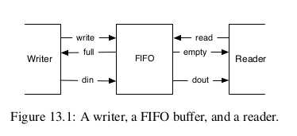

- [11.示例设计](#11示例设计)
  - [11.1 FIFO缓冲器](#111-fifo缓冲器)
  - [11.2 一个串口端口](#112-一个串口端口)


# 11.示例设计
在这个部分，我们探索一些小型数字设计，例如FIFO缓冲，这是用于大型设计的部分。作为另一个例子，我们设计一个串行接口（也叫UART），它本身会使用FIFO缓冲器。  
## 11.1 FIFO缓冲器
我们可以分离一个写入（发送者）和一个读取（接收者），在写和读之间插入一个缓冲器。一个常见的缓冲器是一个先进先出（FIFO）缓冲器。图13.1展示了一个写入者、FIFO和读取者。写入者通过din信号将数据放入FIFO，同时激活写信号。读取者通过dout信号从FIFO中读取数据，同时激活读信号。  
FIFO最初是空的，通过empty信号表示。从空的FIFO中读取通常是未定义的行为。当数据被写入但从未被读取时，FIFO将变满。向满的FIFO写入通常会被忽略，数据也会丢失。换句话说，empty和full信号用作握手信号。  
  
FIFO有几种不同的实现方式：例如，使用片上内存和读写指针，或者简单地使用寄存器链和一个小型状态机。对于小型缓冲区（最多几十个元素），使用单独寄存器连接成缓冲链的FIFO是一种简单且资源需求较低的实现方式。Bubble FIFO的代码可以在chisel-examples仓库中找到。  

我们开始定义IO信号用于写入和读出端。数据的大小是通过size设置的。写入数据是din，写入信号时write。信号full作为flow control在写入端。  
```
class WriterIO(size: Int) extends Bundle {
    val write = Input(Bool())
    val full = Output(Bool())
    val din = Input(UInt(size.W))
}
```  

读出端提供dout作为数据，并且读出端是使用read初始化的。empty信号是负责读出端的流控制。下面代码展示了单个缓存区。该缓冲区有一个类型为WriterIO的入队端口enq和一个类型为ReaderIO的出队端口deq。缓冲区的状态元素包括一个用于存储数据的寄存器（dataReg）和一个用于简单有限状态机（FSM）的状态寄存器（stateReg）。FSM只有两种状态：缓冲区为空或满。如果缓冲区为空，写入操作将注册输入数据并切换到满状态。如果缓冲区为满，读取操作将消耗数据并切换到空状态。IO端口full和empty分别表示缓冲区的状态，供写入者和读取者使用。  
```
class FifoRegister(size: Int) extends Module {
    val io = IO(new Bundle {
        val enq = new WriterIO(size)
        val deq = new ReaderIO(size)
    })
    buffers(i).io.deq.read := ~buffers(i + 1).io.enq.full

}
```  
这个展示的想法是连接独立的缓冲, 去补充一个FIFO队列, 称为冒泡FIFO, 因为数据从队列冒泡。 这个简单的解法，在数据率比时钟慢的情况下是好的，例如，用于序列端口的去耦缓冲，在下一部分展示。  

但是，当数据绿达到时钟频率，冒泡FIFO有两个限制： (1)因为每个缓存需要在empty和full摆动， 这意味着最大吞吐量是每个字长两个时钟周期。 (2)数据需要通过整个FIFO进行冒泡，于是， 从输入到输出的延迟至少是buffer的数量。 我会展示另外的FIFO的可能做法Section 13.3。  

## 11.2 一个串口端口
一个串口（UART）是最简单的方法之一是在你的电脑和FPGA板连接。像名字那样暗示，数据是连续传输的。一个8位子节按照以下传输：从0位开始，8位的数据，从最低有效位开始，然后每次1到两个bits。当没有数据传输时，输出1.  

