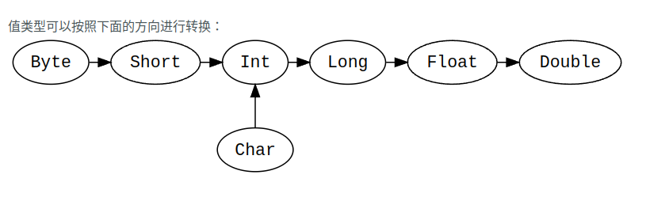

- [9:Scala的继承关系](#9scala的继承关系)
- [10：特质](#10特质)
  - [定义一个特质](#定义一个特质)
  - [使用特质](#使用特质)
  - [子类型](#子类型)
  - [混入mix in](#混入mix-in)
- [11: 包和引入](#11-包和引入)
  - [创建包](#创建包)
  - [导入](#导入)
- [12：样例类case class 和 模式匹配pattern matching](#12样例类case-class-和-模式匹配pattern-matching)
  - [样例类](#样例类)
    - [定义一个样例类](#定义一个样例类)
    - [比较](#比较)
    - [拷贝](#拷贝)
  - [模式匹配](#模式匹配)
    - [语法](#语法)
    - [样例类的匹配](#样例类的匹配)
    - [模式守卫](#模式守卫)
    - [仅匹配类型](#仅匹配类型)
    - [密封装](#密封装)
- [13: 正则表达式](#13-正则表达式)
- [14:泛型类](#14泛型类)
  - [定义一个泛型类](#定义一个泛型类)
  - [使用](#使用)
- [15:型变](#15型变)
  - [协变](#协变)
  - [逆变](#逆变)
  - [不变](#不变)
  - [与其他语言的比较](#与其他语言的比较)
- [16：类型上界](#16类型上界)
- [17： 类型下界](#17-类型下界)
- [18：抽象成员](#18抽象成员)
  - [抽象字段](#抽象字段)
  - [抽象方法](#抽象方法)
  - [抽象类型](#抽象类型)
  - [混合抽象成员](#混合抽象成员)
  - [抽象成员的特点](#抽象成员的特点)
  - [抽象成员的实际应用](#抽象成员的实际应用)
- [19:隐式转换和隐式参数](#19隐式转换和隐式参数)
  - [隐式转换](#隐式转换)
  - [隐式参数](#隐式参数)
- [20:提取器](#20提取器)
- [21：注解](#21注解)
  - [常见的scala注解](#常见的scala注解)
  - [自定义注解](#自定义注解)


## 9:Scala的继承关系  
  
Any是所有类型的超类型，也称为顶级类型。它定义了一些通用的方法如equals,hashCode和toString。Any有两个直接子类：AnyVal和AnyRef。  

AnyVal代表值类型。有9个预定义的非空的值类型分别是：Double,Float,Long,Int,Short,Byte,Char,Unit和Boolean。Unit是不带任何意义的值类型，它仅有一个实例可以像这样声明：()。所有的函数必须有返回，所以说有时候Unit也是有用的返回类型。  

AnyRef代表引用类型。所有非值类型都被定义为引用类型。在scala中，每个用户自定义的类型都是ANyRef的子类型。如果scala被应用在java大的运行环境中，AnyRef相当于java.lang.Object。  

**类型转换：**  
  
```
val x: Long = 987654321
val y: Float = x.toFloat  // 9.8765434E8 (note that some precision is lost in this case)

val face: Char = '☺'
val number: Int = face  // 9786
```  

转换是单向的，下面这样写将不会通过编译。  
```
val x: Long = 987654321
val y: Float = x.toFloat  // 9.8765434E8
val z: Long = y  // Does not conform
```  
***  
**Nothing和Null**  
Nothing 是所有类型的子类型，也称为底部类型。没有一个值是Nothing类型的。它的用途之一是给出非正常终止的信号。如抛出异常、程序推出或者一个无限循环（可以理解为它是一个不对值进行定义的表达式的类型，或者是一个不能正常返回的方法）。  

Null 是所有引用类型的子类型（即AnyRef的任意子类型）。它有一个单例值由关键字null所定义。  
Null 主要是使得Scala满足和其他JVM语言的互操作性，但是几乎不应该在Scala代码中使用。  

## 10：特质
特质trait 用于类之间共享程序接口interface 和字段fields。类似于java 8的接口。类和对象可以扩展特质，但特质不能被实例化，因此特质没有参数。  
### 定义一个特质
最简化的特质就是关键字trait + 标识符：  
```
trait HairColor
```  

特质作为泛型类型和抽象方法非常有用。  
```
trait Iterator[A] {
    def hasNext: Boolean
    def next(): A
}
```  
扩展trait Iterator[A]需要一个类型A和实现方法hasNext和next。  
### 使用特质
使用 extends关键字来扩展特征。然后使用override关键字来实现特质trait里面的任何抽象成员：  
```
trait Iterator[A] {
    def hasNext: Boolean
    def next(): A
}

class IntIterator(to: Int) extends Iterator[Int] {
    private var current = 0
    override def hasNext: Boolean = current < to
    override def next(): Int = {
        if (hasNext) {
            val t = current
            current += 1
            t
        } else 0
    }
}
val iterator = new IntIterator(10)
iterator.next()  // returns 0
iterator.next()  // returns 1
```  
这个类 IntIterator 将参数 to 作为上限。它扩展了 Iterator [Int]，这意味着方法 next 必须返回一个Int。  

### 子类型
凡是需要特质的地方，都可以由该特质的子类型来替换。  
```
import scala.collection.mutable.ArrayBuffer

trait Pet {
  val name: String
}

class Cat(val name: String) extends Pet
class Dog(val name: String) extends Pet

val dog = new Dog("Harry")
val cat = new Cat("Sally")

val animals = ArrayBuffer.empty[Pet]
animals.append(dog)
animals.append(cat)
animals.foreach(pet => println(pet.name))  // Prints Harry Sally
```  
在这里 trait Pet 有一个抽象字段 name ，name 由Cat和Dog的构造函数中实现。最后一行，我们能调用pet.name的前提是它必须在特质Pet的子类型中得到了实现。  

### 混入mix in
当某个特质被用于组合类时，被成为混入。  
```
abstract class A {
  val message: String
}
class B extends A {
  val message = "I'm an instance of class B"
}
trait C extends A {
  def loudMessage = message.toUpperCase()
}
class D extends B with C

val d = new D
println(d.message)  // I'm an instance of class B
println(d.loudMessage)  // I'M AN INSTANCE OF CLASS B
```  
类D有一个父类B和一个混入C。一个类只能有一个父类但是可以有多个混入（分别使用关键字extends和with）。混入和某个父类可能有相同的父类。  

现在，让我们看一个更有趣的例子，其中使用了抽象类：  
```
abstract class AbsIterator {
  type T
  def hasNext: Boolean
  def next(): T
}
```  
该类中有一个抽象的类型T和标准的迭代器方法。  

接下来，我们将实现一个具体的类（所有的抽象成员T、hasNext和next都会被实现）：  
```
class StringIterator(s: String) extends AbsIterator {
  type T = Char
  private var i = 0
  def hasNext = i < s.length
  def next() = {
    val ch = s charAt i
    i += 1
    ch
  }
}
```  
StringIterator带有一个String类型参数的构造器，可用于对字符串进行迭代。（例如查看一个字符串是否包含某个字符）：  
现在我们创建一个特质，也继承于AbsIterator。  
```
trait RichIterator extends AbsIterator {
  def foreach(f: T => Unit): Unit = while (hasNext) f(next())
}
```  
该特质实现了foreach方法——只要还有元素可以迭代（while (hasNext)），就会一直对下个元素(next()) 调用传入的函数f: T => Unit。因为RichIterator是个特质，可以不必实现AbsIterator中的抽象成员。  

下面我们要把StringIterator和RichIterator 中的功能组合成一个类。  
```
object StringIteratorTest extends App {
  class RichStringIter extends StringIterator("Scala") with RichIterator
  val richStringIter = new RichStringIter
  richStringIter foreach println
}
```  
新的类RichStringIter有一个父类StringIterator和一个混入RichIterator。如果是单一继承，我们将不会达到这样的灵活性。  

## 11: 包和引入
Scala 使用包来创建命名空间，从而允许你创建模块化程序。
### 创建包
通过在scala文件的头部声明一个或多个包名称来创建包。  
```
package users

class User
```  
一个惯例是将包命名为与包含scala文件目录名相同。但是scala并未对文件布局作任何限制。在一个scala工程中，package users的目录结构可能如下：  
```
- ExampleProject
  - build.sbt
  - project
  - src
    - main
      - scala
        - users
          User.scala
          UserProfile.scala
          UserPreferences.scala
    - test
```  
注意 users 目录是包含在scala目录中的，该包中包含有多个scala文件。包中的每个scala文件都可以具有相同的包声明。声明包的另一种方式是使用大括号：  
```
package users {
    package administrators {
        class NormalUser
    }
    package normalusers {
        class NormalUser
    }
}
```  
如你所见，这允许包嵌套并提供了对范围内的封装的更好控制。  

包名称应全部为小邪，如果代码是在拥有独立网站的组织内开发的，则应采用以下的约定格式：top-level-domain>.<domain-name>.<project-name>。 例如，如果 Google 有一个名为 SelfDrivingCar 的项目，则包名称将如下所示：  
```
package com.google.selfdrivingcar.camera

class Lens

```  
SelfDrivingCar/src/main/scala/com/google/selfdrivingcar/camera/Lens.scala  

### 导入
import语句用于导入其他包中的成员（类，特质，函数等）。使用相同包的成员不需要import语句。导入语句可以有选择性：  
```
import users._       //导入包users中的所有成员
import users.User    //导入类User
import user.{User, UserPreferences}      //仅导入选择的成员
import users.{UserPreferences => Uprefs} //导入类并设置别名
```  
scala不同于java的一点是scala可以在任何地方使用导入：  
```
def sqrtplus1(x: Int) = {
    import scala.math.sqrt
    sqrt(x) + 1.0
}
```  
如果存在命名冲突并且你需要从项目的根目录录入，请在包名称前加上：``` _root_```  
```
package accounts
import _root_.users._
```  
注意：包scala和java.lang以及object Predef是默认导入的。  

## 12：样例类case class 和 模式匹配pattern matching
样例类case class 和模式匹配，这组孪生的语法结构为我们编写规则的、未封装的数据结构提供支持。这两个语法结构对于表达树形的递归数据尤其有用。  
### 样例类
#### 定义一个样例类
一个最简单的样例类定义由关键字case class，类名，参数列表（可为空）组成：  
```
case class Book(isbn: String)
val frankenstein = Book("978-0486282114")
```  
注意在实例化样例类Book时，并没有使用关键字new，这是因为样例类有一个默认的apply方法来负责对象的创建。  

当你创建包含参数的样例类时，这些参数时公开的val：  
```
case class Message(sender: String, recipient: String, body: String)
val message1 = Message("guillaume@quebec.ca", "jorge@catalonia.es","Ca va?")

println(message1.sender)    //输出guillaume@quebec.ca
message1.sender = "travis@washington.us"    //此处将无法编译
```  
你不能给message1.sender重新赋值，因为它时val（不可变）。在样例类中使用var也是可以的，但是不推荐这样。  
#### 比较
样例类在比较的时候是按值比较而非按引用比较：  
```
case class Message(sender: String, recipient: String, body: String)

val message2 = Message("jorge@catalonia.es", "guillaume@quebec.ca", "Com va?")
val message3 = Message("jorge@catalonia.es", "guillaume@quebec.ca", "Com va?")
val messagesAreTheSame = message2 == message3  // true
```  
尽管message2和message3引用不同的对象，但是他们的值是相等的，所以message2 == message3为true。  

#### 拷贝
你可以通过copy方法创建一个样例类实例的浅拷贝，同时可以指定构造参数来做一些改变。  
```
case class Message(sender: String, recipient: String, body: String)
val message4 = Message("julien@bretagne.fr", "travis@washington.us", "Me zo o komz gant ma amezeg")
val message5 = message4.copy(sender = message4.recipient, recipient = "claire@bourgogne.fr")
message5.sender  // travis@washington.us
message5.recipient // claire@bourgogne.fr
message5.body  // "Me zo o komz gant ma amezeg"
```  
上述代码指定message4的recipient作为message5的sender，指定message5的recipient为”claire@bourgogne.fr”，而message4的body则是直接拷贝作为message5的body了。  

### 模式匹配
模式匹配是检查某个值是否匹配某一个模式的机制，一个成功的匹配同时会将匹配值结构为其组成部分。它是java的switch语句的升级版，同样可以用于替代一系列的if/else语句。  
#### 语法
一个模式匹配语句包括一个待匹配的值，match关键字，以及至少一个case语句。  
```
import scala.util.Random

val x: Int = Random.nextInt(10)

x match {
    case 0 => "zero"
    case 1 => "one"
    case 2 => "two"
    case _ => "other"
}
```  
上述代码中的val x是一个0到10之间的随机整数，将它放在match运算符的左侧对其进行模式匹配，match的右侧是包含4条case的表达式，其中最后一个case _表示匹配其余所有情况，在这里就是其他可能的整型值。  

match表达式具有一个结果值  
```
def matchTest(x: Int): String = x match {
    case 1 => "one"
  case 2 => "two"
  case _ => "other"
}
matchTest(3)  // other
matchTest(1)  // one
```  
这个match表达式是String类型的，因为所有的情况（case）均返回String，所以matchTest函数的返回值是String类型。  

#### 样例类的匹配
样例类非常适合用于模式匹配
```
abstract class Notification

case class Email(sender: String,title: String, body: String) extends Notification
case class SMS(caller: String, message:String) extends Notification
case class VoiceRecording(contactName: String, link: String) extends Notification
```  
Notification 是一个虚基类，它有三个具体的子类Email, SMS和VoiceRecording，我们可以在这些样例类(Case Class)上像这样使用模式匹配：  
```
def showNotification(notification: Notification): String = {
    notification match {
        case Enail(sender, title, _) =>
            s"You got an email from $sender with title: $title"
        case SMS(number, message) =>
            s"You got an SMS from $number! Message: $message"
        case VoiceRecording(name, link) =>
            s"you received a Voice Recording from $name! Click the link to hear it: $link"
    }
}
val someSms = SMS("12345", "Are you there?")
val someVoiceRecording = VoiceRecording("Tom", "voicerecording.org/id/123")

println(showNotification(someSms))  // prints You got an SMS from 12345! Message: Are you there?

println(showNotification(someVoiceRecording))  // you received a Voice Recording from Tom! Click the link to hear it: voicerecording.org/id/123
```  
showNotification函数接受一个抽象类Notification对象作为输入参数，然后匹配其具体类型。（也就是判断它是一个Email，SMS，还是VoiceRecording）。在case Email(sender, title, _)中，对象的sender和title属性在返回值中被使用，而body属性则被忽略，故使用_代替。  
#### 模式守卫
为了让匹配更加具体，可以使用模式守卫，也就是在模式谋面加```if <boolean expression>```  
```
def showImportantNotification(notification: Notification, importantPeopleInfo: Seq[String]): String = {
  notification match {
    case Email(sender, _, _) if importantPeopleInfo.contains(sender) =>
      "You got an email from special someone!"
    case SMS(number, _) if importantPeopleInfo.contains(number) =>
      "You got an SMS from special someone!"
    case other =>
      showNotification(other) // nothing special, delegate to our original showNotification function
  }
}

val importantPeopleInfo = Seq("867-5309", "jenny@gmail.com")

val someSms = SMS("867-5309", "Are you there?")
val someVoiceRecording = VoiceRecording("Tom", "voicerecording.org/id/123")
val importantEmail = Email("jenny@gmail.com", "Drinks tonight?", "I'm free after 5!")
val importantSms = SMS("867-5309", "I'm here! Where are you?")

println(showImportantNotification(someSms, importantPeopleInfo))
println(showImportantNotification(someVoiceRecording, importantPeopleInfo))
println(showImportantNotification(importantEmail, importantPeopleInfo))
println(showImportantNotification(importantSms, importantPeopleInfo))
```  
在case Email(sender, _, _) if importantPeopleInfo.contains(sender)中，除了要求notification是Email类型外，还需要sender在重要人物列表importantPeopleInfo中，才会匹配到该模式。  

#### 仅匹配类型
也可以仅匹配类型：  
```
abstract class Drinks
case class Naixue(temperature: String) extends Drinks {
    def coldNo = "这杯奈雪不冷"
}
case class Xicha(temperature: String) extends Drinks {
    def coldYes = "这杯喜茶冷的“
}

def thirsty(drinks: Drinks) = drinks match {
    case n: Naixue => n.coldNo
    case x: Xicha => x.coldYes
}
```  
当不同类型对象需要调用不同方法时，仅匹配类型的模式非常有用，入上面代码中thirsty函数对不同类型的Drinks有着不同的表现。一般使用类型的首字母作为case的标识符，例如上述代码的n和x，这是一种惯例。  
#### 密封装
特质trait和类class可以用sealed标记为密封的，这意味着其所有子类都必须与之定义在相同文件中，从而保证所有子类型都是已知的。  
```
sealed abstract class Furniture
case class Couch() extends Furniture
case class Chair() extends Furniture

def findPlaceToSit(piece: Fruniture): String = piece match {
    case a:Couch => "Lie on the couch"
    case b: Chair => "Sit on the chair"
}
```  
这对于模式匹配很有用，因为我们不再需要一个匹配其他任意情况的case。  

## 13: 正则表达式
正则表达式是用来找出数据中的指定模式（或缺少该模式）的字符串。```.r```方法可使任意字符串编程一个正则表达式。  
```
import scala.util.matching.Regex

val numberPattern: Regex = "[0-9]".r

numberPattern.findFirstMatchIn("awesomepassword") match {
    case Some(_) => println(Password OK")
    case None => println("Password must contaion a number")
}
```  
上例中，numberPattern的类型是正则表达式类Regex，其作用是确保密码中包含一个数字。  

你还可以使用括号来同时匹配多组正则表达式。  
```
import scala.util.matching.Regex

val keyValPattern: Regex = "([0-9a-zA-Z-#() ]+): ([0-9a-zA-Z-#() ]+)".r

val input: String =
  """background-color: #A03300;
    |background-image: url(img/header100.png);
    |background-position: top center;
    |background-repeat: repeat-x;
    |background-size: 2160px 108px;
    |margin: 0;
    |height: 108px;
    |width: 100%;""".stripMargin

for (patternMatch <- keyValPattern.findAllMatchIn(input))
  println(s"key: ${patternMatch.group(1)} value: ${patternMatch.group(2)}")

```  
上例解析出了一个字符串中的多个键和值，其中的每个匹配又有一组子匹配，结果如下：  
```
key: background-color value: #A03300
key: background-image value: url(img
key: background-position value: top center
key: background-repeat value: repeat-x
key: background-size value: 2160px 108px
key: margin value: 0
key: height value: 108px
key: width value: 100
```  
## 14:泛型类
泛型类指可以接收类型参数的类。泛型类在集合类中被广泛使用。  
### 定义一个泛型类
泛型类使用方括号[]来接收类型参数。一个惯例是使用字母A作为参数标识符，当然你可以使用任何参数名称。  
```
class Stack[A] {
    private var elements: List[A] = Nil
    def push(x: A): Unit =
        elements = x :: elements
    def peek: A = elements.head
    def pop(): A = {
        val currentTop = peek
        elements = elements.tail
        currentTop
    }
}
```  
上面的Stack类的实现中接受类型参数A。这表示其内部的列表，var elements: List[A] = Nil，只能够存储类型 A 的元素。方法def push 只接受类型 A 的实例对象作为参数(注意：elements = x :: elements 将 elements 放到了一个将元素 x 添加到 elements 的头部而生成的新列表中)。  
### 使用
要使用一个泛型类，将一个具体类型放到方括号中代替A。  
```
val stack = new Stack[Int]
stack.push(1)
stack.push(2)
println(stack.pop)  //输出2
println(stack.pop)  //输出1
```  
实例对象 stack 只能接受整型值。然而，如果类型参数有子类型，子类型可以被传入：  
```
class Fruit
class Apple extends Fruit
class Banana extends Fruit

val stack = new Stack[Fruit]
val apple = new Apple
val banana = new Banana

stack.push(apple)
stack.push(banana)
```  
类 Apple 和类 Banana 都继承自类 Fruit，所以我们可以把实例对象 apple 和 banana 压入栈 Fruit 中。

注意：泛型类型的子类型是*不可传导*的。这表示如果我们有一个字母类型的栈 Stack[Char]，那它不能被用作一个整型的栈 Stack[Int]。否则就是不安全的，因为它将使我们能够在字母型的栈中插入真正的整型值。结论就是，只有当类型 B = A 时， Stack[A] 是 Stack[B] 的子类型才成立。因为此处可能会有很大的限制，Scala 提供了一种 类型参数注释机制 用以控制泛型类型的子类型的行为。  

## 15:型变
型变是复杂类型的子类型关系与其他组件类型的子类型关系的相关性。scala支持泛型类的类型参数的型变注解，允许它们是协变的，逆变的，或在没有使用注解的情况下是不变的。在类型系统中使用型变允许我们在复杂类型之间建立直观的连接，而缺乏型变则会限制类抽象的重用性。  
```
class Foo[+A]   //协变
class Bar[-A]   //逆变
class Baz[A]    //不变
```  
### 协变
使用注释 +A，可以使一个泛型类的类型参数A变成协变。对于某些类class List[+A],使A变成协变意味着对于两种类型A和B，如果A和B的子类型，那么List[A]就是List[B]的子类型。这允许我们使用泛型来创建非常有用和直观的子类型关系。  
```
class Animal
class Dog extends Animal
class Cat extends Animal

class Container[+A](val content: A)

val animalContainer: Container[Animal] = new Container[Dog](new Dog)
```  
Container[+A] 表示容器是协变的。  
因为 Dog 是 Animal 的子类，所以 Container[Dog] 是 Container[Animal] 的子类。  

**适用场景：**  
协变适用于只**输出类型参数的场景** ，如get方法返回类型T：  
```
class CovariantContainer[+A](val content: A) {
  def get: A = content
}
```  


### 逆变
通过使用注释 -A，可以使一个泛型类的类型参数A成为逆变。与协变类似，这会在类及其类型参数之间创建一个子类型关系，但其作用与协变完全相反。也就是说，对于某个类class Writer[-A],使A逆变意味着对于两种类型A和B，如果A是B的子类型，那么Writer[B]是Writer[A]的子类型。  
考虑在下例中使用上面定义的类Cat,Dog和Animal：  
```
abstract class Printer[-A] {
    def print(value: A): Unit
}
```  
这里Printer[A]是一个简单的类，用于打印某种类型的A。让我们定义一些特定的子类：  
```
class AnimalPrinter extends Printer[Animal] {
    def print(animal: Animal): Unit = 
        println("这动物的名字是:" + animal.name)
}
class CatPrinter extends Printer[Cat] {
    def print(cat: Cat): Unit = 
        println("这猫的名字是:" + cat.name)
}
```  
如果Printer[Cat]知道如何在控制台打印出任意Cat，并且Printer[Animal]知道如何在控制台打印出任意
Animal，那么Printer[Animal] 也应该知道如何打印出 Cat 就是合理的。反向关系不适用，因为 Printer[Cat] 并不知道如何在控制台打印出任意 Animal。 因此，如果我们愿意，我们应该能够用 Printer[Animal] 替换 Printer[Cat]，而使 Printer[A] 逆变允许我们做到这一点。  
```
object ContravarianceTest extends App {
    val myCat: Cat = Cat("BBBB")

    def printMyCat(printer: Printer[Cat]): UNit = {
        printer.print(myCat)
    }
    val catPrinter: Printer[Cat] = new CatPrinter
    val animalPrinter: Printer[Animal] = new AnimalPrinter

    printMyCat(catPrinter)
    printMyCat(animalPrinter)
}
```  
输出：  
```
这猫的名字是: BBBB
这动物的名字是: BBBB
```  

**适用场景：**  
逆变适用于只**输入类型参数的场景**。  

### 不变
默认情况下，scala中的泛型类是不变的。这意味着它们即不是协变的也不是逆变的。在下例中，类Container是不变的。Container[Cat] 不是Container[Animal]，反之亦然。  
```
class Container[A](value: A) {
    private var _value: A = value
    def getValue: A = _value
    def setValue(value: A): Unit = {
        _value = value
    }
}
```  
可能看起来一个Container[Cat]自然也应该是一个Container[Animal]，但允许一个可变的泛型类成为协变并不安全。在这个例子中，Container是不变的非常重要。假设Container实际上是协变的，下面的情况可能会发生：  
```
val catContainer: Container[Cat] = new Container(Cat("Felix"))
val animalContainer: COntainer[Animal] = catContainer
animalContainer.setValue(Dog("Spot"))
val cat: Cat = catContainer.getValue    //糟糕，我们最终会将一只狗作为值分配给一只猫
```  
幸运的是，编译器在此之前就会阻止我们。  
### 与其他语言的比较
某些与 Scala 类似的语言以不同的方式支持型变。 例如，Scala 中的型变注释与 C# 中的非常相似，在定义类抽象时添加型变注释（声明点型变）。 但是在Java中，当类抽象被使用时（使用点型变），才会给出型变注释。  

## 16：类型上界
在scala中，类型参数和抽象类型都可以有一个类型边界约束。这种类型边界在限制类型变量实际取值的同时还能展露类型成员的更多信息。比如像T <: A这样声明的类型上界表示变量T应该是类型A的子类。下面的例子展示了类PetContainer的一个类型参数的类型上界。
```
abstract class Animal {
    def name: String
}

abstract class Pet extends Animal {}

class Cat extends Pet {
    override def name: String = "Cat"
}

class Dog extends Pet {
    override def name: String = "Dog"
}

class Lion extends Animal {
    override def name: String = "Lion"
}

class PetContainer[P <: Pet](p: P) {
    def pet: P = p
}

val dogContainer = new PetContainer[Dog](new Dog)
val catContainer = new PetContainer[Cat](new Cat)
```  

```
//这将会不能编译
val lionContainer = new PetContainer[Lion](new Lion)
```  
类PetContainer接受一个必须是Pet子类的类型参数P。因为Dog和Cat都是Pet的子类，所以可以构造PetContainer[Dog]和PetContainer[Cat]。但在尝试构造PetContainer[Lion]的时候会得到下面的错误信息。这是因为Lion并不是Pet的子类。  

## 17： 类型下界
类型上界将类型限制为另一种类型的子类型，而类型下界将类型声明为另一种类型的超类型。术语B >: A 表示类型参数B或抽象类型B 是类型A的超类型。在大多数情况下，A将是类的类型参数，而B将是方法的类型参数。  
下面看一个适合用类型下界的例子：  
```
trait Node[+B] {
    def prepend(elem: B): Node[B]
}

case class ListNode[+B](h: B, t: Node[B]) extends Node[B] {
    def prepend(elem: B): ListNode[B] = ListNode(elem, this)
  def head: B = h
  def tail: Node[B] = t
}

case class Nil[+B]() extends Node[B] {
  def prepend(elem: B): ListNode[B] = ListNode(elem, this)
}
```  
该程序实现了一个单链表。 Nil 表示空元素（即空列表）。 class ListNode 是一个节点，它包含一个类型为 B (head) 的元素和一个对列表其余部分的引用 (tail)。 class Node 及其子类型是协变的，因为我们定义了 +B。  
但是，这个程序 不能 编译，因为方法 prepend 中的参数 elem 是协变的 B 类型。 这会出错，因为函数的参数类型是逆变的，而返回类型是协变的。  
要解决这个问题，我们需要将方法 prepend 的参数 elem 的型变翻转。 我们通过引入一个新的类型参数 U 来实现这一点，该参数具有 B 作为类型下界。  
```
trait Node[+B] {
  def prepend[U >: B](elem: U): Node[U]
}

case class ListNode[+B](h: B, t: Node[B]) extends Node[B] {
  def prepend[U >: B](elem: U): ListNode[U] = ListNode(elem, this)
  def head: B = h
  def tail: Node[B] = t
}

case class Nil[+B]() extends Node[B] {
  def prepend[U >: B](elem: U): ListNode[U] = ListNode(elem, this)
}
```  
现在：  
```
trait Bird
case class AfricanSwallow() extends Bird
case class EuropeanSwallow() extends Bird

val africanSwallowList= ListNode[AfricanSwallow](AfricanSwallow(), Nil())
val birdList: Node[Bird] = africanSwallowList
birdList.prepend(EuropeanSwallow())
```  
可以为 Node[Bird] 赋值 africanSwallowList，然后再加入一个 EuropeanSwallow。s

## 18：抽象成员
在scala中，抽象成员是指类或特质中未提供实现的成员。抽象成员可以是字段、方法，也可以是类型。抽象成员必须在子类或实现类中被实现，否则该类仍然是抽象的。  

### 抽象字段
抽象字段是指在类或特质中定义了字段但没有初始化值。抽象字段定义了必须由子类实现的属性。  
示例：  
```
abstract class Person {
    val name: String
    var age: Int        //这两个都是抽象字段
}
class Student extends Person {
    val name: String = "Niuma"
    var age: Int = 23
}

val student = new Student
println(student.name)   //输出Niuma
println(student.age)    //输出23
```  
### 抽象方法
抽象方法是指未提供实现的方法。子类必须实现这些方法。  
示例：  
```
abstract class Shape {
    def area: Double    //抽象方法
}

class Circle(val r: Double) extends Shape {
    def area: Double = Math.PI * r * r  //实现上面的抽象方法
}

val circle = new Circle(5)
println(circle.area) // 输出: 78.53981633974483
```  
### 抽象类型
抽象类型是指在特质或类中定义了类型成员但未指定具体类型。子类或实现类需要具体化这些类型。  
示例：  
```
trait Container {
    type T
    def value: T
}
class IntContainer extends Container {
    type T = Int    //实现抽象类型
    def value: T = 42
}

val intContainer = new IntContainer
println(intContainer.value) // 输出: 42
```  
### 混合抽象成员
一个类或特质可以同时包含抽象字段、抽象方法和抽象类型。所有这些成员都需要在具体实现中具体定义。  
示例：  
```
trait Animal {
    val name: String            //抽象字段
    def sound: String           //抽象方法
    type Food                   //抽象类型
    def eat(food: Food): UNit   //适用抽象类型的方法
}

class Dog extends Animal {
    val name: String = "Dog"    //实现抽象字段
    def sound: String = "Woof"  //实现抽象方法
    type Fppd = String          //实现抽象类型
    def eat(food: Food): Unit = println(s"Eating $food")    //实现方法 
}

val dog = new Dog
println(dog.name) // 输出: Dog
println(dog.sound) // 输出: Woof
dog.eat("bone") // 输出: Eating bone
```  
### 抽象成员的特点
1.定义行为：抽象成员定义了需要子类实现的接口或行为。  
2.不需要关键字：抽象字段和方法在scala中不需要abstract关键字，仅仅通过不提供实现具体实现即可。  
3.与特质结合：抽象成员在特质中更常用，因为特质通常定义行为接口。  

### 抽象成员的实际应用
**1.定义行为接口：** 抽象成员可以在特质中定义接口行为，由具体类实现。  
```
trait Logger {
    def log(message: String): Unit  //抽象方法
}

class ConsoleLogger extends Logger {
    def log(message: String): Unit = println(message)   //实现抽象方法
}
```  
***  
**2.提供灵活性：** 抽象类型允许更灵活的设计，不需要在特质中固定数据类型。  
```
trait Processor {
    type Input
    type Output
    def process(input: Input): Output
}

class StringProcessor extends Processor {
    type Input = String
    type Output = String
    def process(input: String): Int = input.length
}

val processor = new StringProcessor
println(processor.process("Scala")) // 输出: 5
```  
***  
**3.抽象字段作为依赖注入：** 抽象字段可以用来提供依赖注入的功能。  
```
trait Config {
    val url: String
}

class Database(config: Config) {
    def connect(): Unit = println(s"Connecting to ${config.url}")
}

val config = new Config {
    val url: String = "jdbc://localhost"
}

val db = new Database(config)
db.connect() // 输出: Connecting to jdbc://localhost
```  
## 19:隐式转换和隐式参数
在scala中的隐式转换和隐式参数是强大的功能，用于简化代码、增强可读性和提高开发效率。这些能够在编译时帮助程序找到缺失的值或自动完成类型转换。  
### 隐式转换
隐式转换是一种自动将一种类型转换为另一种类型的机制。通过定义隐式函数，scala可以在需要时自动调用该函数完成类型转换，而不需要显示地调用它。隐式转换由 implicit 关键字定义，并通常是一个函数。  
示例：  
```
//定义隐式转换函数
implicit def intToString(x: Int): String = x.toString

//使用隐式函数
val str: String = 42    //自动将Int转换为String
println(str)            //输出42
```  
**隐式类：**  
隐式类是一个简洁的方式，用于为现有类型添加新方式或功能。  
```
implicit class RichInt(val x: Int) {
    def square: Int = x * x
}

val num = 5
println(num.square) // 输出: 25
```  
**隐式转换的使用场景：**  
1.类型增强：为现有类型添加方法。  
2.DSL（领域特定语言）设计：通过隐式转换使语法更自然。  
3.类型适配：自动将一种类型适配为另一种类型。  
***  
### 隐式参数
隐式参数是一种特殊的函数参数，它的值可以由编译器根据上下文自动传递，而无需显式提供。  
示例：  
```
def greet(name: String)(implicit prefix: String): String = {
    s"$prefix $name"
}

//定义隐式值
implicit val defaultPrefix: String = "Hello"

// 调用时不需要显式传递隐式参数
println(greet("Niuma")) // 输出: Hello Niuma
```  
**多个隐式参数：**  
隐式参数可以有多个，通常定义为一个参数列表。  
```
def add(x: Int, y: Int)(implicit multiplier: Int): Int = (x + y) * multiplier

implicit val multiplier: Int = 2

println(add(3, 4))      //输出12
```  
## 20:提取器  
提取器是scala模式匹配的重要概念。它允许你从对象中提取值，类似于反向构造。提取器的核心是unapply方法，通过它可以将对象分解成值，并用于模式匹配。  
**构造和提取的对比**  
构造器（apply方法）：创建对象。  
提取器（unapply方法）：将对象分解为可匹配的值。  

语法：提取器需要定义一个对象object，并实现unapply方法  
```
object Extractor {
    def unapply(arg: InputType): Option[OutputType] = {
        //返回Some(值)或None
    }
}
```  

示例：简单提取器  
```
object EmailExtractor {
    def unapply(email: String): Option[String, String] = {
        val parts = email.split("@")
        if (parts.length == 2) Some(parts(0), parts(1)) else None
    }
}

val email = "user@example.com"

email match {
    case EmailExtractor(username, domain) => println(s"Username: $username, Domain: $domain")
  case _ => println("Not a valid email address")
}

// 输出: Username: user, Domain: example.com
```  
***  
**提取器的返回值类型**  
1.Option[T]:如果匹配成功返回Some(value);如果失败返回None。  
2.Boolean：返回true表示匹配成功；返回false表示匹配失败。  
3.Option[TupleN]:用于返回多个值。  
***  
**提取器与样例类**  
scala的样例类自带提取器功能，开发者无需显式定义unapply方法。  
示例：  
```
case class Person(name: String, age: Int)

val person = Person("Niuma", 23)

person match {
    case Person(name, age) => println(s"Name: $name, Age: $age")
    case _ => println("Unknown")
}
//输出Name: Niuma, Age: 23
```  

## 21：注解
注解（Annotations）是 Scala 中的一种元编程工具，允许程序员为代码添加元信息。这些元信息可以被编译器、运行时或者工具使用，以影响代码行为或提供额外信息。  

**使用注解的场景：**  
1.影响编译器行为：提供额外的信息，避免编译器发出仅高或错误。如：@deprecated，标记某方法或类不推荐使用。  
2.与运行时交互：在运行时保留元信息，供反射或框架使用。如： @BeanProperty，用于生成 Java Bean 风格的 getter 和 setter。  
3.与工具集成：为静态分析工具、测试框架等提供标记；如： @Test，用于测试框架。  
***  
### 常见的scala注解  
**编译器相关注解：**  
@deprecated：标记方法或类为废弃状态，在使用时会提示警告。  
@inline：提示编译器尝试将方法内联优化，适用于性能敏感的小方法。  
@tailrec：确保方法是尾递归的，如果不是，编译器会报错。  
@unchecked：告诉编译器忽略模式匹配的警告。  
示例：  
```
@deprecated("Use newMethod instead", "1.0")
def oldMethod(): Unit = println("This method is deprecated")

@tailrec
def factorial(n: Int, acc: Int = 1): Int = {
  if (n <= 1) acc
  else factorial(n - 1, n * acc)
}
```  

**java集成相关注解：**  
@BeanProperty：为字段生成 Java Bean 风格的 getter 和 setter 方法。  
@SerialVersionUID：标记类的序列化版本号，用于支持 Java 序列化机制。  
@throws：用于声明方法可能抛出的异常，与 Java 的 throws 对应。  
示例：  
```
import scala.beans.BeanProperty

class Person {
  @BeanProperty var name: String = _
}

@throws[Exception]
def riskyMethod(): Unit = throw new Exception("Danger!")
```  

**测试与工具相关注解：**  
@Test：标记方法为测试用例（通常用于 JUnit）。  
@Ignore：忽略特定测试方法。  
@Before：在测试方法之前执行。  
示例：  
```
import org.junit.Test
import org.junit.Assert._

class MyTest {
  @Test
  def testAddition(): Unit = {
    assertEquals(4, 2 + 2)
  }
}
```  

**宏和元编程相关注解：**  
@compileTimeOnly：限制注解只能在编译时使用，避免在运行时保留。  

### 自定义注解
scala允许开发者定义自己的注解。所有的注解都必须扩展scala.annotation.Annotation。  
**定义简单注解：**  
```
import scala.annotation.StaticAnnotation

class MyAnnotation(message: String) extends StaticAnnotation
```  
**使用注解**
```
@MyAnnotation("This is a custom annotation")
class Example
```  
