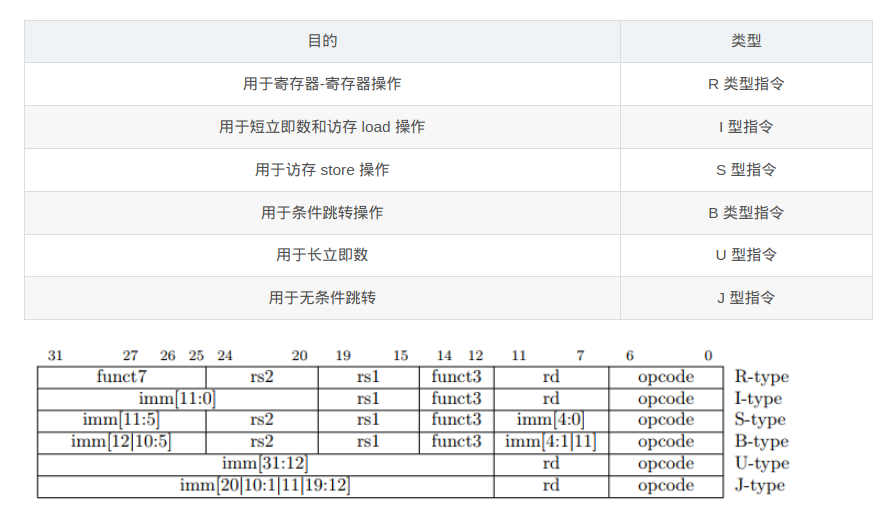
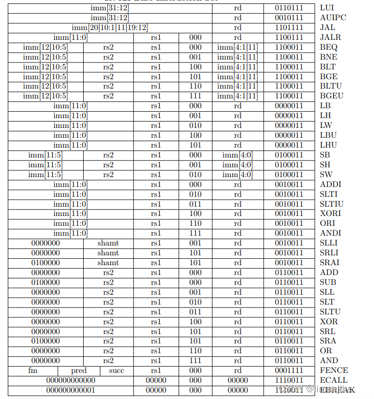

- [PA2-简单复杂的机器: 冯诺依曼计算机系统](#pa2-简单复杂的机器-冯诺依曼计算机系统)
  - [PA2.1：实现更多的指令, 在NEMU中运行大部分cpu-tests](#pa21实现更多的指令-在nemu中运行大部分cpu-tests)
    - [不停计算的机器](#不停计算的机器)
      - [CPU的指令周期](#cpu的指令周期)
      - [YEMU: 一个简单的CPU模拟器](#yemu-一个简单的cpu模拟器)
      - [题目：理解YEMU如何执行程序](#题目理解yemu如何执行程序)
    - [阅读手册](#阅读手册)
      - [RTFSC（2）](#rtfsc2)
      - [取指(指令获取，IF)](#取指指令获取if)
      - [译码(instruction decode, ID)](#译码instruction-decode-id)
      - [思考题：立即数背后的故事](#思考题立即数背后的故事)
      - [思考题：立即数背后的故事(2)](#思考题立即数背后的故事2)
      - [执行(execute, EX)](#执行execute-ex)
      - [更新PC](#更新pc)
      - [结构化程序设计](#结构化程序设计)
      - [题目：RTFSC理解指令执行的过程](#题目rtfsc理解指令执行的过程)
      - [以下是将部分宏展开后的代码：](#以下是将部分宏展开后的代码)
    - [运行第一个C程序](#运行第一个c程序)
      - [思考题：为什么执行了未实现指令会出现上述报错信息。](#思考题为什么执行了未实现指令会出现上述报错信息)
      - [题目：运行第一个客户程序](#题目运行第一个客户程序)
    - [运行更多的程序](#运行更多的程序)
      - [题目：实现更多的指令](#题目实现更多的指令)


# PA2-简单复杂的机器: 冯诺依曼计算机系统

## PA2.1：实现更多的指令, 在NEMU中运行大部分cpu-tests
### 不停计算的机器
在PA1中，已经认识到了最简单的计算机TRM的工作方式：  
```
while (1) {
  从PC指示的存储器位置取出指令;
  执行指令;
  更新PC;
}
```  

#### CPU的指令周期 
1. **取指(指令获取，IF)** 指令在存储器中, 由PC指出当前指令的位置. 事实上, PC就是一个指针! 取指令要做的事情自然就是将PC指向的指令从内存读入到CPU中。
2. **译码(instruction decode, ID)** CPU拿到一条指令之后, 可以通过查表的方式得知这条指令的操作数和操作码. 这个过程叫译码。译码逻辑实际上也并非只有一张查找表那么简单, 还需要根据不同的指令通过多路选择器选择不同的操作数。
3. **执行(execute, EX)** 经过译码之后, CPU就知道当前指令具体要做什么了, 执行阶段就是真正完成指令的工作. 现在TRM只有加法器这一个执行部件, 必要的时候, 只需要往加法器输入两个源操作数, 就能得到执行的结果了. 之后还要把结果写回到目的操作数中, 可能是寄存器, 也可能是内存。
4. **更新PC** 执行完一条指令之后, CPU就要执行下一条指令. 在这之前, CPU需要更新PC的值, 让PC加上刚才执行完的指令的长度, 即可指向下一条指令的位置。

于是, 计算机不断地重复上述四个步骤, 不断地执行指令, 直到永远。  

#### YEMU: 一个简单的CPU模拟器
这个计算机有4个8位的寄存器, 一个4位PC, 以及一段16字节的内存. 它支持R型和M型两种指令格式, 4条指令。 （R 型指令用于常规的寄存器-寄存器运算，例如加法、减法、逻辑运算等。 M 型指令属于 RV32M 扩展（乘法和除法指令），但仍然沿用 R 型指令格式。它们专门用于乘法 (mul) 和除法 (div) 相关的运算。）  其指令手册如下:  
```
                                                     4  2  0
            |                        |        | +----+--+--+
mov   rt,rs | R[rt] <- R[rs]         | R-type | |0000|rt|rs|
            |                        |        | +----+--+--+
            |                        |        | +----+--+--+
add   rt,rs | R[rt] <- R[rs] + R[rt] | R-type | |0001|rt|rs|
            |                        |        | +----+--+--+
            |                        |        | +----+--+--+
load  addr  | R[0] <- M[addr]        | M-type | |1110| addr|
            |                        |        | +----+--+--+
            |                        |        | +----+--+--+
store addr  | M[addr] <- R[0]        | M-type | |1111| addr|
            |                        |        | +----+--+--+
```  

我们可以根据指令手册用C语言编写出这个简单计算机的模拟器YEMU(袁妈模拟器):  
```
#include <stdint.h>
#include <stdio.h>

#define NREG 4
#define NMEM 16

// 定义指令格式
typedef union {
  struct { uint8_t rs : 2, rt : 2, op : 4; } rtype;
  struct { uint8_t addr : 4      , op : 4; } mtype;
  uint8_t inst;
} inst_t;

#define DECODE_R(inst) uint8_t rt = (inst).rtype.rt, rs = (inst).rtype.rs
#define DECODE_M(inst) uint8_t addr = (inst).mtype.addr

uint8_t pc = 0;       // PC, C语言中没有4位的数据类型, 我们采用8位类型来表示
uint8_t R[NREG] = {}; // 寄存器
uint8_t M[NMEM] = {   // 内存, 其中包含一个计算z = x + y的程序
  0b11100110,  // load  6#     | R[0] <- M[y]
  0b00000100,  // mov   r1, r0 | R[1] <- R[0]
  0b11100101,  // load  5#     | R[0] <- M[x]
  0b00010001,  // add   r0, r1 | R[0] <- R[0] + R[1]
  0b11110111,  // store 7#     | M[z] <- R[0]
  0b00010000,  // x = 16
  0b00100001,  // y = 33
  0b00000000,  // z = 0
};

int halt = 0; // 结束标志

// 执行一条指令
void exec_once() {
  inst_t this;
  this.inst = M[pc]; // 取指
  switch (this.rtype.op) {
  //  操作码译码       操作数译码           执行
    case 0b0000: { DECODE_R(this); R[rt]   = R[rs];   break; }
    case 0b0001: { DECODE_R(this); R[rt]  += R[rs];   break; }
    case 0b1110: { DECODE_M(this); R[0]    = M[addr]; break; }
    case 0b1111: { DECODE_M(this); M[addr] = R[0];    break; }
    default:
      printf("Invalid instruction with opcode = %x, halting...\n", this.rtype.op);
      halt = 1;
      break;
  }
  pc ++; // 更新PC
}

int main() {
  while (1) {
    exec_once();
    if (halt) break;
  }
  printf("The result of 16 + 33 is %d\n", M[7]);
  return 0;
}
```  

#### 题目：理解YEMU如何执行程序
YEMU可以看成是一个简化版的NEMU, 它们的原理是相通的, 因此你需要理解YEMU是如何执行程序的. 具体地, 你需要  
* 画出在YEMU上执行的加法程序的状态机
* 通过RTFSC理解YEMU如何执行一条指令

思考一下, 以上两者有什么联系?  

***  
1. 以上加法程序的状态机：  
| PC | R0 | R1 | R2 | R3 | M[5] | M[6] | M[7] | 执行的指令            | 操作说明                         |
|----|----|----|----|----|------|------|------|----------------------|--------------------------------|
| 0  | 0  | 0  | 0  | 0  | 16   | 33   | 0    | -                    | 初始状态                         |
| 1  | 33 | 0  | 0  | 0  | 16   | 33   | 0    | `load 6`             | R0 ← M[6]（加载 y=33）         |
| 2  | 33 | 33 | 0  | 0  | 16   | 33   | 0    | `mov r1, r0`         | R1 ← R0（复制 R0 到 R1）       |
| 3  | 16 | 33 | 0  | 0  | 16   | 33   | 0    | `load 5`             | R0 ← M[5]（加载 x=16）         |
| 4  | 49 | 33 | 0  | 0  | 16   | 33   | 0    | `add r0, r1`         | R0 ← R0 + R1（计算 16+33=49）  |
| 5  | 49 | 33 | 0  | 0  | 16   | 33   | 49   | `store 7`            | M[7] ← R0（保存结果到 z=49）   |
| 6  | 98 | 33 | 0  | 0  | 16   | 33   | 49   | `add r0, r0`         | R0 ← R0 + R0（意外执行）       |
| 7  | 98 | 33 | 0  | 0  | 16   | 33   | 49   | 无效指令（op=0x2）   | 触发停机                         |


2. 通过RTFSC理解YEMU如何执行一条指令  
根据讲义，我们能够清楚的知道CPU的执行过程是：取指，译码，执行，更新PC。  
以下是YENMU的核心代码：  
```
// 执行一条指令
void exec_once() {
  inst_t this;
  this.inst = M[pc]; // 取指
  switch (this.rtype.op) {
  //  操作码译码       操作数译码           执行
    case 0b0000: { DECODE_R(this); R[rt]   = R[rs];   break; }
    case 0b0001: { DECODE_R(this); R[rt]  += R[rs];   break; }
    case 0b1110: { DECODE_M(this); R[0]    = M[addr]; break; }
    case 0b1111: { DECODE_M(this); M[addr] = R[0];    break; }
    default:
      printf("Invalid instruction with opcode = %x, halting...\n", this.rtype.op);
      halt = 1;
      break;
  }
  pc ++; // 更新PC
}
```  
四个步骤：
1. 取指： ```this.inst = M[pc];``` ，用于从内存中读取当前PC指向的指令。
   * PC是程序计数器，指向当前要执行的指令在内存中的地址。
   * M[pc] 从内存中读取指令。
   * 读取的指令存储在this.inst 中。
2. 译码： ```switch (this.rtype.op)``` ，用于解析指令的操作码和操作数。
   * this.inst是一个联合体union，可以根据指令格式解析为 R 型或 M 型指令。
   * this.rtype.op是提取指令的操作码opcode。
   * 根据操作码进入不同的case分支。
3. 执行：就是case之后的
   * case 0b0000: mov指令，将R[rs]的值复制到R[rt]中。
   * case 0b0001: add指令，将R[rs]和R[rt]的值相加，结果存入R[rt]。
   * case 0b1110: load指令，将内存M[addr]的值加载到R[0]中。
   * case 0b1111: store指令，将R[0]的值存储到内存M[addr]中。
4. 更新PC ```pc ++``` 将PC指向下一条指令。每执行完一条指令，PC 自增 1，指向下一条指令。

状态机和代码之中有什么联系呢？  
状态机是程序执行的抽象模型，YEMU的代码是改模型的具体实现。通过分析状态机，可以直观的了解程序的行为；通过阅读代码，可以理解状态机背后的驱动机制。  

### 阅读手册
尝试阅读手册并寻找下面内容的位置：  
* 每一条指令的具体行为描述；
* 指令opcode的编码表格

根据目录，我们在 **第二章RV32I 基础整数指令集，2.1 版本** 中 **2.4整数运算指令**， **2.5控制转移指令**， **2.6加载和内存指令** 中可以看到每一条指令的具体行为描述。  

同时我们也在 **2.2基础指令格式** 和 **2.3立即数编码变量**，能看到指令opcode的编码表格。

#### RTFSC（2）
接下来跟随讲义的介绍，我们来看看NEMU的框架代码如何实现指令的执行。  

PA1中提到：  
```
cpu_exec()又会调用execute(), 后者模拟了CPU的工作方式: 不断执行指令. 
具体地, 代码将在一个for循环中不断调用exec_once()函数, 
这个函数的功能就是我们在上一小节中介绍的内容: 让CPU执行当前PC指向的一条指令, 然后更新PC。
```  

以下是exec_once()的源代码：  
```
/* 执行单条指令 | CPU执行当前PC指向的一条指令, 然后更新PC*/
static void exec_once(Decode *s, vaddr_t pc) {
  s->pc = pc;         //设置当前指令的PC
  s->snpc = pc;       //设置下一条指令的PC
  isa_exec_once(s);   //解析并执行该指令
  cpu.pc = s->dnpc;   //更新CPU的PC（下一条指令地址）
#ifdef CONFIG_ITRACE  //如果启用了指令追踪，则指令的二进制码和反汇编结果记录到日至缓冲区
  char *p = s->logbuf;
  p += snprintf(p, sizeof(s->logbuf), FMT_WORD ":", s->pc); //记录PC值
  int ilen = s->snpc - s->pc;                               //计算指令长度
  int i;
  uint8_t *inst = (uint8_t *)&s->isa.inst;                  //获取指令的二进制码
#ifdef CONFIG_ISA_x86
  for (i = 0; i < ilen; i ++) {             //对于x86架构，按顺序打印指令的二进制码
#else
  for (i = ilen - 1; i >= 0; i --) {        //对于其他架构，按逆序打印指令的二进制码
#endif
    p += snprintf(p, 4, " %02x", inst[i]);  //将每个字节以十六进制形式写入日志
  }
  int ilen_max = MUXDEF(CONFIG_ISA_x86, 8, 4);//根据架构确定最大指令长度
  int space_len = ilen_max - ilen;            //计算需要填充的空格长度
  if (space_len < 0) space_len = 0;
  space_len = space_len * 3 + 1;              //计算总空格长度（每个字节占3个字符）
  memset(p, ' ', space_len);                  //填充空格
  p += space_len;

  //调用反汇编函数，将指令的反汇编结果写入日志缓冲区
  void disassemble(char *str, int size, uint64_t pc, uint8_t *code, int nbyte);
  disassemble(p, s->logbuf + sizeof(s->logbuf) - p,
      MUXDEF(CONFIG_ISA_x86, s->snpc, s->pc), (uint8_t *)&s->isa.inst, ilen);
#endif
}
```  

具体地,exec_once()接受一个Decode类型的结构体指针s, 这个结构体用于存放在执行一条指令过程中所需的信息, 包括指令的PC, 下一条指令的PC等。  
```
// 译码结构体
typedef struct Decode {
  vaddr_t pc;   // 当前指令地址（程序计数器）
  vaddr_t snpc; // static next pc  静态，下一条指令地址
  vaddr_t dnpc; // dynamic next pc 动态，下一条指令地址
  ISADecodeInfo isa;  // 指令集架构相关译码信息
  IFDEF(CONFIG_ITRACE, char logbuf[128]);
} Decode;
```  

还有一些信息是ISA相关的, NEMU用一个结构类型ISADecodeInfo来对这些信息进行抽象, 具体的定义在nemu/src/isa/$ISA/include/isa-def.h中。    
```
// decode
//定义指令解码信息结构体
typedef struct {
  uint32_t inst;  //存储当前指令的二进制编码
} MUXDEF(CONFIG_RV64, riscv64_ISADecodeInfo, riscv32_ISADecodeInfo);//根据配置选择
```  

1. exec_once()会先把当前的PC保存到s的成员pc和snpc中, 其中s->pc就是当前指令的PC, 而s->snpc则是下一条指令的PC, 这里的snpc是"static next PC"的意思。
2. 然后代码会调用isa_exec_once()函数(在nemu/src/isa/$ISA/inst.c中定义), 这是因为执行指令的具体过程是和ISA相关的, 在这里我们先不深究isa_exec_once()的细节. 但可以说明的是, 它会随着取指的过程修改s->snpc的值, 使得从isa_exec_once()返回后s->snpc正好为下一条指令的PC. 接下来代码将会通过s->dnpc来更新PC, 这里的dnpc是"dynamic next PC"的意思. 关于snpc和dnpc的区别, 我们会在下文进行说明.  
```
/* 执行单条指令 | CPU执行当前PC指向的一条指令, 然后更新PC*/
static void exec_once(Decode *s, vaddr_t pc) {
  s->pc = pc;         //设置当前指令的PC
  s->snpc = pc;       //设置下一条指令的PC
  isa_exec_once(s);   //解析并执行该指令
  cpu.pc = s->dnpc;   //更新CPU的PC（下一条指令地址）
```   
3. 忽略exec_once()中剩下与trace相关的代码, 我们就返回到execute()中. 代码会对一个用于记录客户指令的计数器加1, 然后进行一些trace和difftest相关的操作(此时先忽略), 然后检查NEMU的状态是否为NEMU_RUNNING, 若是, 则继续执行下一条指令, 否则则退出执行指令的循环。  

事实上,exec_once()函数覆盖了指令周期的所有阶段: 取指, 译码, 执行, 更新PC, 接下来我们来看看NEMU是如何实现指令周期的每一个阶段的。

#### 取指(指令获取，IF)
isa_exec_once()做的第一件事情就是取指令。函数inst_fetch()专门负责取指令的工作。inst_fetch()最终会根据参数len来调用vaddr_ifetch(), 而目前vaddr_ifetch()又会通过paddr_read()来访问物理内存中的内容. 因此, 取指操作的本质只不过就是一次内存的访问而已.  

isa_exec_once()在调用inst_fetch()的时候传入了s->snpc的地址, 因此inst_fetch()最后还会根据len来更新s->snpc, 从而让s->snpc指向下一条指令.
```
// -------- isa_exec_once()在nemu/src/isa/$ISA/inst.c中定义 ----------------
// 执行一条指令的函数，调用inst_fetch()的时候传入了s->snpc的地址，
// 因此inst_fetch()最后还会根据len来更新s->snpc, 从而让s->snpc指向下一条指令.
int isa_exec_once(Decode *s) {
  s->isa.inst = inst_fetch(&s->snpc, 4);  // 获取下一条指令
  return decode_exec(s);                  // 解码并执行指令
}

// ------- 非同一个源文件，inst_fetch()在nemu/include/cpu/ifetch.h中定义 ------
// 专门负责取指令的工作
static inline uint32_t inst_fetch(vaddr_t *pc, int len) {
  uint32_t inst = vaddr_ifetch(*pc, len); // 根据参数len来调用vaddr_ifetch()
  (*pc) += len;
  return inst;
}

// ------ 非同一个源文件，vaddr_ifetch()在nemu/src/memory/vaddr.c中定义 ------
//通过虚拟地址获取指令，返回对应物理地址数据
word_t vaddr_ifetch(vaddr_t addr, int len) {
  return paddr_read(addr, len); //调用paddr_read()函数从物理地址中读取数据
}
```  

#### 译码(instruction decode, ID)
接下来代码会进入decode_exec()函数它首先进行的是译码相关的操作. 译码的目的是得到指令的操作和操作对象, 这主要是通过查看指令的opcode来决定的. 不同ISA的opcode会出现在指令的不同位置, 我们只需要根据指令的编码格式, 从取出的指令中识别出相应的opcode即可.  
```
// （译码阶段）解码并执行指令函数
static int decode_exec(Decode *s) {
  s->dnpc = s->snpc;  // 设置下一条指令的PC

// 定义指令匹配宏
#define INSTPAT_INST(s) ((s)->isa.inst)
#define INSTPAT_MATCH(s, name, type, ... /* execute body */ ) { \
  int rd = 0; \
  word_t src1 = 0, src2 = 0, imm = 0; \
  decode_operand(s, &rd, &src1, &src2, &imm, concat(TYPE_, type)); \
  __VA_ARGS__ ; \
}
  // 开始指令匹配
  INSTPAT_START();
  INSTPAT("??????? ????? ????? ??? ????? 00101 11", auipc  , U, R(rd) = s->pc + imm);
  INSTPAT("??????? ????? ????? 100 ????? 00000 11", lbu    , I, R(rd) = Mr(src1 + imm, 1));
  INSTPAT("??????? ????? ????? 000 ????? 01000 11", sb     , S, Mw(src1 + imm, 1, src2));

  INSTPAT("0000000 00001 00000 000 00000 11100 11", ebreak , N, NEMUTRAP(s->pc, R(10))); // R(10) 是 $a0
  INSTPAT("??????? ????? ????? ??? ????? ????? ??", inv    , N, INV(s->pc));
  INSTPAT_END();

  R(0) = 0; // 重置$zero寄存器为0

  return 0;
}
```  

和YEMU相比, NEMU使用一种抽象层次更高的译码方式: 模式匹配, NEMU可以通过一个模式字符串来指定指令中opcode, 例如在riscv32中有如下模式:  
```
INSTPAT_START();
INSTPAT("??????? ????? ????? ??? ????? 00101 11", auipc, U, R(rd) = s->pc + imm);
// ...
INSTPAT_END();
```  

其中INSTPAT(意思是instruction pattern)是一个宏(在nemu/include/cpu/decode.h中定义), 它用于定义一条模式匹配规则. 其格式如下:  
```
INSTPAT(模式字符串, 指令名称, 指令类型, 指令执行操作);
```  
模式字符串中只允许出现4种字符:  
* 0表示相应的位只能匹配0
* 1表示相应的位只能匹配1
* ?表示相应的位可以匹配0或1
* 空格是分隔符, 只用于提升模式字符串的可读性, 不参与匹配

指令名称在代码中仅当注释使用, 不参与宏展开;指令类型用于后续译码过程; 而指令执行操作则是通过C代码来模拟指令执行的真正行为.    
以下是 ```INSTPAT``` 的具体实现：  
```
// --- pattern matching wrappers for decode | 用于指令译码的模式匹配包装宏 ---
#define INSTPAT(pattern, ...) do { \
  uint64_t key, mask, shift; \
  pattern_decode(pattern, STRLEN(pattern), &key, &mask, &shift); \
  if ((((uint64_t)INSTPAT_INST(s) >> shift) & mask) == key) { \
    INSTPAT_MATCH(s, ##__VA_ARGS__); \
    goto *(__instpat_end); \
  } \
} while (0)

#define INSTPAT_START(name) { const void * __instpat_end = &&concat(__instpat_end_, name);
#define INSTPAT_END(name)   concat(__instpat_end_, name): ; }

#endif
```  

此外,nemu/include/cpu/decode.h中还定义了宏INSTPAT_START和INSTPAT_END.  
```
#define INSTPAT_START(name) { const void * __instpat_end = &&concat(__instpat_end_, name);
#define INSTPAT_END(name)   concat(__instpat_end_, name): ; }
```  

INSTPAT又使用了另外两个宏INSTPAT_INST和INSTPAT_MATCH, 它们在nemu/src/isa/$ISA/inst.c中定义：  
```
// 定义指令匹配宏
#define INSTPAT_INST(s) ((s)->isa.inst)
#define INSTPAT_MATCH(s, name, type, ... /* execute body */ ) { \
  int rd = 0; \
  word_t src1 = 0, src2 = 0, imm = 0; \
  decode_operand(s, &rd, &src1, &src2, &imm, concat(TYPE_, type)); \
  __VA_ARGS__ ; \
}
```  

对上述代码进行宏展开并简单整理代码之后, 最后将会得到:  
```
{ const void * __instpat_end = &&__instpat_end_;
do {
  uint64_t key, mask, shift;
  pattern_decode("??????? ????? ????? ??? ????? 00101 11", 38, &key, &mask, &shift);
  if ((((uint64_t)s->isa.inst >> shift) & mask) == key) {
    {
      int rd = 0;
      word_t src1 = 0, src2 = 0, imm = 0;
      decode_operand(s, &rd, &src1, &src2, &imm, TYPE_U);
      R(rd) = s->pc + imm;
    }
    goto *(__instpat_end);
  }
} while (0);
// ...
__instpat_end_: ; }
```  
上述代码中的&&__instpat_end_使用了GCC提供的标签地址扩展功能,goto语句将会跳转到最后的__instpat_end_标签.   

此外,pattern_decode()函数在nemu/include/cpu/decode.h中定义, 它用于将模式字符串转换成3个整型变量.  
```
// --- pattern matching mechanism  | 指令模式匹配机制 ---
__attribute__((always_inline))
static inline void pattern_decode(const char *str, int len,
    uint64_t *key, uint64_t *mask, uint64_t *shift) {
  uint64_t __key = 0, __mask = 0, __shift = 0;
#define macro(i) \
  if ((i) >= len) goto finish; /* 如果超出模式长度，跳转到 finish 处理 */\  
  else { \
    char c = str[i]; \
    if (c != ' ') { \
      Assert(c == '0' || c == '1' || c == '?', \
          "invalid character '%c' in pattern string", c); \
      __key  = (__key  << 1) | (c == '1' ? 1 : 0); /* 记录掩码 mask */\
      __mask = (__mask << 1) | (c == '?' ? 0 : 1); /* 记录掩码 mask */\
      __shift = (c == '?' ? __shift + 1 : 0);      /* 计算移位量 shift */\
    } \
  }

#define macro2(i)  macro(i);   macro((i) + 1)
#define macro4(i)  macro2(i);  macro2((i) + 2)
#define macro8(i)  macro4(i);  macro4((i) + 4)
#define macro16(i) macro8(i);  macro8((i) + 8)
#define macro32(i) macro16(i); macro16((i) + 16)
#define macro64(i) macro32(i); macro32((i) + 32)
  macro64(0);
  panic("pattern too long");  // 模式字符串过长，超出解析能力
#undef macro
finish:
  *key = __key >> __shift;    // 右移 key，使其对齐
  *mask = __mask >> __shift;  // 右移 mask，使其对齐
  *shift = __shift;           // 记录移位量
}
```  
pattern_decode()函数将模式字符串中的0和1抽取到整型变量key中,mask表示key的掩码, 而shift则表示opcode距离最低位的比特数量, 用于帮助编译器进行优化。具体地, 上述例子中:  
```
key   = 0x17;
mask  = 0x7f;
shift = 0;
```  

考虑PA1中介绍的内建客户程序中的如下指令: ```0x00000297   auipc t0,0```  
NEMU取指令的时候会把指令记录到中s->isa.inst, 此时指令满足上述宏展开的if语句, 表示匹配到auipc指令的编码, 因此将会进行进一步的译码操作.  

刚才我们只知道了指令的具体操作(比如auipc是将当前PC值与立即数相加并写入寄存器), 但我们还是不知道操作对象(比如立即数是多少, 写入到哪个寄存器). 为了解决这个问题, 代码需要进行进一步的译码工作, 这是通过调用decode_operand()函数来完成的。  
```
// 解码操作数函数
static void decode_operand(Decode *s, int *rd, word_t *src1, word_t *src2, word_t *imm, int type) {
  uint32_t i = s->isa.inst;   // 获取指令
  int rs1 = BITS(i, 19, 15);  // 解码rs1
  int rs2 = BITS(i, 24, 20);  // 解码rs2
  *rd     = BITS(i, 11, 7);   // 解码rd
  switch (type) {
    case TYPE_I: src1R();          immI(); break; // I类型指令
    case TYPE_U:                   immU(); break; // U类型指令
    case TYPE_S: src1R(); src2R(); immS(); break; // S类型指令
    case TYPE_N: break;                           // 无类型指令
    default: panic("unsupported type = %d", type);// 不支持的类型
  }
}
```  
 这个函数将会根据传入的指令类型type来进行操作数的译码, 译码结果将记录到函数参数rd, src1,src2和imm中, 它们分别代表目的操作数的寄存器号码, 两个源操作数和立即数。  

 我们会发现, 类似寄存器和立即数这些操作数, 其实是非常常见的操作数类型. 为了进一步实现操作数译码和指令译码的解耦, 我们对这些操作数的译码进行了抽象封装:  
 * 框架代码定义了src1R()和src2R()两个辅助宏, 用于寄存器的读取结果记录到相应的操作数变量中
 * 框架代码还定义了immI等辅助宏, 用于从指令中抽取出立即数

辅助宏：  
```
// 定义宏，用于解码操作数
#define src1R() do { *src1 = R(rs1); } while (0)  // 获取源寄存器1的值
#define src2R() do { *src2 = R(rs2); } while (0)  // 获取源寄存器2的值
#define immI() do { *imm = SEXT(BITS(i, 31, 20), 12); } while(0)  // 解码I类型立即数
#define immU() do { *imm = SEXT(BITS(i, 31, 12), 20) << 12; } while(0)  // 解码U类型立即数
#define immS() do { *imm = (SEXT(BITS(i, 31, 25), 7) << 5) | BITS(i, 11, 7); } while(0) // 解码S类型立即数
```  
有了这些辅助宏, 我们就可以用它们来方便地编写了decode_operand(), 例如RISC-V中I型指令的译码过程可以通过如下代码实现: ```case TYPE_I: src1R(); immI(); break;```  

另外补充几点说明:  
* decode_operand中用到了宏BITS和SEXT, 它们均在nemu/include/macro.h中定义, 分别用于位抽取和符号扩展
* decode_operand会首先统一对目标操作数进行寄存器操作数的译码, 即调用*rd = BITS(i, 11, 7), 不同的指令类型可以视情况使用rd
* 在模式匹配过程的最后有一条inv的规则, 表示"若前面所有的模式匹配规则都无法成功匹配, 则将该指令视为非法指令

```
#define BITS(x, hi, lo) (((x) >> (lo)) & BITMASK((hi) - (lo) + 1)) // 类似于 Verilog 中的 x[hi:lo]
#define SEXT(x, len) ({ struct { int64_t n : len; } __x = { .n = x }; (uint64_t)__x.n; })

```  

#### 思考题：立即数背后的故事
**字节顺序**（Byte Order）指的是在多字节数据（如整数、浮点数等）存储时，字节的排列顺序。在计算机内存中，不同的系统可以采用不同的字节顺序来存储数据。常见的字节顺序有两种：
1. **大端字节序（Big-endian）：**
   * 在这种顺序下，数据的高字节（即更重要的字节）存储在内存的低地址处，低字节（即不太重要的字节）存储在内存的高地址处。
   * 例如，假设我们有一个 4 字节的整数 0x12345678，它在内存中的存储顺序是：
```
地址：  0x00  0x01  0x02  0x03
值：   0x12  0x34  0x56  0x78
```  

2. **小端字节序（Little-endian）：**  
   * 在这种顺序下，数据的低字节存储在内存的低地址处，高字节存储在内存的高地址处。
   * 例如，对于同样的整数 0x12345678，它在小端字节序中的存储顺序是：
```
地址：  0x00  0x01  0x02  0x03
值：   0x78  0x56  0x34  0x12
```  

字节顺序的影响：  
* 字节顺序在不同的平台和系统间可能会有所不同，因此在网络通信、文件存储、跨平台程序设计时，理解字节顺序非常重要。
* 比如，大端字节序常用于网络协议中（例如，TCP/IP 协议），而许多 PC 平台采用小端字节序（如 Intel 和 AMD 处理器）。  


框架代码通过inst_fetch()函数进行取指, 别看这里就这么一行代码, 其实背后隐藏着针对字节序的慎重考虑. 大部分同学的主机都是x86小端机, 当你使用高级语言或者汇编语言写了一个32位常数0x1234的时候, 在生成的二进制代码中, 这个常数对应的字节序列如下(假设这个常数在内存中的起始地址是x):  
```
x   x+1  x+2  x+3
+----+----+----+----+
| 34 | 12 | 00 | 00 |
+----+----+----+----+
```  
而大多数PC机都是小端架构(我们相信没有同学会使用IBM大型机来做PA), 当NEMU运行的时候,  
```
imm = inst_fetch(pc, 4);
```  
这行代码会将34 12 00 00这个字节序列原封不动地从内存读入imm变量中, 主机的CPU会按照小端方式来解释这一字节序列, 于是会得到0x1234, 符合我们的预期结果.  

Motorola 68k系列的处理器都是大端架构的. 现在问题来了, 考虑以下两种情况:  
* 假设我们需要将NEMU运行在Motorola 68k的机器上(把NEMU的源代码编译成Motorola 68k的机器码)
* 假设我们需要把Motorola 68k作为一个新的ISA加入到NEMU中  

在这两种情况下, 你需要注意些什么问题? 为什么会产生这些问题? 怎么解决它们?  
事实上不仅仅是立即数的访问, 长度大于1字节的内存访问都需要考虑类似的问题. 我们在这里把问题统一抛出来, 以后就不再单独讨论了.  

回答：当将NEMU移植到Motorola 68k等大端系统，或者将68k作为新ISA加入NEMU时，我们首先就要考虑字节序问题。在小端系统中，数据存储顺序与大端系统不同。因此，任何跨平台的数据访问（如从文件中读取数据，或者进行内存拷贝）都需要根据字节序进行调整。  
想要解决的话，可以使用 **字节序转换** ，在NEMU中，可以通过使用字节序转换的函数来适配不同字节序系统。在访问数据时，可以显式地进行字节序转换，以确保无论在小端还是大端系统上，数据都能正确解析。  
例如，如果需要从内存中读取一个32位整数，可以通过以下方法进行字节序转换：  
```
uint32_t read_uint32(uint32_t addr) {
    uint8_t bytes[4];
    // 假设 inst_fetch 返回的是字节数组，调用时需要根据字节序进行转换
    inst_fetch(addr, 4, bytes);
    if (is_big_endian()) {
        return (bytes[0] << 24) | (bytes[1] << 16) | (bytes[2] << 8) | bytes[3];
    } else {
        return (bytes[3] << 24) | (bytes[2] << 16) | (bytes[1] << 8) | bytes[0];
    }
}
```  
然后，更新 inst_fetch：需要确保 inst_fetch 能够根据目标系统的字节序来读取数据，并且可以进行字节序转换。  

#### 思考题：立即数背后的故事(2)
mips32和riscv32的指令长度只有32位, 因此它们不能像x86那样, 把C代码中的32位常数直接编码到一条指令中. 思考一下, mips32和riscv32应该如何解决这个问题?  

回答：在MIPS32和RISC-V32中，指令长度固定为32位，这与x86架构不同，因为x86可以直接将32位常数编码到一条指令中。由于指令长度的限制，MIPS32和RISC-V32必须通过其他方式来处理较大的常数值。  

**RISC-V32的解决方案：**  
RISC-V32也采用类似的立即数分解策略，虽然它的指令格式不同，但基本思想相同。RISC-V32指令集同样将常数分解为两部分：高16位和低16位。RISC-V提供了专门的指令来处理大常数的加载。  
**常见的RISC-V32指令用于加载常数：**  
* LUI（Load Upper Immediate）：LUI将立即数的高20位加载到寄存器的高20位。
  * 格式：LUI rd, immediate
  * 例如，LUI x5, 0x12345 会将 0x12345000 加载到 x5 寄存器。
* ADDI（Add Immediate）：然后使用 ADDI 指令将立即数的低12位加到寄存器中。
  * 格式：ADDI rd, rs1, immediate
  * 例如，ADDI x5, x5, 0x678 会将 0x678 加载到 x5 寄存器的低12位，结果为 0x12345678。

RISC-V32使用两条指令来加载32位常数：首先使用LUI加载高20位，然后使用ADDI加载低12位。这两条指令合起来能够加载任意32位常数。  
结论：RISC-V32使用了LUI和ADDI指令的组合。这种方式通过两条指令（一个加载高位，另一个加载低位）来将32位常数加载到寄存器中。这种方法有效解决了32位常数的问题，尽管需要更多的指令，但它在32位指令长度的限制下是可行的。  

#### 执行(execute, EX)
译码阶段结束之后, 代码将会执行模式匹配规则中指定的指令执行操作, 这部分操作会用到译码的结果, 并通过C代码来模拟指令执行的真正行为. 例如对于auipc指令, 由于译码阶段已经把U型立即数记录到操作数imm中了, 我们只需要通过R(rd) = s->pc + imm将立即数与当前PC值相加并写入目标寄存器中, 这样就完成了指令的执行.  

指令执行的阶段结束之后,decode_exec()函数将会返回0, 并一路返回到exec_once()函数中. 不过目前代码并没有使用这个返回值, 因此可以忽略它.

#### 更新PC
最后是更新PC. 更新PC的操作非常简单, 只需要把s->dnpc赋值给cpu.pc即可. 我们之前提到了snpc和dnpc, 现在来说明一下它们的区别.  

**静态指令和动态指令**  
在程序分析领域中，静态指令是指程序代码中的指令，动态指令是指程序运行过程中的指令，例如对与以下指令序列  
```
100: jmp 102
101: add
102: xor
```  
jmp指令得下一条静态指令是add指令，而下一条动态指令则是xor指令。  

有了静态指令和动态指令这两个概念之后, 我们就可以说明snpc和dnpc的区别了:snpc是下一条静态指令,dnpc而是下一条动态指令. 对于顺序执行的指令, 它们的snpc和dnpc是一样的; 但对于跳转指令,snpc和dnpc就会有所不同,dnpc应该指向跳转目标的指令. 显然, 我们应该使用s->dnpc来更新PC, 并且在指令执行的过程中正确地维护s->dnpc.  

#### 结构化程序设计
我们刚才介绍了译码过程中的一些辅助用的函数和宏, 它们的引入都是为了实现代码的解偶, 提升可维护性. 如果指令集越复杂, 指令之间的共性特征就越多, 以x86为例:  
* 对于同一条指令的不同形式, 它们的执行阶段是相同的. 例如add_I2E和add_E2G等, 它们的执行阶段都是把两个操作数相加, 把结果存入目的操作数.
* 对于不同指令的同一种形式, 它们的译码阶段是相同的. 例如add_I2E和sub_I2E等, 它们的译码阶段都是识别出一个立即数和一个E操作数.
* 对于同一条指令同一种形式的不同操作数宽度, 它们的译码阶段和执行阶段都是非常类似的. 例如add_I2E_b,add_I2E_w和add_I2E_l, 它们都是识别出一个立即数和一个E操作数, 然后把相加的结果存入E操作数.

这意味着, 如果独立实现每条指令不同形式不同操作数宽度的译码和执行过程, 将会引入大量重复的代码. 需要修改的时候, 所有相关代码都要分别修改, 遗漏了某一处就会造成bug, 工程维护的难度急速上升.  

一种好的做法是把译码, 执行和操作数宽度的相关代码分离开来, 实现解耦, 也就是在程序设计课上提到的结构化程序设计. 在框架代码中, 实现译码和执行之间的解耦的是通过INSTPAT定义的模式匹配规则, 这样我们就可以分别编写译码和执行的内容, 然后来进行组合了: 这样的设计可以很容易实现执行行为相同但译码方式不同的多条指令. 对于x86, 实现操作数宽度和译码, 执行这两者之间的解耦的是ISADecodeInfo结构体中的width成员, 它们记录了操作数宽度, 译码和执行的过程中会根据它们进行不同的操作, 通过同一份译码和执行的代码实现不同操作数宽度的功能.

#### 题目：RTFSC理解指令执行的过程
这一小节的细节非常多, 你可能需要多次阅读讲义和代码才能理解每一处细节. 根据往届学长学姐的反馈, 一种有效的理解方法是通过做笔记的方式来整理这些细节. 事实上, 配合GDB食用效果更佳.  

为了避免你长时间对代码的理解没有任何进展, 我们就增加一道必答题吧:
* 请整理一条指令在NEMU中执行的过程。  

除了nemu/src/device和nemu/src/isa/$ISA/system之外, NEMU的其它代码你都已经有能力理解了. 因此不要觉得讲义中没有提到的文件就不需要看, 尝试尽可能地理解每一处细节吧! 在你遇到bug的时候, 这些细节就会成为帮助你调试的线索.  

***  
我们以NEMU的内置程序作为例子，其中有一个：```0x00000297,  // auipc t0,0```, 这是将当前PC值加上偏移量0,并存储到t0寄存器中。  
1. 在nemu的开始，从main函数进入后，会首先到init_monitor()函数进行初始化。这是调用init_isa()函数。
2. 在init_isa()函数中，先吧cpu.pc设置到RESET_VECTOR（0x80000000）通过guest_to_host()函数将内置程序加载到CPU开始读的地址RESET_VECTOR（0x80000000），而第一条就是我们想要的指令（0x00000297 (auipc to,0)）。
3. init_monitor()函数初始化完毕后，进入engine_start()函数，在这里面调用sdb_mainloop()函数 接受来自用户的命令。
4. 到了sdb.c文件，我们进入主循环，通过rl_gets()函数来获取命令行参数，这时候我们输入si，单步执行程序。
5. 解析字符串，然后遍历命令列表，匹配到命令后调用cmd_si()函数。
6. 在cmd_si()函数中，默认值为1,所以调用cpu_exec(n)函数，且n为1。
7. 在cpu_exec(1)函数中，调用execute(1)函数，执行1条命令。
8. 在execute函数中，首先是译码结构体Decode（pc：当前指令地址； snpc：静态指令，下一条指令地址； dnpc：动态指令，下一条指令地址； isa：指令集架构相关译码信息），然后我们进入exec_once()函数。
9. 在exec_once()函数中，先把当前的PC保存到s的成员pc和snpc中, 其中s->pc就是当前指令的PC, 而s->snpc则是下一条指令的PC。然后调用isa_exec_once(s)函数。
10. 在isa_exec_once(s)函数中，通过inst_fetch(&s->snpc, 4)函数来获取我们的指令。
11. inst_fetch()函数专门负责取指令的工作。inst_fetch()最终会根据参数len来调用vaddr_ifetch(), 而目前vaddr_ifetch()又会通过paddr_read()来访问物理内存中的内容，而*PC 就是一开始被重置的cpu.pc的地址RESET_VECTOR，pc指向的内容正是0x00000297。
12. isa_exec_once()函数的s->isa.inst 存储接受到的当前指令的二进制编码 0x00000297
13. 调用decode_exec(s)进行解析并执行，在该函数中，0x00000297换成二进制，低位正好是：00101 00101 11，所以opcode是00101 11，rd则为00101（to寄存器），立即数为0。而后执行R(rd) = s->pc + imm （当前PC值加上偏移量（imm为0），并存储到R（00101（t0寄存器））），执行结束后，decode_exec()函数将会返回0, 并一路返回到exec_once()函数中。
14. 在isa_exec_once(s)函数后，更新CPU的PC```cpu.pc = s->dnpc```.

以上就是auipc指令的执行全过程。  
（！！！没有特别详细的理解的问题是，在decode_once()函数附近有许多的宏，我并没有详细的了解，这是我明天需要仔细阅读的地方。）

#### 以下是将部分宏展开后的代码：  
decode_operand函数：
```
static void decode_operand(Decode *s, int *rd, word_t *src1, word_t *src2, word_t *imm, int type) {
  uint32_t i = s->isa.inst;
  int rs1 = (((i) >> (15)) & ((1ull << ((19) - (15) + 1)) - 1));
  int rs2 = (((i) >> (20)) & ((1ull << ((24) - (20) + 1)) - 1));
  *rd = (((i) >> (7)) & ((1ull << ((11) - (7) + 1)) - 1));
  switch (type) {
    case TYPE_I: do { *src1 = (cpu.gpr[check_reg_idx(rs1)]); } while (0); do { *imm = ({ struct { int64_t n : 12; } __x = { .n = (((i) >> (20)) & ((1ull << ((31) - (20) + 1)) - 1)) }; (uint64_t)__x.n; }); } while(0); break;
    case TYPE_U: do { *imm = ({ struct { int64_t n : 20; } __x = { .n = (((i) >> (12)) & ((1ull << ((31) - (12) + 1)) - 1)) }; (uint64_t)__x.n; }) << 12; } while(0); break;
    case TYPE_S: do { *src1 = (cpu.gpr[check_reg_idx(rs1)]); } while (0); do { *src2 = (cpu.gpr[check_reg_idx(rs2)]); } while (0); do { *imm = (({ struct { int64_t n : 7; } __x = { .n = (((i) >> (25)) & ((1ull << ((31) - (25) + 1)) - 1)) }; (uint64_t)__x.n; }) << 5) | (((i) >> (7)) & ((1ull << ((11) - (7) + 1)) - 1)); } while(0); break;
    case TYPE_N: break;
    default: do { if (!(0)) { (fflush(
# 50 "src/isa/riscv32/inst.c" 3 4
            stdout
# 50 "src/isa/riscv32/inst.c"
            ), fprintf(
# 50 "src/isa/riscv32/inst.c" 3 4
            stderr
# 50 "src/isa/riscv32/inst.c"
            , "\33[1;31m" "unsupported type = %d" "\33[0m" "\n", type)); extern FILE* log_fp; fflush(log_fp); extern void assert_fail_msg(); assert_fail_msg(); 
# 50 "src/isa/riscv32/inst.c" 3 4
            ((void) sizeof ((
# 50 "src/isa/riscv32/inst.c"
            0
# 50 "src/isa/riscv32/inst.c" 3 4
            ) ? 1 : 0), __extension__ ({ if (
# 50 "src/isa/riscv32/inst.c"
            0
# 50 "src/isa/riscv32/inst.c" 3 4
            ) ; else __assert_fail (
# 50 "src/isa/riscv32/inst.c"
            "0"
# 50 "src/isa/riscv32/inst.c" 3 4
            , "src/isa/riscv32/inst.c", 50, __extension__ __PRETTY_FUNCTION__); }))
# 50 "src/isa/riscv32/inst.c"
            ; } } while (0);
  }
}
```  

decode_exec函数：  
```
static int decode_exec(Decode *s) {
  s->dnpc = s->snpc;
# 67 "src/isa/riscv32/inst.c"
  { const void * __instpat_end = &&__instpat_end_;;
  do { uint64_t key, mask, shift; pattern_decode("??????? ????? ????? ??? ????? 00101 11", (sizeof("??????? ????? ????? ??? ????? 00101 11") - 1), &key, &mask, &shift); if ((((uint64_t)((s)->isa.inst) >> shift) & mask) == key) { { int rd = 0; word_t src1 = 0, src2 = 0, imm = 0; decode_operand(s, &rd, &src1, &src2, &imm, TYPE_U); (cpu.gpr[check_reg_idx(rd)]) = s->pc + imm ; }; goto *(__instpat_end); } } while (0);
  do { uint64_t key, mask, shift; pattern_decode("??????? ????? ????? 100 ????? 00000 11", (sizeof("??????? ????? ????? 100 ????? 00000 11") - 1), &key, &mask, &shift); if ((((uint64_t)((s)->isa.inst) >> shift) & mask) == key) { { int rd = 0; word_t src1 = 0, src2 = 0, imm = 0; decode_operand(s, &rd, &src1, &src2, &imm, TYPE_I); (cpu.gpr[check_reg_idx(rd)]) = vaddr_read(src1 + imm, 1) ; }; goto *(__instpat_end); } } while (0);
  do { uint64_t key, mask, shift; pattern_decode("??????? ????? ????? 000 ????? 01000 11", (sizeof("??????? ????? ????? 000 ????? 01000 11") - 1), &key, &mask, &shift); if ((((uint64_t)((s)->isa.inst) >> shift) & mask) == key) { { int rd = 0; word_t src1 = 0, src2 = 0, imm = 0; decode_operand(s, &rd, &src1, &src2, &imm, TYPE_S); vaddr_write(src1 + imm, 1, src2) ; }; goto *(__instpat_end); } } while (0);

  do { uint64_t key, mask, shift; pattern_decode("0000000 00001 00000 000 00000 11100 11", (sizeof("0000000 00001 00000 000 00000 11100 11") - 1), &key, &mask, &shift); if ((((uint64_t)((s)->isa.inst) >> shift) & mask) == key) { { int rd = 0; word_t src1 = 0, src2 = 0, imm = 0; decode_operand(s, &rd, &src1, &src2, &imm, TYPE_N); set_nemu_state(NEMU_END, s->pc, (cpu.gpr[check_reg_idx(10)])) ; }; goto *(__instpat_end); } } while (0);
  do { uint64_t key, mask, shift; pattern_decode("??????? ????? ????? ??? ????? ????? ??", (sizeof("??????? ????? ????? ??? ????? ????? ??") - 1), &key, &mask, &shift); if ((((uint64_t)((s)->isa.inst) >> shift) & mask) == key) { { int rd = 0; word_t src1 = 0, src2 = 0, imm = 0; decode_operand(s, &rd, &src1, &src2, &imm, TYPE_N); invalid_inst(s->pc) ; }; goto *(__instpat_end); } } while (0);
  __instpat_end_: ; };

  (cpu.gpr[check_reg_idx(0)]) = 0;

  return 0;
}
```  

### 运行第一个C程序
你在PA2的第一个任务, 就是实现若干条指令, 使得第一个简单的C程序可以在NEMU中运行起来. 这个简单的C程序是am-kernels/tests/cpu-tests/tests/dummy.c, 它什么都不做就直接返回了.

根据讲义准备相应的gcc和binutils：```apt-get install g++-riscv64-linux-gnu binutils-riscv64-linux-gnu``` .  

在am-kernels/tests/cpu-tests/目录下键入```make ARCH=riscv32-nemu ALL=dummy run```  

遇到如下报错:```/usr/riscv64-linux-gnu/include/gnu/stubs.h:8:11: fatal error: gnu/stubs-ilp32.h: No such file or directory```  

根据讲义使用sudo权限修改以下文件：  
```
--- /usr/riscv64-linux-gnu/include/gnu/stubs.h
+++ /usr/riscv64-linux-gnu/include/gnu/stubs.h
@@ -5,5 +5,5 @@
 #include <bits/wordsize.h>

 #if __WORDSIZE == 32 && defined __riscv_float_abi_soft
-# include <gnu/stubs-ilp32.h>
+//# include <gnu/stubs-ilp32.h>
 #endif
```  

事实上, 并不是每一个程序都可以在NEMU中运行, abstract-machine子项目专门用于编译出能在NEMU中运行的程序, 我们在下一小节中会再来介绍它.  

**运行后直接退出的结果：**  
```
mainargs=
[src/utils/log.c:30 init_log] Log is written to /home/yjx/ysyx-workbench/am-kernels/tests/cpu-tests/build/nemu-log.txt
[src/memory/paddr.c:57 init_mem] physical memory area [0x80000000, 0x87ffffff]
[src/monitor/monitor.c:59 load_img] The image is /home/yjx/ysyx-workbench/am-kernels/tests/cpu-tests/build/dummy-riscv32-nemu.bin, size = 120
[src/monitor/monitor.c:28 welcome] Trace: ON
[src/monitor/monitor.c:29 welcome] If trace is enabled, a log file will be generated to record the trace. This may lead to a large log file. If it is not necessary, you can disable it in menuconfig
[src/monitor/monitor.c:32 welcome] Build time: 10:27:20, Mar 11 2025
Welcome to riscv32-NEMU!
For help, type "help"
(nemu) q
test list [1 item(s)]: dummy
[         dummy] PASS

```  

输入c在NEMU中运行dummy程序遇到了和讲义一样的错误：  
```
Welcome to riscv32-NEMU!
For help, type "help"
(nemu) c
invalid opcode(PC = 0x80000000):
	13 04 00 00 17 91 00 00 ...
	00000413 00009117...
There are two cases which will trigger this unexpected exception:
1. The instruction at PC = 0x80000000 is not implemented.
2. Something is implemented incorrectly.
Find this PC(0x80000000) in the disassembling result to distinguish which case it is.

If it is the first case, see
       _                         __  __                         _ 
      (_)                       |  \/  |                       | |
  _ __ _ ___  ___ ________   __ | \  / | __ _ _ __  _   _  __ _| |
 | '__| / __|/ __|______\ \ / / | |\/| |/ _` | '_ \| | | |/ _` | |
 | |  | \__ \ (__        \ V /  | |  | | (_| | | | | |_| | (_| | |
 |_|  |_|___/\___|        \_/   |_|  |_|\__,_|_| |_|\__,_|\__,_|_|

for more details.

If it is the second case, remember:
* The machine is always right!
* Every line of untested code is always wrong!

[src/cpu/cpu-exec.c:139 cpu_exec] nemu: ABORT at pc = 0x80000000
[src/cpu/cpu-exec.c:105 statistic] host time spent = 228 us
[src/cpu/cpu-exec.c:106 statistic] total guest instructions = 1
[src/cpu/cpu-exec.c:107 statistic] simulation frequency = 4,385 inst/s

```  
这是因为你还没有实现0x00000413的指令, 因此, 你需要开始在NEMU中添加指令了.

以上内容的翻译： 
```
有两种情况会触发此意外异常：

1.PC = 0x80000000 处的指令未实现。

2.某些内容实现不正确。
在反汇编结果中找到此 PC(0x80000000) 以区分是哪种情况。

如果是第一种情况，请参阅
       _                         __  __                         _ 
      (_)                       |  \/  |                       | |
  _ __ _ ___  ___ ________   __ | \  / | __ _ _ __  _   _  __ _| |
 | '__| / __|/ __|______\ \ / / | |\/| |/ _` | '_ \| | | |/ _` | |
 | |  | \__ \ (__        \ V /  | |  | | (_| | | | | |_| | (_| | |
 |_|  |_|___/\___|        \_/   |_|  |_|\__,_|_| |_|\__,_|\__,_|_|
以获取更多详细信息。
如果是第二种情况，请记住：

1.机器永远是对的！
2.每一行未经测试的代码永远是错的！
```  


#### 思考题：为什么执行了未实现指令会出现上述报错信息。
RTFSC, 理解执行未实现指令的时候, NEMU具体会怎么做.  

我们在位置：src/engine/interpreter/hostcall.c中，可以看到这个文件处理模拟器中的异常情况，特别是无效指令的异常，并提供调试信息以帮助开发者定位问题。

这里有两个主要的函数： set_nemu_state 和 invalid_inst， 它们用于处理与 NEMU相关的状态和异常处理。  
1. set_nemu_state函数： 
   该函数设置NEMU的状态，接受三个参数：  
   * state：设置当前模拟器的状态。
   * pc：当前指令的程序计数器（PC）值。
   * halt_ret：模拟器终止时的返回值。  
set_nemu_state 会通过 difftest_skip_ref() 函数跳过差异测试（用于调试），然后更新模拟器的状态、PC 和返回值。  

2. invalid_inst函数：  
   该函数用于处理无效指令的异常：
   * 它接受当前指令的 PC 地址 (thispc) 作为参数。
   * 使用 inst_fetch 函数从给定的 PC 地址获取两条指令的字节。
   * 然后，它打印指令的内容以及可能的异常信息，说明发生无效指令时可能的原因。
    * 第一种情况：当前指令未被实现。
    * 第二种情况：指令的实现存在错误。  
invalid_inst函数 最后调用 set_nemu_state 设置模拟器状态为 NEMU_ABORT，并传递当前的 PC 地址以及错误代码。  


***  
**回到讲义正文**  
要实现哪些指令才能让dummy在NEMU中运行起来呢? 答案就在其反汇编结果(am-kernels/tests/cpu-tests/build/dummy-$ISA-nemu.txt)中: 你只需实现那些目前还没实现的指令就可以了. 框架代码引入的模式匹配规则, 对在NEMU中实现客户指令提供了很大的便利, 为了实现一条新指令, 你只需要在nemu/src/isa/$ISA/inst.c中添加正确的模式匹配规则即可.  

反汇编结果(am-kernels/tests/cpu-tests/build/dummy-$ISA-nemu.txt)：  
```
80000000 <_start>:
80000000:	00000413          	li	s0,0
80000004:	00009117          	auipc	sp,0x9
80000008:	ffc10113          	addi	sp,sp,-4 # 80009000 <_end>
8000000c:	00c000ef          	jal	ra,80000018 <_trm_init>

80000010 <main>:
80000010:	00000513          	li	a0,0
80000014:	00008067          	ret

80000018 <_trm_init>:
80000018:	ff010113          	addi	sp,sp,-16
8000001c:	00000517          	auipc	a0,0x0
80000020:	01c50513          	addi	a0,a0,28 # 80000038 <_etext>
80000024:	00112623          	sw	ra,12(sp)
80000028:	fe9ff0ef          	jal	ra,80000010 <main>
8000002c:	00050513          	mv	a0,a0
80000030:	00100073          	ebreak
80000034:	0000006f          	j	80000034 <_trm_init+0x1c>
```  

根据讲义安装了“riscv64-linux-gnu-readelf”。  

**这里要再次强调,**你务必通过RTFM来查阅指令的功能, 不能想当然. 手册中给出了指令功能的完整描述(包括做什么事, 怎么做的, 有什么影响), 一定要仔细阅读其中的每一个单词, 对指令功能理解错误和遗漏都会给以后的调试带来巨大的麻烦.

#### 题目：运行第一个客户程序
在NEMU中实现上文提到的指令, 具体细节请务必参考手册. 实现成功后, 在NEMU中运行客户程序dummy, 你将会看到HIT GOOD TRAP的信息. 如果你没有看到这一信息, 说明你的指令实现不正确, 你可以使用PA1中实现的简易调试器帮助你调试.  

根据讲义，我们要实现运行第一个客户程序，只需要把还没有实现的指令引入模式匹配规则，在nemu/src/isa/$ISA/inst.c中添加正确的模式匹配规则即可。  
***  

上面提到的指令有li，auipc，addi，jal，ret，sw，mv，ebreak，j  
伪指令有：li，mv，ret， j 其他的都是实际指令。而li的实现是将li转换为lui和addi指令的组合，mv是将一个寄存器的值复制到同一个寄存器（即无操作）。ret的实际的指令是jalr x0，ra，0指令  

原来已经实现了auipc，sb，lbu，ebreak，所以我们还需要实现li（lui和addi指令的组合），addi， jal， ret（jalr x0，ra，0）， sw， j（jal）。  
***  
以下是RISC-V 基础指令格式：  
   
  

将所需要的指令根据手册进行解析：  
1. addi
   * 类型： I类型。
   * 说明： ADDI 将符号扩展的 12 位立即数加到寄存器 rs1 上。
   * 操作： addi rd, rs1, imm
   * 功能： rd = rs1 + imm

2. lui
   * 类型： U类型
   * 说明： LUI 把 32 位 U 立即数值放在目的寄存器 rd 中，同时把最低的 12 位用零填充。
   * 操作： lui rd, imm
   * 功能： rd = imm << 12，将 imm 左移 12 位并存入 rd。

3. jal
   * 类型： J类型
   * 说明： 跳转到一个目标地址，并将当前指令的地址存入链接寄存器 rd。
   * 操作： jal rd, imm
   * 功能： rd = PC + 4（链接寄存器存储返回地址），PC = PC + imm（跳转到目标地址）。
(偏移量是符号扩展的，加到当前跳转指令的地址上以形成跳转目标地址。跳转可以因此到达的目标范围是 ±1 MiB。JAL 把跟在 JAL 之后的指令的地址（pc+4）存储到寄存器 rd中。)
4. jalr
   * 类型： I类型
   * 说明： 跳转到由寄存器值加上立即数计算得出的地址，并将当前指令的地址存入链接寄存器 rd。
   * 操作： jalr rd, rs1, imm
   * 功能： rd = PC + 4（链接寄存器存储返回地址），PC = (rs1 + imm) & ~1（跳转到地址 rs1 + imm，并确保目标地址是偶数）。如果不需要结果，寄存器 x0 也可以被用作目的寄存器。
（标准软件调用约定使用 x1 作为返回地址寄存器，使用 x5 作为备选的链接寄存器。）  
(现在，JALR 指令在计算出目标地址之后，清除了它的最低位，以此来简化硬件、以及允许把辅助信息存储在函数指针中。)  
(通过把符号扩展的 12 位 I 立即数加到寄存器 rs1 来获得目标地址，然后把结果的最低有效位设置为零。紧接着跳转的指令的地址（pc+4）被写入寄存器 rd。如果不需要结果，寄存器 x0 也可以被用作目的寄存器。为确保跳转地址对齐（RISC-V 要求跳转地址的最低位为 0），使用了 & ~1 对结果进行位掩码处理，从而清除最低位。)  
5. sw
   * 类型： S类型
   * 说明： 将一个寄存器中的数据存储到内存中的指定地址。
   * 操作： sw rs2, imm(rs1)
   * 功能： Mem[rs1 + imm] = rs2，将寄存器 rs2 的值存储到地址 rs1 + imm。
(SW、SH 和 SB 指令从寄存器 rs2的低位将 32 位、16 位和 8 位的值存储到内存。 所以之前内置程序sb指令匹配是1。)
**开始实现内容：**  
1. 添加： 解码J类型立即数
我们根据前面的I， U， S 类型可以看到是如何使用宏SEXT和BITS的，可以大致解释为：  
```
SEXT(BITS(i, 高位， 低位), 最高位为符号扩展) << 位移（用于对齐）
```  

所以，我们加入了如下代码：  
```
#define immJ() do { *imm = (SEXT(BITS(i, 31, 31), 1) << 20) | \
                                (BITS(i, 30, 21) << 1) | \
                                (BITS(i, 20, 20) << 11) | \
                                (BITS(i, 19, 12) << 12);
                                } while(0)  // 解码J类型立即数
```  

2. 在解码操作数函数 decode_operand()函数中，模式匹配加入J类型指令
   由于J类型没有rs1和rs1,只有立即数，所以我们直接加入immJ()函数：  
```
static void decode_operand( ... ) {
  ...
  switch(type) {
    ...
    case TYPE_J:                   immJ(); break; // J类型指令
    ...
  }
}
```  
3. 在译码并执行指令函数 decode_exec()函数中，添加指令匹配  
把以上分析的addi， lui， jal， jalr， sw添加以下内容中:   
```
static int decode_exec(Decode *s) {
  ...

  // 开始指令匹配
    INSTPAT_START();
  INSTPAT("??????? ????? ????? ??? ????? 00101 11", auipc  , U, R(rd) = s->pc + imm);
  INSTPAT("??????? ????? ????? ??? ????? 01101 11", lui    , U, R(rd) = imm);
  INSTPAT("??????? ????? ????? 000 ????? 00100 11", addi   , I, R(rd) = src1 + imm);
  INSTPAT("??????? ????? ????? 100 ????? 00000 11", lbu    , I, R(rd) = Mr(src1 + imm, 1));
  INSTPAT("??????? ????? ????? 000 ????? 11001 11", jalr   , I, R(rd) = s->pc + 4; s->dnpc = (src1 + imm) & (~1));
  INSTPAT("??????? ????? ????? 000 ????? 01000 11", sb     , S, Mw(src1 + imm, 1, src2));
  INSTPAT("??????? ????? ????? 010 ????? 01000 11", sw     , S, Mw(src1 + imm, 4, src2));
  INSTPAT("??????? ????? ????? ??? ????? 11011 11", jal    , J, R(rd) = s->pc + 4; s->dnpc = s->pc + imm;);
  
  INSTPAT("0000000 00001 00000 000 00000 11100 11", ebreak , N, NEMUTRAP(s->pc, R(10))); // R(10) 是 $a0
  INSTPAT("??????? ????? ????? ??? ????? ????? ??", inv    , N, INV(s->pc));
  INSTPAT_END();

  R(0) = 0; // 重置$zero寄存器为0

  return 0;
}
```  

**运行结果：**  
```
yjx@yjx-Lenovo-Legion-R7000-2020:~/ysyx-workbench/am-kernels/tests/cpu-tests$ make ARCH=riscv32-nemu ALL=dummy run
Welcome to riscv32-NEMU!
For help, type "help"
(nemu) si
0x80000000: 00 00 04 13 mv	s0, zero
(nemu) si
0x80000004: 00 00 91 17 auipc	sp, 9
(nemu) si
0x80000008: ff c1 01 13 addi	sp, sp, -4
(nemu) si
0x8000000c: 00 c0 00 ef jal	0xc
(nemu) si
0x80000018: ff 01 01 13 addi	sp, sp, -0x10
(nemu) si
0x8000001c: 00 00 05 17 auipc	a0, 0
(nemu) si
0x80000020: 01 c5 05 13 addi	a0, a0, 0x1c
(nemu) si
0x80000024: 00 11 26 23 sw	ra, 0xc(sp)
(nemu) si
0x80000028: fe 9f f0 ef jal	-0x18
(nemu) si
0x80000010: 00 00 05 13 mv	a0, zero
(nemu) si
0x80000014: 00 00 80 67 ret
(nemu) si
0x8000002c: 00 05 05 13 mv	a0, a0
(nemu) si
0x80000030: 00 10 00 73 ebreak
[src/cpu/cpu-exec.c:139 cpu_exec] nemu: HIT GOOD TRAP at pc = 0x80000030
[src/cpu/cpu-exec.c:105 statistic] host time spent = 1,171 us
[src/cpu/cpu-exec.c:106 statistic] total guest instructions = 13
[src/cpu/cpu-exec.c:107 statistic] simulation frequency = 11,101 inst/s
(nemu) q
test list [1 item(s)]: dummy
[         dummy] PASS

```  

这里放一下我从手册上找的关于以上指令的一些内容：  
1. addi :
   ADDI 将符号扩展的 12 位立即数加到寄存器 rs1 上。简单地将结果的低 XLEN 位当作结果，而忽略了算数溢出。ADDI rd, rs1, 0 被用于实现 MV rd, rs1 汇编器伪指令。
2. lui  :
   LUI（加载高位立即数）被用于构建 32 位常量，它使用 U 类型格式。LUI 把 32 位 U 立即数值放在目的寄存器 rd 中，同时把最低的 12 位用零填充。
3. jal  :
   跳转和链接（JAL）指令使用 J 类型格式。J 类型指令把 J 立即数以 2 字节的倍数编码一个有符号的偏移量。偏移量是符号扩展的，加到当前跳转指令的地址上以形成跳转目标地址。跳转可以因此到达的目标范围是 ±1 MiB。JAL 把跟在 JAL 之后的指令的地址（pc+4）存储到寄存器 rd中。标准软件调用约定使用 x1 作为返回地址寄存器，使用 x5 作为备选的链接寄存器。一般的无条件跳转（汇编器伪指令 J）被编码为 rd=x0 的 JAL。
4. jalr :
   间接跳转指令 JALR（跳转和链接寄存器）使用 I 类型编码。通过把符号扩展的 12 位 I 立即数加到寄存器 rs1 来获得目标地址，然后把结果的最低有效位设置为零。紧接着跳转的指令的地址（pc+4）被写入寄存器 rd。如果不需要结果，寄存器 x0 也可以被用作目的寄存器。

jal和jalr的一些内容:无条件跳转指令使用 PC 相对地址，以支持位置无关代码。JALR 指令可通过 LUI 或 AUIPC 搭配实现 32 位地址范围的跳转。JALR 计算目标地址时不会按 2 字节对齐，以减少硬件复杂性，同时允许函数指针低位存储额外信息。若 JALR 以 x0 为基址，可用于快速调用小型运行时库或其它库地址。JAL 和 JALR 指令若目标地址未对齐，将引发异常。  

5. sw   :
   加载和存储指令在寄存器和内存之间传输一个值。加载指令被编码为 I 类型格式，存储指令则是 S 类型。通过把寄存器 rs1 加到符号扩展的 12 位偏移量，可以获得有效地址。加载指令从内存复制一个值到寄存器 rd。存储指令把寄存器 rs2 中的值复制到内存。SW、SH 和 SB 指令从寄存器 rs2的低位将 32 位、16 位和 8 位的值存储到内存。

### 运行更多的程序
未测试代码永远是错的, 你需要更多的测试用例来测试你的NEMU. 我们在am-kernels/tests/cpu-tests/目录下准备了一些简单的测试用例. 在该目录下执行  
```
make ARCH=riscv32-nemu ALL=xxx run
```  
其中xxx为测试用例的名称(不包含.c后缀).  

上述make run的命令最终会启动NEMU, 并运行相应的客户程序. 如果你需要使用GDB来调试NEMU运行客户程序的情况, 可以执行以下命令:  
```
make ARCH=riscv32-nemu ALL=xxx gdb
```  

#### 题目：实现更多的指令
你需要实现更多的指令, 以通过上述测试用例.  

你可以自由选择按照什么顺序来实现指令. 经过PA1的训练之后, 你应该不会实现所有指令之后才进行测试了. 要养成尽早做测试的好习惯, 一般原则都是"实现尽可能少的指令来进行下一次的测试". 你不需要实现所有指令的所有形式, 只需要通过这些测试即可. 如果将来仍然遇到了未实现的指令, 就到时候再实现它们.  

框架代码已经实现了部分指令, 但可能未编写相应的模式匹配规则. 此外, 部分函数的功能也并没有完全实现好(框架代码中已经插入了TODO()作为提示), 你还需要编写相应的功能.  

由于string和hello-str还需要实现额外的内容才能运行(具体在后续小节介绍), 目前可以先使用其它测试用例进行测试.  
***  

**我根据文件名顺序来逐个测试。**  

**第一个： add.c**  
第一个报错的地方：```80000078:	000aa903          	lw	s2,0(s5)```
**lw**  
* 类型： I类型
* 说明： 从内存加载一个 32 位的值到 rd,地址由 rs1 + imm 计算得到。
* 操作： lw rd, imm(rs1)
* 功能： rd = Mem[rs1 + imm]

看到了连续三个没有实现的指令：  
```
80000090:	00a90533          	add	a0,s2,a0
80000094:	40f50533          	sub	a0,a0,a5
80000098:	00153513          	seqz	a0,a0
```  
**add**
* 类型： R类型
* 说明： 执行 rs1 和 rs2 的相加。忽略结果的溢出并把结果的低XLEN 位写入目的寄存器 rd。
* 操作： add rd,rs1,rs2
* 功能： rd = rs1 + rs2

**sub**
* 类型： R类型
* 说明： 执行从 rs1 中减去 rs2。忽略结果的溢出并把结果的低XLEN 位写入目的寄存器 rd。
* 操作： sub rd,rs1,rs2
* 功能： rd = rs1 - rs2

**seqz**  属于伪指令，和SLTIU，SLTI有关系

**SLTI**  
* 类型： I类型
* 说明： 比较 rs1 和符号扩展的立即数 imm，如果 rs1 小于 imm（有符号比较），则 rd 设为 1，否则设为 0。
* 操作： slti rd, rs1, imm
* 功能： rd = (rs1 < imm) ? 1 : 0 （有符号比较）

**SLTIU**
* 类型： I类型
* 说明： 比较 rs1 和零扩展的立即数 imm，如果 rs1 小于 imm（无符号比较），则 rd 设为 1，否则设为 0。
* 操作： sltiu rd, rs1, imm
* 功能： rd = (rs1 < imm) ? 1 : 0 （无符号比较）  

**beq**
* 类型： B类型
* 说明： 如果 rs1 等于 rs2，则跳转到 PC + imm 处执行。
* 操作： beq rs1, rs2, offset
* 功能： ```if (rs1 == rs2) PC = PC + imm;```

**bne**
* 类型： B类型
* 说明： 如果 rs1 不等于 rs2，则跳转到 PC + imm 处执行。
* 操作： bne rs1, rs2, offset
* 功能： ```if (rs1 != rs2) PC = PC + imm;```

运行结果： PASS，通过。  

***  
**第二个文件：add-longlong.c**    
**sltu**  
* 类型： R类型
* 说明： 说明： SLTU 进行 无符号 比较，如果 rs1 小于 rs2，则 rd 置为 1，否则置为 0。
* 操作： sltu rd, rs1, rs2
* 功能： ```rd = (rs1 < rs2) ? 1 : 0;```

**xor**  
* 类型： R类型
* 说明： XOR 执行 rs1 和 rs2 按位异或操作，并将结果存入 rd
* 操作： xor rd, rs1, rs2
* 功能： rd = rs1 ^ rs2;

**or**  
* 类型： R类型
* 说明： 说明： OR 执行 rs1 和 rs2 按位或操作，并将结果存入 rd。
* 操作： or rd, rs1, rs2
* 功能： ```rd = rs1 | rs2;```

运行结果： PASS， 通过。

***  
**bit.c文件**  
**sh**  
* 类型： S类型
* 说明： 将 rs2 的 低 16 位 存入 rs1 + imm 指定的内存地址中。
* 操作： sh rs2, imm(rs1)
* 功能： ```MEM[rs1 + imm] = (uint16_t) rs2;```

**slli**  
* 类型：I类型
* 说明：将 rs1 按 逻辑左移 imm 位，结果存入 rd。
* 操作：slli rd, rs1, imm
* 功能：```rd = rs1 << imm;```

**srli**
* 类型： I类型
* 说明： 将 rs1 按 逻辑右移 imm 位，结果存入 rd。
* 操作： srli rd, rs1, imm
* 功能： ```rd = (uint32_t)rs1 >> imm;```

**srai**  
* 类型： I类型
* 说明： SRAI 指令将 rs1 按 算术右移 imm 位，保持符号位，结果存入 rd。
* 操作： srai rd, rs1, imm
* 功能： ```rd = (int32_t)rs1 >> imm;```

**andi**  
* 类型： I类型
* 说明： 对 rs1 和立即数 imm 进行按位与运算，并将结果存入 rd。
* 操作： andi rd, rs1, imm
* 功能： ```rd = rs1 & imm;```  

**add**  
* 类型： R类型
* 说明： 对 rs1 和 rs2 进行相加，忽略溢出，并将结果存入 rd。
* 操作： add rd, rs1, rs2
* 功能： ```rd = rs1 + rs2;```

**sll**  
* 类型： R类型
* 说明： 对 rs1 按 rs2 指定的位数进行逻辑左移，结果存入 rd。
* 操作： sll rd, rs1, rs2
* 功能： ```rd = rs1 << (rs2 & 0x1F);```

**and**  
* 类型： R类型
* 说明： 对 rs1 和 rs2 进行按位与运算，并将结果存入 rd。
* 操作： and rd, rs1, rs2
* 功能： ```rd = rs1 & rs2;```

**xori**  
* 类型：I类型
* 说明：对 rs1 和 sign-extended 立即数 imm 进行按位异或运算，并将结果存入 rd。
* 操作：xori rd, rs1, imm
* 功能：```rd = rs1 ^ imm;```

运行结果： PASS， 通过。

***  
**接下来是bubble-sort.c**    
**blt**  
* 类型：B类型
* 说明：如果 rs1 小于 rs2（有符号比较），则跳转到目标地址（pc + imm）。
* 操作：blt rs1, rs2, offset
* 功能： ```if (rs1 < rs2) pc = pc + offset;```

**bge**  
* 类型：B类型
* 说明：如果 rs1 作为有符号数大于等于 rs2，则跳转到 pc + imm。
* 操作：bge rs1, rs2, imm
* 功能：```if ((int32_t)rs1 >= (int32_t)rs2)  pc = pc + imm;```

运行结果： PASS， 通过。

***  
**crc32.c**  
**begu**  
* 类型： B类型
* 说明： 如果 rs1 作为无符号数大于等于 rs2，则跳转到 pc + imm。
* 操作： bgeu rs1, rs2, imm
* 功能： ```if ((uint32_t)rs1 >= (uint32_t)rs2)  pc = pc + imm;```

运行结果： PASS， 通过。
***  
**接下来是div.c**  
**mul**  
* 类型：R类型
* 说明：执行两个寄存器中的数值相乘，并将结果存储在目标寄存器中。
* 操作：mul rd, rs1, rs2
* 功能：R(rd) = R(rs1) * R(rs2)

**div**  
* 类型：R类型
* 说明：执行两个寄存器中的有符号除法操作，并将商存储在目标寄存器中。
* 操作：div rd, rs1, rs2
* 功能：R(rd) = R(rs1) / R(rs2)

运行结果： PASS， 通过。

***  
**一直到goldbach.c**  
**rem**  
* 类型：R类型
* 说明：执行两个寄存器中的有符号除法余数操作，并将余数存储在目标寄存器中。
* 操作：rem rd, rs1, rs2
* 功能：R(rd) = R(rs1) % R(rs2)

运行结果： PASS， 通过。

***  
**if-else.c**  
**slt**  
* 类型：R类型
* 说明：将两个寄存器中的数值进行比较，若第一个寄存器的值小于第二个寄存器的值，则将目标寄存器设置为1，否则为0。
* 操作：slt rd, rs1, rs2
* 功能：R(rd) = (R(rs1) < R(rs2)) ? 1 : 0
(注意这是有符号的要使用int32_t)

运行结果： PASS， 通过。  

**一直到load-store.c**  
**lh**  
* 类型：I 类型
* 说明：从内存地址 rs1 + offset 处加载一个有符号的 16 位半字。
* 操作：lh rd, offset(rs1)
* 功能：R(rd) = sign_extend(M[rs1 + offset], 16)
  (注意符号扩展：通过 (int16_t) 将读取的 16 位数据解释为有符号数，再通过 (int32_t) 将其扩展为 32 位，并存入目标寄存器 R(rd)。)  

**lhu**  
* 类型：I类型
* 说明：从内存中加载一个无符号的半字（16位）数据，并将其无符号扩展到32位存储在目标寄存器中。
* 操作：lhu rd, imm(rs1)
* 功能：R(rd) = (uint32_t)Mem(R(rs1) + imm, 2)

运行结果： PASS， 通过。  

***  
**一直到mersenne.c**  
**mulh**  
* 类型：R类型
* 说明：执行两个寄存器中的有符号数相乘，并将结果的高32位存储在目标寄存器中。
* 操作：mulh rd, rs1, rs2
* 功能：R(rd) = (R(rs1) * R(rs2)) >> 32

手册叙述：MUL 在 rs1 和 rs2 上执行 XLEN 位 ×XLEN 位乘法，并将低 XLEN 位放入目的寄存器。MULH、MULHU 和 MULHSU 分别针对有符号数 × 有符号数、无符号数 × 无符号数、有符号rs1× 无符号 rs2 执行相同的乘法，但是返回 2×XLEN 位结果的高 XLEN 位。如果同一个乘积的高位和低位都需要，那么推荐的代码序列是：MULH[[S]U] rdh,rs1, rs2; MUL rdl, rs1, rs2 （源寄存器标识符必须次序相同，且 rdh 不能与 rs1 或 rs2 相同）。然后微架构可以把这些代码融合进单独的一次乘法操作，而不是两次分离的乘法。

**remu**  
* 类型：R类型
* 说明：执行两个寄存器中的无符号数相除，并将余数存储在目标寄存器中。
* 操作：remu rd, rs1, rs2
* 功能：R(rd) = R(rs1) % R(rs2)，并且两个操作数是无符号数。

**divu**  
* 类型：R 类型
* 说明：执行两个无符号数相除，并将商存储在目标寄存器中。
* 操作：divu rd, rs1, rs2
* 功能：R(rd) = (uint32_t)R(rs1) / (uint32_t)R(rs2)，并且两个操作数是无符号数。

运行结果： PASS， 通过。

***  
**一直运行到shift.c**  
**sra**  
* 类型：R 类型
* 说明：执行算术右移操作（即带符号扩展的右移），将结果存储在目标寄存器中。
* 操作：sra rd, rs1, rs2
* 功能：R(rd) = (int32_t)R(rs1) >> (rs2 & 0x1F)

**srl**  
* 类型：R 类型
* 说明：对寄存器 rs1 进行逻辑右移（无符号右移），移位数由 rs2 指定，并将结果存储到 rd。
* 操作：srl rd, rs1, rs2
* 功能：R(rd) = (uint32_t)R(rs1) >> (R(rs2) & 0x1F);

运行结果： PASS， 通过。  

***
**一直到switch.c**  
**bltu**  
* 类型：B 类型
* 说明：无符号小于（BLTU - Branch if Less Than Unsigned），如果 rs1 无符号小于 rs2，则跳转到 pc + imm。
* 操作：bltu rs1, rs2, offset
* 功能：if ((uint32_t)R(rs1) < (uint32_t)R(rs2))  s->dnpc = s->pc + imm;