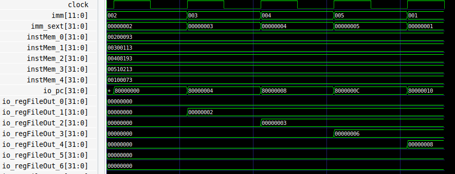
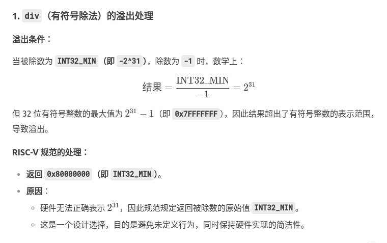
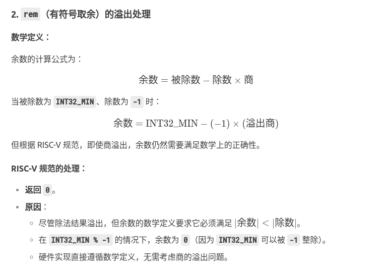

- [PA2\_2](#pa2_2)
  - [用RTL实现最简单的处理器](#用rtl实现最简单的处理器)
    - [处理器基本架构](#处理器基本架构)
    - [若干代码风格和规范](#若干代码风格和规范)
  - [在NPC中实现第一条指令](#在npc中实现第一条指令)
    - [题目：如果你是初学者, 尝试自己画出架构图](#题目如果你是初学者-尝试自己画出架构图)
    - [题目：在NPC中实现addi指令](#题目在npc中实现addi指令)
  - [让程序决定仿真何时结束](#让程序决定仿真何时结束)
    - [通过DPI-C实现ebreak](#通过dpi-c实现ebreak)
  - [程序，运行时环境与AM](#程序运行时环境与am)
    - [运行时环境](#运行时环境)
    - [将运行时环境封装成库函数](#将运行时环境封装成库函数)
    - [AM - 裸机(bare-metal)运行时环境](#am---裸机bare-metal运行时环境)
    - [RTFSC(3)](#rtfsc3)
    - [题目：阅读Makefile 和 通过批处理模式运行NEMU](#题目阅读makefile-和-通过批处理模式运行nemu)
      - [通用Makefile文件](#通用makefile文件)
      - [riscv.mk](#riscvmk)
      - [nemu.mk](#nemumk)
      - [riscv32-nemu.mk](#riscv32-nemumk)
      - [native.mk](#nativemk)
  - [RISC-V指令测试](#risc-v指令测试)
  - [实现常用的库函数](#实现常用的库函数)
    - [题目：实现字符串处理函数](#题目实现字符串处理函数)
    - [题目：实现sprintf](#题目实现sprintf)
  - [重新认识计算机: 计算机是个抽象层](#重新认识计算机-计算机是个抽象层)
  - [基础设施(2)](#基础设施2)
    - [bug诊断的利器 - 踪迹](#bug诊断的利器---踪迹)
    - [题目：实现iringbuf](#题目实现iringbuf)


## PA2_2
### 用RTL实现最简单的处理器
#### 处理器基本架构
具体地, 你将会需要通过RTL来实现PA1中提到的TRM中的部件:
* PC - 本质上是一个不断加"1"的计数器, 这里的"1"是指一条指令的长度
* 寄存器 - 这里指通用寄存器(GPR, General Purpose Register), 它通常是由一组寄存器组成的. 特别地, 从0号寄存器读出的值总是为0
* 加法器 - 这个很简单
* 存储器 - 就是个可以读写的“大数组”

事实上, 你已经在数字电路实验中了解过如何用RTL实现它们了. 我们可以按照处理器工作的流程来给RTL项目划分模块: 取指, 译码, 执行, 更新PC. 具体地:
* IFU(Instruction Fetch Unit): 负责根据当前PC从存储器中取出一条指令
* IDU(Instruction Decode Unit): 负责对当前指令进行译码, 准备执行阶段需要使用的数据和控制信号
* EXU(EXecution Unit): 负责根据控制信号对数据进行执行操作, 并将执行结果写回寄存器或存储器
* 更新PC: 通过RTL实现时, 这一操作一般与PC寄存器一同实现, 因而无需为此划分一个独立的模块

至于将上述部件放置在哪一个模块中, 大家可以自行决定, 并自行梳理出模块之间的接口. 一个例外是存储器, 为了方便测试, 我们不通过RTL来实现这个存储器, 而是用C++来实现它. 于是, 我们需要将存储器访问接口的信号拉到顶层, 通过C++代码来访问存储器:  
```
while (???) {
  ...
  top->inst = pmem_read(top->pc);
  top->eval();
  ...
}
```  
你可以很容易地通过C++代码来实现一个简单的存储器.

#### 若干代码风格和规范
1. 在硬件描述语言中, "执行"的精确含义是什么?
在HDL中，“执行”是一个仿真语义，而不是物理意义上的执行。verilog代码的“执行”过程本质是：
* **仿真器**通过事件驱动(Event-driven)模型模拟电路行为
* 每个语句对应硬件行为的数学建模（如信号传播、时序计算）
* RTL级的“执行”实际上是电路行为的抽象描述，最终会被综合其翻译为物理电路结构

2. 是谁在执行Verilog的语句? 是电路，综合器，还是其它的?
* 仿真阶段：仿真器按照IEEE 1364标准执行代码，解析initial/always块，处理非阻塞赋值等
* 综合阶段：综合器（如DC）将行为级描述转换为门级网表，此时：
  * if/else → 多路选择器（MUX）
  * always @(posedge clk) → 寄存器（Flip-Flop）
  * 连续赋值（assign）→ 组合逻辑门
* 物理实现：最终的电路通过CMOS晶体管实现真正的"执行"（电荷移动）

3. if的条件满足, 就不执行else后的语句, 这里的"不执行"又是什么意思? 和描述电路有什么联系?
当条件不满足时，对应的硬件路径未被激活，但物理上仍然存在

4. 有"并发执行", 又有"顺序执行", 还有"任何一个变量发生变化就立即执行", 以及"在任何情况下都执行", 它们都是如何在设计出来的电路中体现的?
| 执行类型         | 硬件对应            | 典型案例                      |
|----------------|-----------------|---------------------------|
| 并发执行       | 并行硬件单元       | assign 语句、module 实例化 |
| 顺序执行       | 时序逻辑/有限状态机 | always @(posedge clk) 块 |
| 变量变化触发执行 | 组合逻辑电路       | always @(*) 敏感列表      |
| 无条件持续执行 | 环形振荡器（需避免） | 不完整的敏感列表导致锁存器 |

讲义不建议初学者在Verilog代码中编写任何always语句. 为了方便大家使用触发器和选择器, 讲义提供了如下Verilog模板给大家进行调用:  
```
// 触发器模板
module Reg #(WIDTH = 1, RESET_VAL = 0) (
  input clk,
  input rst,
  input [WIDTH-1:0] din,
  output reg [WIDTH-1:0] dout,
  input wen
);
  always @(posedge clk) begin
    if (rst) dout <= RESET_VAL;
    else if (wen) dout <= din;
  end
endmodule

// 使用触发器模板的示例
module example(
  input clk,
  input rst,
  input [3:0] in,
  output [3:0] out
);
  // 位宽为1比特, 复位值为1'b1, 写使能一直有效
  Reg #(1, 1'b1) i0 (clk, rst, in[0], out[0], 1'b1);
  // 位宽为3比特, 复位值为3'b0, 写使能为out[0]
  Reg #(3, 3'b0) i1 (clk, rst, in[3:1], out[3:1], out[0]);
endmodule
***  

***
// 选择器模板内部实现
module MuxKeyInternal #(NR_KEY = 2, KEY_LEN = 1, DATA_LEN = 1, HAS_DEFAULT = 0) (
  output reg [DATA_LEN-1:0] out,
  input [KEY_LEN-1:0] key,
  input [DATA_LEN-1:0] default_out,
  input [NR_KEY*(KEY_LEN + DATA_LEN)-1:0] lut
);

  localparam PAIR_LEN = KEY_LEN + DATA_LEN;
  wire [PAIR_LEN-1:0] pair_list [NR_KEY-1:0];
  wire [KEY_LEN-1:0] key_list [NR_KEY-1:0];
  wire [DATA_LEN-1:0] data_list [NR_KEY-1:0];

  genvar n;
  generate
    for (n = 0; n < NR_KEY; n = n + 1) begin
      assign pair_list[n] = lut[PAIR_LEN*(n+1)-1 : PAIR_LEN*n];
      assign data_list[n] = pair_list[n][DATA_LEN-1:0];
      assign key_list[n]  = pair_list[n][PAIR_LEN-1:DATA_LEN];
    end
  endgenerate

  reg [DATA_LEN-1 : 0] lut_out;
  reg hit;
  integer i;
  always @(*) begin
    lut_out = 0;
    hit = 0;
    for (i = 0; i < NR_KEY; i = i + 1) begin
      lut_out = lut_out | ({DATA_LEN{key == key_list[i]}} & data_list[i]);
      hit = hit | (key == key_list[i]);
    end
    if (!HAS_DEFAULT) out = lut_out;
    else out = (hit ? lut_out : default_out);
  end
endmodule

// 不带默认值的选择器模板
module MuxKey #(NR_KEY = 2, KEY_LEN = 1, DATA_LEN = 1) (
  output [DATA_LEN-1:0] out,
  input [KEY_LEN-1:0] key,
  input [NR_KEY*(KEY_LEN + DATA_LEN)-1:0] lut
);
  MuxKeyInternal #(NR_KEY, KEY_LEN, DATA_LEN, 0) i0 (out, key, {DATA_LEN{1'b0}}, lut);
endmodule

// 带默认值的选择器模板
module MuxKeyWithDefault #(NR_KEY = 2, KEY_LEN = 1, DATA_LEN = 1) (
  output [DATA_LEN-1:0] out,
  input [KEY_LEN-1:0] key,
  input [DATA_LEN-1:0] default_out,
  input [NR_KEY*(KEY_LEN + DATA_LEN)-1:0] lut
);
  MuxKeyInternal #(NR_KEY, KEY_LEN, DATA_LEN, 1) i0 (out, key, default_out, lut);
endmodule
```  
其中, MuxKey模块实现了"键值选择"功能, 即在一个(键值, 数据)的列表lut中, 根据给定的键值key, 将out设置为与其匹配的数据. 若列表中不存在键值为key的数据, 则out为0. 特别地, MuxKeyWithDefault模块可以提供一个默认值default_out, 当列表中不存在键值为key的数据, 则out为default_out. 实例化这两个模块时需要注意如下两点:  
* 需要使用者提供键值对的数量NR_KEY, 键值的位宽KEY_LEN以及数据的位宽DATA_LEN这三个参数, 并保证端口的信号宽度与提供的参数一致, 否则将会输出错误的结果
* 若列表中存在多个键值为key的数据, 则out的值是未定义的, 需要使用者来保证列表中的键值互不相同

MuxKeyInternal模块的实现中用到了很多高级的功能, 如generate和for循环等, 为了方便编写还使用了行为建模方式, 在这里我们不展开介绍, 通过结构化建模的抽象, 使用者可以无需关心这些细节.

以下代码通过使用选择器模板来分别实现2选1多路选择器和4选1多路选择器:
```
module mux21(a,b,s,y);
  input   a,b,s;
  output  y;

  // 通过MuxKey实现如下always代码
  // always @(*) begin
  //  case (s)
  //    1'b0: y = a;
  //    1'b1: y = b;
  //  endcase
  // end
  MuxKey #(2, 1, 1) i0 (y, s, {
    1'b0, a,
    1'b1, b
  });
endmodule

module mux41(a,s,y);
  input  [3:0] a;
  input  [1:0] s;
  output y;

  // 通过MuxKeyWithDefault实现如下always代码
  // always @(*) begin
  //  case (s)
  //    2'b00: y = a[0];
  //    2'b01: y = a[1];
  //    2'b10: y = a[2];
  //    2'b11: y = a[3];
  //    default: y = 1'b0;
  //  endcase
  // end
  MuxKeyWithDefault #(4, 2, 1) i0 (y, s, 1'b0, {
    2'b00, a[0],
    2'b01, a[1],
    2'b10, a[2],
    2'b11, a[3]
  });
endmodule
```

**如果你使用Chisel, 也建议你不要使用when和switch**  
在Chisel中, when和switch的语义和Verilog的行为建模非常相似, 因此也不建议初学者使用. 相反, 你可以使用Mux1H等库函数来实现选择器的功能, 具体可以查阅Chisel的相关资料.  

### 在NPC中实现第一条指令
接下来, 我们来实现一条最简单的指令: addi. 在NEMU中, 你已经理解这条指令是如何执行的了, 现在你需要通过RTL来实现它.
#### 题目：如果你是初学者, 尝试自己画出架构图
如果你是第一次接触处理器设计, 尝试自己画出仅支持addi指令的单周期处理器的架构图.

***  
(指令存储器：PC -> 加法器 -> Next PC) -> (控制模块:指令解码-> 控制信号)
(寄存器文件: rs1 -> ALU -> rd)  ->  (数据存储器: 地址  -> 数据输出)

#### 题目：在NPC中实现addi指令
具体地, 你需要注意以下事项:
* PC的复位值设置为0x80000000
* 存储器中可以放置若干条addi指令的二进制编码(可以利用0号寄存器的特性来编写行为确定的指令)
* 由于目前未实现跳转指令, 因此NPC只能顺序执行, 你可以在NPC执行若干指令之后停止仿真
可以通过查看波形, 或者在RTL代码中打印通用寄存器的状态, 来检查addi指令是否被正确执行
* 关于通用寄存器, 你需要思考如何实现0号寄存器的特性; 此外, 为了避免选择Verilog的同学编写出不太合理的行为建模代码, 我们给出如下不完整的代码供大家补充(大家无需改动always代码块中的内容):
```
module RegisterFile #(ADDR_WIDTH = 1, DATA_WIDTH = 1) (
  input clk,
  input [DATA_WIDTH-1:0] wdata,
  input [ADDR_WIDTH-1:0] waddr,
  input wen
);
  reg [DATA_WIDTH-1:0] rf [2**ADDR_WIDTH-1:0];
  always @(posedge clk) begin
    if (wen) rf[waddr] <= wdata;
  end
endmodule
```  
* 使用NVBoard需要RTL代码比较好地支持设备, 这将在后续进行介绍, 目前不必接入NVBoard
  
***  
1. 确认好常量：  
```
  val PC_START = 0x80000000L.U(32.W)  // PC初始值
  val REG_ZERO = 0.U(32.W)     // x0寄存器
```  

2. 定义寄存器文件
```
val regFile = RegInit(VecInit(Seq.fill(32)(0.U(32.W))))
```  

3. 指令寄存器
```
val instMem = VecInit(Seq(
    "h00200093".U(32.W), // addi x1, x0, 2  (x1 = 0 + 2)
    "h00300113".U(32.W), // addi x2, x0, 3  (x2 = 0 + 3)
    "h00408193".U(32.W), // addi x3, x1, 4  (x3 = 2 + 4)
    "h00510213".U(32.W), // addi x4, x2, 5  (x4 = 3 + 5)
    "h00100073".U(32.W)  // 停止指令 (ebreak)
  ))
```  

4. 取指（>> 2 实际上是将偏移量除以 4）
```
val inst = instMem((pc - PC_START) >> 2)
```  

5. 译码
```
  val op = inst(6, 0)
  val rd = inst(11, 7)
  val rs1 = inst(19,15)
  val imm = inst(31, 20)
  val imm_sext = Cat(Fill(20, imm(11)), imm)
```  

6. 执行
```
val aluOut = WireInit(0.U(32.W))
aluOut := regFile(rs1) + imm_sext
```  

7. 写回寄存器
```
  when(op === "b0010011".U) {
    when(rd =/= 0.U) {
      regFile(rd) := aluOut
    }
  }
```  

8. 更新PC
```
pc := pc + 4.U
```  

**最后结果：**  


### 让程序决定仿真何时结束
我们刚才是让仿真环境(C++代码)来决定执行多少条指令后结束仿真, 显然这个做法并不具有很好的通用性: 你需要提前知道一个程序将会执行多少条指令. 有没有方法可以在程序执行结束的时候自动结束仿真呢?  

事实上, NEMU已经给了一个很好的解决方案了: trap指令. NEMU实现了一条特殊的nemutrap指令, 用于指示客户程序的结束, 具体地, 在RISC-V中, NEMU选择了ebreak指令来作为nemutrap指令. 事实上在NPC中, 我们也可以实现类似的功能: 如果程序执行了ebreak指令, 就通知仿真环境结束仿真.  

要实现这一功能并不困难, 你首先需要在NPC中添加ebreak指令的支持. 不过, 为了让NPC在执行ebreak指令的时候可以通知仿真环境, 你还需要实现一种RTL代码和C++代码之间的交互机制. 我们借用system verilog中的DPI-C机制来实现这一交互.

####  通过DPI-C实现ebreak
在RTL代码中利用DPI-C机制, 使得在NPC执行ebreak指令的时候通知仿真环境结束仿真. 实现后, 在存储器中放置一条ebreak指令来进行测试. 如果你的实现正确, 仿真环境就无需关心程序何时结束仿真了, 它只需要不停地进行仿真, 直到程序执行ebreak指令为止.

如果你使用Chisel, 你可以借助Chisel中的BlackBox机制调用Verilog代码, 然后让Verilog代码通过DPI-C机制与仿真环境交互. 关于BlackBox的使用方式, 请查阅相关资料.

***  
BlackBox的使用可以在chisel中嵌入原有使用Verilog所写的模块。
**BlackBox 的基本用法**  
1. 定义 BlackBox 类：
首先，你需要定义一个继承自 BlackBox 的类，并在其中指定外部 Verilog 模块的接口。  
```
import chisel3._
import chisel3.util._
import chisel3.experimental._

// 定义一个 BlackBox 类
class MyBlackBox extends BlackBox with HasBlackBoxResource {
  val io = IO(new Bundle {
    val in  = Input(UInt(8.W))
    val out = Output(UInt(8.W))
  })

  // 指定外部 Verilog 文件的路径
  addResource("/path/to/myblackbox.v")
}
```  

2. 使用 BlackBox(在你的 Chisel 模块中实例化并使用这个 BlackBox。)  
```
class MyModule extends Module {
  val io = IO(new Bundle {
    val in  = Input(UInt(8.W))
    val out = Output(UInt(8.W))
  })

  // 实例化 BlackBox
  val myBlackBox = Module(new MyBlackBox)

  // 连接 BlackBox 的输入输出
  myBlackBox.io.in := io.in
  io.out := myBlackBox.io.out
}
```  

3. 提供 Verilog 文件：确保在指定的路径下存在对应的 Verilog 文件（例如 myblackbox.v），并且该文件的接口与 BlackBox 类中定义的接口一致。


***  
总结这个过程：
在chisel代码阶段，我们需要继承BlackBox类，这个过程需要把该模块的端口写好。然后需要在Npc模块中实例化刚刚写的ebreakDetector。同时也需要写一个EbreakDetector.v  
```
module EbreakDetector(
    input [31:0] inst,
    input [31:0] pc,
    output exit
);
    // 检测是否为 ebreak 指令
    assign exit = (inst == 32'h00100073); // ebreak指令的操作码
endmodule
```  
然后，把chisel生成的verilog代码Npc.v和EbreakDetector.v需要放在同一个vsrc目录下。

在激励文件中：  
```
// DPI-C机制的C++实现，仿真结束时调用该函数
extern "C" void dpi_end_simulation() {
    printf("Ebreak detected. Ending simulation.\n");
    exit(0);  // 终止仿真
}  

... 

...  

// 检查是否检测到ebreak指令，如果检测到则退出仿真
        if (top->io_exit) {
            dpi_end_simulation();  // 调用DPI-C机制中的终止函数
        }
```  

最后输出结果：  
```
yjx@yjx-Lenovo-Legion-R7000-2020:~/ysyx-workbench/npc$ ./obj_dir/VNpc
Cycle: 0, PC: 0x00000000, Inst: 0x00000000
Cycle: 1, PC: 0x00000004, Inst: 0x00200093
Cycle: 2, PC: 0x00000004, Inst: 0x00200093
Cycle: 3, PC: 0x00000008, Inst: 0x00300113
Cycle: 4, PC: 0x00000008, Inst: 0x00300113
Cycle: 5, PC: 0x0000000c, Inst: 0x00408193
Cycle: 6, PC: 0x0000000c, Inst: 0x00408193
Cycle: 7, PC: 0x00000010, Inst: 0x00510213
Cycle: 8, PC: 0x00000010, Inst: 0x00510213
Cycle: 9, PC: 0x00000014, Inst: 0x00100073
```  


### 程序，运行时环境与AM
#### 运行时环境
为了让NEMU支持大部分程序的运行, 你已经实现了不少指令. 但并不是有了足够的指令就能运行更多的程序. 我们之前提到"并不是每一个程序都可以在NEMU中运行", 现在我们来解释一下背后的缘由.  

从直觉上来看, 让仅仅只会"计算"的TRM来支撑一个功能齐全的操作系统的运行还是不太现实的. 这给我们的感觉就是, 计算机也有一定的"功能强弱"之分, 计算机越"强大", 就能跑越复杂的程序. 换句话说, 程序的运行其实是对计算机的功能有需求的. 在你运行Hello World程序时, 你敲入一条命令(或者点击一下鼠标), 程序就成功运行了, 但这背后其实隐藏着操作系统开发者和库函数开发者的无数汗水. 一个事实是, 应用程序的运行都需要运行时环境的支持, 包括加载, 销毁程序, 以及提供程序运行时的各种动态链接库(你经常使用的库函数就是运行时环境提供的)等. 为了让客户程序在NEMU中运行, 现在轮到你来提供相应的运行时环境的支持了.  

根据KISS法则, 我们先来考虑最简单的运行时环境是什么样的. 换句话说, 为了运行最简单的程序, 我们需要提供什么呢? 其实答案已经在PA1中了: 只要把程序放在正确的内存位置, 然后让PC指向第一条指令, 计算机就会自动执行这个程序, 永不停止.  

不过, 虽然计算机可以永不停止地执行指令, 但一般的程序都是会结束的, 所以运行时环境需要向程序提供一种结束运行的方法. 聪明的你已经能想到, 我们在PA1中提到的那条人工添加的nemu_trap指令, 就是让程序来结束运行的.  

所以, 只要有内存, 有结束运行的方式, 加上实现正确的指令, 就可以支撑最简单程序的运行了. 而这, 也可以算是最简单的运行时环境了.

#### 将运行时环境封装成库函数
我们刚才讨论的运行时环境是直接位于计算机硬件之上的, 因此运行时环境的具体实现, 也是和架构相关的. 我们以"ISA-平台"的二元组来表示一个架构, 例如mips32-nemu. 以程序结束为例, NEMU中是使用特殊的nemu_trap指令, 而不同ISA的nemu_trap指令的格式肯定不同; 但如果我们自己用verilog设计了一个riscv32 CPU, 这个riscv32-mycpu的架构, 有可能是通过一条mycpu_trap指令来结束程序, 它和nemu_trap指令可能是不一样的. 而结束运行是程序共有的需求, 为了让n个程序运行在m个架构上, 难道我们要维护n*m份代码? 有没有更好的方法呢?  

我们刚才讨论的运行时环境是直接位于计算机硬件之上的, 因此运行时环境的具体实现, 也是和架构相关的. 我们以"ISA-平台"的二元组来表示一个架构, 例如mips32-nemu. 以程序结束为例, NEMU中是使用特殊的nemu_trap指令, 而不同ISA的nemu_trap指令的格式肯定不同; 但如果我们自己用verilog设计了一个riscv32 CPU, 这个riscv32-mycpu的架构, 有可能是通过一条mycpu_trap指令来结束程序, 它和nemu_trap指令可能是不一样的. 而结束运行是程序共有的需求, 为了让n个程序运行在m个架构上, 难道我们要维护n*m份代码? 有没有更好的方法呢?

对于同一个程序, 如果能把m个版本不同的部分都转换成相同的代码, 我们就只需要维护一个版本就可以了. 而实现这个目标的杀手锏, 就是你在程序设计课上学过的抽象! 我们只需要定义一个结束程序的API, 比如void halt(), 它对不同架构上程序的不同结束方式进行了抽象: 程序只要调用halt()就可以结束运行, 而不需要关心自己运行在哪一个架构上. 经过抽象之后, 之前m个版本的程序, 现在都统一通过halt()来结束运行, 我们就只需要维护这一个通过halt()来结束运行的版本就可以了. 然后, 不同的架构分别实现自己的halt(), 就可以支撑n个程序的运行! 这样以后, 我们就可以把程序和架构解耦了: 我们只需要维护n+m份代码(n个程序和m个架构相关的halt()), 而不是之前的n*m.  

这个例子也展示了运行时环境的一种普遍的存在方式: 库. 通过库, 运行程序所需要的公共要素被抽象成API, 不同的架构只需要实现这些API, 也就相当于实现了支撑程序运行的运行时环境, 这提升了程序开发的效率: 需要的时候只要调用这些API, 就能使用运行时环境提供的相应功能.  

#### AM - 裸机(bare-metal)运行时环境
一方面, 正如上文提到, 应用程序的运行都需要运行时环境的支持; 另一方面, 只进行纯粹计算任务的程序在TRM上就可以运行, 更复杂的应用程序对运行时环境必定还有其它的需求: 例如你之前玩的超级玛丽需要和用户进行交互, 至少需要运行时环境提供输入输出的支持. 要运行一个现代操作系统, 还要在此基础上加入更高级的功能.  

如果我们把这些需求都收集起来, 将它们抽象成统一的API提供给程序, 这样我们就得到了一个可以支撑各种程序运行在各种架构上的库了! 具体地, 每个架构都按照它们的特性实现这组API; 应用程序只需要直接调用这组API即可, 无需关心自己将来运行在哪个架构上. 由于这组统一抽象的API代表了程序运行对计算机的需求, 所以我们把这组API称为抽象计算机.  

AM(Abstract machine)项目就是这样诞生的. 作为一个向程序提供运行时环境的库, AM根据程序的需求把库划分成以下模块  
```
AM = TRM + IOE + CTE + VME + MPE
```  
* TRM(Turing Machine) - 图灵机, 最简单的运行时环境, 为程序提供基本的计算能力
* IOE(I/O Extension) - 输入输出扩展, 为程序提供输出输入的能力
* CTE(Context Extension) - 上下文扩展, 为程序提供上下文管理的能力
* VME(Virtual Memory Extension) - 虚存扩展, 为程序提供虚存管理的能力
* MPE(Multi-Processor Extension) - 多处理器扩展, 为程序提供多处理器通信的能力 (MPE超出了ICS课程的范围, 在PA中不会涉及)

AM给我们展示了程序与计算机的关系: 利用计算机硬件的功能实现AM, 为程序的运行提供它们所需要的运行时环境. 感谢AM项目的诞生, 让NEMU和程序的界线更加泾渭分明, 同时使得PA的流程更加明确:
```
(在NEMU中)实现硬件功能 -> (在AM中)提供运行时环境 -> (在APP层)运行程序
(在NEMU中)实现更强大的硬件功能 -> (在AM中)提供更丰富的运行时环境 -> (在APP层)运行更复杂的程序
```  

这个流程其实与PA1中开天辟地的故事遥相呼应: 先驱希望创造一个计算机的世界, 并赋予它执行程序的使命. 亲自搭建NEMU(硬件)和AM(软件)之间的桥梁来支撑程序的运行, 是"理解程序如何在计算机上运行"这一终极目标的不二选择.  

#### RTFSC(3)
你已经在PA0的最后获得了AM的子项目abstract-machine, 下面我们来简单介绍一下AM项目的代码. 代码中abstract-machine/目录下的源文件组织如下(部分目录下的文件并未列出):  
```
abstract-machine
├── am                                  # AM相关
│   ├── include
│   │   ├── amdev.h
│   │   ├── am.h
│   │   └── arch                        # 架构相关的头文件定义
│   ├── Makefile
│   └── src
│       ├── mips
│       │   ├── mips32.h
│       │   └── nemu                    # mips32-nemu相关的实现
│       ├── native
│       ├── platform
│       │   └── nemu                    # 以NEMU为平台的AM实现
│       │       ├── include
│       │       │   └── nemu.h
│       │       ├── ioe                 # IOE
│       │       │   ├── audio.c
│       │       │   ├── disk.c
│       │       │   ├── gpu.c
│       │       │   ├── input.c
│       │       │   ├── ioe.c
│       │       │   └── timer.c
│       │       ├── mpe.c               # MPE, 当前为空
│       │       └── trm.c               # TRM
│       ├── riscv
│       │   ├── nemu                    # riscv32(64)相关的实现
│       │   │   ├── cte.c               # CTE
│       │   │   ├── start.S             # 程序入口
│       │   │   ├── trap.S
│       │   │   └── vme.c               # VME
│       │   └── riscv.h
│       └── x86
│           ├── nemu                    # x86-nemu相关的实现
│           └── x86.h
├── klib                                # 常用函数库
├── Makefile                            # 公用的Makefile规则
└── scripts                             # 构建/运行二进制文件/镜像的Makefile
    ├── isa
    │   ├── mips32.mk
    │   ├── riscv32.mk
    │   ├── riscv64.mk
    │   └── x86.mk
    ├── linker.ld                       # 链接脚本
    ├── mips32-nemu.mk
    ├── native.mk
    ├── platform
    │   └── nemu.mk
    ├── riscv32-nemu.mk
    ├── riscv64-nemu.mk
    └── x86-nemu.mk
```  

整个AM项目分为两大部分：  
* abstract-machine/am/ - 不同架构的AM API实现, 目前我们只需要关注NEMU相关的内容即可. 此外, abstract-machine/am/include/am.h列出了AM中的所有API, 我们会在后续逐一介绍它们.
* abstract-machine/klib/ - 一些架构无关的库函数, 方便应用程序的开发

阅读abstract-machine/am/src/platform/nemu/trm.c中的代码, 你会发现只需要实现很少的API就可以支撑起程序在TRM上运行了:
* Area heap结构用于指示堆区的起始和末尾
* void putch(char ch)用于输出一个字符
* void halt(int code)用于结束程序的运行
* void _trm_init()用于进行TRM相关的初始化工作

堆区是给程序自由使用的一段内存区间, 为程序提供动态分配内存的功能. TRM的API只提供堆区的起始和末尾, 而堆区的分配和管理需要程序自行维护. 当然, 程序也可以不使用堆区, 例如dummy. 把putch()作为TRM的API是一个很有趣的考虑, 我们在不久的将来再讨论它, 目前我们暂不打算运行需要调用putch()的程序.  

最后来看看halt(). halt()里面调用了nemu_trap()宏 (在abstract-machine/am/src/platform/nemu/include/nemu.h中定义), 这个宏展开之后是一条内联汇编语句. 内联汇编语句允许我们在C代码中嵌入汇编语句, 以riscv32为例, 宏展开之后将会得到:  
```
asm volatile("mv a0, %0; ebreak" : :"r"(code));
```  

显然, 这个宏的定义是和ISA相关的, 如果你查看nemu/src/isa/$ISA/inst.c, 你会发现这条指令正是那条特殊的nemu_trap! nemu_trap()宏还会把一个标识结束的结束码移动到通用寄存器中, 这样, 这段汇编代码的功能就和nemu/src/isa/$ISA/inst.c中nemu_trap的行为对应起来了: 通用寄存器中的值将会作为参数传给set_nemu_state(), 将halt()中的结束码设置到NEMU的monitor中, monitor将会根据结束码来报告程序结束的原因. 此外, volatile是C语言的一个关键字, 如果你想了解关于volatile的更多信息, 请查阅相关资料.

***  
am-kernels子项目用于收录一些可以在AM上运行的测试集和简单程序:
```
am-kernels
├── benchmarks                  # 可用于衡量性能的基准测试程序
│   ├── coremark
│   ├── dhrystone
│   └── microbench
├── kernels                     # 可展示的应用程序
│   ├── hello
│   ├── litenes                 # 简单的NES模拟器
│   ├── nemu                    # NEMU
│   ├── slider                  # 简易图片浏览器
│   ├── thread-os               # 内核线程操作系统
│   └── typing-game             # 打字小游戏
└── tests                       # 一些具有针对性的测试集
    ├── am-tests                # 针对AM API实现的测试集
    └── cpu-tests               # 针对CPU指令实现的测试集
```  

在让NEMU运行客户程序之前, 我们需要将客户程序的代码编译成可执行文件. 需要说明的是, 我们不能使用gcc的默认选项直接编译, 因为默认选项会根据GNU/Linux的运行时环境将代码编译成运行在GNU/Linux下的可执行文件. 但此时的NEMU并不能为客户程序提供GNU/Linux的运行时环境, 在NEMU中无法正确运行上述可执行文件, 因此我们不能使用gcc的默认选项来编译用户程序.

解决这个问题的方法是交叉编译. 我们需要在GNU/Linux下根据AM的运行时环境编译出能够在$ISA-nemu这个新环境中运行的可执行文件. 为了不让链接器ld使用默认的方式链接, 我们还需要提供描述$ISA-nemu的运行时环境的链接脚本. AM的框架代码已经把相应的配置准备好了, 上述编译和链接选项主要位于abstract-machine/Makefile 以及abstract-machine/scripts/目录下的相关.mk文件中. 编译生成一个可以在NEMU的运行时环境上运行的程序的过程大致如下:  
* gcc将$ISA-nemu的AM实现源文件编译成目标文件, 然后通过ar将这些目标文件作为一个库, 打包成一个归档文件abstract-machine/am/build/am-$ISA-nemu.a  
* gcc把应用程序源文件(如am-kernels/tests/cpu-tests/tests/dummy.c)编译成目标文件
* 通过gcc和ar把程序依赖的运行库(如abstract-machine/klib/)也编译并打包成归档文件
* 根据Makefile文件abstract-machine/scripts/$ISA-nemu.mk中的指示, 让ld根据链接脚本abstract-machine/scripts/linker.ld, 将上述目标文件和归档文件链接成可执行文件

根据上述链接脚本的指示, 可执行程序重定位后的节从0x100000或0x80000000开始 (取决于_pmem_start和_entry_offset的值), 首先是.text节, 其中又以abstract-machine/am/src/$ISA/nemu/start.S中自定义的entry节开始, 然后接下来是其它目标文件的.text节. 这样, 可执行程序起始处总是放置start.S的代码, 而不是其它代码, 保证客户程序总能从start.S开始正确执行. 链接脚本也定义了其它节(包括.rodata, .data, .bss)的链接顺序, 还定义了一些关于位置信息的符号, 包括每个节的末尾, 栈顶位置, 堆区的起始和末尾.  

我们对编译得到的可执行文件的行为进行简单的梳理:  
1. 第一条指令从abstract-machine/am/src/$ISA/nemu/start.S开始, 设置好栈顶之后就跳转到abstract-machine/am/src/platform/nemu/trm.c的_trm_init()函数处执行.
2. 在_trm_init()中调用main()函数执行程序的主体功能, main()函数还带一个参数, 目前我们暂时不会用到, 后面我们再介绍它.
3. 从main()函数返回后, 调用halt()结束运行.

有了TRM这个简单的运行时环境, 我们就可以很容易地在上面运行各种"简单"的程序了. 当然, 我们也可以运行"不简单"的程序: 我们可以实现任意复杂的算法, 甚至是各种理论上可计算的问题, 都可以在TRM上解决.  

#### 题目：阅读Makefile 和 通过批处理模式运行NEMU
##### 通用Makefile文件
abstract-machine项目的Makefile设计得非常巧妙, 你需要把它们看成一种代码来RTFSC, 从而理解它们是如何工作的. 这样一来, 你就知道怎么编写有一定质量的Makefile了; 同时, 如果哪天Makefile出现了非预期的行为, 你就可以尝试对Makefile进行调试了. 当然, 这少不了RTFM.  

我们知道, 大部分同学很可能会这么想: 反正我不阅读Makefile, 老师助教也不知道, 总觉得不看也无所谓.  

所以在这里我们加一道必做题: 我们之前启动NEMU的时候, 每次都需要手动键入c才能运行客户程序. 但如果不是为了使用NEMU中的sdb, 我们其实可以节省c的键入. NEMU中实现了一个批处理模式, 可以在启动NEMU之后直接运行客户程序. 请你阅读NEMU的代码并合适地修改Makefile, 使得通过AM的Makefile可以默认启动批处理模式的NEMU.  

***  
首先，我将Makefile文件原来的注释归纳如下：  
1. 基本设置与检查
   * 默认生成裸机内核映像
   * 在 `make clean/clean-all/html` 时跳过检查
   * 打印构建信息
   * 检查环境变量 `$AM_HOME` 是否有效
   * 检查环境变量 `$ARCH` 是否在支持的列表中
   * 从 `$ARCH` 中提取指令集架构（ISA）和平台。
   * 检查是否有需要编译的文件
   * 检查结束
2. 通用编译目标
   * 创建目标目录 (`build/$ARCH`)
   * 编译目标（可执行映像或静态库）
   * 收集需要链接的文件：目标文件（`.o`）和库（`.a`）
3. 通用编译选项
   * (交叉) 编译器，例如 `mips-linux-gnu-g++`
   * 编译选项
4. 体系结构相关的配置
   * 引入特定架构的配置文件（例如 `scripts/x86_64-qemu.mk`）
5. 编译规则
   * 规则（编译）：单个 `.c` 文件编译为 `.o` 文件（使用 gcc）
   * 规则（编译）：单个 `.cc` 文件编译为 `.o` 文件（使用 g++）
   * 规则（编译）：单个 `.cpp` 文件编译为 `.o` 文件（使用 g++）
   * 规则（编译）：单个 `.S` 汇编文件编译为 `.o` 文件（使用 gcc）
   * 规则（递归构建）：编译依赖库（如 am、klib）
   * 规则（链接）：目标文件（`*.o`）和库文件（`*.a`） -> `IMAGE.elf`，最终的 ELF 二进制文件
   * 规则（归档）：目标文件（`*.o`） -> `ARCHIVE.a`（使用 ar）
   * 规则（包含头文件依赖）：包含 gcc 生成的 `.d` 文件
6. 其他
   * 构建顺序控制
   * 清理单个项目（删除 `build/` 目录）
   * 清理所有子项目（深度 2），忽略错误  

***  
进入每一个代码快：  
1. 基本设置与检查
```
### 默认生成裸机内核映像
ifeq ($(MAKECMDGOALS),)
  MAKECMDGOALS  = image
  .DEFAULT_GOAL = image
endif
```  
如果 MAKECMDGOALS 为空，则默认目标设为 image。  

```
### 在 `make clean/clean-all/html` 时跳过检查
ifeq ($(findstring $(MAKECMDGOALS),clean|clean-all|html),)
```  
如果当前目标是 clean、clean-all 或 html，则跳过以下检查步骤。

```
### 打印构建信息
$(info # 正在构建 $(NAME)-$(MAKECMDGOALS) [$(ARCH)])
```  
在构建过程中，输出 # 正在构建 $(NAME)-$(MAKECMDGOALS) [$(ARCH)]。

```
### 检查环境变量 `$AM_HOME` 是否有效
ifeq ($(wildcard $(AM_HOME)/am/include/am.h),)
  $(error $$AM_HOME 必须是一个 AbstractMachine 仓库)
endif
```  
确保 $AM_HOME 指向一个 AbstractMachine 仓库，否则报错。

```
### 检查环境变量 `$ARCH` 是否在支持的列表中
ARCHS = $(basename $(notdir $(shell ls $(AM_HOME)/scripts/*.mk)))
ifeq ($(filter $(ARCHS), $(ARCH)), )
  $(error 预期 $$ARCH 在 {$(ARCHS)} 之中，得到 "$(ARCH)")
endif
```  
获取 $AM_HOME/scripts/ 目录下的 .mk 文件，检查 $ARCH 是否在支持的架构列表中，否则报错。

```
# 从 `$ARCH` 中提取指令集架构（ISA）和平台。例如：`ARCH=x86_64-qemu` -> `ISA=x86_64`；`PLATFORM=qemu`
ARCH_SPLIT = $(subst -, ,$(ARCH))
ISA        = $(word 1,$(ARCH_SPLIT))
PLATFORM   = $(word 2,$(ARCH_SPLIT))
```  
通过 ARCH=x86_64-qemu 解析出 ISA=x86_64 和 PLATFORM=qemu。

```
### 检查是否有需要编译的文件
ifeq ($(flavor SRCS), undefined)
  $(error 没有需要编译的文件)
endif

### 检查结束
endif
```  
如果 SRCS 变量未定义，则报错，表示没有需要编译的文件。  
结束 ifeq ($(findstring $(MAKECMDGOALS),clean|clean-all|html),) 这一条件判断。  

2. 通用编译目标
```
### 创建目标目录 (`build/$ARCH`)
WORK_DIR  = $(shell pwd)
DST_DIR   = $(WORK_DIR)/build/$(ARCH)
$(shell mkdir -p $(DST_DIR))
```  
* 通过 pwd 获取当前工作目录 (WORK_DIR)。
* 目标目录 DST_DIR 设为 build/$(ARCH)。
* $(shell mkdir -p $(DST_DIR)) 确保该目录存在。

```
### 编译目标（可执行映像或静态库）
IMAGE_REL = build/$(NAME)-$(ARCH)
IMAGE     = $(abspath $(IMAGE_REL))
ARCHIVE   = $(WORK_DIR)/build/$(NAME)-$(ARCH).a
```  
* IMAGE_REL：相对路径的映像文件，格式 build/$(NAME)-$(ARCH)。
* IMAGE：IMAGE_REL 的绝对路径。
* ARCHIVE：静态库文件，格式 build/$(NAME)-$(ARCH).a。  

```
### 收集需要链接的文件：目标文件（`.o`）和库（`.a`）
OBJS      = $(addprefix $(DST_DIR)/, $(addsuffix .o, $(basename $(SRCS))))
LIBS     := $(sort $(LIBS) am klib) # 使用惰性赋值 ("=") 以避免无限递归 lazy evaluation ("=") causes infinite recursions
LINKAGE   = $(OBJS) \
  $(addsuffix -$(ARCH).a, $(join \
    $(addsuffix /build/, $(addprefix $(AM_HOME)/, $(LIBS))), \
    $(LIBS) ))
```  
* OBJS：将 SRCS 中的源文件转换为目标文件（.o），存放于 DST_DIR。
* LIBS：依赖库，默认包含 am 和 klib，并使用 :=（惰性赋值）防止无限递归。
* LINKAGE：最终的链接项，包括：
  * 目标文件 OBJS。
  * 需要链接的库，路径格式为 $(AM_HOME)/$(LIB)/build/$(LIB)-$(ARCH).a。

3. 通用编译选项
```
### (交叉) 编译器，例如 `mips-linux-gnu-g++`
AS        = $(CROSS_COMPILE)gcc
CC        = $(CROSS_COMPILE)gcc
CXX       = $(CROSS_COMPILE)g++
LD        = $(CROSS_COMPILE)ld
AR        = $(CROSS_COMPILE)ar
OBJDUMP   = $(CROSS_COMPILE)objdump
OBJCOPY   = $(CROSS_COMPILE)objcopy
READELF   = $(CROSS_COMPILE)readelf
```  
定义编译工具，可用于交叉编译（CROSS_COMPILE 变量的前缀适用于不同架构，如 mips-linux-gnu-）。  
* AS、CC：汇编和 C 编译器 (gcc)
* CXX：C++ 编译器 (g++)
* LD：链接器 (ld)
* AR：静态库打包工具 (ar)
* OBJDUMP、OBJCOPY、READELF：用于分析 ELF 文件的工具

```
INC_PATH += $(WORK_DIR)/include $(addsuffix /include/, $(addprefix $(AM_HOME)/, $(LIBS)))
INCFLAGS += $(addprefix -I, $(INC_PATH))
```  
头文件包含路径
* INC_PATH：包含 WORK_DIR/include 以及 $(AM_HOME) 下所有库的 include/ 目录。
* INCFLAGS：将 INC_PATH 转换为 -I 选项，供编译器使用。

```
ARCH_H := arch/$(ARCH).h
CFLAGS   += -O2 -MMD -Wall -Werror $(INCFLAGS) \
            -D__ISA__=\"$(ISA)\" -D__ISA_$(shell echo $(ISA) | tr a-z A-Z)__ \
            -D__ARCH__=$(ARCH) -D__ARCH_$(shell echo $(ARCH) | tr a-z A-Z | tr - _) \
            -D__PLATFORM__=$(PLATFORM) -D__PLATFORM_$(shell echo $(PLATFORM) | tr a-z A-Z | tr - _) \
            -DARCH_H=\"$(ARCH_H)\" \
            -fno-asynchronous-unwind-tables -fno-builtin -fno-stack-protector \
            -Wno-main -U_FORTIFY_SOURCE -fvisibility=hidden
```  
 C 编译选项
 * ARCH_H：指定 arch/$(ARCH).h 作为架构相关的头文件。
 * CFLAGS：
  * -O2：优化级别 2
  * -MMD：生成依赖文件
  * -Wall -Werror：启用所有警告，并将警告视为错误
  * -D__ISA__=\"$(ISA)\" 等：定义架构、平台相关的宏，用于 C 预处理
  * -fno-asynchronous-unwind-tables：关闭异常展开表
  * -fno-builtin：禁止编译器使用内置函数
  * -fno-stack-protector：关闭栈保护
  * -Wno-main：禁止 main 相关的警告
  * -U_FORTIFY_SOURCE：取消 FORTIFY_SOURCE 安全保护
  * -fvisibility=hidden：默认将符号设为隐藏

```
CXXFLAGS +=  $(CFLAGS) -ffreestanding -fno-rtti -fno-exceptions
```  
C++ 额外编译选项
* CXXFLAGS：
  * 继承 CFLAGS
  * -ffreestanding：独立环境编译（不依赖标准库）
  * -fno-rtti：关闭 C++ 运行时类型识别
  * -fno-exceptions：禁用异常处理

```
ASFLAGS  += -MMD $(INCFLAGS)
LDFLAGS  += -z noexecstack $(addprefix -T, $(LDSCRIPTS))
```  
汇编和链接选项
* ASFLAGS：
  * -MMD：生成依赖文件
  * $(INCFLAGS)：包含头文件路径
* LDFLAGS：
  * -z noexecstack：标记栈不可执行，提高安全性
  * -T $(LDSCRIPTS)：使用指定的链接脚本

4. 体系结构相关的配置
```
### 引入特定架构的配置文件（例如 `scripts/x86_64-qemu.mk`）
-include $(AM_HOME)/scripts/$(ARCH).mk
```  

5. 编译规则
```
### 规则（编译）：单个 `.c` 文件编译为 `.o` 文件（使用 gcc）
$(DST_DIR)/%.o: %.c
	@mkdir -p $(dir $@) && echo + CC $<
	@$(CC) -std=gnu11 $(CFLAGS) -c -o $@ $(realpath $<)

### 规则（编译）：单个 `.cc` 文件编译为 `.o` 文件（使用 g++）
$(DST_DIR)/%.o: %.cc
	@mkdir -p $(dir $@) && echo + CXX $<
	@$(CXX) -std=c++17 $(CXXFLAGS) -c -o $@ $(realpath $<)

### 规则（编译）：单个 `.cpp` 文件编译为 `.o` 文件（使用 g++）
$(DST_DIR)/%.o: %.cpp
	@mkdir -p $(dir $@) && echo + CXX $<
	@$(CXX) -std=c++17 $(CXXFLAGS) -c -o $@ $(realpath $<)

### 规则（编译）：单个 `.S` 汇编文件编译为 `.o` 文件（使用 gcc）
$(DST_DIR)/%.o: %.S
	@mkdir -p $(dir $@) && echo + AS $<
	@$(AS) $(ASFLAGS) -c -o $@ $(realpath $<)
```  
C 代码 (.c → .o)
* 规则：将 C 语言源文件编译成目标文件（.o）
* -std=gnu11：使用 GNU C 11 标准
* $(CFLAGS)：应用编译选项
* $(realpath $<)：获取源文件的绝对路径

C++ 代码 (.cc/.cpp → .o)
* 规则：将 C++ 代码编译成目标文件（.o）
* -std=c++17：使用 C++ 17 标准
* $(CXXFLAGS)：应用 C++ 相关编译选项

汇编代码 (.S → .o)
* 规则：将汇编源代码编译成目标文件（.o）
* $(ASFLAGS)：应用汇编选项

```
### 规则（递归构建）：编译依赖库（如 am、klib）
$(LIBS): %:
	@$(MAKE) -s -C $(AM_HOME)/$* archive
```  
```$(LIBS): %:```
* 规则：在 $(AM_HOME) 目录下，递归构建 am、klib 等库
* -C $(AM_HOME)/$*：进入 AM_HOME 目录下的指定库目录
* archive 目标：构建静态库

```
### 规则（链接）：目标文件（`*.o`）和库文件（`*.a`） -> `IMAGE.elf`，最终的 ELF 二进制文件
$(IMAGE).elf: $(LINKAGE) $(LDSCRIPTS)
	@echo \# Creating image [$(ARCH)]
	@echo + LD "->" $(IMAGE_REL).elf
ifneq ($(filter $(ARCH),native),)
	@$(CXX) -o $@ -Wl,--whole-archive $(LINKAGE) -Wl,-no-whole-archive $(LDFLAGS_CXX)
else
	@$(LD) $(LDFLAGS) -o $@ --start-group $(LINKAGE) --end-group
endif
```  
(IMAGE).elf:
* 作用：将 *.o 目标文件和 *.a 静态库链接成 ELF 可执行文件
* 方法：
  * 如果目标架构是 native，使用 g++ 进行链接，并使用 --whole-archive 选项保留所有符号
  * 其他情况，使用 ld 进行链接，--start-group 和 --end-group 确保所有库正确解析
* $(LDSCRIPTS)：指定链接脚本

```
### 规则（归档）：目标文件（`*.o`） -> `ARCHIVE.a`（使用 ar）
$(ARCHIVE): $(OBJS)
	@echo + AR "->" $(shell realpath $@ --relative-to .)
	@$(AR) rcs $@ $^
```  
$(ARCHIVE): $(OBJS)
* 作用：将 *.o 目标文件打包成 .a 静态库
* rcs 选项：
  * r：替换已有文件
  * c：创建新库
  * s：添加符号索引，提高链接效率

```
### 规则（包含头文件依赖）：包含 gcc 生成的 `.d` 文件
-include $(addprefix $(DST_DIR)/, $(addsuffix .d, $(basename $(SRCS))))
```  
-include $(DST_DIR)/*.d
* 作用：包含 .d 依赖文件，确保 gcc -MMD 生成的头文件依赖关系正确解析，支持增量编译

6. 其他
```
### 构建顺序控制
image: image-dep
archive: $(ARCHIVE)
image-dep: $(LIBS) $(IMAGE).elf
.NOTPARALLEL: image-dep
.PHONY: image image-dep archive run $(LIBS)

### Clean a single project (remove `build/`)
### 清理单个项目（删除 `build/` 目录）
clean:
	rm -rf Makefile.html $(WORK_DIR)/build/
.PHONY: clean

### 清理所有子项目（深度 2），忽略错误
CLEAN_ALL = $(dir $(shell find . -mindepth 2 -name Makefile))
clean-all: $(CLEAN_ALL) clean
$(CLEAN_ALL):
	-@$(MAKE) -s -C $@ clean
.PHONY: clean-all $(CLEAN_ALL)

```  
* image 目标：
  * 依赖 image-dep
  * 生成最终的 image
* archive 目标：
  * 依赖 $(ARCHIVE)，即 .a 静态库的构建
* image-dep 目标：
  * 依赖 $(LIBS) 和 $(IMAGE).elf
  * $(LIBS) 代表所需的依赖库
  * $(IMAGE).elf 是最终的 ELF 可执行文件
* .NOTPARALLEL: image-dep：
  * 禁止 image-dep 目标的并行构建，避免竞态问题
* .PHONY 目标：
  * image, image-dep, archive, run, $(LIBS) 都是伪目标（不对应实际文件）

##### riscv.mk
1. 设置交叉编译工具链：
```
CROSS_COMPILE := riscv64-linux-gnu-
```  
* 指定 RISC-V 64 位交叉编译工具链的前缀，确保使用 riscv64-linux-gnu-gcc、riscv64-linux-gnu-ld 等工具进行编译。

2. 定义通用编译选项：
```
COMMON_CFLAGS := -fno-pic -march=rv64g -mcmodel=medany -mstrict-align
```  
* -fno-pic：禁止生成位置无关代码（Position Independent Code, PIC）。
* -march=rv64g：指定 RISC-V 架构为 RV64G（RV64I + MAFD 扩展）。
* -mcmodel=medany：使用 medany（medium-any）内存模型，适用于 RISC-V 内核和裸机环境，支持大地址偏移。
* -mstrict-align：强制使用严格的内存对齐，避免 RISC-V 中未对齐访问的行为。

3. 设置 C 语言编译器选项：
```
CFLAGS += $(COMMON_CFLAGS) -static
```  
* 继承 COMMON_CFLAGS。
* -static：生成静态可执行文件，避免依赖动态库。

4. 设置汇编编译选项：
```
ASFLAGS += $(COMMON_CFLAGS) -O0
```  
* 继承 COMMON_CFLAGS。
* -O0：关闭优化，保持汇编代码可读性。

5. 设置链接器选项：
```
LDFLAGS += -melf64lriscv
```   
* 指定链接器目标格式为 elf64-littleriscv，即 64 位 RISC-V ELF 格式。

6. 覆盖 ARCH_H 头文件路径：
```
ARCH_H := arch/riscv.h
```  
* 重新定义 ARCH_H，确保 arch/riscv.h 作为架构相关的头文件。
* 这可能是为了覆盖 $(AM_HOME)/Makefile 中的默认 ARCH_H，以适配 RISC-V 架构。

##### nemu.mk
这个 Makefile 片段的主要作用是：
1. 指定 RISC-V NEMU 平台的源文件，用于构建 AM（Abstract Machine）。
2. 设置编译选项，启用 -fdata-sections 和 -ffunction-sections 进行链接优化，并指定头文件路径。
3. 配置链接选项，包括物理内存起始地址、入口点 _start，以及 --gc-sections 以减少无用代码。
4. 生成二进制 image 并插入命令行参数，确保在 NEMU 运行时可以接收 main 函数的参数。
5. 提供 run 和 gdb 规则，允许在 NEMU 中直接运行或使用 GDB 进行调试。
这份 Makefile 适用于 NEMU 平台上的 RISC-V 目标，目的是构建和运行一个模拟环境下的 AM（Abstract Machine）程序。

npc.mk和这个也挺类似的。  

##### riscv32-nemu.mk
1. 包含 RISC-V 和 NEMU 的 Makefile
   * riscv.mk 可能包含工具链 (riscv64-linux-gnu-)、通用编译选项 (-march=rv64g)、链接选项 (-melf64lriscv) 等。
   * nemu.mk 可能定义 NEMU 平台相关的 CFLAGS、LDFLAGS 以及 AM_SRCS（源文件列表）。
2. 定义 CFLAGS 预处理宏
   * -DISA_H=\"riscv/riscv.h\"：在编译时传递 ISA_H，告诉程序要包含 riscv/riscv.h 作为架构相关的头文件。
3. 指定 RISC-V 32 位架构和 ABI
   * -march=rv32im_zicsr：选择 RISC-V 32 位架构，支持 IM（整数运算和乘除扩展）以及 Zicsr（控制状态寄存器）。
   * -mabi=ilp32：使用 ILP32 ABI（整数、指针为 32 位）
4. 设置链接选项
   * -melf32lriscv：指定输出 ELF 格式为 RISC-V 32 位小端 (little-endian)，适用于 rv32。
5. 列出 RISC-V 平台的关键源文件
   * start.S：启动代码，初始化 CPU 状态，设置栈指针等。
   * cte.c：上下文切换（Context Switching）实现，多线程或异常处理时使用。
   * trap.S：异常处理（Trap Handling），用于处理中断、系统调用等。
   * vme.c：虚拟内存管理（Virtual Memory Management），可能涉及页表和地址转换。

##### native.mk
1. 定义 AM 代码在 native 平台的源文件，包括：
   *  终端、I/O 设备、异常处理、虚拟内存等核心组件
   *  硬件抽象层（GPU、UART、音频、磁盘等）
2. 设置编译和链接选项
   * -fpie & -pie：启用 位置无关可执行文件（PIE）
   * 使用 sdl2-config 自动配置 SDL2 相关的编译和链接选项
3. 提供 run 和 gdb 目标

**适用场景**  
这个 Makefile 片段适用于 NEMU（Native Emulator）环境，支持 SDL2 图形和输入，并能生成 PIE 格式 的 ELF 可执行文件。在运行 gdb 时，会忽略 SIGUSR1/SIGUSR2/SIGSEGV 信号，以防止调试过程中因信号处理导致意外中断。

### RISC-V指令测试
这里发现，我的指令有一些问题。  
**div修正**  
* 之前的div除法实现还有漏洞。现在对运算逻辑进行修正：首先，要补充考虑除数为零时返回0xFFFFFFFF（即-1）；其次，要考虑处理溢出情况：当被除数为INT32_MIN且除数为-1时，返回0x80000000。
修正后：  
```
  INSTPAT("0000001 ????? ????? 100 ????? 01100 11", div    , R, R(rd) = (src2 == 0) ? 0xFFFFFFFF : ((int32_t)src1 == INT32_MIN && (int32_t)src2 == -1) ? 0x80000000 : (int32_t)src1 / (int32_t)src2);
```  

**rem 和 remu**
* 也都没有考虑除0和溢出问题。
修正后：  
```
INSTPAT("0000001 ????? ????? 110 ????? 01100 11", rem    , R, R(rd) = (src2 == 0) ? src1 : ((int32_t)src1 == INT32_MIN && (int32_t)src2 == -1) ? 0 : (int32_t)src1 % (int32_t)src2);
INSTPAT("0000001 ????? ????? 111 ????? 01100 11", remu   , R, R(rd) = (src2 == 0) ? src1 : (uint32_t)src1 % (uint32_t)src2);
```  
《RISC-V开放架构设计之道》补充：若 mulhu 结果为零，则使用 mul 进行无符号乘法不会溢出。类似地，若 mulh 结果的所有位与 mul 结果的符号位相同，即后者为正时前者为 0，或后者为负时前者为ffff ffffhex ，此时使用 mul 进行有符号乘法也不会溢出。

**疑问！！！**  
为什么div是的溢出返回0x80000000，而rem的溢出是返回0呢？
* 
*  

总结：  
* div 的溢出处理：返回被除数的原始值（0x80000000），因为商的数学结果无法表示。
* rem 的溢出处理：返回 0，因为余数的数学定义要求结果为 0，与商的溢出无关。

书本内容补充：如果除数为零，商的所有位都被设置为 1，余数等于被除数。有符号的除法溢出只发生在最大负数被 −1 除的时候。溢出的有符号除法的商等于被除数，而余数为零。无符号除法不可能发生溢出。

补充：  
**mulhsu**  
* 高位有符号-无符号乘。R 型.  
* 将 x[rs1]（视为补码）与 x[rs1]（视为无符号数）相乘，乘积的高位写入 x[rd]。
* x[rd] = (x[rs1] s ×u x[rs2]) >>s XLEN

**mulhu**  
* 高位无符号乘。R 型.
* 将 x[rs2] 与 x[rs1] 视为无符号数并相乘，乘积的高位写入 x[rd]。
* x[rd] = (x[rs1] u ×u x[rs2]) >>u XLEN

### 实现常用的库函数
我们已经在TRM上运行了不少简单的程序了, 但如果想在TRM上编写一些稍微复杂的程序, 我们就会发现有点不方便. 目前TRM这个最简单的运行时环境只提供了堆区和halt(), 但我们平时经常使用的像memcpy()这样的库函数却没有提供. 既然没有提供, 那就让我们来实现一下吧.  

既然叫得起库函数, 那说明很多程序都可以用到它们, 所以我们可以像AM那样, 把它们组织成一个库. 然而和AM不同的是, 这些库函数的具体实现可以是和架构无关的: 与halt()不同, 在NEMU上, 或者在你将来用verilog实现的CPU上, 甚至是其它的架构, memcpy()都可以通过相同的方式来实现. 所以, 如果在AM中来实现这些常用的库函数, 就会引入不必要的重复代码.  

一种好的做法是把运行时环境分成两部分: 一部分是架构相关的运行时环境, 也就是我们之前介绍的AM; 另一部分是架构无关的运行时环境, 类似memcpy()这种常用的函数应该归入这部分, abstract-machine/klib/用于收录这些架构无关的库函数. klib是kernel library的意思, 用于提供一些兼容libc的基础功能. 框架代码在abstract-machine/klib/src/string.c和abstract-machine/klib/src/stdio.c 中列出了将来可能会用到的库函数, 但并没有提供相应的实现.  

#### 题目：实现字符串处理函数
根据需要实现abstract-machine/klib/src/string.c中列出的字符串处理函数, 让cpu-tests中的测试用例string可以成功运行. 关于这些库函数的具体行为, 请务必RTFM.  

***  
* **strlen** -计算字符串的长度,strlen() 函数计算由 s 指向的字符串的长度，不包括终止的空字节（\0）。 strlen() 函数返回 s 指向的字符串中的字节数。
* **strcpy,strncpy** -复制字符串.
  * strcpy() 函数将 src 指向的字符串（包括终止的空字节 '\0'）复制到 dest 指向的缓冲区。字符串不能重叠，目标字符串 dest 必须足够大以容纳复制内容。谨防缓冲区溢出！
  * strncpy() 函数类似，但最多复制 n 个字节的 src。( **警告**：如果 src 的前 n 个字节中没有空字节，则 dest 可能不会以 '\0' 结尾). 
  * strcpy() 和 strncpy() 函数返回指向目标字符串 dest 的指针。
* **strcat** -连接两个字符串,strcat() 函数将 src 字符串追加到 dest 字符串末尾，覆盖 dest 末尾的终止空字符 ('\0')，然后添加新的终止空字符。(两个字符串不能重叠，并且 dest 必须有足够的空间容纳最终结果。如果 dest 空间不足，程序行为将不可预测，可能导致缓冲区溢出，这是一种常见的安全漏洞。) strcat()返回指向 dest 的指针。
* **strcmp,strncmp** -比较两个字符串.
  * strcmp() 函数比较两个字符串 s1 和 s2。(该比较不考虑区域设置（若需区域敏感的比较，请参考 strcoll(3)）。比较是基于 无符号字符 进行的。) strcmp() 返回一个整数，表示比较结果：
    * 0，如果 s1 和 s2 相等；
    * 负值，如果 s1 小于 s2；
    * 正值，如果 s1 大于 s2。
  * strncmp() 函数类似，但它 仅比较 s1 和 s2 的前 n 个字节。
    *  小于 0，如果 s1（或 s1 的前 n 个字节）小于 s2；
    *  等于 0，如果 s1（或 s1 的前 n 个字节）等于 s2；
    *  大于 0，如果 s1（或 s1 的前 n 个字节）大于 s2。
* **memset** -用常量字节填充内存. memset() 函数将内存区域 s 所指向的前 n 个字节填充为常量字节 c。memset() 函数返回指向内存区域 s 的指针。
* **memmove** -复制内存区域. memmove() 函数将 n 字节从内存区域 src 复制到内存区域 dest。这两个内存区域可以重叠：复制操作首先将 src 中的字节复制到一个临时数组中，该临时数组与 src 和 dest 都不重叠，然后再从该临时数组将字节复制到 dest。memmove() 函数返回指向 dest 的指针。
  * **需要注意！** 在处理内存重叠时，选择从后往前复制是为了避免覆盖源数据。因为当dst 的起始地址小于 src 的起始地址（即 dst < src），且两者有重叠时，如果从前往后复制，dst 会先覆盖 src 中尚未复制的部分，导致数据错误。从前往后复制时，dst 会先覆盖 src 的 A，接着 B，依此类推，最终 dst 中的数据会变成 A, A, A, A, A，而不是预期的 A, B, C, D, E。
* **memcpy** -复制内存区域. memcpy() 函数将 n 字节从内存区域 src 复制到内存区域 dest。内存区域不得重叠。如果内存区域重叠，请使用 memmove(3)。 memcpy() 函数返回指向 dest 的指针。
* **memcmp** -比较内存区域. memcmp() 函数比较内存区域 s1 和 s2 的前 n 个字节（每个字节按 unsigned char 进行解释）。memcmp() 函数返回一个整数，表示以下三种情况： - 如果 s1 的前 n 个字节小于 s2 的前 n 个字节，则返回小于零的值； - 如果 s1 的前 n 个字节与 s2 的前 n 个字节相等，则返回零； - 如果 s1 的前 n 个字节大于 s2 的前 n 个字节，则返回大于零的值。(对于非零的返回值，返回值的符号由 s1 和 s2 中首个不同字节的差值决定（这些字节按 unsigned char 进行解释）。  如果 n 为零，则返回值为零。)

#### 题目：实现sprintf
实现abstract-machine/klib/src/stdio.c中的sprintf(), 具体行为可以参考man 3 printf. 目前你只需要实现%s和%d就能通过hello-str的测试了, 其它功能(包括位宽, 精度等)可以在将来需要的时候再自行实现.

***  
目前只需要实现sprtinf()的%s和%d.  

**sprintf** -格式化输出转换. sprintf()将输出写入字符字符串 str。
* %s: 用于输出一个字符串（即 char * 类型的变量）。它会将提供的字符串插入到输出中，并且会继续直到遇到字符串的结束标志 \0。
* %d: 用于输出一个整数（int 类型的变量）。它会将整数转换为对应的十进制数，并插入到输出中。

跟随讲义进入stdorg.h。看到了一些宏定义：
* **va_list**  是一个用于存储可变参数列表的类型。它通常由编译器提供，具体实现依赖于编译器。
* **va_start(ap, param)** 用于初始化 va_list 类型的变量 ap，使其指向可变参数列表的第一个参数。param 是可变参数列表前的最后一个固定参数。
* **va_end(ap)** 用于清理 va_list 类型的变量 ap，通常在处理完可变参数后调用。
* **va_arg(ap, type)** 用于从 va_list 类型的变量 ap 中获取下一个参数，并将其转换为 type 类型。
* **__va_copy(d, s) 和 va_copy(dest, src)** 用于复制 va_list 类型的变量。

### 重新认识计算机: 计算机是个抽象层
我们在PA1中介绍了"程序在计算机上运行"的微观视角: 程序是个状态机. 状态机视角可以从指令层次精确地描述程序运行的每一处细节, 但这丢失了程序的语义. 对于一些简单的程序, 你还可以把状态机画出来, 但面对一些复杂的程序, 状态机视角就不能帮助我们了. 为了更好地理解复杂程序, 我们需要从一个新的视角来切入.  

我们先来讨论在TRM上运行的程序, 我们对这些程序的需求进行分类, 来看看我们的计算机系统是如何支撑这些需求的.  
| **类别**   | **计算**         | **内存申请**         | **结束运行**        | **打印信息**           |
|------------|------------------|----------------------|---------------------|------------------------|
| 运行环境    | -                | malloc()/free()       | -                   | printf()               |
| AM API      | -                | heap                 | halt()              | putch()                |
| ISA接口     | 指令             | 物理内存地址空间      | nemu_trap指令       | I/O方式                |
| 硬件模块    | 处理器           | 物理内存              | Monitor             | 串口                   |
| 电路实现    | cpu_exec()       | pmem[]               | nemu_state          | serial_io_handler()    |

* 计算. 这是程序最基本的需求, 以至于它甚至不属于运行时环境和AM的范畴. 所有计算相关的代码(顺序语句, 分支, 循环, 函数调用等), 都会被编译器编译成功能等价的指令序列, 最终在CPU上执行. 在NEMU中, 我们通过cpu_exec()函数来实现"CPU执行指令"的功能.
* 内存申请. 有的程序需要在运行时刻动态地申请内存来使用. 和libc类似, klib提供了malloc()和free()来实现内存的动态管理(你将来会实现它们), 它们又会使用TRM中提供的API heap来获得堆区的起始和末尾. 而heap的区间又是由ISA-平台这个二元组对应的物理内存地址空间来决定的. 这一地址空间对应着物理内存的大小, 在NEMU中, 它就是大数组pmem[]的大小.
* 结束运行. 一般程序都会有结束运行的时候, TRM提供了一个halt()的API来实现这一功能. 由于这个需求过于简单, 因此无需运行时环境提供更复杂的接口. halt()的具体实现和ISA有关, 我们使用了人为添加的nemu_trap指令来实现这一点. 执行nemu_trap指令会让NEMU从CPU执行指令的循环中跳出, 返回到Monitor中, 这是通过设置Monitor中的一个状态变量nemu_state来实现的.
* 打印信息. 输出是程序的另一个基本需求. 程序可以调用klib中的printf()来输出, 它会通过TRM的API putch()来输出字符. 不同的ISA-平台有不同的字符输出方式, 在$ISA-nemu中, putch()通过I/O相关的指令把字符写入到串口, 最终在NEMU中通过serial_io_handler()将字符打印到终端. 关于输入输出的更多细节会在PA2的最后部分进行介绍.


### 基础设施(2)
#### bug诊断的利器 - 踪迹
我们已经知道程序是个状态机, 如果程序变得复杂, 这个状态机的转移情况也会变得复杂. 先不说状态机中每个状态的细节, 就连状态机进行了怎么样的转移, 我们也很难完全搞清楚.  

如果通过GDB来了解这一过程, 效率就会显得有点低了. 为了提高效率, 我们可以通过printf()来输出我们关心的某些信息. 我们关心程序这个状态机转移的细节, 也说明我们关心的是程序的执行过程. 在软件工程领域, 记录程序执行过程的信息称为踪迹(trace). 有了踪迹信息, 我们就可以判断程序的执行过程是否符合预期, 从而进行bug的诊断.   

**指令执行的踪迹 - itrace**  
NEMU已经实现了一个简单的踪迹功能 -- itrace (instruction trace), 它可以记录客户程序执行的每一条指令. itrace的实现很简单, 代码只要记录inst_fetch()取到的每一条指令, 然后调用capstone项目提供的反汇编功能(在nemu/src/utils/disasm.c中实现). itrace会输出指令的PC, 二进制表示以及反汇编结果. 框架代码默认已经打开了这个功能, 客户程序执行的指令都会被记录到build/nemu-log.txt中. 查看这个文件, 你就可以知道客户程序是如何运行的了。  

NEMU可以限制trace输出的时机, 你可以手动指定什么时候才输出它们, 甚至还可以自定义输出trace的条件. 具体如何指定, RTFSC. 由于目前程序的行为都是确定的, 多次运行会得到相同的结果, 这对我们了解程序什么时候出错是很有帮助的.

对于一些输出规整的trace, 我们还可以通过grep, awk, sed等文本处理工具来对它们进行筛选和处理. 因此如果你掌握一些用于文本处理的shell命令, 你就可以进一步提高调试的效率了.

**指令环形缓冲区 - iringbuf**  
一般来说, 我们只会关心出错现场前的trace, 在运行一些大程序的时候, 运行前期的trace大多时候没有查看甚至输出的必要. 一个很自然的想法就是, 我们能不能在客户程序出错(例如访问物理内存越界)的时候输出最近执行的若干条指令呢?

要实现这个功能其实并不困难, 我们只需要维护一个很简单的数据结构 - 环形缓冲区(ring buffer)即可. 具体地, 在每执行一条指令的时候, 就把这条指令的信息写入到环形缓冲区中; 如果缓冲区满了, 就会覆盖旧的内容. 客户程序出错的时候, 就把环形缓冲区中的指令打印出来, 供调试进行参考. 一个输出的示例如下, 其中-->指示了出错的指令:  
```
      0x80002b00: srli  a2, a2, 1                00 16 56 13
      0x80002b04: slli  a1, a1, 1                00 15 95 93
      0x80002b08: or    a0, s1, a5               00 f4 e5 33
      0x80002b0c: sub   s0, s0, a5               40 f4 04 33
      0x80002b10: jal   -112                     f9 1f f0 ef
      0x80002aa0: lui   a5, 524295               80 00 77 b7
      0x80002aa4: lw    a5, 2028(a5)             7e c7 a7 83
      0x80002aa8: addi  sp, sp, -32              fe 01 01 13
  --> 0x80002aac: sw    s2, 16(sp)               01 21 28 23
      0x80002b3c: ret                            00 00 80 67
      0x80002b14: add   s2, s2, a0               00 a9 09 33
      0x80002b18: bnez  s0, -40                  fc 04 1c e3
      0x80002af0: neg   a5, s0                   40 80 07 b3
      0x80002af4: and   a5, a5, s0               00 87 f7 b3
      0x80002af8: or    a2, s3, a5               00 f9 e6 33
      0x80002afc: or    a1, s4, a5               00 fa 65 b3
```  
#### 题目：实现iringbuf
根据上述内容, 在NEMU中实现iringbuf. 你可以按照自己的喜好来设计输出的格式, 如果你想输出指令的反汇编, 可以参考itrace的相关代码; 如果你不知道应该在什么地方添加什么样的代码, 你就需要RTFSC了.  

***  
根据讲义内容，需求是在每执行一条指令的时候, 就把这条指令的信息写入到环形缓冲区中。回顾之前打印指令的操作。我首先判断应该是需要在cpu-exec.c文件中。在execute函数，会循环执行指令。每次执行一条指令时，会调用exec_once函数，然后进行跟踪和DiffTest。因此初步计划是，在exec_once函数值型后，将指令信息写入环形缓冲区。  

1. 在disassemble函数中，会把反汇编结果记录其中，其中包含了pc，机器码，反汇编结果。因此我的结构体只需要记录pc和存储disassemble函数的输出即可。
```
// 环形缓冲区结构
typedef struct {
  vaddr_t pc;
  char disasm[128]; // 反汇编后的字符串
  bool valid;
} ItraceEntry;

// 定义环形缓冲区
static ItraceEntry iringbuf[IRINGBUF_SIZE];
static int iringbuf_index = 0; // 记录当前写入位置
static vaddr_t error_pc = 0; // 全局变量，记录出错指令的pc
```  

2. 然后定义写入函数和读取函数：  
```
/* 向环形缓冲区写入一条指令的执行信息 */
void iringbuf_write(vaddr_t pc, const char *disasm) {
  // 将指令信息写入当前索引位置
  iringbuf[iringbuf_index].pc = pc;
  snprintf(iringbuf[iringbuf_index].disasm, sizeof(iringbuf[iringbuf_index].disasm), "%s", disasm);
  
  // 更新索引，环形缓冲区满了就覆盖最旧的数据
  iringbuf[iringbuf_index].valid = true;
  iringbuf_index = (iringbuf_index + 1) % IRINGBUF_SIZE;

}

/* 读取并打印环形缓冲区中的指令信息 */
void iringbuf_read() {
  printf("指令执行记录（最近 %d 条）:\n", IRINGBUF_SIZE);
  for (int i = IRINGBUF_SIZE - 1; i >= 0; i--) {
    int idx = (iringbuf_index - 1 - i + IRINGBUF_SIZE) % IRINGBUF_SIZE;
    if (iringbuf[idx].valid) {
      // 检查是否是出错指令
      if (iringbuf[idx].pc == error_pc) {
        printf("--> ");
      } else {
        printf("    ");
      }
      printf("%s\n", iringbuf[idx].disasm);
    }
  }
}
```  

3. 执行exec_once时，调用 disassemble反汇编函数后，将信息写入环形缓冲区```iringbuf_write(s->pc,s->logbuf);```  

4. 我们是希望客户程序出错的时候, 就把环形缓冲区中的指令打印出来, 供调试进行参考。所以需要CPU状态为退出的时候就打印，而在cpu_exec()函数的最下方```switch (nemu_state.state)```这一块后面，在状态：```case NEMU_END: case NEMU_ABORT```我们需要记录出错的pc: ```error_pc = nemu_state.halt_pc; // 记录出错的pc```同时观察到```case NEMU_QUIT: statistic(); ```，因此我们需要把读取环形缓冲区的函数放到statistic()中，这样当 NEMU 发生异常时，打印最近执行的指令。

测试结果：  
```
Welcome to riscv32-NEMU!
For help, type "help"
[src/cpu/cpu-exec.c:188 cpu_exec] nemu: HIT BAD TRAP at pc = 0x80000148
[src/cpu/cpu-exec.c:150 statistic] host time spent = 154 us
[src/cpu/cpu-exec.c:151 statistic] total guest instructions = 49
[src/cpu/cpu-exec.c:152 statistic] simulation frequency = 318,181 inst/s
指令执行记录（最近 16 条）:
    0x800000a0: 00 60 05 13 addi	a0, zero, 6
    0x800000a4: 80 00 00 b7 lui	ra, 0x80000
    0x800000a8: 00 10 05 93 addi	a1, zero, 1
    0x800000ac: 02 b0 e7 33 rem	a4, ra, a1
    0x800000b0: 00 00 03 93 mv	t2, zero
    0x800000b4: 06 77 14 63 bne	a4, t2, 0x68
    0x800000b8: 00 70 05 13 addi	a0, zero, 7
    0x800000bc: 80 00 00 b7 lui	ra, 0x80000
    0x800000c0: ff f0 05 93 addi	a1, zero, -1
    0x800000c4: 02 b0 e7 33 rem	a4, ra, a1
    0x800000c8: 00 00 03 93 mv	t2, zero
    0x800000cc: 04 77 18 63 bne	a4, t2, 0x50
    0x8000011c: 00 10 05 13 addi	a0, zero, 1
    0x80000120: 02 40 00 6f j	0x24
    0x80000144: 00 05 05 13 mv	a0, a0
--> 0x80000148: 00 10 00 73 ebreak
make[2]: *** [/home/yjx/ysyx-workbench/nemu/scripts/native.mk:49: run] Error 1
make[1]: *** [/home/yjx/ysyx-workbench/abstract-machine/scripts/platform/nemu.mk:31: run] Error 2
test list [1 item(s)]: rem
[           rem] ***FAIL***
```  

