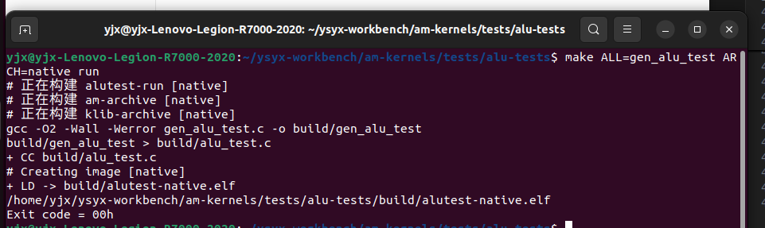

- [支持RV32E的单周期NPC](#支持rv32e的单周期npc)
  - [搭建面向riscv32e-npc的运行时环境](#搭建面向riscv32e-npc的运行时环境)
    - [题目：从命令行中读入NPC需要执行的程序](#题目从命令行中读入npc需要执行的程序)
    - [题目：一键编译并在NPC上运行AM程序](#题目一键编译并在npc上运行am程序)
    - [题目：如果你是初学者, 尝试自己画出架构图](#题目如果你是初学者-尝试自己画出架构图)
    - [题目：在NPC上运行dummy程序](#题目在npc上运行dummy程序)
    - [题目：实现riscv32e-npc中的halt()函数](#题目实现riscv32e-npc中的halt函数)
    - [题目：为NPC实现HIT GOOD/BAD TRAP](#题目为npc实现hit-goodbad-trap)
  - [为NPC搭建基础设施](#为npc搭建基础设施)
    - [题目：为NPC搭建sdb](#题目为npc搭建sdb)
      - [首先验证环境（使用命令“c”）](#首先验证环境使用命令c)
      - [实现单步执行](#实现单步执行)
      - [实现打印寄存器](#实现打印寄存器)
      - [实现表达式求值 和 监视点](#实现表达式求值-和-监视点)
    - [题目：为NPC添加trace支持](#题目为npc添加trace支持)
      - [实现itrace](#实现itrace)
      - [实现指令环形缓冲区 - iringbuf](#实现指令环形缓冲区---iringbuf)
      - [实现mtrace](#实现mtrace)
      - [实现ftrace](#实现ftrace)
      - [题目: 为NPC添加DiffTest支持](#题目-为npc添加difftest支持)
      - [思考题：硬件如何区分有符号数和无符号数?](#思考题硬件如何区分有符号数和无符号数)
    - [实现RV32E指令集](#实现rv32e指令集)
      - [题目：为NPC添加mtrace的支持](#题目为npc添加mtrace的支持)
      - [题目：如果你是初学者, 尝试自己画出架构图](#题目如果你是初学者-尝试自己画出架构图-1)
      - [题目：观察ALU的综合结果   （目前遇到问题）](#题目观察alu的综合结果---目前遇到问题)
      - [题目：在NPC中正确运行所有cpu-tests](#题目在npc中正确运行所有cpu-tests)
- [输入与输出](#输入与输出)
  - [设备与CPU](#设备与cpu)
    - [端口I/O](#端口io)
    - [內存映射I/O](#內存映射io)
      - [理解volatile关键字](#理解volatile关键字)
    - [状态机视角下的输入输出](#状态机视角下的输入输出)
    - [NEMU中的输入输出](#nemu中的输入输出)
      - [映射和I/O方式](#映射和io方式)
      - [设备](#设备)
    - [将输入输出抽象成IOE](#将输入输出抽象成ioe)
      - [串口](#串口)
        - [题目：运行Hello World](#题目运行hello-world)
        - [题目：实现printf](#题目实现printf)
        - [题目：运行alu-tests](#题目运行alu-tests)
      - [时钟](#时钟)
        - [题目：实现IOE](#题目实现ioe)
        - [题目：阅读源代码，找到AM\_TIMER\_UPTIME的问题](#题目阅读源代码找到am_timer_uptime的问题)
        - [题目：看看NEMU跑多快](#题目看看nemu跑多快)
        - [题目：运行演示程序](#题目运行演示程序)
        - [题目：观看"Bad Apple!!" PV](#题目观看bad-apple-pv)
        - [题目：运行红白机模拟器](#题目运行红白机模拟器)
        - [思考题： native和klib](#思考题-native和klib)
      - [设备访问的踪迹 - dtrace](#设备访问的踪迹---dtrace)
        - [实现dtrace](#实现dtrace)
      - [键盘](#键盘)
        - [题目：实现IOE(2)](#题目实现ioe2)
        - [思考题：如何检测多个键同时被按下?](#思考题如何检测多个键同时被按下)
        - [题目：运行红白机模拟器(2)](#题目运行红白机模拟器2)
      - [VGA](#vga)
        - [题目：实现IOE(3)](#题目实现ioe3)
        - [题目：实现IOE(4)](#题目实现ioe4)
        - [运行演示程序(2)和运行红白机模拟器(3)](#运行演示程序2和运行红白机模拟器3)
    - [冯诺依曼计算机系统](#冯诺依曼计算机系统)
      - [题目：展示你的计算机系统](#题目展示你的计算机系统)
      - [题目：游戏是如何运行的](#题目游戏是如何运行的)
  - [NPC输入与输出](#npc输入与输出)
    - [在NPC中运行超级玛丽](#在npc中运行超级玛丽)
      - [题目：为NPC添加串口和时钟](#题目为npc添加串口和时钟)


# 支持RV32E的单周期NPC

## 搭建面向riscv32e-npc的运行时环境
AM项目已经提供了riscv32e-npc的基本框架, 你只需要在am-kernels/tests/cpu-tests/目录下执行  
```
make ARCH=riscv32e-npc ALL=xxx
```  
即可将名为xxx的测试编译到riscv32e-npc的运行时环境中. 为了熟悉流程, 我们先尝试在NPC中运行dummy程序.  

### 题目：从命令行中读入NPC需要执行的程序
接下来我们将会在NPC中不断地运行各种程序, 如果每次运行新程序都要重新编译NPC, 效率是很低的. 为了提高效率, 我们可以让仿真环境从命令行中读入程序的路径, 然后把程序内容放置到存储器中.  

### 题目：一键编译并在NPC上运行AM程序
在AM项目中, Makefile并没有为riscv32e-npc提供run目标. 尝试为riscv32e-npc提供run目标, 使得键入make ARCH=riscv32e-npc ALL=xxx run即可把AM程序编译并在NPC上运行.  

***  
我在npc.mk文件的run进行了修改：
```
run: insert-arg
	$(NPC_HOME)/build/Npc $(abspath $(IMAGE).bin)
```  

运行得到了结果：  
```
yjx@yjx-Lenovo-Legion-R7000-2020:~/ysyx-workbench/am-kernels/tests/cpu-tests$ make ARCH=riscv32e-npc ALL=dummy run
# 正在构建 dummy-run [riscv32e-npc]
# 正在构建 am-archive [riscv32e-npc]
# 正在构建 klib-archive [riscv32e-npc]
+ OBJCOPY -> build/dummy-riscv32e-npc.bin
mainargs=
Ebreak detected. Ending simulation.
test list [1 item(s)]: dummy
[         dummy] PASS
```  
似乎是成功了？讲义后续还有内容：  

为了运行dummy程序, NPC还需要实现一些指令. 具体地  
* auipc, lui: 它们属于整数计算指令, 思考一下, 如何让这些指令与addi共享同一个加法器?
* jal, jalr: 它们属于条无条件跳转指令, 执行之后, PC将会被修改, 这应该如何实现?
* sw: 这条指令需要访存内存, 不过对于dummy程序来说, 不实现这条sw指令也不影响运行的结果. 因此目前你可以将它实现成空指令, 我们会在后面再来正确地实现它.  

### 题目：如果你是初学者, 尝试自己画出架构图
如果你是处理器设计的初学者, 尝试在之前的架构图上添加auipc, lui, jal, jalr的电路.

***  


### 题目：在NPC上运行dummy程序
实现上述指令, 使得NPC可以运行dummy程序. 不过目前riscv32e-npc的halt()函数是一个死循环, 你可以通过查看波形来检查NPC是否成功进入了halt()函数.  

***  
观察到执行完以后直接pc直接从0开始了。  

### 题目：实现riscv32e-npc中的halt()函数  
为了可以自动地结束程序, 你需要在riscv32e-npc中实现TRM的halt()函数, 在其中添加一条ebreak指令. 这样以后, 在NPC上运行的AM程序在结束的时候就会执行ebreak指令, 从而通知NPC的仿真环境结束仿真.  

实现之后, 你就可以通过一条命令自动在NPC上运行AM程序并自动结束仿真了.  

***  
**ASM volatile语法**  
这是GCC内联汇编语法，主要用于嵌入式系统或底层编程。    
1. 基本组成
   * asm：GCC内联汇编的关键字，表示后面是汇编指令
   * volatile：告诉编译器不要优化这段代码，确保它按原样执行

2. 功能作用
这条指令会产生一个调试断点异常，常用于：  
* 调试器断点设置
* 程序调试时的暂停点
* 触发调试处理程序
* 在模拟器中暂停执行

所以使用： ```asm volatile("ebreak");```  

### 题目：为NPC实现HIT GOOD/BAD TRAP
NEMU可以输出"程序是否成功结束执行"的信息, 尝试在NPC中实现相似的功能, 这样以后, 你就可以知道程序在NPC上是否成功结束了.

***  
我的想法是，成功执行完指令到了ebreak就算是程序成功结束执行，打印HIT GOOD。如果没有执行到ebreak就算是异常。先暂时这样实现了。  


## 为NPC搭建基础设施
### 题目：为NPC搭建sdb  
你需要为NPC实现单步执行, 打印寄存器和扫描内存的功能, 而表达式求值和监视点都是基于打印寄存器和扫描内存实现的. 单步执行和扫描内存都很容易实现.  

为了打印寄存器, 你需要访问RTL中的通用寄存器. 有如下两种方式进行访问, 你可以自行选择:
* 通过DPI-C进行访问.
* 通过Verilator编译出的C++文件来访问通用寄存器, 例如top->rootp->NPC__DOT__isu__DOT__R_ext__DOT__Memory, 具体的C++变量名与Verilog中的模块名和变量名有关, 可阅读编译出的C++头文件得知. 不过C++变量名可能会在修改RTL代码或更改Verilator版本时发生变化, 需要手动同步修改.

#### 首先验证环境（使用命令“c”）  
**遇到的问题：在编译的时候无法找到readline库。**  
问题描述：虽然我在make命令中添加了-lreadline -lncurses，但 Verilator 生成的 VNpc.mk 可能没有正确继承这些选项。因此，最终 g++ 链接时没有包含这些库，导致找不到符号。  
**解决的办法：** 1.显式添加 --LDFLAGS "-lreadline -lncurses" 到 VERILATOR_CFLAGS。确保 Verilator 在生成 Makefile（VNpc.mk）时，正确传递链接选项。2.在 make -C $(OBJ_DIR) 时，显式传递 LDFLAGS="-lreadline -lncurses"，避免被默认值覆盖。  

运行结果：  
```
yjx@yjx-Lenovo-Legion-R7000-2020:~/ysyx-workbench/am-kernels/tests/cpu-tests$ make ARCH=riscv32e-npc ALL=dummy run
# 正在构建 dummy-run [riscv32e-npc]
# 正在构建 am-archive [riscv32e-npc]
# 正在构建 klib-archive [riscv32e-npc]
+ OBJCOPY -> build/dummy-riscv32e-npc.bin
mainargs=
Trace: ON 
If trace is enabled, a log file will be generated 
to record the trace. This may lead to a large log file. 
If it is not necessary, you can disable it in npcconfig
Build time: 17:38:32, Mar 26 2025
Welcome to riscv32e-NPC!
For help, type "help"
(npc) c
PC = 0x80000000, INST = 0x00000413 
PC = 0x80000004, INST = 0x00009117 
PC = 0x80000008, INST = 0xffc10113 
PC = 0x8000000c, INST = 0x00c000ef 
PC = 0x80000010, INST = 0x00000513 
PC = 0x8000001c, INST = 0x00000517 
PC = 0x80000020, INST = 0x01850513 
PC = 0x80000024, INST = 0x00112423 
PC = 0x80000028, INST = 0xfe9ff0ef 
PC = 0x8000002c, INST = 0x00100073 
npc: HIT GOOD TRAP at pc = 0x80000030 
host time spent = 312 us 
total guest instructions = 10 
simulation frequency =  32051  inst/s 
```  

#### 实现单步执行
这个比较容易，在完善好NPC的环境后，已经将 exec_once()函数，execute(uint64_t n)函数，cpu_exec(uint64_t n)函数实现了，所以cmd_si很自然的就实现了。  

#### 实现打印寄存器
这里我使用了讲义中提到的类似于第二种方法,在取指执行后直接获取寄存器的值，然后存入寄存器数组中，类似于(在exec_once()函数中)：  
```
// 取指阶段
    cpu_state.pc = top->io_pc;
    dpi_fetch_inst(cpu_state.pc);
    cpu_state.inst = top->io_inst;
    cpu_state.snpc = cpu_state.pc + 4;

    // 提取寄存器组的值
    cpu_state.gpr[0] = top->io_regs_0;
    cpu_state.gpr[1] = top->io_regs_1;
    cpu_state.gpr[2] = top->io_regs_2;
    cpu_state.gpr[3] = top->io_regs_3;
    cpu_state.gpr[4] = top->io_regs_4;
    cpu_state.gpr[5] = top->io_regs_5;
    cpu_state.gpr[6] = top->io_regs_6;
    cpu_state.gpr[7] = top->io_regs_7;
    cpu_state.gpr[8] = top->io_regs_8;
    cpu_state.gpr[9] = top->io_regs_9;
    cpu_state.gpr[10] = top->io_regs_10;
    cpu_state.gpr[11] = top->io_regs_11;
    cpu_state.gpr[12] = top->io_regs_12;
    cpu_state.gpr[13] = top->io_regs_13;
    cpu_state.gpr[14] = top->io_regs_14;
    cpu_state.gpr[15] = top->io_regs_15;
    cpu_state.gpr[16] = top->io_regs_16;
    cpu_state.gpr[17] = top->io_regs_17;
    cpu_state.gpr[18] = top->io_regs_18;
    cpu_state.gpr[19] = top->io_regs_19;
    cpu_state.gpr[20] = top->io_regs_20;
    cpu_state.gpr[21] = top->io_regs_21;
    cpu_state.gpr[22] = top->io_regs_22;
    cpu_state.gpr[23] = top->io_regs_23;
    cpu_state.gpr[24] = top->io_regs_24;
    cpu_state.gpr[25] = top->io_regs_25;
    cpu_state.gpr[26] = top->io_regs_26;
    cpu_state.gpr[27] = top->io_regs_27;
    cpu_state.gpr[28] = top->io_regs_28;
    cpu_state.gpr[29] = top->io_regs_29;
    cpu_state.gpr[30] = top->io_regs_30;
    cpu_state.gpr[31] = top->io_regs_31;
```  

#### 实现表达式求值 和 监视点
直接移植了。

### 题目：为NPC添加trace支持
这里提到需要通过DPI-C获取当前的指令。这个应该很早就实现了。在实现单步执行的时候需要取指，译码，执行，并且写入了一个存储pc，inst等的一个结构体CPUstate。虽然这里提到，让我不禁怀疑我的目前的实现是不是有点问题。（应该没问题。）

#### 实现itrace
主要的困难是由于没有正确编写makefile文件，导致capstone库没有被识别到，同时也对disasm.c进行了修改，主要还是路径问题。  

#### 实现指令环形缓冲区 - iringbuf
这个也是直接移植，思路仍然是创建一个环形缓冲区，通过反汇编函数把信息从cpu_state.logbuf中读取。  

#### 实现mtrace  
暂时跳过  

#### 实现ftrace  
也是实现了，使用了nemu的inst.c的宏，也是省了很多事情。也是加了宏开关，可以实现开关ftrace，这是运行结果：  
```
yjx@yjx-Lenovo-Legion-R7000-2020:~/ysyx-workbench/am-kernels/tests/cpu-tests$ make ARCH=riscv32e-npc ALL=dummy run
# 正在构建 dummy-run [riscv32e-npc]
# 正在构建 am-archive [riscv32e-npc]
# 正在构建 klib-archive [riscv32e-npc]
+ OBJCOPY -> build/dummy-riscv32e-npc.bin
mainargs=
成功打开 ELF 文件: /home/yjx/ysyx-workbench/am-kernels/tests/cpu-tests/build/dummy-riscv32e-npc.elf
ELF 头信息读取成功: 入口地址 0x80000000, 段头表偏移  0x1348, 段头表项个数 8
找到符号表: 在文件中的偏移 0x10bc, 大小 432, 每项大小 16
找到字符串表: 在文件中的偏移 0x126c, 大小 149
符号表中共有 27 个符号
发现函数符号: 地址 0x80000018, 名称 _trm_init
发现函数符号: 地址 0x80000000, 名称 _start
发现函数符号: 地址 0x80000010, 名称 main
Trace: ON 
If trace is enabled, a log file will be generated 
to record the trace. This may lead to a large log file. 
If it is not necessary, you can disable it in npcconfig
Build time: 17:10:14, Mar 27 2025
Welcome to riscv32e-NPC!
For help, type "help"
(npc) c
0x8000000c:  call [UNKNOWN(find_func_name())@0x8000001c]
0x80000028:   call [UNKNOWN(find_func_name())@0x80000014]
npc: HIT GOOD TRAP at pc = 0x80000030 
host time spent = 368 us 
total guest instructions = 10 
simulation frequency =  27173  inst/s 
(npc) q
test list [1 item(s)]: dummy
[         dummy] PASS

```  

#### 题目: 为NPC添加DiffTest支持
目前遇到的问题：  
问题一：显示宽度错误。  
  

我猜测可能是指令没有被正确的初始化，我的代码中可能有一些问题，应该是地址的转换出现了问题。  

首先我在nemu的host.h中添加了printf输出，发现host_write(void *addr, int len, word_t data)被传进去的len是116,并不是4字节，说明是长度出现了问题。主要检查范围是cpu/difftest下面的dut.c和ref.c。同时也修改了paddr.c中的paddr_write()函数。问题出现在传入的是整个文件的大小而不是固定字节。difftest_memcpy的实现也修改了，直接调用标准的内存拷贝函数memcpy。  

最后解决了，运行结果截图：  


问题二：NEMU作为ref的时序要比npc快一拍，现象是NPC的PC为0x80000000时，NEMU的PC就已经是0x80000004。  
解决：是之前cpu_once函数没有更新cpu.pc所以没有被同步。  


问题三：由于不使用top->io_inst，io_regs也不能正常更新了，所以还是需要使用DPI-C的机制。
解决：又于重推了，同时也了解到，这个不对齐是正常的，因为需要eval()后，才会更新reg所以就在波形图上慢了。后续我会实现DPI-C

问题四：时序问题。


问题五：反汇编出现了问题。跳转指令没有正确输出。
解决：深入理解NEMU的每一步以后，发现我将snpc和dnpc混为一谈了。  

问题六：difftest的ref似乎没有正确加载内存。指令后直接报错。
解决：发现是nemu没有切换到16个寄存器，导致在npc这里获取寄存器状态时，栈溢出了，导致错误。在打开nemu的config_rve = 1后解决。

#### 思考题：硬件如何区分有符号数和无符号数?
尝试编写以下程序:
```
#include <stdint.h>
int32_t fun1(int32_t a, int32_t b) { return a + b; }
uint32_t fun2(uint32_t a, uint32_t b) { return a + b; }
```   

然后编译并查看反汇编代码:  
```
riscv64-linux-gnu-gcc -c -march=rv32g -mabi=ilp32 -O2 test.c
riscv64-linux-gnu-objdump -d test.o
```  

运行结果：  
```
Disassembly of section .text:

00000000 <fun1>:
   0:   00b50533                add     a0,a0,a1
   4:   00008067                ret

00000008 <fun2>:
   8:   00b50533                add     a0,a0,a1
   c:   00008067                ret
```  
这两个函数有什么不同? 思考一下这是为什么?  
加法也是基于 **补码** 实现的，所以在加法操作中，有符号数和无符号数的加法在硬件层面是一样的。  

**补码的妙用：**  
* 有符号整数在硬件中以补码表示。
* 补码的最大优点就是它让加减法在硬件上可以统一处理，无需区分有符号还是无符号。  

加减法是不区分的，比较和乘除法区分。  

### 实现RV32E指令集
#### 题目：为NPC添加mtrace的支持
在通过DPI-C机制实现了内存的访问以后，也是把mtrace实现了。  

  


#### 题目：如果你是初学者, 尝试自己画出架构图
如果你是处理器设计的初学者, 尝试画出一个完整的单周期处理器架构图.  

#### 题目：观察ALU的综合结果   （目前遇到问题）

#### 题目：在NPC中正确运行所有cpu-tests
有了基础设施的强大帮助, 你应该可以很容易地正确实现支持RV32E的NPC了.  

通过截图：  


# 输入与输出
## 设备与CPU
### 端口I/O
一种I/O编址方式是端口映射I/O(port-mapped I/O), CPU使用专门的I/O指令对设备进行访问, 并把设备的地址称作端口号. 有了端口号以后, 在I/O指令中给出端口号, 就知道要访问哪一个设备寄存器了. 市场上的计算机绝大多数都是IBM PC兼容机, IBM PC兼容机对常见设备端口号的分配有专门的规定.  

专门的规定：  
| 端口范围         | 概括                                                                 |
|------------------|----------------------------------------------------------------------|
| 0x0000-0x001F     | 第一个传统DMA控制器，通常用于传输到软盘                              |
| 0x0020-0x0021     | 第一个可编程中断控制器                                               |
| 0x0022-0x0023     | 访问 Cyrix 处理器的特定型号寄存器                                    |
| 0x0040-0x0047     | PIT（可编程间隔定时器）                                               |
| 0x0060-0x0064     | “8042” PS/2 控制器或其前身，用于处理键盘和鼠标                      |
| 0x0070-0x0071     | CMOS 和 RTC 寄存器                                                   |
| 0x0080-0x008F     | DMA（页面寄存器）                                                    |
| 0x0092           | 快速 A20 门寄存器的位置                                               |
| 0x00A0-0x00A1     | 第二位 PIC                                                            |
| 0x00C0-0x00DF     | 第二个 DMA 控制器，通常用于声霸卡                                    |
| 0x00E9           | E9 端口 Hack 的发源地。用于某些模拟器，直接向主机控制台发送文本     |
| 0x0170-0x0177     | 辅助 ATA 硬盘控制器                                                  |
| 0x01F0-0x01F7     | 主 ATA 硬盘控制器                                                    |
| 0x0278-0x027A     | 并口                                                                  |
| 0x02F8-0x02FF     | 第二个串行端口                                                       |
| 0x03B0-0x03DF     | IBM VGA、其前代产品及现代传统模式下的视频卡使用的端口范围           |
| 0x03F0-0x03F7     | 软盘控制器                                                            |
| 0x03F8-0x03FF     | 第一个串口                                                            |

### 內存映射I/O
#### 理解volatile关键字
也许你从来都没听说过C语言中有volatile这个关键字, 但它从C语言诞生开始就一直存在. volatile关键字的作用十分特别, 它的作用是避免编译器对相应代码进行优化. 你应该动手体会一下volatile的作用, 在GNU/Linux下编写以下代码:   
```
void fun() {
  extern unsigned char _end;  // _end是什么?
  volatile unsigned char *p = &_end;
  *p = 0;
  while(*p != 0xff);
  *p = 0x33;
  *p = 0x34;
  *p = 0x86;
}

```  
然后使用-O2编译代码. 尝试去掉代码中的volatile关键字, 重新使用-O2编译, 并对比去掉volatile前后反汇编结果的不同.  

你或许会感到疑惑, 代码优化不是一件好事情吗? 为什么会有volatile这种奇葩的存在? 思考一下, 如果代码中p指向的地址最终被映射到一个设备寄存器, 去掉volatile可能会带来什么问题?  

***  
volatile **告诉编译器：这个变量的值可能在任何时刻被其他“外部因素”改变，所以不能优化它的访问（比如缓存、重排等操作）。**  

### 状态机视角下的输入输出

### NEMU中的输入输出
NEMU的框架代码已经在nemu/src/device/目录下提供了设备相关的代码,

#### 映射和I/O方式
NEMU实现了端口映射I/O和内存映射I/O两种I/O编址方式. 但无论是端口映射I/O还是内存映射I/O, 它们的核心都是映射. 自然地, 我们可以通过对映射的管理来将这两者统一起来.

具体地, 框架代码为映射定义了一个结构体类型IOMap(在nemu/include/device/map.h中定义), 包括名字, 映射的起始地址和结束地址, 映射的目标空间, 以及一个回调函数. 然后在nemu/src/device/io/map.c实现了映射的管理, 包括I/O空间的分配及其映射, 还有映射的访问接口.

其中map_read()和map_write()用于将地址addr映射到map所指示的目标空间, 并进行访问. 访问时, 可能会触发相应的回调函数, 对设备和目标空间的状态进行更新. 由于NEMU是单线程程序, 因此只能串行模拟整个计算机系统的工作, 每次进行I/O读写的时候, 才会调用设备提供的回调函数(callback). 基于这两个API, 我们就可以很容易实现端口映射I/O和内存映射I/O的模拟了.

nemu/src/device/io/port-io.c是对端口映射I/O的模拟. add_pio_map()函数用于为设备的初始化注册一个端口映射I/O的映射关系. pio_read()和pio_write()是面向CPU的端口I/O读写接口, 它们最终会调用map_read()和map_write(), 对通过add_pio_map()注册的I/O空间进行访问.

内存映射I/O的模拟是类似的, paddr_read()和paddr_write()会判断地址addr落在物理内存空间还是设备空间, 若落在物理内存空间, 就会通过pmem_read()和pmem_write()来访问真正的物理内存; 否则就通过map_read()和map_write()来访问相应的设备. 从这个角度来看, 内存和外设在CPU来看并没有什么不同, 只不过都是一个字节编址的对象而已.

#### 设备
NEMU实现了串口, 时钟, 键盘, VGA, 声卡, 磁盘, SD卡七种设备, 其中磁盘会在PA的最后再进行介绍, 而SD卡在PA中不会涉及. 为了简化实现, 这些设备都是不可编程的, 而且只实现了在NEMU中用到的功能. 为了开启设备模拟的功能, 你需要在menuconfig选中相关选项:  
```
[*] Devices  --->
```  
重新编译后, 你会看到运行NEMU时会弹出一个新窗口, 用于显示VGA的输出(见下文). 需要注意的是, 终端显示的提示符(nemu)仍然在等待用户输入, 此时窗口并未显示任何内容.  

NEMU使用SDL库来实现设备的模拟, nemu/src/device/device.c含有和SDL库相关的代码. init_device()函数主要进行以下工作:   
* 调用init_map()进行初始化.
* 对上述设备进行初始化, 其中在初始化VGA时还会进行一些和SDL相关的初始化工作, 包括创建窗口, 设置显示模式等;
* 然后会进行定时器(alarm)相关的初始化工作. 定时器的功能在PA4最后才会用到, 目前可以忽略它.

另一方面, cpu_exec()在执行每条指令之后就会调用device_update()函数, 这个函数首先会检查距离上次设备更新是否已经超过一定时间, 若是, 则会尝试刷新屏幕, 并进一步检查是否有按键按下/释放, 以及是否点击了窗口的X按钮; 否则则直接返回, 避免检查过于频繁, 因为上述事件发生的频率是很低的.  

### 将输入输出抽象成IOE
设备访问的具体实现是架构相关的, 比如NEMU的VGA显存位于物理地址区间[0xa1000000, 0xa1080000), 但对native的程序来说, 这是一个不可访问的非法区间, 因此native程序需要通过别的方式来实现类似的功能. 自然地, 设备访问这一架构相关的功能, 应该归入AM中. 与TRM不同, 设备访问是为计算机提供输入输出的功能, 因此我们把它们划入一类新的API, 名字叫IOE(I/O Extension).

要如何对不同架构的设备访问抽象成统一的API呢? 回想一下在程序看来, 访问设备其实想做什么: 访问设备 = 读出数据 + 写入数据 + 控制状态. 进一步的, 控制状态本质上也是读/写设备寄存器的操作, 所以访问设备 = 读/写操作.

对, 就是这么简单! 所以IOE提供三个API:  
```
bool ioe_init();
void ioe_read(int reg, void *buf);
void ioe_write(int reg, void *buf);
```  
第一个API用于进行IOE相关的初始化操作. 后两个API分别用于从编号为reg的寄存器中读出内容到缓冲区buf中, 以及往编号为reg寄存器中写入缓冲区buf中的内容. 需要注意的是, 这里的reg寄存器并不是上文讨论的设备寄存器, 因为设备寄存器的编号是架构相关的. 在IOE中, 我们希望采用一种架构无关的"抽象寄存器", 这个reg其实是一个功能编号, 我们约定在不同的架构中, 同一个功能编号的含义也是相同的, 这样就实现了设备寄存器的抽象.

abstract-machine/am/include/amdev.h中定义了常见设备的"抽象寄存器"编号和相应的结构. 这些定义是架构无关的, 每个架构在实现各自的IOE API时, 都需要遵循这些定义(约定). 为了方便地对这些抽象寄存器进行访问, klib中提供了io_read()和io_write()这两个宏, 它们分别对ioe_read()和ioe_write()这两个API进行了进一步的封装.

特别地, NEMU作为一个平台, 设备的行为是与ISA无关的, 因此我们只需要在abstract-machine/am/src/platform/nemu/ioe/目录下实现一份IOE, 来供NEMU平台的架构共享. 其中, abstract-machine/am/src/platform/nemu/ioe/ioe.c中实现了上述的三个IOE API, ioe_read()和ioe_write()都是通过抽象寄存器的编号索引到一个处理函数, 然后调用它. 处理函数的具体功能和寄存器编号相关, 下面我们来逐一介绍NEMU中每个设备的功能.

#### 串口
串口是最简单的输出设备. nemu/src/device/serial.c模拟了串口的功能. 其大部分功能也被简化, 只保留了数据寄存器. 串口初始化时会分别注册0x3F8处长度为8个字节的端口, 以及0xa00003F8处长度为8字节的MMIO空间, 它们都会映射到串口的数据寄存器. 由于NEMU串行模拟计算机系统的工作, 串口的状态寄存器可以一直处于空闲状态; 每当CPU往数据寄存器中写入数据时, 串口会将数据传送到主机的标准错误流进行输出.

事实上, 在$ISA-nemu中, 我们之前提到的putch()函数, 就是通过串口输出的. 然而AM却把putch()放在TRM, 而不是IOE中, 这让人觉得有点奇怪. 的确, 可计算理论中提出的最原始的TRM并不包含输出的能力, 但对于一个现实的计算机系统来说, 输出是一个最基本的功能, 没有输出, 用户甚至无法知道程序具体在做什么. 因此在AM中, putch()的加入让TRM具有输出字符的能力, 被扩充后的TRM更靠近一个实用的机器, 而不再是只会计算的数学模型.

abstract-machine/am/src/platform/nemu/trm.c中的putch()会将字符输出到串口. 如果你选择了x86, 为了让程序使用串口进行输出, 你还需要在NEMU中实现端口映射I/O.

##### 题目：运行Hello World
如果你选择了x86, 你需要实现in, out指令. 具体地, 你需要RTFSC, 然后在in指令和out指令的实现中正确调用pio_read()和pio_write(). 如果你选择的是mips32和riscv32, 你不需要实现额外的代码, 因为NEMU的框架代码已经支持MMIO了.

实现后, 在am-kernels/kernels/hello/目录下键入```make ARCH=$ISA-nemu run```  

如果你的实现正确, 你将会看到程序往终端输出一些信息(请注意不要让输出淹没在调试信息中).

需要注意的是, 这个hello程序和我们在程序设计课上写的第一个hello程序所处的抽象层次是不一样的: 这个hello程序可以说是直接运行在裸机上, 可以在AM的抽象之上直接输出到设备(串口); 而我们在程序设计课上写的hello程序位于操作系统之上, 不能直接操作设备, 只能通过操作系统提供的服务进行输出, 输出的数据要经过很多层抽象才能到达设备层. 我们会在PA3中进一步体会操作系统的作用.  

***  
运行结果：  

  

**设备和DiffTest**  
在状态机视角下, 执行一条输入指令会让状态机的状态转移变得不唯一, 新状态取决于设备的状态. 由于NEMU中设备的行为是我们自定义的, 与REF中的标准设备的行为不完全一样 (例如NEMU中的串口总是就绪的, 但QEMU中的串口也许并不是这样), 这导致在NEMU中执行输入指令的结果会和REF有所不同. 为了使得DiffTest可以正常工作, 框架代码在访问设备的过程中调用了difftest_skip_ref()函数 (见nemu/include/device/map.h中定义的find_mapid_by_addr()函数)来跳过与REF的检查.  

***  

在AM中, main()函数允许带有一个字符串参数, 这一参数通过mainargs指定, 并由AM的运行时环境负责将它传给main()函数, 供AM程序使用. 具体的参数传递方式和架构相关. 例如你可以在运行hello的时候给出一个字符串参数:  
```
make ARCH=$ISA-nemu run mainargs=I-love-PA
```  
这个参数会被hello程序原样输出.

**理解mainargs**  
请你通过RTFSC理解这个参数是如何从make命令中传递到hello程序中的, $ISA-nemu和native采用了不同的传递方法, 都值得你去了解一下.  


整个运行流程是：  
1. make ARCH=$ISA-nemu run mainargs=I-love-PA 到 insert-arg 目标
2. 然后insert-arg 目标 调用 Python 脚本 insert-arg.py
3. 接着insert-arg.py 把 hello world 插入 .bin 文件中，程序运行时读取这些参数
4. 最后 main(argc, argv) 就能收到它们！  

makefile(nemu.mk)中定义了：  
```
# 定义主函数参数的最大长度和占位符
# 主函数参数的最大长度
MAINARGS_MAX_LEN = 64
MAINARGS_PLACEHOLDER = The insert-arg rule in Makefile will insert mainargs here.
CFLAGS += -DMAINARGS_MAX_LEN=$(MAINARGS_MAX_LEN) -DMAINARGS_PLACEHOLDER=\""$(MAINARGS_PLACEHOLDER)"\"

# 插入主函数参数的规则
insert-arg: image
	@python $(AM_HOME)/tools/insert-arg.py $(IMAGE).bin $(MAINARGS_MAX_LEN) "$(MAINARGS_PLACEHOLDER)" "$(mainargs)"
```  

插入主函数参数的规则 insert-arg: image 的作用是：  
* 查找编译生成的 .bin 文件中是否包含一段占位符字符串（MAINARGS_PLACEHOLDER），将其替换为实际传入的参数 "hello world"（用 mainargs 表示），从而把命令行参数写进你的程序镜像中！  


##### 题目：实现printf  
有了putch(), 我们就可以在klib中实现printf()了.

你之前已经实现了sprintf()了, 它和printf()的功能非常相似, 这意味着它们之间会有不少重复的代码. 你已经见识到Copy-Paste编程习惯的坏处了, 思考一下, 如何简洁地实现它们呢?

实现了printf()之后, 你就可以在AM程序中使用输出调试法了.  

##### 题目：运行alu-tests  
我们在am-kernels/tests/alu-tests/目录下移植了一个专门测试各种C语言运算的程序, 实现printf()后你就可以运行它了. 编译过程可能需要花费1分钟.  

在实现后，我在以前实现sprintf的那颗测试文件中，尝试了实现前和实现后的对比，在那边时可以看到printf()是否有实现了。但是当我在am-kernels/tests/alu-tests/目录下运行：```make ALL=gen_alu_test ARCH=native run``` ,无论实现不实现都没报错？这让我有点困惑.  

  

#### 时钟
有了时钟, 程序才可以提供时间相关的体验, 例如游戏的帧率, 程序的快慢等. nemu/src/device/timer.c模拟了i8253计时器的功能. 计时器的大部分功能都被简化, 只保留了"发起时钟中断"的功能(目前我们不会用到). 同时添加了一个自定义的时钟. i8253计时器初始化时会分别注册0x48处长度为8个字节的端口, 以及0xa0000048处长度为8字节的MMIO空间, 它们都会映射到两个32位的RTC寄存器. CPU可以访问这两个寄存器来获得用64位表示的当前时间.  

**为什么不设置一个64位的RTC寄存器?**  
我们希望设备的设计与CPU解耦, 无论设备接入到何种架构的CPU都能工作. 但32位的CPU无法一次访问64位的设备寄存器, 因此将一个64位的功能拆分成两个32位的设备寄存器, 可同时支持接入32位和64位CPU.  

***  
abstract-machine/am/include/amdev.h中为时钟的功能定义了两个抽象寄存器:  
* AM_TIMER_RTC, AM实时时钟(RTC, Real Time Clock), 可读出当前的年月日时分秒. PA中暂不使用.  
* M_TIMER_UPTIME, AM系统启动时间, 可读出系统启动后的微秒数.  

**RTC - 实时时钟**    
RTC泛指流逝速率与真实时间一致的时钟, 用户可根据RTC进行一段时间的测量. 按照这个定义, 上述两个AM抽象寄存器都属于RTC, 不过它们的侧重点有所不同: AM_TIMER_RTC强调读出的时间与现实时间完全一致, AM_TIMER_UPTIME则侧重系统启动后经过的时间, 即从0开始计数.

虽然NEMU中的设备寄存器的名称也叫RTC, 但为了支持AM_TIMER_UPTIME的功能, 它不必实现成AM_TIMER_RTC.  

##### 题目：实现IOE  
在 ```abstract-machine/am/src/platform/nemu/ioe/timer.c``` 中实现 ```AM_TIMER_UPTIME``` 的功能. 在 ```abstract-machine/am/src/platform/nemu/include/nemu.h``` 和 ```abstract-machine/am/src/$ISA/$ISA.h``` 中有一些输入输出相关的代码供你使用.

实现后, 在 ```$ISA-nemu中``` 运行 ```am-kernel/tests/am-tests```中的 ```real-time clock test``` 测试. 如果你的实现正确, 你将会看到程序每隔1秒往终端输出一行信息. 由于我们没有实现```AM_TIMER_RTC``` , 测试总是输出1900年0月0日0时0分0秒, 这属于正常行为, 可以忽略.  

**实验过程：**  
* 根据讲义的要求，我首先看了两个头文件：abstract-machine/am/src/platform/nemu/include/nemu.h 和 abstract-machine/am/src/$ISA/$ISA.h  
* 在nemu.h中，观察到```#define RTC_ADDR        (DEVICE_BASE + 0x0000048)   /*实时时钟*/``` 比较符合我们所需要的内容。  
* 在riscv.h中，也出现了讲义所提示的输入输出。由于只是读取系统时间，所以使用inl。
* 由于这是riscv32,实现64位依靠的是两个寄存器，所以需要区分高位和低位，所以需要获取两个值并且拼接起来。

运行结果：  

 

##### 题目：阅读源代码，找到AM_TIMER_UPTIME的问题
首先，我看到am-kernels/benchmarks项目的源码文件与abstract-machine的连接是通过源码中载入头文件的方式进行联系的（通过io_read()函数，宏展开以后就是ioe_read()）。然后调用__am_timer_uptime函数，访问寄存器。整个过程：benchmark代码 → uptime_ms() → io_read(AM_TIMER_UPTIME) → __am_timer_uptime() → 硬件寄存器访问。  

讲义中所留的坑：由于是使用两个32位的寄存器拼接成64位的数据，可能会出现溢出问题，导致时间戳变小，导致跑分性能异常（现象：居然比参考的还要快五倍甚至六倍，这显然是不正常的，说明时间出现了问题）。需要先读高位再读低位，这样才能确定低位是否进位溢出。  

我一开始就是先读取低位然后再读取高位，然后读取过程中低位溢出进位，会导致拼接后的时间戳错误，得到的时间比实际时间小，所以跑分异常的高。解决办法是先读取高位再读取低位，同时添加验证，若高位值与第一次读取一致，说明未发生进位，拼接结果有效；否则重新读取。


##### 题目：看看NEMU跑多快
有了时钟之后, 我们就可以测试一个程序跑多快, 从而测试计算机的性能. 尝试在NEMU中依次运行以下benchmark(已经按照程序的复杂度排序, 均在am-kernel/benchmarks/目录下; 另外跑分时请关闭NEMU的监视点, trace以及DiffTest, 同时取消menuconfig中的 Enable debug information并重新编译NEMU, 以获得较为真实的跑分):  
* dhrystone
* coremark
* microbench
* 
成功运行后会输出跑分. 其中microbench跑分以i9-9900K @ 3.60GHz的处理器为参照, 100000分表示与参照机器性能相当, 100分表示性能为参照机器的千分之一. 除了和参照机器比较之外, 也可以和小伙伴进行比较. 如果把上述benchmark编译到native, 还可以比较native的性能.  

另外, microbench提供了四个不同规模的测试集, 包括test, train, ref和huge. 你可以先运行test规模, 它可以较快地运行结束, 来检查NEMU实现的正确性, 然后再运行ref规模来测量性能. 具体的运行方法请阅读README.

此外, huge规模一般用于真机的测试, 在NEMU中需要运行很长时间, 我们不要求你运行它.

更换时钟源：
运行dhrystone后：  
```
(nemu) c
Dhrystone Benchmark, Version C, Version 2.2
Trying 500000 runs through Dhrystone.
Finished in 3675 ms
==================================================
Dhrystone PASS         239 Marks
                   vs. 100000 Marks (i7-7700K @ 4.20GHz)
[src/cpu/cpu-exec.c:211 cpu_exec] nemu: HIT GOOD TRAP at pc = 0x80000d2c
[src/cpu/cpu-exec.c:166 statistic] host time spent = 3,676,988 us
[src/cpu/cpu-exec.c:167 statistic] total guest instructions = 217,006,456
[src/cpu/cpu-exec.c:168 statistic] simulation frequency = 59,017,450 inst/s
```  

运行coremark后：  
```
(nemu) c
Running CoreMark for 1000 iterations
2K performance run parameters for coremark.
CoreMark Size    : 666
Total time (ms)  : 5822
Iterations       : 1000
Compiler version : GCC11.4.0
seedcrc          : 0x
[0]crclist       : 0x
[0]crcmatrix     : 0x
[0]crcstate      : 0x
[0]crcfinal      : 0x
Finised in 5822 ms.
==================================================
CoreMark PASS       501 Marks
                vs. 100000 Marks (i7-7700K @ 4.20GHz)
[src/cpu/cpu-exec.c:211 cpu_exec] nemu: HIT GOOD TRAP at pc = 0x80002290
[src/cpu/cpu-exec.c:166 statistic] host time spent = 5,823,978 us
[src/cpu/cpu-exec.c:167 statistic] total guest instructions = 305,928,232
[src/cpu/cpu-exec.c:168 statistic] simulation frequency = 52,529,084 inst/s
```  

运行 ```make ARCH=riscv32-nemu run mainargs=test``` 的结果：  
```
(nemu) c
======= Running MicroBench [input *ref*] =======
[qsort] Quick sort: * Passed.
  min time: 291.999 ms [1508]
[queen] Queen placement: * Passed.
  min time: 620.997 ms [655]
[bf] Brainf**k interpreter: * Passed.
  min time: 3698.984 ms [454]
[fib] Fibonacci number: * Passed.
  min time: 6452.971 ms [312]
[sieve] Eratosthenes sieve: * Passed.
  min time: 7028.968 ms [495]
[15pz] A* 15-puzzle search: * Passed.
  min time: 890.996 ms [601]
[dinic] Dinic's maxflow algorithm: * Passed.
  min time: 1031.995 ms [792]
[lzip] Lzip compression: * Passed.
  min time: 1075.995 ms [631]
[ssort] Suffix sort: * Passed.
  min time: 429.998 ms [930]
[md5] MD5 digest: * Passed.
  min time: 6366.971 ms [238]
==================================================
MicroBench PASS        661 Marks
                   vs. 100000 Marks (i9-9900K @ 3.60GHz)
Scored time: 27889.874 ms
Total  time: 32101.856 ms
[src/cpu/cpu-exec.c:211 cpu_exec] nemu: HIT GOOD TRAP at pc = 0x80004e1c
[src/cpu/cpu-exec.c:166 statistic] host time spent = 32,102,856 us
[src/cpu/cpu-exec.c:167 statistic] total guest instructions = 1,866,980,038
[src/cpu/cpu-exec.c:168 statistic] simulation frequency = 58,156,197 inst/s
```  


**NEMU和语言解释器**  
microbench中有一个叫bf的测试项目, 它是Brainf**k语言的一个解释器. Brainf**k语言非常简单, 它只有8种指令, 连变量的概念都没有, 因此非常接近机器语言. 有兴趣的同学可以阅读bf.c的代码, 你会发现这么简单的一个语言解释器和看上去很复杂的NEMU从原理上来看还是有相似之处的.  

确实相似，两者都是采用“取指-执行”的循环结构。译码阶段，状态维护，跳转与控制流处理（都需要修改pc值），也都采用了内存模型。  
***  

##### 题目：运行演示程序  
修改am-kernels/kernels/demo/include/io.h中的代码, 把HAS_GUI宏注释掉, 演示程序就会将画图通过字符输出到终端. 这些演示程序都不需要键盘操作, 因此即使未实现键盘的功能, 也具备一定的观赏性.  

**malloc()函数对于返回值的要求:**  
malloc() 和 calloc() 函数返回指向已分配内存的指针，该内存会按任何内置类型的对齐要求进行适当对齐。若发生错误，这些函数返回 NULL。此外，以下情况也可能返回 NULL：  
* 成功调用 malloc(size) 且 size 为 0
* 成功调用 calloc(nmemb, size) 且 nmemb 或 size 为 0  

最后通过```make ARCH=riscv32-nemu run mainargs=(1~7)```，运行了，只不过画面似乎并没有说的那么美观？  

##### 题目：观看"Bad Apple!!" PV
我们在am-kernels/kernels/bad-apple/目录下移植了Bad Apple!! PV的播放. 这是一个黑白影绘视频, 所有画面都只有黑白像素, 因此即使在较低端的设备上也能具备较好的观看效果. 也正是因为这个特性, 出现了"有屏幕的地方就有Bad Apple!!"的说法.

你可以尝试先在native上运行. 如果你RTFSC, 你会发现播放视频的本质: 每过一定时间就更新画面. 因此, 为了观看这段视频, 我们只需要实现串口和时钟即可. native的运行效果还带音频, 你可以在后续任务中选择实现声卡, 来在NEMU中播放带音频的Bad Apple!!.

此外, 你可以调整Makefile中的参数, 包括画面分辨率, 音频参数等, 但需要清除编译结果后重新编译才能生效.

最后也是通过```make ARCH=riscv32-nemu run```,运行了，画面正常。  

##### 题目：运行红白机模拟器
你还可以在NEMU上运行字符版本的FCEUX. 修改fceux-am/src/config.h中的代码, 把HAS_GUI宏注释掉, FCEUX就会通过putch()来输出画面.

然后你可以参考PA1中运行FCEUX的方式, 来将超级玛丽运行在你的NEMU上. 为了获得比较好的显示效果, 你需要在一个不少于60行的终端中运行. 由于此时还没有实现键盘, 你将不能对游戏进行操作, 但你还是可以观看超级玛丽自带的演示(需要在开始界面中等待约10秒).  

最后也是通过运行 ```make ARCH=riscv32-nemu run mainargs=mario```，实现了画面。  

##### 思考题： native和klib
native的IOE是基于SDL库实现的, 这些库很有可能会调用glibc的库函数, 例如malloc()和free(). 但我们自己实现的klib通常不能完美地符合glibc的标准, 因此直觉上看, 如果定义了__NATIVE_USE_KLIB__, 很可能会导致SDL库产生不正确的行为.

不过你会发现, 即使定义了__NATIVE_USE_KLIB__, 也可以正确地在native上执行IOE相关的功能. 实际上, 我们使用了一个小技巧, 使得在定义了__NATIVE_USE_KLIB__的情况下, 避免SDL库调用klib中的函数, 而是调用glibc中的相应函数. 如果屏蔽这个小技巧, 在定义__NATIVE_USE_KLIB__的情况下, native将无法正确运行依赖IOE的程序. 你知道这个小技巧是如何做到的吗?  

***  
这是一种 **选择性链接机制（Selective Linking）** 的运用。  

#### 设备访问的踪迹 - dtrace
和mtrace类似, 我们也可以记录设备访问的踪迹(device trace), 从而观察程序是否以预期的方式访问设备.
##### 实现dtrace
这个功能非常简单, 你可以自行定义dtrace输出的格式. 注意你可以通过map->name来获取一段设备地址空间的名字, 这样可以帮助你输出可读性较好的信息. 同样地, 你也可以为dtrace实现条件控制功能, 提升dtrace使用的灵活性.  

#### 键盘
键盘是最基本的输入设备. 一般键盘的工作方式如下: 当按下一个键的时候, 键盘将会发送该键的通码(make code); 当释放一个键的时候, 键盘将会发送该键的断码(break code). nemu/src/device/keyboard.c模拟了i8042通用设备接口芯片的功能. 其大部分功能也被简化, 只保留了键盘接口. i8042芯片初始化时会分别注册0x60处长度为4个字节的端口, 以及0xa0000060处长度为4字节的MMIO空间, 它们都会映射到i8042的数据寄存器. 每当用户敲下/释放按键时, 将会把相应的键盘码放入数据寄存器, CPU可以访问数据寄存器, 获得键盘码; 当无按键可获取时, 将会返回AM_KEY_NONE.

abstract-machine/am/include/amdev.h中为键盘的功能定义了一个抽象寄存器:  
* AM_INPUT_KEYBRD, AM键盘控制器, 可读出按键信息. keydown为true时表示按下按键, 否则表示释放按键. keycode为按键的断码, 没有按键时, keycode为AM_KEY_NONE.  

##### 题目：实现IOE(2)  
在abstract-machine/am/src/platform/nemu/ioe/input.c中实现AM_INPUT_KEYBRD的功能. 实现后, 在$ISA-nemu中运行am-tests中的readkey test测试. 如果你的实现正确, 在程序运行时弹出的新窗口中按下按键, 你将会看到程序输出相应的按键信息, 包括按键名, 键盘码, 以及按键状态.  

运行结果：  
```
Got  (kbd): F (46) DOWN
Got  (kbd): H (48) DOWN
Got  (kbd): F (46) UP
Got  (kbd): H (48) UP
Got  (kbd): H (48) DOWN
Got  (kbd): H (48) UP
Got  (kbd): F (46) DOWN
Got  (kbd): H (48) DOWN
Got  (kbd): F (46) UP
Got  (kbd): H (48) UP
Got  (kbd): N (61) DOWN
Got  (kbd): N (61) UP
Got  (kbd): Z (56) DOWN
Got  (kbd): Z (56) UP
^C[src/cpu/cpu-exec.c:166 statistic] host time spent = 29,545,680 us
[src/cpu/cpu-exec.c:167 statistic] total guest instructions = 1,739,103,764
[src/cpu/cpu-exec.c:168 statistic] simulation frequency = 58,861,524 inst/s
```  

##### 思考题：如何检测多个键同时被按下?  
在游戏中, 很多时候需要判断玩家是否同时按下了多个键, 例如RPG游戏中的八方向行走, 格斗游戏中的组合招式等等. 根据键盘码的特性, 你知道这些功能是如何实现的吗?  

根据上面的实验结果反馈，我是这么想的：我们要检测当前那些按键处于按下状态，然后看看这个组合在 按键组合中是否有相应的匹配情况。  

##### 题目：运行红白机模拟器(2)  
正确实现键盘后, 你就可以在NEMU上运行字符版本的红白机模拟器, 并在里面玩超级玛丽了.  

也是实现了。  

#### VGA
VGA可以用于显示颜色像素, 是最常用的输出设备. nemu/src/device/vga.c模拟了VGA的功能. VGA初始化时注册了从0xa1000000开始的一段用于映射到video memory(显存, 也叫frame buffer, 帧缓冲)的MMIO空间. 代码只模拟了400x300x32的图形模式, 一个像素占32个bit的存储空间, R(red), G(green), B(blue), A(alpha)各占8 bit, 其中VGA不使用alpha的信息. 如果你对VGA编程感兴趣, 这里有一个名为FreeVGA的项目, 里面提供了很多VGA的相关资料.  

在AM中, 显示相关的设备叫GPU, GPU是一个专门用来进行图形渲染的设备. 在NEMU中, 我们并不支持一个完整GPU的功能, 而仅仅保留绘制像素的基本功能.  

abstract-machine/am/include/amdev.h中为GPU定义了五个抽象寄存器, 在NEMU中只会用到其中的两个:  
* AM_GPU_CONFIG, AM显示控制器信息, 可读出屏幕大小信息width和height. 另外AM假设系统在运行过程中, 屏幕大小不会发生变化.  
* AM_GPU_FBDRAW, AM帧缓冲控制器, 可写入绘图信息, 向屏幕(x, y)坐标处绘制w*h的矩形图像. 图像像素按行优先方式存储在pixels中, 每个像素用32位整数以00RRGGBB的方式描述颜色. 若sync为true, 则马上将帧缓冲中的内容同步到屏幕上.

##### 题目：实现IOE(3)

运行结果：  
.png)  

##### 题目：实现IOE(4)
事实上, 刚才输出的颜色信息并不是display test期望输出的画面, 这是因为AM_GPU_FBDRAW的功能并未正确实现. 你需要正确地实现AM_GPU_FBDRAW的功能. 实现后, 重新运行display test. 如果你的实现正确, 你将会看到新窗口中输出了相应的动画效果.

实现正确后, 你就可以去掉上文添加的测试代码了。  

根据讲义的描述，想要实现AM_GPU_FBDRAW。首先要获取屏幕的长度宽度，然后往屏幕(x,y)坐标处添加w * h 大小的像素。像素按行优先的方式存储在成员pixels中。像素通过32位整数以00RRGGBB的方式描述颜色。最后当sync为true, 则马上将帧缓冲中的内容同步到屏幕上.  

.png)  

##### 运行演示程序(2)和运行红白机模拟器(3)  

都实现了。一开始帧率很低，然后把trace关掉了就好多了。

### 冯诺依曼计算机系统
#### 题目：展示你的计算机系统


#### 题目：游戏是如何运行的
请你以打字小游戏为例, 结合"程序在计算机上运行"的两个视角, 来剖析打字小游戏究竟是如何在计算机上运行的. 具体地, 当你按下一个字母并命中的时候, 整个计算机系统(NEMU, ISA, AM, 运行时环境, 程序) 是如何协同工作, 从而让打字小游戏实现出"命中"的游戏效果?  

打字小游戏只有不到200行的简单代码, 非常适合大家RTFSC. 如果你发现自己难以理解打字小游戏的具体行为, 你需要给自己敲响警钟了: 你在做PA的时候很有可能只关注怎么把必做内容的代码写对, 而不去思考这些代码和计算机系统的关系. 从ICS和PA的角度来说, 这种做法是不及格的, 而且很快你就会吃苦头了.  

回答：   
首先，整个游戏可以抽象成一个死循环，游戏画面就是一帧一帧的图片，然后根据用户的按键情况进行处理，更新游戏的逻辑，绘制新的屏幕。  

硬件层面，nemu模拟了cpu，内存和输入输出设备等。当游戏启动时，指令会被加载到内存中，然后nemu取指译码执行每一条指令，处理内存访问和I/O操作。图像的更新是通过内存映射I/O MMIO来访问GPU，向显存地址写入像素数据。然后GPU通过同步寄存器将画面统一输出到屏幕上。同步则是通过定时器（时钟）来驱动的。  

软件层面，AM则是起到了一个中转的作用，提供抽象接口，比如键盘的输入，图像的显示，时钟。也提供了运行时环境。最后游戏的规则来反映游戏的更新逻辑，进而改变状态。  

分层架构则是：  
* 应用程序： 游戏的逻辑（check_hit()函数,game_logic_update()函数）
* 运行时环境: klib
* AM ： 提供io_read/io_write
* isa： riscv32指令执行
* nemu： 模拟CPU/GPU/键盘  

小游戏实现"命中"的游戏效果：  
当按下按键命中时： nemu将物理按键 AM_KEY_ 映射到相关地址(MMIO)。AM通过io_read(AM_INPUT_KEYBRD)返回事件。运行时寻找键码映射表。应用程序调用check_hit修改字符状态。AM通过io_io_write(AM_GPU_FBDRAW)更新画面.然后nemu再通过MMIO获取像素信息，将数据渲染到屏幕。而帧率则是时钟，影响画面何时同步。


## NPC输入与输出
### 在NPC中运行超级玛丽
#### 题目：为NPC添加串口和时钟
* 在NPC仿真环境中实现串口的输出功能, 并运行hello程序.
* 在NPC仿真环境中实现时钟, 并运行am-tests的real-time clock test测试. 可以基于系统时间来实现时钟的功能, 在C语言中与系统时间相关的库是什么, 以及如何获取系统时间, 就交给你来STFW了.
* 运行字符版本的红白机模拟器.  

为NPC仿真环境添加串口的输出功能，在am部分的trm.c添加了putch函数的支持。然后跟着讲义在pmem_write函数中添加条件判断if (waddr == 串口地址) { putchar(...) },同时对原来的内存部分进行拓展，添加了0xa0000000到0xa2000000（内存大小为32MB），也拓展了非法内存的条件判断。
运行结果如下：  
```
(npc) c
Hello, AbstractMachine!
mainargs = ''.
[/home/yjx/ysyx-workbench/npc/csrc/cpu/cpu-exec.c:298 cpu_exec] npc: HIT GOOD TRAP at pc = 0x800000ac 

[/home/yjx/ysyx-workbench/npc/csrc/cpu/cpu-exec.c:248 statistic] 主机耗时 = 1149 微秒
[/home/yjx/ysyx-workbench/npc/csrc/cpu/cpu-exec.c:249 statistic] 客户机(guest)执行的总指令数 = 383
[/home/yjx/ysyx-workbench/npc/csrc/cpu/cpu-exec.c:251 statistic] 仿真频率 = 333333 指令/秒

```  

之前nemu中也有从系统获取时间的例子，于是借鉴了。am似乎没有时间time的库，所以将获取的时间存到相应地址后，am读到以后需要手动解析time，实现rtc,这里的时间是格林尼治标准时间。  
```
2025-4-17 07:50:23 GMT (13 seconds).
2025-4-17 07:50:24 GMT (14 seconds).
2025-4-17 07:50:25 GMT (15 seconds).
2025-4-17 07:50:26 GMT (16 seconds).
2025-4-17 07:50:27 GMT (17 seconds).
2025-4-17 07:50:28 GMT (18 seconds).
2025-4-17 07:50:29 GMT (19 seconds).
2025-4-17 07:50:30 GMT (20 seconds).
2025-4-17 07:50:31 GMT (21 seconds).
2025-4-17 07:50:32 GMT (22 seconds).
2025-4-17 07:50:33 GMT (23 seconds).
2025-4-17 07:50:34 GMT (24 seconds).
2025-4-17 07:50:35 GMT (25 seconds).
```  

npc运行字符马里奥：  
  

