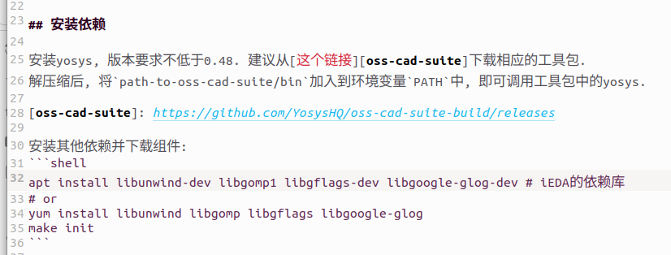
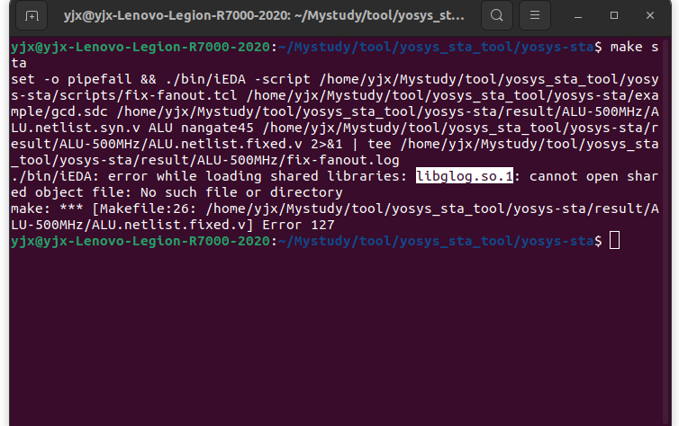
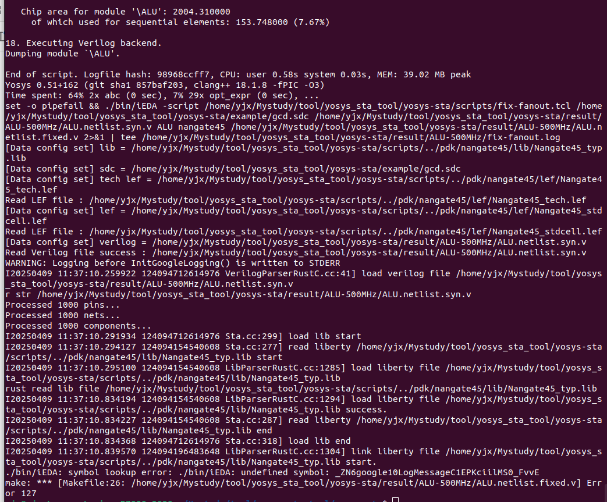
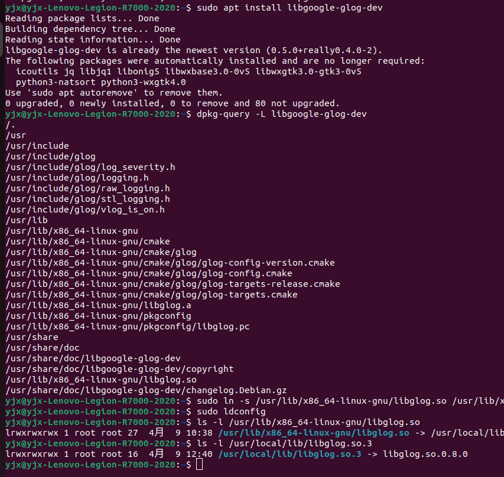

之前我的yosys-sta项目是在其他文件之中，被我删除了，现在我重新从之前的讲义中获取。

要求安装的以及配置的环境我也做了：  



但是遇到了libglog.so.1缺失问题：  

  

而后我从github获得glog，链接了其中libglog.so.3(其中有libglog.so，libglog.so.0.8.0,libglog.so.3) (libglog.so.3 实际也是指向libglog.so.0.8.0)

这是我查看链接的动态：  
```
yjx@yjx-Lenovo-Legion-R7000-2020:~/Mystudy/tool/yosys_sta_tool/yosys-sta$ ldd ./bin/iEDA
	linux-vdso.so.1 (0x00007ffcbc2f6000)
	libgomp.so.1 => /lib/x86_64-linux-gnu/libgomp.so.1 (0x00007c9f1a273000)
	libglog.so.1 => not found
	libunwind.so.8 => /lib/x86_64-linux-gnu/libunwind.so.8 (0x00007c9f1a258000)
	libz.so.1 => /lib/x86_64-linux-gnu/libz.so.1 (0x00007c9f1a23c000)
	libstdc++.so.6 => /lib/x86_64-linux-gnu/libstdc++.so.6 (0x00007c9f18400000)
	libm.so.6 => /lib/x86_64-linux-gnu/libm.so.6 (0x00007c9f18719000)
	libgcc_s.so.1 => /lib/x86_64-linux-gnu/libgcc_s.so.1 (0x00007c9f1a21a000)
	libc.so.6 => /lib/x86_64-linux-gnu/libc.so.6 (0x00007c9f18000000)
	/lib64/ld-linux-x86-64.so.2 (0x00007c9f1a2dc000)
	liblzma.so.5 => /lib/x86_64-linux-gnu/liblzma.so.5 (0x00007c9f1a1ef000)

```  

于是我创建一个符号链接，指向glog的 libglog.so.3：  
```
yjx@yjx-Lenovo-Legion-R7000-2020:~/Mystudy/tool/yosys_sta_tool/yosys-sta$ ldd ./bin/iEDA
	linux-vdso.so.1 (0x00007ffe6e9bc000)
	libgomp.so.1 => /lib/x86_64-linux-gnu/libgomp.so.1 (0x00007a45efe50000)
	libglog.so.1 => /home/yjx/Mystudy/tool/yosys_sta_tool/glog/build/libglog.so.1 (0x00007a45efdbc000)
	libunwind.so.8 => /lib/x86_64-linux-gnu/libunwind.so.8 (0x00007a45ee3e5000)
	libz.so.1 => /lib/x86_64-linux-gnu/libz.so.1 (0x00007a45ee3c9000)
	libstdc++.so.6 => /lib/x86_64-linux-gnu/libstdc++.so.6 (0x00007a45ee000000)
	libm.so.6 => /lib/x86_64-linux-gnu/libm.so.6 (0x00007a45ee2e2000)
	libgcc_s.so.1 => /lib/x86_64-linux-gnu/libgcc_s.so.1 (0x00007a45ee2c2000)
	libc.so.6 => /lib/x86_64-linux-gnu/libc.so.6 (0x00007a45edc00000)
	/lib64/ld-linux-x86-64.so.2 (0x00007a45efeb9000)
	libgflags.so.2.2 => /lib/x86_64-linux-gnu/libgflags.so.2.2 (0x00007a45ee299000)
	liblzma.so.5 => /lib/x86_64-linux-gnu/liblzma.so.5 (0x00007a45ee26e000)
	libpthread.so.0 => /lib/x86_64-linux-gnu/libpthread.so.0 (0x00007a45efdb3000)

```  

然后就是缺失符号了：  

  

```  
./bin/iEDA: symbol lookup error: ./bin/iEDA: undefined symbol: _ZN6google10LogMessageC1EPKciilMS0_FvvE
make: *** [Makefile:26: /home/yjx/Mystudy/tool/yosys_sta_tool/yosys-sta/result/ALU-500MHz/ALU.netlist.fixed.v] Error 127

```  


我在原本的讲义的readme.md中的依赖库，发现其libglog.so也是链接libglog.so.0.8.0,最后make sta的结果也是上面：  


