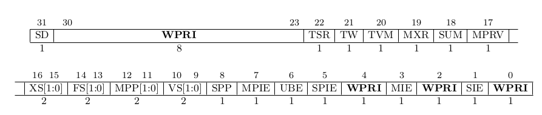
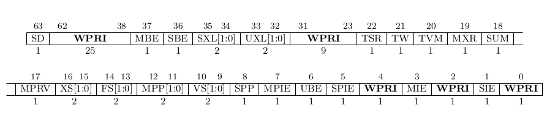
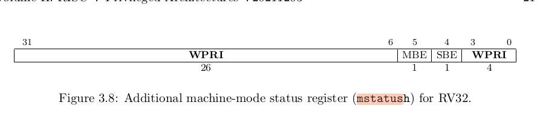

- [pa1](#pa1)
  - [从状态机视角理解程序运行](#从状态机视角理解程序运行)
  - [思考题：谁来指示程序的结束?](#思考题谁来指示程序的结束)
  - [优雅地退出](#优雅地退出)
    - [定位问题](#定位问题)
    - [state.c](#statec)
    - [engine\_start()函数](#engine_start函数)
    - [重新运行，这次输入c然后进行观察](#重新运行这次输入c然后进行观察)
    - [再次运行，这次观察is\_exit\_status\_bad()的变量](#再次运行这次观察is_exit_status_bad的变量)
  - [实现单步执行，打印寄存器，扫描内存](#实现单步执行打印寄存器扫描内存)
    - [解析命令](#解析命令)
      - [readline()](#readline)
      - [strtok()](#strtok)
      - [sscanf()](#sscanf)
    - [单步执行](#单步执行)
    - [打印寄存器](#打印寄存器)
    - [扫描内存](#扫描内存)
  - [正则表达式](#正则表达式)
  - [实现算术表达式](#实现算术表达式)
    - [后缀表达式求值](#后缀表达式求值)
    - [首先实现简单的运算（先不考虑优先级）](#首先实现简单的运算先不考虑优先级)
    - [改进：实现优先级](#改进实现优先级)
    - [实验错误：没有正确处理运算符，导致 expr("1 + 1") 只压入了 1，+ 没有生效。](#实验错误没有正确处理运算符导致-expr1--1-只压入了-1-没有生效)
  - [思考题：表达式生成器如何获得C程序的打印结果?](#思考题表达式生成器如何获得c程序的打印结果)
    - [如何保证表达式进行无符号运算?](#如何保证表达式进行无符号运算)
    - [如何随机插入空格？](#如何随机插入空格)
    - [如何生成长表达式, 同时不会使buf溢出?](#如何生成长表达式-同时不会使buf溢出)
    - [如何过滤求值过程中有除0行为的表达式？](#如何过滤求值过程中有除0行为的表达式)
    - [除0确切行为](#除0确切行为)
  - [实现表达式生成器](#实现表达式生成器)
  - [指针解引用的识别](#指针解引用的识别)
  - [扩展表达式求值的功能](#扩展表达式求值的功能)
    - [实验过程：](#实验过程)
  - [思考题：框架代码中定义wp\_pool等变量的时候使用了关键字static, static在此处的含义是什么? 为什么要在此处使用它?](#思考题框架代码中定义wp_pool等变量的时候使用了关键字static-static在此处的含义是什么-为什么要在此处使用它)
  - [实现监视点池的管理](#实现监视点池的管理)
  - [实现监视点](#实现监视点)
  - [如何阅读手册](#如何阅读手册)
    - [riscv32有哪几种指令格式？](#riscv32有哪几种指令格式)
    - [LUI指令的行为是什么？](#lui指令的行为是什么)
    - [mstatus寄存器的结构是怎么样的？](#mstatus寄存器的结构是怎么样的)
  - [实现统计目录下编写了多少行代码](#实现统计目录下编写了多少行代码)
  - [gcc编译时-Wall和-Werror有什么作用? 为什么要使用-Wall和-Werror?](#gcc编译时-wall和-werror有什么作用-为什么要使用-wall和-werror)


# pa1
## 从状态机视角理解程序运行
要求：以上一小节中1+2+...+100的指令序列为例, 尝试画出这个程序的状态机。  
```
初始状态:       (0,x,x) ->执行mov r1, 0 ->(1,0,x)
初始化r2:       (1,0,x) ->执行mov r2, 0 ->(2,0,0)
第一次循环:     (2,0,0)
            ->执行addi r2,r2,1（r2=1）
            ->(3,0,1)
            ->执行add r1,r1,r2（r1=1）
            ->(4,1,1)
            ->执行blt r2,100,2（r2=1 < 100，跳转到 PC=2）
            ->(2,1,1)

第二次循环:   ->(2,1,1)
            ->执行addi r2,r2,1（r2=2）
            ->(3,1,2)
            ->执行add r1,r1,r2（r1=3）
            ->(4,3,2)
            ->执行blt r2,100,2（r2=2 < 100，跳转到 PC=2）
            ->(2,3,2)

倒数第二次：  ->(2,4950,99)
            ->执行addi r2,r2,1（r2=100）
            ->(3,4950,100)
            ->执行add r1,r1,r2（r1=5050）
            ->(4,5050,100)
            ->执行blt r2,100,2（r2=100 不小于 100，不跳转）
            ->(5,5050,100)

倒数第一次:   ->(5,5050,100)
            ->执行jap 5
            ->(5,5050,100)

```  
## 思考题：谁来指示程序的结束?
程序到了main()函数的返回处后并不会直接结束。atexit() 是 C 语言标准库中的一个函数，它用于在 程序正常终止（如 return 0; 或 exit(0);）时 注册要执行的回调函数。这些回调函数会在程序退出前被调用，通常用于 资源清理、日志记录等操作。返回值：成功（返回0）。失败（返回非零，通常为-1）

## 优雅地退出
题目：为了测试大家是否已经理解框架代码, 我们给大家设置一个练习: 如果在运行NEMU之后直接键入q退出, 你会发现终端输出了一些错误信息. 请分析这个错误信息是什么原因造成的, 然后尝试在NEMU中修复它。  

### 定位问题
运行nemu后,经过输入c后在输入q会正常退出，但是如果什么都不做，直接输入q退出则提示：  
```
make: *** [/home/yjx/ysyx-workbench/nemu/scripts/native.mk:38: run] Error 1
```  

根据提示打开native.mk文件，浏览一番，发现可以直接运行make gdb。进入调试阶段main函数设置断点``` b main```,再输入``` run ```,找到文件src/nemu-main.c并打开查看。有init_monitor(),am_init_monitor()这两个都是初始化监听器函数。engine_start()是启动引擎的函数。  is_exit_status_bad()是检查退出状态的的函数。我想知道这个s_exit_status_bad()是在哪里定义的，于是我进行了搜索，最后在路径：nemu/src/utils/state.c 中找到。根据讲义思考题，问了程序结束的，再加上要如何优雅地退出，初步估计问题出现在is_exit_status_bad()里面。。  

### state.c
进入代码后，我们阅读代码，这里定义了关于退出状态的定义，在is_exit_status_bad()函数里，正常退出有两种情况：1.程序正常退出；2.手动结束。最后正常退出返回0,异常则返回非0. 再了解代码后继续gdb，进入engine_start()函数。  

### engine_start()函数
进入engine_start()函数后我们看到：  
```
32	  engine_start();
(gdb) s
engine_start () at src/engine/interpreter/init.c:20
20	void engine_start() {
```  

根据位置打开init.c文件，我们发现这里声明了void sdb_mainloop()函数，这是调试器主循环函数，处理用户输入的命令。说明如果我输入c或q，将在这个函数进行处理，所以我们进入sdb_mainloop()函数。根据定位``` sdb_mainloop () at src/monitor/sdb/sdb.c:99``` 我们打开sdb.c文件，找到了99行处的这个函数。跳过处理NULL的，到了主循环，这里将不断读取用户输入。我们输入q，随着gdb推进，我们看到了阅读sdb.c文件时的退出条件``` if (cmd_table[i].handler(args) < 0) { return; } //执行命令处理函数，返回值<0则退出 ```。我们进入下一步，观察执行完命令后进入什么部分。  

此时，当完成执行命令后，我们看到：  
```
128	        if (cmd_table[i].handler(args) < 0) { return; }
(gdb) s
cmd_q (args=0x0) at src/monitor/sdb/sdb.c:51
51	static int cmd_q(char *args) {
```  

这里进入同文件的上面部分，我们定位到51行：  
```
static int cmd_q(char *args) {      //退出NEMU
  return -1;                        //返回-1表示需要退出
}
```  

此时对于上面代码略有怀疑，但不确定，只能继续操作，读完后回到main函数，执行is_exit_status_bad().最后结束后返回如下：
```
(gdb) 
[Inferior 1 (process 151698) exited with code 01]
```  
这里提示进程以 退出码 1 结束，而我们在阅读state.c的代码后得知：**正常退出时0,异常退出是非零**，所以我们可以推断出是退出代码出现了问题。观察完整个运行流程后，决定重新运行，这次输入c,进行观察再做决定。

### 重新运行，这次输入c然后进行观察
当我重修运行是，输入c后再输出q，最后给出如下：
```
(gdb) 
[Inferior 1 (process 151774) exited normally]
```  
这时候就是正常退出了，所以可以确定是51行出有问题.回去运行，这次观察is_exit_status_bad()的变量。  

### 再次运行，这次观察is_exit_status_bad()的变量
这次重新运行过后，我们进入s_exit_status_bad(),打印变量值。
```
(gdb) p good
$2 = 0
```  

nemu_state.state == 1，但是good == 0.再结合之前阅读代码，所以可以肯定的就是nemu_state.state == NEMU_QUIT 这个判断失败了。在这之前cmd_q这个代码就是控制退出NEMU的，所以我们对这里进行修改，让good == 1:  
```
//改动
static int cmd_q(char *args) {      //退出NEMU
  nemu_state.state = NEMU_QUIT;     //添加
  return -1;                        //返回-1表示需要退出
}
```  

调试结果,good == 1,并且最后显示正常退出：  
```
(nemu) q
main (argc=<optimized out>, argv=<optimized out>) at src/nemu-main.c:34
34	  return is_exit_status_bad();
(gdb) s
is_exit_status_bad () at src/utils/state.c:20
20	int is_exit_status_bad() {  //判断状态是否异常，以下是正常退出
(gdb) 
21	  int good = (nemu_state.state == NEMU_END && nemu_state.halt_ret == 0) ||  //1.程序正常结束
(gdb) 
23	  return !good; //正常状态返回0,否则返回非零
(gdb) p good
$1 = 1
(gdb) n
__libc_start_call_main (main=main@entry=0x555555556589 <main>, argc=argc@entry=2, argv=argv@entry=0x7fffffffdb18) at ../sysdeps/nptl/libc_start_call_main.h:74
74	../sysdeps/nptl/libc_start_call_main.h: No such file or directory.
(gdb) 
[Inferior 1 (process 155784) exited normally]

```  

最后我们实现了优雅地退出。回过头来总结问题，在我们的cmd_q部分中，没有正确设置 手动退出的代码（nemu_state.state = NEMU_QUIT），导致在cmd_q过后nemu_state.state的值没有得到修改，并在后续的is_exit_status_bad()函数中，错误判断，结果就是good == 0,显示异常退出。

## 实现单步执行，打印寄存器，扫描内存
### 解析命令
#### readline()
readline()用于从终端或文件中读取一行输入的函数。  
**函数原型：** char *readline(const char *prompt);
    *prompt：提示字符串，显示在输入行之前（例如 "Enter a command: "）。  
**返回值：** 返回用户输入的一行字符串（以 \0 结尾）。需要调用者手动释放内存（使用 free()）。

**主要功能：**  
    *1.行编辑：支持光标移动、删除字符、插入字符等编辑操作。提供类似文本编辑器的体验。  
    *2.历史记录：允许用户通过上下箭头键访问之前输入的命令。  
    *3.自动补全：支持自定义自动补全功能（例如文件名、命令名等）。  
    *4.快捷键支持：支持常见的快捷键（如 Ctrl+A 跳到行首，Ctrl+E 跳到行尾等）。

#### strtok()
strtok()用于将字符串分割成多个子字符串（token）。它通过指定的分隔符（delimiters）来分割字符串，并逐个返回每个子字符串。  
**函数原型：** char *strtok(char *str, const char *delimiters);  
    *str：要分割的字符串。第一次调用时传入待分割的字符串，后续调用传入 NULL。  
    *delimiters：分隔符字符串，包含所有可能的分隔字符。  

**工作原理：** 
    **第一次调用** 传入待分割的字符串 str； strtok() 会找到第一个不包含在 delimiters 中的字符作为子字符串的起始位置； 然后找到下一个包含在 delimiters 中的字符，并将其替换为 \0，从而截断子字符串； 返回指向该子字符串的指针。  
    **后续调用** 传入 NULL 作为 str，strtok() 会从上一次分割的位置继续查找下一个子字符串；如果没有更多子字符串，则返回 NULL。  

**返回值：** 返回下一个子字符串（token）的指针。如果没有更多子字符串，则返回 NULL。  

#### sscanf()
sscanf()用于从字符串中按照指定格式提取数据。它的功能类似于 scanf()，但 scanf() 是从标准输入（通常是键盘）读取数据，而 sscanf() 是从一个字符串中读取数据。  
**函数原型：** int sscanf(const char *str, const char *format, ...);
    *str:源字符串，从中提取。  
    *format：格式化字符串，指定如何解析str中的数据。  
    *...:可变参数，用于存储提取的数据。通常是变量的地址。  
**返回值“** 成功时，返回成功匹配并赋值的 **输入项的数量** ； 如果输入失败或到达字符串末尾，则返回 EOF，通常是-1。  
sscanf()需要将解析后的数据存储到变量中，而C语言中函数参数是 **按值传递** 的。如果直接传递变量名，，函数只能获取变量的值而无法修改，因此传递变量的地址（即指针），以便sscanf()能够将解析后的数据写入该地址。  

**注意事项**：  
    *缓冲区溢出：使用 %s 或 %[...] 时，确保目标缓冲区足够大，以避免溢出。  
    *返回值检查：始终检查 sscanf() 的返回值，以确保成功提取了所需的数据。  
    *格式匹配：格式化字符串必须与输入字符串的格式匹配，否则可能导致提取失败。  
    *空格处理：sscanf() 会自动跳过空白字符（空格、制表符、换行符等），除非使用 %c 或 %[...]。  

format 是一个包含格式说明符的字符串，用于指定如何解析 str 中的数据。常见的格式说明符包括：  
| 格式说明符 | 说明                                |
|------------|-------------------------------------|
| `%d`      | 读取一个整数（int）。              |
| `%f`      | 读取一个浮点数（float）。           |
| `%lf`     | 读取一个双精度浮点数（double）。    |
| `%c`      | 读取一个字符（char）。             |
| `%s`      | 读取一个字符串（char[]）。         |
| `%x`      | 读取一个十六进制整数。             |
| `%o`      | 读取一个八进制整数。               |
| `%u`      | 读取一个无符号整数（unsigned int）。|
| `%[...]`  | 读取匹配指定字符集的字符串。       |


### 单步执行
在行动之前，通过cmd_c的部分得知：cpu_exec(-1)会导致CPU一直运行，直到程序结束、中止或外部干预。因为这是无符号整数uint64_t类型的参数，而且-1在无符号整数中会被解释成一个非常大的值，就相当于CPU在执行一个非常大的指令数量2^64 - 1，所以就能一直运行，直到结束、中止或外部干预。 **同时**，我们也跳转到cpu-exec.c文件中阅读源代码，也清除了cpu_exec()会模拟CPU的执行，因此这是单步执行的关键。  

所以思路如下：首先，确认默认值为1； 然后判断命令行是否为空； 若不为空，则进行下一步，使用sscanf()来解析参数，确保参数是一个整数，若解析失败则提示无效参数。 最后若参数正常，符合格式则调用cpu_exec(n)函数，参数为n，以执行n条指令。

**指令在哪里被打印的?**   
我们阅读 cpu_exec.c文件 时便可以得知。在 cpu_exec()函数中会调用execute()函数来执行指令。而在 execute()中又会调用exec_once()执行单跳指令，经过阅读并注释代码，我们发现指令打印的主要部分就位于exec_once()函数中的指令二进制和反汇编输出部分。条件控制则是，只有当 g_print_step 为 true 时（即执行的指令数量小于 MAX_INST_TO_PRINT），才会进行指令打印。输出的内容包括：指令的二进制表示和对应的反汇编代码。  

**实验结果：**  
```
(nemu) is 2
Unknown command 'is'
(nemu) si 2
0x80000000: 00 00 02 97 auipc	t0, 0
0x80000004: 00 02 88 23 sb	zero, 0x10(t0)
```  


### 打印寄存器
阅读讲义得知：框架代码已经为我们准备好了API，只需要执行info r命令时调用isa_reg_display()，在里面直接通过printf()输出所有寄存器的值即可。该reg.c文件有三个定义，分别是：寄存器名称数组，用于映射RISC-V架构的寄存器编号到寄存器名称； isa_reg_display函数用于显示所有寄存器的值； 还有一个暂未实现的sa_reg_str2val，该函数用于将寄存器的名称字符转换为寄存器的值。接着我们找到nemu/src/isa.rescv32/include/isa-def.h头文件中，我们看到了这里定义了一个结构体，用来表RISC-V CPU 的状态，其中gpr是通用寄存器组，大小由MUXDEF宏决定。pc是程序计数器，存储当前指令的地址。  

**阅读头文件：** 首先进入头文件isa.h在这里看到了对isa_reg_display()函数的声明。进入local-include/reg.h文件。我们看到检查寄存器索引是否有效的内链函数：check_reg_idx()， 获取通用寄存器值的宏，其中使用check_reg_idx 检查索引有效值，然后返回cpu.gpr数组中对应的索引值，这是我们打印寄存器所需要的，最后一个是获取寄存器名称的内链函数reg_name()。  

我们根据讲义提示，首先遍历每个寄存器，然后使用printf()输出打印每个寄存器的值：printf("%s = 0x%08x\n", regs[i], cpu.gpr[i]); 然后在打印pc值：printf("pc = 0x%08x\n", cpu.pc);  

**实验结果：**  
```
(nemu) info r
Registers:
$0 = 0x00000000
ra = 0x00000000
sp = 0x00000000
gp = 0x00000000
tp = 0x00000000
t0 = 0x80000000
t1 = 0x00000000
t2 = 0x00000000
s0 = 0x00000000
s1 = 0x00000000
a0 = 0x00000000
a1 = 0x00000000
a2 = 0x00000000
a3 = 0x00000000
a4 = 0x00000000
a5 = 0x00000000
a6 = 0x00000000
a7 = 0x00000000
s2 = 0x00000000
s3 = 0x00000000
s4 = 0x00000000
s5 = 0x00000000
s6 = 0x00000000
s7 = 0x00000000
s8 = 0x00000000
s9 = 0x00000000
s10 = 0x00000000
s11 = 0x00000000
t3 = 0x00000000
t4 = 0x00000000
t5 = 0x00000000
t6 = 0x00000000
```  
由于根据讲义我们的值，后续info还会有子命令的分支选择，于是我们提前准备了cmd_info的提示，为后续打印监视点做一下铺垫。  

### 扫描内存
根据讲义，我们得知扫描内存命令的输出格式是：``` x n(扫描的内存单元数量) start_addr(内存扫描的起始地址)``` ,同时要扫描内存，需要关注内存，我们看到memory目录，有paddr.c（Physical Address物理地址，处理物理地址的读写操作）和vaddr.c(Virtual Address虚拟地址,处理虚拟地址的读写操作)。所以我们可以知道访问客户计算机的内存数据主要就是通过调用vaddr.c中的函数来实现，其中又定义了通过虚拟地址获取指令，返回对应物理地址数据的vaddr_ifetch(),通过虚拟地址读取数据的vaddr_read(),通过虚拟地址写入数据的vaddr_write()。  

确定好需要调用的函数后，处理 扫描内存 的函数就可以先定义变量n用来存储扫描的内存单元，变量start_addr用来存储内存扫描的起始地址， 接着通过sscanf((args, "%d %x", &n, &start_addr) != 2) 这里%d期望读取一个十进制整数并将其存储到变量n中，%x期望读取一个十六进制数并将其存储到 start_addr中，判断错误则出现提示参数格式不正确。 如果正确则打印信息："从地址 0x%x:\n 扫描内存"，最后就是循环扫描指定数量的内存单元，根据讲义所说：使用循环将指定长度的内存数据通过十六进制打印出来。因此我们在循环是根据当前扫描的内存地址，每次扫描4个字节 ``` uint32_t data = vaddr_read(start_addr + i * 4, 4); ``` 这里就调用了我们在vaddr.c文件中看到的vaddr_read()函数通过虚拟地址读取数据data，输出：``` printf("0x%x: 0x%08x\n", start_addr + i * 4, data); ```

**出现错误：**  
```
yjx@yjx-Lenovo-Legion-R7000-2020:~/ysyx-workbench/nemu$ make run
+ CC src/cpu/cpu-exec.c
+ CC src/cpu/difftest/ref.c
+ CC src/cpu/difftest/dut.c
+ CC src/monitor/sdb/watchpoint.c
+ CC src/monitor/sdb/sdb.c
src/monitor/sdb/sdb.c: In function ‘cmd_x’:
src/monitor/sdb/sdb.c:128:21: error: implicit declaration of function ‘vaddr_read’ [-Werror=implicit-function-declaration]
  128 |     uint32_t data = vaddr_read(start_addr + i * 4, 4);  //算当前扫描的内存地址，i 是扫描次数，每次扫描 4 字节
      |                     ^~~~~~~~~~
cc1: all warnings being treated as errors
make: *** [/home/yjx/ysyx-workbench/nemu/scripts/build.mk:34: /home/yjx/ysyx-workbench/nemu/build/obj-riscv32-nemu-interpreter/src/monitor/sdb/sdb.o] Error 1
```  

根据描述，错误：隐式声明函数 ‘vaddr_read’，居然没找到vaddr_read的函数声明或定义。  

解决过程：回顾相关头文件，发现确实没有找到vaddr_read的函数声明，根据vaddr.c我们定位到了在nemu/include/memory中有vaddr.h, paddr.h，因此我们选择在sdb.h中添加： ```#include <memory/vaddr.h>``` （不选择 common.h 是因为我们在 vaddr.h看到了它也有``` #include <common.h>```  ）  

**实验结果：**  
测试x 10 0x80000000  
```
(nemu) x 10 0x80000000
Scanning memory from address 0x80000000:
0x80000000: 0x00000297
0x80000004: 0x00028823
0x80000008: 0x0102c503
0x8000000c: 0x00100073
0x80000010: 0xdeadbeef
0x80000014: 0xbcbcbcbc
0x80000018: 0xbcbcbcbc
0x8000001c: 0xbcbcbcbc
0x80000020: 0xbcbcbcbc
0x80000024: 0xbcbcbcbc
(nemu) 
```  

测试x 10 0x100000  
```
(nemu) x 10 0x100000
Scanning memory from address 0x100000:
address = 0x00100000 is out of bound of pmem [0x80000000, 0x87ffffff] at pc = 0x80000000
$0 = 0x00000000
ra = 0x00000000
sp = 0x00000000
gp = 0x00000000
tp = 0x00000000
t0 = 0x00000000
t1 = 0x00000000
t2 = 0x00000000
s0 = 0x00000000
s1 = 0x00000000
a0 = 0x00000000
a1 = 0x00000000
a2 = 0x00000000
a3 = 0x00000000
a4 = 0x00000000
a5 = 0x00000000
a6 = 0x00000000
a7 = 0x00000000
s2 = 0x00000000
s3 = 0x00000000
s4 = 0x00000000
s5 = 0x00000000
s6 = 0x00000000
s7 = 0x00000000
s8 = 0x00000000
s9 = 0x00000000
s10 = 0x00000000
s11 = 0x00000000
t3 = 0x00000000
t4 = 0x00000000
t5 = 0x00000000
t6 = 0x00000000
[src/cpu/cpu-exec.c:98 statistic] host time spent = 0 us
[src/cpu/cpu-exec.c:99 statistic] total guest instructions = 0
[src/cpu/cpu-exec.c:101 statistic] Finish running in less than 1 us and can not calculate the simulation frequency
riscv32-nemu-interpreter: src/memory/paddr.c:46: out_of_bound: Assertion `0' failed.
make: *** [/home/yjx/ysyx-workbench/nemu/scripts/native.mk:38: run] Aborted (core dumped)
```  
目的是：通过NEMU模拟器扫描内存地址，观察内存访问行为及寄存器状态。，并且使用使用命令 (nemu) x 10 0x100000 扫描内存地址 0x100000。观察模拟器的输出结果，包括内存访问情况、寄存器状态及执行统计信息。  

结果是：地址 0x100000 超出了物理内存范围 [0x80000000, 0x87ffffff]，导致访问失败。错误发生在程序计数器 pc = 0x80000000 处。所有寄存器（如 $0, ra, sp, gp, t0, a0 等）的值均为 0x00000000。  

错误信息：模拟器在 src/memory/paddr.c:46 处触发断言失败，导致程序中止。错误信息为 out_of_bound: Assertion '0' failed。  

结论是：内存访问超出物理内存范围会导致模拟器断言失败，程序中止。寄存器状态未发生变化，表明未执行任何有效指令。超出范围的内存访问会导致程序崩溃。

## 正则表达式
**元字符：**   
| 字符        | 描述                                                                 |
|-------------|----------------------------------------------------------------------|
| `\`         | 将下一个字符标记为一个特殊字符、或一个原义字符、或一个向后引用、或一个八进制转义符。|
| `^`         | 匹配输入字符串的开始位置。如果设置了 RegExp 对象的 Multiline 属性，^ 也匹配 '\n' 或 '\r' 之后的位置。|
| `$`         | 匹配输入字符串的结束位置。如果设置了RegExp 对象的 Multiline 属性，$ 也匹配 '\n' 或 '\r' 之前的位置。|
| `*`         | 匹配前面的子表达式零次或多次。例如，zo* 能匹配 "z" 以及 "zoo"。* 等价于{0,}。|
| `+`         | 匹配前面的子表达式一次或多次。例如，'zo+' 能匹配 "zo" 以及 "zoo"，但不能匹配 "z"。+ 等价于 {1,}。|
| `?`         | 匹配前面的子表达式零次或一次。例如，"do(es)?" 可以匹配 "do" 或 "does" 。? 等价于 {0,1}。|
| `{n}`       | n 是一个非负整数。匹配确定的 n 次。例如，'o{2}' 不能匹配 "Bob" 中的 'o'，但是能匹配 "food" 中的两个 o。|
| `{n,}`      | 至少匹配 n 次。例如，'o{2,}' 不能匹配 "Bob" 中的 'o'，但能匹配 "foooood" 中的所有 o。'o{1,}' 等价于 'o+'。|
| `{n,m}`     | 最少匹配 n 次且最多匹配 m 次。例如，"o{1,3}" 将匹配 "fooooood" 中的前三个 o。|
| `?`         | 匹配模式是非贪婪的。尽可能少的匹配所搜索的字符串，而默认的贪婪模式则尽可能多的匹配所搜索的字符串。|
| `.`         | 匹配除换行符（\n、\r）之外的任何单个字符。要匹配包括 '\n' 在内的任何字符，请使用"(.|\n)"的模式。|
| `(pattern)` | 匹配 pattern 并获取这一匹配。所获取的匹配可以从 Matches 集合得到。|
| `(?:pattern)` | 匹配 pattern 但不获取匹配结果。|
| `(?=pattern)` | 正向肯定预查，匹配 pattern 的字符串开始处匹配查找字符串。|
| `(?!pattern)` | 正向否定预查，匹配不匹配 pattern 的字符串开始处。|
| `(?<=pattern)` | 反向肯定预查，匹配 pattern 的字符串结束处。|
| `(?<!pattern)` | 反向否定预查，匹配不匹配 pattern 的字符串结束处。|
| `x|y`       | 匹配 x 或 y。例如，'z|food' 能匹配 "z" 或 "food"。|
| `[xyz]`     | 字符集合。匹配所包含的任意一个字符。|
| `[^xyz]`    | 负值字符集合。匹配未包含的任意字符。|
| `[a-z]`     | 字符范围。匹配指定范围内的任意字符。|
| `[^a-z]`    | 负值字符范围。匹配任何不在指定范围内的字符。|
| `\b`        | 匹配单词边界，单词和空格之间的位置。|
| `\B`        | 匹配非单词边界。|
| `\cx`       | 匹配由 x 指明的控制字符。|
| `\d`        | 匹配一个数字字符。等价于 [0-9]。|
| `\D`        | 匹配一个非数字字符。等价于 [^0-9]。|
| `\f`        | 匹配一个换页符。等价于 \x0c 和 \cL。|
| `\n`        | 匹配一个换行符。等价于 \x0a 和 \cJ。|
| `\r`        | 匹配一个回车符。等价于 \x0d 和 \cM。|
| `\s`        | 匹配任何空白字符，包括空格、制表符、换页符等。|
| `\S`        | 匹配任何非空白字符。|
| `\t`        | 匹配一个制表符。等价于 \x09 和 \cI。|
| `\v`        | 匹配一个垂直制表符。等价于 \x0b 和 \cK。|
| `\w`        | 匹配字母、数字、下划线。等价于'[A-Za-z0-9_]'。|
| `\W`        | 匹配非字母、数字、下划线。等价于 '[^A-Za-z0-9_]'。|
| `\xn`       | 匹配十六进制转义值 n。|
| `\num`      | 匹配 num 的正整数引用。|
| `\n`        | 标识一个八进制转义值或一个向后引用。|
| `\nm`       | 标识一个八进制转义值或一个向后引用。|
| `\nml`      | 如果 n 为八进制数字 (0-3)，且 m 和 l 均为八进制数字 (0-7)，则匹配八进制转义值 nml。|
| `\un`       | 匹配 n，n 是一个用四个十六进制数字表示的 Unicode 字符。|

**运算优先级：**  
正则表达式从左到右进行计算，并遵循优先级顺序，这与算术表达式非常类似。  

相同优先级的从左到右进行运算，不同优先级的运算先高后低。下表从最高到最低说明了各种正则表达式运算符的优先级顺序：  
| 运算符                         | 描述                                              |
|---------------------------------|---------------------------------------------------|
| `\`                             | 转义符                                            |
| `(), (?:), (?=), []`            | 圆括号和方括号                                    |
| `*, +, ?, {n}, {n,}, {n,m}`     | 限定符                                            |
| `^, $, \任何元字符、任何字符`   | 定位点和序列（即：位置和顺序）                    |
| `|`                             | 替换，"或"操作                                    |
| 字符具有高于替换运算符的优先级  | 使得"m|food"匹配"m"或"food"。若要匹配"mood"或"food"，请使用括号创建子表达式，从而产生"(m|f)ood"。 |

以下是一些常见正则表达式运算符按照优先级从高到低的顺序：  
```
转义符号： \ 是用于转义其他特殊字符的转义符号。它具有最高的优先级。  
    示例：\d、\. 等，其中 \d 匹配数字，\. 匹配点号。  
括号： 圆括号 () 用于创建子表达式，具有高于其他运算符的优先级。  
    示例：(abc)+ 匹配 "abc" 一次或多次。  
量词： 量词指定前面的元素可以重复的次数。  
    示例：a* 匹配零个或多个 "a"。  
字符类： 字符类使用方括号 [] 表示，用于匹配括号内的任意字符。  
    示例：[aeiou] 匹配任何一个元音字母。  
断言： 断言是用于检查字符串中特定位置的条件的元素。  
    示例：^ 表示行的开头，$ 表示行的结尾。  
连接： 连接在没有其他运算符的情况下表示字符之间的简单连接。
    示例：abc 匹配 "abc"。  
管道： 管道符号 | 表示"或"关系，用于在多个模式之间选择一个。
    示例：cat|dog 匹配 "cat" 或 "dog"。  
```  

## 实现算术表达式
### 后缀表达式求值
后缀表达式的特点是将运算符放在操作数的后面。  
**特点：** **1.无括号：** 逆波兰式不需要括号来指定运算顺序，运算符的优先级和结合性通过位置明确。 **2.从左到右计算：** 表达式从左到右扫描，遇到运算符时，对前面的操作数进行运算。 **3.适合栈结构：** 后缀表达式的计算非常适合使用栈（Stack）数据结构来实现。  

伪代码：  
```
while 有输入
    读入下一个符号X
    IF X是一个操作数
        入栈
    ELSE IF X是一个操作符
        有一个先验的表格给出该操作符需要n个参数
        IF堆栈中少于n个操作数
            （错误） 用户没有输入足够的操作数
    Else，n个操作数出栈
    计算操作符。
    将计算所得的值入栈
IF栈内只有一个值
    这个值就是整个计算式的结果
ELSE多于一个值
    （错误） 用户输入了多余的操作数
```  

### 首先实现简单的运算（先不考虑优先级）
通过后缀表达式来实现我们的运算。我对token进行匹配，匹配到操作数就放入操作数栈，匹配到操作符就放入操作符栈。再次匹配到操作数后，弹出操作数栈的两个数和操作符栈的一个运算符进行计算，然后将运算结果压入操作数栈。暂时先不考虑优先级，先确保能够正确实现运算。  

我们首先是定义了两个栈，一个用于存储操作数，另一个用于存储运算符。接着，我们定义了三个变量，操作数栈的栈顶指针，运算符栈的栈顶只占和用于标记计算是否成功。然后，进入计算。  
```
计算流程：
首先遍历输入token：
    逐个读取token：
        如果token是数字（TK_NUM）：
            将其转换为整数并压入 num_stack。
            打印压入的数据。
        如果 token 是运算符（TK_PLUS、TK_MINUS、TK_STAR、TK_SLASH）：

然后我们处理栈内剩余运算符：
    遍历完所有tokens后，处理op_stack中剩余的运算符：
        从num_stack弹出两个操作数，从op_stack弹出一个运算符。
        根据运算符进行计算，并将结果压入num_stack。
        打印计算过程。
```  

实验结果：
```
(nemu) p 1 + 1
尝试匹配规则[0]:  + 在位置 0
尝试匹配规则[1]: == 在位置 0
尝试匹配规则[2]: [0-9]+ 在位置 0
[src/monitor/sdb/expr.c:113 make_token] match rules[2] = "[0-9]+" at position 0 with len 1: 1
尝试匹配规则[0]:  + 在位置 1
[src/monitor/sdb/expr.c:113 make_token] match rules[0] = " +" at position 1 with len 1:  
尝试匹配规则[0]:  + 在位置 2
尝试匹配规则[1]: == 在位置 2
尝试匹配规则[2]: [0-9]+ 在位置 2
尝试匹配规则[3]: \( 在位置 2
尝试匹配规则[4]: \) 在位置 2
尝试匹配规则[5]: \* 在位置 2
尝试匹配规则[6]: / 在位置 2
尝试匹配规则[7]: \+ 在位置 2
[src/monitor/sdb/expr.c:113 make_token] match rules[7] = "\+" at position 2 with len 1: +
尝试匹配规则[0]:  + 在位置 3
[src/monitor/sdb/expr.c:113 make_token] match rules[0] = " +" at position 3 with len 1:  
尝试匹配规则[0]:  + 在位置 4
尝试匹配规则[1]: == 在位置 4
尝试匹配规则[2]: [0-9]+ 在位置 4
[src/monitor/sdb/expr.c:113 make_token] match rules[2] = "[0-9]+" at position 4 with len 1: 1
压入数据: 1
压入数据: 1
计算 1 + 1 = 2
1 + 1 = 2 (0x2)
```  
其他情况也进行了测试，由于在实验过程中，我的printf()较多，因此其他情况我不展示出来了。还没有实现优先级。

### 改进：实现优先级
在之前的成功基础上，我这一次要实现运算的优先级，包括括号也要实现。首先，我定义了两个新函数，priority函数处理运算符优先级判断，还有compute函数用于辅助计算，避免重复。其次，仍然使用两个栈：操作数栈和运算符栈，来计算表达式的值。接着，在入栈操作上，遇到数字时直接压入操作数栈；遇到左括号时压入运算符栈；遇到右括号时弹出运算符并计算，直到遇到左括号。对于一般运算符，我们按优先级处理，确保高优先级运算符先计算。最后，情况栈内剩余的运算符，得到最终结果。如果栈中恰好剩下一个数，则返回结果，否则返回错误。


**实验结果：**  
```
(nemu) p ((2 + 3) * 4 - 8) / (3 - 1)
[src/monitor/sdb/expr.c:111 make_token] match rules[3] = "\(" at position 0 with len 1: (
[src/monitor/sdb/expr.c:111 make_token] match rules[3] = "\(" at position 1 with len 1: (
[src/monitor/sdb/expr.c:111 make_token] match rules[2] = "[0-9]+" at position 2 with len 1: 2
[src/monitor/sdb/expr.c:111 make_token] match rules[0] = " +" at position 3 with len 1:  
[src/monitor/sdb/expr.c:111 make_token] match rules[7] = "\+" at position 4 with len 1: +
[src/monitor/sdb/expr.c:111 make_token] match rules[0] = " +" at position 5 with len 1:  
[src/monitor/sdb/expr.c:111 make_token] match rules[2] = "[0-9]+" at position 6 with len 1: 3
[src/monitor/sdb/expr.c:111 make_token] match rules[4] = "\)" at position 7 with len 1: )
[src/monitor/sdb/expr.c:111 make_token] match rules[0] = " +" at position 8 with len 1:  
[src/monitor/sdb/expr.c:111 make_token] match rules[5] = "\*" at position 9 with len 1: *
[src/monitor/sdb/expr.c:111 make_token] match rules[0] = " +" at position 10 with len 1:  
[src/monitor/sdb/expr.c:111 make_token] match rules[2] = "[0-9]+" at position 11 with len 1: 4
[src/monitor/sdb/expr.c:111 make_token] match rules[0] = " +" at position 12 with len 1:  
[src/monitor/sdb/expr.c:111 make_token] match rules[8] = "-" at position 13 with len 1: -
[src/monitor/sdb/expr.c:111 make_token] match rules[0] = " +" at position 14 with len 1:  
[src/monitor/sdb/expr.c:111 make_token] match rules[2] = "[0-9]+" at position 15 with len 1: 8
[src/monitor/sdb/expr.c:111 make_token] match rules[4] = "\)" at position 16 with len 1: )
[src/monitor/sdb/expr.c:111 make_token] match rules[0] = " +" at position 17 with len 1:  
[src/monitor/sdb/expr.c:111 make_token] match rules[6] = "/" at position 18 with len 1: /
[src/monitor/sdb/expr.c:111 make_token] match rules[0] = " +" at position 19 with len 1:  
[src/monitor/sdb/expr.c:111 make_token] match rules[3] = "\(" at position 20 with len 1: (
[src/monitor/sdb/expr.c:111 make_token] match rules[2] = "[0-9]+" at position 21 with len 1: 3
[src/monitor/sdb/expr.c:111 make_token] match rules[0] = " +" at position 22 with len 1:  
[src/monitor/sdb/expr.c:111 make_token] match rules[8] = "-" at position 23 with len 1: -
[src/monitor/sdb/expr.c:111 make_token] match rules[0] = " +" at position 24 with len 1:  
[src/monitor/sdb/expr.c:111 make_token] match rules[2] = "[0-9]+" at position 25 with len 1: 1
[src/monitor/sdb/expr.c:111 make_token] match rules[4] = "\)" at position 26 with len 1: )
((2 + 3) * 4 - 8) / (3 - 1) = 6 (0x6)

(nemu) p (2 + 3) * (4 - 8) / 2
[src/monitor/sdb/expr.c:111 make_token] match rules[3] = "\(" at position 0 with len 1: (
[src/monitor/sdb/expr.c:111 make_token] match rules[2] = "[0-9]+" at position 1 with len 1: 2
[src/monitor/sdb/expr.c:111 make_token] match rules[0] = " +" at position 2 with len 1:  
[src/monitor/sdb/expr.c:111 make_token] match rules[7] = "\+" at position 3 with len 1: +
[src/monitor/sdb/expr.c:111 make_token] match rules[0] = " +" at position 4 with len 1:  
[src/monitor/sdb/expr.c:111 make_token] match rules[2] = "[0-9]+" at position 5 with len 1: 3
[src/monitor/sdb/expr.c:111 make_token] match rules[4] = "\)" at position 6 with len 1: )
[src/monitor/sdb/expr.c:111 make_token] match rules[0] = " +" at position 7 with len 1:  
[src/monitor/sdb/expr.c:111 make_token] match rules[5] = "\*" at position 8 with len 1: *
[src/monitor/sdb/expr.c:111 make_token] match rules[0] = " +" at position 9 with len 1:  
[src/monitor/sdb/expr.c:111 make_token] match rules[3] = "\(" at position 10 with len 1: (
[src/monitor/sdb/expr.c:111 make_token] match rules[2] = "[0-9]+" at position 11 with len 1: 4
[src/monitor/sdb/expr.c:111 make_token] match rules[0] = " +" at position 12 with len 1:  
[src/monitor/sdb/expr.c:111 make_token] match rules[8] = "-" at position 13 with len 1: -
[src/monitor/sdb/expr.c:111 make_token] match rules[0] = " +" at position 14 with len 1:  
[src/monitor/sdb/expr.c:111 make_token] match rules[2] = "[0-9]+" at position 15 with len 1: 8
[src/monitor/sdb/expr.c:111 make_token] match rules[4] = "\)" at position 16 with len 1: )
[src/monitor/sdb/expr.c:111 make_token] match rules[0] = " +" at position 17 with len 1:  
[src/monitor/sdb/expr.c:111 make_token] match rules[6] = "/" at position 18 with len 1: /
[src/monitor/sdb/expr.c:111 make_token] match rules[0] = " +" at position 19 with len 1:  
[src/monitor/sdb/expr.c:111 make_token] match rules[2] = "[0-9]+" at position 20 with len 1: 2
(2 + 3) * (4 - 8) / 2 = -10 (0xfffffff6)
```  

### 实验错误：没有正确处理运算符，导致 expr("1 + 1") 只压入了 1，+ 没有生效。
发现问题的过程:使用gdb进行调试，在make_token函数在调用regexec时遇到了问题。为了方便排查，在make_token中对e[position]和rules[i].regex 添加了printf().然后根据输出发现在执行expr()表达式时，只有一个数据，所以就报错了。

当时做的时候没注意讲义后面的递归求值，当时苦恼于不知道怎么测试我是否正确，于是我就想着干脆就把sdb.c中的cmd_p实现了，反正运算是调用expr.c中的expr()函数。于是便萌生了用sdb.c的cmd_p来验证我expr()是否正确。既然已经实现了，就先往后用了，如果后续硬性要求使用递归求值，再回过头来完成吧。（尴尬擦汗.JPG）  

## 思考题：表达式生成器如何获得C程序的打印结果?
**把代码中出现的函数，man一遍:**  
**srand()** void srand(unsigned int seed);    这是随机数生成器的一种。  
**sprintf()** int sprintf(char *str, const char *format, ...); 格式化输出转换的一种，将输出写入字符字符串srt。  
**fputs()** int fputs(const char *s, FILE *stream); fputs() 将字符串 s 写入到流中，不包括终止的空字符（'\0'）。  
**fscanf()** int fscanf(FILE *stream, const char *format, ...);fscanf() 从流指针 stream 读取输入。 

**popen** 创建与近程通信的管道流  
```
//摘要

#include <stdio.h>

FILE *popen(const char *command, const char *type);

int pclose(FILE *stream);
```  
popen() 函数通过创建管道、fork 子进程并调用 shell 来打开一个进程。由于管道本质上是单向的，type 参数只能指定读取或写入，而不能同时支持两者。因此，生成的流是只读或只写的。command 参数是一个指向以 NULL 结尾的字符串，包含一个 shell 命令行。该命令会使用 /bin/sh -c 运行，解释工作（如果有的话）由 shell 处理。  type 参数是一个指向 NULL 结尾字符串的指针，必须包含：'r'（读取模式）,'w'（写入模式）.  
返回值：popen()：成功时返回一个可用于读/写的流指针（FILE *）；如果 fork(2) 或 pipe(2) 失败，或者无法分配内存，则返回 NULL。发生错误时，errno 会被设置为相应的错误码。  

**system** 执行shell命令。  
```
//摘要
#include <stdlib.h>

int system(const char *command);
```  
返回值：  
1.如果command为NULL：如果系统提供 shell，则返回非零值； 如果没有可用的 shell，则返回 0。  
2.如果无法创建子进程或获取其状态：返回 -1，并设置 errno 以指示错误原因。  
3.如果子进程无法执行 shell：返回值等同于子进程调用 _exit(2) 并以状态 127 终止。  
4.如果所有系统调用成功：返回值是用于执行 command 的子 shell 的终止状态。 ；（子 shell 的终止状态等于它执行的最后一条命令的终止状态。）  


该代码随机生成表达式并存储在buf中，然后将生成的表达式插入代码模板中，生成一个完整的C程序。接着将生成的c代码写入临时文件/tmp/.code.c， 并编译该C程序，生成可执行文件/tmp/.expr。如果编译成功system接收到返回0的，编译失败接收到非0值,最后执行编译后的程序，并通过fscanf读取其输出结果，打印计算结果和对应的表达式。

### 如何保证表达式进行无符号运算?
第一，在代码模板中定义了unsigned result = %s;  

第二，printf(\"%%u\", result);输出也使用了%u，也会将result解释为无符号整数。  

第三，在gen_num()生成的数组是uint32_t类型。同时在sprintf(num_str, "%u", num); 确保它是无符号格式。  

第四，由于操作数都是无符号整数，锁于整个表达式的计算也是无符号运算。

### 如何随机插入空格？
定义一个函数来生成空格，然后在数字gen_num()随机生成的时候调用这个生成空格函数，一起写入，实现插入空格。  

### 如何生成长表达式, 同时不会使buf溢出?
在生成表达式时检查buf的剩余空间。如果剩余空间足够则继续追加。在 gen_rand_expr()的开始也先检查一次buf。    
**strcat :** char *strcat(char *dest, const char *src);`strcat()` 函数将 `src` 字符串附加到 `dest` 字符串的末尾，覆盖 `dest` 末尾的终止空字符（`\0`），然后添加一个新的终止空字符。两个字符串不能重叠，且 `dest` 字符串必须有足够的空间来存放结果。如果 `dest` 空间不足，程序行为不可预测；缓冲区溢出是攻击安全程序的常见途径。

### 如何过滤求值过程中有除0行为的表达式？
我对于生成过程想到以下方法：1.避免生成数字0； 2.如果选择到了除法，除号确保除数不为0,如果为0重新生成一个非0数字。  

### 除0确切行为
如果生成的表达式中确实有除0行为，编译器会报错或程序崩溃，异常，因为除0是一个未定义的行为。如果真的存在除0行为，可以在main函数中，检查表达式是否有/0行为，如果有就重新生成一个(使用strstr()函数查找‘/0’，找不到返回NULL)。  

通过ai了解：  
**如果除零行为发生：**  
如果由于某种原因（例如代码逻辑错误或随机数生成问题）导致除数为零，那么生成的表达式在编译和执行时会导致除零错误。  
当生成的表达式包含除零行为时，编译后的程序在执行时会触发一个运行时错误（通常是浮点异常或类似的错误），导致程序崩溃。  
由于system编译生成代码，如果生成的代码包含除零行为，编译会成功，但执行时会失败。  
在 popen执行时，如果发生除零错误，popen 会返回一个非零的错误码，程序会跳过本次循环并继续生成下一个表达式。  

**strstr** 查找子字符串  
```
#include <string.h>

char *strstr(const char *haystack, const char *needle);
```  
strstr()函数用于在字符串 haystack 中查找子字符串 needle 的首次出现位置。终止符 \0 不会参与比较。  

返回值：这些函数返回指向找到的子字符串起始位置的指针，如果未找到子字符串，则返回 NULL。  

## 实现表达式生成器
由于我前面实现表达式求值时，直接使用的就是有符号整数进行操作，不会受符号的影响。所以这个表达式生成器我就不用考虑使用unit32_t了，直接使用int。  
截取部分实验结果：
```
从input读取的行:-440 44-(((( 33+ 33))* 88))/11+ 55-11
输入到expr函数的表达式是:44-(((( 33+ 33))* 88))/11+ 55-11
其结果是：-440(与期望结果一致)

从input读取的行:33  33
输入到expr函数的表达式是:33
其结果是：33(与期望结果一致)

从input读取的行:-198 ((((11))))+(( 77))-88- 22-(((( 66+(((((( 11))))))))))- 99
输入到expr函数的表达式是:((((11))))+(( 77))-88- 22-(((( 66+(((((( 11))))))))))- 99
其结果是：-198(与期望结果一致)
```  

为了验证我的nemu的main有没有可能因为某些情况，全都是显示对的，于是我手动在input添加了一个错误值：10 (((((( 66))* 11))))+ 77/ 44/11。能够正常显示错误，运行结果如下：  
```
//原本
从input读取的行:726 (((((( 66))* 11))))+ 77/ 44/11
输入到expr函数的表达式是:(((((( 66))* 11))))+ 77/ 44/11
其结果是：726(与期望结果一致)

//手动添加
从input读取的行:10 (((((( 66))* 11))))+ 77/ 44/11
输入到expr函数的表达式是:(((((( 66))* 11))))+ 77/ 44/11
其结果是：726(与期望结果 10 不一致)
```  

**有一些意外：**
在使用表达式生成器生成的时候，有时候会提示超过int型的最大值导致溢出（因为乘法导致的），每次溢出也会是相同的数，所以我直接没有理会，也当作一个“正确的用例”来测试表达式。  

**遇到的错误：**  
在实现完表达式生成器后，用NEMU的main()函数读入input文件中表达式后，直接调用expr()的过程出现了问题：无法正确解析输入文件中的表达式，不够完整。导致后续出现错误。在man sscanf中看到：例如，[^]0-9-] 表示集合“除了闭括号、零到九和连字符之外的所有字符”，根据描述，使用%1023[^\n]，匹配除了\n，从而保证能够正确的提取出完整的表达式。  


## 指针解引用的识别
解引用是指通过指针访问它所指向的内存地址上的值。当你解引用一个指针时，你获取的是该指针指向位置的数据，而不是指针本身的值。  

如果'*'的左侧是一个表达式（如变量、常量或其他运算符的结果），则 ‘ * ’ 是乘法运算符。  
如果'*'的左侧没有表达式（ * 是表达式的开头），则 * 是解引用操作。  
```
//根据讲义完成剩下的
if (tokens[i].type == '*' && (i == 0 || tokens[i - 1].type == TK_LPAREN || 
          tokens[i - 1].type == TK_PLUS || tokens[i - 1].type == TK_MINUS ||
          tokens[i - 1].type == TK_STAR || tokens[i - 1].type == TK_SLASH)) {
      tokens[i].type = DEREF;
          }
```  

##  扩展表达式求值的功能
这里我拓展了位运算：按位非，按位与，按位异或，按位或。<=. ==和&&.还有十六进制数的处理，寄存器等。  

**snprintf()**  
```  
 int snprintf(char *str, size_t size, const char *format, ...)
```  
char * 类型的str（目标缓冲区）负责接收格式化后的内容，包括'\0'， size_t类型的size是目标缓冲区的大小，即str可以容纳的最大字节数。它包括'\0\所以实际字符数要加一。 const char * 类型的format是格式化字符串。指定如何格式化后续参数。 ...（可变参数）这里是一个可变参数列表，用于传递需要格式化的值。

### 实验过程：
**错误：**  
1.没有区分好一元运算符和二元运算符，导致无法实现解引用和按位取反。  
解决：在expr()函数中通过条件语句来区分。  

2.未能正确识别解引用。  
原因：通过GDB调试，发现在匹配时，虽然能正确识别出' * '是解引用的类型，但是str字段没有存储与 *匹配的字符内容。这通常意味着在处理 *时,字符串部分没有被正确填充。  
```
//输入了p *1

[src/monitor/sdb/expr.c:124 make_token] match rules[7] = "\*" at position 0 with len 1: *
127	        position += substr_len; //移动解析位置
(gdb) 
134	        switch (rules[i].token_type) {
(gdb) s
146	            if (nr_token == 0 || 
(gdb) n
156	            tokens[nr_token].type = DEREF;
(gdb) s
157	            break;
(gdb) 
188	    if (i == NR_REGEX) {        //没有任何规则匹配
(gdb) 
115	  while (e[position] != '\0') { //遍历整个输入的字符串
//----------
(gdb) p tokens[0]
$12 = {type = 268, str = '\000' <repeats 31 times>}
//----------
(gdb) p tokens
$15 = {{type = 258, str = "1", '\000' <repeats 30 times>}, {type = 0, 
    str = '\000' <repeats 31 times>} <repeats 1023 times>}
(gdb) p tokens[0]
$16 = {type = 258, str = "1", '\000' <repeats 30 times>}
(gdb) p tokens[1]
$17 = {type = 0, str = '\000' <repeats 31 times>}

```  

修改了make_token()函数部分，再一次进入调试：  
```
(gdb) p tokens
$1 = {{type = 268, str = "*", '\000' <repeats 30 times>}, {type = 258, 
    str = "1", '\000' <repeats 30 times>}, {type = 0, 
    str = '\000' <repeats 31 times>} <repeats 1022 times>}
```  
能够看到tokens有我们想要的数据。但后续继续执行到执行解引用的用法时,无法解析地址导致的段错误.  
**后续解决：** 在添加 vaddr_read 函数的调用后，解决了访问无效地址导致的程序崩溃问题。通过该函数，确保了只有有效地址才能被访问和解引用。确认内存地址有效后，使用调试命令 p *0x80000000 成功读取该地址的内容，并显示了正确的值（0x00000297）。

## 思考题：框架代码中定义wp_pool等变量的时候使用了关键字static, static在此处的含义是什么? 为什么要在此处使用它?  
使用static修饰全局变量可以有效地隐藏这些变量，防止其他文件意外地修改或访问它们。这有助于实现封装和信息隐藏，避免命名冲突，并提高代码的模块化程度。同时，使用static修饰函数可以限制函数的可见性，防止其他文件调用这些函数。这有助于隐藏实现细节，避免函数名冲突，并提高代码的模块化程度。在代码中使用static关键字是为了限制变量和函数的作用域。  


## 实现监视点池的管理
完善了这两个函数：  
```
WP* new_wp();
void free_wp(WP *wp);
```  
实验思路：  
1.WP* new_wp(); 首先，检查空闲链表free_是否为空，如果没有空闲监视点则调用assert(0)终止程序。然后，从空闲链表free_中去出头节点newwp，更新free_指针指向下一个空闲监视点。接着，把取出来的newwp插入到激活链表head中的头部，更新head指针指向newwp。最后，成功返回监视点。    

2.void free_wp(WP *wp); 首先，检查wp是否为空，为空直接返回。然后，从激活链表中移除wp需要先进行判断：如果wp是head节点，直接更新head指针指向head的下一个；否则，遍历激活链表找到wp的前一个节点prev，并更新前一个节点prev指向wp的下一个，从而实现wp的移除。最后将wp插入空闲链表free_的头部，并更新free_。  


## 实现监视点
首先我们扩充监视点结构体的成员，添加：表达式字符串``` char *expr ``` 和  表达式当前值``` word_t value ```。  

根据讲义要求，我们需要检查所有已设置的监视点，判断监视点的值是否变化。如果监视点发生变化或表达式求值失败，函数会输出相关信息，并暂停NEMU的运行。于是我在watchpoint.c文件中添加了一个函数check_wp()用于检查监视点，遍历监视点链表，然后使用expr函数进行表达式求值，比较当前值和旧值，判断是否发生变化，如果表达式求值失败则输出错误信息并标记错误状态。如果监视点触发或发生错误则暂停NEMU运行。  

我们将头指针的定义使用了static，这里表示他们的作用域仅限于当前文件，而不会被其他文件访问或修改。这带来一下好处：1.封装性，防止外部模块直接访问head和free_，强制所有操作都通过提供的API(new_wo(),free_wp())进行，确保数据结构的完整性。 2.避免命名冲突，如果其他文件也定义了想通名字的head或free_，不会与该文件中的变量冲突。  
为了访问head，我设置了一个函数get_head()用来获取head变量。  

回到sdb.c。我们添加 设置监视点 的命令w (cmd_w)。先进行了用户输入格式的判断。然后通过new_wp()函数申请一个新的监视点wp并且将求值后的value传递给wp的value存储，将表达式的字符串复制给wp的expr存储，然后输出信息。  
添加了删除 监视点 的命令d(cmd_d)。首先检查格式是否正确，然后解析监视点编号并遍历查找要删除的监视点编号，调用free_wp函数删除监视点。  

在cpu-exec.c中的trace_and_difftest添加新的宏CONFIG_WATCHPOINT把检查监视点的代码包起来：``` IFDEF(CONFIG_WATCHPOINT, check_wp()); ``` 。并在Kconfig中的``` menu "Testing and Debugging" ``` 下方添加，用来开关是否开启监视点功能：  
```
config WATCHPOINT
  bool "Enable warchpoint support"
  default y
  help
    Enable watchpoint support in NEMU. This allows you to monitor changes to specific expressions.
    Disable this option to improve performance if watchporints are not needed.
```  

## 如何阅读手册
### riscv32有哪几种指令格式？
首先，在阅读器搜索： Instruction Formats，根据目录我找到了：  
```
2.2 Base Instruction Formats

```  
定位过去后，阅读得知：在riscv32中有4种核心指令格式：R型，I型，S型，U型。这些指令长度固定32位。  

### LUI指令的行为是什么？
通过阅读器搜索LUI，我们看到在27页，有这么一段定义：LUI（加载上半部分立即数）用于构建 32 位常数，使用 U 型指令格式。LUI 指令将 32 位的 U 型立即数值加载到目标寄存器 rd 中，并将最低的 12 位填充为零。（这里位于2.4.2整数寄存器-寄存器操作）  
在40页有这么一段定义：LUI（加载上半部分立即数）使用与 RV32I 相同的操作码。LUI 将 32 位 U 型立即数加载到寄存器 rd 中，并将最低的 12 位填充为零。然后，32 位的结果会进行符号扩展，扩展为 64 位。（这里位于4.2. 整数计算指令）  

### mstatus寄存器的结构是怎么样的？
在第一卷没有搜索到想要的，于是在第二卷搜索，找到了：3.1.6Machine Status Registers (mstatus and mstatush) 3.1.6机器状态寄存器 (mstatus 和 mstatush)。  

我们定位过去看到：  
mstatus 寄存器是一个 MXLEN 位的读/写寄存器，格式如图 3.6 所示（RV32）和图 3.7 所示（RV64）。mstatus 寄存器用于跟踪和控制 hart 当前的操作状态。mstatus 的受限视图作为 sstatus 寄存器出现在 S 级 ISA 中。  
  
图3.6 RV32 的机器模式状态寄存器 (mstatus)。  

  
图 3.7：RV64 的机器模式状态寄存器 (mstatus)。  

仅对于 RV32，mstatush 是一个 32 位的读写寄存器，格式如图 3.8 所示。mstatush 的第 30 位到第 4 位通常包含与 RV64 中 mstatus 的第 62 位到第 36 位相同的字段。字段 SD、SXL 和 UXL 在 mstatush 中不存在。  

  
图 3.8：RV32 的附加机器模式状态寄存器 (mstatush)。  

## 实现统计目录下编写了多少行代码
根据查找，我们知道在shell命令行中，xargs cat 是将find命令输出的文件内容合并起来输出，然后通过wc -l 进行统计，-l是显示行数。  

```
//包括空行：  
count:
    @find $(NEMU_HOME) -type f \( -name "*.c" -o -name "*.h" \) | xargs cat | wc -l

//不包括空行：
count-nonempty:
	@find $(NEMU_HOME) -type f \( -name "*.c" -o -name "*.h" \) | xargs cat | grep -v '^\s*$$' | wc -l

```  

## gcc编译时-Wall和-Werror有什么作用? 为什么要使用-Wall和-Werror?
-Wall 显示了所有的警告。例如未使用的变量、未初始化的变量、类型不匹配等。  
-Werror 是将所有编辑警告提升为错误，导致编译失败。  
这两组组合使用：  
1.提高代码质量。  
2.减少调试时间在编译阶段发现问题比在运行时发现问题更容易调试。   
3.强制代码规范，-Werror 强制开发者遵循严格的代码规范，避免警告被忽视。 4.提高代码可维护性，通过解决所有警告，代码变得更加清晰和易于维护。  
