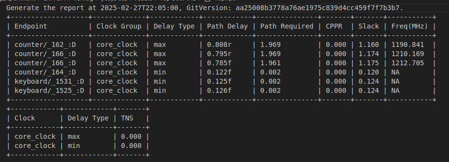
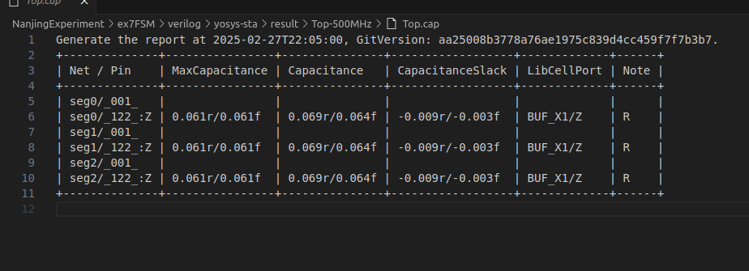
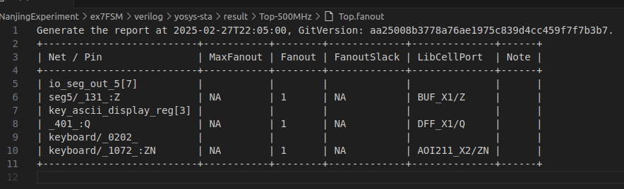
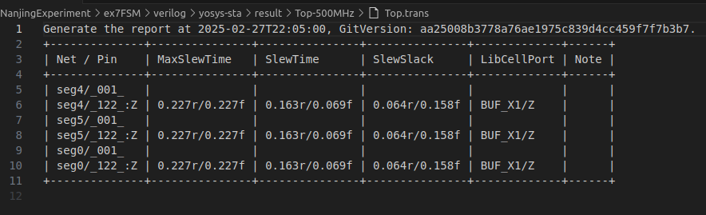
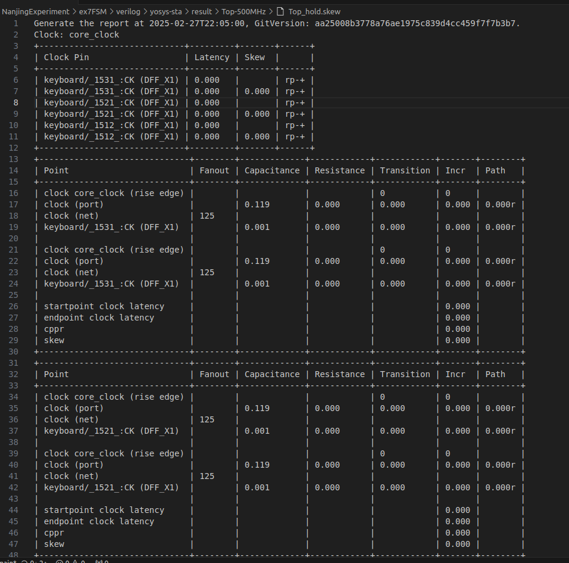

- [学习如何评估电路综合后的时序（用自己的ex7ps2尝试做例子）](#学习如何评估电路综合后的时序用自己的ex7ps2尝试做例子)
  - [查看.rpt文件报告 （WNS,TNS 和时序路径）](#查看rpt文件报告-wnstns-和时序路径)
    - [WNS部分(Worst Negative Slack 最差负裕量)](#wns部分worst-negative-slack-最差负裕量)
    - [TNS部分(Total Negative Slack 时钟时序裕量)](#tns部分total-negative-slack-时钟时序裕量)
    - [iSTA时序报告详细路径Arrival Time和Require Time部分](#ista时序报告详细路径arrival-time和require-time部分)
  - [查看.cap文件报告（报告违例电容）](#查看cap文件报告报告违例电容)
  - [查看.fanout文件报告（报告违例扇出）](#查看fanout文件报告报告违例扇出)
  - [查看.trans文件报告（报告违例转换时间）](#查看trans文件报告报告违例转换时间)
  - [查看.skew文件报告（报告setup/hold模式下的时钟偏斜）](#查看skew文件报告报告setuphold模式下的时钟偏斜)
    - [ps2\_top\_setup.skew](#ps2_top_setupskew)
- [尝试给使用chisel代码生成的电路进行评估](#尝试给使用chisel代码生成的电路进行评估)
  - [查看.rpt文件报告（WNS,TNS 和时序路径）](#查看rpt文件报告wnstns-和时序路径)
  - [查看.cap文件报告（报告违例电容）](#查看cap文件报告报告违例电容-1)
  - [查看.fanout文件报告（报告违例扇出）](#查看fanout文件报告报告违例扇出-1)
  - [查看.trans文件报告（报告违例转换时间）](#查看trans文件报告报告违例转换时间-1)
  - [查看.skew文件报告（报告setup/hold模式下的时钟偏斜）](#查看skew文件报告报告setuphold模式下的时钟偏斜-1)


# 学习如何评估电路综合后的时序（用自己的ex7ps2尝试做例子）
## 查看.rpt文件报告 （WNS,TNS 和时序路径）
### WNS部分(Worst Negative Slack 最差负裕量)
根据教程所说，报告的最开始显示的路径是WNS（Worst Negative Slack 最差负裕量，表示最严重的时序违例值）路径。默认max(Setup)/min(Hold)分别显示三条。  


| Endpoint           | Clock Group | Delay Type | Path Delay | Path Required | CPPR  | Slack | Freq (MHz) |
|--------------------|-------------|------------|------------|---------------|-------|-------|------------|
| ```u1_ps2_dsh/_102_:D``` | core_clock  | max        | 0.660r     | 1.967         | 0.000 | 1.307 | 1442.945   |
| ```u1_ps2_dsh/_100_:D``` | core_clock  | max        | 0.660r     | 1.967         | 0.000 | 1.307 | 1442.945   |
| ```u1_ps2_dsh/_098_:D``` | core_clock  | max        | 0.660r     | 1.967         | 0.000 | 1.307 | 1442.945   |
| ```u0_ps2_kb/_1062_:D``` | core_clock  | min        | 0.079f     | 0.002         | 0.000 | 0.078 | NA         |
| ```u0_ps2_kb/_1063_:D``` | core_clock  | min        | 0.079f     | 0.002         | 0.000 | 0.078 | NA         |
| ```_265_:D ```           | core_clock  | min        | 0.081f     | 0.003         | 0.000 | 0.079 | NA         |

**字段的解释：**  
* Endpoint：终点，即时序路径的终点寄存器（触发器）。通常格式为 ```模块名/寄存器名:D```，表示寄存器的 D 触发器输入端。
* Clock Group: 该路径所属的时钟域（时钟组）。这里都是 core_clock，说明这些路径的时钟信号来源相同。
* Delay Type: 延迟类型：max（最大路径延迟，用于检查建立时间）或 min（最小路径延迟，用于检查保持时间）。
* Path Delay: 当前路径的传播延迟，以纳秒（ns）为单位。 r 表示上升沿触发，f 表示下降沿触发。
* Path Required: 需求路径（Path Required），即时序约束要求的最大延迟。
* CPPR: 时钟路径推测去除（Clock Path Pessimism Removal），影响延迟计算的一种优化。
* Slack: 时序裕量，计算方式：Slack = Path Required - Path Delay，若 Slack < 0，则表示时序违例。
* Freq (MHz): 该路径的理论最大工作频率。对于 min 类型路径（保持时间检查），通常不计算频率，所以显示 NA。

**从数据来看：**  
1. max(Setup)最大延迟检查  
   * Endpoint 终点:  ```u1_ps2_dsh/_102_:D```, ```u1_ps2_dsh/_100_:D```, ```u1_ps2_dsh/_098_:D```
   * Path Delay 路径延迟:0.600ns, Path Required 需求路径:1.967ns, Slack 裕量:1.307ns (Slack > 0，表示时序满足要求)。
   * Freq(MHz) 理论最大工作频率:1442.945MHz，表示该路径可以支持高达 1.4GHz 的时钟速度。
2. min(Hold)最小延迟检查
   * Endpoint 终点: ```u0_ps2_kb/_1062_:D```, ```u0_ps2_kb/_1063_:D```, ```_265_:D ```
   * Path Delay 路径延迟:0.079ns, Path Required 需求路径:0.002ns, Slack 裕量:0.078 ns（Slack > 0，时序满足要求）。
   * Freq (MHz)为 NA，因为最小路径延迟检查与最大工作频率无关。

### TNS部分(Total Negative Slack 时钟时序裕量)

| Clock      | Delay Type | TNS   |
|------------|------------|-------|
| core_clock | max        | 0.000 |
| core_clock | min        | 0.000 |

**字段解释：**  
* clock： 时钟信号名称，这里是 core_clock，说明它是分析的主要时钟域。
* Delay Type：时序分析类型：max（建立时间分析）或 min（保持时间分析）。
* TNS (Total Negative Slack)：总负裕量。如果为 0.000，表示当前没有任何时序违例（没有负 Slack）。

**从数据来看：**  
* 这里TNS=0.000, 表示设计在core_clock这个时钟域中，即没有建立时间违例（max）也没有 保持时间违例（min）。  
* 如果TNS是负数，说明多个路径的Slack小于0,导致总负裕量不满足时序约束。
* TNS越小（越接近0），时序越健康，负TNS需要优化逻辑或调整时钟约束。

### iSTA时序报告详细路径Arrival Time和Require Time部分
后面开始是每个路径的详细报告。时序路径的报告部分，主要包含Arrival Time 和Require Time，以及报告的slack三部分。 Arrival Time和Require Time的分为Point、Fanout、Capacitance、 Resistance、Transition、Delta Delay、Incr、Path列。  

这是每个详细路径的一些参数（最上方）。
| Point                                        | Fanout | Capacitance | Resistance | Transition | Delta Delay | Incr   | Path            |
|----------------------------------------------|--------|-------------|------------|------------|-------------|--------|-----------------|  

**下面将进行解释：**  
* Point: 信号传播的关键点，可能是端口（port）、寄存器（DFF）、缓冲器（BUF）、门（AND、OR等），或是网络（net）等。
* Fanout: 该节点的扇出数（Fanout），即该信号驱动多少个后续逻辑单元。较大的扇出会影响延迟和信号完整性。
* Capacitance: 该点的电容负载（单位：法拉 F）。较大的电容会导致信号转换速度变慢。（教程描述：驱动是包含线上和负载Pin电容，负载则只有Pin电容）
* Resistance： 该点的等效电阻（单位：欧姆 Ω），一般用于计算 RC 延迟。（教程描述：线上的电阻）
* Transition：该点的信号转换时间（Transition Time，单位：秒 s），表示从 0 变 1（上升）或从 1 变 0（下降）所需的时间。转换时间长可能会影响时序裕量（slack）。（教程描述：信号翻转时间）
* Delta Delay：增量延迟（单位：秒 s），表示该节点相对前一个节点的延迟变化。如果某个缓冲器（BUF）减少了延迟，该值可能是负的。（教程描述：噪声引起的延时）
* Incr： 该点相对前一个点的累计增量延迟，即从信号源到该点的传播延迟之和。（教程描述：cell或者net delay）
* Path: 该点的路径延迟，通常用于计算路径的关键路径延迟，以确定是否会影响时钟约束。(教程描述：路径延时，r表示上升信号，f表示下降信号)

上面表示到达时间Arrival Time， 下面表示需要时间Require TIme。（会看到有两个clk(port)）  

**在最下方：**
* path cell delay: 单元延迟（单位：秒 s），表示数据路径中所有逻辑单元（如门、寄存器、缓冲器）的总延迟。在例子里是 0.660s，占 100%（说明全部延迟来自单元，网延迟为 0）。
* path net delay: 网络延迟（单位：秒 s），表示信号在线路（wire/net）上的传播延迟。在例子里是 0.000s（0%），说明这个路径的延迟完全来自逻辑单元，而非连线。  

**iSTA时序报告详细路径Slack部分:**  
slack报告：  
* data require time: 数据要求到达时间（单位：秒 s），表示数据必须到达的时间点（通常由时钟约束决定）。在你的例子里是 1.967s，表示该数据必须在 1.967s 内到达，否则会发生时序违例。
* data arrival time: 数据实际到达时间（单位：秒 s），表示数据从起点出发，到达终点所需的时间。在你的例子里是 0.660s，表示数据传播花费了 0.660s。
* slack (MET): 时序裕量（Slack），计算公式：data require time - data arrival time > 0说明时序满足（MET, Met Timing），即数据按时到达，没有时序违例（timing violation）。

**关于point这一列的排序：**  
在Point这一列中，从上到下的排序并不是随机的，它表示的是信号从时钟源到目标位置（如寄存器、逻辑单元等）在时序路径中的顺序。具体来说，这个列的排序是反映时序路径中 **信号传播的顺序** ，从输入信号到最终的时序检查点。  

## 查看.cap文件报告（报告违例电容）
  

| **Net / Pin**      | **MaxCapacitance**  | **Capacitance**     | **CapacitanceSlack**   | **LibCellPort** | **Note** |
|--------------------|---------------------|---------------------|------------------------|-----------------|----------|
| u3_seg_h_0/_31_    |                     |                     |                        |                 |          |
| u3_seg_h_0/_84_:Z  | 0.061r/0.061f        | 0.061r/0.055f        | -0.000r/0.006f          | BUF_X1/Z        | R        |
| u4_seg_h_1/_31_    |                     |                     |                        |                 |          |
| u4_seg_h_1/_84_:Z  | 0.061r/0.061f        | 0.061r/0.055f        | -0.000r/0.006f          | BUF_X1/Z        | R        |
| u5_seg_h_2/_31_    |                     |                     |                        |                 |          |
| u5_seg_h_2/_84_:Z  | 0.061r/0.061f        | 0.061r/0.055f        | -0.000r/0.006f          | BUF_X1/Z        | R        |  


**根据教程，上面每个参数的解释如下：**  
* Net/ Pin: 所在Net和对应Pin， 列出电路中信号传输的各个节点或引脚。
* MaxCapacitance： 最大电容要求， 分为上升沿（r）和下降沿（f）。它告诉我们信号传输路径中，最大可以承受的电容负载。
* Capacitance： 当前实际电容（分为r为rise，f为fall）， 分为上升沿（r）和下降沿（f），表示当前路径上信号的实际负载电容。
* CapacitanceSlack： 余量， 电容裕量，表示最大电容与实际电容之间的差值。若为负值，表示电容超过最大限制，可能会影响电路性能。
* LibCellPort： Pin对应liberty里面的port名，表示与标准单元端口的连接。
* Note：附加的备注，可能指示某个路径的特殊性或重要性，例如"R"可能表示该路径是关键路径。

从这一组数据来看，当前实际电容的上升沿都达到了最大值，而下降沿还有裕量0.006。对于上升沿，如果信号传输的电容稍微增加，可能会导致时序延迟或电路无法按预期工作。


## 查看.fanout文件报告（报告违例扇出）
Fanout报告和电容报告类似，包含Net/Pin列、MaxFanout、Fanout、FanoutSlack、LibCellPort列。  

| Net / Pin          | MaxFanout | Fanout | FanoutSlack | LibCellPort | Note |
|--------------------|-----------|--------|-------------|-------------|------|
| fanout_net_28      |           |        |             |             |      |
| fanout_buf_28:Z    | NA        | 30     | NA          | BUF_X8/Z    |      |
| fanout_net_21      |           |        |             |             |      |
| fanout_buf_21:Z    | NA        | 30     | NA          | BUF_X8/Z    |      |
| u0_ps2_kb/_0080_   |           |        |             |             |      |
| u0_ps2_kb/_0807_:Z | NA        | 1      | NA          | BUF_X1/Z    |      |

以下是对每个参数进行解释：  
* Net / Pin： 指的是网络或引脚的名称。网络是电路中信号的传输路径，而引脚是芯片或模块中的接口。每个路径上可能包含多个网络和引脚。
* MaxFanout： 最大扇出，是指一个输出信号可以驱动的最大输入数量。NA表示没有给出特定的最大扇出值，可能是没有相关限制或这部分数据未填写。
* Fanout： 扇出，指一个信号的输出能够驱动多少个其他电路的输入。例如，fanout_buf_28:Z 和 fanout_buf_21:Z 的扇出值是 30，意味着这两个路径的信号可以驱动最多 30 个输入。u0_ps2_kb/_0807_:Z 的扇出为 1，意味着它只驱动一个输入。
* FanoutSlack： 扇出裕量，表示当前扇出与最大扇出之间的差距。如果没有相关数据，通常会显示为 NA（未定义）。在这个表格中，所有路径的 FanoutSlack 都是 NA，意味着没有提供这个信息或不适用。
* LibCellPort： 这个列标示了使用的库单元端口类型。在这里，BUF_X8/Z 和 BUF_X1/Z 表示的是缓冲器单元，其中 BUF_X8/Z 是一个 8 倍增益的缓冲器，BUF_X1/Z 是一个 1 倍增益的缓冲器。Z 表示端口的输出端。
* Note：一些额外的注释或说明信息。在这个表格中，Note 列为空。

从这一组数据来看，所有路径的扇出都比较高，表明这些信号要驱动大量的输入。扇出的数量会影响信号的完整性和时序，较高的扇出可能导致信号衰减，需要缓冲器来增强驱动能力。  

## 查看.trans文件报告（报告违例转换时间）  

| Net / Pin          | MaxSlewTime   | SlewTime      | SlewSlack     | LibCellPort | Note |
|--------------------|---------------|---------------|---------------|-------------|------|
| u3_seg_h_0/_31_    |               |               |               |             |      |
| u3_seg_h_0/_43_:A1 | 0.227r/0.227f | 0.142r/0.061f | 0.085r/0.166f | NOR2_X4/A1  |      |
| u3_seg_h_0/_31_    |               |               |               |             |      |
| u3_seg_h_0/_50_:A  | 0.227r/0.227f | 0.142r/0.061f | 0.085r/0.166f | INV_X32/A   |      |
| u5_seg_h_2/_31_    |               |               |               |             |      |
| u5_seg_h_2/_65_:A3 | 0.227r/0.227f | 0.142r/0.061f | 0.085r/0.166f | NAND3_X1/A3 |      |

以下是对每个参数进行解释：
* Net / Pin： 这个列指示信号路径或引脚的名称。这些信号路径包括各个模块或芯片中的连接和引脚，通常是电路中的信息流通路径。
* MaxSlewTime： 最大变化时间（Slew Time），表示一个信号从一个电平变到另一个电平所需要的最大时间。这里的“r” 和 “f” 分别指的是上升沿（r）和下降沿（f）的变化时间。例如 0.227r/0.227f 表示上升沿和下降沿的最大变化时间都是 0.227 纳秒。
* SlewTime：实际的变化时间（Slew Time），指信号的上升沿或下降沿的实际延时。类似于最大变化时间，它可以根据具体情况有所不同，0.142r/0.061f 表示上升沿为 0.142 纳秒，下降沿为 0.061 纳秒。
* SlewSlack： 变化时间裕量（Slew Slack），表示实际变化时间与最大变化时间之间的差值。它通常是为了分析信号的变化是否符合设计要求。例如，0.085r/0.166f 表示上升沿和下降沿的变化时间裕量，分别为 0.085 纳秒和 0.166 纳秒。
* LibCellPort：该列描述使用的库单元和端口类型。在这些数据中：NOR2_X4/A1 表示使用的是一个 NOR2 类型的逻辑门（2输入的与非门），并且端口是 A1。INV_X32/A 表示使用的是一个 INV 类型的反相器（32倍增益），并且端口是 A。NAND3_X1/A3 表示使用的是一个 NAND3 类型的与非门（三输入），并且端口是 A3。
* Note：注释栏，在这里没有提供任何注释。  

从这一组数据中可以看出：信号的转换时间都低于最大变化时间，表明信号转换速度满足设计需求。slewslack是正数，说明设计中没有出现信号变化时间不够的情况。  

## 查看.skew文件报告（报告setup/hold模式下的时钟偏斜）
教程描述：skew报告类似于时钟路径报告，skew是时钟到达两个时钟Pin的差值，两个时钟Pin分别为发射时钟和接收时钟的Pin，两两构成一个时序路径。skew报告分为三部分发射时钟Pin的latency（延时）,接收时钟Pin的latency（延时）.  

### ps2_top_setup.skew
Clock: core_clock: 所属时钟  
| Clock Pin                     | Latency | Skew  |      |
|-------------------------------|---------|-------|------|
| u0_ps2_kb/_1043_:CK (DFF_X1)  | 0.000   |       | rp-+ |
| u2_ps2_cer/_133_:CK (DFFR_X1) | 0.000   | 0.000 | rp-+ |
| u0_ps2_kb/_1043_:CK (DFF_X1)  | 0.000   |       | rp-+ |
| u2_ps2_cer/_131_:CK (DFFR_X1) | 0.000   | 0.000 | rp-+ |
| u0_ps2_kb/_1043_:CK (DFF_X1)  | 0.000   |       | rp-+ |
| u2_ps2_cer/_128_:CK (DFFR_X1) | 0.000   | 0.000 | rp-+ |

以上两两一组，最差的skew路径，默认3条。  

详细路径分析：  

| Point                         | Fanout | Capacitance | Resistance | Transition | Incr  | Path   |

参数解释：
* Clock Pin： 时钟Pin，时钟引脚，接收时钟信号的模块或寄存器的引脚。在数字设计中，时钟信号是同步电路的核心，它控制着信号的采样和传输。时钟引脚表示模块中接收到时钟信号的具体位置，如：u0_ps2_kb/_1043_:CK (DFF_X1)，这里的 CK 就是时钟引脚，DFF_X1 是使用的触发器类型。u2_ps2_cer/_133_:CK (DFFR_X1) 表示模块 u2_ps2_cer 中的时钟信号引脚 CK，并使用的是 DFFR_X1 类型的触发器。
* skew： 时钟偏移，指在一个时钟网络中，时钟信号到达不同模块或寄存器的时间差异。理想情况下，所有的时钟信号应该在同一时刻到达各个触发器，任何延迟的差异都可能导致时序问题。
* Fanout: 扇出，指一个节点（如一个时钟引脚）所驱动的其他节点数。
* Capacitance： 电容，表示信号路径上的电容值。
* Resistance： 电阻，表示信号路径的电阻值。
* Transition： 信号的上升/下降转换时间。
* Incr： 增量，表示从源点到目的点的延迟增量或时间差。
* Path：路径的特定描述或标记，表示信号沿途的传输路径。


详细路径分成两个部分，时钟到第一个时钟Pin的latency，和时钟到第二个时钟Pin的latency。

从这一组数据中可以看到：所有时钟引脚的延迟都为零，时钟偏移也为零，这表明这些路径在设计时没有显著的延迟或偏移，时钟信号传播非常稳定。扇出来看，新好的扇出数值较高，clk（net）的扇出为134,表明该时钟信号驱动了大量的模块或寄存器，这需要确保信号路径能够承受较大的负载而不会引起时序问题。从电容和电阻来看，电容值是0.128 pF，表明信号路径的电容相对较小，这有助于降低延迟。电阻值为零表示路径没有显著的电阻，进一步确保信号的快速传播。

# 尝试给使用chisel代码生成的电路进行评估
## 查看.rpt文件报告（WNS,TNS 和时序路径）
首先文件的开头展示了WNS最差负裕量，表示最严重的时序违例值）路径。默认max(Setup)/min(Hold)分别显示三条。

  
从数据来看：对于WNS，所列出来的最严重的六个的slack（时间裕量）都是大于0的，说明时序都满足了要求。对于TNS，max和min都是0.000,说明即没有建立时间违例，也没有保持时间违例。  

我问了ai这么一个问题：从最上面的6条来看，slack都是大于0,时序满足了要求，同时对于TNS都是0.000,还有必要继续看详细路径吗？  
其回答：  
如果报告中显示这些路径的 slack 大于 0 且 TNS（Total Negative Slack）为 0，这通常意味着时序要求已经满足了，因此 没有违反时序，并且路径的延迟不会导致时序错误。  
在这种情况下，如果 所有的路径都没有时序问题，且没有 负的 slack 或 TNS 为负值，通常不需要进一步查看这些路径的详细信息，因为时序分析结果已经表明设计没有时序违例。  
不过，仍然有一些情况值得考虑：  
1. 边界情况下的时序问题：有时，虽然 slack 大于 0，但设计可能接近时序限制。在这种情况下，如果时钟频率有微小的变化，或者温度、工艺等条件发生变化，可能会导致时序问题。因此，虽然没有时序问题，但仍然可以关注那些边界路径，以确保设计的稳定性。
2. 长路径的优化：即使时序满足要求，也可以检查是否有较长的路径，这些路径可能对性能产生影响，或者在不同的条件下可能会更容易受到影响。优化这些路径可能会提高设计的稳定性和性能。
3. 时序裕度：有时候，虽然时序满足，但裕度较小。如果你预计设计可能在不同的条件下工作，或者有计划进行频率提升，查看这些路径的详细信息仍然是一个好主意。  

综上所述，如果所有的路径都满足时序要求，并且没有其他明显的问题，通常不需要进一步分析详细路径。但是，若对设计的稳定性、性能优化或未来的潜在问题有关注，仍然可以对这些路径做进一步分析。   

## 查看.cap文件报告（报告违例电容）


我们观察到，分析出来的三个违例电容的CapcitanceSlack电容裕量都是负数，说明实际电容超过了最大电容，这可能导致信号传输延迟增加、噪声干扰，或影响到时序性能。  

改进（ai的）：解决电容超标可以考虑1.增加缓冲器（buffer）或减小负载； 2.优化布局以减少电容； 3.修改设计以确保电容符合设计规范。

## 查看.fanout文件报告（报告违例扇出）
  
扇出fanout表示一个信号驱动的逻辑门或期间的数量。避免由于过大的扇出导致时序违例或负载过大。从上面的数据中，（由于我不理解为什么是NA，所以我询问了gpt）MaxFanout最大扇出是NA，说明没有提供或定义最大的扇出值。这可能是因为该部分数据在该报告中未被手机或该模块的最大扇出并不受限制，或者该信号的最大扇出是由设计工具动态决定的。在Fanout一列都是1,说明每个信号只驱动一个负载

## 查看.trans文件报告（报告违例转换时间）
  
从这一组数据中可以看出：信号的转换时间都低于最大变化时间，表明信号转换速度满足设计需求。slewslack是正数，说明设计中没有出现信号变化时间不够的情况。  

## 查看.skew文件报告（报告setup/hold模式下的时钟偏斜）

    

  

对setup.skew：可以看到每个时钟信号的延迟都是0.000, clock skew也是为0,说明时钟信号同时到达多个触发器并且时序满足要求，偏移为0.  
对于hold.skew：可以看到每个时钟新好的延迟也都是0.000, 说明时钟信号是高度同步的，没有时钟偏移或坚持的问题。