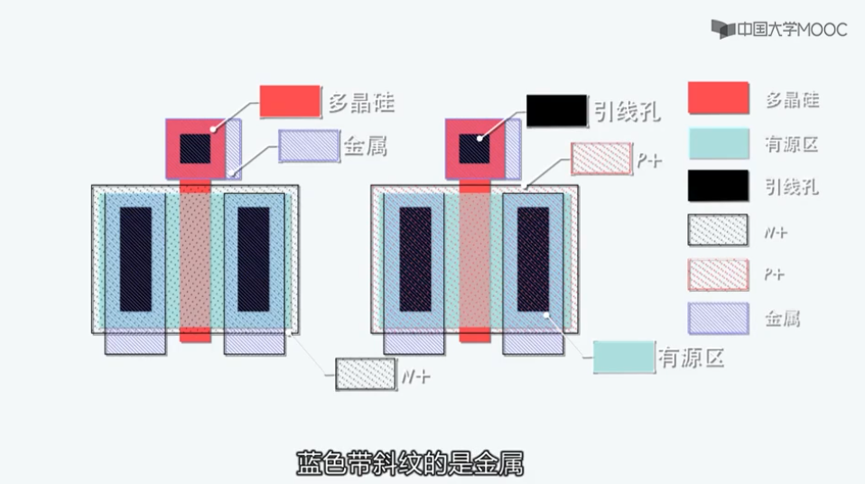
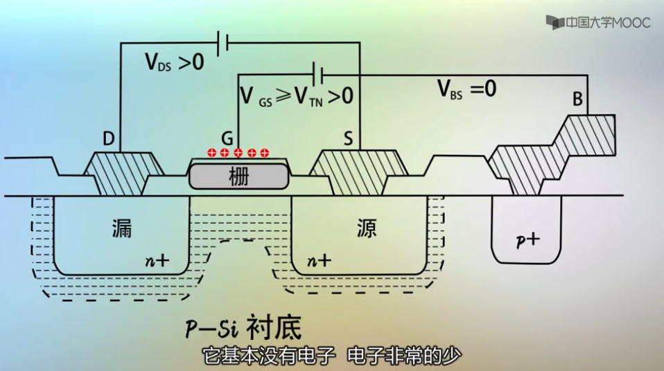
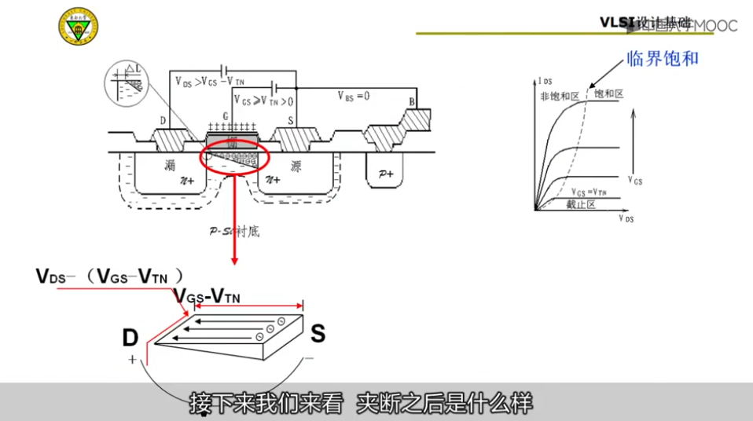
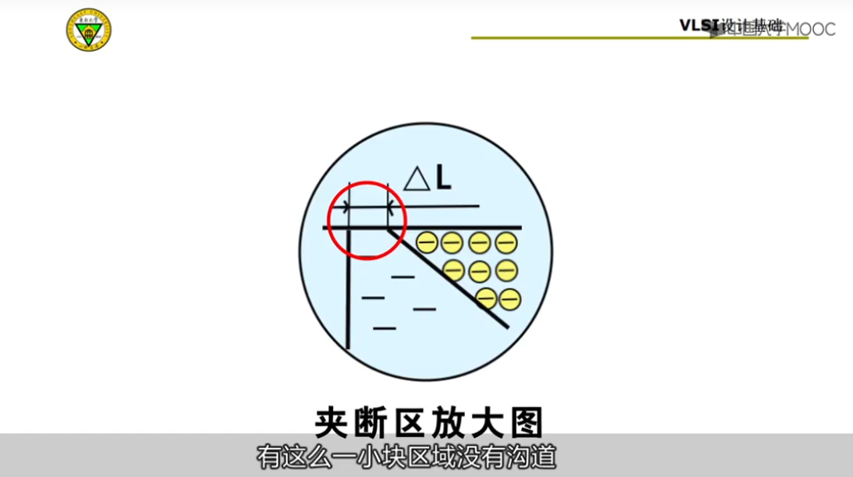
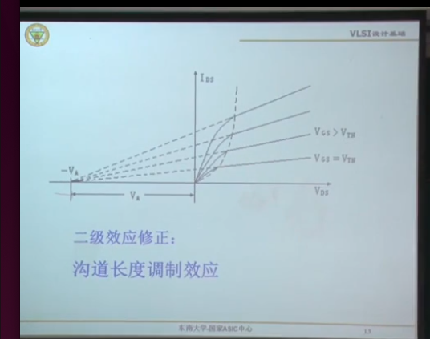
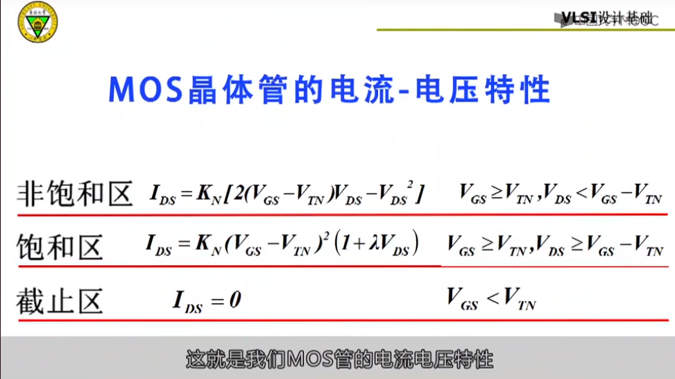
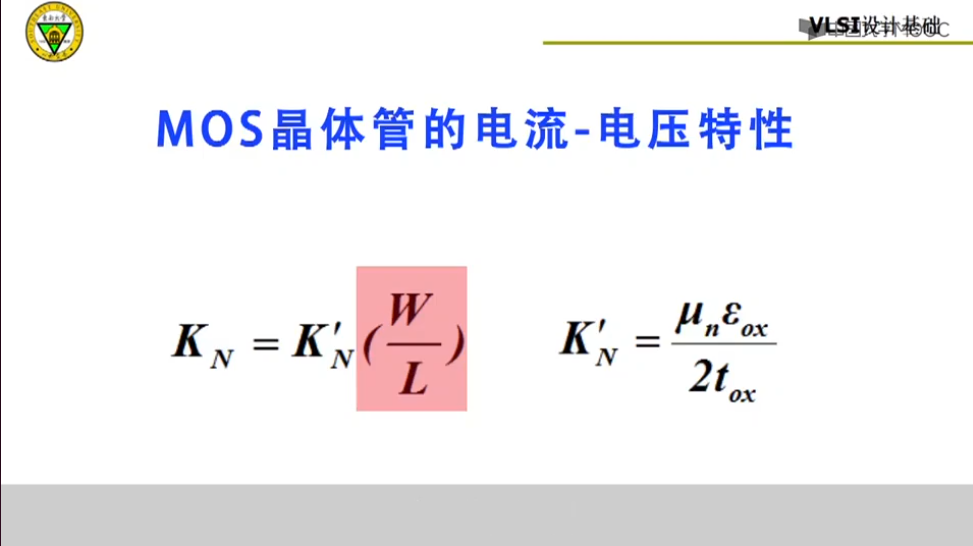

- [MOS管](#mos管)
  - [NMOS管](#nmos管)

# MOS管

## NMOS管

漏极：D 源极：S 栅极：G

没加电的时候不分源漏，那边加的电压大那边是漏。

载流子永远是源端到漏端。

沟道的产生是因为存在电压差。(VGS 足够大)

>>1)截止区: VGS < VTN（阈值电压）  

>>2)线性区: VGS >=VTN , VDS < VGS -    VTN 。满足条件：VDS小.VGS>VTN保证了沟道。  
>>>>原理：VDS变大，会使沟道从均匀慢慢变窄（D漏端）(梯形)，S保持不变。当漏端只有一个点，就叫夹断点。此时有一段区域沟道没有了。（VGD电压差变小）  
>>>>沟道夹断条件: VDS >=VGS - VTN 等价 VDG <= VTN  

>>3)饱和区:VGS >= VTN, VDS >= VGS - VTN特点：电流不变  

夹断区示意图：  

  

  

电流-电压特性：
   
  

注意：（饱和区）当有沟道长度效应的时候才需要考虑后面的因子。  
